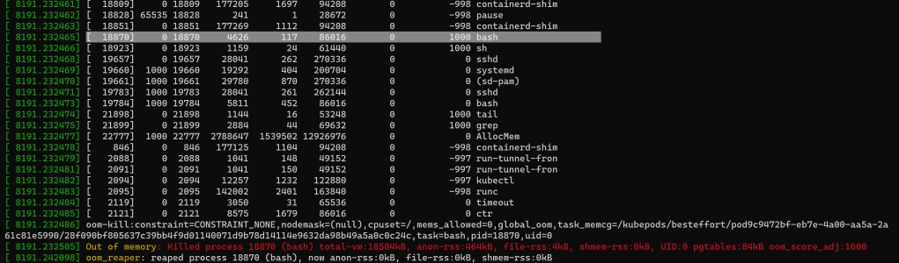

# Out-of-memory (OOM) in Kubernetes – Part 4: Pod evictions, OOM scenarios and flows leading to them

> - [https://mihai-albert.com/2022/02/13/out-of-memory-oom-in-kubernetes-part-1-intro-and-topics-discussed/](https://mihai-albert.com/2022/02/13/out-of-memory-oom-in-kubernetes-part-1-intro-and-topics-discussed/)
> - [https://mihai-albert.com/2022/02/13/out-of-memory-oom-in-kubernetes-part-2-the-oom-killer-and-application-runtime-implications/](https://mihai-albert.com/2022/02/13/out-of-memory-oom-in-kubernetes-part-2-the-oom-killer-and-application-runtime-implications/)
> - [https://mihai-albert.com/2022/02/13/out-of-memory-oom-in-kubernetes-part-3-memory-metrics-sources-and-tools-to-collect-them/](https://mihai-albert.com/2022/02/13/out-of-memory-oom-in-kubernetes-part-3-memory-metrics-sources-and-tools-to-collect-them/)
> - [https://mihai-albert.com/2022/02/13/out-of-memory-oom-in-kubernetes-part-4-pod-evictions-oom-scenarios-and-flows-leading-to-them/](https://mihai-albert.com/2022/02/13/out-of-memory-oom-in-kubernetes-part-4-pod-evictions-oom-scenarios-and-flows-leading-to-them/)

This is part 4 of a four-part article that looks into what happens in detail when Kubernetes runs into out-of-memory (OOM) situations and how it responds to them. You can find the article’s full table of contents [here](https://mihai-albert.com/2022/02/13/out-of-memory-oom-in-kubernetes-part-1-intro-and-topics-discussed/#table-of-contents) as part of the [first post](https://mihai-albert.com/2022/02/13/out-of-memory-oom-in-kubernetes-part-1-intro-and-topics-discussed/).

## Pod evictions

What are pod evictions in Kubernetes? It’s an automatic action that Kuwbernetes takes on a node experiencing low resources whereby one or more pods are terminated in an effort to reduce the pressure. As this article deals with memory, we’ll talk exclusively about memory as the resource a node is experiencing a shortage of.

Previously (in [OOM killer](https://mihai-albert.com/2022/02/13/out-of-memory-oom-in-kubernetes-part-2-the-oom-killer-and-application-runtime-implications/#oom-killer) and [Cgroups and the OOM killer](https://mihai-albert.com/2022/02/13/out-of-memory-oom-in-kubernetes-part-2-the-oom-killer-and-application-runtime-implications/#cgroups-and-the-oom-killer)) we’ve seen how the OOM killer will ensure the available memory on the node doesn’t go below critical levels. So it’s quite apparent these 2 mechanisms – pod evictions and the OOM killer – have the same goal: ensure the node doesn’t end up without any memory left. So why have both of them active at the same time?

Kubernetes doesn’t have direct control on the OOM killer. Remember that it’s a Linux kernel feature. What Kubernetes does – and to be more specific the Kubelet on each node – is adjust the “knobs” for the OOM killer: e.g. by setting different values for `oom_score_adj` it alters the latter’s behavior as to which victim gets chosen first. This still doesn’t answer the initial question of why are both mechanisms needed, but only goes to tell that Kubernetes has to “live with” the OOM killer. Let’s go ahead for now, and as we get further along the answer will gradually appear.


But when does the Kubelet decide to evict pods? “Low memory situation” is a rather fuzzy concept: we’ve seen that the OOM killer acts at the system level (in [OOM killer](https://mihai-albert.com/2022/02/13/out-of-memory-oom-in-kubernetes-part-2-the-oom-killer-and-application-runtime-implications/#oom-killer)) when memory is critically low (essentially almost nothing left), so it follows that pod evictions should happen before that. But when exactly?

As per the [official Kubernetes docs](https://kubernetes.io/docs/tasks/administer-cluster/reserve-compute-resources/#node-allocatable) “*‘Allocatable’ on a Kubernetes node is defined as the amount of compute resources that are available for pods*“. This feature is enabled by default via the `--enforce-node-allocatable=pods` and once the memory usage for the pods crosses this value, the Kubelet triggers the eviction mechanism: “*Enforcement is performed by evicting pods whenever the overall usage across all pods exceeds ‘Allocatable’*” as documented [here](https://kubernetes.io/docs/tasks/administer-cluster/reserve-compute-resources/#enforcing-node-allocatable).

We can easily see the value by checking the output of `kubectl describe node`. Here’s how the section of interest looks like for one of nodes of the Kubernetes cluster used throughout this article (a 7-GiB Azure DS2_v2 node):

```
.....``Addresses:`` ``Hostname:  aks-agentpool-20086390-vmss000043`` ``InternalIP: 10.240.0.4``Capacity:`` ``attachable-volumes-azure-disk: 8`` ``cpu:              2`` ``ephemeral-storage:       129900528Ki`` ``hugepages-1Gi:         0`` ``hugepages-2Mi:         0`` ``memory:             7120616Ki`` ``pods:              110``Allocatable:`` ``attachable-volumes-azure-disk: 8`` ``cpu:              1900m`` ``ephemeral-storage:       119716326407`` ``hugepages-1Gi:         0`` ``hugepages-2Mi:         0`` ``memory:             4675304Ki`` ``pods:              110``System Info:`` ``Machine ID:         a9f54faac15846a6866920a1010ee9d7``.....
```

Let’s see a pod eviction in action (turn on high-quality to see the console messages):

<iframe title="VideoPress Video Player" aria-label="VideoPress Video Player" width="994" height="531" src="https://video.wordpress.com/embed/MEvBU0zt?cover=1&amp;preloadContent=metadata&amp;useAverageColor=1&amp;hd=1" frameborder="0" allowfullscreen="" data-resize-to-parent="true" allow="clipboard-write" style="box-sizing: inherit; border: 0px; font-family: inherit; font-size: 15px; font-style: inherit; font-weight: inherit; margin: 0px 0px 1em; outline: 0px; padding: 0px; vertical-align: baseline; display: block; max-width: 100%;"></iframe>

Movie 1 – A pod eviction in Kubernetes

A Kubernetes pod is started that runs one instance of the leak memory tool. The pod’s [manifest](https://gist.githubusercontent.com/luckerby/7c3716e5b85a3163da0615c9f83bf68c/raw/707c80aa34b7e3e2f0973e4a8489e4df073e4045/PodManifest_eviction_sample) doesn’t specify any request or limit for the container running the app. The leak memory tool allocates (and touches) memory in blocks of 100 MiB until it reaches its set input parameter of 4600 MiB. The top left window is the raw output from the leak tool as it allocates, the right window tails the status of the pod while the window at the bottom is tailing messages emitted by the Kubelet. The leak tool successfully completes its run, which results in around 4700 MiB used in RAM – the sum of the 4600 MiB it allocated and around 100 MB for the underlying .NET runtime. But this value is slightly larger than the “allocatable” value for the node – which is just under 4600 MiB as seen in the `kubectl describe node` previously – and, since the `--enforce-node-allocatable=pods` default flag is used by the node’s Kubelet, moments later we see the Kubelet evicting the pod, with explicit messages of why and how it does so.

We could have even allocated a couple MiB less memory with the leak tool – so its overall RAM footprint would have been below the “allocatable” value and and we’d still have seen the same outcome. Why? Because there were other pods running already on that the node taking a bit over 200 MiB. You can actually see their list in the eviction message in the kernel logs (at 01:43, using high quality and slowing playback rate) which includes Grafana, kube-state-metrics, Prometheus node exporter, a couple of debug containers and some pods in the kube-system namespace.

If you’ll wait until the very end of the movie you’ll notice the moment when the Kubelet puts the node in a low-memory state.


### Allocatable

We’ve already seen the value for “allocatable” memory for our node configuration, and we know is significantly less than the overall capacity. Actually for our D2s\_v2 Azure Kubernetes Service (AKS) node, the “allocatable” value only represents only about **65% of the memory capacity on this 7 GB memory node**. It does feel like a serious waste at first glance, but let’s not ask just yet why is this mechanism used in the first place, but instead focus on how is the value for “allocatable” memory computed.

The Microsoft docs [Resource reservations](https://docs.microsoft.com/en-us/azure/aks/concepts-clusters-workloads#resource-reservations) tell about 2 values that are taken into account when putting aside memory not to be used by pods:

- 750 MiB as the available node memory threshold that if reached will cause pod evictions
- a formula that decides how much memory is set aside for the Kubernetes system daemons (which includes the Kubelet). For our test cluster with 7 GiB nodes this value adds up to 1.6 GiB (0.25 x 4 GiB + 0.2 x 3 GiB), which is equivalent to 1638 MiB

Keep in mind that the values and formula above are valid for AKS at the time of this writing (Dec 2021), as the test cluster used throughout this article is running on AKS. Other providers (AWS, GCP, etc) use their own formula and values. Have a look at this article [Allocatable memory and CPU in Kubernetes Nodes](https://learnk8s.io/allocatable-resources) for a comparison between the major providers (note that the article tells of 100 MB reserved for the OS which is not the case in AKS as of Dec 2021 at least).

But how does the Kubelet know of those values above? They are part of the input parameters the Kubelet receives when started (a full list of those parameters is available [here](https://kubernetes.io/docs/reference/command-line-tools-reference/kubelet/)). Here’s the full command line for the Kubelet running on one of the nodes of our test cluster (obtained with `ps aux | grep kubelet` from within a debug container), with the values of interest highlighted:

```
`/usr/local/bin/kubelet --enable-server --node-labels=kubernetes.azure.com/role=agent,agentpool=agentpool,kubernetes.azure.com/agentpool=agentpool,storageprofile=managed,storagetier=Premium_LRS,kubernetes.azure.com/storageprofile=managed,kubernetes.azure.com/storagetier=Premium_LRS,kubernetes.azure.com/os-sku=Ubuntu,kubernetes.azure.com/cluster=MC_rg-rt-main-we_aks-rt-main-we_westeurope,kubernetes.azure.com/mode=system,kubernetes.azure.com/node-image-version=AKSUbuntu-1804gen2containerd-2021.09.28 --v=2 --volume-plugin-dir=/etc/kubernetes/volumeplugins --container-runtime=remote --runtime-request-timeout=15m --container-runtime-endpoint=unix:///run/containerd/containerd.sock --address=0.0.0.0 --anonymous-auth=false --authentication-token-webhook=true --authorization-mode=Webhook --azure-container-registry-config=/etc/kubernetes/azure.json --cgroups-per-qos=true --client-ca-file=/etc/kubernetes/certs/ca.crt --cloud-config=/etc/kubernetes/azure.json --cloud-provider=azure --cluster-dns=10.0.0.10 --cluster-domain=cluster.local --enforce-node-allocatable=pods --event-qps=0 **--eviction-hard=memory.available<750Mi**,nodefs.available<10%,nodefs.inodesFree<5% --feature-gates=CSIMigration=true,CSIMigrationAzureDisk=true,RotateKubeletServerCertificate=true --image-gc-high-threshold=85 --image-gc-low-threshold=80 --image-pull-progress-deadline=30m --keep-terminated-pod-volumes=false **--kube-reserved=cpu=100m,memory=1638Mi** --kubeconfig=/var/lib/kubelet/kubeconfig --max-pods=110 --network-plugin=cni --node-status-update-frequency=10s --non-masquerade-cidr=0.0.0.0/0 --pod-infra-container-image=mcr.microsoft.com/oss/kubernetes/pause:3.5 --pod-manifest-path=/etc/kubernetes/manifests --pod-max-pids=-1 --protect-kernel-defaults=true --read-only-port=0 --resolv-conf=/run/systemd/resolve/resolv.conf --rotate-certificates=false --streaming-connection-idle-timeout=4h --tls-cert-file=/etc/kubernetes/certs/kubeletserver.crt --tls-cipher-suites=TLS_ECDHE_ECDSA_WITH_AES_128_GCM_SHA256,TLS_ECDHE_RSA_WITH_AES_128_GCM_SHA256,TLS_ECDHE_ECDSA_WITH_CHACHA20_POLY1305,TLS_ECDHE_RSA_WITH_AES_256_GCM_SHA384,TLS_ECDHE_RSA_WITH_CHACHA20_POLY1305,TLS_ECDHE_ECDSA_WITH_AES_256_GCM_SHA384,TLS_RSA_WITH_AES_256_GCM_SHA384,TLS_RSA_WITH_AES_128_GCM_SHA256 --tls-private-key-file=/etc/kubernetes/certs/kubeletserver.key`
```

Let’s discuss the 2 highlighted flags next.

### **`--kube-reserved`**

The flag is described in the official docs [https://kubernetes.io/docs/tasks/administer-cluster/reserve-compute-resources/#kube-reserved](https://kubernetes.io/docs/tasks/administer-cluster/reserve-compute-resources/#kube-reserved) as “_kube-reserved is meant to capture resource reservation for kubernetes system daemons like the kubelet, container runtime, node problem detector, etc. It is not meant to reserve resources for system daemons that are run as pods. kube-reserved is typically a function of pod density on the nodes_“

But where is this flag’s value used? The official Kubernetes documentation makes it clear in this image:

Figure 1 – Node capacity distribution. Source: Kubernetes documentation [https://kubernetes.io/docs/tasks/administer-cluster/reserve-compute-resources/#node-allocatabl](https://kubernetes.io/docs/tasks/administer-cluster/reserve-compute-resources/#node-allocatable)

As AKS doesn’t use currently the `--system-reserved` flag, the allocatable value for memory is computed as the total memory capacity minus the values for `--kube-reserved` and `--eviction-hard` flags. Running the numbers for our DS2_v2 AKS node, we have:

- 7120616 KiB total memory available, equivalent to 6953 MiB. This is seen in the *kubectl describe node* output shown previously
- minus 1638 MiB, the value for –kube-reserved
- minus 750 MiB, the value for –eviction-hard

This comes down to 4565 MiB, equivalent to the 4675304 KiB value seen in the `kubectl describe node` output earlier.

Let’s now look at the “kubepods” cgroup, which is the parent for all the pods’ cgroups running on the node. From a debug container on the respective node:

- *# cd /sys/fs/cgroup/memory/kubepods*
- *# cat memory.limit_in_bytes*
- *5573943296*

The bytes value converted to MiB gives out 5315 MiB. This is exactly the sum of 750 MiB – which we’ve seen is the hard eviction thresholds – plus the allocatable memory value for the node (4365 MiB).

Although this article – nor the test Kubernetes cluster – won’t make use of it, be aware that one can use the `--kube-reserved-cgroup` flag to enforce the limit for `--kube-reserved` in the sense that Kubelet, container runtime and friends are prohibited from going over the `--kube-reserved` value. That’s implemented with a cgroup created specifically for them that has the respective limit set, just as it’s set for the pods’ parent cgroup. As we’ve seen at length, when the memory usage increases above the limit for the cgroup (and nothing can be reclaimed at that point) the OOM killer will step in, obviously with disastrous consequences for the respective Kubernetes components. The `--kube-reserved-cgroup` flag acts as a protection for the pods “allocatable” area so that Kubernetes daemons don’t start consuming too much memory; in our AKS test cluster with DS2_v2 nodes that would mean the Kubernetes daemons won’t be allowed to consume in excess of 1638 MiB.

### **Eviction mechanism at a glance**

How does all we’ve seen in the previous section reflect in the eviction mechanism? Pods are allowed to use memory as long as the overall usage across all pods is less than the allocatable memory value. Once this threshold is exceeded, you’re at the mercy of the Kubelet – as every 10s it checks the memory usage against the defined thresholds. Should the Kubelet decide an eviction is necessary the pods are sorted based on an internal algorithm described in [Pod selection for kubelet eviction](https://kubernetes.io/docs/concepts/scheduling-eviction/node-pressure-eviction/#pod-selection-for-kubelet-eviction) – which includes QoS class and individual memory usage as factors – and evicts the first one. The Kubelet continues evicting pods as long as thresholds are still being breached. Should one or more pods allocate memory so rapidly that the Kubelet doesn’t get a chance to spot it inside its 10s window, and the overall pod memory usage attempts to grow over the sum of allocatable memory plus the hard eviction threshold value, then the kernel’s OOM killer will step in and kill one or more processes inside the pods’ containers, as we’ve seen at length in the [Cgroups and the OOM killer](https://mihai-albert.com/2022/02/13/out-of-memory-oom-in-kubernetes-part-2-the-oom-killer-and-application-runtime-implications/#cgroups-and-the-oom-killer) section.

The official Kubernetes article referenced above is full of interesting details. For example, how do we know that the Kubelet checks for evictions by default every 10s? The article states it explicitly: “_The kubelet evaluates eviction thresholds based on its configured housekeeping-interval which defaults to 10s”._ Besides, we’ll get to see the Kubelet logging relevant data every 10s in the scenarios we’ll look at further down.

Once a pod eviction occurs, the node where this happened will enter a low-memory state. How long will it stay in this state? The article makes this clear: “_the eviction-pressure-transition-period flag, which controls how long the kubelet must wait before transitioning a node condition to a different state. The transition period has a default value of 5m_“. Our AKS test cluster’s Kubelet doesn’t specify this flag, as such it’ll use the default 5 minute interval. Here’s how events will look like once a node encounters the memory pressure state:

`Normal   NodeHasInsufficientMemory  6m3s               kubelet     Node aks-agentpool-20086390-vmss00003c status is now: NodeHasInsufficientMemory`

`Normal   NodeHasSufficientMemory    50s (x3 over 19m)  kubelet     Node aks-agentpool-20086390-vmss00003c status is now: NodeHasSufficientMemory`

This duration has important consequences, as once a pod is evicted, you might not to be able to schedule it – or other pods for that matter – there again for the next 5 minutes. Which are the pods affected? The [Taints and Toleration](https://kubernetes.io/docs/concepts/scheduling-eviction/taint-and-toleration/#taint-nodes-by-condition) article explains: “_The control plane also adds the node.kubernetes.io/memory-pressure toleration on pods that have a QoS class other than BestEffort. This is because Kubernetes treats pods in the Guaranteed or Burstable QoS classes (even pods with no memory request set) as if they are able to cope with memory pressure, while new BestEffort pods are not scheduled onto the affected node_“.


### Node Allocatable, illustrated

With the information and the numbers we have so far for the 7-GiB nodes our AKS cluster has we can draw a quick diagram that shows a conceptual view of the overall pod memory usage:


[](https://luckerbyhome.files.wordpress.com/2022/02/node_allocatable_diagram.png)*Figure 2 – Node Allocatable and node memory capacity distribution for a 7-GiB DS2_v2 AKS node*

The green arrow shows the direction memory is filled as pods keep allocating. Keep in mind that the diagram captures how the overall pod memory usage evolves. It’s only this metric that’s relevant here, and you can think of it as a vertical line being pushed to the right (as pods’ memory usage increases) or pulled to the left (as pods’ memory usage decreases). Don’t take the meaning any further, for example to make any assumption about which areas in memory the pods use, as that will lead to wrong conclusions. So no, physically the pods don’t consume memory near the “beginning” and the Kubelet is only stuck using memory towards the “end”.

From the standpoint of preventing excessive pod memory usage overall things works great. Let’s review the process for our DS2_v2 AKS node: as long as the pods’ aggregated usage is within the “allocatable” amount, all is well. Pods start being evicted once their overall memory usage goes above 4565 MiB. On the diagram above that would be anytime the pod’s usage goes into the red hatched area. As the Kubelet only checks eviction thresholds every 10s, the overall pod memory usage could well grow past that limit in a short period of time and hit the 5315 MiB threshold (the vertical red line on the diagram). When this one gets hit the OOM killer will terminate one or more processes inside some of the pods’ containers. Whatever large quantities of memory the pods might try to allocate in a very short time won’t matter this time, as the kernel 1) watches over the cgroup limits and 2) it’s the one providing the memory to be used by processes in the first place. It’s also the kernel that invokes the OOM killer, which guarantees that the memory usage for the pods won’t ever grow past the 5315 MiB hard limit. So on the diagram the pods’ memory usage will never get to the black crosshatch area.

You don’t see any area marked for the OS or any of its components on the diagram. Even more, AKS doesn’t use the `--system-reserved` flag as we’ve seen in the Kubelet [command line](https://mihai-albert.com/2022/02/13/out-of-memory-oom-in-kubernetes-part-4-pod-evictions-oom-scenarios-and-flows-leading-to-them/#kubelet-command-line) previously. Yet the OS as well as its components (including system daemons) do exist and use up memory on every node. It’s just that our conceptual diagram only renders what the Kubelet input parameters specify. As long as the OS, its components along with Kubelet and its dependencies can “fit” their combined memory usage inside the black crosshatched area, then all is well and the pods can use their “allocatable” amount just fine without the worry of being evicted.

### Metric watched for during pod evictions

We’re talking about memory usage a lot, but what exactly do we mean by that? Take the “allocatable” amount of memory that pods can use overall: for our DS2_v2 AKS nodes that is 4565 MiB. Is it when the RAM of a node has 4565 MiB filled with data for the pods means it’s right next to the threshold of starting evictions? In other words, what’s the metric used?

Back in the [Metrics values](https://mihai-albert.com/2022/02/13/out-of-memory-oom-in-kubernetes-part-3-memory-metrics-sources-and-tools-to-collect-them/#metrics-values) section we’ve seen there are quite a few metrics that track memory usage per type of object. Take the container object, for which cAdvisor will return half a dozen metrics such as `container_memory_rss`, `container_memory_usage_bytes`, `container_memory_working_set_bytes` etc.

So when the Kubelet looks at the eviction thresholds, what memory metric is it actually comparing against? The official [Kubernetes documentation](https://kubernetes.io/docs/concepts/scheduling-eviction/node-pressure-eviction/#eviction-signals) provides the answer to this: it’s the working set. There’s even a small script included there that shows the computations for deciding evictions at the node level. Essentially it computes the working_set metric for the node as the root memory cgroup’s `memory.usage_in_bytes` minus the `inactive_file` field in the root memory cgroup’s `memory.stat` file.

And that is the exact formula we’ve come across in the past when we’ve looked at how are the node metrics computed through the Resource Metrics API (see the last row of the [cAdvisor metrics table](https://mihai-albert.com/2022/02/13/out-of-memory-oom-in-kubernetes-part-3-memory-metrics-sources-and-tools-to-collect-them/#cadvisor-table)). Which is good news, as we’ll be able to plot the same exact metrics used in Kubelet’s eviction decisions on our charts in the following sections, by choosing the metric source which currently gives almost all of the memory metrics: cAdvisor.

As a side-note, if you want to see that the Kubelet’s code reflects what was said above – both for the “allocatable” threshold as well as the `--eviction-hard` one – have a look at [What is the memory metric that the Kubelet is using when making eviction decisions?](https://mihai-albert.com/2022/02/13/out-of-memory-oom-in-kubernetes-part-3-memory-metrics-sources-and-tools-to-collect-them/#what-is-the-memory-metric-that-the-kubelet-is-using-when-making-eviction-decisions).

### OOM Scenario #2: Pods’ memory usage exceeds node’s “allocatable” value

Let’s consider a pod that allocates memory constantly using our memory leak tool, with no requests or limits set for the container running the app. We’ve seen this scenario already in the [first movie](https://mihai-albert.com/2022/02/13/out-of-memory-oom-in-kubernetes-part-4-pod-evictions-oom-scenarios-and-flows-leading-to-them/#pod-eviction-movie) further up, but now Kubelet’s logging level is to be increased (from the default `--v=2` to —`v=4`) and the system logs shown are to be filtered for those entries that contain both “memory” and “evict” strings. This way we’re going to see both evictions and the regular check that the Kubelet performs against the defined memory thresholds every 10s.

<iframe title="VideoPress Video Player" aria-label="VideoPress Video Player" width="994" height="531" src="https://video.wordpress.com/embed/bOhytwVu?cover=1&amp;preloadContent=metadata&amp;useAverageColor=1&amp;hd=1" frameborder="0" allowfullscreen="" data-resize-to-parent="true" allow="clipboard-write" style="box-sizing: inherit; border: 0px; font-family: inherit; font-size: 15px; font-style: inherit; font-weight: inherit; margin: 0px 0px 1em; outline: 0px; padding: 0px; vertical-align: baseline; display: block; max-width: 100%;"></iframe>

*Movie 2 – Another pod eviction, but this time thresholds checks are listed*

The memory leak tool allocates and touches memory in blocks of 100 MiB every 6 seconds (pod manifest is [here](https://gist.githubusercontent.com/luckerby/385a8b050121c3198d0f6e36e7fd44b8/raw/91bb09546f0eaa9938afdfcc6a8273318398486b/PodManifest_eviction_sample_2)). There’s no target memory value supplied to the tool, as such it will run as long as it’s possible. The top left window is the raw output from the memory leak tool as it allocates, the right window tails the status of the pod while the window at the bottom is tailing system messages of interest.

The start is uneventful, as the memory leak tool isn’t yet started. As such the messages seen coming from the Kubelet – 2 every 10 seconds – capture steady values for the available allocatable memory for the pods and the node memory available respectively. It’s worth noting that the allocatable memory values refer not to the “allocatable” value in the sense seen in `kubectl describe node` output (4565 MiB for a 7-GiB AKS DS2\_v2 node), but to the overall limit set for the `kubepods` memory cgroup (5315 MiB for a 7-GiB AKS DS2\_v2 node) as discussed in the [`--kube-reserved` section](https://mihai-albert.com/2022/02/13/out-of-memory-oom-in-kubernetes-part-4-pod-evictions-oom-scenarios-and-flows-leading-to-them/#kube-reserved).

The pod is then created that starts the memory leak tool, and for 5 minutes memory is allocated at a steady pace. At 05:07 the Kubelet detects that the value it tracks for all the pod’s allocatable memory dropped below the hard eviction threshold of 750 MiB and – since the `--enforce-node-allocatable=pods` default flag is used by the node’s Kubelet – evicts the memory leak tool pod, with explicit messages describing what it’s doing.

The last logs show that the node is marked as being under memory pressure.

As a side-note, unlike [the previous movie](https://mihai-albert.com/2022/02/13/out-of-memory-oom-in-kubernetes-part-4-pod-evictions-oom-scenarios-and-flows-leading-to-them/#pod-eviction-movie) of a pod eviction, this time you no longer see the list of pods ranked for eviction as that specific message no longer matches our grep filter.

Let’s see what Grafana tells us:

[](https://luckerbyhome.files.wordpress.com/2022/02/grafana_pod_evicted_allocatable_breached.png)

Figure 3 – Node and pods’ memory usage, along with node free memory for the the current OOM scenario

There are 3 metrics tracked on this chart:

- Node available memory (green): node’s memory capacity minus node memory usage. Prometheus metric formula: `<node_memory_capacity> - container_memory_working_set_bytes{id="/",instance=<node>}`
- Node memory usage (yellow): the working set size of all the processes – including those inside containers – running on that node. Prometheus metric formula: `container_memory_working_set_bytes{id="/",instance=<node>}`. See the [Resource Metrics API endpoint table](https://mihai-albert.com/2022/02/13/out-of-memory-oom-in-kubernetes-part-3-memory-metrics-sources-and-tools-to-collect-them/#resource-metrics-endpoint-table) for details
- Overall pod memory usage (blue): the sum of the working set size for all containers. Doesn’t include the pause container usage, but that’s low anyway (~500 KiB per pod). Prometheus metric formula: `sum(container_memory_working_set_bytes{container!="",instance=<node>})`

The red line is the allocatable memory value (4565 MiB), and the red dark area above it (4565 MiB -> 5315 MiB) is where evictions occur once the overall pod memory usage enters it. As such the marked threshold is only relevant for the blue metric. The black area above it (5315 MiB ->) is where the overall pod memory usage will never get to be, as the OOM killer will not allow any of the pods’ containers’ processes to take it above the `kubepods` memory cgroup limit (5315 MiB) as we’ve seen in the [–kube-reserved](https://mihai-albert.com/2022/02/13/out-of-memory-oom-in-kubernetes-part-4-pod-evictions-oom-scenarios-and-flows-leading-to-them/#kube-reserved) section.

As there are already some pods running on this node, the overall pod memory usage starts from a small non-zero value (around 130 MiB). Then both node memory and overall pod memory usages go up at the same rate, which is normal as there’s nothing else on the node doing significant allocations. Once the memory leak tool pod eviction occurs – and its memory is reclaimed by the node – the metrics eventually return to their original values.

Should the last data point for the blue metric right before the eviction supposed to be inside the red area? Unlikely, as the install for Prometheus scrapes its targets every 30s (the default value), while Kubelet runs its eviction checks every 10s. So despite seeing in the logs in the movie above that the overall pod memory usage did indeed went over the allocatable value, the chart doesn’t get to display it.

Yet it’s quite visible from the tooltip that the next value for the blue metric would have been 0.5 GiB higher than the 4.13 GiB listed, taking it above the allocatable value (4565 MiB) by around 200 MiB.

But there are some things that don’t look quite right in this chart. First, the overall pod memory usage is seen remaining flat for about 5 minutes right after the pod is evicted. This can’t be right, as the pod gets evicted fairly fast. The reason for this? The blue metric is actually the sum of all pods’ containers. Since our pod is evicted, its containers are terminated and the memory values emitted for them suddenly stop. However Prometheus will keep the suddenly disappeared metric with its last value for 5 minutes by default (we discussed this back in this [Prometheus](https://mihai-albert.com/2022/02/13/out-of-memory-oom-in-kubernetes-part-3-memory-metrics-sources-and-tools-to-collect-them/#prometheus-tools-section) section). Why aren’t the other 2 metrics affected? They both track the root memory cgroup statistics, whose value is updated immediately after the evicted pod’s container is stopped.

Secondly, there are consecutive timestamps where all the metrics values stay exactly the same around the eviction time (22:03:25). Thirdly, the growth rate of the overall pod memory usage appears to be “choppy” at times, but this is probably linked to the previous point. I’m not quite sure what causes these last 2 points, but I do suspect a glitch with cAdvisor and/or Prometheus.

### `--eviction-hard`

Kubernetes’ own plan on allowing only a limited amount of the node’s memory to the pods works just fine in protecting from any rogue pod from causing harm to other pods or to the node itself. But plans don’t always go as expected. One problem is that there’s other actors on that node, and they also use the overall finite amount of memory installed on the node. Assume for example that the OS starts consuming significantly more memory. Even though the Kubelet sets the limits for how much memory pods can use overall, it doesn’t *guarantee* that memory. By default there’s nothing preventing the OS – or other processes running on top of it – to start encroaching in Kubernetes “allocatable” territory. And when that happens pods will be evicted far earlier: despite the overall pod memory usage way below the “allocatable” value, there’s another threshold that gets hit instead: the eviction threshold.

The `--eviction-hard` flag is described in the [official docs](https://kubernetes.io/docs/tasks/administer-cluster/reserve-compute-resources/#kube-reserved) as triggering the Kubelet to attempt “*to evict pods whenever memory availability on the node drops below the reserved value*“. If evicting one pod doesn’t get the available memory away from the `--eviction-hard` threshold, Kubelet will continue evicting pods.

Let’s see the effect of this flag next.


### OOM Scenario #3: Node available memory drops below the `--eviction-hard` flag value

How can we test the effect of available memory dropping below the value for the `--eviction-hard` flag’s value? The big problem is that for our test cluster the pods can only consume that much memory. There’s no way to cross the eviction threshold by allocating inside a pod since – at least with default values – the pod is either evicted or at least one of its containers will be terminated by the OOM killer before there’s just `--kube-reserved` memory left on the node (default 1638 MiB on a 7 GB AKS DS2_v2 node), which is earlier than the `--eviction-hard` flag (default 750 MiB on a DS2_v2 node). What we need is something that’s not capped in regards to the memory it can use.

One way of doing that is to allocate memory in a regular process running on the node itself. So instead of running the memory leak tool inside a pod as we’ve done so far throughout the article, we’ll run it as a standalone application directly on the node. How to do this is laid out in [How to SSH into a Kubernetes Linux node and run apps directly on the OS](https://mihai-albert.com/2022/02/13/out-of-memory-oom-in-kubernetes-part-4-pod-evictions-oom-scenarios-and-flows-leading-to-them/#how-to-ssh-into-an-aks-linux-node-and-run-apps-directly-on-it).

We’ll increase the Kubelet’s logging level (from the default `--v=2` to `--v=4`) on our target node so that we can see the regular checks that the Kubelet performs against the defined memory thresholds for both node available memory and pod allocatable memory every 10s. The query run against the system logs will be `tail /var/log/syslog -f | grep -i '(?=.*evict)(?=.*memory).*' -P`

<iframe title="VideoPress Video Player" aria-label="VideoPress Video Player" width="994" height="531" src="https://video.wordpress.com/embed/z1onJOwg?cover=1&amp;preloadContent=metadata&amp;useAverageColor=1&amp;hd=1" frameborder="0" allowfullscreen="" data-resize-to-parent="true" allow="clipboard-write" style="box-sizing: inherit; border: 0px; font-family: inherit; font-size: 15px; font-style: inherit; font-weight: inherit; margin: 0px 0px 1em; outline: 0px; padding: 0px; vertical-align: baseline; display: block; max-width: 100%;"></iframe>

*Movie 3 – Pod evictions when the node available memory drops below the hard eviction threshold*

Let’s analyze what goes on in detail. The memory leak tool – once started – allocates (and touches, indicated by the parameter `-f 1`) memory in blocks of 100 MiB (parameter `-m`) every 6 seconds (parameter `-e` in milliseconds). There’s no target memory value supplied to the tool (parameter for the maximum amount of memory to allocate `-x` is 0 meaning infinite), as such it will run as long as it’s possible. The top left window is the raw output from the memory leak tool as it allocates directly on the node, while the window at the bottom is tailing system messages of interest.

The start is uneventful, as the memory leak tool isn’t yet started. As such the messages seen coming from the Kubelet – 2 every 10 seconds – capture steady values for the available allocatable memory for the pods and the node memory available respectively. It’s worth noting that the allocatable memory values refer not to the “allocatable” value in the sense seen in `kubectl describe node` output (4565 MiB for a 7-GiB AKS DS2_v2 node), but to the overall limit set for the kubepods memory cgroup (5315 MiB for a 7-GiB AKS DS2_v2 node) as discussed in the [–kube-reserved section](https://mihai-albert.com/2022/02/13/out-of-memory-oom-in-kubernetes-part-4-pod-evictions-oom-scenarios-and-flows-leading-to-them/#kube-reserved) previously.

Once the memory leak tool is started, it allocates memory for more than 5 minutes at a steady pace.

Let’s have a look at what goes on. First, note how the allocatable memory reported by the Kubelet every 10s doesn’t drop in any significant way, as the memory leak tool isn’t running as a pod and the few pods running on the node (Grafana/Prometheus and a few in the kube-system namespace) don’t have any significant memory activity. The overall available memory reported instead does go down continuously – as we’d expect.

At 05:52 the Kubelet detects that the value it tracks for the node’s available memory dropped below the hard eviction threshold of 750 MiB. It marks the node as being under memory pressure and starts to take corrective measures.

Prometheus node exporter gets evicted – twice. The sole container inside this pod doesn’t have any request or limits set, which makes it a BestEffort from a QoS standpoint, and the Kubelet targets it for eviction ahead of Prometheus itself and Grafana that are running on the same node. Luckily the memory leak tool running directly on the node consumes so much memory that it gets stopped, which prevents the Kubelet from evicting any more pods.

As the node memory vanishes, thing don’t look good for the Kubelet either. After the first eviction, notice the memory statistics that the Kubelet writes in the logs aren’t seen in the bottom console for about 30s. It then evicts the recently started instance of the node exporter (evicted previously), after which more than 1 minute passes before it writes anything new in the system logs. The debug container that’s used to connect to the node and sends back console output (top left window) is stuck for 50s before giving a hint that the OOM killer acted.

You would assume that what takes down the memory leak tool running directly on the node is the OOM killer that spots it as the bulkiest task. After all we do get the same telltale sign of “Killed” in the console output, exactly as when we discussed the OOM killer at the system level ([movie 1](https://mihai-albert.com/2022/02/13/out-of-memory-oom-in-kubernetes-part-2-the-oom-killer-and-application-runtime-implications/#movie-1) back in section [OOM killer](https://mihai-albert.com/2022/02/13/out-of-memory-oom-in-kubernetes-part-2-the-oom-killer-and-application-runtime-implications/#oom-killer)). But that’s not what happens, as the kernel logs show that it’s not the memory leak tool running on the node that gets terminated initially. Instead the OOM killer first chooses the ssh client we used to connect from within the debug container to the node itself:

[](https://luckerbyhome.files.wordpress.com/2022/02/oom_killer_ssh_client_targeted.png)Figure 4 – ssh client gets terminated by the OOM killer

Then it chooses a bash session spawned inside one of the Kubernetes containers (most likely a debug one):

[](https://luckerbyhome.files.wordpress.com/2022/02/oom_killer_bash_targeted.png)Figure 5 – A bash process get terminated next by the OOM killer

You might find weird that processes that consume next to nothing get killed instead of the memory leak tool taking up almost all memory on the node. The last 2 printscreens show the disproportionate usage of the leak tool as opposed to the respective process terminated each time: the resident set size (RSS) is the 5th column, measured in memory pages (1 page=4 KiB). So why is the OOM killer avoiding the obvious elephant in the room? Notice the 1000 as the `oom_score_adj` (last numerical column in the task list in the last 2 printscreens) which is the result of the debug container having a QoS class of BestEffort (no requests nor any limit set for its only container) according to [the docs](https://kubernetes.io/docs/concepts/scheduling-eviction/node-pressure-eviction/#node-out-of-memory-behavior). This is what makes them very appealing to the OOM killer, despite their relative low memory usage. On the other hand, as the memory leak tool running on the node is a standard process, not started through Kubernetes, its `oom_score_adj` is 0.

To make matters more strange, the OOM killer never intervenes after the 2 instances mentioned above. The kernel logs never show it acting ever again. Therefore the memory leak tool dies as a result of a signal it received, most likely in connection with the ssh connection being terminated (see [this SO thread](https://stackoverflow.com/a/1876682/5853218) for more details).

Here’s the memory usage on the node during the test:

[](https://luckerbyhome.files.wordpress.com/2022/02/grafana_pod_evicted_lowmemory_breached.png)Figure 6 – The memory leak tool running as a process directly on top of the OS

There are 3 metrics tracked on this chart:

- Node available memory (green): node’s memory capacity minus node memory usage. Prometheus metric formula: `<node_memory_capacity> - container_memory_working_set_bytes{id="/",instance=<node>}`
- Node memory usage (yellow): the working set size of all the processes – including those inside containers – running on that node. Prometheus metric formula: `container_memory_working_set_bytes{id="/",instance=<node>}`. See the [Resource Metrics API endpoint table](https://mihai-albert.com/2022/02/13/out-of-memory-oom-in-kubernetes-part-3-memory-metrics-sources-and-tools-to-collect-them/#resource-metrics-endpoint-table) for details
- Overall pod memory usage (blue): the sum of the working set size for all containers. Doesn’t include the pause container usage, but that’s low anyway (~500 KiB per pod). Prometheus metric formula: `sum(container_memory_working_set_bytes{container!="",instance=<node>})`

The red area marks the eviction threshold (<750 MiB). It’s only relevant for the node available memory, as the other 2 metrics are concerned with memory usage.

As node memory usage starts to go up as the result of our memory leak tool starting, the overall pod memory usage still stays constant. This is expected and it’s what we were after all along, since the tool runs as a process independent of Kubernetes directly on the node. If it ran as a pod, we’d have run into the `--kube-reserved` limit eventually, essentially replaying the [previous OOM scenario](https://mihai-albert.com/2022/02/13/out-of-memory-oom-in-kubernetes-part-4-pod-evictions-oom-scenarios-and-flows-leading-to-them/#oom-scenario-2-pods-memory-usage-exceeds-node-s-allocatable-value) we’ve analyzed.

Note that overall pod memory usage doesn’t go significantly down at any one point – the node exporter gets evicted, but it restarts every time, as it’s controlled by a daemonset. This also explains why the OOM killer starts acting rather quickly – as there’s not a whole list of pods running on the node consuming significant amounts of memory, the Kubelet can’t really reclaim much (the pod it targets restarts anyway, and it doesn’t seem able to try and evict more pods further on).

Once the node available memory crosses the eviction threshold, the following 2 data points for all 3 metrics are identical, even though we know they still change. Is it because the node exporter pod that gets evicted? It’s not the node exporter that provides the working set metric that’s used to build the 3 metrics we track, but instead it’s cAdvisor. As Kubelet wasn’t working that well when memory starting getting low – as we’ve just seen previously – and since cAdvisor is currently embedded in the Kubelet, I can only suspect this is what was preventing new values for the metrics to be logged until the memory leak tool running on the tool is terminated.

What’s the point of all these details? To make it as clear as possible that a deteriorating low-memory situation causes pods to be evicted and individual processes to be terminated. The order in which things fail – and the whole impact on the respective node – isn’t clear ahead of time as we’ve just seen. In other words don’t expect that the critical system component that you rely on will be the last to shut down when memory goes critically low – as we’ve seen it might be the first one to fail.


### Changing the –eviction-hard memory threshold

Based on the diagram seen back in [Figure 2](https://mihai-albert.com/2022/02/13/out-of-memory-oom-in-kubernetes-part-4-pod-evictions-oom-scenarios-and-flows-leading-to-them/#node-memory-diagram) the value of the `--eviction-hard` flag for the memory value will have an impact on the pods’ allocatable memory. Let’s test this, by simply starting the Kubelet on one of the nodes in our test AKS cluster with a different value for this flag. We’ll bump it from the default 750 MiB to 1000 MiB. The flag’s value will thus become `--eviction-hard=memory.available<1000Mi`. How to do this is captured in [How to modify Kubelet startup parameters –eviction-hard and –kube-reserved on a specific AKS node](https://mihai-albert.com/2022/02/13/out-of-memory-oom-in-kubernetes-part-4-pod-evictions-oom-scenarios-and-flows-leading-to-them/#how-to-modify-kubelet-startup-parameters-eviction-hard-and-kube-reserved-on-an-aks-node).

After changing the flag’s value from 750 MiB to 1000 MiB, the `kubectl describe node` output changes to:

```
.....`

`Addresses:`

 `Hostname:    aks-agentpool-20086390-vmss000041`

 `InternalIP:  10.240.0.4`

`Capacity:`

 `attachable-volumes-azure-disk:  8`

 `cpu:                            2`

 `ephemeral-storage:              129900528Ki`

 `hugepages-1Gi:                  0`

 `hugepages-2Mi:                  0`

 `memory:                         7120616Ki`

 `pods:                           110`

`Allocatable:`

 `attachable-volumes-azure-disk:  8`

 `cpu:                            1900m`

 `ephemeral-storage:              119716326407`

 `hugepages-1Gi:                  0`

 `hugepages-2Mi:                  0`

 `memory:                         4419304Ki`

 `pods:                           110`

`System Info:`

 `Machine ID:                 8bb6a2ed82e342ba9f7572acf18ec8fd`

`.....
```

The allocatable memory value has decreased. Let’s redo the computations we did back in the [–kube-reserved](https://mihai-albert.com/2022/02/13/out-of-memory-oom-in-kubernetes-part-4-pod-evictions-oom-scenarios-and-flows-leading-to-them/#kube-reserved) section.

As AKS doesn’t use currently the `--system-reserved` flag, the allocatable value for memory is computed as the total memory capacity minus the values for `--kube-reserved` and `--eviction-hard` flags. Running the numbers for our DS2\_v2 AKS node, we have:

- 7120616 KiB total memory available, equivalent to 6953 MiB. This is seen in the `kubectl describe node` output shown previously
- minus 1638 MiB, the value for `--kube-reserved`
- minus 1000 MiB, the new value for `--eviction-hard`

This comes down to 4315 MiB, roughly equivalent to the 4419304 KiB value seen in the `kubectl describe node` output earlier.

Let’s now look at the “kubepods” cgroup, which is the parent for all the pods’ cgroups running on the node. From a debug container on the respective node:

- _\# cd /sys/fs/cgroup/memory/kubepods_
- _\# cat memory.limit\_in\_bytes_
- _5573943296_

In conclusion, the red hashed area on the diagram in [Figure 2](https://mihai-albert.com/2022/02/13/out-of-memory-oom-in-kubernetes-part-4-pod-evictions-oom-scenarios-and-flows-leading-to-them/#node-memory-diagram) – representing the eviction threshold – gets wider and “cuts” into the allocatable area for the pods. But the “kubepods” cgroup’s memory limit stays exactly the same (the red vertical line), so the OOM killer – should it be invoked – will trigger at the same threshold as before.

### Interactions between Kubelet’s pod eviction mechanism and the kernel’s OOM killer

It’s worth pointing out that due to the coexistence of the OOM killer and the Kubelet’s pod eviction mechanism – with evictions only kicking in at specified intervals (by default 10s) inside specific thresholds, but the OOM killer always keeps a watchful eye but against a hard limit – there will be surprising situations from time to time. As such, the Kubelet and OOM killer can sometimes appear to “fight” for killing misbehaving containers, in a sort of race condition.

Below the OOM killer “wins” and the Kubelet is left trying to kill a container that no longer exists. A memory leak tool instance that allocated 1 GiB of memory at a time was used.

```
- Jan 14 18:01:55 aks-agentpool-20086390-vmss00003C kernel: [ 1432.394489] dotnet invoked oom-killer: gfp_mask=0xcc0(GFP_KERNEL), order=0, oom_score_adj=1000`

`- Jan 14 18:01:55 aks-agentpool-20086390-vmss00003C kernel: [ 1432.394506]  oom_kill_process+0xe6/0x120`

`- Jan 14 18:01:55 aks-agentpool-20086390-vmss00003C kernel: [ 1432.394642] oom-kill:constraint=CONSTRAINT_MEMCG,nodemask=(null),cpuset=f90b24151029555d49a49d82159ec90c4fec53ba8515bd51a5633d1ff45d8f53,mems_allowed=0,oom_memcg=/kubepods,task_memcg=/kubepods/besteffort/pod5f3d2447-f535-4b3d-979c-216d4980cc3f/f90b24151029555d49a49d82159ec90c4fec53ba8515bd51a5633d1ff45d8f53,task=dotnet,pid=20341,uid=0`

`- Jan 14 18:01:55 aks-agentpool-20086390-vmss00003C kernel: [ 1432.394676] Memory cgroup out of memory: Killed process 20341 (dotnet) total-vm:172181696kB, anon-rss:4776416kB, file-rss:25296kB, shmem-rss:0kB, UID:0 pgtables:9620kB oom_score_adj:1000`

`- Jan 14 18:02:17 aks-agentpool-20086390-vmss00003C kubelet[3044]: I0114 18:02:17.686538    3044 kuberuntime_container.go:661] "Killing container with a grace period override" pod="alloc-tests/alloc-mem-leak" podUID=5f3d2447-f535-4b3d-979c-216d4980cc3f containerName="alloc-mem" containerID="containerd://d3f3b2f7f02b832711593044c30a165bd991b4af5b1eadbb0c6d313d57660616" gracePeriod=0`

`- Jan 14 18:02:17 aks-agentpool-20086390-vmss00003C containerd[2758]: time="2022-01-14T18:02:17.687846041Z" level=info msg="Kill container \"d3f3b2f7f02b832711593044c30a165bd991b4af5b1eadbb0c6d313d57660616\""`

`- Jan 14 18:02:18 aks-agentpool-20086390-vmss00003C kubelet[3044]: I0114 18:02:18.923106    3044 kubelet_pods.go:1285] "Killing unwanted pod" podName="alloc-mem-leak"`

`- Jan 14 18:02:18 aks-agentpool-20086390-vmss00003C kubelet[3044]: E0114 18:02:18.924926    3044 kuberuntime_container.go:691] "Kill container failed" err="rpc error: code = NotFound desc = an error occurred when try to find container \"d3f3b2f7f02b832711593044c30a165bd991b4af5b1eadbb0c6d313d57660616\": not found" pod="alloc-tests/alloc-mem-leak" podUID=5f3d2447-f535-4b3d-979c-216d4980cc3f containerName="alloc-mem" containerID={Type:containerd ID:d3f3b2f7f02b832711593044c30a165bd991b4af5b1eadbb0c6d313d57660616}`

`- Jan 14 18:02:19 aks-agentpool-20086390-vmss00003C kubelet[3044]: E0114 18:02:19.001858    3044 kubelet_pods.go:1288] "Failed killing the pod" err="failed to \"KillContainer\" for \"alloc-mem\" with KillContainerError: \"rpc error: code = NotFound desc = an error occurred when try to find container \\\"d3f3b2f7f02b832711593044c30a165bd991b4af5b1eadbb0c6d313d57660616\\\": not found\"" podName="alloc-mem-leak"
```


### **Is Kubelet killing containers due to OOM?**

So we know the Kubelet will start evicting pods when the node is under memory pressure (either because the node’s “allocatable” value for pods grew too large or the node is low overall on memory). But is the Kubelet terminating containers because they went over their specified limit? In other words, will the Kubelet step in faster than the OOM killer – at least at times – to stop a container that went over its memory limit?

The current documentation (as of Dec 2021) seems to somehow suggest this:

[](https://luckerbyhome.files.wordpress.com/2022/02/kubelet_killing_container_message_in_docs.png)Figure 7 – Kubernetes documentation making it appear that the Kubelet terminates a container for going over its memory limits

Note that the respective container did got OOMkilled 5 times, but the parent pod’s events also mention an event with a reason of “Killing” which usually goes along with evictions. Yet that pod is clearly running, as opposed to being evicted. I wasn’t able to replicate the behavior, but still I wondered if the Kubelet will really terminate containers that breached their limits.

But this doesn’t seem to be the case, and unless I’m missing something, the Kubelet will rely exclusively on the OS OOM killer to kill containers that went over their configured memory limits. The reasons that led me to this conclusion:

- The Kubelet is checking whether to perform evictions only at a specified time interval (currently 10s), suggesting there’s no way for it to immediately pick up issues where memory usage suddenly becomes a problem
- There is dedicated code that watches for OOM events as they are logged by the kernel, as explained at length in this blog post https://engineering.linecorp.com/en/blog/prometheus-container-kubernetes-cluster/. It can be argued that this might be Kubelet making sure it’s catching a minority of scenarios when it “slips up” and containers get killed by the kernel instead, but it doesn’t sound quite plausible
- Even if the OOM killer can be stopped for a particular cgroup, it doesn’t just mean that it’s completely oblivious to the allocations, but instead “*If OOM-killer is disabled, tasks under cgroup will hang/sleep in memory cgroup’s OOM-waitqueue when they request accountable memory*” as per section 10 in the docs https://www.kernel.org/doc/Documentation/cgroup-v1/memory.txt. Hence this wouldn’t provide a chance for the Kubelet to “catch” containers using more than their limit as the OOM killer was dormant – instead the OOM killer wouldn’t allow the allocations in the first place, as those processes will simply hang
- All the tests performed in this post haven’t uncovered such a situation
- I haven’t dived too deep in the code, but what I’ve seen doesn’t look to support the argument that Kubelet watches itself over the memory usage for each container against (a potentially set) memory limit
- The last part of the event seen in the screenshot above is “Need to kill Pod”. This message is no longer present in the code for recent versions of Kubernetes, but can be tracked around when the test on the page was done (~2019) here https://github.com/kubernetes/kubernetes/blob/v1.13.5/pkg/kubelet/kuberuntime/kuberuntime_container.go#L608. Yet there doesn’t appear to be – again at quick glance – anything fundamentally different as in how the Kubelet watches for OOM events when the underlying node is not in a memory-pressure state
- The Kubelet sets an adjusted `oom_score_adj` for the containers it creates https://github.com/kubernetes/kubernetes/blob/v1.23.1/pkg/kubelet/cm/container_manager_linux.go#L928-L930 which seems to indicate a deep reliance on the Kubelet part on the OOM killer

### Conclusions around pod evictions

Let’s summarize the findings in this rather long section about OOM-killed containers and pod evictions:

**Pod’s “allocatable” percentage out of total node memory varies**: The thresholds values we’ve seen until now have been for type of node used in the test AKS cluster in this article, namely a DS2_v2 machine. And as we’ve seen, the “allocatable” value only represents 65% of the memory capacity on this 7 GB memory node. But that percentage varies with the memory capacity of the node, as the formula used for the `--kube-reserved` value is regressive https://docs.microsoft.com/en-us/azure/aks/concepts-clusters-workloads#resource-reservations, meaning it’ll consume less memory as the node has more of it. For example on an Azure D4s_v3 with 16 GiB of RAM the “allocatable” value jumps to 78%.

**OOM-killed containers and pod evictions aren’t always fair**: As we’ve seen at length, it’s quite possible that the process or container that leaks or otherwise consumes memory in bad faith won’t be “punished”, but instead others terminated through no fault of their own. Setting a “guaranteed” QoS class for pods does help, but it won’t prevent a node under memory pressure from the OS’ components from eventually evicting them.

**Scope of the OOM killer vs pod evictions**: The OOM killer acts at the container level at most, terminating processes inside those containers (the main process can be the first one to go, or not – as we’ve seen at length in [Cgroups and the OOM killer](https://mihai-albert.com/2022/02/13/out-of-memory-oom-in-kubernetes-part-2-the-oom-killer-and-application-runtime-implications/#cgroups-and-the-oom-killer)). Pod evictions on the other hand will target a whole pod with all its containers.

**Response time of the OOM killer vs pod evictions**: The OOM killer is embedded in the kernel, and it will be fast to catch any of a container’s processes trying to use more than the limit. By contrast the Kubelet – which handles pod evictions – only checks the eviction thresholds by default at 10s.

**Container memory limits aren’t a silver bullet**: It’s not that only pods without limits can be targeted by evictions. Having a limit set doesn’t prevent pod evictions. You can put a relatively low request value for memory – meaning the pod is scheduled on a particular node – but have an extremely high limit (much higher than the total capacity of the node in fact). Subsequently allocating large amounts of memory will get the pod evicted. Guaranteed pods are exempted by such situations, as they’re in a better QoS class than those pods doing “reckless” alocations, so the Kubelet will choose its eviction target from the latter category.

**3 flags are involved in the eviction process**: the `--kube-reserved` flag value protects the Kubelet and other Kubernetes daemons from pods allocating too much memory. It does this by dictating the limit for the “kubepods” memory cgroup, which is the parent for all the pods and their containers. As such, should the pods try to go more than capacity minus `--kube-reserved` value, then the OOM killer steps in, selects and kills one process inside those containers. This guarantees that the pods will never “encroach” on that reserve memory of `--kube-reserved` value. Should the pods instead allocate less than capacity minus `--kube-reserved value` – but more than “allocatable” in the `kubectl describe node` output – then the Kubelet will select and evict a pod (providing it “catches” it in time, as it only checks for eviction thresholds every 10s). Note that the OS, other daemons or processes running that are not Kubernetes containers are not stopped by this flag, simply because `--kube-reserved` translates into settings as seen above that only pods are affected by, not “regular” OS processes. The `--eviction-hard` flag ensures that once the node drops below the specified amount of memory pods start being evicted, while it also indirectly dictates the size of the pods’ “allocatable” memory. The `--system-reserved` flag is available for use, but AKS doesn’t set a value for it by default currently.

**Grace period during evictions**: Throughout the tests performed in this section all pods were evicted without any sort of grace period for termination. Although it hasn’t been discussed, having a grace period is possible when enabling soft eviction thresholds as described [here](https://kubernetes.io/docs/concepts/scheduling-eviction/node-pressure-eviction/#soft-eviction-thresholds).

**OOMKilled container vs pod evictions behavior**: The OOM killer results in container restarts by default (unless overriden via `RestartPolicy` inside the pod’s manifest) while pod evictions – unless they’re managed by something like a deployment or stateful set – terminate that instance forever.

## Is it a problem that kubectl top pod shows a memory usage >100%?

`kubectl top node` will show a percentage that represents memory usage. Occasionally you might have seen that number going above 100%, and maybe a while later pods getting evicted and people complaining that services went down. And you might have asked yourself – just like me – is that memory percentage being larger than 100% for a node a problem?

To answer that, we first need to understand how that percentage is computed.

Let’s start with a node that has barely been started, and try to figure it out. Here’s the memory usage for it:

[](https://luckerbyhome.files.wordpress.com/2022/02/grafana_recentlystartednode.png)Figure 8 – Memory stats for a recently started 7-GiB node, with just a few pods

And here’s the result of running `kubectl top node` against the same node:

[](https://luckerbyhome.files.wordpress.com/2022/02/kubectl_top_node_on_recentlystartednode.png)Figure 9 – Output of `kubectl top node` against the recently started node

Dividing the memory usage reported to the overall memory of that node (6953 MiB, seen back in the diagram in [Figure 2](https://mihai-albert.com/2022/02/13/out-of-memory-oom-in-kubernetes-part-4-pod-evictions-oom-scenarios-and-flows-leading-to-them/#node-memory-diagram)) won’t get the percentage above. So there must be something else used.

Luckily turning up the verbosity for the `kubectl top node` command is quite simple – just append `--v=9`. Once you do that, you’ll get a lot more text back. Let’s have a look at the relevant API calls being made when the command runs:

```
I0126 22:35:52.572030   31172 round_trippers.go:435] curl -k -v -XGET  -H "Accept: application/json, */*" -H "User-Agent: kubectl/v1.21.5 (windows/amd64) kubernetes/aea7bba" -H "Authorization: Bearer <masked>" 'https://aks-rt-main-we-dns-2690bfaa.hcp.westeurope.azmk8s.io:443/apis/metrics.k8s.io/v1beta1/nodes/aks-agentpool-20086390-vmss00004b'
I0126 22:35:52.613173   31172 round_trippers.go:454] GET https://aks-rt-main-we-dns-2690bfaa.hcp.westeurope.azmk8s.io:443/apis/metrics.k8s.io/v1beta1/nodes/aks-agentpool-20086390-vmss00004b 200 OK in 40 milliseconds
I0126 22:35:52.613583   31172 round_trippers.go:460] Response Headers:
I0126 22:35:52.613583   31172 round_trippers.go:463]     Audit-Id: c46a1707-c253-4bd1-84b5-95adeab79d04
I0126 22:35:52.613583   31172 round_trippers.go:463]     Cache-Control: no-cache, private
I0126 22:35:52.614125   31172 round_trippers.go:463]     Cache-Control: no-cache, private
I0126 22:35:52.614125   31172 round_trippers.go:463]     Content-Type: application/json
I0126 22:35:52.614125   31172 round_trippers.go:463]     Date: Wed, 26 Jan 2022 20:35:52 GMT
I0126 22:35:52.614125   31172 round_trippers.go:463]     X-Kubernetes-Pf-Flowschema-Uid: ca92e9c2-208f-4da2-a4aa-64478504c2c7
I0126 22:35:52.614666   31172 round_trippers.go:463]     X-Kubernetes-Pf-Prioritylevel-Uid: d1200868-294f-45fd-b608-02b4eb5f5e12
I0126 22:35:52.614666   31172 round_trippers.go:463]     Content-Length: 340
I0126 22:35:52.614666   31172 request.go:1123] Response Body: {"kind":"NodeMetrics","apiVersion":"metrics.k8s.io/v1beta1","metadata":{"name":"aks-agentpool-20086390-vmss00004b","selfLink":"/apis/metrics.k8s.io/v1beta1/nodes/aks-agentpool-20086390-vmss00004b","creationTimestamp":"2022-01-26T20:35:52Z"},"timestamp":"2022-01-26T20:35:21Z","window":"30s","usage":{"cpu":"57289926n","memory":"838124Ki"}}
I0126 22:35:52.615241   31172 round_trippers.go:435] curl -k -v -XGET  -H "Accept: application/json, */*" -H "User-Agent: kubectl/v1.21.5 (windows/amd64) kubernetes/aea7bba" -H "Authorization: Bearer <masked>" 'https://aks-rt-main-we-dns-2690bfaa.hcp.westeurope.azmk8s.io:443/api/v1/nodes/aks-agentpool-20086390-vmss00004b'
I0126 22:35:52.671027   31172 round_trippers.go:454] GET https://aks-rt-main-we-dns-2690bfaa.hcp.westeurope.azmk8s.io:443/api/v1/nodes/aks-agentpool-20086390-vmss00004b 200 OK in 54 milliseconds
I0126 22:35:52.671027   31172 round_trippers.go:460] Response Headers:
I0126 22:35:52.671027   31172 round_trippers.go:463]     Cache-Control: no-cache, private
I0126 22:35:52.671027   31172 round_trippers.go:463]     Content-Type: application/json
I0126 22:35:52.671601   31172 round_trippers.go:463]     X-Kubernetes-Pf-Flowschema-Uid: ca92e9c2-208f-4da2-a4aa-64478504c2c7
I0126 22:35:52.671601   31172 round_trippers.go:463]     X-Kubernetes-Pf-Prioritylevel-Uid: d1200868-294f-45fd-b608-02b4eb5f5e12
I0126 22:35:52.671601   31172 round_trippers.go:463]     Date: Wed, 26 Jan 2022 20:35:52 GMT
I0126 22:35:52.671601   31172 round_trippers.go:463]     Audit-Id: 5393d65b-cf66-46fe-ae4c-f3fdc6c900f2
I0126 22:35:52.672169   31172 request.go:1123] Response Body: {"kind":"Node","apiVersion":"v1","metadata":{"name":"aks-agentpool-20086390-vmss00004b","uid":"08922a08-b87f-4a15-aa22-938b72345870","resourceVersion":"2825021","creationTimestamp":"2022-01-26T19:56:07Z","labels":{"agentpool":"agentpool","beta.kubernetes.io/arch":"amd64","beta.kubernetes.io/instance-type":"Standard_DS2_v2","beta.kubernetes.io/os":"linux","failure-domain.beta.kubernetes.io/region":"westeurope","failure-domain.beta.kubernetes.io/zone":"westeurope-1","kubernetes.azure.com/agentpool":"agentpool","kubernetes.azure.com/cluster":"MC_rg-rt-main-we_aks-rt-main-we_westeurope",..........................................................
.............................
```

We’ve seen the first API before, as that’s none other than the Resource Metrics API endpoint defined at the Kubernetes API Server level, which we’ve looked at previously in [Cluster-level endpoints](https://mihai-albert.com/2022/02/13/out-of-memory-oom-in-kubernetes-part-3-memory-metrics-sources-and-tools-to-collect-them/#cluster-level-endpoints). The endpoint leads to the Metrics Server, which in turn contacts the Resource Metrics endpoint inside the Kubelet, which we’ve also discussed in detail what metrics returns in [Resource Metrics API endpoint metrics table](https://mihai-albert.com/2022/02/13/out-of-memory-oom-in-kubernetes-part-3-memory-metrics-sources-and-tools-to-collect-them/#resource-metrics-endpoint-table). Inside the table there we’ve seen that the metric returned – `node_memory_working_set_bytes` – is just a heuristic of the node memory usage.

The second API also looks familiar, and that’s because all of the Kubelet endpoints we’ve looked at had their endpoint path starting with that (but they were all followed by `/proxy` as we needed to get data from the actual node (see [What is the purpose of the “proxy” particle in URLs such as /api/v1/nodes//proxy/… when querying Kubelet endpoints directly via kubectl get –raw?](https://mihai-albert.com/2022/02/13/out-of-memory-oom-in-kubernetes-part-3-memory-metrics-sources-and-tools-to-collect-them/#what-is-the-purpose-of-the-proxy-particle)). But in this case we’re not being proxied to any node, but instead retrieving a “Node” object from the Kubernetes API Server. The output of that call – truncated above as it was too long (the original API endpoint’s output is also truncated by the `kubectl top node` command itself, which appends “[truncated 3281 chars]”) can be seen [here](https://gist.github.com/luckerby/acb90a17971b189954aa9d3515c97dd2).

If you take a quick glance at the output, you’ll recognize that it matches pretty well what `kubectl describe node` returns. And inside its output – as well as in the link above – we have the “allocatable” value which we’ve discussed at length previously in the [Allocatable](https://mihai-albert.com/2022/02/13/out-of-memory-oom-in-kubernetes-part-4-pod-evictions-oom-scenarios-and-flows-leading-to-them/#allocatable) section.

At this point we know the 2 numbers used to compute the percentage reported by `kubectl top node`: the first one is the node memory usage – which the command prints anyway – and the second one is the allocatable size for the pods on that node. Computing the values for [figure 9](https://mihai-albert.com/2022/02/13/out-of-memory-oom-in-kubernetes-part-4-pod-evictions-oom-scenarios-and-flows-leading-to-them/#figure-9) above gives out 816 MiB divided by 4565 MiB, which amounts to 17%. This is the exact percentage seen in the same picture.

Let’s see next how we could push that percentage as high as possible while keeping the node stable (e.g. no pod evictions or OOM killer entering the picture).

Now that we know how the percentage is computed, taking a look again at the diagram in [figure 2](https://mihai-albert.com/2022/02/13/out-of-memory-oom-in-kubernetes-part-4-pod-evictions-oom-scenarios-and-flows-leading-to-them/#node-memory-diagram) makes it obvious: we just have to use as much of the allocatable memory for the pods, and also make sure that the `--kube-reserved` value is close to being used at full capacity. We won’t push it to the extreme, as on one side we could have slight fluctuations in the pods memory usage that might “spill” into the hard eviction threshold (the red hashed area on the diagram), and on the other side using up all the `--kube-reserved` memory in conjunction with a fully used pods’ allocatable memory could risk running the system into the hard eviction threshold.

As such we’ll leave some buffers, and target to use 4450 MiB of the allocatable memory for the pods, and push the OS usage (meaning everything without the pods’ memory usage) to 1500 MiB. 2 instances of the leak memory tool will be used: one running as a regular pod for the former and one running directly on the OS for the later. We’ve used each type of instance in our previous 2 OOM scenarios, so it’s easily achievable. We’ll cap the amount of memory each instance allocates though, as the goal is to get to a specific amount of memory used, not to exhaust the node’s memory altogether.

We’ll also make the pod to have a Guaranteed QoS, by ensuring requests and limits for CPU and memory are set. For memory we’ll set 4350Mi as both the request and limit. The whole point for this is to make sure things work not simply by chance, and we don’t get to the outcome described below just because we got lucky and the pod somehow got scheduled in an otherwise “crowded” node.

Let’s how this changes the node memory usage after our actions are done:

[](https://luckerbyhome.files.wordpress.com/2022/02/grafana_memoryusagebumpedfor_top_node.png)Figure 10 – Final state after allocating both inside a pod as well as inside a regular process running on the OS

The first pod instance running the memory leak tool starts and allocates a good amount of memory, which shoots up both the overall pod memory usage as well as the node’s. The overall pod memory usage goes close to the allocatable value for the node, and will sit there for the remainder of the test. After about 5 minutes the second instance of the memory leak tool is started directly on the node, which drives up just the node’s memory usage as expected.

We end up with just above 1 GiB of memory available on the node, and a usage of 5.70 GiB. Dividing this value by 4565 MiB gives 127%. Let’s cross-check with the output of `kubectl top node`:

[](https://luckerbyhome.files.wordpress.com/2022/02/kubectl_top_node_on_usednode.png)Figure 11 – `kubectl top node` memory percentage greater than 100% on a stable node

The values do match.

But are we sure that everything works as expected? Or will we have a pod eviction only moments later? Neither of the 2 conditions the Kubelet is watching for to trigger pod evictions have been met: available memory on the node is above 750 MiB (the default on AKS) and the node allocatable memory for the pods is below 4565 MiB (the value for the DS2_v2 AKS node). The OS is also not critically low on memory, so the OOM killer has no reason to pop up. So everything keeps working just fine. Here’s the node more than half an hour later:

[](https://luckerbyhome.files.wordpress.com/2022/02/grafana_memoryusagebumpedfor_top_node_30min_later.png)Figure 12 – Node still stable, despite `kubectl top node` reporting 127% for memory

As for the 2 instances of the memory leak tool – they’re still running just fine, both having completed their task but not having exited as to keep the memory blocked:

[](https://luckerbyhome.files.wordpress.com/2022/02/memory_leak_tool_instances_side_by_side_for_kubectl_top_node_test.png)Figure 13 – Neither memory leak tool instance has been terminated

So to answer the original question, as long as your pods have a “guaranteed” QoS class (or a lower class, but you’re aware of their long-term memory usage) and the OS doesn’t have fluctuating memory usage itself, then you can very well have a `kubectl top node` output percentage larger than 100% and be in a normal situation. If you don’t know the pods’ memory usage behavior, nor do you know things like their QoS class or what the node’s OS memory usage look like, then you should treat a percentage above 100% as a serious issue and start working on setting in place requests and limits for the pods, observing the OS memory usage behavior, etc.

## Signals and exit codes

When a container terminates – regardless if it ran to completion or something bad happened to it – Kubernetes will make a note of its exit code. You can easily see it in the output of `kubectl describe pod` for its parent pod. That exit code provides valuable information about what happened to the main process inside that container.

There are great articles that talk about the possible ranges of exit codes and Kubernetes, such as [Exit Codes in Containers and Kubernetes – The Complete Guide](https://komodor.com/learn/exit-codes-in-containers-and-kubernetes-the-complete-guide/). So what we’re going to talk about next is mostly related to our focus on out-of-memory situations.

The topic of signals and exit codes on Linux is rather complex, with differences between the various shells used and various other subtleties. If you want the full picture you can start from [this StackExchange thread](https://unix.stackexchange.com/questions/99112/default-exit-code-when-process-is-terminated). But to simplify, the main idea is that if the exit code is larger or equal to 128 then it means our container was killed by a signal it received. Deducting 128 from the exit code will identify the signal number that was sent. Based on this number we can find the corresponding signal, e.g. by consulting the list on the signal man page [here](https://man7.org/linux/man-pages/man7/signal.7.html).

Leaving aside soft-eviction thresholds – which AKS at least doesn’t make use of currently – whether the Kubelet decides to evict a container’s parent pod or the OOM killer terminates the main process for that container doesn’t matter in terms of exit code reported by Kubernetes. It will be 137, as SIGKILL is sent for both cases of pod evictions and OOM killer.

If a container is OOM killed, then `kubectl describe pod` ran against the parent pod will list “OOMKilled” in the “reason” field. How does the Kubelet know how to stamp the container with OOMKilled when it does get terminated by the OOM killer? Because the Kubelet watches for events generated by the kernel when the OOM killer acts, so it knows what happened and to whom (refer back to [Is Kubelet killing containers due to OOM?](https://mihai-albert.com/2022/02/13/out-of-memory-oom-in-kubernetes-part-4-pod-evictions-oom-scenarios-and-flows-leading-to-them/#is-kubelet-killing-containers-due-to-oom)).

There’s another exit code we care about: in case of our memory leak tool, if it tries to allocate more memory than what the .NET runtime allows – a situation we’ve analyzed in detail back in [Runtime implications around OOM](https://mihai-albert.com/2022/02/13/out-of-memory-oom-in-kubernetes-part-2-the-oom-killer-and-application-runtime-implications/#runtime-implications-around-oom) – then the process is terminated with exit code 139. This corresponds to the `SIGSEGV` signal, emitted for an invalid memory access.

Care should be taken when looking at exit codes though. Here’s partial output from a `kubectl describe pod` below. What do you think happened to it?

```
State:          Terminated
      Reason:       Error
      Exit Code:    143
      Started:      Fri, 28 Jan 2022 23:12:28 +0200
      Finished:     Fri, 28 Jan 2022 23:15:33 +0200
    Last State:     Terminated
      Reason:       Error
      Exit Code:    137
      Started:      Fri, 28 Jan 2022 23:11:33 +0200
      Finished:     Fri, 28 Jan 2022 23:12:26 +0200
    Ready:          False
    Restart Count:  1
```


Did the OOM killer terminate this container in its previous run, where we see exit code 137? No, because the container was running just fine and wasn’t in any real danger of stopping soon. That is until I used htop’s kill command to terminate the main process by sending it a SIGKILL signal. The id for this signal is 9  on Linux (regardless of CPU architecture), and as such the final value for the exit code comes out to 9 + 128 = 137. How about the very last run? Again the pod was running just fine until I again used htop’s kill command to terminate the same process with a SIGTERM signal. The id of this one is 15, hence the exit code is 15 + 128 = 143.

So the exit code for the container termination shouldn’t be looked at in isolation. Don’t blindly assume 137 is “OOMKilled”, and check the “reason” field as well.

Can the signals that terminate processes be monitored in some way? There are ways of doing that. In fact you’ll find a procedure for that in: How to obtain data about who sends kill signals in Linux. The major drawback is that I couldn’t use it to see the actual SIGKILL sent by the OOM killer to a process that’s terminated inside a Kubernetes container. All I get to see is the kill signal sent from containerd to containerd-shim, most likely as a result of Kubelet deciding to tear-down the pod in response of the memory leak tool process disappearing. Neither the dotnet process or any of its threads’ ids match the id of the target process for the kill (yet the dotnet process is the children of the containerd-shim process anyway).


## Metrics Testing

Let’s go through an example of successfully allocating memory inside a pod. We’ll use this as an opportunity to see what data the various metrics endpoints and tools – described so far in this article – report, and also to serve as proof of the various claims throughout the article.

To allocate some memory we’ll use a guaranteed pod – just so we’re using best practices – and as such we’ll specify request and limit values for both CPU and memory, and make them equal respectively for the sole container. For memory the limit value will be 3000 MiB. Inside this pod we’ll use the [memory leak tool](https://mihai-albert.com/2022/02/13/out-of-memory-oom-in-kubernetes-part-1-intro-and-topics-discussed/#memory-leak-tool) to allocate 2000 MiB in blocks of 100 MiB, and touch all of it as to make sure we’re actually using all that RAM. The pod manifest is [here](https://gist.githubusercontent.com/luckerby/aa44a809b660c31c39551a8a23b81dc9/raw/216f9b2368a0d33db5750d6f7492324ab31457c9/PodManifest_MetricTesting).

After the tool finishes, all the memory will still remain in use (the underlying .NET runtime doesn’t reclaim it as the tool keeps a reference to it until before it exits). It’s in this state that we’ll use the various tools described throughout this article to collect memory statistics, and cross-check the results between them.

As for the underlying node where the pod will be scheduled, we’ll use a similar 7 GiB node that we’ve been using throughout the article (a DS2_v2 VM inside AKS).

The tools’s console output is below:

```
C:\Users\malbert>kubectl logs -n alloc-tests alloc-mem-leak -f
2250.00 MB of initial memory visible
Will allocate 20 blocks of memory each consuming 100 MB, as to hit a limit of 2000 MB
List<int[]> will consume 216 bytes
 
= process stats: 37.15 MB in RAM / 111.35 MB private / 0 gen2 GCs run so far
Block #0  +100 MB (touched 100%)  [so far total allocated= 100 MB / total touched= 100 MB]
Block #1  +100 MB (touched 100%)  [so far total allocated= 200 MB / total touched= 200 MB]
Block #2  +100 MB (touched 100%)  [so far total allocated= 300 MB / total touched= 300 MB]
Block #3  +100 MB (touched 100%)  [so far total allocated= 400 MB / total touched= 400 MB]
Block #4  +100 MB (touched 100%)  [so far total allocated= 500 MB / total touched= 500 MB]
= process stats: 548.68 MB in RAM / 779.64 MB private / 1 gen2 GCs run so far
Block #5  +100 MB (touched 100%)  [so far total allocated= 600 MB / total touched= 600 MB]
Block #6  +100 MB (touched 100%)  [so far total allocated= 700 MB / total touched= 700 MB]
Block #7  +100 MB (touched 100%)  [so far total allocated= 800 MB / total touched= 800 MB]
Block #8  +100 MB (touched 100%)  [so far total allocated= 900 MB / total touched= 900 MB]
Block #9  +100 MB (touched 100%)  [so far total allocated= 1000 MB / total touched= 1000 MB]
= process stats: 1053.36 MB in RAM / 1280.13 MB private / 2 gen2 GCs run so far
Block #10  +100 MB (touched 100%)  [so far total allocated= 1100 MB / total touched= 1100 MB]
Block #11  +100 MB (touched 100%)  [so far total allocated= 1200 MB / total touched= 1200 MB]
Block #12  +100 MB (touched 100%)  [so far total allocated= 1300 MB / total touched= 1300 MB]
Block #13  +100 MB (touched 100%)  [so far total allocated= 1400 MB / total touched= 1400 MB]
Block #14  +100 MB (touched 100%)  [so far total allocated= 1500 MB / total touched= 1500 MB]
= process stats: 1553.80 MB in RAM / 1780.36 MB private / 2 gen2 GCs run so far
Block #15  +100 MB (touched 100%)  [so far total allocated= 1600 MB / total touched= 1600 MB]
Block #16  +100 MB (touched 100%)  [so far total allocated= 1700 MB / total touched= 1700 MB]
Block #17  +100 MB (touched 100%)  [so far total allocated= 1800 MB / total touched= 1800 MB]
Block #18  +100 MB (touched 100%)  [so far total allocated= 1900 MB / total touched= 1900 MB]
Block #19  +100 MB (touched 100%)  [so far total allocated= 2000 MB / total touched= 2000 MB]
= process stats: 2053.76 MB in RAM / 2264.52 MB private / 2 gen2 GCs run so far
Allocating memory complete. Press Ctrl+C to exit

```


The first question is why only 2250 MiB are reported as visible on the very first line of the output? We’ve seen in the [Allocatable section](https://mihai-albert.com/2022/02/13/out-of-memory-oom-in-kubernetes-part-4-pod-evictions-oom-scenarios-and-flows-leading-to-them/#allocatable) that the allocatable memory size for a node of this capacity is 4565 MiB, so that’s not it. It’s also not the remaining memory to be allocated from the node allocatable size, as the existing pods on that node are taking around 100 MiB. What is it then? It’s the internal limit that the .NET runtime sets on the memory that can be allocated inside this container, which is 75% of the container limit (for details see [Runtime implications around OOM / .NET](https://mihai-albert.com/2022/02/13/out-of-memory-oom-in-kubernetes-part-2-the-oom-killer-and-application-runtime-implications/#net)). As the container image used doesn’t specify any of the variables affecting that value (e.g. .NET’s `HeapHardLimit`) we get to see 75% out of the 3000 MiB limit, which comes down to exactly 2250 MiB.

Next we’ll go through the various tools and metrics endpoints and see what they report. It might be a good idea to take another look at the [metrics components diagram](https://mihai-albert.com/2022/02/13/out-of-memory-oom-in-kubernetes-part-3-memory-metrics-sources-and-tools-to-collect-them/#metrics-components-diagram-section) we’ve discussed previously before you read further.

In terms of metrics, we won’t go through the multitude that some tools return (the ones returned by the [cAdvisor endpoint](https://mihai-albert.com/2022/02/13/out-of-memory-oom-in-kubernetes-part-3-memory-metrics-sources-and-tools-to-collect-them/#cadvisor-table) comes to mind as being one of the most prolific) but instead limit ourselves to mostly one: the working set size. Why this deliberate choice? A few reasons:

- It’s used as the main metric in eviction decisions, as we’ve seen at length in [Metric watched for during pod evictions](https://mihai-albert.com/2022/02/13/out-of-memory-oom-in-kubernetes-part-4-pod-evictions-oom-scenarios-and-flows-leading-to-them/#metric-watched-for-during-pod-evictions) and [What is the memory metric that the Kubelet is using when making eviction decisions?](https://mihai-albert.com/2022/02/13/out-of-memory-oom-in-kubernetes-part-3-memory-metrics-sources-and-tools-to-collect-them/#what-is-the-memory-metric-that-the-kubelet-is-using-when-making-eviction-decisions)
- Grafana uses it as its “main” memory metric in the default memory charts, which is probably linked to the point above

### Grafana

[](https://luckerbyhome.files.wordpress.com/2022/02/grafana_metricstesting.png)

Figure 14 – Status of our pod after allocation is complete

The working set size is shown for the container running the memory leak tool inside the pod. Note that the formula used to render this default chart doesn’t include the pause container’s own working set size, but that’s only half a meg anyway.

As expected, our pod allocates memory rather fast – as there’s only 200ms of wait time between each subsequent 100 MiB blocks allocated – and afterwards the quantity of memory used remains constant. How constant? The number of bytes used will stay identical, as the memory leak tool itself no longer allocates or releases any data, and nor can the memory pages in use by the tool be swapped out to disk, as the swap feature isn’t used with this cluster. Here’s some of the final values, all identical (obtained by choosing “Inspect/data” in the previous chart):

Figure 15 – The memory leak tool’s container working set size reporting the same value as expected once allocation completes

### `kubectl top pod`

`kubectl top pod -n alloc-tests --v=9` output below:

```
I0204 00:25:01.114500   60600 request.go:1123] Response Body: {"kind":"PodMetricsList","apiVersion":"metrics.k8s.io/v1beta1","metadata":{"selfLink":"/apis/metrics.k8s.io/v1beta1/namespaces/alloc-tests/pods"},"items":[{"metadata":{"name":"alloc-mem-leak","namespace":"alloc-tests","selfLink":"/apis/metrics.k8s.io/v1beta1/namespaces/alloc-tests/pods/alloc-mem-leak","creationTimestamp":"2022-02-03T22:25:00Z"},"timestamp":"2022-02-03T22:24:41Z","window":"30s","containers":[{"name":"alloc-mem","usage":{"cpu":"8801n","memory":"2083864Ki"}}]}]}
NAME             CPU(cores)   MEMORY(bytes)
alloc-mem-leak   1m           2035Mi
```

If we convert the value in KiB reported inside the verbose output above we end up with exactly 2,133,876,736 bytes which is the same amount that Grafana reported previously for our container. This shouldn’t come as a surprise, as we’ve seen in the [metrics components diagram](https://mihai-albert.com/2022/02/13/out-of-memory-oom-in-kubernetes-part-3-memory-metrics-sources-and-tools-to-collect-them/#metrics-components-diagram-section) that Grafana takes its data from Prometheus, which in turn takes the container memory working set size metric from cAdvisor; and `kubectl top pod` takes its data from the Metrics Server, which queries the Resource Metrics endpoint, which queries the Summary API endpoint which – since the container runtime isn’t providing back metrics for our test cluster – takes its data from cAdvisor. So each metric is eventually obtained from the same source: cAdvisor.

### `kubectl top node`

`kubectl top node <node-name> --v=9` output below:

```
I0204 00:03:12.101886   48180 request.go:1123] Response Body: {"kind":"NodeMetrics","apiVersion":"metrics.k8s.io/v1beta1","metadata":{"name":"aks-agentpool-20086390-vmss00004p","selfLink":"/apis/metrics.k8s.io/v1beta1/nodes/aks-agentpool-20086390-vmss00004p","creationTimestamp":"2022-02-03T22:03:11Z"},"timestamp":"2022-02-03T22:02:39Z","window":"30s","usage":{"cpu":"192428443n","memory":"3367460Ki"}}
.....
NAME                                CPU(cores)   CPU%   MEMORY(bytes)   MEMORY%
aks-agentpool-20086390-vmss00004p   193m         10%    3288Mi          72%
```


Let’s compare the value returned in KiB above (seen in the verbose output) with what the Resource Metrics API endpoint returns for the underlying node:

[](https://luckerbyhome.files.wordpress.com/2022/02/resourcemetrics_nodeworkingset_metricstestingsection.png)Figure 16 – Resource Metrics API endpoint’s data for the node’s memory working set

The value of 3,449,667,584 bytes at timestamp 22:02:49 (converted from the Unix timestamp, which is the 2nd value in the highlight above) is equivalent to 3,368,816 KiB. This comes really close to the one outputted by `kubectl top node` seen above at roughly the same timestamp (minus 10s).

We’ve seen in the [metrics components diagram](https://mihai-albert.com/2022/02/13/out-of-memory-oom-in-kubernetes-part-3-memory-metrics-sources-and-tools-to-collect-them/#metrics-components-diagram-section) that the `kubectl top node/pod` commands end up taking their data from cAdvisor, which is the same source used by the Resource Metrics endpoint running on the Kubelet. So why the slight difference in values? I’d suspect it’s due to that “30s” window seen in `kubectl top pod` that averages out some values, given that cAdvisor itself emits data every 10-15s.

If the value for the memory usage reported for the node seems too large as opposed to how much we’ve allocated (~2 GiB) keep in mind that there’s the OS and its components that take up memory too. Also see [Is it a problem that kubectl top pod shows a memory usage >100%?](https://mihai-albert.com/2022/02/13/out-of-memory-oom-in-kubernetes-part-4-pod-evictions-oom-scenarios-and-flows-leading-to-them/#is-it-a-problem-that-kubectl-top-pod-shows-a-memory-usage-100).

### Resource Metrics API endpoint

[](https://luckerbyhome.files.wordpress.com/2022/02/resourcemetricsapiendpoint_metricstesting.png)Figure 17 – Resource Metrics API endpoint data for the container working set for the memory leak tool we’ve used

We see the container’s memory working set size is identical to what both Grafana and `kubectl top pod` returned above. Again, because they all get their data eventually from cAdvisor.

For the node statistics, we’ve seen in the previous section [a printscreen](https://mihai-albert.com/2022/02/13/out-of-memory-oom-in-kubernetes-part-4-pod-evictions-oom-scenarios-and-flows-leading-to-them/#figure-16) showing the node working set at close enough timestamp corresponding to when the `kubectl top node` output was obtained. The fact that the node working set is simply obtained from the root container (“/”) statistics returned by cAdvisor was discussed in the article already – see figure 10 in [How come cAdvisor’s own endpoint doesn’t return any node data, but the Resource Metrics endpoint (that queries cAdvisor in turn) does?](https://mihai-albert.com/2022/02/13/out-of-memory-oom-in-kubernetes-part-3-memory-metrics-sources-and-tools-to-collect-them/#how-come-cadvisor-s-own-endpoint-doesn-t-return-any-node-data-but-the-resource-metrics-endpoint-that-queries-cadvisor-in-turn-does). And it’s what [this post](https://github.com/kubernetes-sigs/metrics-server/issues/447#issuecomment-644671889) confirms actually.

### Summary API endpoint

[](https://luckerbyhome.files.wordpress.com/2022/02/summaryapiendpoint_metricstesting.png)Figure 18 – Summary API endpoint data for the container working set for the memory leak tool we’ve used

Same value as before. This is expected taking into account that the data is pulled from cAdvisor, same as for all the previous endpoints and tools seen.

### cAdvisor

Figure 19 – cAdvisor endpoint data for the container working set for the memory leak tool we’ve used

The very same value is seen here as well.

A note: if you’re looking at the raw http output for cAdvisor and search for the `container_memory_working_set_bytes` metric for the respective pod, make sure to select the entry with a container name and image name. If you look 3 rows above from the highlight in the printscreen above you’ll notice there’s 2 other entries: one for the pause container (~600 KiB of memory used) and another for the pod itself (whose memory value is equal to the sum of the tool’s container and the pause one). Both these 2 other entries are easily identifiable as they have the “container” attribute empty.

### cgroups pseudo-filesystem

We’ve seen in the [cAdvisor metrics table](https://mihai-albert.com/2022/02/13/out-of-memory-oom-in-kubernetes-part-3-memory-metrics-sources-and-tools-to-collect-them/#cadvisor-table) that cAdvisor obtains data for its container memory metrics directly from the cgroups pseudo-filesystem. Let’s test this in our current scenario.

The path to the memory leak tool’s container is easily obtainable, as we can easily see it in [figure 19](https://mihai-albert.com/2022/02/13/out-of-memory-oom-in-kubernetes-part-4-pod-evictions-oom-scenarios-and-flows-leading-to-them/#figure-19). Let’s see the content of the files of interest there:

```
# cd /sys/fs/cgroup/memory
# cd kubepods/pod34d43314-d8a9-4966-8c30-c316bb5f81ef/d3d4ca61f6d24a1e70c90ac301177f8807a88d193345b068f83399007bf9df43
# ls
cgroup.clone_children  memory.kmem.limit_in_bytes          memory.kmem.tcp.usage_in_bytes   memory.oom_control          memory.use_hierarchy
cgroup.event_control   memory.kmem.max_usage_in_bytes      memory.kmem.usage_in_bytes       memory.pressure_level       notify_on_release
cgroup.procs           memory.kmem.slabinfo                memory.limit_in_bytes            memory.soft_limit_in_bytes  tasks
memory.failcnt         memory.kmem.tcp.failcnt             memory.max_usage_in_bytes        memory.stat
memory.force_empty     memory.kmem.tcp.limit_in_bytes      memory.move_charge_at_immigrate  memory.swappiness
memory.kmem.failcnt    memory.kmem.tcp.max_usage_in_bytes  memory.numa_stat                 memory.usage_in_bytes
# grep _file memory.stat
mapped_file 0
inactive_file 0
active_file 0
total_mapped_file 0
total_inactive_file 0
total_active_file 0
# cat memory.usage_in_bytes
2133876736
```

Based on what’s above, the value for container_memory_working_set_bytes as per the cAdvisor metrics table is easily computable in this case – since inactive_file is 0 – as identical to the memory usage value in this case.

### htop

Let’s see htop running in a debug container, which in turn grants it host access and the ability to return everything of interest on the underlying node:

Figure 20 – htop showing the process and threads for the memory leak tool that just finished allocating

Note htop’s `RES` value for the memory leak tool’s process identical to the (rounded) `WorkingSet64` property reported by the tool in its console output (visible at the beginning of the [Metrics Testing section](https://mihai-albert.com/2022/02/13/out-of-memory-oom-in-kubernetes-part-4-pod-evictions-oom-scenarios-and-flows-leading-to-them/#metrics-testing)). Why is this so? As we’ve seen in the article at length, they both (see their sections inside [Metrics values](https://mihai-albert.com/2022/02/13/out-of-memory-oom-in-kubernetes-part-3-memory-metrics-sources-and-tools-to-collect-them/#metrics-values): [htop](https://mihai-albert.com/2022/02/13/out-of-memory-oom-in-kubernetes-part-3-memory-metrics-sources-and-tools-to-collect-them/#htop-metrics-values-section) and [the memory leak tool](https://mihai-albert.com/2022/02/13/out-of-memory-oom-in-kubernetes-part-3-memory-metrics-sources-and-tools-to-collect-them/#memory-leak-tool-metrics-values-section)) point to `VmRSS` value inside the `/proc/<pid>/status` file.

If you look at the node memory used (green value in the “Mem” text mode output) that’s about 300 MiB lower than either of the values reported by `kubectl top node` or the node working set size as per the Resource Metrics endpoint. Why is that so? As we’ve seen in the article (refer to htop section [here](https://mihai-albert.com/2022/02/13/out-of-memory-oom-in-kubernetes-part-3-memory-metrics-sources-and-tools-to-collect-them/#htop-metrics-values-section)) htop’s overall “used” memory metric formula includes deducting – amongst other things – the overall page cache size, which includes `active_file` and `inactive_file` for all the processes. But that’s a problem, since we know the `container_memory_working_set_bytes metric` used by cAdvisor deducts only `inactive_file` from the memory usage, but does include the `active_file` value. Our memory leak tool – as we’ve seen clearly in the previous section by the 0 values for either `inactive_file` or `active_file` values – doesn’t make use of anything in the page cache. But our tool is just an exception, as most other processes will use files which in turn will cause the `active_file` value for them to go up.

### Why is there a difference between what htop shows for the container process and kubectl top pod?

Both htop and the memory leak tool’s console output show a higher value (2054 MiB) for memory in use as opposed to what all the other tools and metric endpoints above report (2035 MiB). We know that both htop and the tool report the value of memory in use by looking at the `VmRSS` value inside the `/proc/<pid>/status` file as discussed previously. On the other hand, cAdvisor – which supplies the data for all the other metrics endpoints and tools discussed above – gets its data from the cgroup pseudo-filesystem.

We know from the analysis of how the memory leak tool gets its data outputted on the console (see the relevant section [here](https://mihai-albert.com/2022/02/13/out-of-memory-oom-in-kubernetes-part-3-memory-metrics-sources-and-tools-to-collect-them/#memory-leak-tool-metrics-values-section)) that the `VmRSS` value is broken down into 3 components: `RssAnon`, `RssFile` and `RssShmem`. Although not pictured here, the RssShmem for this scenario is 0; however the RssFile is about 25 MiB. For the cgroup values, we know there are exactly 0 bytes accounted for in terms of file-backed memory, as neither of the relevant fields is non-zero. Yet still the value of 25 MiB is still larger than our difference of 19 MiB, so perhaps this isn’t the right explanation.

Another insight is that the `RssAnon` value in the `proc/<pid>/status` file is almost identical to the `rss` one in the cgroup’s `memory.stat` file, with a difference of only about 50 KiB. This is something we’d expect. The problem comes from the fact that the `memory.usage_in_bytes` file has a value that’s higher by about 6 MiB than the `rss` one seen in `memory.stat`. This is rather strange, as the value of `cache` – which should include both `active_file` and `inactive_file` – is 0. So what generates those extra 6 MiB? The only explanation I can find is the documentation for `memory.usage_in_bytes` (seen also in the [cAdvisor metrics table](https://mihai-albert.com/2022/02/13/out-of-memory-oom-in-kubernetes-part-3-memory-metrics-sources-and-tools-to-collect-them/#cadvisor-table)) whereby it’s explicitly stated that it “*doesn’t show ‘exact’ value of memory […] usage, it’s a fuzz value for efficient access*“.

Another question is why is there 0 inside both `active_file` and `inactive_file` for the cgroup in question? I don’t really know, as the .NET runtime must be using some libraries from the disk – and after all, we do see the `RssFile` at about 25 MiB inside the `/proc/<pid>/status` file. Is the space for those files accounted somewhere else when it comes to the cgroup? Could be.

I’m pasting below some numbers to help visualize the 2 issues raised above. Unfortunately I didn’t get to collect these values when initially getting all the data for the “Metrics Testing” section above. Therefore I had to run the scenario again, which as expected resulted in slightly modified values.

```
process view (/proc/<pid>/status)
=======
VmRSS:           2105252 kB   [=2,155,778,048]   [=2,055 MiB]
RssAnon:         2080024 kB   [=2,129,944,576]
RssFile:           25228 kB   [=   25,833,472]
RssShmem:              0 kB
 
 
cgroup view
======
memory.stat:
cache 0
rss 2130006016            <almost identical to RssAnon above>
rss_huge 2118123520
inactive_anon 0
active_anon 2130006016
inactive_file 0
active_file 0
 
memory.usage_in_bytes:
2135846912                <higher by ~6 MiB than rss in memory.stat, despite the fact that cache is 0>
 
 
container_memory_working_set_bytes (cAdvisor metric)
=====
2135846912
```


## Flows leading to out-of-memory situations

We’ve seen in [Metrics Testing](https://mihai-albert.com/2022/02/13/out-of-memory-oom-in-kubernetes-part-4-pod-evictions-oom-scenarios-and-flows-leading-to-them/#metrics-testing) section a successful run where the memory leak tool gets to allocate what’s asked of it. Let’s now analyze how things can go wrong, namely when memory allocations result in out-of-memory (OOM) errors, in turn triggering containers to be killed and pods to be evicted.

We’ve also went over how the various components involved in running a container come together – the runtime of the application (should one exist), Kubernetes itself and the underlying OS of the nodes. And it became obvious that each of them can have their own memory limits, which if breached can result in drastic measures to be taken.

The diagram below uses all this knowledge to depict how a memory allocation request is treated, including decisions by the application runtime (light blue), Kubernetes’ eviction mechanism (blueish grey) and the OOM killer (light pink), and how this request can fail due to an OOM error leading to critical outcomes (red).

[](https://luckerbyhome.files.wordpress.com/2022/02/allocate_flowchart_diagram.drawio.png)Figure 21 – Diagram with possible memory allocation flows

The flow above captures what happens when a container tries to allocate and use an amount of memory. The end state is either the memory allocation succeeds (the green box) or fails (any of the red boxes).

Each of the failed end states (any of the red boxes) have one or more out-of-memory (OOM) scenarios associated with them. The OOM scenarios represent the result of multiple possible “paths” through the diagram leading to that particular outcome. These are described in the next section [OOM Scenarios](https://mihai-albert.com/2022/02/13/out-of-memory-oom-in-kubernetes-part-4-pod-evictions-oom-scenarios-and-flows-leading-to-them/#oom-scenarios). Note that the ids seen next to each scenario name (e.g. 3 in OOM3) is just a numerotation used throughout this article to easily reference each one – they don’t mean anything in Kubernetes.

There are some assumptions made in this diagram that simplify things. For example overcommit on the nodes is considered to be always enabled (as we’ve discussed in the [Overcommit](https://mihai-albert.com/2022/02/13/out-of-memory-oom-in-kubernetes-part-2-the-oom-killer-and-application-runtime-implications/#overcommit) section) which saves us some extra decision blocks. The OS is Linux, as this is the only one the article discusses. Swap is also considered off – which as of now (Dec 2021) is the norm, but it’ll possibly change in the future, particularly since a feature gate enabling it has been introduced in Kubernetes 1.22. Kubernetes soft eviction thresholds aren’t taken into account either.

If the diagram does indeed refer to just one container doing a memory allocation at a specific time, then some of the actions in the flow are not necessarily tied to the said container. There are 2 boxes (pink with red contour) on the diagram that describe actions that can affect more than just the container doing the current memory allocation: “OS OOM killer invoked” and “Kubelet evicts one or more pods”. In consequence, notice that there are at least 2 flows on the diagram going through those boxes whereby a container that allocates memory and puts the underlying node under memory pressure doesn’t get terminated. Not only does it “get away with it” and successfully allocates and uses memory – at least up until one point – but it causes other containers or pods to be terminated instead through no fault of their own. This is captured at length in the [Cgroups and the OOM killer](https://mihai-albert.com/2022/02/13/out-of-memory-oom-in-kubernetes-part-2-the-oom-killer-and-application-runtime-implications/#cgroups-and-the-oom-killer) and [Pod evictions](https://mihai-albert.com/2022/02/13/out-of-memory-oom-in-kubernetes-part-4-pod-evictions-oom-scenarios-and-flows-leading-to-them/#pod-evictions) sections.

## OOM Scenarios

Let’s look at some scenarios that involve out-of-memory (OOM) situations in Kubernetes. How they occur in the first place can be seen at a glance in the [diagram above](https://mihai-albert.com/2022/02/13/out-of-memory-oom-in-kubernetes-part-4-pod-evictions-oom-scenarios-and-flows-leading-to-them/#allocation-flows-diagram) in the [Flows leading to out-of-memory situations](https://mihai-albert.com/2022/02/13/out-of-memory-oom-in-kubernetes-part-4-pod-evictions-oom-scenarios-and-flows-leading-to-them/#flows-leading-to-out-of-memory-situations) section. A detailed analysis of each scenario will be shown.

Pod manifests for how to recreate the scenarios are given for most of them, either directly here or in the sections referenced. They contain the field `spec.nodeName` to explicitly indicate the node where the respective pod should be scheduled. If you intend to use the manifests in your own tests, either replace the node name with one in your cluster or – if you know what you are doing – just remove the field altogether to have the pod scheduled on a random node that can accommodate it. A specific namespace is also used, so either create one (`kubectl create ns alloc-tests`) or use your own. Once you have everything ready, just run `kubectl apply -f <manifest_file> -n <namespace>`

### OOM1: Container is OOMKilled when it exceeds its memory limit

This exact scenario is analyzed in [OOM Scenario #1: Container is OOMKilled when it exceeds its limit](https://mihai-albert.com/2022/02/13/out-of-memory-oom-in-kubernetes-part-2-the-oom-killer-and-application-runtime-implications/#oom-scenario-1-container-is-oomkilled-when-it-exceeds-its-limit). The movie there shows the OOM killer taking down the container once it goes above its limit.

The container’s exit code is 137 and the “reason” field is set to “*OOMKilled*” by Kubernetes. If the [default restart policy](https://kubernetes.io/docs/concepts/workloads/pods/pod-lifecycle/#restart-policy) is set for the parent pod, then the container will restart endlessly.

Pod manifest used for the test is [here](https://gist.githubusercontent.com/luckerby/6fb25b9c6205e56ab28b3bccf0caabef/raw/f2a1cef53435a678496ef28b738fbb25dd47662d/PodManifest_container_with_limit).

### OOM2: Pods’ memory usage exceeds node’s “allocatable” value

You’ll run into this if either you’re not using limits for some of the pods or doing limit overcommit. By “overcommit” in this context we understand that the limits for some of the pods are greater than their request values and the sum of the scheduled pods’ memory limits exceed what the node can support. Note that we’re *not* referring to Linux memory overcommit, which was discussed previously in the [Overcommit](https://mihai-albert.com/2022/02/13/out-of-memory-oom-in-kubernetes-part-2-the-oom-killer-and-application-runtime-implications/#overcommit) section.

Head over to [OOM Scenario #2: Pods’ memory usage exceeds node’s “allocatable” value](https://mihai-albert.com/2022/02/13/out-of-memory-oom-in-kubernetes-part-4-pod-evictions-oom-scenarios-and-flows-leading-to-them/#oom-scenario-2-pods-memory-usage-exceeds-node-s-allocatable-value) section for an in-depth description of this scenario. You’ll find the pod manifest there as well.

The outcome is that the pod is evicted and – if it’s not controlled by anything like a Deployment object – doesn’t ever start again.

One of the things to keep in mind is that the memory allocations that are part of this scenario are done rather slowly, which gives plenty of time for the Kubelet running on the underlying node to evict our test pod once it starts using too much memory. Should the allocations had happened faster – as to elude the Kubelet’s periodic check against the memory thresholds – the “kubepods” cgroup would have hit its limit and the OOM killer would have kicked in, which captures scenario [OOM4](https://mihai-albert.com/2022/02/13/out-of-memory-oom-in-kubernetes-part-4-pod-evictions-oom-scenarios-and-flows-leading-to-them/#oom4-pods-memory-usage-exceeds-node-s-allocatable-value-fast-allocation) described further down.

### OOM3: Node available memory drops below the hard eviction threshold

There’s no typo on the flow diagram above: this scenario does show up twice – it’s the reason an asterisk is placed next to it. The leak memory tool is started as a common process directly on top of the OS. As free memory on the node starts evaporating, the Kubelet is triggered into evicting some pods and *their* containers and, since this fails to reclaim memory, is followed by the OOM killer terminating *some containers*. Neither of the 2 “terminating” mechanisms – pod evictions and OOM killer – don’t take out the actual process allocating and causing the memory to eventually run out.

Go through the details of how this scenario unfolds here: [OOM Scenario #3: Node available memory drops below the –eviction-hard flag value](https://mihai-albert.com/2022/02/13/out-of-memory-oom-in-kubernetes-part-4-pod-evictions-oom-scenarios-and-flows-leading-to-them/#oom-scenario-3-node-available-memory-drops-below-the-eviction-hard-flag-value) section.

You could argue that technically the one doing memory allocation in this scenario is not a container. There’s no Kubernetes pod where the leak memory tool runs as part of this scenario, as it only runs as a regular process. But it does cause damage to other pods in more than one way, and it’s important to have this on the diagram.

### OOM4: Pods’ memory usage exceeds node’s “allocatable” value (fast allocation)

Equivalent to OOM2 but assumes “sudden” memory allocations – as in allocating memory without waiting too long for the next one – which instead triggers the OOM killer as opposed to pod evictions as seen in [OOM2](https://mihai-albert.com/2022/02/13/out-of-memory-oom-in-kubernetes-part-4-pod-evictions-oom-scenarios-and-flows-leading-to-them/#oom2-pods-memory-usage-exceeds-node-s-allocatable-value) above. Have a look at [Node Allocatable, illustrated](http://node-allocatable-illustrated/) section to understand what goes on this case.

As a pod manifest that can be used to try out this scenario, the one for OOM2 will work with one addition: either decrease the time between allocations or increase significantly the memory block size per each allocation.

### OOM5: Container has a limit set, app inside allocates memory but the app’s runtime eventually fails the allocations way before the limit

A pod with one container is started. The application running inside the container is written in a language that uses a runtime (e.g. .NET). The container has a memory limit set. The application starts allocating memory but never gets to use the value specified as the container memory limit, as it reports running out of memory considerably earlier.

A practical example: you start one pod that has one container whose memory limit is set to 2000 MiB. You know your .NET app is using around 1700 MiB, so you think you should be safe. But as the app’s memory usage grows you find out that you never make it past 1400 MiB of memory allocated. Your container isn’t OOMKilled, but it’s strangely restarted.

A pod manifest to illustrate this scenario is [here](https://gist.githubusercontent.com/luckerby/b5376ffab756df5d7b97154c42974a6f/raw/525256d8fd10c25f2096aa45c97272174961ca15/PodManifest_dotnet_runtime_75percent). For .NET this very situation – along with the outcome for the previously linked pod manifest – is discussed at length in [Runtime implications around OOM / .NET](https://mihai-albert.com/2022/02/13/out-of-memory-oom-in-kubernetes-part-2-the-oom-killer-and-application-runtime-implications/#net). The exit code for the container in such a situation is 139, corresponding to the `SIGSEGV` signal (for more details see the [Signals and exit codes](http://signals-and-exit-codes/) section), while the “reason” field is set to “*Error*” by Kubernetes.

If the [default restart policy](https://kubernetes.io/docs/concepts/workloads/pods/pod-lifecycle/#restart-policy) is set for the parent pod, then the container will restart endlessly.

## Q&A

**Q**: What other articles are there that describe the topics of cgroups, OOM killer and Kubernetes pod evictions?  
**A**: Here’s a small list:

- [https://medium.com/@betz.mark/understanding-resource-limits-in-kubernetes-memory-6b41e9a955f9](https://medium.com/@betz.mark/understanding-resource-limits-in-kubernetes-memory-6b41e9a955f9): A good article that goes a bit more into the intricacies of cgroups and memory limits
- [https://sysdig.com/blog/troubleshoot-kubernetes-oom](https://sysdig.com/blog/troubleshoot-kubernetes-oom): Discusses the difference between Kubernetes killing containers and the OS doing the same via the OOM killer
- [https://komodor.com/learn/how-to-fix-oomkilled-exit-code-137](https://komodor.com/learn/how-to-fix-oomkilled-exit-code-137): Talks briefly about the OOM killer, QoS classes for the pods and implications on the OOM score and presents an approach to diagnose and fix OOM errors
- [https://suneeta-mall.github.io/2021/03/14/wth-who-killed-my-pod.html](https://suneeta-mall.github.io/2021/03/14/wth-who-killed-my-pod.html): A thorough article written by someone that ran into OOM issues. It goes over the important fact that either Kubernetes or the OS can kill a process. It touches on a lot of points and does so in a succinct way
- [https://engineering.linecorp.com/en/blog/prometheus-container-kubernetes-cluster](https://engineering.linecorp.com/en/blog/prometheus-container-kubernetes-cluster): A deep article that also goes through code and explores things in detail. It also surfaces the idea that the Kubelet watches for OOM events reported by cAdvisor, which picks them up from the OS

### Q&A: Pod evictions

**Q**: How come the “Killing container with a grace period override” message is visible in the logs you’re showing? The source shows that to be a level 3 message, and the AKS Kubelet is started with `--v=2`. What gives?  
**A**: Back in v1.21.2 there was a bug whereby the said message was being logged incorrectly as a level 2 one even if there was no grace period specified [https://github.com/kubernetes/kubernetes/blob/v1.21.2/pkg/kubelet/kuberuntime/kuberuntime\_container.go#L661](https://github.com/kubernetes/kubernetes/blob/v1.21.2/pkg/kubelet/kuberuntime/kuberuntime_container.go#L661).

**Q**: Does an evicted pod has a status of “_OOMKilled_“?  
**A**: No. Sample output of `kubectl describe pod` below (irelevant parts removed), with the evicted pod’s status set to “_Failed_” while the reason is “_Evicted_“:

```
C:\Users\malbert>kubectl describe pod -n alloc-tests alloc-mem-leak-2
Name:         alloc-mem-leak-2
Namespace:    alloc-tests
Priority:     0
Node:         aks-agentpool-20086390-vmss000048/
Start Time:   Tue, 25 Jan 2022 00:39:13 +0200
Labels:       <none>
Annotations:  <none>
Status:       Failed
Reason:       Evicted
Message:      The node was low on resource: memory. Container alloc-mem-2 was using 3682748Ki, which exceeds its request of 0.
....
Events:
  Type     Reason   Age    From     Message
  ----     ------   ----   ----     -------
  Normal   Pulling  2m12s  kubelet  Pulling image "luckerby/alloc-mem:net5-20GiB-HeapHardLimit"
  Normal   Pulled   2m11s  kubelet  Successfully pulled image "luckerby/alloc-mem:net5-20GiB-HeapHardLimit" in 922.679724ms
  Normal   Created  2m11s  kubelet  Created container alloc-mem-2
  Normal   Started  2m11s  kubelet  Started container alloc-mem-2
  Warning  Evicted  14s    kubelet  The node was low on resource: memory. Container alloc-mem-2 was using 3682748Ki, which exceeds its request of 0.
  Normal   Killing  14s    kubelet  Stopping container alloc-mem-2
```

In the output of `kubectl get pod` the status also goes to Evicted eventually, but there’s no “*OOMKilled*“:

```
C:\Users\malbert>kubectl get pod -n alloc-tests alloc-mem-leak-2 --watch
NAME               READY   STATUS             RESTARTS   AGE
alloc-mem-leak-2   0/1     Pending             0          0s
alloc-mem-leak-2   0/1     ContainerCreating   0          0s
alloc-mem-leak-2   1/1     Running             0          2s
alloc-mem-leak-2   0/1     Evicted             0          43s
```


**Q**: What is the status of a pod whose one of the containers has been OOM killed? Will the pod status be “_OOMKilled_“?  
**A**: In `kubectl describe pod` you won’t see the pod’s status as “_OOMKilled_“. But if you run `kubectl get pod`, then the pod’s own status will cycle through the “_OOMKilled_” state even if just one of the containers got OOM killed, regardless of the other containers being ok; below an example with the default restart policy of `OnFailure` for the pod:

```
C:\Users\malbert>kubectl get pod -n alloc-tests alloc-mem-leak-2 --watch
NAME               READY   STATUS              RESTARTS   AGE
alloc-mem-leak-2   0/1     ContainerCreating   0          3s
alloc-mem-leak-2   0/1     OOMKilled           0          3s
alloc-mem-leak-2   0/1     OOMKilled           1          5s
alloc-mem-leak-2   0/1     CrashLoopBackOff    1          6s
alloc-mem-leak-2   0/1     OOMKilled           2          22s
alloc-mem-leak-2   0/1     CrashLoopBackOff    2          33s
alloc-mem-leak-2   0/1     OOMKilled           3          47s
alloc-mem-leak-2   0/1     CrashLoopBackOff    3          60s
alloc-mem-leak-2   1/1     Running             4          91s
alloc-mem-leak-2   0/1     OOMKilled           4          93s
alloc-mem-leak-2   0/1     CrashLoopBackOff    4          104s
alloc-mem-leak-2   1/1     Running             5          3m2s
alloc-mem-leak-2   0/1     OOMKilled           5          3m3s
alloc-mem-leak-2   0/1     CrashLoopBackOff    5          3m17s
```

**Q**: One of my pods is evicted, but when I look at the eviction message, it’s stating that a container inside was taking up less than 100 MiB (below) on a node that has several GiB of free allocatable memory. What’s going on?

```
C:\Users\malbert>kubectl describe pod -n alloc-tests alloc-mem-leak-2
Name:         alloc-mem-leak-2
Namespace:    alloc-tests
Priority:     0
Node:         aks-agentpool-20086390-vmss00004d/
Start Time:   Fri, 28 Jan 2022 22:12:06 +0200
Labels:       <none>
Annotations:  <none>
Status:       Failed
Reason:       Evicted
Message:      The node was low on resource: memory. Container alloc-mem-2 was using 54852Ki, which exceeds its request of 0.
IP:
IPs:          <none>
Containers:
  alloc-mem-2:
    Image:      luckerby/alloc-mem:net5-20GiB-HeapHardLimit
    Port:       <none>
    Host Port:  <none>
    Command:
      dotnet
    Args:
      AllocMem.dll
      -m
      100
      -x
      4600
      -e
      200
      -f
      1
      -p
      5
    Environment:  <none>
    Mounts:
      /var/run/secrets/kubernetes.io/serviceaccount from kube-api-access-dds6l (ro)
Volumes:
  kube-api-access-dds6l:
    Type:                    Projected (a volume that contains injected data from multiple sources)
    TokenExpirationSeconds:  3607
    ConfigMapName:           kube-root-ca.crt
    ConfigMapOptional:       <nil>
    DownwardAPI:             true
QoS Class:                   BestEffort
Node-Selectors:              <none>
Tolerations:                 node.kubernetes.io/not-ready:NoExecute op=Exists for 300s
                             node.kubernetes.io/unreachable:NoExecute op=Exists for 300s
Events:
  Type     Reason   Age   From     Message
  ----     ------   ----  ----     -------
  Normal   Pulling  28s   kubelet  Pulling image "luckerby/alloc-mem:net5-20GiB-HeapHardLimit"
  Normal   Pulled   22s   kubelet  Successfully pulled image "luckerby/alloc-mem:net5-20GiB-HeapHardLimit" in 6.17506663s
  Normal   Created  20s   kubelet  Created container alloc-mem-2
  Normal   Started  20s   kubelet  Started container alloc-mem-2
  Warning  Evicted  8s    kubelet  The node was low on resource: memory. Container alloc-mem-2 was using 54852Ki, which exceeds its request of 0.
  Normal   Killing  8s    kubelet  Stopping container alloc-mem-2
```


**A**: The usage metrics are being retrieved – as of Dec 2021 – using cAdvisor, which has an inteval of 10-15s of retrieving the metrics. The pod for which the output is seen above did fill the entire allocatable memory on the 7-GiB node it was running on, which resulted in it being evicted (without the OOM killer triggered). Obviously a long road from just using ~50 MiB of memory. But the catch is that it allocated memory rather fast: it was pausing only for 200ms between every 100 MiB memory block it allocated, taking around 12s – as it can be seen in the messages at the end – to get from starting up to the point where it got evicted. What I suspect is that the memory usage value printed was obtained right around the time the container was created, thus explaining the low number as there was simply no other chance to get a new reading for the container inside, as it had been terminated following the pod eviction.

**Q**: I’m doing `kubectl describe pod` and seeing the following events at the end of the output. Does “_Killing_” listed as the reason mean the container inside got OOMKilled?

```
Events:
  Type     Reason   Age   From     Message
  ----     ------   ----  ----     -------
  Normal   Pulling  76s   kubelet  Pulling image "luckerby/alloc-mem:net5-20GiB-HeapHardLimit"
  Normal   Pulled   75s   kubelet  Successfully pulled image "luckerby/alloc-mem:net5-20GiB-HeapHardLimit" in 866.846372ms
  Normal   Created  75s   kubelet  Created container alloc-mem-2
  Normal   Started  75s   kubelet  Started container alloc-mem-2
  Warning  Evicted  34s   kubelet  The node was low on resource: memory. Container alloc-mem-2 was using 4694576Ki, which exceeds its request of 0.
  Normal   Killing  34s   kubelet  Stopping container alloc-mem-2
```


**A**: No. That’s the Kubelet terminating the container after it took the decision to evict the pod. See [Is Kubelet killing containers due to OOM?](https://mihai-albert.com/2022/02/13/out-of-memory-oom-in-kubernetes-part-4-pod-evictions-oom-scenarios-and-flows-leading-to-them/#is-kubelet-killing-containers-due-to-oom). But be aware that there might be rare cases leading to [Interactions between Kubelet’s pod eviction mechanism and the kernel’s OOM killer](https://mihai-albert.com/2022/02/13/out-of-memory-oom-in-kubernetes-part-4-pod-evictions-oom-scenarios-and-flows-leading-to-them/#interactions-between-kubelet-s-pod-eviction-mechanism-and-the-kernel-s-oom-killer) where the events might not tell what actually happend (e.g. “_Killing_” shows up as the reason since Kubelet tried evicting the pod, but the OOM killer was faster and killed the container inside).

**Q**: What’s the point of using `container!=""` in the metric formula for the overall pod memory usage?  
**A**: Filtering for containers that have the ‘container’ field not empty ensures we’re avoiding double-counting, as the root cgroup contains everything, then the `/kubepods/burstable` contains the aggregated stats for the burstable pods etc. In effect we’re just counting the “leaf” containers. This is what the `sum(container_memory_working_set_bytes{container!="",instance=<node>})` formula achieves.

**Q**: In some of the movies I see that the memory leak tool reports 20 GiB of memory visible, but the node it’s running on doesn’t have that amount of RAM. What’s going on?  
**A**: A container image is used that has a hard limit set for the heap of 20 GiB, in order for the .NET runtime not to prevent allocations when it reaches 75% of the configured memory limit for the respective container. In other words, it’s a guarantee that it won’t be the .NET runtime generating an OOM situation on the 7-GiB nodes present in the AKS test cluster.

**Q**: What Prometheus metric can I use to see the number of time the OOM killer acted on a node?  
**A**: Use `node_vmstat_oom_kill`.

### Q&A: Signals and exit codes

**Q**: Can I send a `SIGSEGV` to a process to make it crash?  
**A**: In the case of the memory leak tool that’s using .NET, it will do absolutely anything. And there’s nothing special in the tool’s code to handle this event. But unlike the kernel sending this signal, using `kill` to manually send it to another process won’t have a dramatic effect. Details here [https://stackoverflow.com/a/21367300/5853218](https://stackoverflow.com/a/21367300/5853218).

### Q&A: Metrics Testing

**Q**: I’m seeing values collected at wildly different timestamps. Isn’t that a problem?  
**A**: As the working set size for our pod’s container doesn’t change once the allocation completes – as seen in the [Grafana relevant output above](https://mihai-albert.com/2022/02/13/out-of-memory-oom-in-kubernetes-part-4-pod-evictions-oom-scenarios-and-flows-leading-to-them/#figure-15) – the fact that some of the timestamps vary when various tools or endpoints are reporting the same metric won’t really matter. The stats for the underlying node are a different topic, as for that care was taken to have measurements close, as discussed.

### Q&A: Flows and OOM Scenarios

**Q**: Why do you mean by “sudden” allocation in the [allocation flow diagram](https://mihai-albert.com/2022/02/13/out-of-memory-oom-in-kubernetes-part-4-pod-evictions-oom-scenarios-and-flows-leading-to-them/#allocation-flows-diagram)?  
**A**: By “sudden” I meant a memory allocation large and quick enough to trigger the OOM killer. The “sudden” allocation implies 2 scenarios – either (1) the node is overall very low on memory because an OS component (or something directly running on the OS) suddenly allocated a lot of memory or (2) the whole “kubepods” cgroup is out of memory (meaning pods tried to use more than “allocatable” memory area and the hard eviction threshold value). In neither cases would the allocation be a “slow” one: In case of (1) a slow allocation would have gotten the system to trigger the Kubernetes hard eviction threshold, which would have evicted some pods and reclaimed some memory. In case of (2)  an overall pod memory usage lingering in the red hashed area on the diagram for “allocatable” (see [Node Allocatable, illustrated](https://mihai-albert.com/2022/02/13/out-of-memory-oom-in-kubernetes-part-4-pod-evictions-oom-scenarios-and-flows-leading-to-them/#node-allocatable-illustrated)) would cause the Kubelet to evict pods, “stealing” the chance of the OOM killer to act.

## Utils

Below you’ll find a couple of useful procedures. They’re all referenced from within various sections of the article, and were grouped here for convenience.

### How to see the Kubelet logs

The procedure for AKS can be found here [https://docs.microsoft.com/en-us/azure/aks/kubelet-logs](https://docs.microsoft.com/en-us/azure/aks/kubelet-logs). Throught this article however, you’ll see the approach of reading `/var/log/syslog` directly, as both the Kubelet and other things logged by the kernel are required in certain scenarios analyzed.

### How to modify the Kubelet log level

- Edit `/etc/systemd/system/kubelet.service` and modify the `--v` flag to the desired value (2 is default for AKS, higher numbers mean higher verbosity)
- Run `systemctl daemon-reload`
- Run `systemctl restart kubelet` to restart the service (note that only restarting without the daemon-reload command won’t reflect the new changes)

The Kubelet will restart fairly quickly (<30 s). Test that Kubelet is now running under the new log level by looking at the Kubelet logs. Alternatively look at the Kubelet’s command line (`ps aux` or use htop) to spot the `--v` flag value.

### How to modify Kubelet startup parameters `--eviction-hard` and `--kube-reserved` on an AKS node

- Edit `/etc/default/kubelet` and set the desired values for the respective flags
- Run `systemctl daemon-reload`
- Run `systemctl restart kubelet` to restart the service (note that only restarting without the daemon-reload command won’t reflect the new changes)

The Kubelet will restart fairly quickly (<30 s). Test that Kubelet is now running under the new settings.

### How to SSH into an AKS Linux node and run apps directly on it

Warning! Do not use the procedure below in production environments. Copying your private key to the target node – which the procedure makes use of – is a security mistake on multiple levels.

#### Step 1: Open an SSH session to the AKS Linux node

- Make sure you have a public/private key pair. If you don’t, generate one by running `ssh-keygen` (works on both Linux and Windows machines)
- Locate the VMSS corresponding to the node pool that your node is part of
- Use the VMSS’s “Reset password” blade to add a new user with the public key you’ve generated previously. Note that the nodes don’t have to be restarted for this to work, nor the VMSS instances updated in any way
- Start a debug container on the respective AKS node: `kubectl debug node/<node-name> -it --image=mcr.microsoft.com/aks/fundamental/base-ubuntu:v0.0.11`
- Copy the private key to the debug container (remove source folder from the command when running it): `C:\Users\malbert\.ssh>kubectl cp id_rsa <debug-container-name>:/host/root/id_rsa`
- From within the debug container change the permissions on the private key to be more restrictive (otherwise the ssh client can’t use them): `chmod 400 /root/id_rsa`
- From within the debug container run `ssh <user>@<node-ip> -p 22 -o ServerAliveInterval=60 -i /root/id_rsa`

#### Step 2: Copy and run the app

Warning! The example below show how to copy the memory leak tool used throughout this article and start it. Do not use this in production environments. Do not use this unless you’re stress-testing your nodes in a test environment.

- Copy the memory leak tool to the debug container created previously (as the debug container is sharing the underlying’s node storage, the file will be available on the node as well). From the folder that contains your app on your local machine: `kubectl cp AllocMem <debug-container-name>:/host/<user>/AllocMem`
- Change the permissions so the tool can be executed (run as root): `chmod 777 ./AllocMem`
- Run the tool directly on the node through the SSH connection opened previously in step 1

#### Notes

The procedure is an adaptation of the instructions in this article [https://ystatit.medium.com/azure-ssh-into-aks-nodes-471c07ad91ef](https://ystatit.medium.com/azure-ssh-into-aks-nodes-471c07ad91ef). An alternative is to use proxying to the debug container so the private key doesn’t have to be copied inside the debug container, as seen here [https://docs.microsoft.com/en-us/azure/aks/ssh#create-the-ssh-connection-to-a-windows-node](https://docs.microsoft.com/en-us/azure/aks/ssh#create-the-ssh-connection-to-a-windows-node). Note that as of now (Dec 2021) it’s the Windows section that has these details, while for the Linux one you’re only told how to run a debug container. Running the app from within the debug container will just run it as part of the container, but not as it would run on the node itself.

### How to obtain data about who sends kill signals in Linux

Note: one drawback of this procedure is that `SIGKILL` signals sent by the OOM killer can’t be captured. I’m not sure why this isn’t so, but would love to find out – if you have a solution for this, I’d appreciate if you drop me a message.

The article here [https://www.thegeekdiary.com/how-to-find-which-process-is-killing-mysqld-with-sigkill-or-sigterm-on-linux/](https://www.thegeekdiary.com/how-to-find-which-process-is-killing-mysqld-with-sigkill-or-sigterm-on-linux/) shows how to do this, but for the AKS test cluster we need things slightly different.

There’s probably a nicer way to do the config required, but I couldn’t really figure it out. So here it goes:

- Using a debug container to connect to an AKS node doesn’t show the audit service installed; however we need this one next. So install it using `apt install auditd`
- Check that the audit service started successfully using _systemctl status auditd_
- Next we’d need to run `auditctl -a exit,always -F arch=b64 -S kill -k audit_kill`, but my attempts to run this on an AKS node via the debug container failed with “_You must be root to run this program_” (despite having a root prompt). To work around it, we’ll just add a rule in the config file used by the audit service: in `/etc/audit/rules.d/audit.rules` add a new line with the text “_\-a exit,always -F arch=b64 -S kill -k audit\_kill_“
- Restart the audit service using `systemctl restart auditd`
- Check that the audit service is running again using `systemctl status auditd`
- Now you should be able to see the relevant log files by running `journalctl _TRANSPORT=audit | grep -i '(?=.*syscall=62)(?=.*a1=9).*' -P-A 1`. Explanation of the various parameters for this command are below (skip if not interested):
    - `syscall=62` identifies the syscall we’re after, since `kill` corresponds to 62 (simply run `ausyscall 62` or look it up in the list here [https://filippo.io/linux-syscall-table/](https://filippo.io/linux-syscall-table/))
    - `a1=9` identifies the signal we’re looking for, in this case `SIGKILL` which has a value of 9 for x86 architectures as listed here [https://man7.org/linux/man-pages/man7/signal.7.html](https://man7.org/linux/man-pages/man7/signal.7.html)
    - The regex lookahead (`?=`) operators are required to do an AND between the 2 parameters and their values as per [https://stackoverflow.com/questions/469913/regular-expressions-is-there-an-and-operator](https://stackoverflow.com/questions/469913/regular-expressions-is-there-an-and-operator)
    - `-P` is needed in order to use PERL-style regexes as stated here [https://fabianlee.org/2021/01/09/bash-grep-with-lookbehind-and-lookahead-to-isolate-desired-text/](https://fabianlee.org/2021/01/09/bash-grep-with-lookbehind-and-lookahead-to-isolate-desired-text/). Without it grep won’t find anything based on our regex
    - `-A 1` is used to display one more line after the one that matches. Why? The first line shows details about who sent the kill signal, while the second one tells us data about the target process that got killed

An alternative to the `journalctl` method above for seeing the logs is to use `ausearch -i --start recent` which will parse the audit log (including transforming the encoded PROCTTILE field, which contains the command line used to launch the process that did the killing) for the last 10 mins . The downside is that there’s no tailing capability on `ausearch`.

Testing can be done using a regular memory leak pod that finished allocating successfully, and then from a debug container run `kill -9 <pid-of-leak-tool>`. The log will show up as expected, showing `sh` as the killer (`ausearch` is used to extract the data):

```
type=PROCTITLE msg=audit(01/13/22 22:30:29.000:6560) : proctitle=/bin/sh -i
type=OBJ_PID msg=audit(01/13/22 22:30:29.000:6560) : opid=29356 oauid=unset ouid=root oses=-1 ocomm=dotnet
type=SYSCALL msg=audit(01/13/22 22:30:29.000:6560) : arch=x86_64 syscall=kill success=yes exit=0 a0=0x72ac a1=SIGKILL a2=0x0 a3=0x7fd167d7ec40 items=0 ppid=7169 pid=7405 auid=unset uid=root gid=root euid=root suid=root fsuid=root egid=root sgid=root fsgid=root tty=pts0 ses=unset comm=sh exe=/bin/dash key=audit_kill
```


