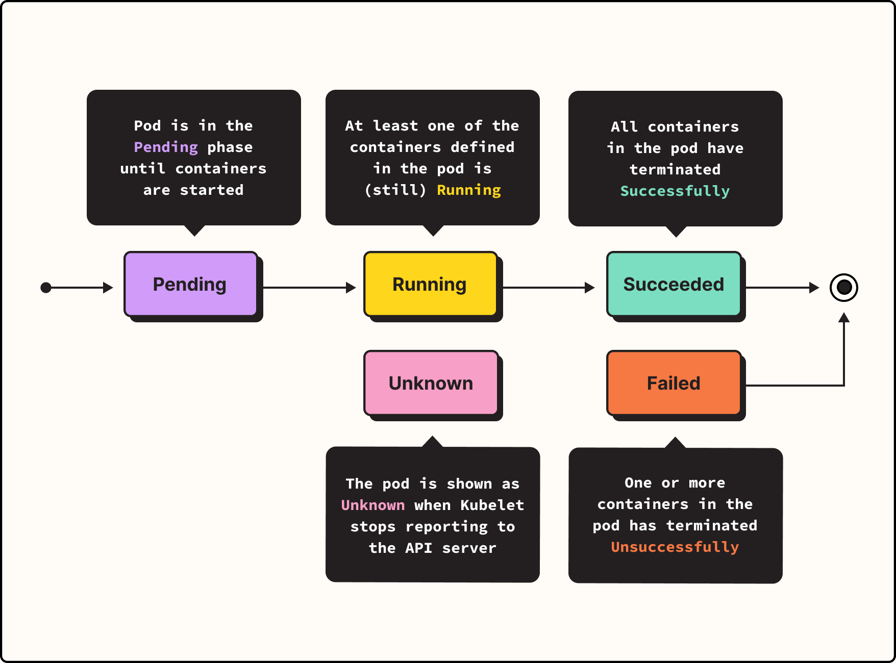

# pod phase

> [https://www.groundcover.com/blog/k8s-container-events](https://www.groundcover.com/blog/k8s-container-events)

## Container states

> [https://kubernetes.io/docs/concepts/workloads/pods/pod-lifecycle/#container-states]

As well as the [phase](https://kubernetes.io/docs/concepts/workloads/pods/pod-lifecycle/#pod-phase) of the Pod overall, Kubernetes tracks the state of each container inside a Pod. You can use [container lifecycle hooks](https://kubernetes.io/docs/concepts/containers/container-lifecycle-hooks/) to trigger events to run at certain points in a container's lifecycle.

Once the [scheduler](https://kubernetes.io/docs/reference/command-line-tools-reference/kube-scheduler/) assigns a Pod to a Node, the kubelet starts creating containers for that Pod using a [container runtime](https://kubernetes.io/docs/setup/production-environment/container-runtimes). There are three possible container states: `Waiting`, `Running`, and `Terminated`.

To check the state of a Pod's containers, you can use `kubectl describe pod <name-of-pod>`. The output shows the state for each container within that Pod.

Each state has a specific meaning:

### `Waiting`

If a container is not in either the `Running` or `Terminated` state, it is `Waiting`. A container in the `Waiting` state is still running the operations it requires in order to complete start up: for example, pulling the container image from a container image registry, or applying [Secret](https://kubernetes.io/docs/concepts/configuration/secret/) data. When you use `kubectl` to query a Pod with a container that is `Waiting`, you also see a Reason field to summarize why the container is in that state.

### `Running`

The `Running` status indicates that a container is executing without issues. If there was a `postStart` hook configured, it has already executed and finished. When you use `kubectl` to query a Pod with a container that is `Running`, you also see information about when the container entered the `Running` state.

### `Terminated`

A container in the `Terminated` state began execution and then either ran to completion or failed for some reason. When you use `kubectl` to query a Pod with a container that is `Terminated`, you see a reason, an exit code, and the start and finish time for that container's period of execution.

If a container has a `preStop` hook configured, this hook runs before the container enters the `Terminated` state.

## Pod conditions

A Pod has a PodStatus, which has an array of [PodConditions](https://kubernetes.io/docs/reference/generated/kubernetes-api/v1.25/#podcondition-v1-core) through which the Pod has or has not passed. Kubelet manages the following PodConditions:

- `PodScheduled`: the Pod has been scheduled to a node.
- `PodHasNetwork`: (alpha feature; must be [enabled explicitly](https://kubernetes.io/docs/concepts/workloads/pods/pod-lifecycle/#pod-has-network)) the Pod sandbox has been successfully created and networking configured.
- `ContainersReady`: all containers in the Pod are ready.
- `Initialized`: all [init containers](https://kubernetes.io/docs/concepts/workloads/pods/init-containers/) have completed successfully.
- `Ready`: the Pod is able to serve requests and should be added to the load balancing pools of all matching Services.

| Field name           | Description                                                  |
| :------------------- | :----------------------------------------------------------- |
| `type`               | Name of this Pod condition.                                  |
| `status`             | Indicates whether that condition is applicable, with possible values "`True`", "`False`", or "`Unknown`". |
| `lastProbeTime`      | Timestamp of when the Pod condition was last probed.         |
| `lastTransitionTime` | Timestamp for when the Pod last transitioned from one status to another. |
| `reason`             | Machine-readable, UpperCamelCase text indicating the reason for the condition's last transition. |
| `message`            | Human-readable message indicating details about the last status transition. |

### Garbage collection of terminated Pods

For failed Pods, the API objects remain in the cluster's API until a human or [controller](https://kubernetes.io/docs/concepts/architecture/controller/) process explicitly removes them.

The control plane cleans up terminated Pods (with a phase of `Succeeded` or `Failed`), when the number of Pods exceeds the configured threshold (determined by `terminated-pod-gc-threshold` in the kube-controller-manager). This avoids a resource leak as Pods are created and terminated over time.

