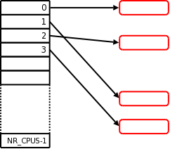

## 什么是同步原语

共享内存，多进程/线程的运行期设计模式已成主流的今天，你有好奇一下，进程/线程间的怎么同步的吗？大部分人知道，我们用的开发语言，或类库函数库，已经提供了看起来很漂亮的封装。然而在漂亮的面子工程后面，大部分归根到底是要内核 或/和 CPU 硬件去完成这些同步的。而反过来，只要我们理解了内部原理，你就可以快速理解那些漂亮的面子工程，和他们可能的性能问题，进而选择一个适合你的“面子工程”。而这些内部原理，就是同步原语。

| 技术                                   | 说明                                            | 适用范围           |
| -------------------------------------- | ----------------------------------------------- | ------------------ |
| CPU 本地变量（Per-CPU variables）      | 对于一个相同的数据类型，每个 CPU 拥有专用的实例 | 所有CPU            |
| 原子操作（Atomic operation）           | 原子化的`读取-修改-写入`一个计数器              | 所有CPU            |
| 内存栏栅（barrier）                    | 避免程序的指令被 编译器 或 CPU 自动重排顺序     | 本地CPU 或 所有CPU |
| 自旋锁（Spin lock）                    | 让 CPU 不停忙着读内存标记位的忙等待锁           | 所有CPU            |
| 信号量（Semaphore）                    | 挂起等待                                        | 所有CPU            |
| 写优先锁（Seqlocks）                   |                                                 | 所有CPU            |
| 禁用本地中断                           |                                                 | 本地CPU            |
| 禁用本地软中断                         |                                                 | 本地CPU            |
| 读-复制-更新（Read-copy-update (RCU)） | 无锁地并发读写基于指针的数据结构                | 所有CPU            |


### CPU 本地变量（Per-CPU variables）

基于原理就是一个数组，数组的大小就是CPU的个数。每个元素专用于一个CPU。数组元素实际上是一个指针，指向了实际的数据结构内存块。



<div align="center"><a href="https://lwn.net/Articles/258238/">来源：Better per-CPU variables</a></div>

需要注意的是，为了避免读写数据结构时的CPU Cache丢失和CPU间的干扰，数据结构内存块（上图红色部分）在分配内存时，内存物理地址需要对齐 cache line。

Per-CPU 和我们平时用的 Thread Local(Per-Thread) 不尽相同。不同的 Thread ，是可以运行于相同的CPU的。因为线程间可以抢占，而这个抢占足以引起数据不一致。这就是为什么，内核在访问 Per-CPU 期间，暂停了本 CPU 的抢占，即在这期间，我大晒，我玩晒。


### 原子操作（Atomic Operations）

每一种硬件架构，都有其原子操作的指令，对于 x86，在多CPU环境下，**最少**有以下情况下是原子操作：

1. CPU指令操作的内存地址是数据长度的倍数
2. CPU指令带有 `0xf0`前缀（称为 lock 前缀）。内存访问总线在执行指令期间被执行指令的CPU独占

对于 Linux 内核。为方便内核开发者使用原子操作，定义了一个`atomic_type`数据结构，和一系列的函数与宏。

```c
typedef struct {
	int counter;
} atomic_t;
```

来源：[bootlin.com](https://elixir.bootlin.com/linux/v5.11.8/source/include/linux/types.h#L166)

下面以`atomic_inc(v)`函数为例，简单看看实现。

```c
/**
 * atomic_inc - increment atomic variable
 * @v: pointer of type atomic_t
 *
 * Atomically increments @v by 1.
 */
static inline void atomic_inc(atomic_t *v)
{
	asm volatile(LOCK_PREFIX "incl %0"
		     : "+m" (v->counter));
}
```

来源：[elixir.bootlin.com](https://elixir.bootlin.com/linux/v5.11.8/source/tools/arch/x86/include/asm/atomic.h#L49)

上面的`LOCK_PREFIX`即为前面提到的`0xf0`内存总线锁指令前缀。

> 如果想校真，看 [c 中inline汇编](https://0xax.gitbooks.io/linux-insides/content/Theory/linux-theory-3.html)。其中`volatile`即告诉编译器，汇编不要和 c 代码生成的指令混合乱序优化。

### 编译器优化栏栅与运行期内存栏栅（barrier）

#### 优化栏栅（optimization barrier）

我们知道，编译器出于优化目的，生成的CPU指令的顺序，不一定和源码的顺序相同。但对于同步原语来说，这种乱序行为是不允许的。所以需要在代码中划一条线，告诉编译器，线前的代码，必须在线后执行前执行。这条线，就叫优化栏栅（optimization barrier）。内核中用 `barrier()` 宏，展开成`asm volatile("":::"memory")`。

#### 内存栏栅（barrier）

你也许知道，CPU 同样会乱序执行指令。同理，也需要划一条线告诉CPU，线后的指令不能在线前指令前执行。内存栏栅一般同时作为优化栏栅出现。定义这条线的方法有：

| 宏        | 描述       | x86汇编                                                      |
| --------- | ---------- | ------------------------------------------------------------ |
| smp_mb()  | 内存栏栅   |                                                              |
| smp_rmb() | 读内存栏栅 | `volatile("lfence")` 或 `volatile("lock;addl $0,0(%%esp)":::"memory")` |
| smp_wmb() | 写内存栏栅 | 由于x86不会乱序执行写相关指令，本宏转成优化栏栅`barrier()，`跳过编译器乱序。 |


### 自旋锁（Spin lock）

根据是否在等待时使用CPU，锁可以分为两种，一种是忙等待锁，一种是挂起和等待调度锁。对于每次拥有，均极短时间占用的锁，忙等待可能比挂起-等待调度更节省CPU资源。自旋锁就是忙等待锁，即 on-cpu 等待的锁。

内核以 `spinlock_t`数据结构保存，在 x86 中最后定义为以下结构。

```c
typedef struct arch_spinlock {
	unsigned int slock;
} arch_spinlock_t;
```

来源： [bootlin.com](https://elixir.bootlin.com/linux/v2.6.39.4/source/arch/x86/include/asm/spinlock_types.h#L10)

在最近版本的内核中，简单的 spin lock 已经修改为一个[队列化的实现](https://0xax.gitbooks.io/linux-insides/content/SyncPrim/linux-sync-2.html)。

> https://events.static.linuxfound.org/sites/events/files/slides/Optimizing%20Application%20Performance%20in%20Large%20Multi-core%20Systems_0.pdf
> 
> * `Ticket spinlock` is the spinlock implementation used in the Linux kernel prior to 4.2. A lock waiter gets a ticket  number and spin on the lock cacheline until it sees its ticket number. By then, it becomes the lock owner and enters the critical section.
> 
> * `Queued spinlock` is the new spinlock implementation used in 4.2 Linux kernel and beyond. A lock waiter goes into a queue and spins in its own cacheline until it becomes the queue head. By then, it can spin on the lock cacheline and attempt to get the lock.
> 
> For ticket spinlocks, all the lock waiters will spin on the lock cacheline (mostly read). For queued spinlocks, only the queue head will spin on the lock cacheline.

### 写优先锁（Seqlocks）

有时，我们关注写的性能，而可以让读的性能慢一点。如 Linux 中系统时间处理程序。基本原理就是读方使用乐观版本锁+失败重试的方法。写方每次写入均更新版本号。

### 读-复制-更新（Read-copy-update (RCU)）

这可能是最复杂的内核同步原语，我觉得自己没明了，不乱写了，有兴趣的看原文吧：https://en.wikipedia.org/wiki/Read-copy-update

### 信号量（Semaphore）  

根据是否在等待时使用CPU，锁可以分为两种，一种是忙等待锁，一种是挂起和等待调度锁。信号量属于挂起和等待调度锁。

```c
struct semaphore {
	atomic_t count; //负数：有进程在等待; 0:在进程占用，但无等待；正数：无占用（可用数）
	int sleepers;
	wait_queue_head_t wait;//等待进程的队列
};
```


## 参考

1. [Better per-CPU variables](https://lwn.net/Articles/258238/)
2. https://en.wikipedia.org/wiki/Read-copy-update
3. Understanding The Linux Kernel

