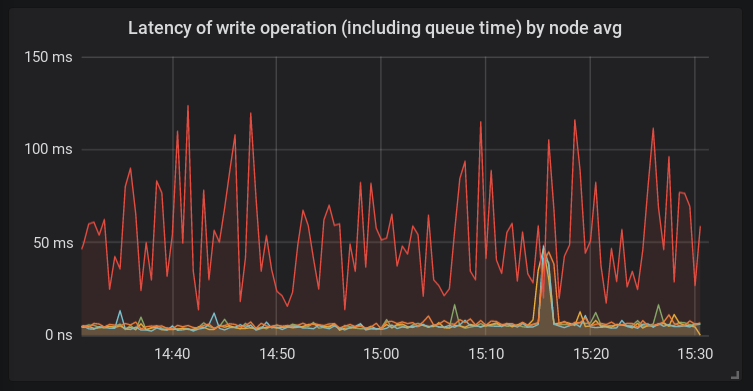
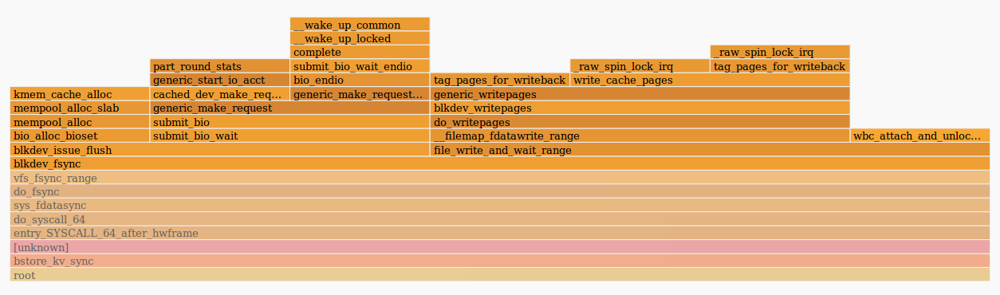
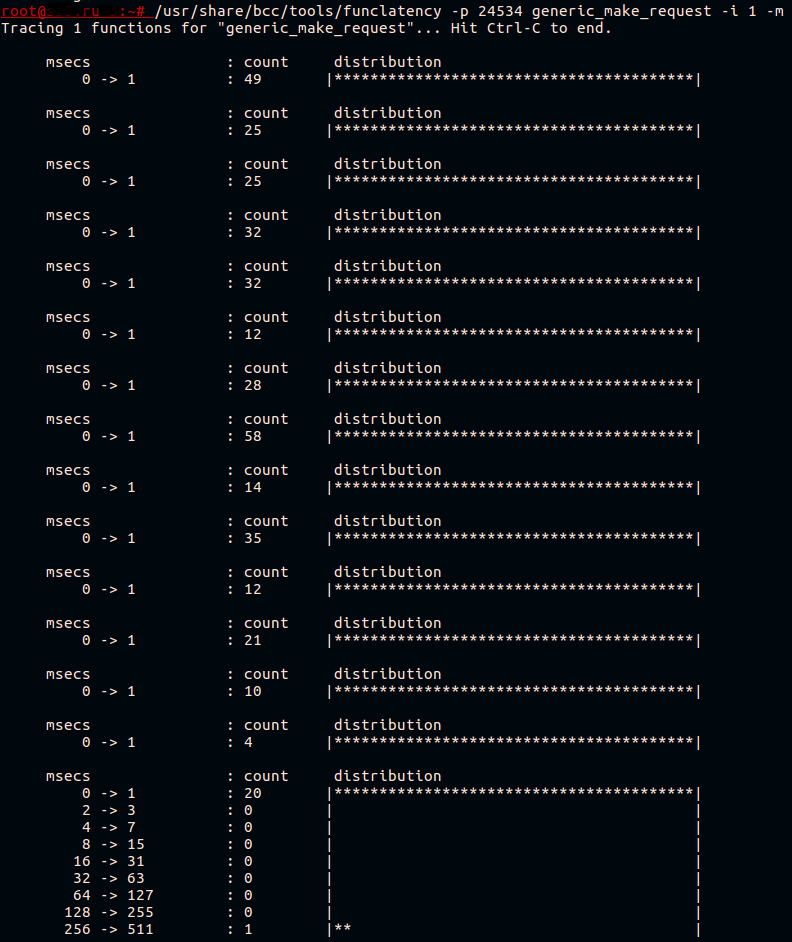
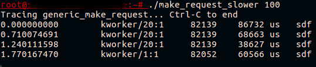

# BPF trace block device request


## From High Ceph Latency to Kernel Patch with eBPF/BCC


> From: https://habr.com/en/companies/selectel/articles/450818/


There are a lot of tools for debugging kernel and userspace programs in Linux. Most of them have performance impact and cannot easily be run in production environments. A few years ago, eBPF [was developed](https://lwn.net/Articles/740157/), which provides the ability to trace the kernel and userspace with low overhead, without needing to recompile programs or load kernel modules.

There are now plenty of tools that use eBPF and in this article, we’ll explain how to write your own profiling tool using the [PythonBCC library](https://github.com/iovisor/bcc). This article is based on a real issue from the production environment. We’ll walk you through solving the problem and show how existing bcc tools could be used in some cases.


### Ceph Is Slow

A new platform was added to a ceph cluster. After migrating some data to the platform, the latency for write requests was higher than on the other servers.




This platform has a new caching virtual device — bcache, which we haven’t used in this cluster before — and a new kernel — 4.15, which still isn’t used anywhere else in this cluster. The root of the problem could be anywhere, so let’s take a deeper look.


#### Investigating the Host

Let’s look at what’s going on inside the ceph-osd process. We use the tracing tool [perf](https://perf.wiki.kernel.org/index.php/Main_Page) and [flamescope](https://github.com/Netflix/flamescope) to build flamegraphs:




As we can see from the flamegraph, **fdatasync()** spent a lot of time submitting bio in the **generic_make_request()** function. Thus, the root of our problem is somewhere outside the ceph daemon. It might be a kernel, bcache, or disk issue. The iostat output showed high latency for bcache devices.

Another suspicious finding is that the systemd-udevd daemon is consuming CPU; about 20% on multiple CPUs. This is odd behavior, so we have to find out what’s going on. Since systemd-udevd works with uevents, we have to use **udevadm monitor** to find out if there are any uevents in the system. After checking, we saw that a lot of «change» uevents were being generated for every block device in the system.

This is unusual, so we’re going to find out what’s causing all of these uevents to be sent.


#### Using the BCC Toolkit

As we already know, the kernel (and ceph daemon) is spending a lot of time performing **generic_make_requst()** functions. Let’s measure its latency using **funclatency** from the [BCC toolkit](https://github.com/iovisor/bcc/blob/master/tools/funclatency.py), just to make sure that we’re on the right path. We’ll trace the ceph daemon’s PID (-p argument) in 1-second intervals (-i) and print the latency in milliseconds (-m).




This function usually works very fast. All it does is submit the bio structure to the device driver’s queue.

**Bcache** is a complex device; in fact, it consists of 3 devices: a backing device, which is a slow HDD in our case; a caching device, which is the NVMe drive’s partition; and a bcache virtual device, which is used by the application. We know submission is slow, but for which device? This is something we’ll look at a bit later.

For now, we know that uevents cause problems in ceph daemons and we have to find the software triggering uevents.It’s not easy to find what causes uevents to be generated. We assume it’s software that only runs periodically. To see what is being executed on the system, we use **execsnoop** from the BCC toolkit. We can run it and redirect **stdout** to a file.

For example:


```
/usr/share/bcc/tools/execsnoop  | tee ./execdump
```

We won’t give the full execsnoop output here, but one interesting string we found there was:


```
sh 1764905 5802 0 sudo arcconf getconfig 1 AD | grep Temperature | awk -F '[:/]' '{print $2}' | sed 's/^ \([0-9]*\) C.*/\1/'
```

The third column is the process’s PPID. We checked what 5802 was and saw that it’s one of our monitoring daemon threads. Looking further at the monitoring system configuration, we found a faulty parameter. The HBA temperature was being retrieved every 30 seconds, which is too often. After changing the check interval to a more appropriate value, we saw that our ceph latency matched the other platforms.

But we still don’t know why the bcache latency was high. We set up a testing platform with the same configuration and tried to reproduce the problem with fio on the bcache device while simultaneously triggering udev with the udevadm trigger command.


#### Writing BCC-Based Tools

What we’re going to do here is write a simple tool that traces the slowest generic_make_request() calls and prints the name of the disk that the function was called for.

The plan is simple:


- Register

   

  kprobe

   

  on

   

  generic_make_request()

  :

  - Save the disk name available from the function’s argument
  - Save the current timestamp

- Register

   

  kretprobe

   

  on the

   

  generic_make_request()

   

  return statement:

  - Retrieve the current timestamp
  - Look up previously saved timestamps and compare them with current ones
  - If the result is higher than the threshold, look up previously saved disk names and print them to the terminal with additional information

**Kprobes** and **kretprobes** use breakpoints to change a function’s code in runtime. You can find [documentation](https://www.kernel.org/doc/Documentation/kprobes.txt) as well as a good [article](https://dev.framing.life/tracing/kernel-and-user-probes-magic/) on this. If you take a look at the code for different [BCC tools](https://github.com/iovisor/bcc/tree/master/tools), you’ll see that they all have an identical structure. We’ll skip argument parsing and focus on the BPF program itself.

Our program’s text will be defined in python as follows:


```
bpf_text = “”” # Here will be the bpf program code “””
```

BPF programs use [hashmaps](https://github.com/iovisor/bcc/blob/12bd958186a8c3bfcf2f74d246b8c06dd20bbc20/src/cc/export/helpers.h#L67) to share data between different functions. We’ll use PID as a key and self-defined structure as a value.


```
struct data_t {
	u64 pid;
	u64 ts;
	char comm[TASK_COMM_LEN];
	u64 lat;
	char disk[DISK_NAME_LEN];
};

BPF_HASH(p, u64, struct data_t);
BPF_PERF_OUTPUT(events);
```

Here we register a hashmap called **p** with a **u64** key type and a **struct data_t** value type. This map is accessible from our BPF program context. The **BPF_PERF_OUTPUT** macro registers another map called **events**, which is used to [push data](https://github.com/iovisor/bcc/blob/12bd958186a8c3bfcf2f74d246b8c06dd20bbc20/src/cc/export/helpers.h#L112) to the userspace.

When measuring latency between the function call and its return or between one function call and another, you have to be sure that the data you saved and access later relates to the same context. In other words, you have to be aware of any other parallel executions of the same function. It’s possible to trace latency between the function call of one process and the same function’s returns from another process, but this doesn’t help us. A good example is the [biolatency tool](https://github.com/iovisor/bcc/blob/12bd958186a8c3bfcf2f74d246b8c06dd20bbc20/tools/biolatency.py#L74) where pointer to **struct request** is used as a hashmap key.

Next, we have to write a code that will be executed on function calls via a kprobe mechanism:


```
void start(struct pt_regs *ctx, struct bio *bio) {
	u64 pid = bpf_get_current_pid_tgid();
	struct data_t data = {};
	u64 ts = bpf_ktime_get_ns();
	data.pid = pid;
	data.ts = ts;
	bpf_probe_read_str(&data.disk, sizeof(data.disk), (void*)bio->bi_disk->disk_name);
	p.update(&pid, &data);
}
```

Here we have the first [generic_make_request() argument](https://elixir.bootlin.com/linux/v4.15.18/source/block/blk-core.c#L2259) as our function’s second argument. Then we get the PID and current timestamp in nanoseconds and write it to the newly allocated **struct data_t data**. We get the disk name from the bio structure, which is passed to **generic_make_request()**, and save it to our **data**. The last step is to add an entry to the hashmap we described earlier.

This function will be executed on **generic_make_request()** returns:


```
void stop(struct pt_regs *ctx) {
    u64 pid = bpf_get_current_pid_tgid();
    u64 ts = bpf_ktime_get_ns();
    struct data_t* data = p.lookup(&pid);
    if (data != 0 && data->ts > 0) {
        bpf_get_current_comm(&data->comm, sizeof(data->comm));
        data->lat = (ts - data->ts)/1000;
        if (data->lat > MIN_US) {
            FACTOR
            data->pid >>= 32;
            events.perf_submit(ctx, data, sizeof(struct data_t));
        }
        p.delete(&pid);
    }
}
```

We get the PID and timestamp from the previous output and look up the hashmap for the value where **key == current PID**. If it’s found, we get the name of the running process and add it to the **data** structure. What we do with **data->pid** here gives us the thread group id. The previously called [bpf_get_current_pid_tgid() function](https://elixir.bootlin.com/linux/v4.15.18/source/kernel/bpf/helpers.c#L119) returns the thread GID and PID of the process in the same 64-bit value.

We’re not interested in every thread’s ID, but we want to know the PID of the main thread. After checking that the latency is above the threshold, we submit our **data** structure to the userspace via **events** map, then delete the hashmap entry at the end.

In our python script, we have to replace **MIN_US** and **FACTOR** according to the threshold we want and unit of time we want to see in our result:


```
bpf_text = bpf_text.replace('MIN_US',str(min_usec))
if args.milliseconds:
	bpf_text = bpf_text.replace('FACTOR','data->lat /= 1000;')
	label = "msec"
else:
	bpf_text = bpf_text.replace('FACTOR','')
	label = "usec"
```

Then we have to prepare the BPF program with a [BPF() macro](https://github.com/iovisor/bcc/blob/12bd958186a8c3bfcf2f74d246b8c06dd20bbc20/src/python/bcc/__init__.py#L135) and register probes:


```
b = BPF(text=bpf_text)
b.attach_kprobe(event="generic_make_request",fn_name="start")
b.attach_kretprobe(event="generic_make_request",fn_name="stop")
```

We also need to define the same structure as **struct data_t** in our script to read the data from the BPF program:


```
TASK_COMM_LEN = 16	# linux/sched.h
DISK_NAME_LEN = 32	# linux/genhd.h
class Data(ct.Structure):
	_fields_ = [("pid", ct.c_ulonglong),
            	("ts", ct.c_ulonglong),
            	("comm", ct.c_char * TASK_COMM_LEN),
            	("lat", ct.c_ulonglong),
            	("disk",ct.c_char * DISK_NAME_LEN)]
```

The last step is to print the data we want:


```
def print_event(cpu, data, size):
    global start
    event = ct.cast(data, ct.POINTER(Data)).contents
    if start == 0:
        start = event.ts
    time_s = (float(event.ts - start)) / 1000000000
    print("%-18.9f %-16s %-6d   %-1s %s   %s" % (time_s, event.comm, event.pid, event.lat, label, event.disk))

b["events"].open_perf_buffer(print_event)
# format output
start = 0
while 1:
    try:
        b.perf_buffer_poll()
    except KeyboardInterrupt:
        exit()
```

The full script is available on [GitHub](https://github.com/AlexZzz/ebpf-tools/blob/master/make_request_slower). Let’s run the script and trigger udev events while fio writes to a bcache device:




Success! Now we see that what looked like high latency for bcache is really **generic_make_request()** latency for its backing device.


#### Dig into the Kernel

What drags when submitting requests? We see that a latency spike occurred before request accounting even started. This could be easily checked by running either iostat during the problem or the [biolatency BCC script](https://github.com/iovisor/bcc/blob/master/tools/biolatency.py), which are based on accounting request start, so neither tool will show the disk problem.

If we take a look at **generic_make_request()**, we see that there are two functions running before accounting starts. The first is **generic_make_request_checks()**, which is lightweight and checks bio according to the device settings, etc. The second is [blk_queue_enter()](https://elixir.bootlin.com/linux/v4.15.18/ident/blk_queue_enter), which has a [wait_event_interruptible()](https://elixir.bootlin.com/linux/v4.15.18/ident/wait_event_interruptible) call:


```
ret = wait_event_interruptible(q->mq_freeze_wq,
	(atomic_read(&q->mq_freeze_depth) == 0 &&
	(preempt || !blk_queue_preempt_only(q))) ||
	blk_queue_dying(q));
```

Here the kernel waits until the queue is unfrozen. Let’s measure the latency of blk_queue_enter():


```
~# /usr/share/bcc/tools/funclatency  blk_queue_enter -i 1 -m               	 
Tracing 1 functions for "blk_queue_enter"... Hit Ctrl-C to end.

 	msecs           	: count 	distribution
     	0 -> 1      	: 341  	|****************************************|

 	msecs           	: count 	distribution
     	0 -> 1      	: 316  	|****************************************|

 	msecs           	: count 	distribution
     	0 -> 1      	: 255  	|****************************************|
     	2 -> 3      	: 0    	|                                    	|
     	4 -> 7      	: 0    	|                                    	|
     	8 -> 15     	: 1    	|                                    	|
```

It looks like we’re close. The functions used to freeze/unfreeze the queue are [blk_mq_freeze_queue](https://elixir.bootlin.com/linux/v4.15.18/ident/blk_mq_freeze_queue) and [blk_mq_unfreeze_queue](https://elixir.bootlin.com/linux/v4.15.18/ident/blk_mq_unfreeze_queue). They’re used to change queue settings, which could affect io requests currently in flight. When **blk_mq_freeze_queue()** is called, **q->mq_freeze_depth** is incremented in [blk_freeze_queue_start()](https://elixir.bootlin.com/linux/v4.15.18/ident/blk_freeze_queue_start). After that, the kernel waits for the queue to be empty in [blk_mq_freeze_queue_wait()](https://elixir.bootlin.com/linux/v4.15.18/ident/blk_mq_freeze_queue_wait).

This waiting time is equal to disk latency, because the kernel has to wait for all io operations to finish. When the queue is empty, changes can be made. The final step is to call [blk_mq_unfreeze_queue()](https://elixir.bootlin.com/linux/v4.15.18/ident/blk_mq_unfreeze_queue), which decreases the **freeze_depth** counter.

Now we know enough to fix the issue. The udevadm trigger command changes the settings for block devices. Those settings are described in udev rules. We can find out what settings freeze the queue by changing them via sysfs or by looking at the kernel source code. Alternatively, we can [call trace](https://github.com/iovisor/bcc/blob/master/tools/trace.py) from the BCC toolkit to print kernel and user stacks for every **blk_freeze_queue** call:


```
~# /usr/share/bcc/tools/trace blk_freeze_queue -K -U
PID 	TID 	COMM        	FUNC        	 
3809642 3809642 systemd-udevd   blk_freeze_queue
    	blk_freeze_queue+0x1 [kernel]
    	elevator_switch+0x29 [kernel]
    	elv_iosched_store+0x197 [kernel]
    	queue_attr_store+0x5c [kernel]
    	sysfs_kf_write+0x3c [kernel]
    	kernfs_fop_write+0x125 [kernel]
    	__vfs_write+0x1b [kernel]
    	vfs_write+0xb8 [kernel]
    	sys_write+0x55 [kernel]
    	do_syscall_64+0x73 [kernel]
    	entry_SYSCALL_64_after_hwframe+0x3d [kernel]
    	__write_nocancel+0x7 [libc-2.23.so]
    	[unknown]

3809631 3809631 systemd-udevd   blk_freeze_queue
    	blk_freeze_queue+0x1 [kernel]
    	queue_requests_store+0xb6 [kernel]
    	queue_attr_store+0x5c [kernel]
    	sysfs_kf_write+0x3c [kernel]
    	kernfs_fop_write+0x125 [kernel]
    	__vfs_write+0x1b [kernel]
    	vfs_write+0xb8 [kernel]
    	sys_write+0x55 [kernel]
    	do_syscall_64+0x73 [kernel]
    	entry_SYSCALL_64_after_hwframe+0x3d [kernel]
    	__write_nocancel+0x7 [libc-2.23.so]
    	[unknown]
```

Udev rules don’t change often, so even assigning already existing values to certain parameters causes a spike in submit latency for the application. Of course generating udev events when there aren’t any changes in a device’s configuration (no device is attached or detached) is not a good practice. Still, we can prevent the kernel from freezing the queue if there’s no reason to do this. [Three](https://git.kernel.org/pub/scm/linux/kernel/git/axboe/linux-block.git/commit/?id=e5fa81408fb43ebabde65938ef8b20ae879017e7) [small](https://git.kernel.org/pub/scm/linux/kernel/git/axboe/linux-block.git/commit/?id=b7143fe67bfc3b83a9e11371da659e1e70a1bbf3) [commits](https://git.kernel.org/pub/scm/linux/kernel/git/axboe/linux-block.git/commit/?id=fbd72127c975dc8e532ecc73d52f3b1b00935bec) fix the issue.


### Conclusion

eBPF is highly flexible and powerful instrument. In this article, we looked at only one case and demonstrated a little bit of what it’s capable of. If you’re interested in developing BCC-based tools, you should take a look at the [official tutorial](https://github.com/iovisor/bcc/blob/master/docs/tutorial.md), which describes its fundamental concepts.

There’re also other interesting eBPF-based tools available for profiling and debugging. One of them is [bpftrace](https://github.com/iovisor/bpftrace), which lets you write powerful oneliners and little programs in an awk-like language. Another one is [ebpf_exporter](https://github.com/cloudflare/ebpf_exporter), which can collect low-level high-resolution metrics to your prometheus server with its great visualization and alerting abilities.
