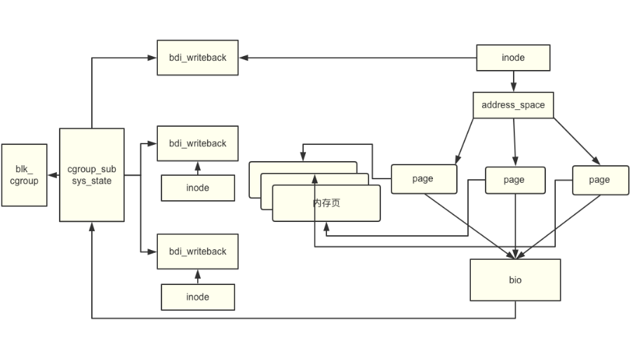
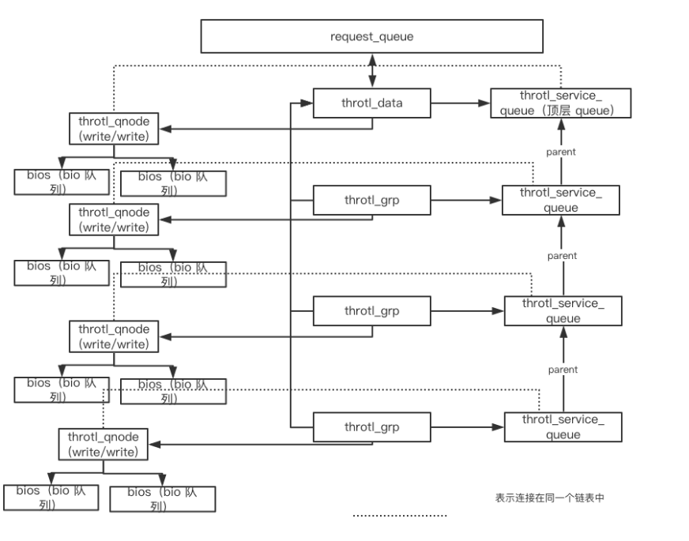

> http://static.kancloud.cn/zhangyi8928/kernel/1780636

### cgroup writeback介绍

------

v1的blkio cgroup 一直有一个很大的问题，它只能控制读取和直接写入的IO。对于写入的buffer io，由于采用writeback的异步写入方式，通用块层和调度层都拿不到真正IO发起的进程信息，所有的bio都由后台线程发送给块层，所以，所有正常写入的流量都归入root group，没有办法对cgroup进行IO throttle。cgroup v2 通过内存和IO的协作完成了buffer io 的throttle。

在异步写操作中，缓冲写让page cache变脏，并通过writeback机制异步写入backing filesystem，回写机制位于内存和IO域之间，cgroup v2是在此处通过 **平衡变脏速度和 writeback IO** 来调节系统中脏内存的比例。决策程序负责检查系统范围的脏内存和每个cgroup的脏内存两种状态，并强制执行两者中更严格的限制。

------

IO controller和 Memory controller一起实现对page cache的 writeback IO的控制，由于在buffer io过程中，内核失去了发起IO的进程信息。因此，在v2中 blkio cgroup 就依赖 memory cgroup，利用内存的归属确定IO的归属。


memory controller 主要负责对所有映射的内存页面（RSS）和缓存页面（Page Cache）进行计数和限制。 RSS 在page fault 时进行计数，而 Page Cache 在内存页面加入 inode（即插入 radix 树）时计数。共享内存页面是基于第一次访问的方法，由第一个访问该页面的 cgroup 对该页面charge。每个进程的mm_struct 都知道它属于哪个 cgroup，同时每个page 也知道它属于哪个 cgroup，由此cgroup 可以统计出属于自己的进程的内存页面。

------

但是内存和writeback管理机制存在固有差异，这会影响cgroup中资源所有权的跟踪方式。内存是按内存页跟踪的，而writeback是按inode的。出于支持writeback的目的，我们会将inode分配给某个cgroup，并且把从inode写入脏页的所有IO请求都归属于该cgroup。

但由于内存的cgroup所有权跟踪是按内存页进行的，因此可能存在，与同一个 inode 关联的内存页面，归属于不同的cgroup。这些被称为**外部页面**。writeback会不断跟踪外部页面，如果某个特定外部cgroup在一段时间内成为大多数，则将inode的所有权切换到该cgroup。

------

这个模型对于大多数用例来说已经足够了，即使主写入cgroup随时间变化，但只要给定的inode主要被单个cgroup弄脏，都没有问题。但是多个cgroup同时写入单个inode的用例不能很好地支持。在这种情况下，很大一部分IO很可能被错误归类。内存控制器在第一次使用时分配页面所有权，并且在页面释放之前不会更新页面所有权，但是即使写回严格遵循页面所有权，多个弄脏重叠内存区域的cgroup也无法按预期工作。建议避免使用此类使用模式。


cgroup writeback还需要来自底层文件系统的显式支持。目前，cgroup回写是在ext2，ext4和btrfs上实现的。在其他文件系统上，所有写回IO都归属于根cgroup。在文件系统中，log 和其他 meta data 目前只能归属于根 cgroup，不加限制，否则如果低优先级的 cgroup如果抢占了 meta data 的写入，会导致其他高优先级 cgroup 无法写入数据，引起优先级翻转。

------

### cgroups writeback 相关数据结构

cgroups v2的首要任务是，解决如何利用内存信息，帮助 blkio 做决策。

page cache的归属怎么确定呢？ page cache 以 radix tree 的形式，挂载在每个文件对应的 inode 中，因此确定了 inode 的归属也就确定了内存归属。 因此，在 inode 数据结构中添加bdi_writeback成员，该成员属于某个 cgroup，以此就可以确定 inode 属于哪个 cgroup，解决了io归属问题。

下图以一个inode为例，展示了 内存页、inode、bdi_writeback、cgroup 之间的关系。



```
1. bio是贯穿整个 blkio 的数据结构，是发起 IO 的基本单位，也是限速的基本单位。

在上述的 writeback 的结尾处，调用 do_writepage 函数，该函数通常是由文件系统自己定义的函数。该函数负责把当前需要 writeback 的文件所对应的 inode 中的脏页写回到磁盘上。它把这些脏页构造成 bio，发给底层代码处理。

而 cgroup 就在此结构中添加了一个重要数据指针， struct cgroup_subsys_state *bi_css，此成员指向一个具体的 cgroup。在发起 IO 的时候，bi_css根据 inode 的 bdi_writeback 成员指向相应的 cgroup，由此可以确定当前这个 bio 是由哪个 cgroup 发出的，解决了 cgroup v1的问题。

这样，在块设备读写时，将 bio 加入bio 所在的 inode所归属的 cgroup，并在 bio 有写回操作时，记录写入的字节数，以此达到统计 IO 速率的目的。当 io 发生时，写入 page cache ，由memcg 可以得知哪些内存页变脏，对应哪些 inode，进而找到相应的 blkcg，最后根据 blkcg 的限制，对脏页是否可以写回进行判定。

2. struct bdi_writeback（wb） 和 struct backing_dev_info （bdi）是支持cgroups writeback 的重要数据结构。

在之前的内核版本里，bdi 代表一个存储设备，wb 是嵌入 bdi 中的，所以统计设备读写数据等都是全局的。为了支持cgroups writeback，将两者分离，把 bdi 中关于统计信息的数据都放入到 wb 中，把 wb 从 bdi 中独立出来，同时 bdi->wb 这个成员仍然嵌入在 bdi 中，但是仅仅为 root cgroup服务。其他的 wb 可以属于不同的 cgroup，为统计 cgroup 的IO 速率提供基础。这样所有的 writeback 操作都成为per-wb 而不是 per-bdi。

wb 类似于一个 IO 的管道，把一个个的 bio 从通道里传输到底层。每个mem cgroup 都有自己的 wb（struct bdi_writeback)，这些 wb 分别独立执行、度量和节流。从page cache 到 IO 调度层会有无数的管道，每次 IO 都会归属于某个管道，通过这些管道可以统计IO。根据wb 统计到的数据量可以用来选举 inode 归属，传输数据最高的管道拥有当前文件 inode 的所有权，涉及到该 inode 的所有 IO 自然也归属该 wb。

3. 除此之外，在 IO 调度层还有几个数据结构是为 blkio的 writeback设计的。 当bios 发送到此处时，由于 IO throttling，无法立即发送，必须设计数据结构来处理这些 bios。为了满足 cgroups 的层次化控制结构，设计了这几个数据结构：throtl_service_queue、throtl_grp、throtl_data、throtl_node等。它们也是让blk cgroup 生效的主要实体。throtl_grp 对应于一个cgroup，所有IO 限速策略都在记录在里面。同时throtl_grp 拥有自己的 throtl_service_queue，每个 throtl_service_queue有两个throtl_node，分别包含了读和写的bios 队列，bios 都挂载在 throtl_node 上。每个 throtl_grp 通过关联 throtl_node获取自己的bios 队列（包含读写）。 多个throtl_service_queue构成一棵树，树的节点都指向父节点,这也代表 throtl_grp 构成了一棵树，这棵树可以从叶子遍历到根。之所以这么设计，是因为cgroup 是层次化控制，每一层中间节点都可以对 IO 速率进行限制，所以每个 bio 应该从叶子的限制开始依次往上走，直到满足路径上所有cgroup的限制，到达根节点，就可以把这个 bio 发送到 IO 调度器了。实际上，throtl_service_queue除了指向父节点之外，还有一个成员 pending_tree，指向所有活跃的子 cgroup，因为每次有 IO 机会的时候，都要从这些子 cgroup取出 bio 发送。因此，为了保证对所有的 bio 都是公平的，采用 rr 轮询算法，轮流从throtl_service_queue的子 cgroup 中取出 bio 发送。
```



throtl_data 将 request queue 和 throtl_grp 关联起来，每个request queue 都有一个 throtl_data指针。

## cgroup writeback 代码分析

前面已经介绍了writeback 在各层的实现。
**首先，当cgroup中进程占用的内存超出cgroups限制会触发writeback，**
**其次，writeback的内存进入IO调度层之后，如果超过cgroup限制的IO速率时，数据无法立刻写回。**

下面让我们看看在加入 cgroup 之后，writeback 的主要路径的实现细节。

### balance_dirty_pages_ratelimited

```
balance_dirty_pages_ratelimited
    balance_dirty_pages
        nr_reclaimable = global_node_page_state(NR_FILE_DIRTY) + global_node_page_state(NR_UNSTABLE_NFS);
        gdtc->dirty = nr_reclaimable + global_node_page_state(NR_WRITEBACK);
        dirty = gdtc->dirty
        计算 gdtc 和 mdtc(全局和 cgroup 内存限制）
        如果 dirty小于gdtc 限制 且 dirty小于 mdtc 限制，直接退出
        否则：
            wb_start_background_writeback(wb);
            计算wb 的带宽，以便用于分配相应的内存页(根据带宽分配给cgroup内存资源，此处是一种机制）
            估算应该休眠的时间（由后台进程处理 writeback，进程系统调用被休眠）
            io_schedule_timeout(pause)，进入休眠
    if (nr_reclaimable > gdtc->bg_thresh)
    //如果需要回收的页面（脏页率）大于后台阈值，启动后台 writeback
    wb_start_background_writeback(wb);此处输入代码
```

以上就是目前代码中触发 writeback 的代码，可以看到所有的 writeback 都由后台进程控制（某些评论说使用后台进程可以优化 writeback 的效率，因此进程不再主动写回文件而是陷入休眠）。

### background writeback.

上面讲到 wb_start_background_writeback(wb)，下面分析 background writeback。

当调用 wb_start_background_writeback(wb) 时，会调用相应的 handler，也就是 wb_workfn.。

```
wb_workfn 声明如下： INIT_DELAYED_WORK(&wb->dwork, wb_workfn)，被初始化delayed_work。wb_workfn 是 workqueue 的回调函数，由内核线程后台执行回写操作。

启动后台回调函数过程如下：

wb_start_background_writeback(wb)

wb_wakeup

mod_delayed_work(bdi_wq,&wb->dwork,0)

可以看到它将 wb->dwork 加入到 bdi_wq 中，bdi_wq 是一个 workqueue，在系统初始化时创建,专门用来处理 writeback。随后由该 bdi_wq 调用 wb_workfn。
```

除了上述触发wb_workfn方式，还可以通过定时器周期触发。

```
wb_workfn
wb_do_writeback
wb_check_background_flush
wb_writeback
if (work->for_background && !wb_over_bg_thresh(wb))
break;
if(work->for_kupdate)
writeback_sb_inodes
__writeback_single_inode

在_writeback_single_inode 函数中，
static long writeback_sb_inodes(struct super_block *sb,
struct bdi_writeback *wb,
struct wb_writeback_work *work){
struct writeback_control wbc = {
.sync_mode = work->sync_mode,
.tagged_writepages = work->tagged_writepages,
.for_kupdate = work->for_kupdate,
.for_background = work->for_background,
.for_sync = work->for_sync,
.range_cyclic = work->range_cyclic,
.range_start = 0,
.range_end = LLONG_MAX,
};

//构造 wbc（writeback_control）
wbc_attach_and_unlock_inode(&wbc, inode);

//此函数和 cgroups 限制 writeback 密切相关，它将 inode 附加到 wbc 之上，两者通过 wb 联系起来。而 wb 一般是属于某个 cgroup的，也就是建立了inode 和 cgroup 的联系。

do_writepages(mapping, wbc);

//此函数还会进一步调用文件系统挂载的 writepages 或者通用的 generic_writepages 函数。wbc作为函数的参数将本次回写的 inode 和 cgroup 的关系随之传递，以此为后面的决策提供依据。

}
```

以上完成了数据从内存 writeback 到下层的块设备 IO 层，接下去就涉及到 cgroup 对 IO 速率的限制，其路径如下：

```
do_writepages
wbc_init_bio（关联 bio 和某个 wb，即 cgroup）
genric_make_request
generic_make_request_check(bio)
blkcg_bio_issue_check
blk_throtl_bio
tg_may_dispatch
tg_with_in_bps_limit/tg_with_in_iops_limit
```

**1. 在文件系统层(文件系统定制的 writeback）、block 层 submit_bh（ 正常提交 bio）以及回写机制的mpage_writepages（ 通用 writeback）等处加入wbc_init_bio函数，该函数将本次构造的bio 和相应的 cgroup 关联起来。**

------

**2. 提交 bio 之后，在 make_request 进入 io 调度层之前，调用 blkcg_bio_issue_check 检查是否满足 cgroups 的 io 速度限制，如果满足直接进行 IO，否则加入其它等待队列。由内核定时器择时再将这些 bio 写入设备。做出 IO throttle 决策的代码位于 block/blk-throttle.c。负责执行 IO 的限制策略，并为每个 reqeust_queue 维护被挂起的 bio 队列。**

------

**3. 在 tg_may_dispatch 中，主要由throtl_service_queue、throtl_grp、throtl_data几个数据结构负责，上面介绍数据结构时解释过这几个数据结构的作用。最后内核会把需要阻塞的 bio 加入相应的 throtl_service_queue中。**

每个 throtl_service_queue 都有自己的定时器，定时处理队列中的 bio 。当定时器过期时调用处理函数：throtl_pending_timer_fn。这个处理函数再把上面make_request的流程走一遍，判断是否可以写回数据。

```
throtl_pending_timer_fn

queue_work(kthrotld_workqueue, &td->dispatch_work)
```

**4. 最终将回写work 交给 kthrotld_workqueue，由内核线程完成回写。
正是由于 bio 结构中包含了自身所属于的 cgroup 的信息，因此此处可以利用这些信息对每个 cgroup 限速。**

bio 作为贯通多个层次的数据结构，是实现 cgroups v2 对 buffered io 的限制的重要基础。
