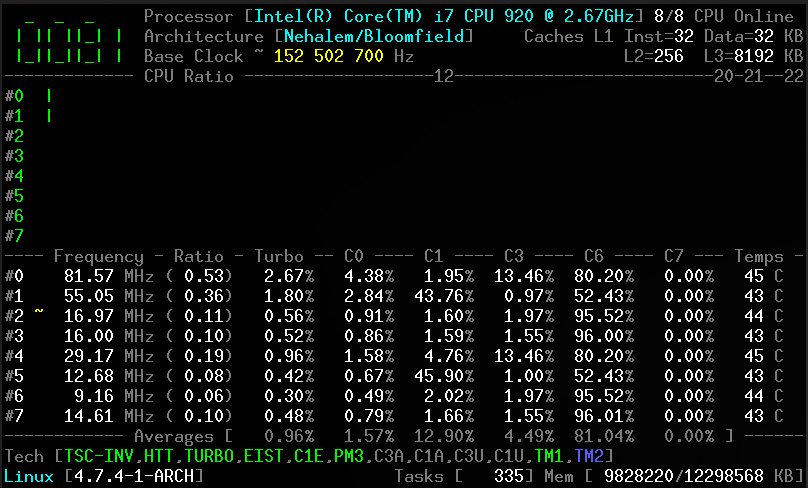

目录：
- [为何有本文](#为何有本文)
- [什么是动态 CPU 频率](#什么是动态-cpu-频率)
	- [什么是 p-state](#什么是-p-state)
- [Linux CPU 性能伸缩(CPU performance scaling)](#linux-cpu-性能伸缩cpu-performance-scaling)
	- [CPUFreq Policy(CPU 频率缩放策略)](#cpufreq-policycpu-频率缩放策略)
	- [CPUFreq Policy 的 sysfs 文件接口](#cpufreq-policy-的-sysfs-文件接口)
		- [policy 通用属性](#policy-通用属性)
	- [通用的 Scaling Governor](#通用的-scaling-governor)
		- [`performance` - Scaling Governor](#performance---scaling-governor)
		- [`powersave` - Scaling Governor](#powersave---scaling-governor)
	- [非 Intel CPU 的 Frequency Boost Support](#非-intel-cpu-的-frequency-boost-support)
		- [非 Intel CPU 的 boost 的 sysfs 文件接口](#非-intel-cpu-的-boost-的-sysfs-文件接口)
- [Intel CPU 的 Scaling Driver](#intel-cpu-的-scaling-driver)
	- [操作模式 (Operation Modes)](#操作模式-operation-modes)
		- [Active Mode](#active-mode)
			- [Active Mode 且开启 HWP](#active-mode-且开启-hwp)
				- [HWP + `performance`](#hwp--performance)
				- [HWP + `powersave`](#hwp--powersave)
			- [Active Mode 且禁用 HWP](#active-mode-且禁用-hwp)
		- [Passive Mode](#passive-mode)
	- [Turbo P-states Support](#turbo-p-states-support)
		- [`sysfs` 中的 `no_turbo` 属性](#sysfs-中的-no_turbo-属性)
	- [intel_pstate 的 sysfs 配置](#intel_pstate-的-sysfs-配置)
	- [Global Attributes](#global-attributes)
- [实时监控 CPU 实际频率](#实时监控-cpu-实际频率)
	- [turbostat](#turbostat)
	- [cpupower](#cpupower)
	- [内核日志](#内核日志)
		- [HWP 是否开启](#hwp-是否开启)
- [静态配置](#静态配置)

## 为何有本文

很多人知道 CPU 频率会影响 CPU 性能，也知道频率会动态变化，且知道 Linux 有 performance/powersave 两种频率控制策略。但很少人知道背后的软件原理，更少人知道如何调优策略，和监控实际 CPU 频率。本文想聊聊这些。

如，一个 CPU，有一堆特性，如何充分合理利用？

| 特性                                                         | 值       |
| ------------------------------------------------------------ | -------- |
| Total Cores                                                  | 20       |
| 超线程：Total Threads                                        | 40       |
|                                                              |          |
| 基础频率：Processor Base Frequency                           | 2.30 GHz |
| 最大超频频率：Max Turbo Frequency                            | 3.50 GHz |
|                                                              |          |
| 动态调频：Enhanced Intel SpeedStep® Technology               | ✔️        |
| 动态调频：Intel® Speed Shift Technology/Hardware p-state(HWP) | ✔️        |
|                                                              |          |
| 动态睿(超)频：Intel® Turbo Boost Technology                  | ✔️        |
| 动态睿(超)频：Intel® Turbo Boost Max Technology 3.0          | ✔️        |
|                                                              |          |
| 超线程：Intel® Hyper-Threading Technology                    | ✔️        |

本文是 《CPU 性能之迷》系列的 Part 2。系列列表：

1. [被误解的CPU利用率、超线程、动态调频 —— CPU 性能之迷 Part 1](https://blog.mygraphql.com/zh/notes/hw/hyper-threading/)
2. 谁动了我的 CPU 频率 —— CPU 性能之迷 Part 2(本文)

本系列的写作背景和原因在 Part 1 中介绍过，这里不重复了。

## 什么是动态 CPU 频率

> 以下部分内容参考：[CPU Performance Scaling](https://www.kernel.org/doc/html/v5.3/admin-guide/pm/cpufreq.html)

大多数现代处理器能够在许多不同的时钟频率和电压配置下运行，通常称为`Operating Performance Points`或 `p-state`。一般来说，时钟频率越高，电压越高，CPU在单位时间内可以执行的指令越多；但时钟频率越高，电压越高，消耗的电量就越多。 因此，CPU 容量（单位时间内可以执行的指令数）和 CPU 消耗的功率之间存在权衡。

在某些情况下，希望尽可能快地运行程序，那么应该使用最高可能达到的 `p-state`。然而，在其他一些情况下，对程序的执行速度没有要求，保持高频CPU会浪费电能。由于过热或电源电能容量等原因，物理上也可能无法长时间保持最大 CPU 频率。为了涵盖这些情况，有一些硬件接口允许 CPU 在不同的频率/电压配置之间切换，在 ACPI 术语中，这些配置叫 `p-state`。

可以由软/硬件算法一起来估算所需的 CPU 速度，从而决定将 CPU 置于哪个`p-state`。当然，由于系统的CPU利用率会随着时间而变化，因此必须定期执行算法。在 Linux 中，这种根据需求来调整 CPU 性能的技术称为` CPU 性能伸缩(CPU performance scaling)`或` CPU 频率伸缩(CPU frequency scaling)`。

### 什么是 p-state

> 见本系列的 Part 1：[被误解的CPU利用率、超线程、动态调频 —— CPU 性能之迷 Part 1 #动态调频 ](https://blog.mygraphql.com/zh/notes/hw/hyper-threading/#p-state-%E9%98%B6%E6%A2%AF%E9%A2%91%E7%8E%87)

## Linux CPU 性能伸缩(CPU performance scaling)

Linux 内核通过 `CPUFreq`（CPU 频率缩放）子系统支持 CPU 性能缩放，该子系统由三层组成：

1. `缩放核心(CPUFreq core)`

   `CPUFreq core` 为支持 CPU 性能扩展的所有平台提供`通用代码基础设施`和`用户空间接口`。 它定义了其他组件运行的基本框架。

2. `缩放调控器(scaling governors)`

   `缩放调控器(scaling governors)`运行算法来估计所需的 CPU 容量。 通常，每个`scaling governors`都实现一个可以参数化的`缩放算法(scaling algorithm)`。

3. `缩放驱动程序(scaling drivers)`

   `scaling drivers`与硬件对话。 它们为`scaling governors`提供可用的 `p-state`的信息，并通过使用硬件接口来根据`scaling governors`的请求更改 CPU  `p-state`。

原则上，所有可用的`scaling governors`都可以与任意`scaling drivers`组合使用。 该设计基于以下假设：在大多数情况下，`scaling algorithm`对于 `p-state`的选择依据可以独立于硬件平台，因此应该可以使用完全相同的`scaling algorithm`。 无论使用哪种`scaling drivers`，都使用相同的算法。 因此，同一组`scaling governors`应该适用于每个受支持的硬件平台。

然而，这种假设可能不适用于一些硬件特有机制（例如反馈寄存器）的`scaling algorithm`，因为该信息通常来自特定的硬件接口，并且可能不容易在抽象的平台中表示 。 出于这个原因，<mark>`CPUFreq` 允许`scaling drivers`绕过`scaling governors`并实现自己的`scaling algorithm`</mark>。  [`intel_pstate`](https://www.kernel.org/doc/html/v5.3/admin-guide/pm/intel_pstate.html) 这个`scaling drivers`就是这样做的。

以下是我画的说明图：



### CPUFreq Policy(CPU 频率缩放策略)

不是每个 CPU 都可以独立配置 `p-state`。Linux 为每组可以独立配置`p-state`的 CPU 定义一个对象：`CPUFreq Policy`，对应源码中的`struct cpufreq_policy`。

[struct cpufreq_policy](https://elixir.bootlin.com/linux/latest/source/include/linux/cpufreq.h#L55) ：

```c
struct cpufreq_cpuinfo {
	unsigned int		max_freq;
	unsigned int		min_freq;

	/* in 10^(-9) s = nanoseconds */
	unsigned int		transition_latency;
};

struct cpufreq_policy {	
	/* CPUs sharing clock, require sw coordination */
	cpumask_var_t		cpus;	/* Online CPUs only */
	cpumask_var_t		related_cpus; /* Online + Offline CPUs */
	cpumask_var_t		real_cpus; /* Related and present */
	unsigned int		cpu;    /* cpu managing this policy, must be online */
	struct cpufreq_cpuinfo	cpuinfo;/* see above */
	unsigned int		min;    /* in kHz */
	unsigned int		max;    /* in kHz */
	unsigned int		cur;    /* in kHz, only needed if cpufreq
					 * governors are used */
	unsigned int		policy; /* see above */
	struct cpufreq_governor	*governor; /* see below */
    ...
```

`CPUFreq Policy`  对象与 `CPU`、`scaling drivers`、`scaling governors`、`CPU Scheduler` 的关系见下图：


> 上图是我按照 [CPU Performance Scaling - CPU Initialization](https://www.kernel.org/doc/html/v5.3/admin-guide/pm/cpufreq.html#:~:text=That%20callback%20is%20expected%20to%20register,in%20one%20go%20from%20scheduler%20context)  一文的文字来画的。想看细节和文字解释的同学可以细看这文章。

###  CPUFreq Policy 的 sysfs 文件接口

先来举个栗子，看看我的机器的文件目录结构：

<!-- PS1='user@C5:\w> ' -->

```bash
user@C5:/sys/devices/system/cpu> ll
total 0
drwxr-xr-x  8 root root    0 Mar 17 07:17 cpu0
drwxr-xr-x  8 root root    0 Mar 17 07:17 cpu1
drwxr-xr-x  8 root root    0 Mar 17 07:17 cpu10
...
drwxr-xr-x  8 root root    0 Mar 17 07:17 cpu78
drwxr-xr-x  8 root root    0 Mar 17 07:17 cpu79
drwxr-xr-x  8 root root    0 Mar 17 07:17 cpu8
drwxr-xr-x  8 root root    0 Mar 17 07:17 cpu9
drwxr-xr-x 82 root root    0 Mar 17 07:17 cpufreq
drwxr-xr-x  2 root root    0 Jun 29 08:56 cpuidle
drwxr-xr-x  2 root root    0 Jun 29 08:56 hotplug
drwxr-xr-x  2 root root    0 Jun 29 08:56 intel_pstate
-r--r--r--  1 root root 4096 Jun 29 08:56 isolated
-r--r--r--  1 root root 4096 Jun 29 08:56 kernel_max
drwxr-xr-x  2 root root    0 Jun 29 08:56 microcode
-r--r--r--  1 root root 4096 Jun 29 08:56 modalias
-r--r--r--  1 root root 4096 Jun 29 08:56 nohz_full
-r--r--r--  1 root root 4096 Jun 29 08:56 offline
-r--r--r--  1 root root 4096 Mar 17 07:17 online
-r--r--r--  1 root root 4096 Jun 29 08:56 possible
drwxr-xr-x  2 root root    0 Jun 29 08:56 power
-r--r--r--  1 root root 4096 Jun 29 08:56 present
drwxr-xr-x  2 root root    0 Jun 29 08:56 smt
-rw-r--r--  1 root root 4096 Mar 17 07:17 uevent
drwxr-xr-x  2 root root    0 Jun 29 08:56 vulnerabilities
```

这是有两个  socket  Intel CPU 的 NUMA 机器，每 socket CPU 有 20 core，每个 core 有 2 个 超线程，共 2 * 20 * 2 = 80 个逻辑 CPU。

再看看定义了多少个 `CPUFreq Policy` ：

```bash
$ ll /sys/devices/system/cpu/cpufreq
total 0
drwxr-xr-x 2 root root 0 Mar 17 07:17 policy0
drwxr-xr-x 2 root root 0 Mar 17 07:17 policy1
drwxr-xr-x 2 root root 0 Mar 17 07:17 policy10
drwxr-xr-x 2 root root 0 Mar 17 07:17 policy11
drwxr-xr-x 2 root root 0 Mar 17 07:17 policy12
drwxr-xr-x 2 root root 0 Mar 17 07:17 policy13
drwxr-xr-x 2 root root 0 Mar 17 07:17 policy14
...
drwxr-xr-x 2 root root 0 Mar 17 07:17 policy74
drwxr-xr-x 2 root root 0 Mar 17 07:17 policy75
drwxr-xr-x 2 root root 0 Mar 17 07:17 policy76
drwxr-xr-x 2 root root 0 Mar 17 07:17 policy77
drwxr-xr-x 2 root root 0 Mar 17 07:17 policy78
drwxr-xr-x 2 root root 0 Mar 17 07:17 policy79
drwxr-xr-x 2 root root 0 Mar 17 07:17 policy8
drwxr-xr-x 2 root root 0 Mar 17 07:17 policy9
```

再看看 `CPUFreq Policy`的配置：

```bash
user@C5:/sys/devices/system/cpu/cpufreq/policy0> ll /sys/devices/system/cpu/cpufreq/policy0
total 0
-r--r--r-- 1 root root 4096 Jun 29 09:16 affected_cpus
-r--r--r-- 1 root root 4096 Jun 29 09:16 base_frequency
-r--r--r-- 1 root root 4096 Mar 17 07:18 cpuinfo_max_freq
-r--r--r-- 1 root root 4096 Jun 29 09:16 cpuinfo_min_freq
-r--r--r-- 1 root root 4096 Jun 29 09:16 cpuinfo_transition_latency
-r--r--r-- 1 root root 4096 Jun 29 09:16 energy_performance_available_preferences
-rw-r--r-- 1 root root 4096 Jun 29 09:16 energy_performance_preference
-r--r--r-- 1 root root 4096 Jun 29 09:16 related_cpus
-r--r--r-- 1 root root 4096 Jun 29 09:16 scaling_available_governors
-r--r--r-- 1 root root 4096 Jun 29 09:16 scaling_cur_freq
-r--r--r-- 1 root root 4096 Jun 29 09:16 scaling_driver
-rw-r--r-- 1 root root 4096 Mar 17 07:17 scaling_governor
-rw-r--r-- 1 root root 4096 Jun 29 09:16 scaling_max_freq
-rw-r--r-- 1 root root 4096 Jun 29 09:16 scaling_min_freq
-rw-r--r-- 1 root root 4096 Jun 29 09:16 scaling_setspeed
```

看看 `CPUFreq Policy`的引用 CPU:

```bash
user@C5:/sys/devices/system/cpu/cpufreq/policy0> ll /sys/devices/system/cpu/cpu0/
total 0
drwxr-xr-x 6 root root    0 Mar 17 07:17 cache
lrwxrwxrwx 1 root root    0 Mar 17 07:17 cpufreq -> ../cpufreq/policy0 <<---
-r-------- 1 root root 4096 Jun 29 09:25 crash_notes
-r-------- 1 root root 4096 Jun 29 09:25 crash_notes_size
lrwxrwxrwx 1 root root    0 Jun 29 09:25 driver -> ../../../../bus/cpu/drivers/processor
lrwxrwxrwx 1 root root    0 Jun 29 09:25 firmware_node -> ../../../xyz
drwxr-xr-x 2 root root    0 Jun 29 09:25 hotplug
drwxr-xr-x 2 root root    0 Jun 29 09:25 microcode
lrwxrwxrwx 1 root root    0 Jun 29 09:25 node0 -> ../../node/node0
drwxr-xr-x 2 root root    0 Jun 29 09:25 power
lrwxrwxrwx 1 root root    0 Mar 17 07:17 subsystem -> ../../../../bus/cpu
drwxr-xr-x 2 root root    0 Mar 17 07:19 thermal_throttle
drwxr-xr-x 2 root root    0 Mar 17 07:17 topology
-rw-r--r-- 1 root root 4096 Mar 17 07:17 uevent
```


> 参考：[Policy Interface in `sysfs`](https://www.kernel.org/doc/html/v5.3/admin-guide/pm/cpufreq.html#policy-interface-in-sysfs)

在内核的初始化过程中，`CPUFreq core` 在 `/sys/devices/system/cpu/` 下创建了一个名为 `cpufreq` 的目录。

该目录包含一个由 “`CPUFreq core`” 维护的每个策略对象的 “`policyX`” 子目录（其中“X”代表一个整数）。

每个 `policyX` 目录都被 `/sys/devices/system/cpu/cpuY/` 下的 `cpufreq` 符号链接指向与给定策略关联。 

`/sys/devices/system/cpu/cpufreq` 中的 `policyX` 目录每个都包含特定于策略的属性（文件），以控制相应策略对象（即与它们关联的所有 CPU）的 `CPUFreq` 行为）。

其中一些属性是通用的。它们由 “`CPUFreq core` ” 创建，它们的行为通常不依赖于正在使用的`scaling driver`以及附加到给定策略的`scaling governor`。一些`scaling driver`还将驱动程序特定的属性添加到 `sysfs` 中的策略目录，以控制驱动程序的策略特定行为。

#### policy 通用属性

`/sys/devices/system/cpu/cpufreq/policyX/` 下的通用属性如下（懒得翻译了）：


- affected_cpus

  List of online CPUs belonging to this policy (i.e. sharing the hardware performance scaling interface represented by the `policyX` policy object).

- bios_limit

  If the platform firmware (BIOS) tells the OS to apply an upper limit to CPU frequencies, that limit will be reported through this attribute (if present).

  The existence of the limit may be a result of some (often unintentional) BIOS settings, restrictions coming from a service processor or another BIOS/HW-based mechanisms.

	This does not cover ACPI thermal limitations which can be discovered through a generic thermal driver.

	This attribute is not present if the scaling driver in use does not support it.

- cpuinfo_cur_freq

	Current frequency of the CPUs belonging to this policy as obtained from the hardware (in KHz).

	This is expected to be the frequency the hardware actually runs at. If that frequency cannot be determined, this attribute should not be present.

- cpuinfo_max_freq

	Maximum possible operating frequency the CPUs belonging to this policy can run at (in kHz).

- cpuinfo_min_freq

	Minimum possible operating frequency the CPUs belonging to this policy can run at (in kHz).

- cpuinfo_transition_latency

	The time it takes to switch the CPUs belonging to this policy from one P-state to another, in nanoseconds.

	If unknown or if known to be so high that the scaling driver does not work with the [ondemand](https://www.kernel.org/doc/html/v5.3/admin-guide/pm/cpufreq.html#ondemand) governor, -1 (`CPUFREQ_ETERNAL`) will be returned by reads from this attribute.

- related_cpus

	List of all (online and offline) CPUs belonging to this policy.

- scaling_available_governors

	List of `CPUFreq` scaling governors present in the kernel that can be attached to this policy or (if the [intel_pstate](https://www.kernel.org/doc/html/v5.3/admin-guide/pm/intel_pstate.html) scaling driver is in use) list of scaling algorithms provided by the driver that can be applied to this policy.

	[Note that some governors are modular and it may be necessary to load a kernel module for the governor held by it to become available and be listed by this attribute.]

- scaling_cur_freq

	Current frequency of all of the CPUs belonging to this policy (in kHz).

	In the majority of cases, this is the frequency of the last P-state requested by the scaling driver from the hardware using the scaling interface provided by it, which may or may not reflect the frequency the CPU is actually running at (due to hardware design and other limitations).

	Some architectures (e.g. `x86`) may attempt to provide information more precisely reflecting the current CPU frequency through this attribute, but that still may not be the exact current CPU frequency as seen by the hardware at the moment.

- scaling_driver

	The scaling driver currently in use.

- scaling_governor

	The scaling governor currently attached to this policy or (if the [intel_pstate](https://www.kernel.org/doc/html/v5.3/admin-guide/pm/intel_pstate.html) scaling driver is in use) the scaling algorithm provided by the driver that is currently applied to this policy.

	This attribute is read-write and writing to it will cause a new scaling governor to be attached to this policy or a new scaling algorithm provided by the scaling driver to be applied to it (in the [intel_pstate](https://www.kernel.org/doc/html/v5.3/admin-guide/pm/intel_pstate.html) case), as indicated by the string written to this attribute (which must be one of the names listed by the `scaling_available_governors` attribute described above).

- scaling_max_freq

	Maximum frequency the CPUs belonging to this policy are allowed to be running at (in kHz).

	This attribute is read-write and writing a string representing an integer to it will cause a new limit to be set (it must not be lower than the value of the `scaling_min_freq` attribute).

- scaling_min_freq

	Minimum frequency the CPUs belonging to this policy are allowed to be running at (in kHz).

	This attribute is read-write and writing a string representing a non-negative integer to it will cause a new limit to be set (it must not be higher than the value of the `scaling_max_freq` attribute).

- scaling_setspeed

	This attribute is functional only if the [userspace](https://www.kernel.org/doc/html/v5.3/admin-guide/pm/cpufreq.html#userspace) scaling governor is attached to the given policy.

	It returns the last frequency requested by the governor (in kHz) or can be written to in order to set a new frequency for the policy.

### 通用的 Scaling Governor

> 参考：[Generic Scaling Governors](https://www.kernel.org/doc/html/v5.3/admin-guide/pm/cpufreq.html#generic-scaling-governors)

借助 `sysfs` 中的 `scaling_governor` 策略属性(`/sys/devices/system/cpu/cpufreq/policyX/scaling_governor`)，可以随时更改给定`CPUFreq Policy` 的`scaling governors`。

一些`scaling governor`公开 `sysfs` 属性来控制或微调它们实现的缩放算法。 这些属性称为`scaling governor`可调参数，可以是全局（系统范围）或每个策略独立，具体取决于使用的`scaling drivers`。 

- 如果`scaling drivers`需要每个策略的`scaling governors`可调参数，它们位于每个策略目录的子目录中(`/sys/devices/system/cpu/cpufreq/policyX`)。 
- 否则，它们位于 `/sys/devices/system/cpu/cpufreq/` 下的子目录中。 

在任何一种情况下，包含子目录的名称都是提供它们的`scaling governor`的名称。

上面的例子中，因为是 Intel 缩放驱动程序(scaling drivers - intel_pstate)，所以没有任何这样的子目录。

#### `performance` - Scaling Governor

当附加到策略对象时，此调控器会在 `scaling_max_freq` 策略限制内为该策略请求最高频率。

#### `powersave` - Scaling Governor

当附加到策略对象时，此调控器会导致在 `scaling_min_freq` 策略限制内为该策略请求最低频率。

### 非 Intel CPU 的 Frequency Boost Support

> 参考：[Frequency Boost Support](https://www.kernel.org/doc/html/v5.3/admin-guide/pm/cpufreq.html#frequency-boost-support)

某些处理器支持在某些条件下临时提高多核封装中某些内核的工作频率（并高于整个封装的可持续频率阈值）的机制，例如，如果整个芯片未充分利用并且低于其预期的热或功率预算时开启。

不同的供应商使用不同的名称来指代此功能。对于 Intel CPU，它被称为“`Turbo Boost`”，AMD 称之为“`Turbo-Core`”或（在技术文档中）“Core Performance Boost”等等。通常，不同的供应商也以不同的方式实现它。为了简洁起见，这里使用简单的术语“`频率提升(frequency boost)`”来指代所有这些实现。

`frequency boost`机制可以是基于硬件或基于软件的。如果它是基于硬件的（例如在 x86 上），触发升压的决定是由硬件做出的（尽管通常它需要将硬件置于可以将 CPU 频率控制在一定范围内的特殊状态） .如果它是基于软件的（例如在 ARM 上），则`scaling driver`决定是否触发 boost 以及何时触发。

#### 非 Intel CPU 的 boost 的 sysfs 文件接口

该文件位于`/sys/devices/system/cpu/cpufreq/` 下，控制整个系统的“`boost`”设置。如果底层`scaling driver`不支持频率提升机制（或支持它，但提供用于控制它的驱动程序特定接口，如 [intel\_pstate](https://www.kernel.org/doc/html/v5.3/admin-guide/pm/intel_pstate.html)，则不存在)。

如果该文件中的值为1，则启用频率提升机制。这意味着可以将硬件置于能够触发升压的状态（在基于硬件的情况下），或者允许软件触发升压（在基于软件的情况下）。这并不意味着目前在系统中的任何 CPU 上都实际使用了boost功能。它仅意味着允许使用频率提升机制（由于其他原因可能永远不会使用）。

如果该文件中的值为0，则频率提升机制被禁用。

可以写入此文件的值是 0 和 1。

## Intel CPU 的 Scaling Driver

`intel_pstate` 是 Linux 内核 [CPU 性能扩展子系统](https://www.kernel.org/doc/html/v5.3/admin-guide/pm/cpufreq.html)  `CPUFreq` 的组成部分。 它是 Sandy Bridge 和下一代英特尔处理器的`Scaling Driver`。

对于 `intel_pstate` 支持的处理器，`p-state`的概念不仅仅是一个`工作频率`或一个`工作性能点 Operating Performance Points`。出于这个原因，`intel_pstate` 使用的`p-state`的表示在内部遵循硬件规范（详细信息请参阅[英特尔软件开发人员手册](https://www.kernel.org/doc/html /v5.3/admin-guide/pm/intel_pstate.html#id5))。但是，`CPUFreq core` 使用`频率`来识别 CPU 的`Operating Performance Points`，并且频率涉及到它所暴露的用户空间接口，因此`intel_pstate` 也将其 `p-state`的内部表示映射到频率（幸运的是，该映射是精确的）。同时，由于可用频率表的大小限制，`intel_pstate` 为`CPUFreq core` 提供所有可用频率表是不切实际的，因此驱动程序不会这样做。`CPUFreq core`的某些功能受此限制。

由于 `intel_pstate` 使用的硬件 `p-state`选择接口在逻辑 CPU 级别可用，因此驱动程序始终与单个 CPU 一起工作。因此，如果 `intel_pstate` 正在使用中，则每个 `CPUFreq` 策略对象对应一个逻辑 CPU，并且 `CPUFreq` 策略实际上等效于 CPU。

`intel_pstate` 不是模块化的，因此无法动态卸载，这意味着将早期配置参数传递给它的唯一方法是通过内核命令行。但是，它的配置可以通过`sysfs`进行调整。

### 操作模式 (Operation Modes)

`intel_pstate` 可以在三种不同的模式下运行：

- 在有硬件管理 `p-state` 支持的`主动模式 Active Mode`下
- 在没有硬件管理 `p-state` 支持的`主动模式 Active Mode`下
- 在`被动模式 Passive Mode`下

 它们中的哪一个会生效取决于所使用的内核命令行(内核启动参数)选项以及处理器的能力。

#### Active Mode

这是 `intel_pstate` 的默认操作模式。如果它在此模式下工作，则所有 `CPUFreq` 策略的 `sysfs` 中的 `scaling_driver` 策略属性包含字符串 “`intel_pstate`”。

在此模式下，驱动程序绕过“`CPUFreq`”的`scaling governor`，并为 P-state 选择提供自己的缩放算法。这些算法可以以与通用`scaling governor`相同的方式应用于“`CPUFreq`”策略（即，通过“`sysfs`”中的“`scaling_governor`”策略属性）。 \[请注意，可以为不同的策略选择不同的`p-state`选择算法，但不建议这样做。\]

它们不是通用的`scaling governor`，但它们的名称与其中一些`scaling governor`的名称相同。此外，令人困惑的是，它们的工作方式通常与它们同名的通用`scaling governor`不同。例如，`intel_pstate` 提供的`powersave` `p-state` 选择算法与通用`powersave governor` 不同（大致对应于`schedutil` 和`ondemand` 调控器）。

`intel_pstate` 在活动模式下提供了两种 `p-state`选择算法：`powersave` 和 `performance`。它们的运行方式取决于处理器中是否启用了硬件管理的`p-state`  (`HWP`) 功能，并且可能取决于处理器型号。

默认使用哪种 `p-state`选择算法取决于 `CONFIG_CPU_FREQ_DEFAULT_GOV_PERFORMANCE` 内核配置选项。即，如果设置了该选项，则默认使用“`performance`”算法，如果未设置，则默认使用另一种算法。

##### Active Mode 且开启 HWP

如果处理器支持 HWP(Intel 叫 `Intel® Speed Shift Technology` ) 功能，它将在处理器初始化期间启用，之后将无法禁用。 可以通过在命令行中将 `intel_pstate=no_hwp` 参数传递给内核来避免启用它。

如果启用了 HWP 功能，intel_pstate 依靠处理器自行选择`p-state`，但它仍然可以提示处理器内部的 `p-state`选择逻辑。 这些提示是什么取决于已将哪种`p-state`选择算法应用于给定策略（或其对应的 CPU）。

即使处理器自动执行 `p-state`选择，`intel_pstate` 也会在此模式下向 CPU 调度程序注册利用率更新回调。 但是，它们不用于运行 `p-state`选择算法，而是用于定时更新 `sysfs` 中的 `scaling_cur_freq` 当前 CPU 频率信息。

###### HWP + `performance`

在此配置中，`intel_pstate` 会将 0 写入处理器的 `Energy-Performance Preference (EPP)` 寄存器（如果支持）或它的 `Energy-Performance Bias (EPB)` 寄存器，这意味着处理器的内部 `p-state`选择逻辑是将完全专注于性能。

这将覆盖来自 `sysfs` 文件接口的 EPP/EPB 设置。

此外，在此配置中，处理器内部可用的 `p-state`范围始终限制在 `intel_pstate`驱动程序配置的最大 `p-state` 内。

###### HWP + `powersave`

不说明了，这个生产不常用。

##### Active Mode 且禁用 HWP

不说明了，这个生产不常用。

#### Passive Mode

如果在命令行中将 `intel_pstate=passive` 参数传递给内核，则使用此模式（这也暗示了 `intel_pstate=no_hwp` 设置）。就像在没有 `HWP` 支持的活动模式下一样，在这种模式下，“`intel_pstate`”可能会拒绝与给定的处理器一起工作，如果它不能识别它。

如果驱动程序在此模式下工作，则所有 `CPUFreq` 策略的 `sysfs` 中的 `scaling_driver` 策略属性都包含字符串“`intel_cpufreq`”。然后，驱动程序的行为类似于常规的`CPUFreq` `scaling driver`。也就是说，当需要与硬件对话以更改 CPU 的 `p-state`，通用`scaling governor`会调用它（特别是，`schedutil` 调控器可以直接从调度程序上下文中调用它）。

在此模式下，`intel_pstate` 可以与 `sysfs` 中的 `scaling_available_governors` 策略属性列出的所有（通用）`scaling governor`一起使用（并且不使用上述 `p-state`选择算法）。然后，它负责配置与 CPU 对应的策略对象，并为“`CPUFreq core`”（以及附加到策略对象的缩放调控器）提供有关硬件支持的最大和最小运行频率的准确信息（包括 所谓“`Turbo`”频率范围）。换句话说，在被动模式下，整个可用 `p-state`范围都由“`intel_pstate`”暴露给“`CPUFreq core`”。但是，在这种模式下，驱动程序不会向 CPU 调度程序注册利用率更新回调，并且 `scaling_cur_freq` 信息来自 `CPUFreq` 内核（并且是当前`scaling governor`为给定策略选择的最后一个频率）。

### Turbo P-states Support

在大多数情况下，可用于“`intel_pstate`”的整个 `p-state` 围可以分为两个子范围：

- 高于`turbo threshold(阈值)`
- 低于turbo threshold(阈值)`

高于 turbo 阈值的 `p-state` 称为“`turbo p-state`”，它们所属的 `p-state`的整个子范围称为“`turbo 范围`”。这些名称与 `Turbo Boost` 技术有关，如果有足够的功率并且不会导致处理器过热时，一个或多个内核的 `p-state`可以在`turbo p-state`上。

具体来说，如果软件将 CPU 内核的 `p-state`设置在 turbo 范围内（即高于 turbo 阈值），则允许处理器接管该内核的性能扩展控制并将其置于其自身的`turbo p-state`。未来的选择。但是，不同代的处理器对该权限有不同的解释。也就是说：

- `Sandy Bridge` 代处理器永远不会使用高于软件为给定内核设置的最后一个 `p-state`的任何 `p-state`，即使它在 turbo 范围内。
- 而所有`Sandy Bridge`后的处理器，都将设置任何`turbo p-state` 范围的 `p-state`，认为许可使用 turbo 的任何 `p-state`，甚至高于软件设置的 `p-state`。换句话说，在这些处理器上，设置任何`turbo p-state` 范围的 `p-state`将使处理器能够将给定的内核置于所有  `turbo p-state`。

 `turbo p-state`的一个重要特性是它们是不可持续的。更准确地说，不能保证任何 CPU 都能够无限期地保持在这些状态，因为处理器内的功率和热分布可能会随着时间而改变。

反过来，低于 Turbo 阈值的 `p-state`通常是可持续的。事实上，如果由软件指定了一个低于 Turbo 阈值的 `p-state`，处理器不会将其更改为更低的，除非在过热或功率限制情况下。

一些处理器允许多个内核同时处于  `turbo p-state`，但可以为它们设置的最大 `p-state`通常取决于同时运行的内核数量。

#### `sysfs` 中的 `no_turbo` 属性

 `sysfs` 中的 `no_turbo` 属性(`/sys/devices/system/cpu/intel_pstate/no_turbo`)可以控制是否禁用 `turbo p-state`。 如果设置为禁用，即`1`，则`intel_pstate`将不使用 `turbo p-state`的频率，即，不使用 CPU 的 `Intel® Turbo Boost Technology` 技术 。

### intel_pstate 的 sysfs 配置

### Global Attributes

`intel_pstate` exposes several global attributes (files) in `sysfs` to control its functionality at the system level. They are located in the `/sys/devices/system/cpu/intel_pstate/` directory and affect all CPUs.

Some of them are not present if the `intel_pstate=per_cpu_perf_limits` argument is passed to the kernel in the command line.

- `max_perf_pct`

  Maximum P-state the driver is allowed to set in percent of the maximum supported performance level (the highest supported [turbo P-state](https://www.kernel.org/doc/html/v5.3/admin-guide/pm/intel_pstate.html#turbo)).This attribute will not be exposed if the `intel_pstate=per_cpu_perf_limits` argument is present in the kernel command line.

- `min_perf_pct`

  Minimum P-state the driver is allowed to set in percent of the maximum supported performance level (the highest supported [turbo P-state](https://www.kernel.org/doc/html/v5.3/admin-guide/pm/intel_pstate.html#turbo)).This attribute will not be exposed if the `intel_pstate=per_cpu_perf_limits` argument is present in the kernel command line.

- `num_pstates`

  Number of P-states supported by the processor (between 0 and 255 inclusive) including both turbo and non-turbo P-states (see [Turbo P-states Support](https://www.kernel.org/doc/html/v5.3/admin-guide/pm/intel_pstate.html#turbo-p-states-support)).The value of this attribute is not affected by the `no_turbo` setting described [below](https://www.kernel.org/doc/html/v5.3/admin-guide/pm/intel_pstate.html#no-turbo-attr).This attribute is read-only.

- `turbo_pct`

  Ratio of the [turbo range](https://www.kernel.org/doc/html/v5.3/admin-guide/pm/intel_pstate.html#turbo) size to the size of the entire range of supported P-states, in percent.This attribute is read-only.

- `no_turbo`

  If set (equal to 1), the driver is not allowed to set any turbo P-states (see [Turbo P-states Support](https://www.kernel.org/doc/html/v5.3/admin-guide/pm/intel_pstate.html#turbo-p-states-support)). If unset (equalt to 0, which is the default), turbo P-states can be set by the driver. [Note that `intel_pstate` does not support the general `boost` attribute (supported by some other scaling drivers) which is replaced by this one.]This attrubute does not affect the maximum supported frequency value supplied to the `CPUFreq` core and exposed via the policy interface, but it affects the maximum possible value of per-policy P-state limits (see [Interpretation of Policy Attributes](https://www.kernel.org/doc/html/v5.3/admin-guide/pm/intel_pstate.html#interpretation-of-policy-attributes) below for details).

- `hwp_dynamic_boost`

  This attribute is only present if `intel_pstate` works in the [active mode with the HWP feature enabled](https://www.kernel.org/doc/html/v5.3/admin-guide/pm/intel_pstate.html#active-mode-with-hwp) in the processor. If set (equal to 1), it causes the minimum P-state limit to be increased dynamically for a short time whenever a task previously waiting on I/O is selected to run on a given logical CPU (the purpose of this mechanism is to improve performance).This setting has no effect on logical CPUs whose minimum P-state limit is directly set to the highest non-turbo P-state or above it.

- `status`

  Operation mode of the driver: "active", "passive" or "off"."active"The driver is functional and in the [active mode](https://www.kernel.org/doc/html/v5.3/admin-guide/pm/intel_pstate.html#active-mode)."passive"The driver is functional and in the [passive mode](https://www.kernel.org/doc/html/v5.3/admin-guide/pm/intel_pstate.html#passive-mode)."off"The driver is not functional (it is not registered as a scaling driver with the `CPUFreq` core).This attribute can be written to in order to change the driver's operation mode or to unregister it. The string written to it must be one of the possible values of it and, if successful, the write will cause the driver to switch over to the operation mode represented by that string - or to be unregistered in the "off" case. [Actually, switching over from the active mode to the passive mode or the other way around causes the driver to be unregistered and registered again with a different set of callbacks, so all of its settings (the global as well as the per-policy ones) are then reset to their default values, possibly depending on the target operation mode.]That only is supported in some configurations, though (for example, if the [HWP feature is enabled in the processor](https://www.kernel.org/doc/html/v5.3/admin-guide/pm/intel_pstate.html#active-mode-with-hwp), the operation mode of the driver cannot be changed), and if it is not supported in the current configuration, writes to this attribute will fail with an appropriate error.

### intel_pstate  的几种 `Scaling Governor` 比较

> 这文章作了个比较 ：[Intel Hardware P-State (HWP) / Intel Speed Shift](https://smackerelofopinion.blogspot.com/2021/07/intel-hardware-p-state-hwp-intel-speed.html)

## Intel(R) Speed Select Technology

> [Intel(R) Speed Select Technology User Guide](https://www.kernel.org/doc/html/latest/admin-guide/pm/intel-speed-select.html#intel-r-speed-select-technology-turbo-frequency-intel-r-sst-tf)

## 实时监控 CPU 实际频率

以上是说原理和逻辑。但有运维经验的人也知道，内核逻辑每个版本都在变，硬件 CPU 也在变，如何做好实际的监控，才是硬道理。

### corefreq-cli


[CoreFreq](https://github.com/cyring/CoreFreq), a CPU monitoring software with BIOS like functionalities, is designed for the 64-bits Processors of architecture Intel Atom, Core2, Nehalem, SandyBridge and superiors; AMD Families from 0Fh ... up to 17h (Zen , Zen+ , Zen2), 18h (Hygon Dhyana), 19h (Zen3)



### turbostat

```bash
$ turbostat

# 列出了 CPU 的活动核数，与 turbo 频率的关系
10 * 100.0 = 1000.0 MHz max efficiency frequency
23 * 100.0 = 2300.0 MHz base frequency
...
29 * 100.0 = 2900.0 MHz max turbo 28 active cores
29 * 100.0 = 2900.0 MHz max turbo 24 active cores
29 * 100.0 = 2900.0 MHz max turbo 20 active cores
31 * 100.0 = 3100.0 MHz max turbo 16 active cores
32 * 100.0 = 3200.0 MHz max turbo 12 active cores
32 * 100.0 = 3200.0 MHz max turbo 8 active cores
33 * 100.0 = 3300.0 MHz max turbo 4 active cores
35 * 100.0 = 3500.0 MHz max turbo 2 active cores

## 列出当前 CPU 频率与热量
Package Core    CPU     Avg_MHz Busy%   Bzy_MHz TSC_MHz IRQ     SMI     CPU%c1  CPU%c6  CoreTmp PkgTmp  PkgWatt RAMWatt PKG_%   RAM_%
-       -       -       166     7.21    2300    2297    354504  0       92.79   0.00    58      60      125.28  0.00    0.00    0.00
0       0       0       261     11.37   2300    2295    5924    0       88.63   0.00    50      51      61.78   0.00    0.00    0.00
0       0       40      278     12.11   2300    2295    3828    0       87.89
0       1       1       341     14.85   2300    2295    4336    0       85.15   0.00    47
0       1       41      153     6.68    2300    2295    4089    0       93.32
0       2       2       126     5.50    2300    2295    4327    0       94.50   0.00    48
0       2       42      207     9.03    2300    2295    3606    0       90.97
0       3       3       102     4.45    2300    2295    4606    0       95.55   0.00    51
0       3       43      128     5.57    2300    2295    4892    0       94.43
```

### cpupower

```bash
$ cpupower frequency-info

analyzing CPU 0:
  driver: intel_pstate
  CPUs which run at the same hardware frequency: 0
  CPUs which need to have their frequency coordinated by software: 0
  maximum transition latency:  Cannot determine or is not supported.
  hardware limits: 1000 MHz - 2.30 GHz
  available cpufreq governors: performance powersave
  current policy: frequency should be within 1000 MHz and 2.30 GHz.
                  The governor "performance" may decide which speed to use
                  within this range.
  current CPU frequency: Unable to call hardware
  current CPU frequency: 2.30 GHz (asserted by call to kernel)
  boost state support:
    Supported: no
    Active: no
```

> https://wiki.archlinux.org/title/CPU_frequency_scaling
>
> To monitor cpu speed in real time:
>
> ```bash
> $ watch cat /sys/devices/system/cpu/cpu[0-9]*/cpufreq/scaling_cur_freq
> ```


### 内核日志

#### HWP 是否开启

```bash
$ sudo less /var/log/boot.msg

<6>[    4.222598] intel_pstate: Intel P-state driver initializing
<6>[    4.225296] intel_pstate: HWP enabled  <<<<<----
```

## 静态配置

```bash
/etc/systemd $ sudo grep -R -i power *

logind.conf:#HandlePowerKey=poweroff
logind.conf:#PowerKeyIgnoreInhibited=no

system/multi-user.target.wants/cpupower.service:Description=CPU powersave
system/multi-user.target.wants/cpupower.service:ExecStart=/usr/bin/cpupower frequency-set -g performance

system/cpupower.service:Description=CPU powersave
system/cpupower.service:ExecStart=/usr/bin/cpupower frequency-set -g performance
```

