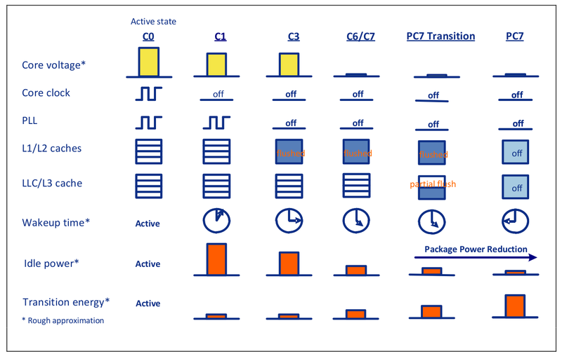
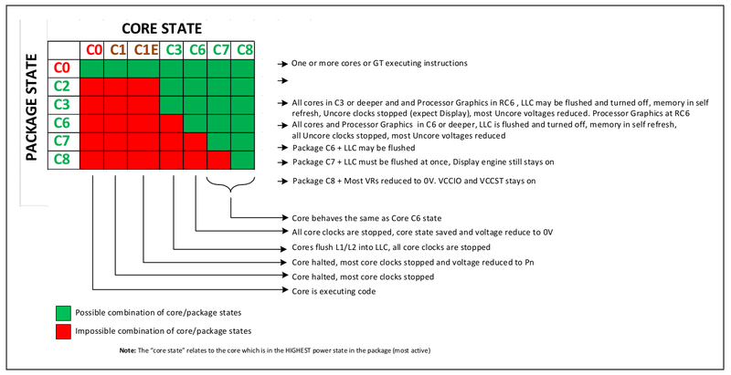

## What is C-states

> https://vstinner.github.io/intel-cpus.html

C-states are idle power saving states, in contrast to P-states, which are execution power saving states.

During a P-state, the processor is still executing instructions, whereas during a C-state (other than C0), the processor is idle, meaning that nothing is executing.

C-states:

- C0 is the operational state, meaning that the CPU is doing useful work
- C1 is the first idle state
- C2 is the second idle state: The external I/O Controller Hub blocks interrupts to the processor.
- etc.

When a logical processor is idle (C-state except of C0), its frequency is typically 0 (HALT).

The `cpupower idle-info` command lists supported C-states:

```
selma$ cpupower idle-info
CPUidle driver: intel_idle
CPUidle governor: menu
analyzing CPU 0:

Number of idle states: 6
Available idle states: POLL C1-IVB C1E-IVB C3-IVB C6-IVB C7-IVB
...
```

The `cpupower monitor` shows statistics on C-states:

```
smithers$ sudo cpupower monitor -m Idle_Stats
    |Idle_Stats
CPU | POLL | C1-S | C1E- | C3-S | C6-S
   0|  0,00|  0,19|  0,09|  0,58| 96,23
   4|  0,00|  0,00|  0,00|  0,00| 99,90
   1|  0,00|  2,34|  0,00|  0,00| 97,63
   5|  0,00|  0,00|  0,17|  0,00| 98,02
   2|  0,00|  0,00|  0,00|  0,00|  0,00
   6|  0,00|  0,00|  0,00|  0,00|  0,00
   3|  0,00|  0,00|  0,00|  0,00|  0,00
   7|  0,00|  0,00|  0,00|  0,00| 49,97
```

See also: [Power Management States: P-States, C-States, and Package C-States](https://software.intel.com/en-us/articles/power-management-states-p-states-c-states-and-package-c-states).


> https://www.thomas-krenn.com/en/wiki/Processor_P-states_and_C-states

Unlike the P-States, which are designed to optimize power consumption during code execution, C-States are used to optimize or reduce power consumption in idle mode (i. e. when no code is executed).

Typical C-states are:[[5\]](https://www.thomas-krenn.com/en/wiki/Processor_P-states_and_C-states#cite_note-5)

- C0 – Active Mode: Code is executed, in this state the P-States (see above) are also relevant.
- C1 – Auto Halt
- C1E – Auto halt, low frequency, low voltage
- C2 – Temporary state before C3. Memory path open
- C3 – L1/L2 caches flush, clocks off
- C6 – Save core states before shutdown and PLL off
- C7 – C6 + LLC may be flushed
- C8 – C7 + LLC must be flushed

> https://www.technikaffe.de/anleitung-32-c_states_p_states_s_states__energieverwaltung_erklaert

The **C-states** energy saving functions can be set in the BIOS. They are used to move the CPU (i.e. the processor) to an energy-saving mode when little or no performance is being used. This mode is also called **idle** . The C-States have to be supported by the hardware, but offer the greatest energy saving potential.

| **State** | **Name**              | **Latency to C0** | **power consumption\*** |
| --------- | --------------------- | ----------------- | ----------------------- |
| C0        | Operating Mode        |                   | 100%                    |
| C1        | Halt                  | ~ 1 µs            | 40%                     |
| C1E       | Enhanced Halt         | ~ 1-2 µs          | 35%                     |
| C2        | Stop Clock            | ~ 59 µs           | 30%                     |
| C2E       | Extended Stop         | ~ 70 µs           | 28%                     |
| C3        | Deep Sleep            | ~ 85 µs           | 26%                     |
| C4        | Deeper Sleep          | ~ 150 µs          | twenty four%            |
| C4E/C5    | Enhanced Deeper Sleep | ~ 250 µs          | twenty two%             |
| C6        | Deep Power Down       | ~ 300 µs          | 19%                     |
| C7        | Deeper Power Down     | ~ 400 µs          | 15%                     |

C-States can be distinguished according to core C-states (CC-states), package C-states (PC-states) and logical C-states. In most cases, the operating system sets a specific C-state for a core by executing the MWAIT command.[[6\]](https://www.thomas-krenn.com/en/wiki/Processor_P-states_and_C-states#cite_note-6)



 from https://www.intel.com/content/dam/doc/white-paper/energy-efficient-platforms-2011-white-paper.pdf

In general, it can be seen that the deeper the CPU "falls asleep", the longer it takes before the CPU can switch back to full load. This is logical, because with high C-states - from C6 - working memory and even parts of the internal cache are switched off.

> https://metebalci.com/blog/a-minimum-complete-tutorial-of-cpu-power-management-c-states-and-p-states/

A very basic timeline of power saving using C-states is:

- The normal operation is at C0.
- First, the clocks of idle core is stopped. (C1)
- Then, the local caches (L1/L2) of the core is flushed and the core is powered down. (C3)
- Then, when all the cores are powered down, the shared cache (L3/LLC) of the package is flushed and at the end the package/whole CPU can be (almost) powered down. I said almost because I guess there has to be something powered on to return back to C0.

As you might guess, CC-states and PC-states are not independent, so some combinations are impossible. Figure below summarizes this:



## CPU idle driver

> https://wiki.archlinux.org/title/CPU_frequency_scaling
>
> The `intel_idle` CPU idle driver is used automatically for modern Intel CPUs instead of the `acpi_idle` driver. This driver is currently automatically used for Sandy Bridge and newer CPUs. The `intel_idle` may ignore the BIOS C-State settings. If you encounter a problem while using this driver, add `intel_idle.max_cstate=0` to your kernel line.

> [ `intel_idle` CPU Idle Time Management Driver](https://www.kernel.org/doc/html/latest/admin-guide/pm/intel_idle.html)

## Processor power states (C-states) vs. performance states (P-states)

> https://metebalci.com/blog/a-minimum-complete-tutorial-of-cpu-power-management-c-states-and-p-states/

The two ways to decrease the power consumption of a processor:

- powering down subsystems
- voltage/frequency reduction

is accomplished by using:

- C-states
- P-states

respectively.

C-states describe the first case, so they are the idle (power saving) states. In order to power down a subsystem, that subsystem should not be running anything, so it should be at idle, doing nothing, executing nothing. So C-state x, Cx, means one or more subsystems of the CPU is at idle, powered down.

On the other hand, P-states describe the second case, so they are the executing (power saving) states. The subsystem is actually running but it does not require full performance so the voltage and/or frequency it operates is decreased. So P-state x, Px, means the subsystem it refers to (e.g. a CPU core) is operating at a specific (frequency, voltage) pair.

Because most modern CPUs have multiple cores in a single package, C-states are further divided into core C-states (CC-states) and package C-states (PC-states). The reason for PC-states is there are other (shared) components in the processor that can also be powered down after all cores using them are powered down (e.g. the shared cache). However, as a user or programmer, we cannot control these, since we do not interact with the package directly, but we interact with the individual cores. So we can only affect the CC-states directly, PC-states are indirectly affected based on the CC-states of the cores.

The states are numbered starting from zero like C0, C1… and P0, P1… The higher the number is the more power is saved. C0 means no power saving by shutting down something, so everything is powered on. P0 means maximum performance, thus maximum frequency, voltage and power used.


## How to programmatically request a lower-power C-state ?

> https://metebalci.com/blog/a-minimum-complete-tutorial-of-cpu-power-management-c-states-and-p-states/

The modern (but not only) way to request a low power state (thus state change from `C0` to others) is to use `MWAIT` or `HLT` instructions. These are priviliged instructions, they cannot be executed by user programs.

`MWAIT` (Monitor Wait) instructs the processor to enter an optimized state (C-state) while waiting for a write/write to a specified address range (set up by another instruction, `MONITOR`). For power management, `MWAIT` is used with EAX, and `EAX`[7:4] bits indicate the target C-state and `EAX`[3:0] indicate the sub C-state.

> Note: I believe at the moment only AMD has this, but there are also `MONITORX`/`MWAITX` instructions which, in addition to monitoring the write on an address-range, also checks the expiration of a timer. This is also called Timed `MWAIT`.

`HLT` (Halt) instruction stops execution and the core goes to HALT state until an interrupt occurs. This means the core switches to C1 or C1E state.

## [Kernel CPU Idle Time Management](https://www.kernel.org/doc/html/latest/admin-guide/pm/cpuidle.html#cpu-idle-time-management)

> https://www.kernel.org/doc/html/latest/admin-guide/pm/cpuidle.html

### The `menu` Governor

The `menu` governor is the default `CPUIdle` governor for tickless systems. It is quite complex, but the basic principle of its design is straightforward. Namely, when invoked to select an idle state for a CPU (i.e. an idle state that the CPU will ask the processor hardware to enter), it attempts to predict the idle duration and uses the predicted value for idle state selection.

### Idle States Control Via Kernel Command Line

In addition to the `sysfs` interface allowing individual idle states to be [disabled for individual CPUs](https://www.kernel.org/doc/html/latest/admin-guide/pm/cpuidle.html#idle-states-representation), there are kernel command line parameters affecting CPU idle time management.

The `cpuidle.off=1` kernel command line option can be used to disable the CPU idle time management entirely. It does not prevent the idle loop from running on idle CPUs, but it prevents the CPU idle time governors and drivers from being invoked. If it is added to the kernel command line, the idle loop will ask the hardware to enter idle states on idle CPUs via the CPU architecture support code that is expected to provide a default mechanism for this purpose. That default mechanism usually is the least common denominator for all of the processors implementing the architecture (i.e. CPU instruction set) in question, however, so it is rather crude and not very energy-efficient. For this reason, it is not recommended for production use.

The `cpuidle.governor=` kernel command line switch allows the `CPUIdle` governor to use to be specified. It has to be appended with a string matching the name of an available governor (e.g. `cpuidle.governor=menu`) and that governor will be used instead of the default one. It is possible to force the `menu` governor to be used on the systems that use the `ladder` governor by default this way, for example.

The other kernel command line parameters controlling CPU idle time management described below are only relevant for the *x86* architecture and some of them affect Intel processors only.

The *x86* architecture support code recognizes three kernel command line options related to CPU idle time management: `idle=poll`, `idle=halt`, and `idle=nomwait`. The first two of them disable the `acpi_idle` and `intel_idle` drivers altogether, which effectively causes the entire `CPUIdle` subsystem to be disabled and makes the idle loop invoke the architecture support code to deal with idle CPUs. How it does that depends on which of the two parameters is added to the kernel command line. In the `idle=halt` case, the architecture support code will use the `HLT` instruction of the CPUs (which, as a rule, suspends the execution of the program and causes the hardware to attempt to enter the shallowest available idle state) for this purpose, and if `idle=poll` is used, idle CPUs will execute a more or less “lightweight” sequence of instructions in a tight loop. [Note that using `idle=poll` is somewhat drastic in many cases, as preventing idle CPUs from saving almost any energy at all may not be the only effect of it. For example, on Intel hardware it effectively prevents CPUs from using P-states (see [CPU Performance Scaling](https://www.kernel.org/doc/html/latest/admin-guide/pm/cpufreq.html)) that require any number of CPUs in a package to be idle, so it very well may hurt single-thread computations performance as well as energy-efficiency. Thus using it for performance reasons may not be a good idea at all.]

## SUSE Linux

> https://doc.opensuse.org/documentation/leap/archive/42.3/tuning/html/book.sle.tuning/cha.tuning.power.html
> https://documentation.suse.com/sles/15-GA/html/SLES-all/cha-tuning-power.html
