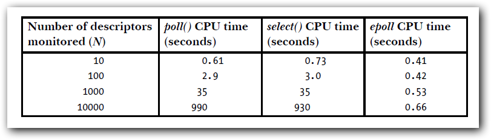
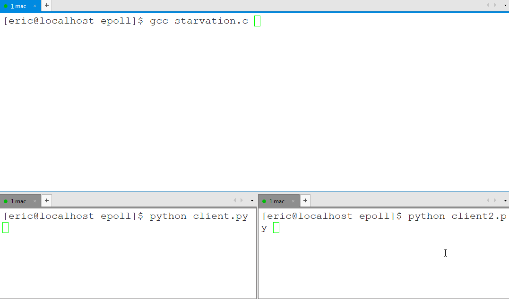
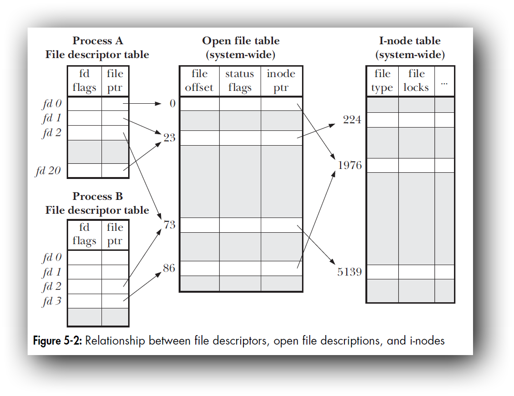

# Effective epoll

> http://www.ilovecpp.com/2019/01/20/effective-epoll/


标题碰瓷自scott meyers大师的Effective系列，他们是每个C++程序员都应该拜读的神作(有网友打趣到:”c++程序员可以分成两类，读过effective c++的和没读过的”)。

epoll顾名思义就是Event Poll，是Linux上一个非常”屌炸天”的多路复用机制(关于多路复用的概念可以参考知乎网友的解释:https://www.zhihu.com/question/32163005/answer/55772739)。

epoll出现之前Linux上已经有2个多路复用机制:select和poll，但是后两者在epoll面前显得比较鸡肋。



这是《THE LINUX PROGRAMMING INTERFACE》的关于这3个多路复用效率的对比,当需要监听的I/O事件数量比较大的时候，epoll的优势尤为明显。其原因主要体现在两个方面:

- 每次监听I/O事件的时候，不需要往内核传送大量的文件描述符集，epoll的兴趣列表(interest list)由内核维护的红黑树负责。
- epoll只会返回I/O就绪的文件描述符列表(ready list),因此不需要遍历所有的文件集去找发生的事件。（这个其实微不足道，甚至可以忽略，许多博客都喜欢把这个归纳为主要原因，上图的数据，不包括这个时间）


# 接口函数

与epoll相关的有3个系统调用,分别是：

| API          | 作用                                                         |
| :----------- | :----------------------------------------------------------- |
| epoll_create | 创建一个epoll实例，并且返回一个文件描述符来表示这个实例。    |
| epoll_ctl    | 添加，删除，修改epoll实例的兴趣列表。                        |
| epoll_wait   | 等待监听的I/O事件发生，会阻塞调用的线程，直到监控的事件来临。 |

epoll同其他的如select、poll等I/O多路复用模型相比，既支持`水平触发`也支持`边缘触发`，而后两者只支持水平触发。除非特别指定(设置标志EVENTET),默认情况下epoll提供的是水平触发通知。通常使用epoll的步骤为:

1. 使用epoll_create初始化，一个epoll实例
2. 将需要监控I/O事件的文件描述符，加入到epoll实例的兴趣列表上去
3. 阻塞当前线程直到I/O事件发生(或者超时)，返回结果

一个推荐的epoll编程范式是这样的：

```
void epollDemo()
{
    /*
     * Set up listening socket, 'listen_sock'
     * (socket(),bind(), listen())
     */

    struct epoll_event ev, events[MAX_EVENTS];
    int listen_sock,nfds, epollfd,n;

    //创建了epoll实例epollfd
    epollfd = epoll_create1(MAX_EVENTS);
    if (epollfd == -1)
        error_exit();

    //监听的listen_sock加入到epollfd的兴趣列表
    ev.events = EPOLLIN;
    ev.data.fd = listen_sock;
    if (epoll_ctl(epollfd, EPOLL_CTL_ADD, listen_sock, &ev) == -1)
        error_exit();

    for (;;)
    {
        //当前的线程会阻塞，直到兴趣列表上发生了监听的事件
        nfds = epoll_wait(epollfd, events, MAX_EVENTS, -1);
            error_exit();

        //会遍历所有的就绪事件
        for (n = 0; n < nfds; ++n)
        {
            //如果是listen_sock上的事件，表示有客户端连接了
            //就先accept这个连接，并将对应的conn_sock加入的epollfd的兴趣列表上
            //后续的epoll_wait就可以监听conn_sock了。
            if (events[n].data.fd == listen_sock)
            {
                struct sockaddr_in localaddr = {0}；
                socklen_t addrlen = sizeof(localaddr);
                int conn_sock = accept(listen_sock,(struct sockaddr *)&localaddr, &addrlen);
                if(conn_sock)
                    error_exit();
                setnonblocking(conn_sock);
                ev.events = EPOLLIN;
                ev.data.fd = conn_sock;
                if (epoll_ctl(epollfd, EPOLL_CTL_ADD, conn_sock,&ev) == -1)
                    error_exit();
            }
            else
            {
                // 对就绪的I/O事件，进行处理
            }
        }
    }
}
```

为了节省篇幅，上述代码省略了创建listen_sock的过程，也没有考虑epoll_wait被信号打断的情况，仅为了演示epoll的使用。

# 水平触发与边缘触发

通俗点来讲，关于这两者的区别是：

- 水平触发模式下，只要监控的文件描述符可以非阻塞地执行I/O，epoll_wait都会认为它已经就绪，触发通知。
- 边缘触发模式下，如果监控的文件描述符上发生了I/O事件，它只会提示一次，直到下次再有新的I/O活动之前都不会再通知了，无论文件描述符上是否还能非阻塞地执行I/O。

对于水平触发，每次文件描述符就绪的时候，没有必要每次尽可能多的执行I/O操作，因为只要是I/O没有执行完，后续(下一轮epoll_wait)该文件描述符仍会是就绪状态。而对于边缘触发模式，每次文件描述符就绪的时候，我们应该尽可能多的执行I/O，直到该文件描述符上的下一个I/O事件发生之前，我们都不会就收到通知了。

要尽可能多的执行I/O，我们需要使用循环处理,但是如果文件描述符是阻塞的，当没有更多的I/O可以执行的时候，I/O操作（read，write等）就会阻塞。因此，边缘触发模式下，epoll监听的文件描述符都需要被设置成非阻塞的。

关于水平触发和边缘触发哪个更加高效的问题，部分网友可能会有一个想当然的错觉，会以为边缘触发更快，其实这是没有依据的。还是要考虑使用场景的。关于这个问题，知乎的网友们有过讨论：https://www.zhihu.com/question/20502870。这里我摘了一段[brpc](https://github.com/brpc/brpc)作者的观点:

> 在eventloop类型(包括各类fiber/coroutine)的程序中, 处理逻辑和epoll_wait都在一个线程, ET相比LT没有太大的差别. 反而由于LT醒的更频繁, 可能时效性更好些. 在老式的多线程RPC实现中, 消息的读取分割和epoll_wait在同一个线程中运行, 类似上面的原因, ET和LT的区别不大.但在更高并发的RPC实现中, 为了对大消息的反序列化也可以并行, 消息的读取和分割可能运行和epoll_wait不同的线程中, 这时ET是必须的, 否则在读完数据前, epoll_wait会不停地无谓醒来.

# 饥饿现象

前面提到对于边缘触发，每次有文件描述符就绪的时候，要采用非阻塞的方式尽可能多的进行I/O。假设某一个就绪的文件描述符上，存在着大量的输入(例如客户端有一个死循环不断地网socket里边写数据)，那么此时其他的文件描述符就存在饥饿(starvation)的风险。

当然这并不是epoll导致的。

我写了几段程序，模拟了出了饥饿现象。一开始，我打算偷懒使用FIFO来模拟，结果发现速度很慢，并不能成功的模拟出来。于是还是老老实实写socket。服务端采用边缘触发通知，每次将客户端发来的数据回显到终端上，代码篇幅有点长，贴到了github上：https://gist.github.com/baixiangcpp/874897d09a4eb4f8b3fbdc93b1e2869c。

客户端的逻辑比较简单，就是连接服务端，然后在死循环中不断给服务端发送数据，为了方便采用了python编码。

```
#client.py
import socket
sock = socket.socket()
sock.connect(("192.168.0.188",9999))
while True :
    sock.send("==========================================")
#client.py
import socket
sock = socket.socket()
sock.connect(("192.168.0.188",9999))
while True :
    sock.send("++++++++++++++++++++++++++++++++++++++++++")
```

如下图所示，我开了3个终端，演示了饥饿现象：



上边的终端，也就是是服务端程序，负责监听并打印请求的数据，左边的终端不停的往服务端上发送符号`=`，右边的终端则不停发送符号`+`。但是左边的client.py先被执行，于是服务端就一直忙于读取来自左边的数据，即使右边的client2.py虽然也跟上并不断地发送数据，但也无济于事。只要不关闭左边的进程，服务端就几乎没机会处理来自右边的数据。于是产生饥饿现象。

《Linux系统编程手册》上边推荐了一种饥饿现象的解决方案，让应用程序维护了一个列表，列表中存放着就绪的文件描述符。通过下面的方式处理。

1. 每一轮epoll_wait之前，先判断列表里有没有就绪的文件描述符，如果有就将epoll_wait的超时时间调至很小或者0。
2. epoll_wait返回后，如果有新的文件描述符就绪，就将其插入到列表中。
3. 对列表上的文件描述符进行一定限度的I/O操作(具体实现视情况而异，但是要轮转调度，不要每次都从列表头处理)，处理不完的I/O仍在列表上，等到下一轮epoll_wait返回后处理(步骤1可知，epoll_wait会很快超时)。
4. 对于I/O处理完成的文件符，就可以从列表上移除了。

# 用epoll处理定时器

前几天的一篇博客[《Linux下定时器的设计与实现》](http://www.ilovecpp.com/2019/01/16/timer/)介绍了使用epoll处理定时器的思路，这里不多赘述了。

# 用epoll处理signal

UNIX设计哲学”In UNIX, everything is a file”(其实[“Everything is a file descriptor”](https://yarchive.net/comp/linux/everything_is_file.html)更加合适),显然signal不在这个everything之列。在多线程程序里处理signal本身就是一个很麻烦的事,如果在遇上eventloop就更加不好处理了。

如果能将signal转化为对一个文件描述符的读写，那么信号处理就方便多了。**不少的开源程序(如 `libevent` , `libev` 等)采取的做法是:**

1. 初始化一个socketpair或者pipe (一边作为write端，一边作为read端)，将其中的read端添加到epoll里
2. 在signal handler中，将信号值写入socketpair或者pipe 的write一端
3. signal到来时，read端文件描述符上的read事件被触发,epoll_wait返回
4. 处理signal

这种做法被叫做”Self-Pipe Trick”。

在Linux 2.6.27之后，信号处理多了一种选择:[signalfd](http://man7.org/linux/man-pages/man2/signalfd.2.html)。signalfd会生成一个特殊的文件描述符，发往程序的信号都能从这个文件描述符读取到。有了signalfd，用epoll处理信号就容易多了，muduo网络库正是采取的这种做法。

# epoll的设计缺陷?

再介绍这个设计缺陷之前，我们最好先搞清楚`文件描述(file description)`和`文件描述符(file descriptor)`之间的区别。我这里找来了《THE LINUX PROGRAMMING INTERFACE》的一张插图。



从图上可以发现文件描述符是进程级的概念，是一个int型的数字，通过文件指针指向内核维护的打开文件表，这个表里的内容是文件描述。同一进程内可能有几个文件描述符指向内核里的同一个文件描述(通过dup函数、文件重定向、fork()等都可以实现)。

只有当所有的文件描述符解除对一个文件描述的引用是，这个文件描述才会被内核清理掉。知道了这个概念之后，现在再来介绍这个设计缺陷，如果你仔细阅读过epoll的manual page，你就会发现其中这有一条FAQ。

> Will closing a file descriptor cause it to be removed from all epoll sets automatically?
>
> Yes, but be aware of the following point. A file descriptor is a reference to an open file description (see open(2)). Whenever a descriptor is duplicated via dup(2), dup2(2), fcntl(2) F_DUPFD, or fork(2), a new file descriptor referring to the same open file description is created. An open file description continues to exist until all file descriptors referring to it have been closed. A file descriptor is removed from an epoll set only after all the file descriptors referring to the underlying open file description have been closed (or before if the descriptor is explicitly removed using epoll_ctl(2) EPOLL_CTL_DEL). This means that even after a file descriptor that is part of an epoll set has been closed, events may be reported for that file descriptor if other file descriptors referring to the same underlying file description remain open.

总结起来就是一句话，epoll接口操作的是文件描述符，而epoll的内核维护的是文件描述。

虽然手册没有直说，但这确实应该算作是一个设计缺陷。有兴趣的话可以阅读一个国外的网友关于这个设计缺陷的观点:https://idea.popcount.org/2017-03-20-epoll-is-fundamentally-broken-22/。

重现这个缺陷也容易（这里省略了部分的错误处理代码）:

```
//创建服务端监听socket
int initServSocket(int port)
{
    struct sockaddr_in sin;
    int servsock = socket(AF_INET, SOCK_STREAM | SOCK_NONBLOCK, 0);
    bzero(&sin, sizeof(sin));
    sin.sin_family = AF_INET;
    sin.sin_addr.s_addr = INADDR_ANY;
    sin.sin_port = htons(port);
    bind(servsock, (struct sockaddr *)&sin, sizeof(sin)) ;
    listen(servsock, SOMAXCONN);
    return servsock;
}

int main()
{
    int rfd = initServSocket(9999);
    int epfd = epoll_create(1);
    struct epoll_event ev = {.events = EPOLLIN, .data.fd = rfd};

    //将listen socket加入到epoll中监听EPOLLIN事件
    epoll_ctl(epfd, EPOLL_CTL_ADD, rfd, &ev);


    //注意这里：
    //先用dup() 复制rfd描述符，此时 rfd ，rfd2都指向同一个文件描述
    int rfd2 = dup(rfd);

    //此时关闭rfd，此时上图所示的文件描述符表中的rfd对应的行会被释放
    //但是rfd2仍然指向了之前的文件描述，因此后续的listen socket有事件，epoll仍会检测到
    close(rfd);

    while (1)
    {
        //当服务端listen socket收到连接的时候，epoll_wait返回
        int r = epoll_wait(epfd, &ev, 10, -1);
        if (r == 0)
        {
            printf("epoll_wait() finished with no events... okay...\n");
        }
        else
        {
            printf("epoll_wait() got Event %s ! on fd %d! wait...\n",event_to_string(ev.events), ev.data.fd);
        }

        //发生客户端连接的事件后，从epoll中移除listen socket 不再监听

        r = epoll_ctl(epfd, EPOLL_CTL_DEL, rfd, NULL);
        if (r != 0)
        {
            //会发生错误:Bad file descriptor
            //因为rfd，已经被关闭，不是一个有效的文件描述符
            perror("epoll_ctl(EPOLL_CTL_DEL, rfd)");
        }

        r = epoll_ctl(epfd, EPOLL_CTL_DEL, rfd2, NULL);
        if (r != 0)
        {
            //会发生错误：No such file or directory
            //因为之前向epoll 添加监视的时候，没有使用rfd2文件描述符
            //因此找不到这个文件描述符
            perror("epoll_ctl(EPOLL_CTL_DEL, rfd2)");
        }
    }
    return 0;
}
```

运行这段代码的同时，另开一个终端用nc连接：

```
nc 127.0.0.1 9999
```

此时就会发现，server终端的屏幕上会不停的打印出移除文件描述符出错的消息：

```
...
epoll_ctl(EPOLL_CTL_DEL, rfd): Bad file descriptor
epoll_ctl(EPOLL_CTL_DEL, rfd2): No such file or directory
...
```

这时我们才发现，listen socket已经无法从epoll移除了，但是它对应的文件描述还在不断的产生通知，不移除的话epoll fd就无法使用了，整个epoll陷入了一个死循环。要是出现了这样的问题，没有其他的办法。只能把整个 epoll fd 释放掉，重新创建。

# 总结

更多的细节可以参考[epoll(7)](http://man7.org/linux/man-pages/man7/epoll.7.html)。此外要想真正的用好epoll，至少得阅读一个成熟的开源的网络库。
