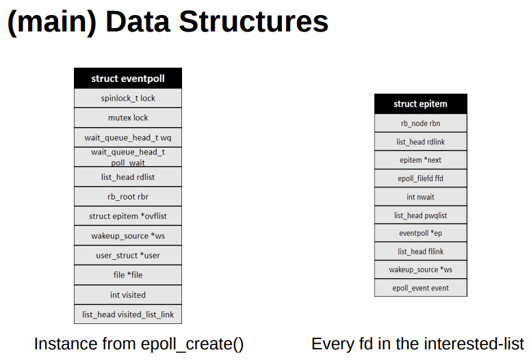
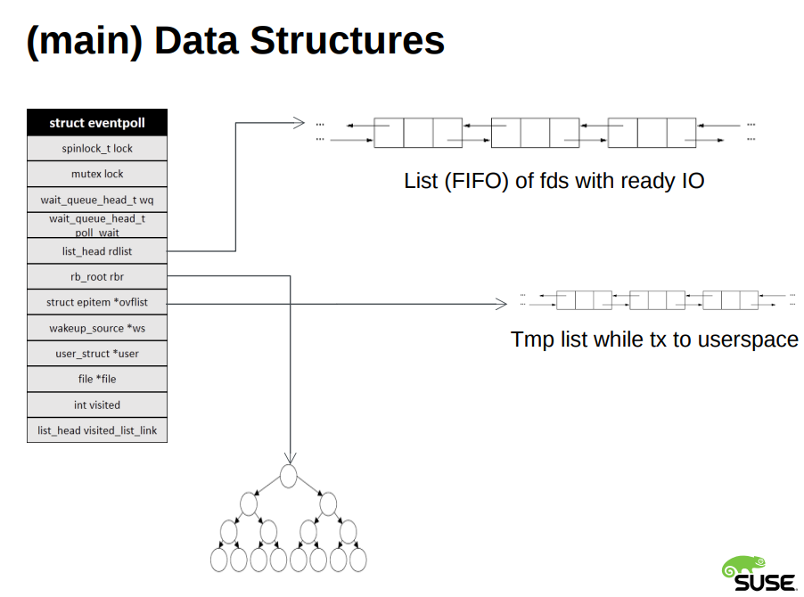
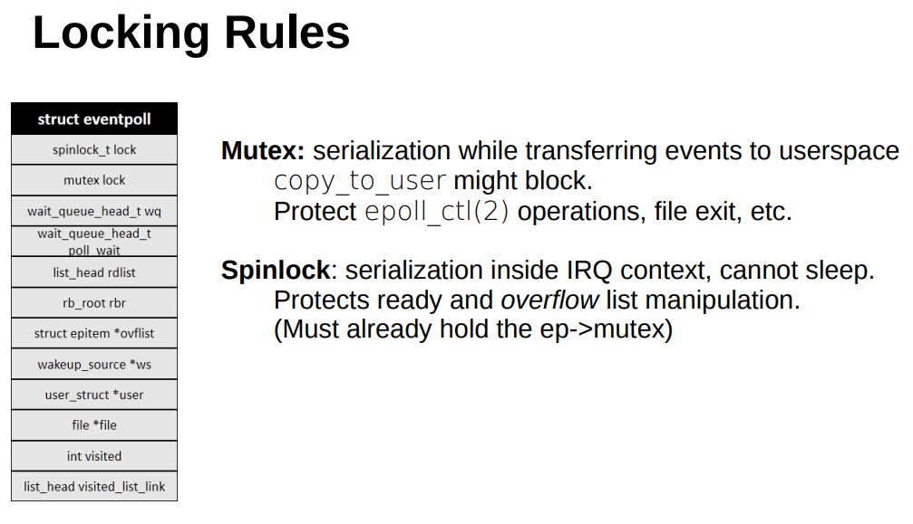
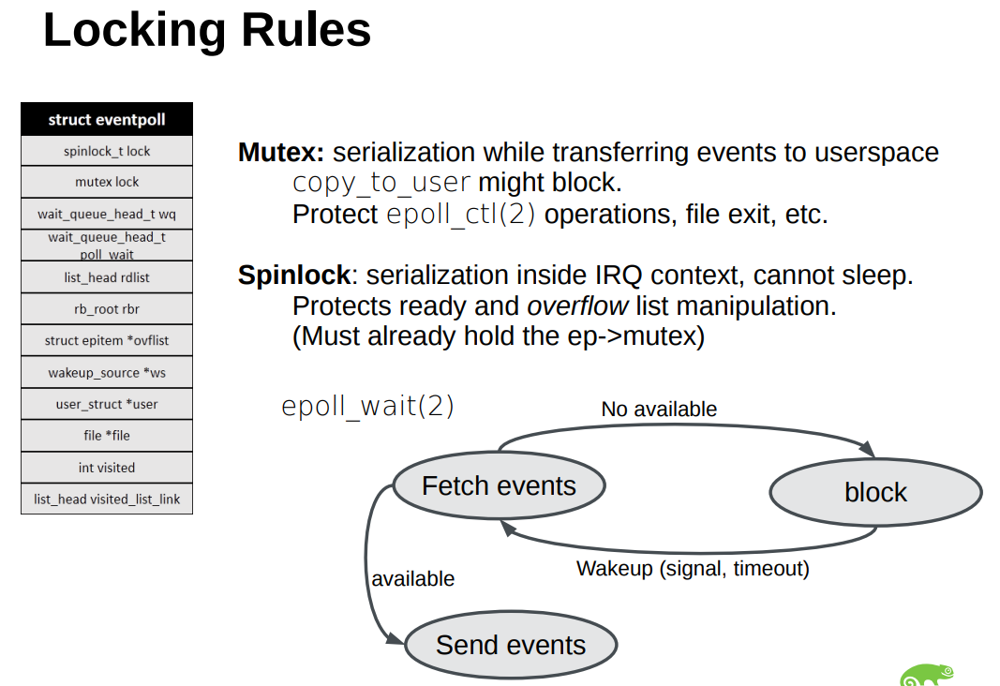

* [从linux源码看epoll](https://blog.51cto.com/u_3522866/2717458)
* [epoll源码分析](https://blog.51cto.com/u_15075523/3520918?b=totalstatistic)
* [The method to epoll’s madness](https://copyconstruct.medium.com/the-method-to-epolls-madness-d9d2d6378642)
* [Epoll is fundamentally broken](https://idea.popcount.org/2017-02-20-epoll-is-fundamentally-broken-12/)
* https://man7.org/linux/man-pages/man7/epoll.7.html


## triggered type / Triggering modes

> https://stackoverflow.com/questions/9162712/what-is-the-purpose-of-epolls-edge-triggered-option
> https://en.wikipedia.org/wiki/Epoll

When an FD becomes read or write ready, you might not necessarily want to read (or write) all the data immediately.

### level-triggered(`EPOLLLT`) - default

* level-triggered 
  * epoll will keep nagging(唠叨) you as long as the `FD` remains ready,
  * epoll_wait will return as long as the condition holds

- Level-triggered notifications are used by the `select` and `poll` system calls (according to page 1329 of The Linux Programming Interface). LT notifications are also used by the `epoll` "I/O event notification facility" (as taken from the man page for epoll).


when used as a level-triggered interface (the default, when `EPOLLET` is not specified), **epoll is simply a faster
`poll(2)`**, and can be used wherever the latter is used since it
shares the same semantics.


### edge-triggered(`EPOLLET`)

* edge-triggered 
  * won't bother you again until the next time you get an `EAGAIN`
  * call to `epoll_wait` will return only when a new event is enqueued with the epoll object

> http://www.continualintegration.com/miscellaneous-articles/what-is-the-etymology-of-the-terms-level-trigger-and-edge-trigger/

- Edge-tiggered notifications are used by signal-drive I/O and the `epoll` "I/O event notification facility" (as taken from the man page for `epoll`) in Linux (according to page 1329 of The Linux Programming Interface).

#### edge-triggered 使用模式
  * > https://man7.org/linux/man-pages/man7/epoll.7.html
  * An application that employs the EPOLLET flag should use
       nonblocking file descriptors to avoid having a blocking read or
       write starve a task that is handling multiple file descriptors.
    > https://man7.org/linux/man-pages/man7/epoll.7.html

    The suggested way to use epoll as an edge-triggered (EPOLLET)
    interface is as follows:

    1. with nonblocking file descriptors; and
    2. by waiting for an event only after `read(2)` or `write(2)` return
        `EAGAIN`.


## `EPOLLONESHOT` 
Since even with edge-triggered epoll, multiple events can be
generated upon receipt of multiple chunks of data, the caller has
the option to specify the `EPOLLONESHOT` flag, to tell epoll to
disable the associated file descriptor after the receipt of an
event with epoll_wait(2).  When the `EPOLLONESHOT` flag is
specified, it is the caller's responsibility to rearm the file
descriptor using epoll_ctl(2) with EPOLL_CTL_MOD.


## multiple threads wait on same epoll file descriptor
If multiple threads (or processes, if child processes have
inherited the epoll file descriptor across fork(2)) are blocked
in epoll_wait(2) waiting on the same epoll file descriptor and a
file descriptor in the interest list that is marked for edge-
triggered (EPOLLET) notification becomes ready, **just one of the
threads (or processes) is awoken from `epoll_wait(2)`**.  This
provides a useful optimization for **avoiding "thundering herd"
wake-ups** in some scenarios.

## Kernel Param
- /proc/sys/fs/epoll/max_user_watches (since Linux 2.6.28)

This specifies a **limit on the total number of file
descriptors that a user can register across all epoll
instances** on the system. **The limit is per real user ID**.
Each registered file descriptor costs roughly 90 bytes on
a 32-bit kernel, and roughly 160 bytes on a 64-bit kernel.
Currently, the default value for max_user_watches is 1/25
(4%) of the available low memory, divided by the
registration cost in bytes.


## implement arch

> https://man7.org/linux/man-pages/man7/epoll.7.html

The central concept of the epoll API is the epoll instance, an
in-kernel data structure which, from a user-space perspective,
can be considered as a container for two `lists`:

• The `interest list` (sometimes also called the epoll set): the
    set of file descriptors that the process has registered an
    interest in monitoring.

• The `ready list`: the set of file descriptors that are "ready"
    for I/O.  The ready list is a subset of (or, more precisely, a
    set of references to) the file descriptors in the interest
    list.  The ready list is dynamically populated by the kernel as
    a result of I/O activity on those file descriptors.


The following system calls are provided to create and manage an
epoll instance:

• `epoll_create(2)` creates a new epoll instance and returns a file
    descriptor referring to that instance.  (The more recent
    epoll_create1(2) extends the functionality of epoll_create(2).)

• Interest in particular file descriptors is then registered via
    `epoll_ctl(2)`, which adds items to the interest list of the
    epoll instance.

• `epoll_wait(2)` waits for I/O events, blocking the calling thread
    if no events are currently available.  (This system call can be
    thought of as fetching items from the ready list of the epoll
    instance.)


## concept

* `EAGAIN` - there is no data available right now, try again later. https://man7.org/linux/man-pages/man3/errno.3.html


## functions

### epoll_ctl
> https://man7.org/linux/man-pages/man7/epoll.7.html

```c
int epoll_ctl(int epfd, int op, int fd, struct epoll_event *event);

struct epoll_event {
    //a bit mask composed by ORing together zero or more of the following available event types
    uint32_t     events;      /* Epoll events */

    epoll_data_t data;        /* User data variable */
};

// The event argument describes the object linked to the file descriptor fd.  The struct epoll_event is defined as:
typedef union epoll_data {
    void        *ptr;
    int          fd;
    uint32_t     u32;
    uint64_t     u64;
} epoll_data_t;

```

- op:
```
        EPOLL_CTL_ADD
                Add an entry to the interest list of the epoll file
                descriptor, epfd.  The entry includes the file descriptor,
                fd, a reference to the corresponding open file description
                (see epoll(7) and open(2)), and the settings specified in
                event.

        EPOLL_CTL_MOD
                Change the settings associated with fd in the interest
                list to the new settings specified in event.

        EPOLL_CTL_DEL
                Remove (deregister) the target file descriptor fd from the
                interest list.  The event argument is ignored and can be
                NULL (but see BUGS below).
```

- events:

```
       EPOLLIN
              The associated file is available for read(2) operations.

       EPOLLOUT
              The associated file is available for write(2) operations.

       EPOLLET
              Requests edge-triggered notification for the associated
              file descriptor.  The default behavior for epoll is level-
              triggered.  See epoll(7) for more detailed information
              about edge-triggered and level-triggered notification.

              This flag is an input flag for the event.events field when
              calling epoll_ctl(); it is never returned by
              epoll_wait(2).

       EPOLLONESHOT (since Linux 2.6.2)
              Requests one-shot notification for the associated file
              descriptor.  This means that after an event notified for
              the file descriptor by epoll_wait(2), the file descriptor
              is disabled in the interest list and no other events will
              be reported by the epoll interface.  The user must call
              epoll_ctl() with EPOLL_CTL_MOD to rearm the file
              descriptor with a new event mask.

              This flag is an input flag for the event.events field when
              calling epoll_ctl(); it is never returned by
              epoll_wait(2).

       EPOLLEXCLUSIVE (since Linux 4.5)
              Sets an exclusive wakeup mode for the epoll file
              descriptor that is being attached to the target file
              descriptor, fd.  When a wakeup event occurs and multiple
              epoll file descriptors are attached to the same target
              file using EPOLLEXCLUSIVE, one or more of the epoll file
              descriptors will receive an event with epoll_wait(2).  The
              default in this scenario (when EPOLLEXCLUSIVE is not set)
              is for all epoll file descriptors to receive an event.
              EPOLLEXCLUSIVE is thus useful for avoiding thundering herd
              problems in certain scenarios.              
```


#### example


```c
#define MAX_EVENTS 10
struct epoll_event ev;


ev.events = EPOLLIN;
ev.data.fd = listen_sock;
if (epoll_ctl(epollfd, EPOLL_CTL_ADD, listen_sock, &ev) == -1) {
    perror("epoll_ctl: listen_sock");
    exit(EXIT_FAILURE);
}
```

### epoll_wait

#### example

```c
struct events[MAX_EVENTS];

for (;;) {
    nfds = epoll_wait(epollfd, events, MAX_EVENTS, -1);
    if (nfds == -1) {
        perror("epoll_wait");
        exit(EXIT_FAILURE);
    }

    for (n = 0; n < nfds; ++n) {
        if (events[n].data.fd == listen_sock) {
            conn_sock = accept(listen_sock,
                                (struct sockaddr *) &addr, &addrlen);
            if (conn_sock == -1) {
                perror("accept");
                exit(EXIT_FAILURE);
            }
            setnonblocking(conn_sock);
            ev.events = EPOLLIN | EPOLLET;
            ev.data.fd = conn_sock;
            if (epoll_ctl(epollfd, EPOLL_CTL_ADD, conn_sock,
                        &ev) == -1) {
                perror("epoll_ctl: conn_sock");
                exit(EXIT_FAILURE);
            }
        } else {
            do_use_fd(events[n].data.fd);
        }
    }
}
```

### Close FD
       6.  Will closing a file descriptor cause it to be removed from all epoll interest lists?
    
           Yes,  but be aware of the following point.  A file descriptor is a reference to an open file description (see open(2)).  Whenever a
           file descriptor is duplicated via dup(2), dup2(2), fcntl(2) F_DUPFD, or fork(2), a new file descriptor referring to the  same  open
           file  description  is  created.   An  open file description continues to exist until all file descriptors referring to it have been
           closed.
    
           A file descriptor is removed from an interest list only after all the file descriptors referring to the underlying  open  file  de‐
           scription  have been closed.  This means that even after a file descriptor that is part of an interest list has been closed, events
           may be reported for that file descriptor if other file descriptors referring to the same underlying file description  remain  open.
           To prevent this happening, the file descriptor must be explicitly removed from the interest list (using epoll_ctl(2) EPOLL_CTL_DEL)
           before it is duplicated.  Alternatively, the application must ensure that all file descriptors are closed (which may  be  difficult
           if file descriptors were duplicated behind the scenes by library functions that used dup(2) or fork(2)).
    
       7.  If more than one event occurs between epoll_wait(2) calls, are they combined or reported separately?
    
           They will be combined.


## 潜在问题与避免
o Starvation (edge-triggered)

       If there is a large amount of I/O space, it is possible that by trying to drain it the other files will not get processed causing starvation.  (This problem is not specific to epoll.)
    
       The solution is to maintain a ready list and mark the file descriptor as ready in its associated data structure, thereby  allowing  the
       application  to remember which files need to be processed but still round robin amongst all the ready files.  This also supports ignoring subsequent events you receive for file descriptors that are already ready.


o If using an event cache...

       If you use an event cache or store all the file descriptors returned from epoll_wait(2), then make sure to provide a way  to  mark  its
       closure  dynamically  (i.e., caused by a previous event's processing).  Suppose you receive 100 events from epoll_wait(2), and in event
       #47 a condition causes event #13 to be closed.  If you remove the structure and close(2) the file descriptor for event #13,  then  your
       event cache might still say there are events waiting for that file descriptor causing confusion.
    
       One  solution  for  this  is  to  call,  during  the  processing of event 47, epoll_ctl(EPOLL_CTL_DEL) to delete file descriptor 13 and
       close(2), then mark its associated data structure as removed and link it to a cleanup list.  If you find another  event  for  file  descriptor 13 in your batch processing, you will discover the file descriptor had been previously removed and there will be no confusion.

# Epoll Kernel Performance Improvements
> https://events19.linuxfoundation.org/wp-content/uploads/2018/07/dbueso-oss-japan19.pdf












