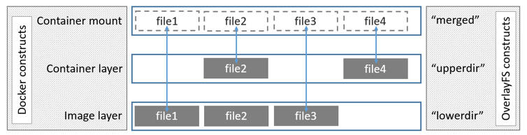

> http://jpetazzo.github.io/assets/2015-07-01-deep-dive-into-docker-storage-drivers.html#64

-   Containers have:

    -   `lower-id` → file containing the ID of the image
    -   `merged/` → mount point for the container (when running)
    -   `upper/` → read-write layer for the container
    -   `work/` → temporary space used for atomic copy-up

## Overlayfs@Docker

> https://docs.docker.com/storage/storagedriver/overlayfs-driver/#how-the-overlay-driver-works

OverlayFS layers two directories on a single Linux host and presents them as a single directory. These directories are called *layers* and the unification process is referred to as a *union mount*. OverlayFS refers to the lower directory as `lowerdir` and the upper directory a `upperdir`. The unified view is exposed through its own directory called `merged`.

The diagram below shows how a Docker image and a Docker container are layered. The image layer is the `lowerdir` and the container layer is the `upperdir`. The unified view is exposed through a directory called `merged` which is effectively the containers mount point. The diagram shows how Docker constructs map to OverlayFS constructs.

Where the image layer and the container layer contain the same files, the container layer "wins" and obscures the existence of the same files in the image layer.

**The `overlay` driver only works with two layers.** This means that multi-layered images cannot be implemented as multiple OverlayFS layers. Instead, each image layer is implemented as its own directory under `/var/lib/docker/overlay`. Hard links are then used as a space-efficient way to reference data shared with lower layers. The use of hardlinks causes an excessive use of inodes, which is a known limitation of the legacy `overlay` storage driver, and may require additional configuration of the backing filesystem. Refer to the [overlayFS and Docker performance](https://docs.docker.com/storage/storagedriver/overlayfs-driver/#overlayfs-and-docker-performance) for details.

To create a container, the `overlay` driver combines the directory representing the image's top layer plus a new directory for the container. The image's top layer is the `lowerdir` in the overlay and is read-only. The new directory for the container is the `upperdir` and is writable.

