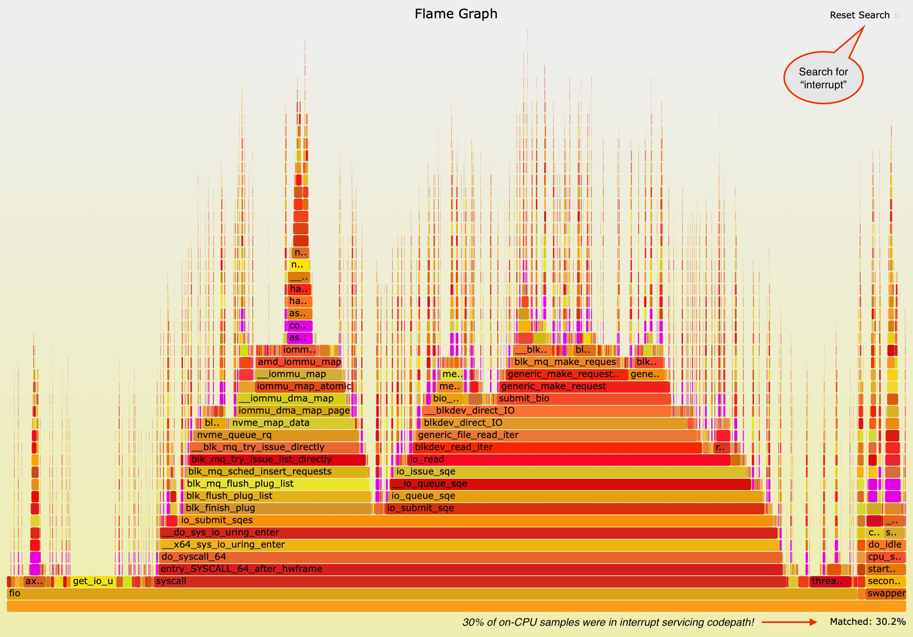

> https://tanelpoder.com/posts/linux-hiding-interrupt-cpu-usage/


> TL;DR: Some Linux distros and even different kernel versions within a distro have disabled IRQ time accounting. In such case, your monitoring tools will report zero time spent in hardware interrupt handlers (shown as `%hi`, `%irq`, `hiq`, etc). It’s easy to check how your kernel is behaving by looking at `/proc/stat` and you can still measure interrupt CPU usage using `perf` and a [little creativity](https://tanelpoder.com/posts/linux-hiding-interrupt-cpu-usage/#how-to-measure-interrupt-cpu-overhead-when-irq-time-accounting-is-disabled).

#### Index

1. [Index](https://tanelpoder.com/posts/linux-hiding-interrupt-cpu-usage/#index)
2. [Problem](https://tanelpoder.com/posts/linux-hiding-interrupt-cpu-usage/#the-problem)
3. [Explanation](https://tanelpoder.com/posts/linux-hiding-interrupt-cpu-usage/#the-explanation)
4. [Kernel configuration options](https://tanelpoder.com/posts/linux-hiding-interrupt-cpu-usage/#is-my-kernel-accounting-interrupt-time-correctly)
5. [Measuring IRQ time with perf](https://tanelpoder.com/posts/linux-hiding-interrupt-cpu-usage/#how-to-measure-interrupt-cpu-overhead-when-irq-time-accounting-is-disabled)
6. [Different distros and kernel versions](https://tanelpoder.com/posts/linux-hiding-interrupt-cpu-usage/#appendix---different-distros-and-kernel-versions)
7. [Summary](https://tanelpoder.com/posts/linux-hiding-interrupt-cpu-usage/#summary)

Here’s a reminder that your Linux kernel may be not breaking down hardware interrupt CPU usage separately in its `/proc/stat` CPU time reporting, depending on the kernel’s compile-time settings. The hardware IRQ servicing time is usually displayed as `hi` or `%irq` field in various monitoring tools, but would always show 0% if IRQ time accounting is not enabled in the kernel. This would cause confusion when troubleshooting Linux performance, as the hardware IRQ service time may be just lumped together with regular application or kernel threads’ CPU usage.

#### The Problem

Here’s the CPU utilization reported by `dstat` in **Ubuntu 20.10** with its default Linux kernel `5.8.0`:

```
$ dstat -p --cpu-adv -rd --bw

---procs--- ------total-cpu-usage------ --io/total- -dsk/total-
run blk new|usr sys idl wai hiq siq stl| read  writ| read  writ
 27   0    |                           |           |           
 28   0   0| 11  65  12   0   0   0   0|11.6M    0 |  44G    0 
 26   0   0| 11  65  12   0   0   0   0|11.6M    0 |  44G    0 
 27   0   0| 11  66  12   0   0   0   0|11.6M    0 |  44G    0 
 27   0   0| 11  66  12   0   0   0   0|11.6M 3.00 |  44G   28k
 26   0   0| 11  66  11   0   0   0   0|11.6M    0 |  44G    0 
```

When running around [11M IOPS](https://tanelpoder.com/posts/11m-iops-with-10-ssds-on-amd-threadripper-pro-workstation/) using `fio` with interrupt-based I/O handling enabled, I saw *zero percent* of hardware-IRQ time reported by `dstat` and other monitoring tools. This made me suspicious - too good to be true!

So, I booted this same machine up using RHEL8 clone **Oracle Enterprise Linux 8.3** with an (Oracle-provided) kernel `5.4.17` and ran the exact same IO test on the same hardware:

```
$ dstat -p --cpu-adv -rd --bw

---procs--- ------total-cpu-usage------ --io/total- -dsk/total-
run blk new|usr sys idl wai hiq siq stl| read  writ| read  writ
 29   0    |                           |           |           
 28   0   0|  9  44  16   0  27   0   0|11.5M 5.50 |  44G    0 
 30   0   0|  9  45  15   0  27   0   0|11.5M    0 |  44G    0 
 25   0   0|  9  45  15   0  27   0   0|11.5M    0 |  44G    0 
 25   0   0|  9  45  15   0  27   0   0|11.6M    0 |  44G    0 
 22   0   0|  9  45  15   0  27   0   0|11.6M    0 |  44G    0 
```

We got roughly the same throughput and similar *total* CPU utilization, but *where* the CPU usage is coming from looks quite different. Now we see that 27% of total CPU capacity in my server was spent inside hardware interrupt service routines! My kernel *threads* weren’t really that busy at all, they just got interrupted a lot. The kernel CPU usage has dropped from 66% to 45% and even the application CPU usage has dropped from 11% of total CPU capacity to 9%.

#### The Explanation

**So, what happened?** How come the kernel threads’ and even the user-mode CPU utilization went down, now that the hardware interrupt-handling CPU cycles are broken down separately?

**The answer is:**

> Interrupt-handling can inflate *any* thread’s CPU time as interrupts don’t care who’s running on the CPU, they just abruptly take over. That’s exactly why they are called *interrupts*!

A longer explanation is here, first assuming that IRQ time accounting is disabled:

- Interrupts can happen “randomly” at any time, depending on when hardware devices raise them for the CPU.
- When an interrupt is signaled when the CPU happens to be running some *application thread* running in *user-mode*, the interrupt handling CPU cycles will be accounted to the application process (as you’d see in `top`) and as `%usr` type usage.
- When an interrupt is signaled when the CPU happens to be still running an *application thread* that happens to be in *kernel mode* due to issuing a system call, then the interrupt CPU would be added to the application thread, but would show up as `%sys` type.
- When the interrupt is signaled while the CPU is executing a *kernel thread* (and kernel codepath has not temporarily disabled interrupts for some critical section), the interrupt handling CPU will be added to the kernel thread in `%sys` mode. This feels pretty intuitive, as one usually thinks of hardware devices, drivers and interrupts all as part of kernel work.
- This raises an interesting question of what happens when the CPU happens to be *idle* when an interrupt is raised for it? As usual, it depends on hardware capabilities, like whether power-aware interrupt routing is available, but it’s entirely possible that an idle CPU gets woken up and has to use CPU to serve an IRQ. As the CPU is not running any user/kernel threads while idle (having a `task_struct` thread context structure available), the CPU time gets accounted to the Linux kernel pseudo-task 0 that will show up as `swapper` in tools like `perf`. So, tools like `top` wouldn’t show any processes in the process list with high IRQ CPU usage coming from the “idle” CPU, but systemwide tools based on `/proc/stat` (like `dstat`, `mpstat` and even the systemwide summary in the `top` header) would show that *something* is using `%sys` mode CPU.

Now, with IRQ time accounting enabled:

- When IRQ time accounting is enabled, hardware interrupt handling routines will use the CPU’s built-in timestamp-counter reading instructions (rdtsc) to get a high-precision “timestamp” on entry & exit of the interrupt handling operations.
- These time deltas are attributed to the `%irq` metric instead of `%usr` or `%sys` thread CPU usage (`/proc/stat` has one line with CPU usage metrics per CPU).
- System-wide tools like `mpstat` and even `top` system summary section will now break down `%irq%` CPU usage correctly.
- However, process/thread level metrics (like `top` process-list section) will still lump any IRQ time together with `%usr` and `%sys` metrics as Linux doesn’t keep track of “unexpected” IRQ service time at process/thread level.

This is just a short summary of *hardware* interrupt handling on bare-metal Linux servers and I won’t go deeper here. Also, I deliberately didn’t cover software-interrupts or the top/bottom half interrupt processing deferral architecture to keep this article short.

> Note that I was running a synthetic benchmark that doesn’t really do too much work in the user-space threads and was mostly in system calls and kernel block layer. Thus, the “abrupt” hardware interruptions of our CPU processing happened more likely when our processes were already in kernel mode. With an interrupt-heavy application (networking!) that spent most of its time in user-space, we’d see a bigger amount of `%usr` CPU switch over to `%hiq`.

#### Is my kernel accounting interrupt time correctly?

The IRQ time accounting depends on whether the `CONFIG_IRQ_TIME_ACCOUNTING` kernel config parameter was enabled during kernel compilation time. So, there’s no dynamic `/proc` or `sysctl.conf` config setting you can use to change it after the build. You would need to recompile the kernel (or install a different pre-compiled kernel) with this config option enabled, to get IRQ time accounting.

The easiest way to check if IRQ time accounting has been enabled in your kernel build is to look into the `/boot/config-` file of your kernel:

In my Ubuntu installation, I get this:

```
$ uname -r
5.8.0-43-generic

$ grep CONFIG_IRQ_TIME_ACCOUNTING /boot/config-`uname -r`
# CONFIG_IRQ_TIME_ACCOUNTING is not set 
```

Ubuntu engineers have decided to disable IRQ time accounting for some reason (see some footnotes in the end).

When I boot into my Oracle Enterprise Linux kernel, I get this:

```
$ uname -r
5.4.17-2036.103.3.el7uek.x86_64

$ grep CONFIG_IRQ_TIME_ACCOUNTING /boot/config-`uname -r`
CONFIG_IRQ_TIME_ACCOUNTING=y
```

Thanks to this setting, I could see the IRQ CPU time breakdown correctly.

While the above examples just report the kernel configuration setting, you can also query `/proc/stat` for any interrupt time activity yourself (`man proc`). As long as the total IRQ CPU time field is >0 in `/proc/stat`, you have the accounting enabled:

**RHEL with Oracle’s 5.4.x kernel:**

```
$ awk '/^cpu /{ print "HW interrupt svc time " $7 * 10 " ms" }' /proc/stat
HW interrupt svc time 1292670 ms
```

This technique helps you even with older kernels that don’t have the CONFIG_IRQ_TIME_ACCOUNTING parameter in a `/boot/config-` file at all. Note that if you have a small system that has just booted up, it may not have accumulated at least one *jiffy* (10ms) of time yet, but in a machine with some minutes or hours of uptime, something should definitely show up.

**Ubuntu 20.10 with 5.8.x kernel:**

```
$ awk '/^cpu /{ print "HW interrupt svc time " $7 * 10 " ms" }' /proc/stat
HW interrupt svc time 0 ms
```

You can also report each CPU’s activity individually, using the `/proc/stat` data source, just like `mpstat` does:

```
$ head -5 /proc/stat 

cpu  856878 192 199241 130867327 53011 130454 74085 0 0 0
cpu0 14221 6 4744 4090883 2045 1253 20779 0 0 0
cpu1 16989 14 5470 4107586 2016 1112 1585 0 0 0
cpu2 28811 8 5375 4096180 2308 1143 1101 0 0 0
cpu3 20378 8 5676 4104703 2024 1165 1031 0 0 0
```

Ok, let’s move on to alternative ways for measuring IRQ handling overhead.

#### How to measure interrupt CPU overhead when IRQ time accounting is disabled?

The answer is `perf`! *(What was the question again? ;-)*

Even when the IRQ time to `/proc/stat` accounting feature is disabled in your kernel, periodic *on-CPU stack sampling* with `perf` is still possible. You can even have [low-frequency, always-on CPU profiling](https://0x.tools/#cpu-profiling) with [0x.tools](https://0x.tools/) for troubleshooting intermittent Linux problems or issues that have happened in past.

Here’s an example of running `perf record -g -F 99 -a` for a few seconds during my I/O benchmark run. Remember, when I booted to a Linux version that had the IRQ time accounting enabled, monitoring tools showed that around 27% of CPU time was spent on hardware interrupt CPU:

```
$ mpstat 1
Linux 5.4.17-2036.103.3.el8uek.x86_64 (linux03)   02/14/2021  _x86_64_  (32 CPU)

03:50:28 PM  CPU    %usr   %nice    %sys %iowait    %irq   %soft     %idle
03:50:29 PM  all    9.17    0.00   44.65    0.00   26.60    0.13     19.44
03:50:30 PM  all    9.00    0.00   45.66    0.00   26.97    0.19     18.17
03:50:31 PM  all    8.98    0.00   46.78    0.00   27.52    0.10     16.62
03:50:32 PM  all    9.42    0.00   45.34    0.00   27.43    0.29     17.52
03:50:33 PM  all    9.32    0.00   46.17    0.00   27.57    0.13     16.81
```

I ran `perf` sampling tests on this machine both with and without IRQ time accounting enabled and saw roughly the same output. I created a [FlameGraph](http://www.brendangregg.com/FlameGraphs/cpuflamegraphs.html) from perf output, because of the “random” nature of interrupt locations, a more visual approach is helpful (the interactive [SVG](https://tanelpoder.com/files/images/irq-perf.svg) is here).



Take a look at the *purple* parts of the image. I searched for specific function names with “interrupt” in them (in the *top right* search box). This highlighted any functions that contained “interrupt” in purple color. Look closer - *you see purple everywhere*! Anything that’s laid below the little purple boxes was whatever the userland applications or kernel threads happened to be doing when the interrupts interrupted their work. Anything on top of the little purple boxes is whatever functions the interrupt handlers called (that `perf` managed to sample).

When you look into *bottom right*, you see a ***Matched: 30.2%\*** summary reported by the FlameGraph tool. So, `perf` with some eyeballing says ~30% and `/proc/stat` IRQ time accounting said ~27%. As these numbers are from two different benchmark runs on different kernels, measured with different APIs/tools (but using the same benchmark & hardware), I’d say these numbers are close enough to move on.

So, you can troubleshoot interrupt CPU usage on Linux even when `CONFIG_IRQ_TIME_ACCOUNTING` is not enabled for your kernel. You could do similar sampling with eBPF and SystemTap scripts too.

> Note that you can visualize pretty much any metric that’s organized in nested hierarchies with FlameGraphs. Here’s my old article about [visualizing SQL plan execution time](https://tanelpoder.com/posts/visualizing-sql-plan-execution-time-with-flamegraphs/) with FlameGraphs that you may enjoy reading too.

That’s all, almost!

If you want to go straight to summary and some interesting further reading, go to the [summary section](https://tanelpoder.com/posts/linux-hiding-interrupt-cpu-usage/#summary). Otherwise, keep reading to see what distros (that I use) and kernel versions have the IRQ accounting setting disabled/enabled.

#### Appendix - Different distros and kernel versions

I can look into all currently installed kernels in my Ubuntu setup:

```
$ grep CONFIG_IRQ_TIME_ACCOUNTING /boot/config-*

/boot/config-5.10.9-051009-generic:# CONFIG_IRQ_TIME_ACCOUNTING is not set
/boot/config-5.8.0-29-generic:# CONFIG_IRQ_TIME_ACCOUNTING is not set
/boot/config-5.8.0-41-generic:# CONFIG_IRQ_TIME_ACCOUNTING is not set
/boot/config-5.8.0-43-generic:# CONFIG_IRQ_TIME_ACCOUNTING is not set
```

Apparently, all these Ubuntu-provided kernels have this accounting disabled. I tested with Ubuntu 16, 18 and Debian 9 (using AWS EC2 images) and they had it disabled too.

I was unaware of this issue for quite a long time, I guess because I was mostly working with RHEL clones (CentOS, OEL). I thought that it was a distribution/vendor thing, but apparently even RHEL had this setting disabled in its RHEL7 kernels and Oracle had it disabled in its 4.14 kernel (used with RHEL7), but enabled in 5.4.x. So, you have to check yourself!

Let’s list installed kernels/config files on my Oracle Enterprise Linux 7:

```
$ ls -1 /boot/config-*

/boot/config-3.10.0-1062.9.1.el7.x86_64
/boot/config-3.10.0-1160.15.2.el7.x86_64
/boot/config-4.14.35-1902.7.3.1.el7uek.x86_64
/boot/config-4.14.35-2025.405.3.el7uek.x86_64
/boot/config-5.4.17-2036.103.3.el7uek.x86_64
```

And now I check for any IRQ_TIME_ACCOUNTING settings (by kernel major version). The 3.10 are RedHat-compatible kernels, so should be using RedHat’s choices for settings:

```
$ grep IRQ_TIME_ACCOUNTING /boot/config-3.10.0-1*

/boot/config-3.10.0-1062.9.1.el7.x86_64:CONFIG_HAVE_IRQ_TIME_ACCOUNTING=y
/boot/config-3.10.0-1160.15.2.el7.x86_64:CONFIG_HAVE_IRQ_TIME_ACCOUNTING=y
```

Read the two lines above - `CONFIG_`**`HAVE_`**`IRQ_TIME_ACCOUNTING` is not the same as `CONFIG_IRQ_TIME_ACCOUNTING` that we are talking about. The “HAVE” parameter declares whether the target Linux platform (like x86_64) even has a capable high precision time-keeping mechanism available. But our parameter controls whether this functionality is actually used for IRQ time accounting (if it’s available).

So, apparently IRQ time accounting is disabled also in the RHEL 7 3.10.x kernels (at least the two ones I have installed).

Let’s look into the Oracle-provided “unbreakable” kernels that you can just drop in to a RHEL installation (if you don’t expect RedHat to support this):

```
$ grep IRQ_TIME_ACCOUNTING /boot/config-4.14.35-*

/boot/config-4.14.35-1902.7.3.1.el7uek.x86_64:# CONFIG_IRQ_TIME_ACCOUNTING is not set
/boot/config-4.14.35-1902.7.3.1.el7uek.x86_64:CONFIG_HAVE_IRQ_TIME_ACCOUNTING=y

/boot/config-4.14.35-2025.405.3.el7uek.x86_64:# CONFIG_IRQ_TIME_ACCOUNTING is not set
/boot/config-4.14.35-2025.405.3.el7uek.x86_64:CONFIG_HAVE_IRQ_TIME_ACCOUNTING=y
```

In the above listing, I have two 4.14 kernels, but while their “HAVE” parameters are enabled, the actual time accounting parameters are disabled (at least now there’s a commented out line that grep can catch).

I have only one 5.x kernel (also provided by Oracle) installed in this machine, so let’s take a look:

```
$ grep IRQ_TIME_ACCOUNTING /boot/config-5.4.17-2036.103.3.el7uek.x86_64 
CONFIG_IRQ_TIME_ACCOUNTING=y
CONFIG_HAVE_IRQ_TIME_ACCOUNTING=y
```

So, looks like on the Oracle-provided kernel version 5.4.x, the IRQ time accounting is finally enabled, as we saw from the earlier I/O benchmark CPU utilization monitoring too.

#### Summary

I showed you that it is possible to measure the time your system spends (and sometimes wastes) on interrupt handling, even if such accounting is disabled in your kernel. Knowing this metric is very relevant for any high throughput (disk I/O, network I/O) system and also in cases of troubleshooting random “unexplained” system sluggishness and intermittent hiccups. Hardware problems and misconfiguration sometimes cause excessive CPU usage due to interrupt handling, but without IRQ accounting you wouldn’t even know - or end up “fixing” the wrong layer in your stack!

> I showed you examples from Linux running on *bare-metal* machines only. Interrupt handling in virtualized world is *way* more complicated and depends on multiple major factors like virtualization architecture and its interrupt delivery mechanism, platform’s CPU & IO hardware virtualization support, etc. Also, timekeeping in virtualized world works differently and I won’t go into that topic here (you can read a 31-page [document by VMWare](https://www.vmware.com/content/dam/digitalmarketing/vmware/en/pdf/techpaper/Timekeeping-In-VirtualMachines.pdf) as an intro into that world).

Why is such a useful accounting feature disabled in some widely used distros? Especially if some old Linux versions (CentOS 5 at least, with kernel 2.6.18), had this enabled by default? Modern platforms should support *high-precision* CPU-internal timestamp counter reading operations (like `rdtsc`) without a problem!

I don’t know the answers for sure, but other than the hardware capabilities (and any potential overhead), here are some hints, if you want to geek out and dig deeper into *tickless kernel* and challenges with IRQ time accounting on a CPU that’s actually idle, doing nothing, as far as the kernel scheduler knows …

- https://github.com/torvalds/linux/commit/57430218317e5b280a80582a139b26029c25de6c
- https://lwn.net/Articles/694144/

Another very interesting topic for a future post is about measuring & ensuring ***CPU quality of service\***. Think about what kind of trouble your high-performance application’s spinlocks, latches and mutexes will go through when 30% of your CPU time is not spent running the application (critical section) code “as planned”, but is spent in abrupt jumps to interrupt service routines at random times, including when holding that critical lock! [Priority inversion](https://tanelpoder.com/2010/04/21/cursor-pin-s-waits-sporadic-cpu-spikes-and-systematic-troubleshooting/), anyone? ;-)
