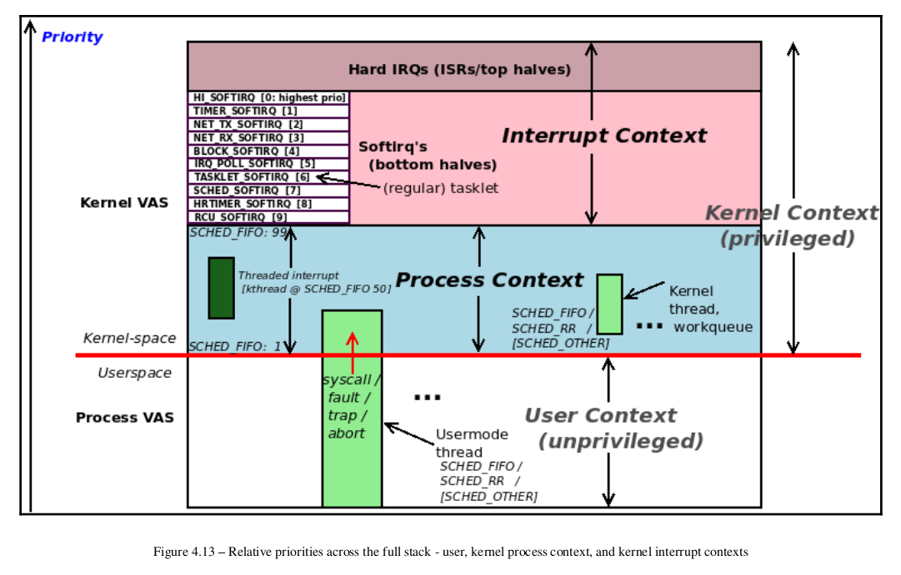

> [Linux Kernel Program - Char Device Drivers - Kaiwan N Billimoria]

### How Linux prioritizes activities

##### Does the kernel maintain separate IRQ stacks?

So, long story short, on pretty much all modern architectures, the kernel allocates a separate
kernel space stack per CPU for hardware interrupt handling. This is known as the IRQ
stack. When a hardware interrupt arrives, the stack location (via the appropriate CPU stack
pointer register) is switched to the IRQ stack of the CPU the interrupt is being processed on
(and it's restored on IRQ exit). Some arch's (PPC) have a kernel
config called CONFIG_IRQSTACKS to enable IRQ stacks. The size of the IRQ stack is fixed as
the value is arch-dependent. On the x86_64, it's 4 pages long (16 KB, with a typical 4K page
size).

### BPF Measuring time servicing individual hardirqs

hardirqs[-bpfcc]

