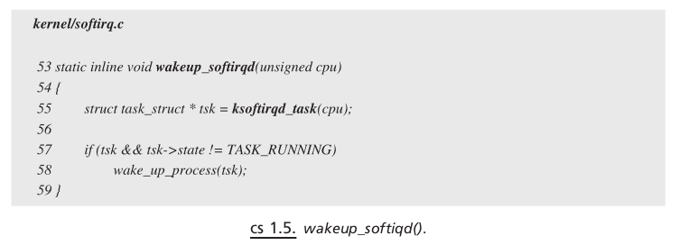

## Kernel Threads

> [TCP IP Architecture Design(Old LInux Version) - Sameer Seth 

Kernel threads are created by making a call to `kernel_thread()` . Kernel threads have no user context because they are not associated with any user process. A kernel thread executes in a user kernel address space and does not have an address space of its own, unlike a user process. <mark>A kernel thread is not interrupted by any one once it starts executing.</mark> It can `yield` CPU by itself by going to sleep. These threads are very much visible using a `ps` command and can be recognized by the name because they start with a `k` — for example, `ksoftirqd` , `kflushd` , and so on. These threads either wake up on:
- expiry of the timer by themselves or
- by some other thread inside the kernel and are scheduled by the kernel as usual.

Let’s take an example of ksoftirqd kernel thread to illustrate kernel
threads. Soft IRQ are also processed by kernel daemons in case there is a lot to
be processed by softIRQs; this is mostly true in the case of network packet
processing. Softirq daemons are created per CPU in routine `spwan_ksoftirqd() `(see cs 1.2 ).

#### wakeup_softiqd()

