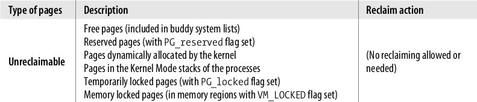
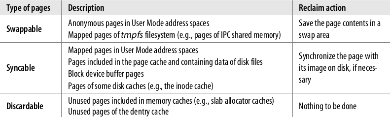
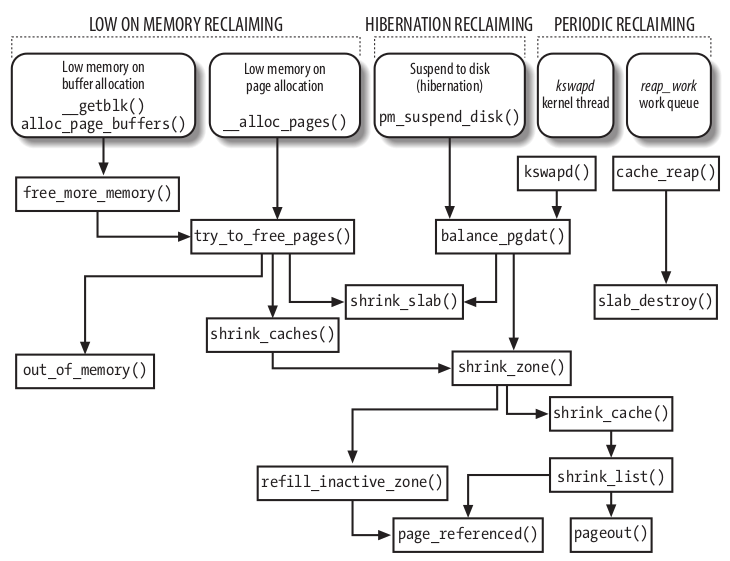
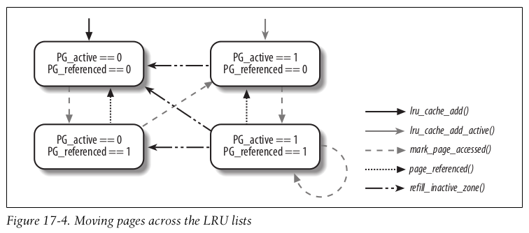
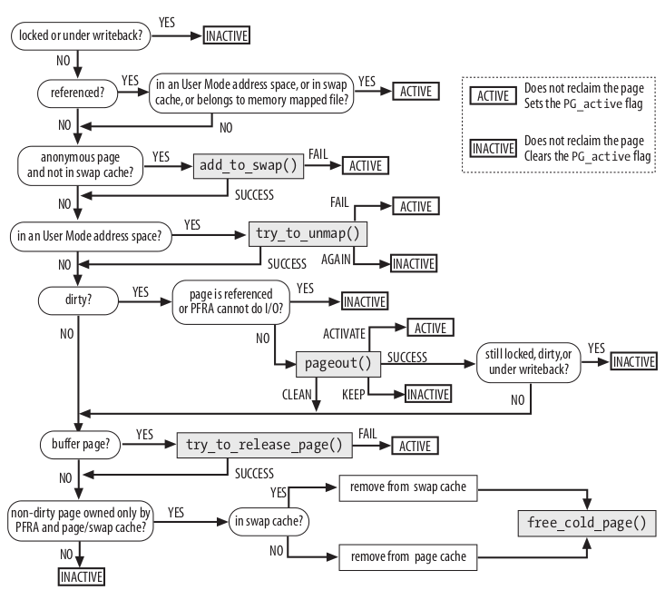

> From [Understanding The Linux Kernel]

## Page Frame 回收

之前我们了解到，Linux 倾向用最多的内存做 Page Cache。这使我们不得不考虑如何在内存不足前回收内存。问题是，回收内存的程序本身也可能有 IO 操作，也可能需要内存。

所以需要预先保留一个最少的内存池，以在内存紧张时恢复过来。

### 选择回收 Page

内存回收算法(page frame reclaiming algorithm (PFRA))  的目标是选择合适的 page frame 并回收。

算法按 Page 的内容进行了分类：

* unreclaimable
* swappable
* syncable
* discardable

### 算法原则

* 优先回收 ‘无害’ 的 page
  在磁盘和内存均存在，且没有被进程引用的 Page 应该 比 进程使用的 Page 优先回收
* 进程的所有 Page 均可以回收
  除了 locked page。进程的所有 page 都应该可以回收。
* 如要回收进程间共享的 Page 时，需要同步修改所有进程的 Page Table
* 先回收最少使用可能的 page
  使用类 Least Recently Used (LRU)的算法。在 X86 平台，Linux 使用  Page Table entry 的 Accessed bit 来实现这个算法。Accessed bit 在访问 Page 时被自动设置。

所以，Page Frame 回收是以下几种“启发”式的结合：

* 选择正常的 Cache 检查顺序
* 排序以 Page 的最近访问间隔为依据
* 以 Page 的状态来区分处理 Page（如 非 dirty 的 page 优先回收于 dirty page）

## 反向 Mapping

有时，需要回收进程间共享的 Page Frame。需要有 Page Frame 反向找到 Page Table entriy。

## 回收的实现

### Least Recently Used (LRU) Lists

归属于用户进程或 Page Cache 的内存被分组为：active list 和 inactive list。前者是最近访问过的，后者是一相对久未访问过的。一般，回收优先考虑后者。两个 list 均保存其 item 个数和一个并发访问的 spin lock。

每个 Memory Zone 有其独立的 active/inactive list。即 `zone descriptor`的 `active_list`和 `inactive_list`字段。

如果一个 page 属于一个 lru list，那么 PG_lru 标记位会打开。如果属于 active list，PG_active 标记位打开，反之关闭。page descriptor 的 `lru`字段保存了LRU list的前和后元素。

回收算法负责按 page 的最近访问情况在 active / inactive list 之间移动 page。

#### Moving pages across the LRU lists

Clearly, two page states (“active” and “inactive”) are not sufficient to describe all
possible access patterns. For instance, suppose a logger process writes some data in a
page once every hour. Although the page is “inactive” for most of the time, the
access makes it “active,” thus denying the reclaiming of the corresponding page
frame, even if it is not going to be accessed for an entire hour. Of course, there is no
general solution to this problem, because the PFRA has no way to predict the behavior of User Mode processes; however, it seems reasonable that pages should not change their status on every single access.

The `PG_referenced` flag in the `page descriptor` is used to double `the number of accesses` required to move a page from the `inactive` list to the `active` list; 

it is also used to double the number of “`missing accesses`” required to move a page from the `active`
list to the `inactive` list (see below). 

For instance, suppose that a page in the `inactive` list has the `PG_referenced` flag set to 0. The first page access sets the value of the flag to 1, but the page remains in the `inactive` list. The second page access finds the flag set and causes the page to be moved in the `active` list. 

If, however, the second access does not occur within a given time interval after the first one, the `page frame reclaiming algorithm` may **reset** the `PG_referenced` flag.

As shown in Figure 17-4, the PFRA uses the mark_page_accessed() , page_referenced() , and refill_inactive_zone() functions to move the pages across the LRU lists. In the figure, the LRU list including the page is specified by the status of the PG_active flag.

> https://biriukov.dev/docs/page-cache/4-page-cache-eviction-and-page-reclaim/

> This is the basic idea of the LRU algorithm. Both the active and the inactive lists adopt the form of FIFO (First In First Out) for their entries. New elements are added to the head of the linked list, and the elements in between gradually move toward the end. When memory reclamation is needed, the kernel always selects the page at the end of the inactive list for releasing. The following figure shows the simplified concept of the idea:
>
> 

#### 参考
https://www.sobyte.net/post/2021-11/whys-the-design-linux-swapping/
https://www.cs.columbia.edu/~smb/classes/s06-4118/l19.pdf

### 内存紧张时的回收（Low On Memory Reclaiming）

Low On Memory Reclaiming 在分配内存失败时发生。当 VFS 分配失败时，调用 free_more_memory()。当通过 buddy system 分配失败时，调用  try_to_free_pages() 。

#### free_more_memory() 过程

1. 调用 wakeup_bdflush()，唤醒 pdflush 线程，尝试回写 1024 个 dirty page
2. 调用 sched_yield()，让其它线程（pdflush）成功调度
3. 对每一个 memory node(NUMA) 调用 try_to_free_pages() 回收紧张的 zone

#### try_to_free_pages() 函数

这个函数接受参数：

* zones：要回收的 zone
* gfp_mask ：之前失败分配请求的 gfp_mask

函数的目标是通过重复调用  shrink_caches() 和 shrink_slab() 释放 32 个 page frame。

#### shrink_caches()函数

#### shrink_zone() 函数

#### shrink_cache() 函数

#### shrink_list() 函数

#### pageout() 函数

当需要回写 dirty page 时，这个函数会被调用。

### 回收其它 Shrinkable Disk Caches

除了 Page Cache 外，还有其它 Cache可以回收。如 inode/dentry cache。

### 周期性的回收

#### kswapd 内核线程

周期调用 shrink_zone() 和 shrink_slab()

## 参考

[Understanding The Linux Kernel 3rd Edition]

[Chapter 2 Describing Physical Memory](https://www.kernel.org/doc/gorman/html/understand/understand005.html)

