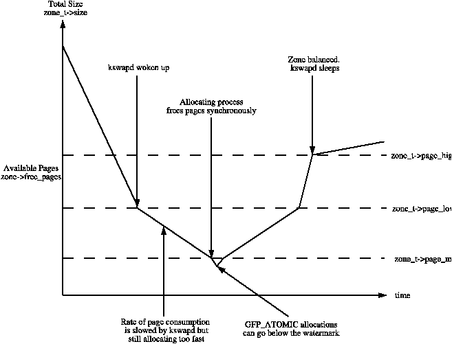

## Page Frame Management

### Page Descriptors

一些地址的转换：

* 宏 virt_to_page(addr) ：输入一个线性的虚拟地址，返回相关的 Page Descriptor
* 宏 pfn_to_page(pfn) ：输入一个 page frame 的 number pfn，返回相关的 Page Descriptor

page descriptor 的数据结构：

<em>图出处：Understanding The Linux Kernel 3rd Edition</em>

* _count ：引用计数，-1时可以回收
* flags：

## Non-Uniform Memory Access (NUMA)

在多CPU架构中，为提高内存访问的并发能力，有一种硬件架构设计，把物理内存分成几个组，这个组叫 node 。每个CPU归属于一个node。CPU 有专用线路去访问node的内存，CPU 访问非归属NODE的性能会更差 。

Node 的物理内存又再划分成多个 Zone。

每个 Node 对应一个数据结构（pg_data_t）：

## Memory Zones

对于 64-bit 架构，ZONE_HIGHMEM总是空的。

Zone 的数据结构：

很多 field 是在 Page 回收时用到的。

## 保留的 Page

要处理 Page 的分配，有两种情况：

* 空闲内存足够时，直接使用
* 空闲内存不足时，需要发起内存回收。而请求分配内存的线程需要挂起，直到回收到足够的内存

但有的内核程序不能被挂起，如：终断处理程序。这种情况下，程序应该使用`atomic memory allocation requests`（即内存分配请求时，用 GFP_ATOMIC标记）。这种分配请求，不会挂起，只会失败。

为最大程度减少`atomic memory allocation requests`失败的可能。内核保留了一块内存，只在可用内存少时才使用。这块内存的大小由配置 min_free_kbytes 指定。

Zone 的数据结构中，`pages_min`字段就表示本 zone 的保留 Page 数。

## Zoned Page Frame Allocator

Page 的分配经由 Zoned Page Frame Allocator 完成。每个CPU有一个快速分配的缓存区。

## 发起分配和回收

发起分配和回收有以下函数：

* alloc_pages(gfp_mask, order) ：分配连续的 Page，返回第一个 Page 的 Descriptor(元信息)
* __get_free_pages(gfp_mask, order)：功能同上，但返回第一个 Page 的线性地址。

#### gfp_mask

组合：

### Buddy System 算法

所有空闲 Page 以连续的 Page 数，分组为 1, 2, 4, 8, 16, 32, 64, 128, 256, 512, 1024 。数字为连续的 Page 数。

初始时，每个块的首个 page 的物理地址是组大小的倍数。

> [Linux Kernel Programming - Kaiwan N Billimoria] :
>
> 
>
> /proc/buddyinfo :
>
> 
>
> 

#### 数据源

每个内存的  Zone 都有自己的 Buddy System。

## Zone Allocator

Zone Allocator 作为内核 Page Frame Allocator 的前端。它要实现：

* 保护保留的 Page
* 触发Page回收。当空闲Page不足，且当前进程允许挂起时，它将触发Page回收，并重试分配

<a href="https://www.kernel.org/doc/gorman/html/understand/understand005.html">https://www.kernel.org/doc/gorman/html/understand/understand005.html</a>

## 参考

https://www.kernel.org/doc/gorman/html/understand/understand005.html

[Understanding The Linux Kernel 3rd Edition]

[Chapter 2 Describing Physical Memory](https://www.kernel.org/doc/gorman/html/understand/understand005.html)