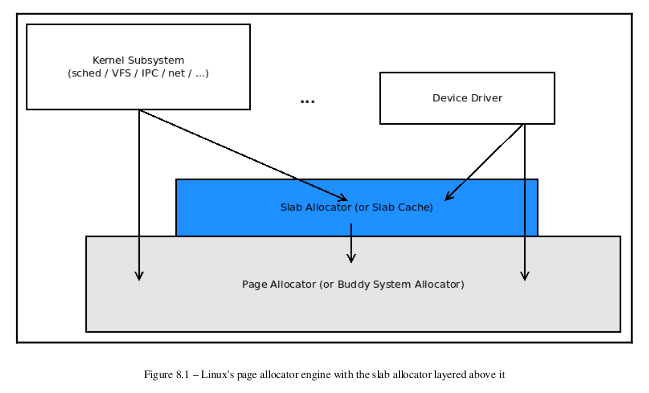
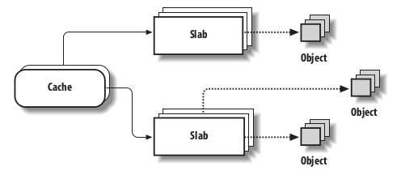
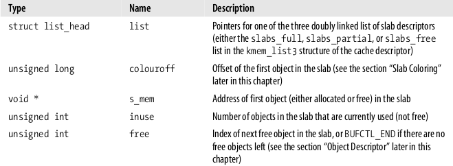
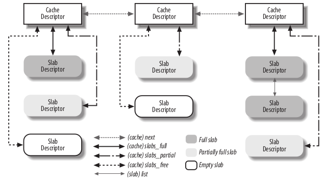
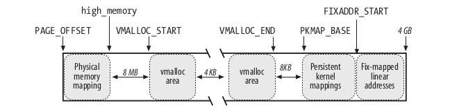

## Memory Area Management

使用 `buddy system algorithm`来分配大块内存是合理的，但小块内存就会做成空间浪费。

### Slab Allocator

> [Linux Kernel Programming - Kaiwan N Billimoria] :
>
> 

在 `buddy system algorithm`之上做一个内存分配算法会很低效。一个更好的方法是：

* 以不同数据结构分组，一次初始化，多次重用数据结构的内存块
* 内核经常频繁申请相同的数据结构，像 process descriptor

Slab Allocator 把对象按不同的数据结构类型分组为 Cache。Cache 再分为 Slab。一个 Slab必须由连续的 Page 组成。每个 Slab 又包含已分配和未分配的对象：

## Cache Descriptor

每个 Cache 对应一个 kmem_cache_t 数据结构。

#### Slab Descriptor

Cache 与 Slab 的关系：

## 非连续 Page  的内存管理

相关函数：

*  vmalloc( )
* vfree( )

## 参考

[Understanding The Linux Kernel 3rd Edition]

