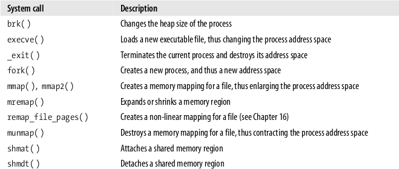
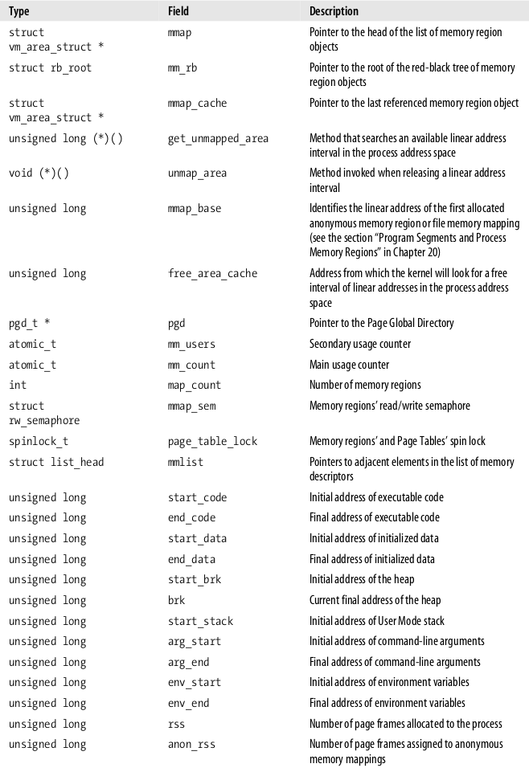
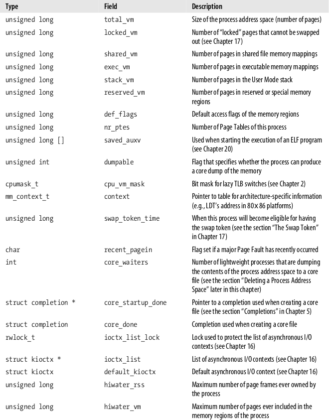
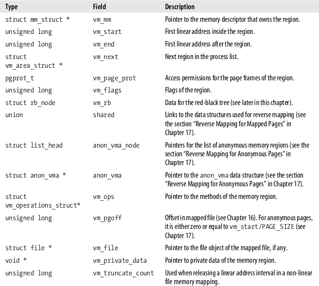
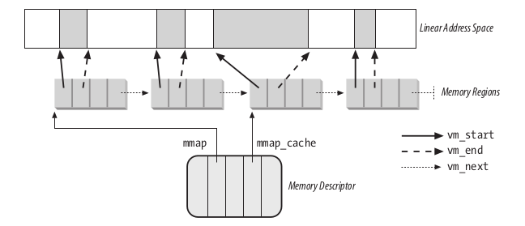
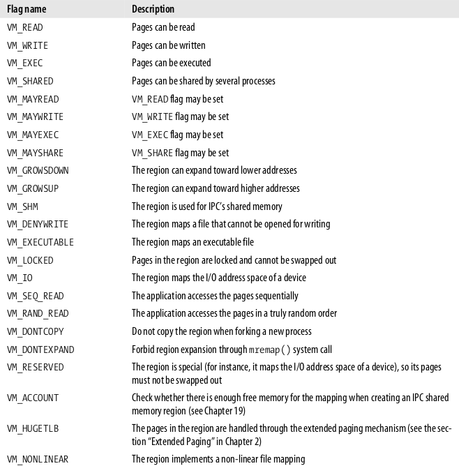
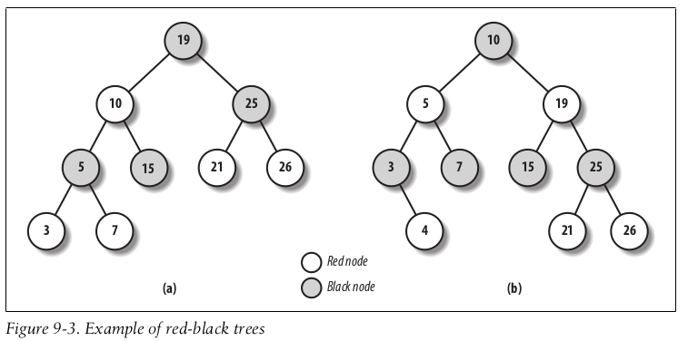
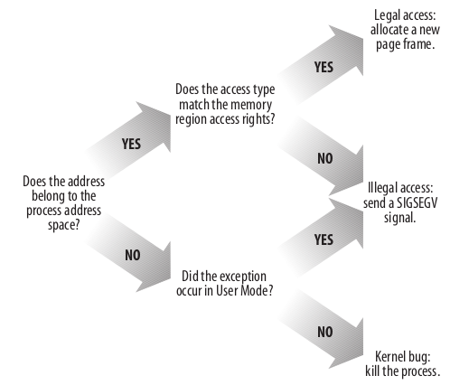
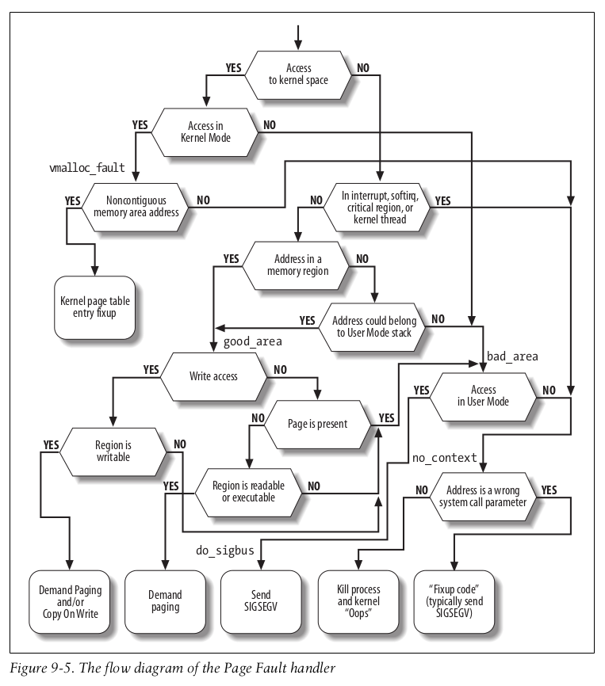
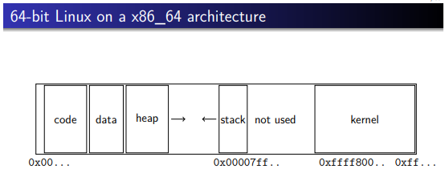

## 进程内存地址

通过之前的内容，我们学习到内核通过：

*  _get_free_pages( ) 或 alloc_pages() 从zoned page frame allocator 中分配内存。
* kmem_cache_alloc( ) 或 kmalloc( ) 分配小块的数据结构空间
* vmalloc( ) 或 vmalloc_32() 分配不连续的空间

内核内部分配内存是实时、同步的，也信任相关的程序。

但当是应用来申请分配内存时，情况不同了：

* 应用分配内存一般不紧急，可以廷后实制的分配
* 应用不可信，内核需要处理异常访问

当应用申请动态分配内存时，它实制上不是马上得到一个 page frame，而是获得访问一个线性地址范围的权限。

### memory regions

内核把进程地址分成区，叫 `memory regions`。以下是进程获取 region 的例子：

* 用户在终端中输入一个命令，新的 进程使用了新的`memory regions`
* 进程 execve 一个加载和运行一个新的应用执行文件，保留了进程ID
* 进程使用 memory mapping 来映射文件到内存空间
* 进程用光了用户态的栈空间，需要扩展
* 进程建立了IPC共享内存区，以和其它进程通讯
* 进程通过 malloc() 函数主动扩展动态分配的内存区（堆）。内核可能会最终扩展堆使用的`memory region`

以下是和`memory region`有关的 system call:

## Memory Descriptor

进程相关的地址空间信息保存于 Memory Descriptor（mm_struct）。process descriptor 的 mm 字段指向了这个  Memory Descriptor。

所有的 Memory Descriptors 都保存在一个双向链表（doubly linked list）。每个 Descriptor 的 `mmlist`中均指向其相邻的Descriptor 节点。这个双向链表的第一个节点就是`init_mm`的`mmlist`，即进程 0 在初始化阶段使用的 Memory Descriptor。链表通过一个 `mmlist_ock` spin lock 进行并发访问保护。

`mm_users`记录了线程的引用计数，`mm_count`记录了总的使用计数。即`mm_user`非0时，在`mm_count`中占用1。

内核线程可能会临时使用这个 Memory Descriptor，期间`mm_count`会加1。

## 内核线程的 Memory Descriptor

内核线程和一般用户进程不同，没有自己的 `Memory Region`。所以它要借用一般用户进程的`memeory descriptor`。

进程的 Descriptor 有两个`memory descriptor`指针类型的字段，一个是之前说的`mm`，一个是`active_mm`。在执行一般进程时，这两个均指向相同。而当执行内核线程时，`active_mm`设置为相同CPU 的前一个执行的进程的`mm`。

## Memory Regions

Memory Regions 以`vm_area_struct`数据结构表示。

进程的 Memory Region不会重叠。要分配新的Memory Region时，进程尽可能地让Memory Region连续，然后合并。

#### Memory Region 数据结构

进程 Descriptor 中有：

* `mmap`字段指向进程的首个`memory region descriptor`节点
* `map_count`字段指向进程的 `memrory region`计数。Linux 默认限制最大值为 65,536 个 memory region。可能通过 `/proc/sys/vm/max_map_count` 文件修改。

#### 内存管理对象全图

#### Memory Region 与访问权限

需要清楚一下 Memory Region 与 Page 的关系。Memory Region 由连续编号的 Page 组成。

之前已经了解过，Page Table Entry 与 Page 有以下权限选项：

* Page Table Entry: Read/Write , Present , or User/Supervisor
* Page： page descriptor 中的标记位

Memory Region 在更高级别上定义了访问权限（设置于`vm_area_struct`的`vm_flags`）：

#### Memory Region 的快速查找

Although most Linux processes use very few memory regions, there are some large
applications, such as object-oriented databases or specialized debuggers for the usage
of malloc() , that have many hundreds or even thousands of regions. In such cases,
the memory region list management becomes very inefficient, hence the perfor-
mance of the memory-related system calls degrades to an intolerable point.

## 分配线性地址块

线性内存块由 `do_mmap()`函数创建和初始化。在创建后，可能被合并到现有的`Memory Region`中。 `do_mmap()`有以下参数：

* file and offset - File Object Pointer 文件和文件 offset，如果需要映射到文件
* addr - 索引空闲地址的开始点
* len - 长度
* flag
  * MAP_GROWSDOWN
  * MAP_LOCKED - 进程限制不能超过 signal->rlim[RLIMIT_MEMLOCK].rlim_cur
  * MAP_DENYWRITE , MAP_EXECUTABLE
  * MAP_SHARED and MAP_PRIVATE
    memory region 是否可以在进程间共享
  * MAP_FIXED
  * MAP_ANONYMOUS： 没映射到文件
  * 

## Page Fault Exception Handler

一点需要注意的是，Copy On Write（COW）是用Page Fault Exception Handler方法实现的。一开始，Page 配置成 Read only。在写时，触发 Page Fault Exception Handler。再 copy page。配置为 Write/Read。

Figure 9-5. The flow diagram of the Page Fault handler:

## 进程堆（Heap）的管理

每个进程有一个堆空间，用于满足进程的动态内存请求。`memory descriptor`的`start_brk`和`brk`字段指明了堆的边界。以下API用于进程的动态内存请求：

* malloc(size)
* free(addr)
* brk(addr)
  直接修改堆大小

brk() 和其它函数不同，它直接由system call - sys_brk() 实现。其它函数间接由 libc 调用brk() 和 mmap() 实现。

## 参考

[Understanding The Linux Kernel 3rd Edition]

[memory-handout-nup.pdf](https://people.kth.se/~johanmon/courses/id2206/lectures/memory-handout-nup.pdf)

