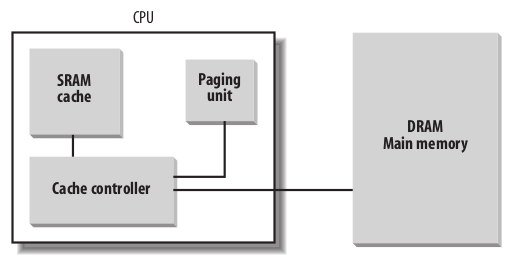

## CPU Cache

Cache 有两种写策略：

* write-through：同步写 Cache 和 Main Memory
* write-back：不同步写 Main Memory，直到CPU发出 flush 指令，或收到了 FLUSH 硬件信号

### Translation Lookaside Buffers (TLB)

为了加快地址转换，每个 CPU 均有一个Translation Lookaside Buffers (TLB)单元，缓存地址转换表。
