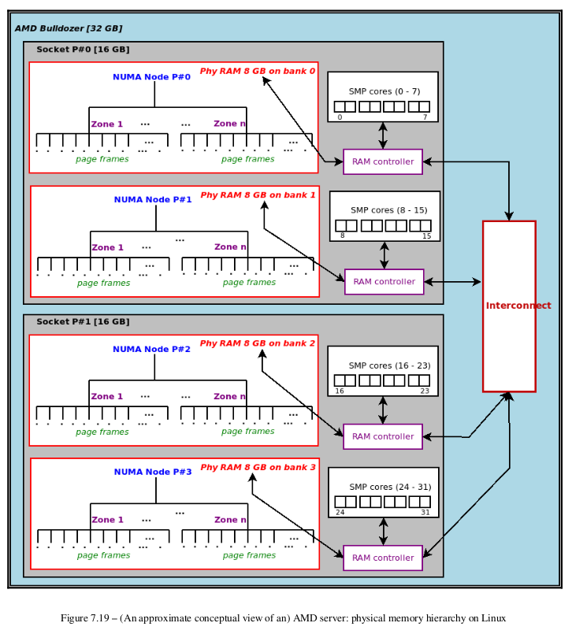
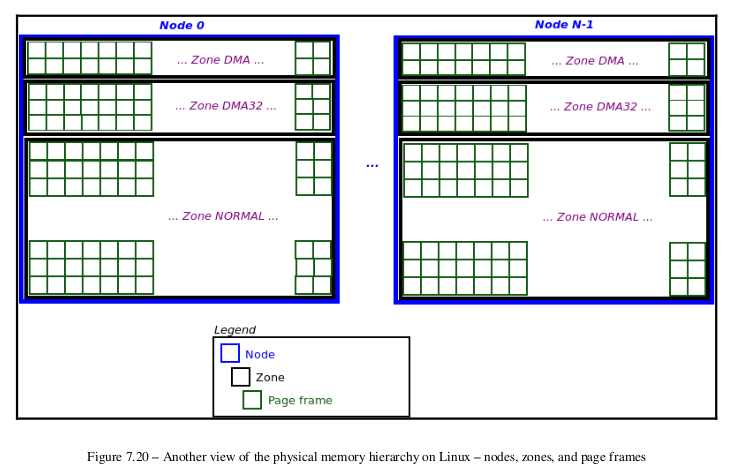

> [Linux Kernel Programming - Kaiwan N Billimoria] :


## Zone

CPU Socket -> NUMA Node -> Zone




## page frames




```log
$ cat /proc/buddyinfo
Node 0, zone
DMA
3
3
Node 0, zone
DMA32 31306
0
Node 0, zone Normal 49135
0
$
```

