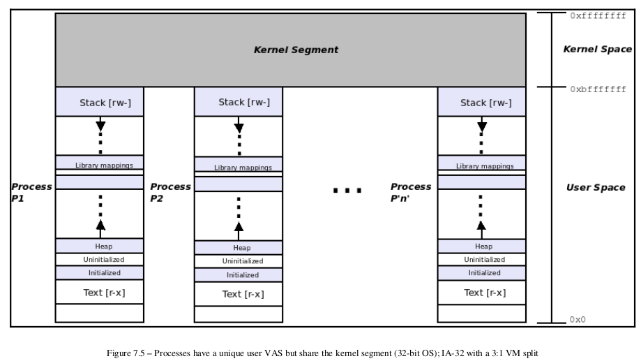

## 什么是内存 Page

为高效管理内存，内存管理时，要以一定大的粒度去管理，一般为4 Kbytes。每个连续的4k内存块为一个 page。

## 进程虚拟内存地址分配

如上图，进程的地址空间被分为很多 segment，其中  heap（堆）和 stack （栈）可扩展。

## 进程虚拟内存和物理内存地址的快速转换

从进程角度看，只有一个线性的内存空间，而这个空间其实被映射到物理内存中：

如果这个转换在CPU中完成，会影响性能，所以有专門的硬件作转换，叫 MMU：

MMU 中记录了每个 Page 的元数据（状态和属性）

* Present flag：Page 是否在物理内存中
* Accessed flag：是否被访问过
* Dirty flag：是否被写入过
* Read/Write flag：读写权限
* Page Size flag：是否大页（2/4Mbytes）

## 以上内容的参考

* [Understanding The Linux Kernel 3rd Edition]

* [memory-handout-nup.pdf](https://people.kth.se/~johanmon/courses/id2206/lectures/memory-handout-nup.pdf)

* [Linux x86_64 Memory Laytout](https://www.kernel.org/doc/html/latest/x86/x86_64/mm.html)

* https://www.kernel.org/doc/html/latest/admin-guide/mm/concepts.html

## 虚拟内存寻址范围

### 术语

- Virtual Address Space (VAS)
- Kernel Virtual Address (KVA).
- User Virtual Address (UVA)

### 只使用 48 位寻址有效地址

> [Linux Kernel Programming - Kaiwan N Billimoria] :
>
> First off, it is worth noting that on 64-bit systems, all 64 bits are not used for
> addressing. On a standard or typical Linux OS configuration for the x86_64 with a
> (typical) 4 KB page size, we use (the Least Significant Bit (LSB)) 48 bits for
> addressing. Why not the full 64 bits? It's simply too much! No existing computer
> comes close to having even half of the full 2 64 = 18,446,744,073,709,551,616 bytes,
> which is equivalent to 16 EB (that's 16,384 petabytes) of RAM!
>
> 首先，值得注意的是，在 64 位系统上，并非所有 64 位都用于寻址。 在 x86_64 的标准或典型 Linux 操作系统配置上，带有（典型）4 KB 页面大小，<mark>我们使用（最低有效位 (LSB)）48 位寻址</mark>。 为什么不是完整的 64 位？ 因为这太大了！ 没有现有的计算机接近 2 64 = 18,446,744,073,709,551,616 字节的一半，这相当于 16 EB（即 16,384 PB）的 RAM！

> Okay, if this 48-bit addressing is the typical case on the x86_64 processor, then how
> are the bits in a 64-bit virtual address laid out? What happens to the unused 16 MSB
> bits? The following figure answers the question; it's a representation of the breakup of
> a virtual address on an x86_64 Linux system:
>
> 好的，如果这个 48 位寻址是 x86_64 处理器上的典型情况，那么64 位虚拟地址如何布局？ 未使用的 16 MSB 会发生什么？ 下图回答了这个问题：

- Page Global Directory (PGD)
- Page Table (PT)

## 内核地址与用户进程地址空间

> Essentially, with 48-bit addressing, we use bits 0 to 47 (the LSB 48 bits) and ignore the
> Most Significant Bit (MSB) 16 bits, treating it much as a sign extension. Not so fast
> though; the value of the unused sign-extended MSB 16 bits varies with the address
> space you are in:
> Kernel VAS: MSB 16 bits are always set to 1 .
> User VAS: MSB 16 bits are always set to 0 .
> This is useful information! Knowing this, by merely looking at a (full 64-bit) virtual
> address, you can therefore tell whether it's a KVA or a UVA:
> KVAs on a 64-bit Linux system always follow the format `0xffff ....`
> .... .... .
> UVAs always have the format `0x0000 .... .... ...`. .
>
> 本质上，对于 48 位寻址，我们使用位 0 到 47（LSB 48 位）并忽略最高有效位 (MSB) 16 位，将其视为符号扩展。
>
> 未使用的符号扩展 MSB 16 位的值，随地址空间变化：
> 内核 VAS：MSB 16 位始终设置为 1 。
> 用户 VAS：MSB 16 位始终设置为 0 。
> 这是有用的信息！ 知道这一点，只需查看（完整的 64 位）虚拟地址，因此您可以判断它是 KVA 还是 UVA：
> 64 位 Linux 系统上的 KVA 始终遵循 `0xffff ... `格式。
> ………………
> UVA 的格式始终为 `0x0000 .... .... ....` .

Canonical lower half, for 128 TB: User VAS and virtual address ranges
from 0x0 to 0x0000 7fff ffff ffff
Canonical upper half, for 128 TB: Kernel VAS and virtual address ranges
from 0xffff 8000 0000 0000 to 0xffff ffff ffff ffff

规范下半部分，用于 128 TB：用户 VAS 和虚拟地址范围
从 `0x0` 到 `0x0000 7fff ffff ffff`
规范上半部分，用于 128 TB：内核 VAS 和虚拟地址范围
从 `0xffff 8000 0000 0000` 到 `0xffff ffff ffff ffff`

Under the x86_64, there are two VM splits shown in the preceding table:
The first one, 128 TB : 128 TB (4-level paging) is the typical VM split being
used on Linux x86_64-bit systems as of today (embedded laptops, PCs,
workstations, and servers). It limits the physical address space to 64 TB (of
RAM).

The second one, 64 PB : 64 PB, is, as of the time of writing at least, still
purely theoretical; it comes with support for what is called 5-level
paging from 4.14 Linux; the assigned VASes (56-bit addressing; a total of
128 petabytes of VAS and 4 PB of physical address space!) is so enormous
that, as of the time of writing, no actual computer is (yet) using it.

####  Processes have a unique user VAS but share the kernel segment

Figure 7.5 – Processes have a unique user VAS but share the kernel segment (32-bit OS); IA-32 with a 3:1 VM split：

## 内核地址空间划分

- **The user mode VAS**: This is the user VAS; we have covered it in detail in
  the preceding chapter as well as earlier sections in this chapter; in this
  particular example, it takes 3 GB of VAS (UVAs from 0x0 to 0xbfff
  ffff ).

- All that follows belongs to kernel VAS or the kernel segment; in this
  particular example, it takes 1 GB of VAS (KVAs from 0xc000
  0000 to 0xffff ffff ); let's examine individual portions of it now.

- **The `lowmem` region**: This is where platform (system) RAM direct-
  maps into the kernel. (We will cover this key topic in more detail in
  the Direct-mapped RAM and address translation section. If you feel it helps,
  you can read that section first and then return here). Skipping a bit ahead
  for now, let's just understand that the base location in the kernel segment
  where platform RAM is mapped is specified by a kernel macro called
  PAGE_OFFSET . The precise value of this macro is very arch-dependent; we
  will leave this discussion to a later section. For now, we ask you to just take
  it on faith that on the IA-32 with a 3:1 (GB) VM split, the value of
  PAGE_OFFSET is 0xc000 0000 .

  The length or size of the kernel lowmem region is equal to the amount of
  RAM on the system. (Well, at least the amount of RAM as seen by the
  kernel; enabling the kdump facility, for example, has the OS reserve some
  RAM early). The virtual addresses that make up this region are
  termed kernel logical addresses as they are at a fixed offset from their
  physical counterparts. The core kernel and device drivers can allocate
  (physically contiguous!) memory from this region via various APIs (we
  cover precisely these APIs in detail in the following two chapters). The
  kernel static text (code), data, and BSS(uninitialized data) memory also
  resides within this lowmem region.

- **The kernel `vmalloc` region**: This is a region of the kernel VAS that is
  completely virtual. Core kernel and/or device driver code can allocate
  virtually contiguous memory from this region using the vmalloc() (and
  friends) API. Again, we will cover this in detail in Chapter 8 , Kernel
  Memory Allocation for Module Authors Part 1, and Chapter 9 , Kernel Memory
  Allocation for Module Authors Part 2. This is also the so-called ioremap
  space.
- **The kernel modules space**: A region of kernel VAS is set aside for memory
  taken up by the static text and data of Loadable Kernel Modules (LKMs).
  When you perform insmod(8) , the underlying kernel code of the resulting
  [f]init_module(2) system call allocates memory from this region
  (typically via the vmalloc() API) and loads the kernel module's (static)
  code and data there.

