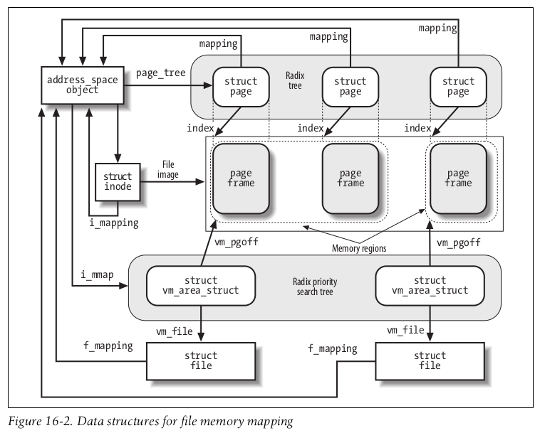

> from [Understanding The Linux Kernel]

## Memory Mapping

an access to a byte within a page of the
memory region is translated by the kernel into an operation on the corresponding
byte of the file. This technique is called memory mapping.
Two kinds of memory mapping exist:

- Shared
  Each write operation on the pages of the memory region changes the file on disk;
  moreover, if a process writes into a page of a shared memory mapping, the
  changes are visible to all other processes that map the same file.
- Private
  Meant to be used when the process creates the mapping just to read the file, not
  to write it. For this purpose, private mapping is more efficient than shared map-
  ping. But each write operation on a privately mapped page will cause it to stop
  mapping the page in the file. Thus, a write does not change the file on disk, nor
  is the change visible to any other processes that access the same file. However,
  pages of a private memory mapping that have not been modified by the process
  are affected by file updates performed by other processes.

### Memory Mapping Data Structures

A memory mapping is represented by a combination of the following data structures:

- The `inode` object associated with the mapped file
- The `address_space` object of the mapped file
-  A `file` object for each different mapping performed on the file by different processes
-  A `vm_area_struct` descriptor for each different mapping on the file
-  A `page descriptor` for each page frame assigned to a memory region that maps the file

*Figure 16-2. Data structures for file memory mapping*

<mark>Pages of shared memory mappings are always included in the page cache;</mark> **pages of**
**private memory mappings are included in the page cache as long as they are unmodified**. When a process tries to **modify** a page of a private memory mapping, the kernel duplicates the page frame and replaces the original page frame with the duplicate in the process Page Table; this is one of the applications of the Copy On Write mechanism that we discussed in Chapter 8. The original page frame still remains in the page cache, although it no longer belongs to the memory mapping since it is replaced by the duplicate. In turn, the duplicate is not inserted into the page cache because it no longer contains valid data representing the file on disk.

