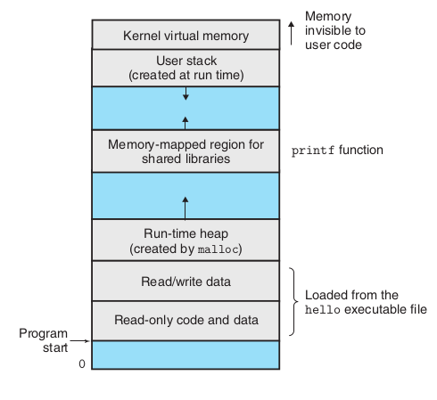
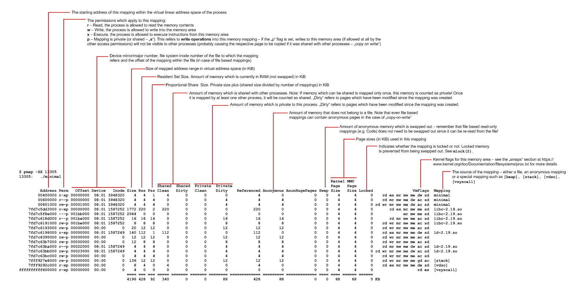
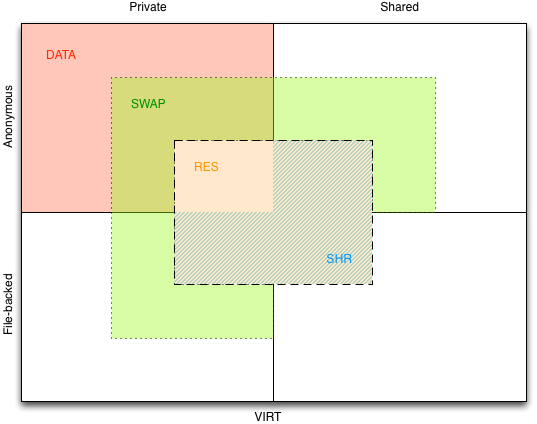

##### 进程的内存

一般意义的进程是指可执行文件运行实例。进程的内存结构可能大致划分为：

Process virtual address
space.  From [Computer Systems - A Programmer’s Perspective]

其中的 `Memory-mapped region for shared libraries` 是二进制计算机指令部分，可先简单认为是直接 copy 或映射自可执行文件的 `.text section（区域）` (虽然这不完全准确)。

> https://www.labcorner.de/cheat-sheet-understanding-the-pmap1-output/

> https://techtalk.intersec.com/2013/07/memory-part-2-understanding-process-memory/

