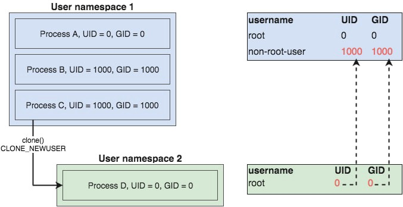
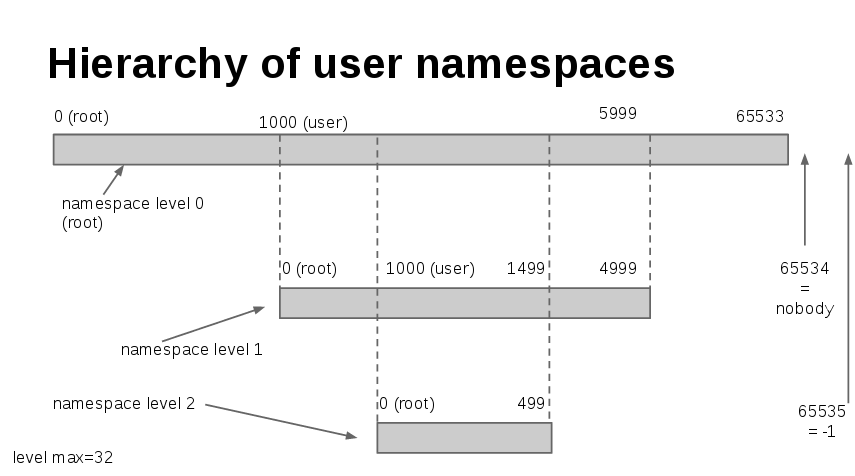

## User Namspace and Capabilities

> https://man7.org/linux/man-pages/man7/user_namespaces.7.html

Note that a call to execve(2) will cause a process's capabilities
to be recalculated in the usual way (see capabilities(7)).
Consequently, unless the process has a user ID of 0 within the
namespace, or the executable file has a nonempty inheritable
capabilities mask, the process will lose all capabilities.  See
the discussion of user and group ID mappings, below.

### rules for determining a process has a capability in a particular user namespace

```
       1. A process has a capability inside a user namespace if it is a
          member of that namespace and it has the capability in its
          effective capability set.  A process can gain capabilities in
          its effective capability set in various ways.  For example, it
          may execute a set-user-ID program or an executable with
          associated file capabilities.  In addition, a process may gain
          capabilities via the effect of clone(2), unshare(2), or
          setns(2), as already described.

       2. If a process has a capability in a user namespace, then it has
          that capability in all child (and further removed descendant)
          namespaces as well.

       3. When a user namespace is created, the kernel records the
          effective user ID of the creating process as being the "owner"
          of the namespace.  A process that resides in the parent of the
          user namespace and whose effective user ID matches the owner
          of the namespace has all capabilities in the namespace.  By
          virtue of the previous rule, this means that the process has
          all capabilities in all further removed descendant user
          namespaces as well.  The NS_GET_OWNER_UID ioctl(2) operation
          can be used to discover the user ID of the owner of the
          namespace; see ioctl_ns(2).
```

## User and group ID mappings: uid_map and gid_map

```
       When a user namespace is created, it starts out without a mapping
       of user IDs (group IDs) to the parent user namespace.  The
       /proc/[pid]/uid_map and /proc/[pid]/gid_map files (available
       since Linux 3.5) expose the mappings for user and group IDs
       inside the user namespace for the process pid.  These files can
       be read to view the mappings in a user namespace and written to
       (once) to define the mappings.
```

> https://blog.quarkslab.com/digging-into-linux-namespaces-part-2.html



A more general view of the remapping process can be seen on this picture:




## Ref

- http://ifeanyi.co/posts/linux-namespaces-part-2/
- https://www.schutzwerk.com/en/43/posts/namespaces_04_user/
- https://blog.quarkslab.com/digging-into-linux-namespaces-part-1.html
- https://blog.quarkslab.com/digging-into-linux-namespaces-part-2.html
- https://netflixtechblog.com/evolving-container-security-with-linux-user-namespaces-afbe3308c082
- https://kinvolk.io/blog/2020/12/improving-kubernetes-and-container-security-with-user-namespaces/


