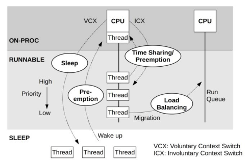

# BPF 跟踪 epoll/Envoy 事件与调度


注，原文来自 https://blog.mygraphql.com/zh/notes/low-tec/network/bpf-trace-net-stack/ 。如你看到的转载图片不清，请回到原文。


## 为何
现代人好像都很忙，忙着跟遥远的人社交，却很容易忽视眼前的人事，更别提那些不直接体现出价值的基础认知了。要花时间认真看一编文章前，都要问一个问题：WHY。这才会有 `TLDR;` 的出现。终身学习是个口号，但也仅仅是个口号。看看身边的那些放満书的人，有几个真去阅读？社会人大都有现实地认为，持续学习只应该发生在考试前。在社会卷时，就好好做个社会人。

**故事是这样的：**
话说，在风口上的微服务(Micro-Service)很美好，云原生(Cloud Native) 很美好，服务网格(Istio) 很美好，旧爱非阻塞事件响应编程(epoll)很美好。但出现性能优化需求的时候，性能工程师会把上面的“美好”会替换为“复杂”。是的，没太多人在架构设计或重构前会花太多时间在性能上和那些开箱即用的基础架构上。直到一天遇到问题要救火……

终于，为救火，我们还要看基础架构是如何工作的。但从何入手？直接看源码？ `git clone`，开始读源码？ 很大可能，最后会迷失在源码的海洋中。

YYDS，Linus Torvalds 说过：

> https://lwn.net/Articles/193245/
> In fact, I'm a huge proponent(支持者) of designing your code around the data, rather than the other way around, and I think it's one of the reasons git has been fairly successful (*) 
>
> ...
>
> (*) I will, in fact, claim that the difference between a bad programmer and a good one is whether he considers his code or his data structures more important. **Bad programmers worry about the code. Good programmers worry about data structures and their relationships**.
>
> —— Linus Torvalds 
>
> 

可见，了解软件的数据结构是了解软件运行机理的关键。但个人认为，这对于单体架构软件是正确的。但对于现代具有复杂组件架构的系统来说，只了解数据结构不足够，还要了解数据结构是如何在子系统间流转。

下面，我们关注一下，Istio/Envoy 下，从内核到用户进程，有什么重要数据结构，数据和事件是如何在子系统间协作，最后完成任务的。了解了这些，在系统需要调优之时，就有了观察点和优化可能点了。而不是完全看作黑盒，从网上找各种“神奇”配置来盲目碰运气。


## 《网络包的内核漂流记》系列介绍

大家知道，网络数据来源于网线、光纤、无线电波上的比特(bit)，然后到网卡，到内核，最后到应用进程 socket。事情好像很简单。但如果是 SRE/DevOps 或是 Performance Engineer ，需要做细致的监控和优化时，这些显然是不够的。引用本文主要参考作者的原话：
> Optimizing and monitoring the network stack is impossible unless you carefully read and understand how it works. You cannot monitor code you don’t understand at a deep level.
> 除非您仔细阅读并了解其工作原理，否则无法优化和监控网络堆栈。 您无法深入监控您不理解的代码。
> —— [Joe Damato](https://blog.packagecloud.io/monitoring-tuning-linux-networking-stack-receiving-data/)

《网络包的内核漂流记》尝试分析和跟踪一个网络包在内核各子系统间的流转和触发的协作。

开始前先做个预告，《网络包的内核漂流记》 系统（将）包括：
- [Part 1: 图解网络包接收流程](https://blog.mygraphql.com/zh/notes/low-tec/network/kernel-net-stack/)
- Part 2: BPF 跟踪 epoll/Envoy 事件与调度(本文)
  - 我将演示如何用 bpftrace 踪网络包的内核漂流。 用例子说明，内核接收网络包，网络包在协议栈上的处理，epoll 事件等待和线程的调度机制。

为免吓跑人，还是老套路，多图少代码。不过有的图有点点复杂。🚜

### 重要：风格、样式、本文的交互阅读方式 📖

本文图很多，也很有很多细节直接嵌入到图中。其中有到源码的链接、图例等。可以这样说，我写作的大部时间不是花在文字上，是在图上，所以用电脑去读图，才是本文的正确打开方法。手机与微信号，只是个引流的阳谋。

虽然不是写书，不过还是说明一下吧，不然阅读体验不太好。：

1. 我不打算像八股文的源码分析文章一样，贴一堆源码，让文章看起来内容很丰满但无趣。我用交互 SVG 图片的的方法去引用源码 😎 。
2. https://blog.mygraphql.com/zh/notes/low-tec/network/bpf-trace-net-stack/ 的原文是 SVG 图片。如果你是在其它地方看到本文，请转回原文。
3. 正确浏览 SVG 图片的姿势是浏览器中图片处右键，选择 “新 Tab 中打开图片” 。大的 SVG 图片，按下鼠标中键，自由滚动/拖动。
4. **SVG 图片可以点击链接，直接跳转到相应内核源码网页，精确到源码行。** 是的，你不需要 git clone那大陀源码 🤠 ，只需要一个浏览器就可以。如果你在电脑前开双屏，结合源码和图看，相信我，源码不是什么天书，你能看懂大部分的。
5. 浏览内核源码我用 https://elixir.bootlin.com/linux/v5.4/source 。这个是很好的内核源码浏览网站，内置源码引用跳转和搜索功能。


### 术语

开始前简单过一下术语，以减少后面的误解：

- `upstream`:   流量方向中的角色：[downstream] --> envoy --> **[upstream]**。这里我避免用中文词 `上/下游`，因为概念上没有统一，也容易和英文误解。
- `downstream`:  流量方向中的角色：**[downstream]** --> envoy --> [upstream]

> 需要注意的是，upstream 与 downstream 是个相对于观察者的概念。
>
> 如场景: `service A` --调用--> `service B`  --调用--> `service C` :
>
> - 如果站在 `service C` 上，我们在把` service B` 叫 downstream;
>
> - 如果站在 `service A` 上，我们把 `service B` 叫 upstream。

- TID: 线程 ID
- PID: 进程 ID
- ENVOY_PID: Envoy 的 PID
- enqueue: 入队列尾
- dequeue: 出队列头
-  fd: socket 的文件描述符

以上只是部分术语，其它术语我将在首次使用时作介绍。

## 跟踪目标架构与环境

被跟踪的架构很简单：

```c
downstream_pod(downstream_app -> downstream_sidecar) ---HTTP---> target_pod(target_sidecar -> target_app)
```

即有两个 pod，分别叫 downstream_pod、trace_target_pod。他们均有 app 和 sidecar。跟踪开始后，触发 `downstream_app` 向 `target_pod` 发送 http 请求。

被跟踪的环境地址信息：

```
downstream_pod IP: 172.30.207.163

target_pod IP: 172.21.206.207
target_sidecar(Envoy) Inbound listen port: 127.0.0.1:15006
target_sidecar(Envoy) 进程 PID: 4182
target_sidecar(Envoy) 主线程TID: 4182
target_sidecar(Envoy) 主线程名: envoy
target_sidecar(Envoy) 工作线程0 TID: 4449
target_sidecar(Envoy) 工作线程0 名: wrk:worker_0
target_sidecar(Envoy) 工作线程1 TID: 4450
target_sidecar(Envoy) 工作线程1 名: wrk:worker_1

target_app endpoint: 172.21.206.207:8080 / 127.0.0.1:8080
```

## 内核调度点与协作

在开始 ` 事件链路初探`  前，先了解一下基础知识： 内核调度点与协作。

Linux 内核调度如果要说清楚，是一本书一个章节的。由于本人学识有限，本文的篇幅有限，不想深度展开，但说说基本的还是需要的。

### 线程状态


*图：线程状态图（来自：https://idea.popcount.org/2012-12-11-linux-process-states/）*

#### ON/OFF CPU

> **🛈 注意，本小节是个题外话，不直接和本文相关，本文不涉及 Runnable 状态下 ON/OFF CPU 的分析，不喜可跳过。**

光有线程状态其实对性能分析还是不足的。对于 Runnable 的线程，由于 CPU 资源不足排队、cgroup CPU limit 超限、等情况，可以再分为：

- Runnable & ON-CPU - 即线程是可运行的，并且已经在 CPU 上运行。
- Runnable & OFF-CPU - 线程是可运行的，但因各种资源不足或超限原因，暂时未在 CPU 上运行，排队中。

。 Brendan Gregg 的 [BPF Performance Tools] 一书中有这个图：



*图：ON/OFF CPU 线程状态图(from  [BPF Performance Tools] )*


介绍几个术语：

- voluntary switch: 线程自愿地离开 cpu(offcpu，即不运行)，一般离开后，状态会变为 TASK_INTERRUPTIBLE/TASK_UNINTERRUPTIBLE
- involuntary switch: 线程不自愿地离开 cpu(offcpu，即不运行)，一般离开后，v状态会还是 RUNNABLE 的。

### 线程的调度与切换

先上个图吧：



*图：内核调度点与协作*


图中信息量不少，不用担心。本文只关注红点部分。

如果你和我一样，在第一次看到上面的 `finish_task_switch` 和 `try_to_wake_up` 时一面茫然，那么没关系。在看过 Kaiwan N Billimoria 的 [Linux Kernel Programming] 一书后，终于略懂一二。总结如下。


1. `Process Runing ON CPU (正在CPU上运行的线程)` 在处理定时触发的 `timer interrupt soft IRQ TIMER_SOFTIRQ` 调用 `task_tick_fair()` 去计算 `Process Runing ON CPU` 是否应该被重新调度（即考虑抢占。即由于 CPU 资源不足有优先权更高的线程在等待排队、cgroup CPU limit 超限、等情况。如果线程需要被 off-cpu（抢占）那么会标记 `TIF_NEED_RESCHED` 位。
2. `Process Runing ON CPU` 在以下调度点可能触发真实的调度（即 off-cpu）
   - Calling Blocking SYSCALL - 调用阻塞的系统调用，如 read/write
   - Exit from SYSCALL - 完成系统调用，返回用户态之前
   - after hardware interrupt handling - 处理硬件中断多后

## 事件链路初探

关于 BPF 跟踪和分析问题的启动步骤，个人有一个小经验，也是从 Brendan Gregg 的 [BPF Performance Tools] 一书得来的。

1. 不要一开始作太细的方向性的假设。因有限的问题解决时间不应该一开始就花在可以排除的可能性上。
2. 所有方向性假设都需要用数据证明
   * [BPF Performance Tools] 一书说可以用 [stackcount](https://github.com/iovisor/bcc/blob/master/tools/stackcount.py) 等工具

由于这次，我关注的是网络事件如果触发 epoll/Envoy 的事件驱动。其中可以想到，关键中间路径是 Linux 的唤醒机制。如果可以分析到，等待 epoll 事件发生的应用线程（本例中即 Envoy Worker）是如何被唤醒的，那么就可以向上串联应用，向下串联内核网络栈了。


### 使用 offwaketime 探视应用唤醒调用链路

`offwaketime`  是 [BCC ](https://github.com/iovisor/bcc) BPF 工具包的一个内置小工具。它可以记录线程`挂起`时的`函数调用堆栈`，同时也记录相关`唤醒线程`唤醒`挂起线程`时的`函数调用堆栈`。这话写得太学究气了，想接地气，细说，还是移步大师大作：[Brendan Gregg 的 Linux Wakeup and Off-Wake Profiling](https://www.brendangregg.com/blog/2016-02-01/linux-wakeup-offwake-profiling.html)。

运行：

```bash
python3 ./offwaketime -p $ENVOY_PID
```

输出很多，重要摘录如下：

#### 收到 downstream 连接建立请求

`kubelet` 会连接 pod 端口做健康检查。所以 `kubelet` 也是 Envoy 的 Downstream。下面看这个 downstream 如何唤醒 Envoy：

```
1     waker:           kubelet 1172
2     b'[unknown]'
3     b'[unknown]'
4     b'entry_SYSCALL_64_after_hwframe'
5     b'do_syscall_64'`
6     b'__x64_sys_connect' <<<<<<<<<<<<<<< kubelet connect Envoy
7     b'__sys_connect'
8     b'inet_stream_connect'
9     b'release_sock'
10     b'__release_sock'
11     b'tcp_v4_do_rcv' <<<<<<<<<<<<<<<< `sk->sk_backlog_rcv` point to
12     b'tcp_rcv_state_process' <<<<<<<<<<<<<<< `sk->sk_state` == TCP_SYN_SENT
13     b'tcp_rcv_synsent_state_process' <<<<<< read `SYN/ACK` from peer(Envoy) at TCP backlog
14     b'tcp_send_ack'  <<<<<<<<<<< send `ACK`, to finish 3 handshake
15     b'__tcp_send_ack.part.0'
16     b'__tcp_transmit_skb'
17     b'ip_queue_xmit'
18     b'__ip_queue_xmit'
19     b'ip_local_out'
20     b'ip_output'
21     b'ip_finish_output'
22     b'__ip_finish_output'
23     b'ip_finish_output2'
24     b'__local_bh_enable_ip' <<<<<<<<<< Task from user process done, kernel try run SoftIRQ by the way.
25     b'do_softirq.part.0'
26     b'do_softirq_own_stack'
27     b'__softirqentry_text_start'
28     b'net_rx_action'
29     b'process_backlog'
30     b'__netif_receive_skb'
31     b'__netif_receive_skb_one_core'
32     b'ip_rcv' <<<<<<<<<<<<< Receive IP packet(TCP SYNC) from `kubelet` to `Envoy`
33     b'ip_rcv_finish'
34     b'ip_local_deliver'
35     b'ip_local_deliver_finish'
36     b'ip_protocol_deliver_rcu'
37     b'tcp_v4_rcv' <<<<<<<<<<< `Envoy` side listener socket sk->sk_state == TCP_LISTEN
38     b'tcp_child_process'
39     b'sock_def_readable' <<<<<<<<<<< `Envoy` side listener trigger Readable event
40     b'__wake_up_sync_key'
41     b'__wake_up_common_lock'
42     b'__wake_up_common'
43     b'ep_poll_callback' <<<<<<<<<<< `Envoy` side epoll wakeup logic
44     b'__wake_up'
45     b'__wake_up_common_lock'
46     b'__wake_up_common'
47     b'autoremove_wake_function' <<<<<<<<<<< wakeup Envoy's wrk:worker_0 thread
48     try_to_wake_up <<<<<<<<<<< this line not output by `offwaketime`, It is the kprobe of `offwaketime`. I add it here manually for easy to understanding.
49     --               --
50     b'finish_task_switch' <<<<<<<<<<< Envoy's wrk:worker_0 thread block waiting, TASK_INTERRUPTIBLE
51     b'schedule'
52     b'schedule_hrtimeout_range_clock'
53     b'schedule_hrtimeout_range'
54     b'ep_poll'
55     b'do_epoll_wait' <<<<<<<<<<< Envoy's wrk:worker_0 thread waiting on epoll event
56     b'__x64_sys_epoll_wait'
57     b'do_syscall_64'
58     b'entry_SYSCALL_64_after_hwframe'
59     b'epoll_wait'
60     b'event_base_loop'
61     b'Envoy::Server::WorkerImpl::threadRoutine(Envoy::Server::GuardDog&, std::__1::function<void ()> const&)'
62     b'Envoy::Thread::ThreadImplPosix::ThreadImplPosix(std::__1::function<void ()>, absl::optional<Envoy::Thread::Options> const&)::{lambda(void*)#1}::__invoke(void*)'
63     b'start_thread'
64     target:          wrk:worker_0 4449
65         201092
```

发生时序为：
* 64 -> 50 行是 Envoy 工作线程 wrk:worker_0 (`被唤醒者`) 进入挂起状态（TASK_INTERRUPTIBLE）前的函数堆栈。
* 1 -> 48 行为`唤醒者`(kubelet) 发起唤醒时的函数堆栈。倒序的，为方便和 64 -> 50 行的`被唤醒者` 函数堆栈串接。


可见，这次唤醒 Envoy wrk:worker_0 线程的正好是它的 downstream 线程。这是一个特例，只是由于 downstream 线程和 Envoy 运行于同一主机上。真实情况是，唤醒线程可以是主机上的所有无相干的 on-cpu 的线程。下面道来。

#### 收到 downstream 数据


##### `kubelet` 发送 TCP 数据到 Envoy, 触发 Envoy 端 socket 的 ReadReady 事件

```
    waker:           kubelet 169240
    b'[unknown]'
    b'[unknown]'
    b'entry_SYSCALL_64_after_hwframe'
    b'do_syscall_64'
    b'__x64_sys_write'
    b'ksys_write'
    b'vfs_write' <<<<<<<< `kubelet` write socket
    b'__vfs_write'
    b'new_sync_write'
    b'sock_write_iter'
    b'sock_sendmsg'
    b'inet_sendmsg'
    b'tcp_sendmsg'
    b'tcp_sendmsg_locked'
    b'tcp_push'
    b'__tcp_push_pending_frames'
    b'tcp_write_xmit'
    b'__tcp_transmit_skb'
    b'ip_queue_xmit'
    b'__ip_queue_xmit'
    b'ip_local_out'
    b'ip_output'
    b'ip_finish_output'
    b'__ip_finish_output'
    b'ip_finish_output2' <<<<<<< ip level sent done
    b'__local_bh_enable_ip' <<<<<<<<<< Task from user process done, kernel try run SoftIRQ by the way.
    b'do_softirq.part.0'
    b'do_softirq_own_stack'
    b'__softirqentry_text_start'
    b'net_rx_action'
    b'process_backlog'
    b'__netif_receive_skb'
    b'__netif_receive_skb_one_core'
    b'ip_rcv' <<<<<<<<<<<<< Receive IP packet(TCP data) from `kubelet` to `Envoy`
    b'ip_rcv_finish'
    b'ip_local_deliver'
    b'ip_local_deliver_finish'
    b'ip_protocol_deliver_rcu'
    b'tcp_v4_rcv' <<<<<<<<<<< `Envoy` side downstream socket event(downstream TCP data segment)
    b'tcp_v4_do_rcv'
    b'tcp_rcv_established'
    b'tcp_data_queue' <<<<<<<<<<< `Envoy` side downstream socket TCP segment enqueue to backlog
    b'tcp_data_ready'
    b'sock_def_readable' <<<<<<<<<<< `Envoy` side downstream socket raise ReadReady event
    b'__wake_up_sync_key'
    b'__wake_up_common_lock'
    b'__wake_up_common'
    b'ep_poll_callback'
    b'__wake_up'
    b'__wake_up_common_lock'
    b'__wake_up_common'
    b'autoremove_wake_function'
    --               --
    b'finish_task_switch'
    b'schedule'
    b'schedule_hrtimeout_range_clock'
    b'schedule_hrtimeout_range'
    b'ep_poll'
    b'do_epoll_wait' <<<<<<<<<<<<<< `Envoy` epoll waiting
    b'__x64_sys_epoll_wait'
    b'do_syscall_64'
    b'entry_SYSCALL_64_after_hwframe'
    b'epoll_wait'
    b'event_base_loop'
    b'Envoy::Server::WorkerImpl::threadRoutine(Envoy::Server::GuardDog&, std::__1::function<void ()> const&)'
    b'Envoy::Thread::ThreadImplPosix::ThreadImplPosix(std::__1::function<void ()>, absl::optional<Envoy::Thread::Options> const&)::{lambda(void*)#1}::__invoke(void*)'
    b'start_thread'
    target:          wrk:worker_0 4449
        197
```

##### `ksoftirqd` 线程处理接收到的，发向 `Envoy` socket 的数据, 触发 ReadReady

```
    waker:           ksoftirqd/1 18
    b'ret_from_fork'
    b'kthread'
    b'smpboot_thread_fn'
    b'run_ksoftirqd'
    b'__softirqentry_text_start'
    b'net_rx_action'
    b'process_backlog'
    b'__netif_receive_skb'
    b'__netif_receive_skb_one_core'
    b'ip_rcv'
    b'ip_rcv_finish'
    b'ip_local_deliver'
    b'ip_local_deliver_finish'
    b'ip_protocol_deliver_rcu'
    b'tcp_v4_rcv'
    b'tcp_v4_do_rcv'
    b'tcp_rcv_established'
    b'tcp_data_ready'
    b'sock_def_readable' <-----https://elixir.bootlin.com/linux/v5.4/source/net/core/sock.c#L2791
    b'__wake_up_sync_key'
    b'__wake_up_common_lock'
    b'__wake_up_common'
    b'ep_poll_callback' <----https://elixir.bootlin.com/linux/v5.4/source/fs/eventpoll.c#L1207
    b'__wake_up'
    b'__wake_up_common_lock'
    b'__wake_up_common'
    b'autoremove_wake_function'
    --               --
    b'finish_task_switch'
    b'schedule'
    b'schedule_hrtimeout_range_clock'
    b'schedule_hrtimeout_range'
    b'ep_poll'
    b'do_epoll_wait'
    b'__x64_sys_epoll_wait'
    b'do_syscall_64'
    b'entry_SYSCALL_64_after_hwframe'
    b'epoll_wait'
    b'event_base_loop'
    b'Envoy::Server::WorkerImpl::threadRoutine(Envoy::Server::GuardDog&, std::__1::function<void ()> const&)'
    b'Envoy::Thread::ThreadImplPosix::ThreadImplPosix(std::__1::function<void ()>, absl::optional<Envoy::Thread::Options> const&)::{lambda(void*)#1}::__invoke(void*)'
    b'start_thread'
    target:          wrk:worker_1 4450
        2066849
```


还记得上面说的：

> 可见，这次唤醒 Envoy wrk:worker_0 线程的正好是它的 downstream 线程。这是一个特例，只是由于 downstream 线程和 Envoy 运行于同一主机上。真实情况是，唤醒线程可以是主机上的所有无相干的 on-cpu 的线程。下面道来。

是的，这次是 ksoftirqd/1 去唤醒了。


至此，完成了调用链路初探。

## epoll、内核网络栈、内核线程调度的互动

像以前文章一样，我们先看看跟踪分析的结果，再看跟踪得出的数据和跟踪用的脚本。这样比较方便直观地理解整个实现。

一图胜千言，先看图吧。后面慢慢道来。下图是我用跟踪收集到的数据，加上一些认知和推理完成的。


*图：Envoy 下 epoll 与内核调度协作*


看图方法：

- 图中有图例（Legend）
- 图中有数据结构和关系、有函数和函数调用关系


先说明一下图中的红点步骤：

1. Envoy 调用 `do_epoll_wait`，线程进程阻塞等待状态 `TASK_INTERRUPTABLE_SLEEP`。
   * 嗯，是一个带 timeout 的，监听多个 socket 的 epoll 阻塞等待状态
2. 线程放入`waiting_task_queue`队列
3. 收到网络包，SoftIRQ 处理，TCP 层认为发生了 TCP socket 的事件，触发了事件和线程唤醒机制
4. 线程唤醒机制回调到 `ep_poll_callback` 
5. `try_to_wake_up`把线程从`waiting_task_queue`队列移动到`runnable_task_queue`队列。即唤醒了线程，线程变为 `RUNNABLE`。
   - 注意，RUNNABLE 不等于 `on-cpu`线程还需要等待调度器才能上 cpu。
6. 同上
7. 调度器把 RUNNABLE 的线程调入 CPU，变为 on-cpu & runnable。这时：
   1. 之前等待在 `do_epoll_wait`函数上的线程，继续运行，获取唤醒的事件（ fd(socket的文件描述符) 和 事件类型(Read/Writeable)）。写用用户态的内存，以便返回后用户态线程可以读取事件。
   2. 函数返回，线程从内核态返回到用户态。
8. 线程调用`Envoy::FileEventImpl::assignEvents::eventCallback( fd=$fd )`函数，处理事件，accept/读取/写入相关 socket。


看到这里，你会问：步骤不多，为何图中画那么多东西，是作者要卖弄学问吗？嗯，或者部分原因是。但更重要的原因是，这些内核数据结构图和函数对后面的 BPF 程序分析至关重要。

### BPF 跟踪程序

有了上面的基础知识，相关下面的 bpftrace 程序就不难理解了：

[源程序](https://github.com/labilezhu/pub-diy/blob/main/low-tec/network/kernel-net-stack/bpf-trace-net-stack/ep_poll_interact.bt)

```c
#!/usr/local/bin/bpftrace

/*
IMPORT-ENV: $ENVOY_PID
args: $1=ENVOY_PID
*/

/*
cd ~/pub-diy/low-tec/network/kernel-net-stack/bpf-trace-net-stack
export SCRIPT_HOME=`pwd`
export BT=ep_poll_interact.bt
export ENVOY_PID=$PID

./warp-bt.sh
*/

#include <linux/sched.h>
#include <linux/wait.h>
#include <linux/fs.h>
#include <linux/net.h>
#include <linux/socket.h>
#include <net/sock.h>

struct epoll_filefd {
	struct file *file;
	int fd;
};

struct epitem {
	union {
		/* RB tree node links this structure to the eventpoll RB tree */
		struct rb_node rbn;
		/* Used to free the struct epitem */
		struct rcu_head rcu;
	};

	/* List header used to link this structure to the eventpoll ready list */
	struct list_head rdllink;

	/*
	 * Works together "struct eventpoll"->ovflist in keeping the
	 * single linked chain of items.
	 */
	struct epitem *next;

	/* The file descriptor information this item refers to */
	struct epoll_filefd ffd;

	/* Number of active wait queue attached to poll operations */
	int nwait;

	/* List containing poll wait queues */
	struct list_head pwqlist;

	/* The "container" of this item */
	struct eventpoll *ep;

	// /* List header used to link this item to the "struct file" items list */
	// struct list_head fllink;

	// /* wakeup_source used when EPOLLWAKEUP is set */
	// struct wakeup_source __rcu *ws;

	// /* The structure that describe the interested events and the source fd */
	// struct epoll_event event;
};


struct eppoll_entry {
	/* List header used to link this structure to the "struct epitem" */
	struct list_head llink;

	/* The "base" pointer is set to the container "struct epitem" */
	struct epitem *base;

	/*
	 * Wait queue item that will be linked to the target file wait
	 * queue head.
	 */
	struct wait_queue_entry wait;

	// /* The wait queue head that linked the "wait" wait queue item */
	// wait_queue_head_t *whead;
};


BEGIN
{
    printf("Tracing nanosecond time in off-CPU stacks. Ctrl-C to end.\n");

	// See include/net/tcp_states.h:
	@tcp_states[1] = "ESTABLISHED";
	@tcp_states[2] = "SYN_SENT";
	@tcp_states[3] = "SYN_RECV";
	@tcp_states[4] = "FIN_WAIT1";
	@tcp_states[5] = "FIN_WAIT2";
	@tcp_states[6] = "TIME_WAIT";
	@tcp_states[7] = "CLOSE";
	@tcp_states[8] = "CLOSE_WAIT";
	@tcp_states[9] = "LAST_ACK";
	@tcp_states[10] = "LISTEN";
	@tcp_states[11] = "CLOSING";
	@tcp_states[12] = "NEW_SYN_RECV";    
}

kprobe:ep_poll_callback
{
    // record previous thread sleep time
    $wq_entry = (struct wait_queue_entry *)arg0;
    $u = (uint64)$wq_entry;
    $eppoll_entry = (struct eppoll_entry *) ( $u-8-sizeof(struct list_head) );
    $base_epitem = $eppoll_entry->base;
    $file = $base_epitem->ffd.file;
    $fd = $base_epitem->ffd.fd;
    // printf("elapsed=%d: tid=%d,comm=%s: ep_poll_callback: fd=%d, file*=%p\n", 
    //     elapsed, tid, comm, 
    //     $fd, $file);

    $ep = ($base_epitem->ep);

    $socket_file_ops = kaddr("socket_file_ops");
    // printf("socket_file_ops=%p\n", $socket_file_ops);
    
    if( $file->f_op != $socket_file_ops ) {//not socket file
        // printf("not socket_file_ops, file->f_op=%p, ksym=%s\n", $file->f_op, ksym($file->f_op));
        return;
    }

    $private_data = $file->private_data;
    if( ((uint64)$private_data ) == 0 ) {
        // printf("((uint64)$private_data ) == 0s\n");
        return;
    }

    $socket = (struct socket*) $private_data;

    // printf("socket\n");
    $sk = (struct sock *) $socket->sk;

	$inet_family = $sk->__sk_common.skc_family;
    if ($inet_family != AF_INET) {
        return;
    }

    // initialize variable type:
    $daddr = ntop(0);
    $saddr = ntop(0);
    $daddr = ntop($sk->__sk_common.skc_daddr);
    $saddr = ntop($sk->__sk_common.skc_rcv_saddr);
    $lport = $sk->__sk_common.skc_num;
    $dport = $sk->__sk_common.skc_dport;

    
    $dport = $sk->__sk_common.skc_dport;
    // Destination port is big endian, it must be flipped
    $dport = ($dport >> 8) | (($dport << 8) & 0x00FF00);

    $tcp_state = $sk->__sk_common.skc_state;

    @scope_ep_poll_callback[tid]=($fd,$saddr,$lport,$daddr,$dport,$tcp_state,$sk);
}

kretprobe:ep_poll_callback
{
    delete(@scope_ep_poll_callback[tid]);
}

kprobe:try_to_wake_up
/@scope_ep_poll_callback[tid].0/
{
    $taskToWakeuped = (struct task_struct *)arg0;

    if( $taskToWakeuped->tgid == ${ENVOY_PID} ) {

        $s = @scope_ep_poll_callback[tid];

        printf("\n");
        printf("***waker: elapsed=%-10u tid=%d,comm=%s: ep_poll_callback: fd=%d, %14s:%-6d %14s:%-6d %6s socket=%p\n", 
            elapsed / 1000000, tid, comm, 
            $s.0, $s.1, $s.2, $s.3, $s.4, @tcp_states[$s.5], $s.6);    

        // @wakeupedTaskToWakeupedTid[$taskToWakeuped->pid]=1;
        printf("try_to_wake_up: wakeupedPID=%d, wakeupedTID=%d, wakeupedTIDComm=%s\n", 
            $taskToWakeuped->tgid, $taskToWakeuped->pid, $taskToWakeuped->comm);    
    }

    // delete(@scope_ep_poll_callback[tid]);
}


tracepoint:syscalls:sys_exit_epoll_wait
/pid == ${ENVOY_PID}/
{
    if( args->ret <= 0 ) {
        // printf("do_epoll_wait retval=%d\n", args->ret);
        return;
    }
    // if(@wakeupedTaskToWakeupedTid[tid]) {
        printf("--------\n");
        printf("***sleeper-wakeup: elapsed=%-10u, pid=%d, tid=%d,comm=%s, event_count=%d\n", elapsed / 1000000, pid, tid, comm, args->ret);
    // }
    // delete(@wakeupedTaskToWakeupedTid[tid]);
}

uprobe:/proc/${ENVOY_PID}/root/usr/local/bin/envoy:*FileEventImpl*assignEvents*
/pid == ${ENVOY_PID}/ 
{
       $fd = arg0;
        $libevent_events = arg1;

        printf("***** elapsed=%-10u: tid=%d,comm=%s: BEGIN:EventFired:FileEventImpl::assignEvents::eventCallback()\n", 
            elapsed / 1000000, tid, comm);
        printf("FileEventImpl*=%p, fd=%d, events=0x%x\n",arg2, $fd, $libevent_events);

        if( $libevent_events & (uint16)0x01 /*EV_TIMEOUT*/ ) {
                printf("libevent: EV_TIMEOUT\n");
        }
        if( $libevent_events & (uint16)0x02 /*EV_TIMEOUT*/ ) {
                printf("libevent: EV_READ\n");
        }
        if( $libevent_events & (uint16)0x04 /*EV_TIMEOUT*/ ) {
                printf("libevent: EV_WRITE\n");
        }
        if( $libevent_events & (uint16)0x20 /*EV_TIMEOUT*/ ) {
                printf("libevent: EV_ET\n");
        }
        if( $libevent_events & (uint16)0x80 /*EV_TIMEOUT*/ ) {
                printf("libevent: EV_CLOSED\n");
        }

}

kretprobe:inet_csk_accept
/pid==${ENVOY_PID} /
{
	$sk = (struct sock *)retval;
	$inet_family = $sk->__sk_common.skc_family;

	if ($inet_family == AF_INET) {
		// initialize variable type:
		$daddr = ntop(0);
		$saddr = ntop(0);
        $daddr = ntop($sk->__sk_common.skc_daddr);
        $saddr = ntop($sk->__sk_common.skc_rcv_saddr);
		
		$lport = $sk->__sk_common.skc_num;

		$dport = $sk->__sk_common.skc_dport;
		$qlen  = $sk->sk_ack_backlog;
		$qmax  = $sk->sk_max_ack_backlog;

		// Destination port is big endian, it must be flipped
		$dport = ($dport >> 8) | (($dport << 8) & 0x00FF00);

		printf("inet_csk_accept: %-39s %-5d %-39s %-5d ", $daddr, $dport, $saddr, $lport);
	}
}

tracepoint:syscalls:sys_exit_accept4
/pid==${ENVOY_PID} /
{
	$fd = args->ret;
	if( $fd < 0 ) {
		return;
	}
	printf("sys_exit_accept4 fd=%d\n", $fd);
}

tracepoint:syscalls:sys_enter_close
/pid==${ENVOY_PID} /
{
	$fd = args->fd;
	printf("close fd=%d\n", $fd);
}

END
{
    clear(@tcp_states);
}
```

程序不做解释了，双屏，一个看程序，一个看上面的图，就可以理解到了。


### 跟踪输出


环境说明：

```
downstream_pod IP: 172.30.207.163

target_pod IP: 172.21.206.207
target_sidecar(Envoy) Inbound listen port: 0.0.0.0:15006
target_sidecar(Envoy) 进程 PID: 4182
target_sidecar(Envoy) 主线程TID: 4182
target_sidecar(Envoy) 主线程名: envoy
target_sidecar(Envoy) 工作线程0 TID: 4449
target_sidecar(Envoy) 工作线程0 名: wrk:worker_0
target_sidecar(Envoy) 工作线程1 TID: 4450
target_sidecar(Envoy) 工作线程1 名: wrk:worker_1

target_app endpoint: 172.21.206.207:8080 / 127.0.0.1:8080
```

值得注意的是，`wrk:worker_0` 和 `wrk:worker_1` 同时监听在同一个 socket(0.0.0.0:15006) 上，但使用了不同的 fd:
* wrk:worker_0: fd=36
* wrk:worker_1: fd=40


#### Downstream Listener(port:15006, fd=36) 新连接建立事件唤醒

1. 线程 `swapper/0` 在 SoftIRQ 中处理网络包，推到 TCP 层
2. TCP 层解释包后，完成了 TCP 三次握手，建立了连接，触发到 fd=36,  0.0.0.0:15006 的连接建立事件
3. 调用 `try_to_wake_up` 函数，唤醒了 `worker_0` 和 `worker_1`。从跟踪结果看，一个新TCP连接建立唤醒了两个线程。因两个线程均监听了同一 socket，虽然 fd 不相同。
3. `worker_0` 争夺了连接的 socket 事件的处理权。`worker_1`算是做了无用的唤醒（惊群 thundering herd problem ？）。
3. `worker_0` accept socket 建立新的 socket，fd=42

```


***waker: elapsed=20929      tid=0,comm=swapper/0: ep_poll_callback: fd=40,        0.0.0.0:15006         0.0.0.0:0      LISTEN socket=0xffff9f5e53bfbd40
try_to_wake_up: wakeupedPID=4182, wakeupedTID=4450, wakeupedTIDComm=wrk:worker_1

***waker: elapsed=20929      tid=0,comm=swapper/0: ep_poll_callback: fd=36,        0.0.0.0:15006         0.0.0.0:0      LISTEN socket=0xffff9f5e53bfbd40
try_to_wake_up: wakeupedPID=4182, wakeupedTID=4449, wakeupedTIDComm=wrk:worker_0
--------
***sleeper-wakeup: elapsed=20929     , pid=4182, tid=4449,comm=wrk:worker_0, event_count=1
***** elapsed=20929     : tid=4449,comm=wrk:worker_0: BEGIN:EventFired:FileEventImpl::assignEvents::eventCallback()
FileEventImpl*=0x55af6486fea0, fd=36, events=0x2
libevent: EV_READ
inet_csk_accept: 172.30.207.163                          38590 172.21.206.207                          15006 sys_exit_accept4 fd=42
```


#### 连接可读(fd=42) 事件唤醒

```
***waker: elapsed=20986      tid=10,comm=ksoftirqd/0: ep_poll_callback: fd=42, 172.21.206.207:15006  172.30.207.163:38590  ESTABLISHED socket=0xffff9f5e94e00000
try_to_wake_up: wakeupedPID=4182, wakeupedTID=4449, wakeupedTIDComm=wrk:worker_0
--------
***sleeper-wakeup: elapsed=20986     , pid=4182, tid=4449,comm=wrk:worker_0, event_count=1
***** elapsed=20986     : tid=4449,comm=wrk:worker_0: BEGIN:EventFired:FileEventImpl::assignEvents::eventCallback()
FileEventImpl*=0x55af6496d7a0, fd=42, events=0x22
libevent: EV_READ
libevent: EV_ET
```

1. 线程 `ksoftirqd/0` 在 SoftIRQ 中处理网络包，推到 TCP 层
2. TCP 层解释包后，发现是现有连接 socket=0xffff9f5e94e00000 fd=42 的数据，把数据写入  socket buffer。
3. 调用 `try_to_wake_up` 函数，唤醒了 `worker_0`。

[源输出](https://github.com/labilezhu/pub-diy/blob/main/low-tec/network/kernel-net-stack/bpf-trace-net-stack/ep_poll_callback.bt.log)


## 结尾

没想到，BPF 最近会成为业界的一个热词。也有幸有前年开始了这个学习之旅。现在业界流行将 BPF/eBPF 用于加速网络，如 Cilium、xx Istio 加速器。也有的用于云监控，如 Pixie 。而暂时，还未有太多的大的成功普及。其原因值得深究。

反观 BCC/bpftrace/libbpf，等。经过多年磨练，已经比较成熟。它在跟踪应用和内核行为上表现优异。上生产，可以定位问题，在实验室，可以剖析复杂的程序。真是入得厨房出得厅堂。是居家旅行的必备良药。

学习上，多年一路走来，内核一直是心中的痛。无论读了多少本内核的书，看了多少优秀文章，也是很难串起来一些流程和数据结构。而有了BPF 后，更多的运行期黑盒变得可视化。如果内核的书和文章让你睡着，那么，试试自己手写和运行 BPF 跟踪内核。观察和实践才是学习的最好方法。现在不缺资讯，缺的是深刻的体会。

本文是在 2022 年 5.1 假期间完成的。很高兴，还可以卷到现在。或者是兴趣，或者是恐惧。总之。不知道能坚持到哪天，那么就好好珍惜今天吧。


