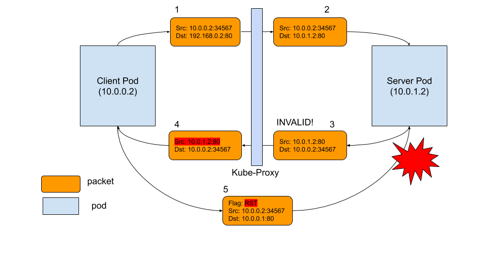

# Out of Window Invalid Packet

## 解决Istio中遇到的间歇性连接重置问题

> [解决Istio中遇到的间歇性连接重置问题](https://maimai.cn/article/detail?fid=1716626083&efid=exAQgZXTj-4Tzk8rKYSjiA)


所以真正的原因是因为iptables没有给进站的数据包做NAT。

Linux内核有一个参数：`ip_conntrack_tcp_be_liberal`，默认是0，也就意味着如果一旦有out of window的数据包，内核默认的行为是将其标志为`INVALID`，iptables无法对`INVALID`的数据包进行NAT。又由于没有任何iptables规则来drop这种数据包，最终它被转发到了应用端，而应用端出于LISTENING状态的socket并不能处理该数据包，这也就导致了客户端的connection reset。

```c
/* Be conservative in what you do, be liberal in what you accept from others. If it's non-zero, we mark only out of window RST segments as INVALID. */

static int nf_ct_tcp_be_liberal __read_mostly = 0;
```


类似的问题之前已经多次出现过，比如kubernetes社区kube-proxy组件的iptables实现，可以参考文章kube-proxy Subtleties: 

- [kube-proxy Subtleties: Debugging an Intermittent Connection Reset](http://kubernetes.io/blog/2019/03/29/kube-proxy-subtleties-debugging-an-intermittent-connection-reset/)

- 以及eBay流量管理之Kubernetes网络硬核排查案例：[eBay流量管理之Kubernetes网络硬核排查案例](http://mp.weixin.qq.com/s/phcaowQWFQf9dzFCqxSCJA)


同社区kube-proxy问题一样，这里我们也同样有两个选项：

1. 让 conntrack 对数据包校验更加宽松，不要将out of window的数据包标记为 INVALID。

对linux来说只需要修改内核参数 echo 1 > /proc/sys/net/ipv4/netfilter/ip_conntrack_tcp_be_liberal。但采用这种做法导致一些顾虑：

- 意味着更多out of window的数据包会被允许进入网络协议栈处理。

- 我们并不清楚linux内核默认值设置为0的原因。

2. 专门添加一条 iptables 规则来丢弃标记为 INVALID 的数据包，这样它就不会到达客户端 Pod。

    需要强调的一点是，Istio中的间歇性连接重传的问题是因为sidecar以及iptables而引入的，sidecar在注入的过程中本身也会创建很多iptables的规则，所以第二个方案看起来更合理。于是我们采用方案2来解决这个问题。


相关的修复已经合并到最新的Istio 1.13:

[http://istio.io/latest/news/releases/1.13.x/announcing-1.13/change-notes/](http://istio.io/latest/news/releases/1.13.x/announcing-1.13/change-notes/)，如果在使用Istio Envoy sidecar的过程中刚好也遇到了connection reset的问题，可以通过配置`meshConfig. defaultConfig.proxyMetadata.INVALID_DROP=true`，尝试开启这个功能。


- [Drop packets in INVALID state to avoid intermittent connection reset from sidecar #36566](https://github.com/istio/istio/pull/36566)

- [Sidecar send unexpected RST packet to ingress gateway, which result in intermittent 503 at client side during upload files. #36489](https://github.com/istio/istio/issues/36489)


## eBay流量管理之Kubernetes网络硬核排查案例

> [eBay流量管理之Kubernetes网络硬核排查案例](http://mp.weixin.qq.com/s/phcaowQWFQf9dzFCqxSCJA)


### 内核选项的介绍

找到**nf_conntrack_proto_tcp.c** 文件，查看函数：

```c
static bool tcp_in_window()
{
      
       …
if (before(seq, sender->td_maxend + 1) &&
        in_recv_win &&
        before(sack, receiver->td_end + 1) &&
        after(sack, receiver->td_end - MAXACKWINDOW(sender) - 1))#检查收到的包的序列号是否在TCP接收窗口之内
{
       …
}
else {#这里就是不正常情况下，报文不在窗口里的处理，如果没有enable nf_conntrack_tcp_be_liberal, 那么res为false， 反之为true
 res = false; 
        if (sender->flags & IP_CT_TCP_FLAG_BE_LIBERAL ||
            tn->tcp_be_liberal)
            res = true;
        if (!res) {
         ...
}
    }
    return res;


}
}
接着看tcp_in_window返回值的处理：
static int tcp_packet() {
 if (!tcp_in_window(ct, &ct->proto.tcp, dir, index,
               skb, dataoff, th)) {
        spin_unlock_bh(&ct->lock);
        return -NF_ACCEPT;
    }
}
#define NF_DROP 0
#define NF_ACCEPT 1
```


如果报文不在窗口里，`tcp_packet()` 会返回 -NF_ACCEPT, 也就是-1。事实上返回0的时候会丢弃这个报文，这个时候也不会有未经NAT的报文到达Envoy Pod，我们的问题也不会出现；如果返回1，报文会正常命中NAT规则，Envoy Pod也不会发Reset。现在返回了-1，报文没有被丢弃，但同时也没有去查询NAT规则，最终导致了我们遇到的问题。


从前面的分析，我们当然可以打开 nf_conntrack_tcp_be_liberal，但为什么报文会出现在窗口之外仍然没有明确的答案。考虑到Tess环境下出现问题的集群CPU分配比较满，同时从抓包来看乱序也比较严重，我们怀疑这和Hyperviser对网络报文的处理能力有比较大的关系，Hyperviser导致某些报文处理不及时，被延迟发送到了Kube-proxy，这个时候重传的报文已经处理过了，这些延迟到达的报文就成了窗口之外的报文。后来负责网络硬件性能的同事打开了`RPS (Receive Packet Steering)`，使性能得到提升，之前遇到的问题就没有再次发生。


## kube-proxy Subtleties: Debugging an Intermittent Connection Reset

> [kube-proxy Subtleties: Debugging an Intermittent Connection Reset](http://kubernetes.io/blog/2019/03/29/kube-proxy-subtleties-debugging-an-intermittent-connection-reset/)





* [Add workaround for spurious retransmits leading to connection resets #1090](https://github.com/moby/libnetwork/issues/1090)

> Here is a summary of what happens:
>
> 1. For some reason, when an AWS EC2 machine connects to itself using its external-facing IP address, there are occasional packets with sequence numbers and timestamps that are far behind the rest.
> 2. Normally these packets would be ignored as spurious retransmits. However, because the packets fall outside the TCP window, Linux's conntrack module marks them invalid, and their destination addresses do not get rewritten by DNAT.
> 3. The packets are eventually interpreted as packets destined to the actual address/port in the IP/TCP headers. Since there is no flow matching these, the host sends a RST.
> 4. The RST terminates the actual NAT'd connection, since its source address and port matches the NAT'd connection.


