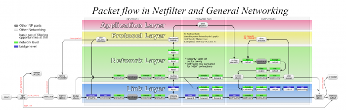
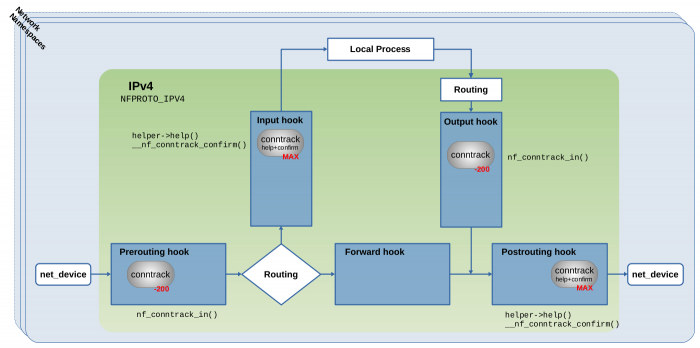
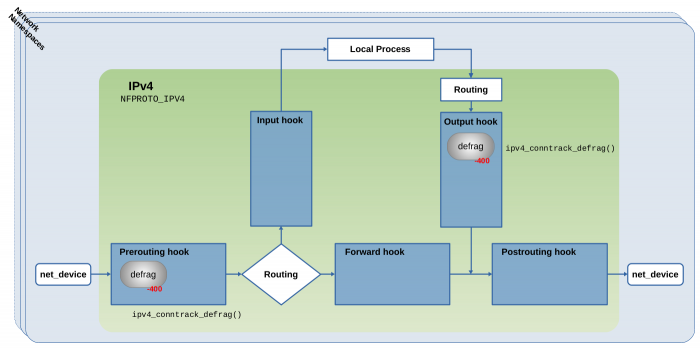
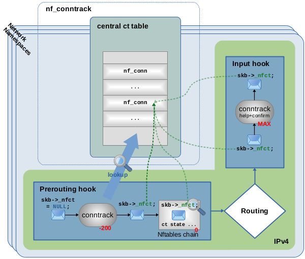
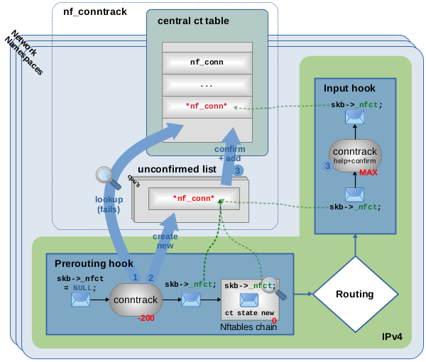
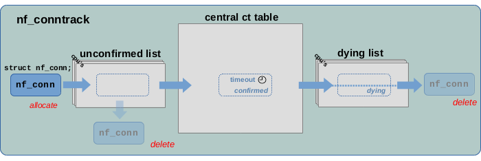

# Connection tracking (conntrack) - Part 1: Modules and Hooks

> from [https://thermalcircle.de/doku.php?id=blog:linux:connection_tracking_1_modules_and_hooks](https://thermalcircle.de/doku.php?id=blog:linux:connection_tracking_1_modules_and_hooks)

With this article series I like to take a closer look at the connection tracking subsystem of the Linux kernel, which provides the basis for features like stateful packet filtering and NAT. I refer to it as the “ct system” throughout the series. It is not my intention to replace or repeat existing documentation. Great articles on the topic already exist, however most of them are a little bit dated; see [References](https://thermalcircle.de/doku.php?id=blog:linux:connection_tracking_1_modules_and_hooks#references) below. I intend to provide an up-to-date view by the time of writing, based on LTS kernel 5.10, and complement existing documentation by taking a deep look under the hood and show how things actually work. In this first article, I give an overview about the ct system's purpose and elaborate on how it relates to other kernel components like Netfilter and Nftables. I explain what happens when network packets traverse its Netfilter hook functions and how it serves as basis for stateful packet filtering.

## Articles of the series

- [Connection tracking (conntrack) - Part 1: Modules and Hooks](https://thermalcircle.de/doku.php?id=blog:linux:connection_tracking_1_modules_and_hooks)
- [Connection tracking (conntrack) - Part 2: Core Implementation](https://thermalcircle.de/doku.php?id=blog:linux:connection_tracking_2_core_implementation)
- [Connection tracking (conntrack) - Part 3: State and Examples](https://thermalcircle.de/doku.php?id=blog:linux:connection_tracking_3_state_and_examples)

## Overview

What is the purpose of connection tracking and what does it do? Once activated, connection tracking (the ct system inside the Linux kernel) examines IPv4 and/or IPv6 network packets and their payload, with the intention to determine which packets are associated with each other, e.g. in the scope of a connection-oriented protocol like TCP. The ct system performs this task as a transparent observer and does not take active part in the communication between endpoints. It is not relevant for the ct system, whether the endpoints of a connection are local or remote. They could be located on remote hosts, in which case the ct system would observe them while running on a host which merely is routing or bridging the packets of a particular connection. Alternatively, one or even both of the endpoints could be local sockets on the very same host where the ct system is running. It makes no difference. The ct system maintains an up-to-date (live) list of all tracked connections. Based on that it “categorizes” network packets while those are traversing the kernel network stack, by supplying each one with a reference (a pointer) to one of its tracked connection instances. As a result, other kernel components can access this connection association and make decisions based on that. The two most prominent candidates which make use of that are the NAT subsystem and the stateful packet filtering / stateful packet inspection (SPI) modules of Iptables and Nftables. The ct system itself does never alter/manipulate packets. It usually also never drops packets, however that can happen in certain rare cases. When inspecting packet content, its main focus is on OSI layers 3 and 4. It is able to track TCP, UDP, ICMP, ICMPv6, SCTP, DCCP and GRE connections. Obviously, the ct system’s definition of a “connection” is not limited to connection-oriented protocols, as several of the protocols just mentioned are not connection-oriented. It e.g. considers and handles an ICMP echo-request plus echo-reply (ping) as a “connection”. The ct system provides several helper/extension components, which extend its tracking abilities into application layer and e.g. track protocols like FTP, TFTP, IRC, PPTP, SIP, … Those are the basis for further use cases like [Application Layer Gateways](https://en.wikipedia.org/wiki/Application_Layer_Gateway).

## Module Auto Loader

Implementation details of kernel components heavily depend on the actual kernel build configuration. What I describe here applies to a kernel configuration on Debian; see section [Context](https://thermalcircle.de/doku.php?id=blog:linux:connection_tracking_1_modules_and_hooks#context) below. The whole infrastructure surrounding and built on top of the Netfilter framework consists of a large number of separate kernel modules with complex dependencies between each other. Many of those modules are being auto loaded on demand when needed. Thus, usually no admin is required to explicitly load them with `modprobe` or `insmod` commands. To make this work, the Netfilter infrastructure uses the kernel module auto loader, which provides the function `request_module()`. When called, it executes a userspace process which runs `modprobe` (`kmod`) to load the requested module including all further modules that module depends on.

## Module nft_ct

The ct system is being loaded on demand in this way whenever required. Several kernel components require connection tracking as basis to operate and can trigger loading of the ct system. One of them is the kernel module `nft_ct`, which is the stateful packet filtering module of Nftables. This module provides so-called *CONNTRACK EXPRESSIONS* in the packet matching part of Nftables rules; see the [man 8 nft](https://www.netfilter.org/projects/nftables/manpage.html) for details. Those expressions always begin with the keyword `ct` and can e.g. be used to match packets based on their relation (`ct state …`) to connections tracked by the ct system. Let's take a look at some examples.

```
nft add rule ip filter forward iif eth0 ct state new drop
nft add rule ip filter forward iif eth0 ct state established accept
```


**Figure 1:** Example, adding Nftables rules with *CONNTRACK EXPRESSIONS* to a fictive *forward* chain[1)](https://thermalcircle.de/doku.php?id=blog:linux:connection_tracking_1_modules_and_hooks#fn__1).


The first Nftables rule matches forwarded IPv4 packets received on interface `eth0` which represent the very first packet of a new tracked connection (`ct state new`), e.g. `TCP` `SYN` packets, and drops those. The second rule matches forwarded IPv4 packets received on interface `eth0` which are part of an already established connection (`ct state established`) and accepts those. The first time you add an Nftables rule which contains a *CONNTRACK EXPRESSION* to your ruleset like that, this triggers auto loading of the Nftables kernel module `nft_ct` in the way described above. Due to the dependencies of this module, which are shown in Figure [2](https://thermalcircle.de/doku.php?id=blog:linux:connection_tracking_1_modules_and_hooks#nft_ct_depends), a whole bunch of modules are now being auto loaded, including the module `nf_conntrack`, which represents the actual ct system, and further modules like `nf_defrag_ipv4` and `nf_defrag_ipv6`.

```
nft_ct                  # Nftables ct expressions and statements
   nf_tables
      nfnetlink
   nf_conntrack         # ct system
      nf_defrag_ipv4    # IPv4 defragmentation
      nf_defrag_ipv6    # IPv6 defragmentation
      libcrc32c
```


**Figure 2:** Dependency tree of kernel module `nft_ct`[2)](https://thermalcircle.de/doku.php?id=blog:linux:connection_tracking_1_modules_and_hooks#fn__2)


Be aware that what I described here merely is one of many ways the ct system can happen to get loaded. As I said, several kernel components make use of the ct system. However, the overall pattern, which involves the auto loader and module dependencies, should be the same in all cases.

## Network namespaces

Being loaded does not necessarily cause all of those modules to immediately become active. This is an important detail to understand. The tasks of the ct system `nf_conntrack` and modules `nf_defrag_ipv4` and `nf_defrag_ipv6`, like many other parts of the kernel network stack, need to be performed independently within each network namespace.

**Quick refresher on network namespaces**

By means of [network namespaces](https://en.wikipedia.org/wiki/Linux_namespaces#Network_(net)) your kernel network stack gets kind of schizophrenic and operates like a completely independent network stack within each network namespace. Each one of them has its own set of network devices, settings and states like IP addresses, routes, neighbor tables, Netfilter hooks, Iptables/Nftables rulesets, … and thereby its own individual network traffic. By default after booting, only the default network namespace, named “init_net”, exists and all networking happens inside this one, but additional network namespaces can be added or removed at any moment during runtime. Network namespaces are e.g. used by container solutions like *Docker* and *LXC* to provide isolated network resources for each container.

The ct system is designed to be active (enabled) only in network namespace(s) where it currently is needed. In our example this means in network namespace(s) where the Nftables ruleset contains at least one rule with a *CONNTRACK EXPRESSION*. Thus, it will automatically be enabled in a certain network namespace, once the first rule of that kind is being added and automatically be disabled in that network namespace, once the last rule of that kind is being deleted. Because each network namespace has its own individual network traffic and thereby its own connections to be tracked, the ct system must be able to clearly distinguish between them. For each network packet it examines and each connection it tracks, it must be clear to which network namespace that one belongs to.

## Netfilter hooks

Like Iptables and Nftables, the ct system is built on top of the Netfilter framework. It implements hook functions to be able to observe network packets and registers those with the Netfilter hooks. If you are not yet very familiar with Netfilter hooks, better first take a look at my other article [Nftables - Packet flow and Netfilter hooks in detail](https://thermalcircle.de/doku.php?id=blog:linux:nftables_packet_flow_netfilter_hooks_detail), before proceeding here. From the bird's eye view, the famous *Netfilter Packet Flow* image shown in Figure [3](https://thermalcircle.de/doku.php?id=blog:linux:connection_tracking_1_modules_and_hooks#nfpackflowofficial) already gives a good hint on what is going on.

[](https://thermalcircle.de/lib/exe/fetch.php?media=linux:netfilter-packet-flow.png)**Figure 3:** Netfilter Packet Flow image, published on [Wikipedia](https://commons.wikimedia.org/wiki/File:Netfilter-packet-flow.svg), [CC BY-SA 3.0](https://creativecommons.org/licenses/by-sa/3.0/deed.en)[3)](https://thermalcircle.de/doku.php?id=blog:linux:connection_tracking_1_modules_and_hooks#fn__3)

The blocks named *conntrack* within that image represent the hook functions of the ct system. While this probably provides a sufficient model one needs to keep in mind when writing Iptables/Nftables rules for stateful packet filtering, the actual implementation is more complex. The very same Netfilter hooks, like *Prerouting*, *Input*, *Forward*, *Output* and *Postrouting*, all exist independently within each network namespace. For this reason, they represent the the actual “on”/“off” switch to enable/disable the ct system individually within a network namespace: The ct system's hook functions are being registered/unregistered only with the hooks of that specific network namespace where the ct system shall be enabled/disabled. Thereby the ct system only “sees” the network packets of network namespaces which it shall see.

## Module nf_conntrack

Let's get back to the example above and take a look at the kernel module of the ct system itself. When the first Nftables rule containing a *CONNTRACK EXPRESSION* is being added to the ruleset of your current network namespace, the Nftables code (indirectly) triggers loading of kernel module `nf_conntrack` as described above, if not already loaded. After that, the Nftables code calls `nf_ct_netns_get()`. This is a function which is exported (=provided) by the just loaded `nf_conntrack` module. When called, it registers the hook functions of the ct system with the Netfilter hooks of the current network namespace. The Nftables rules shown in the example above specify *address family* `ip`. Thus, in that case the ct system registers the four hook functions shown in Figure [4](https://thermalcircle.de/doku.php?id=blog:linux:connection_tracking_1_modules_and_hooks#nfcthooks1) with the IPv4 Netfilter hooks. In case of *address family* `ip6`, the ct system instead would register the same four hook functions with the Netfilter hooks of IPv6. In case of *address family* `inet`, it would register its hook functions with both the IPv4 and the IPv6 Netfilter hooks.

[](https://thermalcircle.de/lib/exe/fetch.php?media=linux:nf-ct-hooks-ipv4.png)**Figure 4:** The four conntrack hook functions registered with Netfilter IPv4 hooks (click to enlarge). See `net/netfilter/nf_conntrack_proto.c`[4)](https://thermalcircle.de/doku.php?id=blog:linux:connection_tracking_1_modules_and_hooks#fn__4). The [Linux netfilter Hacking HOWTO](http://www.netfilter.org/documentation/HOWTO/netfilter-hacking-HOWTO-3.html#ss3.2) also briefly mentions those functions in some ASCII art drawing.

While function `nf_ct_netns_get()` has the purpose to register the hook functions of the ct system, function `nf_ct_netns_put()` has the purpose to unregister them. Both functions internally do reference counting. This means that in the current network namespace, maybe one, maybe several kernel components at some point require connection tracking and thereby call `nf_ct_netns_get()`. However this function only registers the ct hook functions once the first time it is called and on successive calls merely increments a reference counter. If a component at some point does not require connection tracking anymore, it calls `nf_ct_netns_put()`, which decrements the reference counter. If it reaches zero, `nf_ct_netns_put()` unregisters the ct hook functions. In our example this e.g. would happen if you delete all the Nftables rules in your ruleset in the current namespace which contain *CONNTRACK EXPRESSIONS*. This mechanism ensures that the ct system is really only enabled where needed.

### The main ct hook functions

The two hook functions which get registered with priority -200 in the *Prerouting* hook and in the *Output* hook in Figure [4](https://thermalcircle.de/doku.php?id=blog:linux:connection_tracking_1_modules_and_hooks#nfcthooks1) are the very same *conntrack* hook functions shown in the official *Netfilter Packet Flow image* in Figure [3](https://thermalcircle.de/doku.php?id=blog:linux:connection_tracking_1_modules_and_hooks#nfpackflowofficial). Internally, both of them (nearly) do the same thing. Wrapped by some outer functions which do slightly different things, the major function called by both of them is `nf_conntrack_in()`. Thus, the major difference between both merely is their placement… the one in the *Prerouting* hook handles packets received on the network while the one in the *Output* hook handles outgoing packets generated on this host. These two can be considered the “main” hook functions of the ct system, because most of what the ct system does with traversing network packets happens inside them… analyzing and associating packets with tracked connections, then supplying those packets with a reference (pointer) to tracked connection instances… . I'll elaborate in more detail on that in the sections below.

### The help+confirm hook functions

Another two hook functions get registered with MAX priority in the *Input* hook and in the *Postrouting* hook in Figure [4](https://thermalcircle.de/doku.php?id=blog:linux:connection_tracking_1_modules_and_hooks#nfcthooks1). Priority MAX means the highest possible unsigned integer value. A hook function with this priority will be traversed as the very last one within the Netfilter hook and no other hook function can get registered to be traversed after it. Those two hook functions here are not shown in Figure [3](https://thermalcircle.de/doku.php?id=blog:linux:connection_tracking_1_modules_and_hooks#nfpackflowofficial) and can be considered some internal thing which is not worth mentioning on the bird's eye view. They both do the same thing to traversing packets. The only difference between both is their placement in the Netfilter hooks, which makes sure that ALL network packets, no matter if incoming/outgoing/forwarded packets, traverse one of them as the very last thing after having traversed all other hook functions. I refer to them as the *conntrack “help+confirm”* hook functions in this article series, hinting that they got two independent purposes. One is to execute “helper” code, which is an advanced feature which is only used in certain specific use cases and I won't cover that topic in the scope of this first article. The second is to “confirm” new tracked connections; see `__nf_conntrack_confirm()`. I'll elaborate on what that means in the sections below.

Only in recent kernel versions by the time of writing (here kernel v5.10.19) both mentioned features, “helper” and “confirm”, exist combined within the same hook functions. Not too long ago both still existed in form of separate ct hook functions in the *Input* and the *Postrouting* Netfilter hooks: The “helper” hook function with priority 300 and the “confirm” hook function with priority MAX. See e.g. [LTS kernel v4.19](https://elixir.bootlin.com/linux/v4.19.98/source/net/netfilter/nf_conntrack_proto.c#L486). They have been combined in this [git commit](https://git.kernel.org/pub/scm/linux/kernel/git/torvalds/linux.git/commit/?id=827318feb69cb07ed58bb9b9dd6c2eaa81a116ad) during migration from kernel v5.0 to v5.1.

## Modules nf_defrag_ipv4/6

As shown above, module `nf_conntrack` depends on the modules `nf_defrag_ipv4` and `nf_defrag_ipv6`. What is important to know here is, that those take care about re-assembling (=defragment) IPv4 and IPv6 fragments respectively, if those occur. Usually, defragmentation is supposed to happen at the receiving communication endpoint and not along the way through the hops between both endpoints. However, in this case it is necessary. Connection tracking can only do its job, if ALL packets of a connection can be identified and no packet can slip through the fingers of the ct system. The problem with fragments is, that they do not all contain the necessary protocol header information which would be required to identify and associate them with a tracked connection.

[](https://thermalcircle.de/lib/exe/fetch.php?media=linux:nf-defrag-hooks-ipv4.png)**Figure 5:** Defrag hook functions registered with Netfilter IPv4 hooks (click to enlarge).
See `net/ipv4/netfilter/nf_defrag_ipv4.c`[5)](https://thermalcircle.de/doku.php?id=blog:linux:connection_tracking_1_modules_and_hooks#fn__5).

Like the ct system itself, those defrag modules do not become globally active on module load. They export (=provide) functions `nf_defrag_ipv4_enable()` and `nf_defrag_ipv6_enable()` respectively, which register their own hook function with the Netfilter hooks. Figure [5](https://thermalcircle.de/doku.php?id=blog:linux:connection_tracking_1_modules_and_hooks#nfdefraghooks1) shows this for module `nf_defrag_ipv4` and the IPv4 Netfilter hooks: Internally this module provides function `ipv4_conntrack_defrag()` to handle defragmentation of traversing network packets. This function is being registered as a hook function with the Netfilter *Prerouting* hook and also with the Netfilter *Output* hook. In both those places it is being registered with priority -400, which ensures that packets traverse it BEFORE traversing the *conntrack* hook functions, which are registered with priority -200. The ct system's function `nf_ct_netns_get()` mentioned in the section above does call `nf_defrag_ipv4_enable()` and/or its IPv6 counterpart respectively, before registering the ct system's hook functions. Thus, the *defrag* hook functions get registered together with the *conntrack* hook functions. However, no reference counting is implemented here, which means, once this hook function is registered, it stays registered (until someone explicitly removes/unloads the kernel module).

## Hooks Summary

Figure [6](https://thermalcircle.de/doku.php?id=blog:linux:connection_tracking_1_modules_and_hooks#nfhooks-complete1) summarizes things by showing the mentioned *conntrack* and *defrag* hook functions together with the well known packet filtering chains of Iptables. For completeness I also show the priority values here. This should provide for a comfortable comparison to what you see in the official *Netfilter Packet Flow image* in Figure [3](https://thermalcircle.de/doku.php?id=blog:linux:connection_tracking_1_modules_and_hooks#nfpackflowofficial).

[](https://thermalcircle.de/lib/exe/fetch.php?media=linux:nf-ct-iptables-hooks-ipv4.png)

> **Figure 6:** *Conntrack*+*Defrag* hook functions, *Iptables* chains registered with IPv4 Netfilter hooks
> (click to enlarge)

Of course when I created that image, I faced the same dilemma(困境) as the makers of the official image: When using Nftables (and I assume most people nowadays do) you can create and name your tables and base chains freely to your liking. But this would not leave much to show for by default in an image like that. Thus, showing the old but well known Iptables chains still seemed like the most pragmatic thing to do. The important thing which Figure [6](https://thermalcircle.de/doku.php?id=blog:linux:connection_tracking_1_modules_and_hooks#nfhooks-complete1) shows is, that regarding traversal of the *defrag* and *conntrack* hook functions, the same thing happens for all kinds of packets, no matter if those are to be received by a local socket, if those are generated by a local socket and sent out on the network or if those merely are forwarded (routed) packets: They all first traverse one of the *defrag* hook functions, either the one in the *Prerouting* or the *Output* hook. This ensures that these function(s) can defragment potential fragments before the ct system is able to see them. After that, the packets traverse a potential Iptables chain of the raw table (if existing / in use) and then one of the main *conntrack* hook functions (the ones with priority -200). Other Iptables chains, like the ones with priority 0 which are commonly used for packet filtering, are traversed after that. Then, as the very last thing the packets traverse one of the *conntrack “help+confirm”* hook functions.

## How it works...

I know… so far I kept beating around the bush. Now let's finally talk about how the ct system actually operates and what it does to network packets traversing its hook functions. Please be aware that what I describe in this section are the basics and does not cover all what the ct system actually does. The ct system maintains the connections which it is tracking in a central table. Each tracked connection is represented by an instance of `struct nf_conn`. That structure contains all necessary details the ct system learns about the connection over time while tracking it. From the ct system's point of view, every network packet which traverses one of its main hook functions (those with priority -200) is one of four possible things:

1. It is either is part of or related to one of its tracked connections.
2. It is the first packet of a new connection which is not yet tracked.
3. It is an invalid packet, which is broken or doesn't fit in somehow.
4. It is marked as NOTRACK, which tells the ct system to ignore it.

Let's take a look at each one of those possibilities for an incoming network packet. I mean a packet received on a network interface which traverses the Netfilter *Prerouting* and *Input* hooks and then is received by a local socket. As pointed out in the previous section, what the ct system does here also applies to outgoing or forwarded network packets as well. Thus, no need for additional examples for those kinds of packets.



>  **Figure 7:** Network packet traversing ct main hook function (priority -200) in *Prerouting* hook, lookup in central ct table finds that packet belongs to already tracked connection, packet is given pointer to that connection.

Figure [7](https://thermalcircle.de/doku.php?id=blog:linux:connection_tracking_1_modules_and_hooks#nfct-lookup) shows an example of the first possibility, an incoming packet being part of an already tracked connection. When that packet traverses the main *conntrack* hook function (the one with priority -200), the ct system first performs some initial validity checks on it. If the packet passes those, the ct system then does a lookup into its central table to find the potentially matching connection. <mark>In this case, a match is found and the packet is provided with a pointer to the matching tracked connection instance. For this purpose, the `skb`[6)](https://thermalcircle.de/doku.php?id=blog:linux:connection_tracking_1_modules_and_hooks#fn__6) of each packet possesses member variable `_nfct`[7)](https://thermalcircle.de/doku.php?id=blog:linux:connection_tracking_1_modules_and_hooks#fn__7). This means, the network packet thereby is kind-of being “marked” or “categorized” by the ct system</mark>. Further, the OSI layer 4 protocol of the packet is now being analyzed and latest protocol state and details are saved to its tracked connection instance. Then the packet continues on its way through other hook functions and the network stack. Other kernel components, like Nftables with *CONNTRACK EXPRESSION* rules, can now without further ct table lookup obtain connection information about the packet, by simply dereferencing the `skb->_nfct` pointer. This is shown in Figure [7](https://thermalcircle.de/doku.php?id=blog:linux:connection_tracking_1_modules_and_hooks#nfct-lookup) in form of an example Nftables chain with priority 0 in the *Prerouting* hook. If you would place a rule with expression `ct state established` in that chain, that rule would match. The very last thing that packet traverses before being received by a local socket is the *conntrack “help+confirm”* hook function in the *Input* hook. Nothing happens to the packet here. That hook function is targeted at other cases.



> **Figure 8:** Packet traversing ct main hook function (priority -200), lookup in central ct table finds no match, packet is considered first one of new connection, new connection is created and packet is given pointer to it, new connection is later “confirmed” and added to ct table in “help+confirm” hook function (priority MAX).

Figure [8](https://thermalcircle.de/doku.php?id=blog:linux:connection_tracking_1_modules_and_hooks#nfct-new) shows an example of the second possibility, an incoming packet being the first one representing a new connection which is not yet tracked by the ct system. When that packet traverses the main *conntrack* hook function (the one with priority -200), let's assume that it passes the already mentioned validity checks. However, in this case the lookup in the ct table

1. does not find a matching connection. As a result, the ct system considers the packet to be the first one of a new connection. A new instance of `struct nf_conn` is created 

2. and member `skb->_nfct` of the packet is initialized to point to that instance. The ct system considers the new connection as “unconfirmed” at this point. Thus, the new connection instance is not yet being added to the central table. It is temporarily parked on the so-called *unconfirmed list*. Further, the OSI layer 4 protocol of the packet is now being analyzed and protocol state and details are saved to its tracked connection instance. Then the packet continues on its way through other hook functions and the network stack. Figure [8](https://thermalcircle.de/doku.php?id=blog:linux:connection_tracking_1_modules_and_hooks#nfct-new) also shows an example Nftables chain with priority 0 in the *Prerouting* hook. If you would place a rule with expression `ct state new` in that chain, it would match. The very last thing that packet traverses before being received by a local socket is the *conntrack “help+confirm”* hook function in the *Input* hook. It is the job of that function to “confirm” new connections, which means setting a status bit accordingly and moving the connection instance from the *unconfirmed list* to the actual ct table 

3. The idea behind this behavior is, that a packet like this might get dropped somewhere on the way between the main conntrack hook function and the *conntrack “help+confirm”* hook function, e.g. by an Nftables rule, by the routing system, or by who ever… The idea is to prevent “unconfirmed” new connections from cluttering up the central ct table or consuming an unnecessary high amount of CPU power. A very common scenario would e.g. be that an Nftables rule like `iif eth0 ct state new drop` exists to prevent new connections coming in on interface `eth0`. Naturally, connection attempts matching to that should get dropped while consuming as little CPU power as possible and should not show up in the ct table at all. In that case, the very first packet of connections like that would get dropped within the Nftables chain and never reach the *conntrack “help+confirm”* hook function. Thus, the new connection instance would never get confirmed and die an untimely death while still being on the *unconfirmed list*. In other words, it would get deleted together with the dropped network packet. This especially makes sense when you think about someone doing a port scan or a TCP SYN flooding attack. But even if a client, who is trying to establish e.g. a TCP connection by sending a TCP SYN packet, is behaving normally, it would still send out several TCP SYN packets as retransmissions if it does not receive any reply from the peer side. Thus, if you have a `ct state new drop` rule in place, this mechanism ensures, that the ct system intentionally does not remember this (denied!) connection and thereby treats all succeeding TCP SYN packets (retransmissions) again as new packets and those then will be dropped by the same `ct state new drop` rule.

The third possibility is, that the ct system considers a packet as *invalid*. This e.g. happens, when a packet does not pass the mentioned initial validity checks of the main conntrack hook function in the *Prerouting* hook in Figure [7](https://thermalcircle.de/doku.php?id=blog:linux:connection_tracking_1_modules_and_hooks#nfct-lookup) or [8](https://thermalcircle.de/doku.php?id=blog:linux:connection_tracking_1_modules_and_hooks#nfct-new), e.g. because of a broken or incomplete protocol header which cannot not be parsed. This further can happen when a packet fails the detailed analysis of its OSI layer 4 protocol. E.g. in case of TCP the ct system observes receive window and sequence numbers and a packet which does not match regarding its sequence numbers would be considered *invalid*. However, it is not the job of the ct system to drop invalid packets[8)](https://thermalcircle.de/doku.php?id=blog:linux:connection_tracking_1_modules_and_hooks#fn__8). The ct system leaves that decision to other parts of the kernel network stack. If it considers a packet as *invalid*, the ct system simply leaves `skb->_nfct=NULL`. If you would place an Nftables rule with expression `ct state invalid` in the example chain in Figure [7](https://thermalcircle.de/doku.php?id=blog:linux:connection_tracking_1_modules_and_hooks#nfct-lookup) or [8](https://thermalcircle.de/doku.php?id=blog:linux:connection_tracking_1_modules_and_hooks#nfct-new), then that rule would match.

The fourth possibility is a means for other kernel components like Nftables to mark packets with a “do not track” bit[9)](https://thermalcircle.de/doku.php?id=blog:linux:connection_tracking_1_modules_and_hooks#fn__9) which tells the ct system to ignore them. For this to work with Nftables, you would need to create a chain with a priority smaller than -200 (e.g. -300), which ensures it is traversed before the main ct hook function and place a rule with a `notrack` statement in that chain; see [Nftables wiki](https://wiki.nftables.org/wiki-nftables/index.php/Setting_packet_connection_tracking_metainformation). If you then would place an Nftables rule with expression `ct state untracked` in the example chain in Figure [7](https://thermalcircle.de/doku.php?id=blog:linux:connection_tracking_1_modules_and_hooks#nfct-lookup) or [8](https://thermalcircle.de/doku.php?id=blog:linux:connection_tracking_1_modules_and_hooks#nfct-new), that rule would match. This is kind-of a corner case topic and I won't go into further details within the scope of this article.

## Connection life cycle



> **Figure 9:** Life cycle of a tracked connection instance

Figure [9](https://thermalcircle.de/doku.php?id=blog:linux:connection_tracking_1_modules_and_hooks#nf_conn_lifecycle) summarizes the usual life cycle of a tracked connection from its creation to its deletion. After being allocated and initialized as described in the sections above, a new connection is first added to the *unconfirmed list*. <mark>If the network packet which triggered its creation is dropped before reaching the ct system's *help+confirm* hook function, then that connection is removed from the list and deleted</mark>. If the packet however passes the *help+confirm* hook function, then the connection is moved to the `central ct table` and is marked as “`confirmed`”. There it stays until this connection is considered to be “expired”. This is handled via timeouts. In simple words… if no further network packet arrives for a tracked connection for a certain amount of time, then that connection will be considered “expired”. The actual timeout value defining that amount of time strongly depends on network protocol, state and traffic behavior of that connection. Once “expired”, the connection is moved to the *dying list* and it is marked as “dying”. After that it is finally being deleted.

You can observe the timeouts, when using the *conntrack* userspace tool to list all currently tracked connections[10)](https://thermalcircle.de/doku.php?id=blog:linux:connection_tracking_1_modules_and_hooks#fn__10). The 3rd column of each row of output shows the current amount of seconds until that connection will expire. This behaves like a countdown (431998 seconds in the example below):

```
conntrack -L
tcp      6 431998 ESTABLISHED src=192.168.2.100 ...
...
```

It further is worth mentioning, that while **only one central ct table exists for the whole system**, an individual *`unconfirmed list`* and *`dying list`* instance exist for each network namespace and each CPU core.


## Context

The described behavior and implementation has been observed on a v5.10.19 kernel in a Debian 10 *buster* system with using Debian *backports* on *amd64* architecture, using kernel build configuration from Debian. Thus, the description of the connection tracking implementation in this article, especially regarding kernel modules like `nf_conntrack` and them being autoloaded, should be accurate for a lot of systems out there. Of course, if you build your kernel with a different configuration, e.g. with `nf_conntrack` being built into the kernel, then things obviously are different.

## References

- [Linux netfilter Hacking HOWTO (Rusty Russell and Harald Welte, 2002)](http://www.netfilter.org/documentation/HOWTO/netfilter-hacking-HOWTO.html)
- [Netfilter’s connection tracking system (Pablo Neira Ayuso, 2006)](http://people.netfilter.org/pablo/docs/login.pdf)
- [Iptables tutorial 1.2.2: Chapter 7. The state machine (Oskar Andreasson, 2006)](https://www.frozentux.net/iptables-tutorial/iptables-tutorial.html#STATEMACHINE)
- [Netfilter Connection Tracking and NAT Implementation (Magnus Boye, 2012)](https://wiki.aalto.fi/download/attachments/70789072/netfilter-paper-final.pdf)
- [Connection Tracking: Design and Implementation Inside Linux Kernel (Arthur Chiao, 2020)](http://arthurchiao.art/blog/conntrack-design-and-implementation/)

## Continue with next article

[Connection tracking (conntrack) - Part 2: Core Implementation](https://thermalcircle.de/doku.php?id=blog:linux:connection_tracking_2_core_implementation)

*published 2021-04-04*, *last modified 2022-08-07*

[1)](https://thermalcircle.de/doku.php?id=blog:linux:connection_tracking_1_modules_and_hooks#fnt__1) 

Obviously you first would have to create that chain and a table …

```
nft add table ip filter
nft add chain ip filter forward { type filter hook forward priority filter \; }
```

I intentionally do not focus on that here, because adding those two rules in that combination does not make much sense. It just serves my purpose here to explain *CONNTRACK EXPRESSIONS*.

[2)](https://thermalcircle.de/doku.php?id=blog:linux:connection_tracking_1_modules_and_hooks#fnt__2) 

You can check file `modules.dep` to see dependencies of `nft_ct`:

```
grep '^kernel/net/netfilter/nft_ct.ko' /lib/modules/`uname -r`/modules.dep
```


