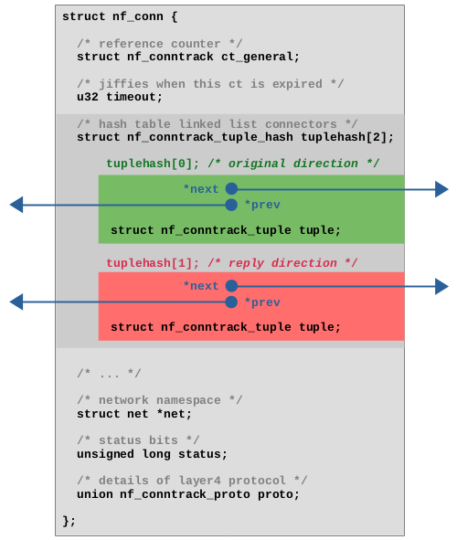
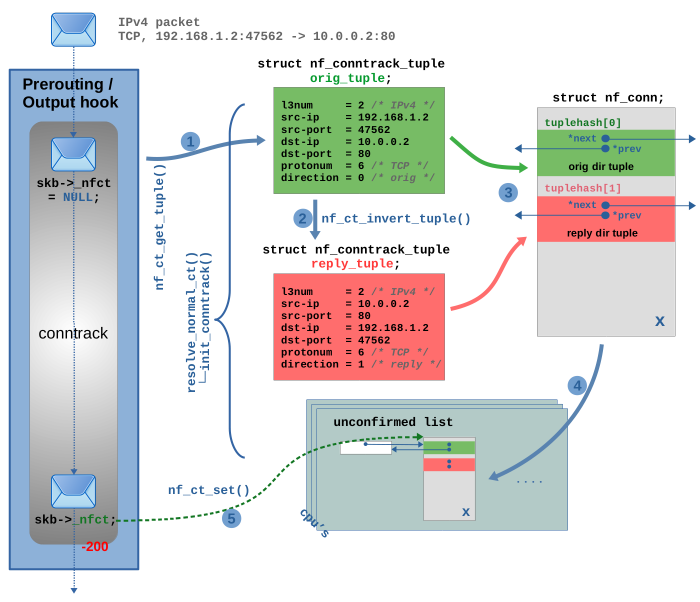

# Connection tracking (conntrack) - Part 2: Core Implementation

> [https://thermalcircle.de/doku.php?id=blog:linux:connection_tracking_2_core_implementation](https://thermalcircle.de/doku.php?id=blog:linux:connection_tracking_2_core_implementation)

With this article series I like to take a closer look at the connection tracking subsystem of the Linux kernel, which provides the basis for features like stateful packet filtering and NAT. I refer to it as the “ct system” throughout the series. In this second article, I take a deep look under the hood and dive into its core implementation. I revisit some of the topics of the first article, but this time on source code level. I give an overview of the most important data structures and explain how handling of the connection tracking table, connection lookup and connection life cycle works.

## Articles of the series

- [Connection tracking (conntrack) - Part 1: Modules and Hooks](https://thermalcircle.de/doku.php?id=blog:linux:connection_tracking_1_modules_and_hooks)
- [Connection tracking (conntrack) - Part 2: Core Implementation](https://thermalcircle.de/doku.php?id=blog:linux:connection_tracking_2_core_implementation)
- [Connection tracking (conntrack) - Part 3: State and Examples](https://thermalcircle.de/doku.php?id=blog:linux:connection_tracking_3_state_and_examples)

## The ct table

The ct system maintains the connections which it is tracking in a central table. A very time efficient lookup into that table is essential, because it needs to be performed for nearly every network packet which comes along. Thus, it is implemented as a *hash table*.

**Quick refresher on Hash Tables**

A [hash table](https://en.wikipedia.org/wiki/Hash_table) is by definition an *associative array*, a data structure which maps *keys* to *values*. It is useful in cases where the *keys* themselves are too complex to simply directly be used as integer indices in an array, because the theoretical total number of all possible keys would be too huge. These *keys* could e.g. be text strings specifying the name of a person and the *values* could be address- or customer-records of that person. Thus, when doing a lookup for a *value* based on a *key*, the approach is to calculate a simple *hash* from the *key*, whose range of possible values is small enough so that it can be used as index in an array (e.g. a hash size of 8bit which results in an array size of 2^8=256 entries). The advantage here is that *hash* calculation as well as index lookup in the array can both be performed in a constant amount of time, which means algorithmic complexity O(1). The obvious disadvantage is, that due to the limited number range of the hash, collisions are unavoidable (different *keys* having the same *hash*). Thus, each entry in the array of the hash table (each “bucket”) does not just contain a single *value*, but instead a doubly linked list of all *values* which match (“collide”) to this *hash*. This means, that algorithmic complexity of the lookup is at best O(1) and at worst O(n): After the *hash* calculation and array index, the doubly linked list of that *bucket* needs to be traversed to find the correct *value* for the *key* in question. This further implies, that the *key* needs to be saved inside (as part of) the *value* itself, because this is the only means a comparison can be done to find it.

Obviously three relevant actions can be performed with this table: A lookup can be performed on the table to find an existing tracked connection corresponding to a network packet. A new connection instance can be added to the table. And a connection can be removed from the table, e.g. when the connection “expires”. The ct system maintains an individual timer/timeout for each connection to let it “age” and “expire”, which results in its removal and deletion sooner or later, depending on the situation. It is interesting to note, that the ct table actually is a central table, which means only one table exists for the whole system and not one table per network namespace. To avoid hash collisions for similar traffic in different network namespaces, a namespace-specific seed `hash_mix`[1)](https://thermalcircle.de/doku.php?id=blog:linux:connection_tracking_2_core_implementation#fn__1) is used during hash calculation. To further ensure reliable distinction, each tracked connection instance possesses a reference to the network namespace it belongs to. That reference is additionally being checked on connection lookup.

## Hash table keys: tuples

In case of the ct system, the *keys* for the hash table need to be something that can be easily extracted from the layer 3 and 4 protocol headers of a network packet and which clearly indicates to which connection that packet belongs to. The ct system calls those *keys* “tuples” and implements them in form of the data type `struct nf_conntrack_tuple`. Function `nf_ct_get_tuple()` is used to extract the required data from the protocol headers of a network packet and then fill the member variables of an instance of that data type with values. Figure [1](https://thermalcircle.de/doku.php?id=blog:linux:connection_tracking_2_core_implementation#nftuple1) shows this based on an example TCP packet.

**Figure 1:** A *tuple* is being created from an example TCP packet

In case of TCP, a *tuple* roughly spoken contains the source and destination IP addresses plus the TCP source and destination ports which together represent both endpoints of the connection. The data type `struct nf_conntrack_tuple` is flexible enough to hold extracted protocol header data of several different layer 3 and 4 protocols. Some of its members are implemented as `union` types which are able to contain different things depending on the protocols. Semantically the data type contains the following items:

- OSI Layer 3
  - Protocol number: 2 (IPv4) or 10 (IPv6)
  - Source IP address
  - Destination IP address
- OSI Layer 4
  - Protocol number: 1 (ICMP)[2)](https://thermalcircle.de/doku.php?id=blog:linux:connection_tracking_2_core_implementation#fn__2)/ 6 (TCP)/ 17 (UDP)/ 58 (ICMPv6)/ 47 (GRE)/ 132 (SCTP)/ 33 (DCCP)
  - Protocol-specific data
    - TCP/UDP: source port and destination port
    - ICMP: type, code and identifier
    - …
- Direction: 0 (orig) / 1 (reply)

## Hash table values: struct nf_conn

Let's take a look at the *values* in the hash table, the tracked connections, which are implemented as instances of `struct nf_conn`. That structure is a little more complex, possesses quite a list of member variables and can even be extended dynamically during runtime, depending on the layer 4 protocol and depending on several possible extensions. Figure [2](https://thermalcircle.de/doku.php?id=blog:linux:connection_tracking_2_core_implementation#nfconn1) shows a simplified view of the structure with the member variables, which I consider most relevant regarding the scope of this article. As you can see, it contains a reference counter, a timeout to handle expiration, a reference to the network namespace to which that connection belongs to, an integer for status bits of that connection and layer 4 protocol-specific data. In case of TCP the latter e.g. contains things like tracked TCP sequence numbers and so on.

**Figure 2:** Simplified view of `struct nf_conn` with most relevant member variables.

A very interesting member is the `tuplehash[2]` array, which is the means by which instances of `struct nf_conn` are being integrated into the hash table. As mentioned, it is necessary in hash tables to save the *key* (here, the *tuple* `struct nf_conntrack_tuple`) as part of the *value* (here, `struct nf_conn`), because the lookup in the hash table will only work by comparing *keys*, if the hash has collisions. However, in case of the ct system, there is one more bit of complexity to add here: It must be possible to do the lookup of a tracked connection in the hash table for network packets which flow in the original data flow direction and also for packets which flow in the reply direction. Both will result in different *tuples* and different *hashes*, but a lookup must still find the same instance of `struct nf_conn` in the end. For this reason, `tuplehash` is an array with two elements. Both elements each contain a *tuple* and pointers[3)](https://thermalcircle.de/doku.php?id=blog:linux:connection_tracking_2_core_implementation#fn__3) to connect this element to the linked list of a “bucket” of the hash table. The first element, shown in green color in Figure [2](https://thermalcircle.de/doku.php?id=blog:linux:connection_tracking_2_core_implementation#nfconn1), represents the original direction. The member `direction` of its *tuple* is set to 0 (orig). The second element, shown in red color in Figure [2](https://thermalcircle.de/doku.php?id=blog:linux:connection_tracking_2_core_implementation#nfconn1), represents the reply direction. The member `direction` of its *tuple* is set to 1 (reply). Of course only one instance of `struct nf_conn` exists for each tracked connection, but that instance is being added twice to the hash table, once for the original direction and once for the reply direction, to make lookups for both kind of packets possible. I'll describe that in detail below.

## Lookup existing connection

Let's walk through the connection lookup in detail. In Figure [3](https://thermalcircle.de/doku.php?id=blog:linux:connection_tracking_2_core_implementation#nfctlookup1) a TCP packet is traversing the ct hook function in the Netfilter *Prerouting* hook[4)](https://thermalcircle.de/doku.php?id=blog:linux:connection_tracking_2_core_implementation#fn__4). Most of the interesting part of that hook function is done in function `nf_conntrack_in()`. Among other functions, it calls `resolve_normal_ct()` and this is where the lookup happens. Figure [3](https://thermalcircle.de/doku.php?id=blog:linux:connection_tracking_2_core_implementation#nfctlookup1) shows that in detail. In this example I assume that the connection the TCP packet belongs to is already known and tracked by the ct system at this point. In other words, I assume that this is not the first packet of that connection which the ct system is seeing.

**Figure 3:** Lookup of tracked connection in detail

In step (1) function `nf_ct_get_tuple()` is called to create a *tuple*, the *key* to the hash table, from the TCP packet (same thing as already shown in Figure [1](https://thermalcircle.de/doku.php?id=blog:linux:connection_tracking_2_core_implementation#nftuple1)). Member `direction` of the *tuple* is always set to 0 (orig) in this case. It has no real meaning here, because at this point it is yet unknown to the ct system, whether the TCP packet is part of the original or the reply direction of a tracked connection. In step (2) function `hash_conntrack_raw()` is called to calculate the hash value from the member variable values of the *tuple*. Member `direction` is not included in the hash calculation, as the dotted rectangle in Figure [3](https://thermalcircle.de/doku.php?id=blog:linux:connection_tracking_2_core_implementation#nfctlookup1) indicates, for the reason just explained. However, the mentioned seed `hash_mix` of the network namespace is additionally included. Now the actual lookup in the hash table is performed by function `__nf_conntrack_find_get()` in steps (3), (4) and (5): The hash value is used as index in the array of the hash table in step (3) to locate the correct bucket, as shown in orange color in Figure [3](https://thermalcircle.de/doku.php?id=blog:linux:connection_tracking_2_core_implementation#nfctlookup1). In this example that bucket already contains three instances of `struct nf_conn`. In other words, three tracked connections here already collide for this hash. In step (4) the code now iterates through the linked list of this bucket and compares the *tuple* inside the member `tuplehash[]` of each connection instance with the *tuple* which has been generated from the TCP packet in step (1). A connection is considered a match, if all member variables of the *tuple* match (except member `direction`, which is ignored here again) and further, the network namespace matches. A match is found in step (5). I marked the matching instance with an *X* in Figure [3](https://thermalcircle.de/doku.php?id=blog:linux:connection_tracking_2_core_implementation#nfctlookup1) to show that it exists in two different places within the hash table. In one place it is connected to the bucket linked list with the pointers of its `tuplehash[0]` member (*original* direction, shown in green color) and in another place it is connected with the pointers of its `tuplehash[1]` member (*reply* direction, shown in red color). As you can see, it is `tuplehash[0]` (green) which matches in step (5). This means the TCP packet in question is part of the *original* direction of this tracked connection. In step (6) function `nf_ct_set()` is called to initialize `skb->_nfct` of the network packet to point to the just found matching instance of `struct nf_conn`[5)](https://thermalcircle.de/doku.php?id=blog:linux:connection_tracking_2_core_implementation#fn__5). Finally now the OSI layer 4 protocol of the packet (in our example TCP) is being examined[6)](https://thermalcircle.de/doku.php?id=blog:linux:connection_tracking_2_core_implementation#fn__6), before the packet finishes traversing the ct hook function.

## Adding a new connection

But what happens if the lookup described above does not produce a match? In that case the TCP packet will considered to be the very first packet of a new connection which is not yet being tracked by the ct system. Function `resolve_normal_ct()` will call `init_conntrack()` to create a new instance of a tracked connection. Figure [4](https://thermalcircle.de/doku.php?id=blog:linux:connection_tracking_2_core_implementation#nfctadd1) shows how this works.

**Figure 4:** Creating a new connection instance

At first, two *tuples* are created to cover both data flow directions. The first one, named `orig_tuple` and shown in green color in Figure [4](https://thermalcircle.de/doku.php?id=blog:linux:connection_tracking_2_core_implementation#nfctadd1), actually is the one which has already been created by function `nf_ct_get_tuple()` during the connection lookup described above in step (1) of Figure [3](https://thermalcircle.de/doku.php?id=blog:linux:connection_tracking_2_core_implementation#nfctlookup1). It is simply being re-used here. I just show this here again as step (1) of Figure [4](https://thermalcircle.de/doku.php?id=blog:linux:connection_tracking_2_core_implementation#nfctadd1) to visualize all the relevant data in one place. The `orig_tuple` represents the *original* data flow direction and its member `direction` is set to 0 (orig). This is by definition always the data flow direction of the very first packet of that connection which is seen by the ct system, in this case `192.168.1.2:47562 -> 10.0.0.2:80`. In step (2) function `nf_ct_invert_tuple()` is called. It creates a second *tuple*, the `reply_tuple`, shown in red color in Figure [4](https://thermalcircle.de/doku.php?id=blog:linux:connection_tracking_2_core_implementation#nfctadd1). This one represents the *reply* data flow direction, `10.0.0.2:80 -> 192.168.1.2:47562` in this case. Its member `direction` is set to 1 (reply). Function `nf_ct_invert_tuple()` does not create it based on the TCP packet. It uses `orig_tuple` as input parameter. This action would even work both ways. You could always use `nf_ct_invert_tuple()` to create a *tuple* of the opposite data flow direction based on an existing *tuple*. In this example, what it does is quite simple, because we are using TCP. Function `nf_ct_invert_tuple()` here simply flips source and destination IP addresses and source and destination TCP ports. However, this function is quite intelligent and in case of other protocols it does other things. E.g. in case of ICMP, if the `orig_tuple` would describe an ICMP echo-request (type=8, code=0, id=42), then the inverted `reply_tuple` would describe and echo-reply (type=0, code=0, id=42). In step (3) a new instance of `struct nf_conn` is allocated and its members are initialized. The two *tuples* both become part of it. They are inserted in the `tuplehash` array. Several more things happen here… expectation check, extensions… I won't go into all the details. This new instance of a tracked connection is still considered “unconfirmed” at this point and thus in step (4) it is being added to the so-called *unconfirmed list*. That is a linked list which exists per network namespace and per CPU core. Step (5) is the exact same thing as step (6) in Figure [3](https://thermalcircle.de/doku.php?id=blog:linux:connection_tracking_2_core_implementation#nfctlookup1) during the lookup, initializing `skb->_nfct` of the network packet to point to the new connection instance. Finally now the OSI layer 4 protocol of the packet (in our example TCP) is being examined[7)](https://thermalcircle.de/doku.php?id=blog:linux:connection_tracking_2_core_implementation#fn__7), before the packet finishes traversing the ct hook function. In this example here I assume that the network packet is not being dropped while it continues on its way through the kernel network stack and through one or more potential Nftables chains and rules. Finally, the packet traverses one of the *conntrack “help+confirm”* functions (the ones with priority MAX). Inside it, the new connection will get “confirmed” and be added to the actual ct hash table. This is shown in detail in Figure [5](https://thermalcircle.de/doku.php?id=blog:linux:connection_tracking_2_core_implementation#nfctadd2).

**Figure 5:** Confirming the new connection instance and adding it to the ct hash table

The interesting part of the code is located in function `__nf_conntrack_confirm()`. This code is only executed if the tracked connection belonging to this network packet (our example TCP packet) is yet “unconfirmed”. This is determined by checking the `IPS_CONFIRMED_BIT` bit in the `status` member of `struct nf_conn`, which is 0 at this point. In step (1) both hashes are calculated, one from the `orig_tuple` and another from the `reply_tuple` within the `struct nf_conn` instance[8)](https://thermalcircle.de/doku.php?id=blog:linux:connection_tracking_2_core_implementation#fn__8). Then in step (2) the instance of `struct nf_conn` is being removed from the *unconfirmed list*. In step (3) the `IPS_CONFIRMED_BIT` is set to 1 in the `status` member, “confirming” it. Finally in step (4) the instance is being added to the ct table. The hashes are used as array indices to locate the correct buckets. Then the `struct nf_conn` instance is added to the linked lists of both buckets, one time with its `tuplehash[0]` for the *orig* direction and another time with its `tuplehash[1]` for the *reply* direction.

## Removing a connection

Removing a connection instance from the ct table obviously means removing it from the linked lists of both buckets where it resides within the table. This is done in function `clean_from_lists()`. However, this does not yet delete that particular connection instance. There is more to say about deletion. I'll get to that below.

## Connection life cycle, reference counting

**Figure 6:** Life cycle[9)](https://thermalcircle.de/doku.php?id=blog:linux:connection_tracking_2_core_implementation#fn__9) of a tracked connection instance

In the following sections I will take a more detailed look at the life cycle of tracked connections, which I already explained shortly in the previous article; see Figure [6](https://thermalcircle.de/doku.php?id=blog:linux:connection_tracking_2_core_implementation#nf_conn_lifecycle). Internally, that life cycle is being handled via reference counting. Each instance of `struct nf_conn` possesses its own reference counter `struct nf_conntrack ct_general` (see Figure [2](https://thermalcircle.de/doku.php?id=blog:linux:connection_tracking_2_core_implementation#nfconn1)). That structure contains an `atomic_t` integer named `use`. When a `struct nf_conn` instance is being added to the ct table, `use` is incremented by 1 and decremented by 1 when the instance is being removed from the table. For every network packet, which references to an instance of `struct nf_conn` with its member `skb->_nfct`, `use` is incremented by 1 and decremented by 1 when the `skb` is being released[10)](https://thermalcircle.de/doku.php?id=blog:linux:connection_tracking_2_core_implementation#fn__10). The ct system's API provides functions for incrementing/decrementing `use`. Function `nf_conntrack_get()` increments it and function `nf_conntrack_put()` decrements it. The declaration of `struct nf_conn` [contains a comment](https://elixir.bootlin.com/linux/v5.10.19/source/include/net/netfilter/nf_conntrack.h#L59) which states that reference counting behavior and if you review the code carefully, you'll be able to confirm it. However, a little warning ahead… the overall code handling the `struct_nf_conn` reference counting is a little hard to read, because those two functions are not being used everywhere. In some places the integer `use` is instead being modified by other functions[11)](https://thermalcircle.de/doku.php?id=blog:linux:connection_tracking_2_core_implementation#fn__11).

## Connection deletion

When function `nf_conntrack_put()` decrements the reference counter `use` to zero, then it calls `nf_conntrack_destroy()`, which deletes the instance of `struct nf_conn`. It does that by means of a whole bunch of sub functions. Those call `nf_ct_del_from_dying_or_unconfirmed_list()`, which does exactly what its name suggests, and then call `nf_conntrack_free()`, which does the actual deletion or “de-allocation”. In other words, the code assumes that `struct nf_conn` instance is currently either on the *unconfirmed list* or on the *dying list* by the time the reference counter `use` is decremented to zero. If you look at Figure [6](https://thermalcircle.de/doku.php?id=blog:linux:connection_tracking_2_core_implementation#nf_conn_lifecycle), then you see that those actually are the only two situations when deletion is supposed to occur: When a connection instance is on the *unconfirmed list*, deletion can occur if the network packet which triggered its creation is dropped before it reaches the *conntrack “help+confirm”* hook function. Dropping the packet means the `skb` is being deleted/freed. Function `skb_release_head_state()` is part of this deletion and it calls `nf_conntrack_put()`, which decrements the reference counter `use` to zero[12)](https://thermalcircle.de/doku.php?id=blog:linux:connection_tracking_2_core_implementation#fn__12) and thereby triggers `nf_conntrack_destroy()`. The other situation where deletion can occur is when a connection instance is on the *dying list*. But how does it get there in the first place? I'll get to that, but first I need to explain the timeout mechanism.

## Connection timeout

Once a tracked connection instance is being added to the ct table and marked as “confirmed”, a timeout is set for it to “expire” somewhen in the near future, if no further network packet of that connection arrives[13)](https://thermalcircle.de/doku.php?id=blog:linux:connection_tracking_2_core_implementation#fn__13). This means, usually each further network packet traversing the main ct hook functions which is identified to belong to a tracked connection (=for which the lookup in the ct table finds a match), will cause the timeout of that connection to be resetted/restarted. Thus, a tracked connection won't expire as long as it stays busy. It will expire, once no further traffic has been detected for some time. How long it takes to expire, strongly depends on the type of the layer 4 protocol and the state. Common expiration timeouts seem to vary in the range from 30 seconds to 5 days. The ct system will e.g. choose a short timeout (by default 120 seconds), when the layer 4 protocol is TCP and the connection currently is in the middle of the TCP 3-way-handshake (If the tracked connection has been created due to a TCP SYN packet and currently the ct system is waiting for TCP SYN ACK on the reply direction…). However, it will choose a long timeout (by default 5 days), once the TCP connection is fully established, because TCP connections can be quite long-living. The default timeout values are hard coded. You can e.g. see them for the TCP protocol being listed in array `tcp_timeouts[]` in `nf_conntrack_proto_tcp.c`. As a system admin you can read and also change/override those default timeout values for your current network namespace via *sysctl*. The ct system provides the files `/proc/sys/net/netfilter/nf_conntrack_*_timeout*` for this purpose. The unit of the timeout values in those files is *seconds*. A few more words regarding the timeout implementation: The described timeout handling is based on the `jiffies` software clock mechanism of the kernel. Each instance of `struct nf_conn` possesses an integer member named `timeout` (see Figure [2](https://thermalcircle.de/doku.php?id=blog:linux:connection_tracking_2_core_implementation#nfconn1)). When e.g. a timeout of 30 seconds for a connection shall be set, then this member is simply set to the `jiffies` value which corresponds to “now” and an offset of `30 * HZ` is added. From that moment on, function `nf_ct_is_expired()` can be used to check for expiration. It simply compares `timeout` to the current `jiffies` value of the system.

**Quick refresher on “jiffies”**

Like countless other kernel components, the ct systems makes use of the “jiffies” software clock mechanism of the linux kernel, which basically is a global integer that is initialized with zero on system boot and is being incremented by one in regular intervals by means of timer interrupts. The interval is defined by build time config variable `HZ`[14)](https://thermalcircle.de/doku.php?id=blog:linux:connection_tracking_2_core_implementation#fn__14), which e.g. on my system (Debian, x86_64) is set to 250, which means `jiffies` is being incremented 250 times per second and thereby the interval is 4ms. Man page `man 7 time` gives a short summary.

Do not confuse all this with the *[timeout extension](https://elixir.bootlin.com/linux/v5.10.19/source/net/netfilter/nf_conntrack_timeout.c)* of the ct system. That extension is some additional and optional mechanism which is implemented on top of the timeout handling described here. It adds even more flexibility, by e.g. allowing to set connection timeouts via Nftables.

## GC Workqueue

But when and how often does the ct system actually check each tracked connection for expiration? Nearly all what I described so far happens within the ct system's hook functions when network packets traverse those. The idea of the timeout however is to make a tracked connection expire, if no further traffic is detected for some time. Obviously that expiration checking cannot be done in the hook functions. The ct system uses the *workqueue* mechanism of the kernel to run the garbage collecting function `gc_worker` in regular intervals within a kernel worker thread[15)](https://thermalcircle.de/doku.php?id=blog:linux:connection_tracking_2_core_implementation#fn__15). It moves through the tracked connection instances in the central ct table and checks them for expiration with mentioned function `nf_ct_is_expired()`. If an expired connection is found, function `nf_ct_gc_expired()` is called. By means of a whole bunch of sub functions, the `IPS_DYING_BIT` in the `status` member of that connection is set, the connection is removed from the central ct table and added to the *dying list*. Reference counting makes sure, that `nf_conntrack_destroy()` is called (as already described above). This removes the connection again from the *dying list* and then finally deletes it.

## Thy dying list

Why is there a *dying list* at all? By default, the whole garbage collection of a tracked connection… removing it from the ct table, setting the `IPS_DYING_BIT`, adding it to the *dying list*, then removing it from the *dying list* again and finally deleting it… all that by default is done without interruption by the sub functions below `nf_ct_gc_expired()`. This is why I show a dotted line in the *dying list* in Figure [6](https://thermalcircle.de/doku.php?id=blog:linux:connection_tracking_2_core_implementation#nf_conn_lifecycle). So one could argue that by default the *dying list* is not required to exist at all. However, there is a special case, which seems to be the reason for its existence[16)](https://thermalcircle.de/doku.php?id=blog:linux:connection_tracking_2_core_implementation#fn__16): This is when you use the userspace tool `conntrack` with option `-E` to live view ct events. Here a mechanism comes into play which makes it possible to communicate certain events within the ct system like a new tracked connection being created, a connection being deleted and so on… to userspace. Those operations can potentially block and this is why in this case the latter part of the garbage collection (removing the connection from the *dying list* and deleting it) needs to be deferred to yet another worker thread in that case. It cannot be allowed that this event mechanism blocks or slows down garbage collection worker thread itself.

## Context

The described behavior and implementation has been observed on a v5.10.19 kernel in a Debian 10 *buster* system with using Debian *backports* on *amd64* architecture, using kernel build configuration from Debian.

