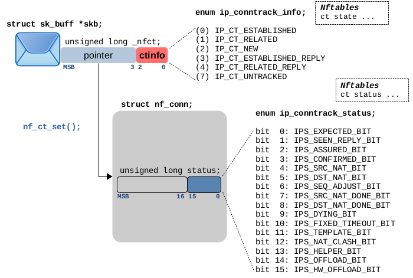
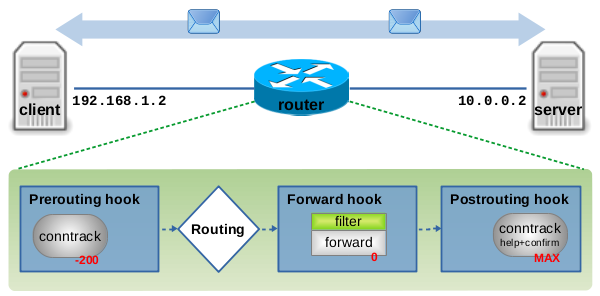
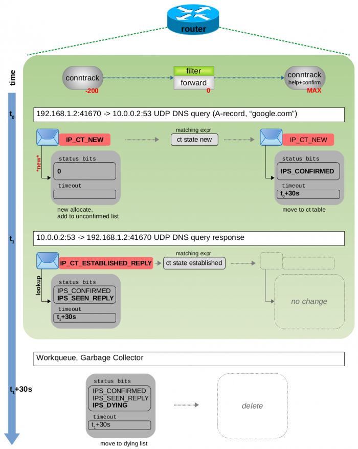
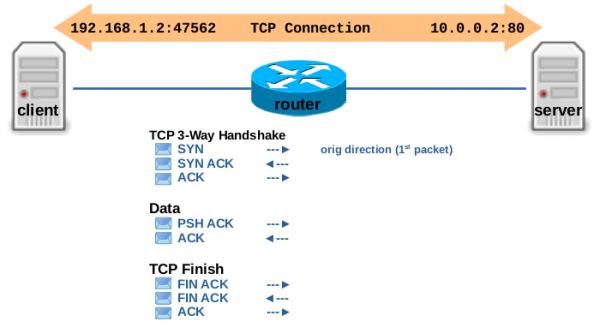
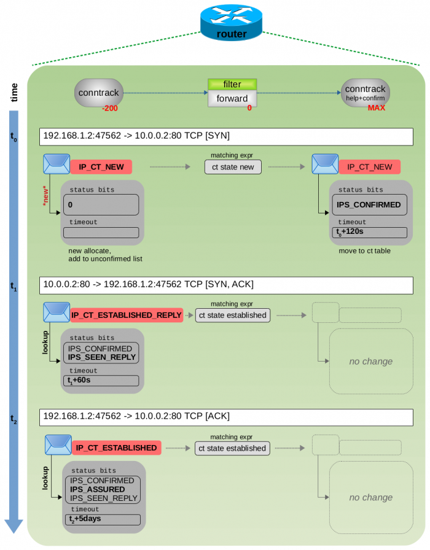
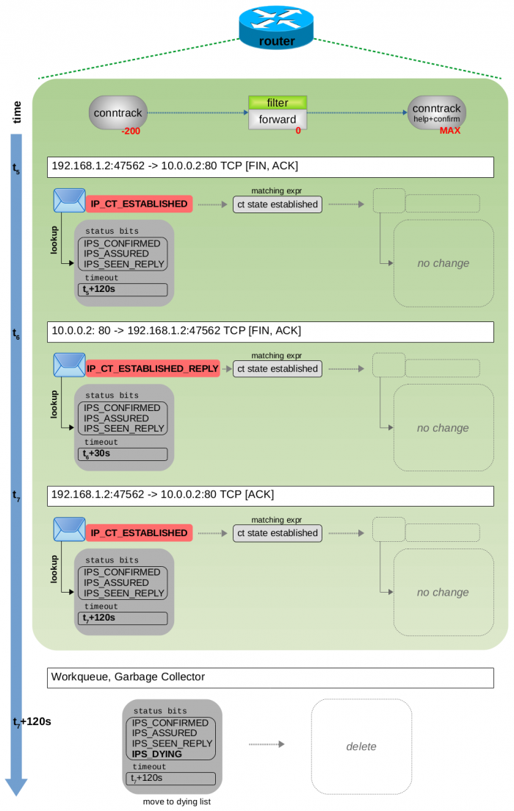

# Connection tracking (conntrack) - Part 3: State and Examples

> from [https://thermalcircle.de/doku.php?id=blog:linux:connection_tracking_3_state_and_examples](https://thermalcircle.de/doku.php?id=blog:linux:connection_tracking_3_state_and_examples)

With this article series I like to take a closer look at the connection tracking subsystem of the Linux kernel, which provides the basis for features like stateful packet filtering and NAT. I refer to it as the “ct system” throughout the series. In this third article, I like to take a look at how the system analyzes and tracks the state of a connection and in which way IPtables/Nftables rules can make use of that. I further present some practical examples for common protocols like ICMP, UDP and TCP.

## Articles of the series

- [Connection tracking (conntrack) - Part 1: Modules and Hooks](https://thermalcircle.de/doku.php?id=blog:linux:connection_tracking_1_modules_and_hooks)
- [Connection tracking (conntrack) - Part 2: Core Implementation](https://thermalcircle.de/doku.php?id=blog:linux:connection_tracking_2_core_implementation)
- [Connection tracking (conntrack) - Part 3: State and Examples](https://thermalcircle.de/doku.php?id=blog:linux:connection_tracking_3_state_and_examples)

## Overview

To put things into context let's do a short recap of what I already described in detail in the previous articles of this series: The ct system maintains all connections which it is tracking in a central table and each tracked connection is being represented by an instance of `struct nf_conn`. 

For each IPv4/IPv6 packet which is traversing the ct hook functions in the Netfilter hooks (the ones with priority -200; see Figure [1](https://thermalcircle.de/doku.php?id=blog:linux:connection_tracking_3_state_and_examples#nfhooks-complete1)), the ct system determines to which tracked connection that packet belongs to and initializes a pointer within the `skb` data structure of the packet to point to the according instance of `struct nf_conn`. 

Thereby it marks/categorizes the packet, so other components like Iptables/Nftables can make decisions based on that. These concepts are often referred to as *stateful packet filtering* or *stateful packet inspection*. So far so good.

[](https://thermalcircle.de/lib/exe/fetch.php?media=linux:nf-ct-iptables-hooks-ipv4.png)

> **Figure 1:** *Conntrack*+*Defrag* hook functions and *Iptables* chains registered with IPv4 Netfilter hooks
> (click to enlarge)[1)](https://thermalcircle.de/doku.php?id=blog:linux:connection_tracking_3_state_and_examples#fn__1)

As packets keep flowing, the ct system continuously analyzes each connection to determine its current state. It does that by analyzing OSI layers 3 and 4 (and in certain cases also higher layers) of each packet. **This connection state maintained by the ct system is of course not the same as the actual state of a network protocol (like e.g. TCP) in the communication endpoints, as the ct system merely is an observer in the middle and has no access to endpoints or their internal states**. However, this state probably is the most essential information produced by the ct system, because it provides the basis for components like Iptables/Nftables to make meaningful “stateful packet filtering” decisions. I guess most people reading this are familiar with the usual syntax of Iptables/Nftables for matching against the state of tracked connections:

```
#Nftables example
ct state established,related
 
#Iptables example
-m conntrack --ctstate ESTABLISHED,RELATED
```

In this article I like to dive a little deeper into this topic, connecting the dots between the implementation – the variables holding the state information within the ct system – , how this implementation behaves, and how things look like from the point of view of Iptables/Nftables and from the command line tool `conntrack`. Figure [2](https://thermalcircle.de/doku.php?id=blog:linux:connection_tracking_3_state_and_examples#nfconnnfct) gives an overview of the implementation variables involved here. There actually are two variables holding state information, each with slightly different semantics. I'll explain them in detail.



> **Figure 2:** Network packet after traversing ct main hook function (priority -200), belonging to a tracked connection, `status` specifying internal connection status, `ctinfo` specifying connection state, direction of the packet relative to the connection and relation of the packet to the connection.

## Status variable

The variable `status`, depicted in Figure [2](https://thermalcircle.de/doku.php?id=blog:linux:connection_tracking_3_state_and_examples#nfconnnfct), is an integer member of `struct nf_conn` and its least significant 16 bits are being used as status and management bits for the tracked connection. Type `enum ip_conntrack_status` gives each of those bits a name and meaning. The table in Figure [3](https://thermalcircle.de/doku.php?id=blog:linux:connection_tracking_3_state_and_examples#nfconnstatus_detail) below explains this meaning in detail. While some of those bits represent the current status of the tracked connection determined by the ct system based on analyzing observed network packets, others represent internal management settings. The latter bits specify and organize things which shall be done for a tracked connection in specific cases, like NAT, hardware offloading, user-defined timeouts, and so on. *Iptables/Nftables*: Some of those bits can be directly matched against by using conntrack expressions in Iptables/Nftables rules. The table in Figure [3](https://thermalcircle.de/doku.php?id=blog:linux:connection_tracking_3_state_and_examples#nfconnstatus_detail) shows the exact syntax to do that for the bits which can be matched. Of course, if your chain is located in the Netfilter *Prerouting* or *Output* hook and your rule(s) are using these kind of expressions, then your chain must have a priority > -200, to make sure it is traversed by the network packets AFTER the ct main hook function (see Figure [1](https://thermalcircle.de/doku.php?id=blog:linux:connection_tracking_3_state_and_examples#nfhooks-complete1)). You will probably recognize that the syntax used for those expressions is not the familiar syntax which is used in most common cases when intending to write stateful packet filtering rules. I'll get to that in the next section. *Conntrack*: When you use userspace tool `conntrack` with option `-L` to list the currently tracked connections or doing a `cat` on the file `/proc/net/nf_conntrack` to achieve the same thing, then some of the status bits are shown in the resulting output. The table in Figure [3](https://thermalcircle.de/doku.php?id=blog:linux:connection_tracking_3_state_and_examples#nfconnstatus_detail) explains which bits are shown and the syntax used for that.

| bit 0: `IPS_EXPECTED`                                        |
| :----------------------------------------------------------- |
| Expected connection: When the first packet of a new connection is traversing the ct main hook function, a new tracked connection is created. If this new tracked connection is identified to be an *expected connection*, then this bit [is being set](https://elixir.bootlin.com/linux/v5.10.19/source/net/netfilter/nf_conntrack_core.c#L1610). This can e.g. happen, if you are using the ct helper for the FTP protocol; see [FTP extension](https://elixir.bootlin.com/linux/v5.10.19/source/net/netfilter/nf_conntrack_ftp.c). The *expected connection* then usually is an “FTP data” TCP connection, which is related to an already established “FTP command” TCP connection. If this bit is being set, `ctinfo` [is being set to](https://elixir.bootlin.com/linux/v5.10.19/source/net/netfilter/nf_conntrack_core.c#L1694) `IP_CT_RELATED`.conntrack expressions matching this bitNftables`ct status expected`Iptables`-m conntrack --ctstatus EXPECTED`<br />iptable expression: `-m conntrack --ctstatus EXPECTED` |
| bit 1: `IPS_SEEN_REPLY`                                      |
| Packets have been seen both ways (bit can be set, not unset): [This bit is set](https://elixir.bootlin.com/linux/v5.10.19/source/net/netfilter/nf_conntrack_core.c#L1868) once the very first packet in reply direction is seen by the ct system.conntrack expressions matching this bitNftables`ct status seen_reply`Iptables`-m conntrack --ctstatus SEEN_REPLY`bit shown by conntrack command or proc file like this (negated!)`conntrack -L` `cat /proc/net/nf_conntrack``[UNREPLIED]` |
| bit 2: `IPS_ASSURED`                                         |
| This tracked connection should never be early-expired: This bit is set, if the packets seen by the ct system indicate a fully established connection on OSI layer 4 and traffic has been seen both ways. In case of TCP [it is set](https://elixir.bootlin.com/linux/v5.10.19/source/net/netfilter/nf_conntrack_proto_tcp.c#L1165) once the complete TCP 3-way handshake has been seen. In case of UDP [it is set](https://elixir.bootlin.com/linux/v5.10.19/source/net/netfilter/nf_conntrack_proto_udp.c#L120) when traffic has already been seen both ways and now yet another packet is seen. In case of an ICMP transaction (e.g. ping: echo-request + echo-reply) this bit is however not set at all. Tracked connections where this bit is not set can fall victim to the “early drop” mechanism. When the number of connections tracked by the ct system grows very high and reaches a certain max threshold (which of course depends on the configured size of the central ct table), then the ct system begins to delete not assured connections to free up some space.<br />Iptables`-m conntrack --ctstatus ASSURED`<br />`conntrack -L`<br /> `cat /proc/net/nf_conntrack`<br />`[ASSURED]` |
| bit 3: `IPS_CONFIRMED`                                       |
| This tracked connection has been confirmed, the original packet has left box: I have described this in detail in the previous articles of this series. Once a packet representing a new tracked connection (the very first packet seen of that connection) has traversed both the main hook function of the ct system (priority -200) and also the ct help+confirm hook function (priority MAX), that new tracked connection gets “confirmed” and is being added to the central ct table. That means this bit is being set.<br />conntrack expressions matching this bit<br />Nftables`ct status confirmed`<br />Iptables`-m conntrack --ctstatus CONFIRMED` |
| bit 4: `IPS_SRC_NAT`                                         |
| This tracked connection needs SRC NAT in orig dir<br />conntrack expressions matching this bit<br />Nftables`ct status snat`Iptables`-m conntrack --ctstate SNAT`[2)](https://thermalcircle.de/doku.php?id=blog:linux:connection_tracking_3_state_and_examples#fn__2) |
| bit 5: `IPS_DST_NAT`                                         |
| This tracked connection needs DST NAT in orig dir<br />conntrack expressions matching this bit<br />Nftables`ct status dnat`<br />Iptables`-m conntrack --ctstate DNAT`[3)](https://thermalcircle.de/doku.php?id=blog:linux:connection_tracking_3_state_and_examples#fn__3) |
| bit 6: `IPS_SEQ_ADJUST`                                      |
| This tracked connection needs TCP sequence adjusted          |
| bit 7: `IPS_SRC_NAT_DONE`                                    |
| NAT initialization bit                                       |
| bit 8: `IPS_DST_NAT_DONE`                                    |
| NAT initialization bit                                       |
| bit 9: `IPS_DYING`                                           |
| This tracked connection is dying, removed from lists (bit cannot be unset): I have described this in detail in the previous articles of this series. Once the timeout of a tracked connection expires, this bit is set and the connection is removed from the central ct table and added to the *dying list*. After that it is being deleted.conntrack expressions matching this bitNftables`ct status dying` |
| bit 10: `IPS_FIXED_TIMEOUT`                                  |
| This tracked connection has a fixed timeout.                 |
| bit 11: `IPS_TEMPLATE`                                       |
| This tracked connection is a template.                       |
| bit 12: `IPS_NAT_CLASH`                                      |
| This tracked connection clashed with an existing instance on insert. This bit originally had another meaning, `IPS_UNTRACKED`, however that meaning is now obsolete and is instead being handled by `ctinfo`… see section below. This bit has been re-purposed to indicate a clash. |
| bit 13: `IPS_HELPER`                                         |
| This tracked connection got a helper explicitly attached via CT target. |
| bit 14: `IPS_OFFLOAD`                                        |
| This tracked connection has been offloaded to a [flowtable](https://thermalcircle.de/doku.php?id=blog:linux:flowtables_1_a_netfilter_nftables_fastpath).bit shown by conntrack command or proc file like this`conntrack -L`[4)](https://thermalcircle.de/doku.php?id=blog:linux:connection_tracking_3_state_and_examples#fn__4) `cat /proc/net/nf_conntrack``[OFFLOAD]` |
| bit 15: `IPS_HW_OFFLOAD`                                     |
| This tracked connection has been offloaded to hardware by a [flowtable](https://thermalcircle.de/doku.php?id=blog:linux:flowtables_1_a_netfilter_nftables_fastpath).bit shown by conntrack command or proc file like this`conntrack -L`[5)](https://thermalcircle.de/doku.php?id=blog:linux:connection_tracking_3_state_and_examples#fn__5) `cat /proc/net/nf_conntrack``[HW_OFFLOAD]` |


**Figure 3:** Names and meaning of the least significant 16 bits of `struct nf_conn` member `status`.


## Pointer and ctinfo

Please take another look at Figure [2](https://thermalcircle.de/doku.php?id=blog:linux:connection_tracking_3_state_and_examples#nfconnnfct). When a network packet traverses one of the ct main hook functions (the ones with priority -200 in Figure [1](https://thermalcircle.de/doku.php?id=blog:linux:connection_tracking_3_state_and_examples#nfhooks-complete1)) and it is clear to which tracked connection that packet belongs to, `skb->_nfct` of that packet will get initialized with a pointer to the corresponding `struct nf_conn` instance in the central ct table. However, the least significant 3 bits are used differently and are not part of that pointer. They are used as a tiny integer, which is named `ctinfo` in most parts of the code. In case you are wondering how cutting away 3 bits from a pointer doesn't create problems… kernel memory management makes sure that addresses of memory areas allocated to hold instances of `struct nf_conn` are 8 byte aligned. Thus, when using `_nfct` as a pointer, its least significant 3 bits are masked and thereby set to zero. Function `nf_ct_get()` is used to retrieve both the (dereferenced) pointer and `ctinfo` from an `skb->_nfct`. Function `nf_ct_set()` is used to write both the pointer and `ctinfo` to an `skb->_nfct`. The semantics/meaning of the 3-bit integer `ctinfo` is a combination of the current state of the tracked connection that network packet belongs to, the flow direction of the packet and its relation to that connection. Type `enum ip_conntrack_info` gives the values of `ctinfo` a name and meaning and the table in Figure [4](https://thermalcircle.de/doku.php?id=blog:linux:connection_tracking_3_state_and_examples#nfctinfo_detail) below shows and explains those in detail. All cases described in that table can be matched against by using conntrack expressions in Iptables/Nftables rules. This is the syntax you probably are familiar with when writing stateful packet filtering rules: `ct state ...` for Nftables and `-m conntrack --ctstate ...` for Iptables respectively. Of course, if your chain is located in the Netfilter *Prerouting* or *Output* hook and your rule(s) are using these kind of expressions, then your chain must have a priority > -200, to make sure it is traversed by the network packets AFTER the ct main hook function (see Figure [1](https://thermalcircle.de/doku.php?id=blog:linux:connection_tracking_3_state_and_examples#nfhooks-complete1)).

|   <br />The ct system [sets this](https://elixir.bootlin.com/linux/v5.10.19/source/net/netfilter/nf_conntrack_core.c#L1697) for a packet which is either:the very first packet seen for a tracked connection (e.g. a TCP SYN packet, if the ct system is able to observe all packets of that connection from its beginning); thus, a new *unconfirmed* tracked connection has just now been created for that packet and has been added to the *unconfirmed list*or the packet belongs to an already known and confirmed tracked connection, is flowing in original direction (= direction of the very first seen packet) and since the very first packet no packet has yet been seen in reply direction (this packet could e.g. be a retransmission of a TCP SYN packet)<br />conntrack expressions matching this packetNftables`ct state new`Iptables`-m conntrack --ctstate NEW` |
| ------------------------------------------------------------ |
|   <br />The ct system [sets this](https://elixir.bootlin.com/linux/v5.10.19/source/net/netfilter/nf_conntrack_core.c#L1691) for a packet which belongs to an already tracked connection and which meets all of the following criteria:packet is not the first one seen for that connectionpacket is flowing in original direction (= same direction as first packet seen for that connection)packets have already been seen in both directions for this connection, prior to this packetconntrack expressions matching this packetNftables`ct state established``ct state established ct direction original`Iptables`-m conntrack --ctstate ESTABLISHED``-m conntrack --ctstate ESTABLISHED --ctdir ORIGINAL` |
|   <br />The ct system [sets this](https://elixir.bootlin.com/linux/v5.10.19/source/net/netfilter/nf_conntrack_core.c#L1686) for a packet which belongs to an already tracked connection and which meets both of the following criteria:packet is not the first one seen for that connectionpacket is flowing in reply direction (= opposite direction than first packet seen for that connection)conntrack expressions matching this packetNftables`ct state established``ct state established ct direction reply`Iptables`-m conntrack --ctstate ESTABLISHED``-m conntrack --ctstate ESTABLISHED --ctdir REPLY` |
|   <br />The ct system sets this for a packet which is one of these two things:The packet is a valid ICMP error message (e.g. type=3 “destination unreachable”, code=0 “network unreachable”) which is related to an already tracked connection. Relative to that connection, it is flowing in original direction. Pointer `*p` points to that connection.The packet is the very first one of a new connection, but this connection is related to an already tracked connection or, in other words, it is an *expected connection* (see status bit `IPS_EXPECTED` in Figure [3](https://thermalcircle.de/doku.php?id=blog:linux:connection_tracking_3_state_and_examples#nfconnstatus_detail) above). This e.g. occurs when you use the ct helper for the FTP protocol. This is a very complex topic, which would deserve its own blog article[6)](https://thermalcircle.de/doku.php?id=blog:linux:connection_tracking_3_state_and_examples#fn__6). Important to note here is, that only the first packet belonging to an *expected connection* is marked with `IP_CT_RELATED`. All following packets of that connection are marked with `IP_CT_ESTABLISHED` or `IP_CT_ESTABLISHED_REPLY` as with any other tracked connection.conntrack expressions matching this packetNftables`ct state related``ct state related ct direction original`Iptables`-m conntrack --ctstate RELATED``-m conntrack --ctstate RELATED --ctdir ORIGINAL` |
|   <br />The ct system sets this for a packet that is a valid ICMP error message (e.g. type=3 “destination unreachable”, code=0 “network unreachable”) which is related to an already tracked connection. Relative to that connection, it is flowing in reply direction. Pointer `*p` points to that connection. However, value `IP_CT_RELATED_REPLY` is NEVER being set for an *expected connection*! See description of `IP_CT_RELATED` above!conntrack expressions matching this packetNftables`ct state related``ct state related ct direction reply`Iptables`-m conntrack --ctstate RELATED``-m conntrack --ctstate RELATED --ctdir REPLY` |
|   <br />The ct system sets this for a packet it considers *invalid*:If a packet does not pass validity checks while traversing the ct main hook function[7)](https://thermalcircle.de/doku.php?id=blog:linux:connection_tracking_3_state_and_examples#fn__7), then the ct system considers that packet to be “invalid” and sets `pointer` and `ctinfo` to zero. That packet is thereby not associated with any tracked connection. It is not the job of the ct system to drop “invalid” packets. However, an admin can create firewall rules for dropping those packets by using the following matching expressions:<br />conntrack expressions matching this packet<br />Nftables`ct state invalid`<br />Iptables`-m conntrack --ctstate INVALID` |
|   <br />The idea of this mechanism is to have a means to mark network packets in a way which commands the ct system to leave them alone (= to leave them untouched and not attempt to track them). In contrast to the other cases described in this table, `ctinfo` is NOT being set to this value while a packet is traversing the ct main hook function (priority -200; see Figure [1](https://thermalcircle.de/doku.php?id=blog:linux:connection_tracking_3_state_and_examples#nfhooks-complete1)). To make this mechanism work, this must already happen in a hook function which is traversed BEFORE the ct main hook function (thus, priority < -200, e.g. -300). See [Nftables Wiki](https://wiki.nftables.org/wiki-nftables/index.php/Setting_packet_connection_tracking_metainformation#notrack_-_Bypass_connection_tracking) and [Iptables tutorial](https://www.frozentux.net/iptables-tutorial/iptables-tutorial.html#UNTRACKEDCONNS) for Nftables/Iptables `notrack`/`NOTRACK` target. If then the ct main hook function [sees a packet](https://elixir.bootlin.com/linux/v5.10.19/source/net/netfilter/nf_conntrack_core.c#L1801) where `ctinfo` is already set to `IP_CT_UNTRACKED`, it will leave this packet untouched and not attempt to track it. Nftables/Iptables rules can use the following expressions to match those packets:conntrack expressions matching this packetNftables`ct state untracked`Iptables`-m conntrack --ctstate UNTRACKED` |


**Figure 4:** `skb->_nfct` holds a `pointer` and the 3-bit integer `ctinfo`. This table shows all possible values used in practice and explains their meaning. See `enum ip_conntrack_info`.


## Example Topology

In the following sections I will show some basic practical examples, which will demonstrate how the connection tracking state is handled in case of ICMP, UDP and TCP protocols. All these examples will be based on the same simple network topology shown in Figure [5](https://thermalcircle.de/doku.php?id=blog:linux:connection_tracking_3_state_and_examples#ctextopo): A *client* host with assigned IPv4 address `192.168.1.2` and a *server* host with assigned IPv4 address `10.0.0.2` are communicating. A *router* acts as hop in between both hosts and performs connection tracking and stateful packet filtering. Figure [5](https://thermalcircle.de/doku.php?id=blog:linux:connection_tracking_3_state_and_examples#ctextopo) shows the three Netfilter IPv4 hooks *Prerouting*, *Forward* and *Postrouting*, which are traversed by the network packets on the *router* in this case. The ct system is loaded, so the *ct main hook function* is registered with the *Prerouting* hook with priority -200 and the *ct help+confirm hook function* is registered with the *Postrouting* hook with priority MAX. Further, an Nftables base chain is registered with priority 0 in the *Forward* hook, which places it in between both ct hook functions. Compare this to Figure [1](https://thermalcircle.de/doku.php?id=blog:linux:connection_tracking_3_state_and_examples#nfhooks-complete1) if you like.



> **Figure 5:** Example topology: A *client* and a *server* host as communication endpoints, a *router* as hop in between, doing connection tracking and stateful packet filtering.

Please be aware that what I show in the following examples merely are “good weather” cases. I will just show the connection tracking state changes as they happen in case of very basic and successful protocol actions like an ICMP ping, a TCP handshake and so on. All packets will arrive in time so no tracked connection will timeout while there is still activity. Of course, many other things can happen with those protocols… like packets arriving too late or not at all, which would cause tracked connections to timeout and be deleted. ICMP error messages like “destination unreachable” could occur, TCP retransmissions, TCP RST and many more. The number of potential cases is endless, so I'll stick to the very basics here.


> **Figure 6:** Legend for practical examples in sections below: *skb* with attached tracked connection, showing `ctinfo`, `status` and `timeout`.

Figure [6](https://thermalcircle.de/doku.php?id=blog:linux:connection_tracking_3_state_and_examples#ctstatelegend) acts as a legend for the figures to follow in the examples below. It shows a network packet as it is traversing the hook functions on the *router*, the `ctinfo` variable and the attached tracked connection instance with its `status` and `timeout` variables. If the value of `ctinfo`, one of the `status` bits or the `timeout` value is shown in **bold** font in the examples below, this means this value/bit is being changed exactly in this moment. If the font is non-bold, then this means the value/bit has already been set in the past and remains unchanged. While `timeout` is not in the focus of this article, I added it because I think its behavior is interesting, too. Please compare it to the section *Connection timeout* of my second article.

## ICMP Example

This example demonstrates state changes of a tracked connection in case of a simple [ICMP](https://en.wikipedia.org/wiki/Internet_Control_Message_Protocol) ping, as shown in Figure [7](https://thermalcircle.de/doku.php?id=blog:linux:connection_tracking_3_state_and_examples#cticmpexmsgs). The client host sends a single ICMP *echo-request* to the server host and the server answers with an ICMP *echo-reply*.


> **Figure 7:** Example ICMP ping, client pings server, `client:~$ ping -c1 10.0.0.2`.

Despite the fact that this is not a “connection” in the sense of a connection-oriented protocol, the ct system handles this ICMP transaction as a single tracked connection, based on source+destination IP address and ICMP *type*,*code* and *identifier*[8)](https://thermalcircle.de/doku.php?id=blog:linux:connection_tracking_3_state_and_examples#fn__8). Figure [8](https://thermalcircle.de/doku.php?id=blog:linux:connection_tracking_3_state_and_examples#cticmpexping) shows both network packets as they traverse the ct hook functions and the Nftables chain on the router. The ICMP *echo-request* causes a new tracked connection to be created. `ctinfo` is set to `IP_CT_NEW`. An Nftables ct expression matching this packet would be `ct state new`. Once the packet reaches the ct help+confirm hook function, `status` bit `IPS_CONFIRMED` is set, timeout is set to 30 seconds and the tracked connection is being added to the central ct table. In this example, the corresponding ICMP *echo-reply* arrives well before the 30 seconds timeout would have expired. The ct system detects that it belongs to the same tracked connection, sets `ctinfo` to `IP_CT_ESTABLISHED_REPLY`, sets `status` bit `IP_CT_SEEN_REPLY` and renews the timeout to another 30 seconds. An Nftables ct expression matching this packet would be `ct state established`. Once the 30 seconds timeout expires, the ct garbage collector sets `status` bit `IPS_DYING`, removes the tracked connection from the central ct table, adds it to the *dying list* and finally deletes it.

[](https://thermalcircle.de/lib/exe/fetch.php?media=linux:nf-ct-icmp-ex.png)**Figure 8:** ICMP *echo-request* and *echo-reply* traversing ct hook functions, causing tracked connection to be created and later deleted, showing state and timeout changes as those occur (click to enlarge).

If the client would use the command `ping 10.0.0.2` to send continuous ICMP *echo-requests* (in default 1 second interval) to the server instead of just a single one, then the ICMP *identifier* would contain the same value in all those packets (`id=42` in the example in Figure [8](https://thermalcircle.de/doku.php?id=blog:linux:connection_tracking_3_state_and_examples#cticmpexping)), but the ICMP *sequence number* would be incremented by one for each new *echo-request/reply* pair. The ct system would assign all those packets to the same tracked connection and this connection would not timeout as long as ICMP *echo-requests/replies* would keep coming. Internally, it remembers the *identifier* value in its *tuples* to do that; see function `icmp_pkt_to_tuple()`.

## UPD Example

This example demonstrates state changes of a tracked connection in case of a [DNS](https://en.wikipedia.org/wiki/Domain_Name_System) *query* + *response*, as shown in Figure [9](https://thermalcircle.de/doku.php?id=blog:linux:connection_tracking_3_state_and_examples#ctudpexmsgs). The client host sends a DNS *query* message to the server[9)](https://thermalcircle.de/doku.php?id=blog:linux:connection_tracking_3_state_and_examples#fn__9) host, asking for the *A-record* – the IPv4 address –, corresponding to the domain name *google.com*. This results in a single UDP packet, containing the DNS *query*, being sent from client to server host destination port `53` and resulting from that a single UDP packet sent back from the server to the client, containing the DNS *response*.

**Figure 9:** Example DNS *query*+*response* via UDP: client queries *A-record* of domain *google.com* from DNS server, `client:~$ host -t A google.com`.

The resulting behavior of the ct system in this case is nearly identical to the previous ICMP example above: UDP is not a connection-oriented protocol, however the ct system handles this UDP-based transaction as a single tracked connection, based on source+destination IP address and source+destination UDP ports[10)](https://thermalcircle.de/doku.php?id=blog:linux:connection_tracking_3_state_and_examples#fn__10). Figure [10](https://thermalcircle.de/doku.php?id=blog:linux:connection_tracking_3_state_and_examples#ctudpex) shows both network packets as they traverse the ct hook functions and the Nftables chain on the router. The UDP packet containing the DNS *query* causes a new tracked connection to be created. `ctinfo` is set to `IP_CT_NEW`. An Nftables ct expression matching this packet would be `ct state new`. Once the packet reaches the ct help+confirm hook function, `status` bit `IPS_CONFIRMED` is set, timeout is set to 30 seconds and the tracked connection is being added to the central ct table. In this example the corresponding UDP packet containing the DNS *response* arrives well before the 30 seconds timeout would have expired. The ct system detects that it belongs to the same tracked connection, sets `ctinfo` to `IP_CT_ESTABLISHED_REPLY`, sets `status` bit `IP_CT_SEEN_REPLY` and renews the timeout to another 30 seconds. An Nftables ct expression matching this packet would be `ct state established`. Once the 30 seconds timeout expires, the ct garbage collector sets `status` bit `IPS_DYING`, removes the tracked connection from the central ct table, adds it to the *dying list* and finally deletes it.



**Figure 10:** DNS *query* and *response* via UDP packets, traversing ct hook functions, causing tracked connection to be created and later deleted, showing state and timeout changes as those occur (click to enlarge).

If further UDP packets would keep coming on the same source and destination IP addresses and UDP ports, no matter which direction, then the ct system would assign all those UDP packets to the same tracked connection and this connection would not timeout as long as further packets would keep coming. In that case `status` bit `IPS_ASSURED` would get set, once the 3rd packet belonging to that connection would be seen. Common command line tools like `host` usually ask for more than just the *A-record* when resolving a domain name. By default `host` asks for the *A-record*, the *AAAA-record* and the *MX-record*. This of course results in more UDP packets being sent both ways. However, `host` uses yet another socket (= yet another UDP source port) for each one of these DNS *queries*, which results in the ct system treating each one of them as a separate new tracked connection.

## TCP states

Before we get to the actual TCP example, we need to talk a little about TCP states. If you already have worked with the ct system for a while, then you will maybe wonder, how `ctinfo` and `status` can be all there is regarding stateful packet inspection. Probably you already have seen things like the following when listing tracked connections with the `conntrack` tool:

```
$ conntrack -L
udp   17  3                   src=192.168.49.1  ...
tcp   6   21     TIME_WAIT    src=192.168.2.100 ...
tcp   6   360313 ESTABLISHED  src=192.168.2.100 ...
#                ^
#                TCP state ???
```

So, if you have read [RFC 793](https://www.rfc-editor.org/rfc/rfc793.html) and/or are familiar with the [state machine of the TCP protocol](https://www.rfc-editor.org/rfc/rfc793.html#page-23), then you probably recognized those TCP-ish state names like `TIME_WAIT` and `ESTABLISHED` in the output of that tool. So are those really TCP states and how do they relate to `ctinfo` and Nftables ct expressions like `ct state established`? 

- **conntrack 的 TCP state 与 socket 的 tcp state 不完全实时相等：**

Well, as already mentioned, the ct system merely is a transparent observer in the middle and does not have access to the TCP sockets which represent the communication endpoints and which anyway in most cases reside on other hosts than the ct system. Thus, **those states you see in that output of course are not the real TCP states of the endpoints**. However, the ct system does analyze OSI layer 4 thoroughly. Based on the network packets it observes, it is able to understand the behavior of TCP protocol quite well and thereby it is able to take an educated guess on the current TCP state. When a TCP packet traverses one of the main ct hook functions, function `nf_conntrack_tcp_packet()` analyzes the TCP part of the packet. In the second article of this series I mentioned that `struct nf_conn` has a member `union nf_conntrack_proto proto`, which is used to track details of the OSI layer 4 protocol. In case of TCP, this `union` contains `struct ip_ct_tcp`. Among other things, it contains variable `uint8_t state`, which it uses to track the guessed TCP state. String array `tcp_conntrack_names[]` contains textual representations of all possible states: `SYN_SENT`, `SYN_RECV`, `ESTABLISHED`, `FIN_WAIT`, `CLOSE_WAIT`, `LAST_ACK`, `TIME_WAIT`, `CLOSE` and `SYN_SENT2`. This is what you see in the output of `conntrack -L` in case of TCP. 

But how does this relate to `ctinfo` and `status`? The ct system analyzes the TCP state, the sequence numbering, receive window, retransmissions, and so on… Based on that it considers packets as “`invalid`” in certain cases, e.g. when it sees sequence numbers which do not fit and then sorts those packets out as `invalid` by setting their `skb->_nfct=NULL`. **The ct system recognizes things like the TCP 3-way handshake, the TCP FIN connection termination and so on and dynamically sets the tracked connection [timeout value](https://elixir.bootlin.com/linux/v5.10.19/source/net/netfilter/nf_conntrack_proto_tcp.c#L69) accordingly**. When it recognizes the TCP 3-way handshake to be finished successfully, it sets the `IPS_ASSURED` status bit[11)](https://thermalcircle.de/doku.php?id=blog:linux:connection_tracking_3_state_and_examples#fn__11). 

To sum things up: For sure analyzing TCP has influence on `ctinfo` and `status`, but the tracked TCP `state` is a separate variable. Thus, **be aware that when you see `ESTABLISHED` in the output of `conntrack -L`, then this is NOT the one that Nftables expression `ct state established` matches to!** That expression matches to the value of `ctinfo`. **A ct tracked connection is already considered to be `established`, once traffic is seen both ways. The ct system does not wait for the TCP handshake to finish**. It sets `ctinfo` to `IP_CT_ESTABLISHED_REPLY` when it sees the very first valid reply packet, usually a `TCP SYN ACK`. Things must be this way, else commonly used Nftables rules with conntrack expressions like the following two in a chain with policy *drop* would not work as intended:

```
# allowing new connections to be established from eth0 to eth1,
# but only established+related packets allowed from eth1 to eth0
table ip filter {
        chain forward {
                type filter hook forward priority filter; policy drop;
                iif eth0 oif eth1 ct state new,established,related accept
                iif eth1 oif eth0 ct state established,related accept
        }
}
```

Maybe it is just me and this is obvious and clear for most other people. However, I admit that this detail often confused me in my early days with connection tracking, because conntrack expressions like Nftables `ct state established` or Iptables `-m conntrack --ctstate ESTABLISHED` always remembered me of the TCP state `ESTABLISHED`.

## TCP Example

This example demonstrates how the ct system tracks a simple [TCP](https://en.wikipedia.org/wiki/Transmission_Control_Protocol) connection as shown in Figure [11](https://thermalcircle.de/doku.php?id=blog:linux:connection_tracking_3_state_and_examples#cttcpexmsgs), beginning with the TCP 3-way handshake, some payload data being sent and ending with the normal connection termination. The client host opens the connection to the server (e.g. to TCP destination port 80/HTTP), sends some payload data and then closes the connection in an ordinary fashion.



> **Figure 11:** Example TCP connection between *client* and a *server*: TCP 3-way handshake, transfer of some payload data, normal connection termination[12)](https://thermalcircle.de/doku.php?id=blog:linux:connection_tracking_3_state_and_examples#fn__12).

The ct system handles this as a single tracked connection, based on source+destination IP address and source+destination TCP ports[13)](https://thermalcircle.de/doku.php?id=blog:linux:connection_tracking_3_state_and_examples#fn__13). Further, it analyzes each packet it sees on OSI layer 4, as described in the previous section. 

Figure [12](https://thermalcircle.de/doku.php?id=blog:linux:connection_tracking_3_state_and_examples#cttcpexhs) shows the state and timeout changes during the TCP 3-way handshake, 

Figures [13](https://thermalcircle.de/doku.php?id=blog:linux:connection_tracking_3_state_and_examples#cttcpexpsh) and [14](https://thermalcircle.de/doku.php?id=blog:linux:connection_tracking_3_state_and_examples#cttcpexfin) show the same for a payload data transfer and the TCP connection termination. 

You can see, that **the ct system sets the [timeout value](https://elixir.bootlin.com/linux/v5.10.19/source/net/netfilter/nf_conntrack_proto_tcp.c#L69) dynamically, depending on what it learns about the current TCP state**. If it is clear, that a reply packet is expected to arrive soon from the peer to make the TCP connection continue without going into error handling, e.g. during the handshake or when waiting for TCP ACK to acknowledge sent payload data, then ct chooses a short timeout value. However, if the 3-way handshake has been concluded successfully, the TCP connection is now fully established and no TCP ACK is currently outstanding, then ct chooses a long timeout value. It also then sets the `IPS_ASSURED` status bit. Of course most TCP connections exchange much more payload data and they do that in both directions, resulting in many more packets being exchanged than shown in Figure [13](https://thermalcircle.de/doku.php?id=blog:linux:connection_tracking_3_state_and_examples#cttcpexpsh). However, the values of the connection tracking state variables would not be any different than shown in that figure.



> Figure 12: TCP 3-way handshake: packets traversing ct hook functions, causing tracked connection to be created, confirmed, established and assured (click to enlarge).


> Figure 13: TCP payload data transfer: packets traversing ct hook functions, adjusting timeout depending on outstanding TCP ACK from peer (click to enlarge).



> Figure 14: TCP connection termination14): packets traversing ct hook functions, causing timeout to be adjusted, after final timeout expiration, tracked connection is deleted (click to enlarge).


## Context
The described behavior and implementation has been observed on a v5.10.19 kernel in a Debian 10 buster system with using Debian backports on amd64 architecture, using kernel build configuration from Debian.


