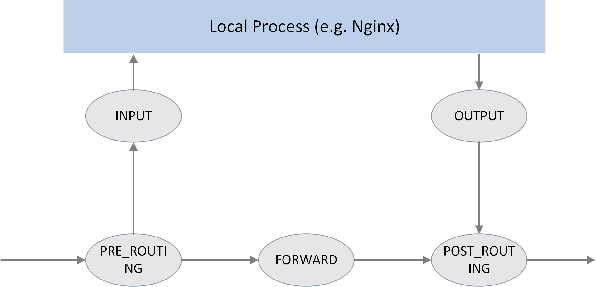

# 连接跟踪（conntrack）：原理、应用及 Linux 内核实现

> from: [https://arthurchiao.art/blog/conntrack-design-and-implementation-zh/](https://arthurchiao.art/blog/conntrack-design-and-implementation-zh/)

## 1.2 原理

了解以上概念之后，我们来思考下连接跟踪的技术原理。

要跟踪一台机器的所有连接状态，就需要

1. **拦截（或称过滤）流经这台机器的每一个数据包，并进行分析**。
2. 根据这些信息**建立**起这台机器上的**连接信息数据库**（conntrack table）。
3. 根据拦截到的包信息，不断更新数据库

例如，

1. 拦截到一个 TCP `SYNC` 包时，说明正在尝试建立 TCP 连接，需要创建一条新 conntrack entry 来记录这条连接
2. 拦截到一个属于已有 conntrack entry 的包时，需要更新这条 conntrack entry 的收发包数等统计信息

除了以上两点功能需求，还要考虑**性能问题**，因为连接跟踪要对每个包进行过滤和分析 。性能问题非常重要，但不是本文重点，后面介绍实现时会进一步提及。

之外，这些功能最好还有配套的管理工具来更方便地使用。

## 1.3 设计：Netfilter

**Linux 的连接跟踪是在 [Netfilter](https://en.wikipedia.org/wiki/Netfilter) 中实现的。**


Fig 1.2. Netfilter architecture inside Linux kernel

[Netfilter](https://en.wikipedia.org/wiki/Netfilter) 是 Linux 内核中一个对数据 包进行**控制、修改和过滤**（manipulation and filtering）的框架。它在内核协议 栈中设置了若干hook 点，以此对数据包进行拦截、过滤或其他处理。

> 说地更直白一些，hook 机制就是在数据包的必经之路上设置若干检测点，所有到达这 些检测点的包都必须接受检测，根据检测的结果决定：
>
> 1. 放行：不对包进行任何修改，退出检测逻辑，继续后面正常的包处理
> 2. 修改：例如修改 IP 地址进行 NAT，然后将包放回正常的包处理逻辑
> 3. 丢弃：安全策略或防火墙功能
>
> 连接跟踪模块只是完成连接信息的采集和录入功能，并不会修改或丢弃数据包，后者是其 他模块（例如 NAT）基于 Netfilter hook 完成的。


# 2 Netfilter hook 机制实现

Netfilter 由几个模块构成，其中最主要的是**连接跟踪**（CT）模块和**网络地址转换**（NAT）模块。

CT 模块的主要职责是识别出可进行连接跟踪的包。 CT 模块独立于 NAT 模块，但主要目的是服务于后者。

## 2.1 Netfilter 框架

### 5 个 hook 点



图 2.1. The 5 hook points in netfilter framework

如上图所示，Netfilter 在内核协议栈的包处理路径上提供了 5 个 hook 点，分别是：

```c
// include/uapi/linux/netfilter_ipv4.h

#define NF_IP_PRE_ROUTING    0 /* After promisc drops, checksum checks. */
#define NF_IP_LOCAL_IN       1 /* If the packet is destined for this box. */
#define NF_IP_FORWARD        2 /* If the packet is destined for another interface. */
#define NF_IP_LOCAL_OUT      3 /* Packets coming from a local process. */
#define NF_IP_POST_ROUTING   4 /* Packets about to hit the wire. */
#define NF_IP_NUMHOOKS       5
```

用户可以在这些 hook 点注册自己的处理函数（handlers）。当有数据包经过 hook 点时， 就会调用相应的 handlers。

> 另外还有一套 `NF_INET_` 开头的定义，`include/uapi/linux/netfilter.h`。 这两套是等价的，从注释看，`NF_IP_` 开头的定义可能是为了保持兼容性。
>
> ```c
> enum nf_inet_hooks {
>     NF_INET_PRE_ROUTING,
>     NF_INET_LOCAL_IN,
>     NF_INET_FORWARD,
>     NF_INET_LOCAL_OUT,
>     NF_INET_POST_ROUTING,
>     NF_INET_NUMHOOKS
> };
> ```

### hook 返回值类型

hook 函数对包进行判断或处理之后，需要返回一个判断结果，指导接下来要对这个包做什 么。可能的结果有：

```c
// include/uapi/linux/netfilter.h

#define NF_DROP   0  // 已丢弃这个包
#define NF_ACCEPT 1  // 接受这个包，结束判断，继续下一步处理
#define NF_STOLEN 2  // 临时 hold 这个包，不用再继续穿越协议栈了。常见的情形是缓存分片之后的包（等待重组）
#define NF_QUEUE  3  // 应当将包放到队列
#define NF_REPEAT 4  // 当前处理函数应当被再次调用
```

### hook 优先级

每个 hook 点可以注册多个处理函数（handler）。在注册时必须指定这些 handlers 的**优先级**，这样触发 hook 时能够根据优先级依次调用处理函数。


## 2.2 过滤规则的组织

`iptables` 是配置 Netfilter 过滤功能的用户空间工具。为便于管理， 过滤规则按功能分为若干 table：

- raw
- filter
- nat
- mangle

这不是本文重点。更多信息可参考 [(译) 深入理解 iptables 和 netfilter 架构](https://arthurchiao.art/blog/deep-dive-into-iptables-and-netfilter-arch-zh/)

# 3 Netfilter conntrack 实现

连接跟踪模块用于维护**可跟踪协议**（trackable protocols）的连接状态。 也就是说，连接跟踪**针对的是特定协议的包，而不是所有协议的包**。 稍后会看到它支持哪些协议。

## 3.1 重要结构体和函数

重要结构体：

- ```c
  struct nf_conntrack_tuple {}
  ```

  : 定义一个 tuple。

  - ```c
    struct nf_conntrack_man {}
    ```

    ：tuple 的 manipulable part。

    - `struct nf_conntrack_man_proto {}`：manipulable part 中协议相关的部分。

- `struct nf_conntrack_l4proto {}`: 支持连接跟踪的**协议需要实现的方法集**（以及其他协议相关字段）。

- `struct nf_conntrack_tuple_hash {}`：哈希表（conntrack table）中的表项（entry）。

- `struct nf_conn {}`：**定义一个 flow**。

重要函数：

- `hash_conntrack_raw()`：根据 tuple 计算出一个 32 位的哈希值（hash key）。

- `nf_conntrack_in()`：**连接跟踪模块的核心，包进入连接跟踪的地方**。

- `resolve_normal_ct() -> init_conntrack() -> ct = __nf_conntrack_alloc(); l4proto->new(ct)`

  创建一个新的连接记录（conntrack entry），然后初始化。

- `nf_conntrack_confirm()`：确认前面通过 `nf_conntrack_in()` 创建的新连接（是否被丢弃）。


## 3.6 `nf_conntrack_in()`：进入连接跟踪


Fig. Netfilter 中的连接跟踪点

如上图所示，Netfilter 在四个 Hook 点对包进行跟踪：

1. `PRE_ROUTING` 和 `LOCAL_OUT`：**调用 nf_conntrack_in() 开始连接跟踪**， 正常情况下会创建一条新连接记录，然后将 conntrack entry 放到 **unconfirmed list**。

   为什么是这两个 hook 点呢？因为它们都是**新连接的第一个包最先达到的地方**，

   - `PRE_ROUTING` 是**外部主动和本机建连**时包最先到达的地方
   - `LOCAL_OUT` 是**本机主动和外部建连**时包最先到达的地方

2. `POST_ROUTING` 和 `LOCAL_IN`：**调用 nf_conntrack_confirm() 将 nf_conntrack_in() 创建的连接移到 confirmed list**。

   同样要问，为什么在这两个 hook 点呢？因为如果新连接的第一个包没有被丢弃，那这 是它们**离开 netfilter 之前的最后 hook 点**：

   - **外部主动和本机建连**的包，如果在中间处理中没有被丢弃，`LOCAL_IN` 是其被送到应用（例如 nginx 服务）之前的最后 hook 点
   - **本机主动和外部建连**的包，如果在中间处理中没有被丢弃，`POST_ROUTING` 是其离开主机时的最后 hook 点

下面的代码可以看到**这些 handler 是如何注册到 Netfilter hook 点的**：

```c
// net/netfilter/nf_conntrack_proto.c

/* Connection tracking may drop packets, but never alters them, so make it the first hook.  */
static const struct nf_hook_ops ipv4_conntrack_ops[] = {
    {
        .hook        = ipv4_conntrack_in,       // 调用 nf_conntrack_in() 进入连接跟踪
        .pf          = NFPROTO_IPV4,
        .hooknum     = NF_INET_PRE_ROUTING,     // PRE_ROUTING hook 点
        .priority    = NF_IP_PRI_CONNTRACK,
    },
    {
        .hook        = ipv4_conntrack_local,    // 调用 nf_conntrack_in() 进入连接跟踪
        .pf          = NFPROTO_IPV4,
        .hooknum     = NF_INET_LOCAL_OUT,       // LOCAL_OUT hook 点
        .priority    = NF_IP_PRI_CONNTRACK,
    },
    {
        .hook        = ipv4_confirm,            // 调用 nf_conntrack_confirm()
        .pf          = NFPROTO_IPV4,
        .hooknum     = NF_INET_POST_ROUTING,    // POST_ROUTING hook 点
        .priority    = NF_IP_PRI_CONNTRACK_CONFIRM,
    },
    {
        .hook        = ipv4_confirm,            // 调用 nf_conntrack_confirm()
        .pf          = NFPROTO_IPV4,
        .hooknum     = NF_INET_LOCAL_IN,        // LOCAL_IN hook 点
        .priority    = NF_IP_PRI_CONNTRACK_CONFIRM,
    },
};
```

`nf_conntrack_in()` 是**连接跟踪模块的核心**。


```c
// net/netfilter/nf_conntrack_core.c

unsigned int
nf_conntrack_in(struct net *net, u_int8_t pf, unsigned int hooknum, struct sk_buff *skb)
{
  struct nf_conn *tmpl = nf_ct_get(skb, &ctinfo); // 获取 skb 对应的 conntrack_info 和连接记录
  if (tmpl || ctinfo == IP_CT_UNTRACKED) {        // 如果记录存在，或者是不需要跟踪的类型
      if ((tmpl && !nf_ct_is_template(tmpl)) || ctinfo == IP_CT_UNTRACKED) {
          NF_CT_STAT_INC_ATOMIC(net, ignore);     // 无需跟踪的类型，增加 ignore 计数
          return NF_ACCEPT;                       // 返回 NF_ACCEPT，继续后面的处理
      }
      skb->_nfct = 0;                             // 不属于 ignore 类型，计数器置零，准备后续处理
  }

  struct nf_conntrack_l4proto *l4proto = __nf_ct_l4proto_find(...);    // 提取协议相关的 L4 头信息

  if (l4proto->error != NULL) {                   // skb 的完整性和合法性验证
      if (l4proto->error(net, tmpl, skb, dataoff, pf, hooknum) <= 0) {
          NF_CT_STAT_INC_ATOMIC(net, error);
          NF_CT_STAT_INC_ATOMIC(net, invalid);
          goto out;
      }
  }

repeat:
  // 开始连接跟踪：提取 tuple；创建新连接记录，或者更新已有连接的状态
  resolve_normal_ct(net, tmpl, skb, ... l4proto);

  l4proto->packet(ct, skb, dataoff, ctinfo); // 进行一些协议相关的处理，例如 UDP 会更新 timeout

  if (ctinfo == IP_CT_ESTABLISHED_REPLY && !test_and_set_bit(IPS_SEEN_REPLY_BIT, &ct->status))
      nf_conntrack_event_cache(IPCT_REPLY, ct);
out:
  if (tmpl)
      nf_ct_put(tmpl); // 解除对连接记录 tmpl 的引用
}
```

大致流程：

1. 尝试获取这个 skb 对应的连接跟踪记录
2. 判断是否需要对这个包做连接跟踪，如果不需要，更新 ignore 计数（`conntrack -S` 能看到这个计数）， 返回 `NF_ACCEPT`；如果需要，就**初始化这个 skb 的引用计数**。
3. 从包的 L4 header 中提取信息，初始化协议相关的 `struct nf_conntrack_l4proto {}` 变量，其中包含了该协议的**连接跟踪相关的回调方法**。
4. 调用该协议的 `error()` 方法检查包的完整性、校验和等信息。
5. 调用 `resolve_normal_ct()` **开始连接跟踪**，它会创建新 tuple，新 conntrack entry，或者更新已有连接的状态。
6. 调用该协议的 `packet()` 方法进行一些协议相关的处理，例如对于 UDP，如果 status bit 里面设置了 `IPS_SEEN_REPLY` 位，就会更新 timeout。timeout 大小和协 议相关，越小越越可以防止 DoS 攻击（DoS 的基本原理就是将机器的可用连接耗尽）


## 3.7 `init_conntrack()`：创建新连接记录

如果连接不存在（flow 的第一个包），`resolve_normal_ct()` 会调用 `init_conntrack` ，后者进而会调用 `new()` 方法创建一个新的 conntrack entry。

```c
// include/net/netfilter/nf_conntrack_core.c

// Allocate a new conntrack
static noinline struct nf_conntrack_tuple_hash *
init_conntrack(struct net *net, struct nf_conn *tmpl,
           const struct nf_conntrack_tuple *tuple,
           const struct nf_conntrack_l4proto *l4proto,
           struct sk_buff *skb, unsigned int dataoff, u32 hash)
{
    struct nf_conn *ct;

    // 从 conntrack table 中分配一个 entry，如果哈希表满了，会在内核日志中打印
    // "nf_conntrack: table full, dropping packet" 信息，通过 `dmesg -T` 能看到
    ct = __nf_conntrack_alloc(net, zone, tuple, &repl_tuple, GFP_ATOMIC, hash);

    l4proto->new(ct, skb, dataoff); // 协议相关的方法

    local_bh_disable();             // 关闭软中断
    if (net->ct.expect_count) {
        exp = nf_ct_find_expectation(net, zone, tuple);
        if (exp) {
            /* Welcome, Mr. Bond.  We've been expecting you... */
            __set_bit(IPS_EXPECTED_BIT, &ct->status);

            /* exp->master safe, refcnt bumped in nf_ct_find_expectation */
            ct->master = exp->master;
            ct->mark = exp->master->mark;
            ct->secmark = exp->master->secmark;
            NF_CT_STAT_INC(net, expect_new);
        }
    }

    /* Now it is inserted into the unconfirmed list, bump refcount */
    // 至此这个新的 conntrack entry 已经被插入 unconfirmed list
    nf_conntrack_get(&ct->ct_general);
    nf_ct_add_to_unconfirmed_list(ct);

    local_bh_enable();              // 重新打开软中断

    if (exp) {
        if (exp->expectfn)
            exp->expectfn(ct, exp);
        nf_ct_expect_put(exp);
    }

    return &ct->tuplehash[IP_CT_DIR_ORIGINAL];
}
```

每种协议需要实现自己的 `l4proto->new()` 方法，代码见：`net/netfilter/nf_conntrack_proto_*.c`。 例如 TCP 协议对应的 `new()` 方法是：

```c
// net/netfilter/nf_conntrack_proto_tcp.c

/* Called when a new connection for this protocol found. */
static bool tcp_new(struct nf_conn *ct, const struct sk_buff *skb, unsigned int dataoff)
{
    if (new_state == TCP_CONNTRACK_SYN_SENT) {
        memset(&ct->proto.tcp, 0, sizeof(ct->proto.tcp));
        /* SYN packet */
        ct->proto.tcp.seen[0].td_end = segment_seq_plus_len(ntohl(th->seq), skb->len, dataoff, th);
        ct->proto.tcp.seen[0].td_maxwin = ntohs(th->window);
        ...
}
```


如果当前包会影响后面包的状态判断，init_conntrack() 会设置 struct nf_conn 的 master 字段。面向连接的协议会用到这个特性，例如 TCP。


## 3.8 `nf_conntrack_confirm()`：确认包没有被丢弃

`nf_conntrack_in()` 创建的新 conntrack entry 会插入到一个 **未确认连接**（ unconfirmed connection）列表。

如果这个包之后没有被丢弃，那它在经过 `POST_ROUTING` 时会被 `nf_conntrack_confirm()` 方法处理，原理我们在分析过了 3.6 节的开头分析过了。 `nf_conntrack_confirm()` 完成之后，状态就变为了 `IPS_CONFIRMED`，并且连接记录从 **未确认列表**移到**正常**的列表。

之所以把创建一个新 entry 的过程分为创建（new）和确认（confirm）两个阶段 ，是因为**<mark>包在经过 nf_conntrack_in() 之后，到达 nf_conntrack_confirm() 之前 ，可能会被内核丢弃</mark>**。这样会导致系统残留大量的半连接状态记录，在性能和安全性上都 是很大问题。分为两步之后，可以加快半连接状态 conntrack entry 的 GC。

```c
// include/net/netfilter/nf_conntrack_core.h

/* Confirm a connection: returns NF_DROP if packet must be dropped. */
static inline int nf_conntrack_confirm(struct sk_buff *skb)
{
    struct nf_conn *ct = (struct nf_conn *)skb_nfct(skb);
    int ret = NF_ACCEPT;

    if (ct) {
        if (!nf_ct_is_confirmed(ct))
            ret = __nf_conntrack_confirm(skb);
        if (likely(ret == NF_ACCEPT))
            nf_ct_deliver_cached_events(ct);
    }
    return ret;
}
```

confirm 逻辑，省略了各种错误处理逻辑：

```c
// net/netfilter/nf_conntrack_core.c

/* Confirm a connection given skb; places it in hash table */
int
__nf_conntrack_confirm(struct sk_buff *skb)
{
    struct nf_conn *ct;
    ct = nf_ct_get(skb, &ctinfo);

    local_bh_disable();               // 关闭软中断

    hash = *(unsigned long *)&ct->tuplehash[IP_CT_DIR_REPLY].hnnode.pprev;
    reply_hash = hash_conntrack(net, &ct->tuplehash[IP_CT_DIR_REPLY].tuple);

    ct->timeout += nfct_time_stamp;   // 更新连接超时时间，超时后会被 GC
    atomic_inc(&ct->ct_general.use);  // 设置连接引用计数？
    ct->status |= IPS_CONFIRMED;      // 设置连接状态为 confirmed

    __nf_conntrack_hash_insert(ct, hash, reply_hash);  // 插入到连接跟踪哈希表

    local_bh_enable();                // 重新打开软中断

    nf_conntrack_event_cache(master_ct(ct) ? IPCT_RELATED : IPCT_NEW, ct);
    return NF_ACCEPT;
}
```

可以看到，**连接跟踪的处理逻辑中需要频繁关闭和打开软中断**，此外还有各种锁， 这是短连高并发场景下连接跟踪性能损耗的主要原因。

# 4 Netfilter NAT 实现

NAT 是与连接跟踪独立的模块。

## 4.1 重要数据结构和函数

**重要数据结构：**

支持 NAT 的协议需要实现其中的方法：

- `struct nf_nat_l3proto {}`
- `struct nf_nat_l4proto {}`

**重要函数：**

- `nf_nat_inet_fn()`：NAT 的核心函数，在**除 NF_INET_FORWARD 之外的其他 hook 点都会被调用**。


## 4.2 NAT 模块初始化

```
// net/netfilter/nf_nat_core.c

static struct nf_nat_hook nat_hook = {
    .parse_nat_setup    = nfnetlink_parse_nat_setup,
    .decode_session        = __nf_nat_decode_session,
    .manip_pkt        = nf_nat_manip_pkt,
};

static int __init nf_nat_init(void)
{
    nf_nat_bysource = nf_ct_alloc_hashtable(&nf_nat_htable_size, 0);

    nf_ct_helper_expectfn_register(&follow_master_nat);

    RCU_INIT_POINTER(nf_nat_hook, &nat_hook);
}

MODULE_LICENSE("GPL");
module_init(nf_nat_init);
```

## 4.3 `struct nf_nat_l3proto {}`：协议相关的 NAT 方法集

```
// include/net/netfilter/nf_nat_l3proto.h

struct nf_nat_l3proto {
    u8    l3proto; // 例如，AF_INET

    u32     (*secure_port    )(const struct nf_conntrack_tuple *t, __be16);
    bool    (*manip_pkt      )(struct sk_buff *skb, ...);
    void    (*csum_update    )(struct sk_buff *skb, ...);
    void    (*csum_recalc    )(struct sk_buff *skb, u8 proto, ...);
    void    (*decode_session )(struct sk_buff *skb, ...);
    int     (*nlattr_to_range)(struct nlattr *tb[], struct nf_nat_range2 *range);
};
```

## 4.4 `struct nf_nat_l4proto {}`：协议相关的 NAT 方法集

```
// include/net/netfilter/nf_nat_l4proto.h

struct nf_nat_l4proto {
    u8 l4proto; // Protocol number，例如 IPPROTO_UDP, IPPROTO_TCP

    // 根据传入的 tuple 和 NAT 类型（SNAT/DNAT）修改包的 L3/L4 头
    bool (*manip_pkt)(struct sk_buff *skb, *l3proto, *tuple, maniptype);

    // 创建一个唯一的 tuple
    // 例如对于 UDP，会根据 src_ip, dst_ip, src_port 加一个随机数生成一个 16bit 的 dst_port
    void (*unique_tuple)(*l3proto, tuple, struct nf_nat_range2 *range, maniptype, struct nf_conn *ct);

    // If the address range is exhausted the NAT modules will begin to drop packets.
    int (*nlattr_to_range)(struct nlattr *tb[], struct nf_nat_range2 *range);
};
```

各协议实现的方法，见：`net/netfilter/nf_nat_proto_*.c`。例如 TCP 的实现：

```
// net/netfilter/nf_nat_proto_tcp.c

const struct nf_nat_l4proto nf_nat_l4proto_tcp = {
    .l4proto        = IPPROTO_TCP,
    .manip_pkt        = tcp_manip_pkt,
    .in_range        = nf_nat_l4proto_in_range,
    .unique_tuple        = tcp_unique_tuple,
    .nlattr_to_range    = nf_nat_l4proto_nlattr_to_range,
};
```


## 4.5 `nf_nat_inet_fn()`：进入 NAT

NAT 的核心函数是 `nf_nat_inet_fn()`，它会在以下 hook 点被调用：

- `NF_INET_PRE_ROUTING`
- `NF_INET_POST_ROUTING`
- `NF_INET_LOCAL_OUT`
- `NF_INET_LOCAL_IN`

也就是除了 `NF_INET_FORWARD` 之外其他 hook 点都会被调用。

**在这些 hook 点的优先级**：**Conntrack > NAT > Packet Filtering**。 **连接跟踪的优先级高于 NAT** 是因为 NAT 依赖连接跟踪的结果。


Fig. NAT

```c
unsigned int
nf_nat_inet_fn(void *priv, struct sk_buff *skb, const struct nf_hook_state *state)
{
    ct = nf_ct_get(skb, &ctinfo);
    if (!ct)    // conntrack 不存在就做不了 NAT，直接返回，这也是我们为什么说 NAT 依赖 conntrack 的结果
        return NF_ACCEPT;

    nat = nfct_nat(ct);

    switch (ctinfo) {
    case IP_CT_RELATED:
    case IP_CT_RELATED_REPLY: /* Only ICMPs can be IP_CT_IS_REPLY.  Fallthrough */
    case IP_CT_NEW: /* Seen it before? This can happen for loopback, retrans, or local packets. */
        if (!nf_nat_initialized(ct, maniptype)) {
            struct nf_hook_entries *e = rcu_dereference(lpriv->entries); // 获取所有 NAT 规则
            if (!e)
                goto null_bind;

            for (i = 0; i < e->num_hook_entries; i++) { // 依次执行 NAT 规则
                if (e->hooks[i].hook(e->hooks[i].priv, skb, state) != NF_ACCEPT )
                    return ret;                         // 任何规则返回非 NF_ACCEPT，就停止当前处理

                if (nf_nat_initialized(ct, maniptype))
                    goto do_nat;
            }
null_bind:
            nf_nat_alloc_null_binding(ct, state->hook);
        } else { // Already setup manip
            if (nf_nat_oif_changed(state->hook, ctinfo, nat, state->out))
                goto oif_changed;
        }
        break;
    default: /* ESTABLISHED */
        if (nf_nat_oif_changed(state->hook, ctinfo, nat, state->out))
            goto oif_changed;
    }
do_nat:
    return nf_nat_packet(ct, ctinfo, state->hook, skb);
oif_changed:
    nf_ct_kill_acct(ct, ctinfo, skb);
    return NF_DROP;
}
```


首先查询 conntrack 记录，如果不存在，就意味着无法跟踪这个连接，那就更不可能做 NAT 了，因此直接返回。

如果找到了 conntrack 记录，并且是 `IP_CT_RELATED`、`IP_CT_RELATED_REPLY` 或 `IP_CT_NEW` 状态，就去获取 NAT 规则。如果没有规则，直接返回 `NF_ACCEPT`，对包不 做任何改动；如果有规则，最后执行 `nf_nat_packet`，这个函数会进一步调用 `manip_pkt` 完成对包的修改，如果失败，包将被丢弃。

### Masquerade

NAT 模块

- 一般配置方式：`Change IP1 to IP2 if matching XXX`。
- 高级配置方式：`Change IP1 to dev1's IP if matching XXX`，这种方式称为 Masquerade。

Masquerade 优缺点：

- 优点：**当设备（网卡）的 IP 地址发生变化时，NAT 规则无需做任何修改**。
- 缺点：**性能比第一种方式要差**。


