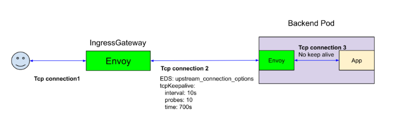
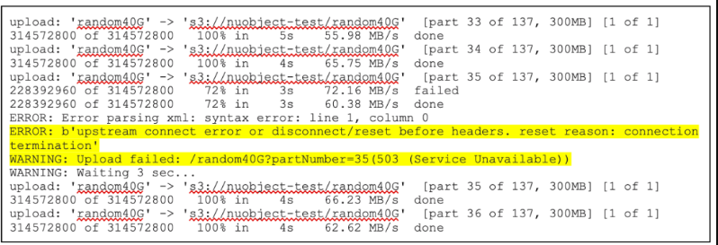
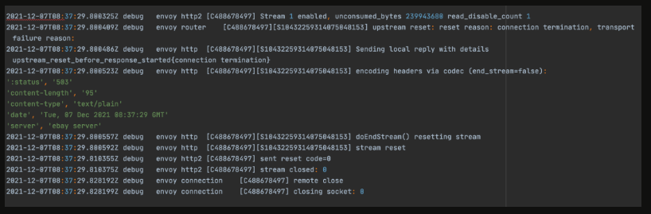
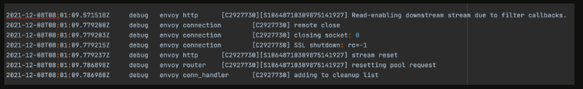
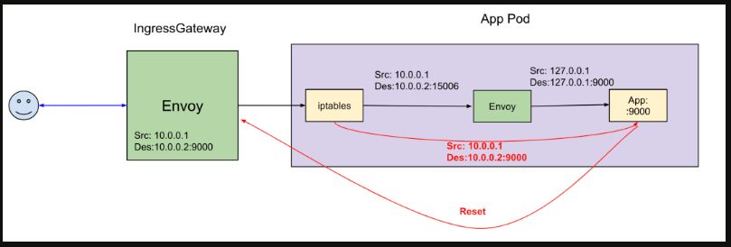

# istio conntrack out of tcp window rest

> [https://maimai.cn/article/detail?fid=1716626083&efid=exAQgZXTj-4Tzk8rKYSjiA](https://maimai.cn/article/detail?fid=1716626083&efid=exAQgZXTj-4Tzk8rKYSjiA)
> [https://mp.weixin.qq.com/s?__biz=MzA3MDMyNDUzOQ==&mid=2650513797&idx=1&sn=84dc4585e79fc7043eb73893da0fc8f4&chksm=873199d1b04610c7ac2fb401eb1ca1210c52126ea4892b1fa17458c602931bf35bbd13f06b56&scene=178&cur_album_id=2017660207224455169#rd](https://mp.weixin.qq.com/s?__biz=MzA3MDMyNDUzOQ==&mid=2650513797&idx=1&sn=84dc4585e79fc7043eb73893da0fc8f4&chksm=873199d1b04610c7ac2fb401eb1ca1210c52126ea4892b1fa17458c602931bf35bbd13f06b56&scene=178&cur_album_id=2017660207224455169#rd)

如今Istio的应用网关在eBay的生产环境中已经得到了广泛的应用，NuObject这一重要应用场景作为eBay新一代的存储服务已经全面替换Swift，其中支撑NuObject的L7负载均衡正是Istio。然而作为Istio早期的上线案例，整个上线过程也断断续续遇到了各种各样的问题，特别是在上传文件时候出现的间歇性连接重置(connection reset)问题。后来经过我们的分析和调试，发现这个问题存在已久，所以分享出来希望能对大家有所帮助。

  NuObject存储服务的部署架构采用Istio Ingress Gateway模式，同时注入sidecar到后端服务，所以是一个api gateway的应用场景，其架构图如图所示：

图1：Ingress Gateway架构

（点击可查看大图）

正常客户端到服务端可能只会有一个TCP连接，但是因为有Ingress Gateway以及Sidecar，这中间涉及到了3个TCP连接，因此也增加了问题排查的难度。

**问题描述**

NuObject每天都会有很多客户上传大量文件，通过日志监控系统，发现用户在上传文件的时候，客户端会遇到连接重置的错误，特别是在上传一个300MB的文件时。这个错误可以通过一段脚本循环上传若干个300MB文件重现，如下就是在上传过程中客户端遇到的错误：

**01**

**上游服务返回503**

通过Isito的dashboard我们能够看到是上游的存储服务返回的503，但无法确认到底是上游应用返回的还是sidecar返回的：

**02**

 **Istio Ingress Gateway访问日志**

从Istio Ingress Gatweay的访问日志中我们可以看到503的报错以及"response_flags":"UC"，即upstream connection failure：

`{"duration":1441,"response_code_details":"upstream_reset_before_response_started{connection_termination}","response_flags":"UC","protocol":"HTTP/2","user_agent":"curl/7.58.0","route_name":null,"request_id":"d0784d05-2b65-4121-b309-a28fe69c91b0","upstream_service_time":null,"connection_termination_details":null,"upstream_transport_failure_reason":null,"path":"/chang/reproduce503/round1/random300M_1","method":"PUT","response_code":503,"bytes_received":268435456,"bytes_sent":95,"start_time":"2021-12-07T08:37:28.358Z"}`

**03**

**Ingress Gateway/Sidecar Envoy日志**

Ingress Gateway本身也是一个Envoy集群，通过开启Ingress Gateway Envoy debug日志，我们看到Gateway Envoy的响应码是503，并且有连接重置的错误，这些错误也正是客户端从Istio IngressGateway获取到的:

因为在应用端注入了sidecar envoy，它负责进行流量劫持和转发，在sidecar这一端我们也看到了连接重置的错误:

**问题分析**

  基于收集到的Ingress Gateway以及Sidecar的metrics和访问日志，基本可以定位到是上游服务返回了503。为了进一步分析原因，我们在上游应用端tcpdump抓包分析。

**01**

**Tcpdump抓包分析**

为了简化tcpdump抓包分析，我们假设只有一个Ingress Gateway Pod以及一个上游应用pod，并且在上游应用注入了sidecar:

Ingress Gateway IP: 10.0.0.1

Gateway端口：443

Sidecar/Application Pod IP: 10.0.0.2

应用监听端口：9000

客户端在访问Ingress Gateway中IP和端口变化如下:

Client -> 10.0.0.1:443 -> 10.0.0.2:9000

其中在Ingress Gateway，通过DNAT，目的地址和端口都发生变化:

10.0.0.1 -> 10.0.0.2:9000

而由于在上游应用的sidecar（这里sidecar和应用处在同一个容器网络）是REDIRECT模式，进站和出站流量都会被劫持，其中入站请求地址和端口的变化如下:

10.0.0.1 -> 10.0.0.2:15006 (iptables): DNAT to change the port to istio inbound

10.0.0.1 -> 10.0.0.2:15006 (envoy): Forward to envoy

127.0.0.1 ->127.0.0.1:9000 -> application: Envoy picks up a new TCP connection to application

下面是在上游应用tcpdump的结果：

通过分析tcpdump的结果，我们发现tcp连接重置的流程如下：

1、Sidecar发送tcp rst到Ingress Gateway

2、Ingress Gateway发送tcp rst到Sidecar

3、Sidecar 发送 tcp fin到application server

4、Sidecar 发送 tcp rst到application server

**02**

**Envoy trace日志分析**

通过分析tcpdump的结果，我们并不能确定到底是envoy还是application发出的rst。于是我们开启了sidecar envoy的trace日志，下面是报错日志：

通过分析envoy源码，代码调用顺序如下：

通过分析Envoy的trace日志以及源码，可以看到报错是发生在调用SSL_read，尝试从连接中读取数据的时候，这里我们推断错误发生的顺序是：socket is reset unexpectedly -> SSL_read return -1 -> doRead failed -> envoy close the connection”。所以当 sidecar envoy开始从ssl_socket 读取数据时，出于某种未知的原因收到了rst包。并且我们尝试了停用sidecar的mutal TLS，但即使是在plaint text的情况下，envoy在do_read的时候依然会出现同样的错误。

由于tcpdump是以libpcap为基础，工作在网络设备层，而iptables是以netfilter为基础，工作在协议层。在接收包的过程中，工作在网络设备层的 tcpdump 先开始工作。还没等 netfilter 过滤，tcpdump 就已经抓到包了。所以通过tcpdump我们并不能找到是谁发送的reset，可能是kernel也可能是envoy，于是我们想到了借助eBPF。

**03**

**eBPF trace**

通过之前的分析，我们可以得出是sidecar envoy给ingress gateway发送TCP reset，但这是一种不正常的行为。基于我们的经验，TCP reset通常发生在当一个连接已经被关闭后服务端仍然从socket中接收数据包。所以接下来我们需要验证socket是否在TCP reset发生之前被关闭，也就是验证是否tcp_close系统调用发生在TCP reset发出之前。

通过检查内核代码，我们可以看到内核里面有两个函数会发送TCP reset，它们分别是tcp_send_active_reset()和tcp_v4_send_reset()

void tcp_send_active_reset(struct sock *sk, gfp_t priority) {

   …

   ...

   tcp_init_nondata_skb(skb, tcp_acceptable_seq(sk),

​         TCPHDR_ACK | TCPHDR_RST); 

}

对tcp_send_active_reset()来说，这种情况下TCP reset包必须要ACK以及RST标志。但是通过抓包分析，我们并没有看到TCP reset包有ACK标志，所以可以断定不是该函数返回的reset。由此可见，真正产生reset的函数只可能是tcp_v4_send_reset()，为了验证socket是否被意外关闭，我们通过eBPF 对kprobe来分析tcp_v4_send_reset,tcp_close,inet_sk_set_state and inet_sk_state_store。

继续我们之前的分析，ingress gateway地址是10.0.0.1，sidecar/app的地址是10.0.0.2。利用eBPF过滤连接10.0.0.1<->10.0.0.2之间的数据包，当TCP reset发生的时候，从eBPF的抓包分析中我们并没有看到在tcp_v4_send_reset之前有tcp_close，所以我们可以排除掉reset的原因是因为连接被关闭导致的。

然后继续检查socket在发生TCP reset时候的具体信息，这里注意到socket的状态是TCP_LISTEN，通过检查内核代码以及TCP连接的状态机我们可以知道，如果一个socket的状态是TCP_LISTEN，它只会接收TCP SYN握手包以建立TCP连接，但是现在它从Ingress Gateway接收到的是数据包，于是导致了TCP reset。

下一个问题：为什么socket的状态会是TCP_LISTEN？当我们检查了socket的地址之后，我们发现导致TCP reset的并不是最开始传输数据的连接，并且发现目的地址是9000而不是15006，到这里就真相大白了。由于Sidecar envoy的拦截机制，envoy监听在15006并且会重定向所有的入站请求到该端口，而应用监听在9000端口，由于某种原因入站的数据包并没有做目的地址的转换（从9000到15006），而是直接到达了应用所监听的socket于是产生了reset。

具体的流程如图2所示：

图2：连接重置

所以真正的原因是因为iptables没有给进站的数据包做NAT。

Linux内核有一个参数：ip_conntrack_tcp_be_liberal，默认是0，也就意味着如果一旦有out of window的数据包，内核默认的行为是将其标志为INVALID，iptables无法对INVALID的数据包进行NAT。又由于没有任何iptables规则来drop这种数据包，最终它被转发到了应用端，而应用端出于LISTENING状态的socket并不能处理该数据包，这也就导致了客户端的connection reset。

/* "Be conservative in what you do,

  be liberal in what you accept from others."

If it's non-zero, we mark only out of window RST segments as INVALID. */

static int nf_ct_tcp_be_liberal __read_mostly = 0;

类似的问题之前已经多次出现过，比如kubernetes社区kube-proxy组件的iptables实现，可以参考文章kube-proxy Subtleties: 

Debugging an Intermittent Connection Reset

http://kubernetes.io/blog/2019/03/29/kube-proxy-subtleties-debugging-an-intermittent-connection-reset/

以及eBay流量管理之Kubernetes网络硬核排查案例：http://mp.weixin.qq.com/s/phcaowQWFQf9dzFCqxSCJA

同社区kube-proxy问题一样，这里我们也同样有两个选项：

1、让 conntrack 对数据包校验更加宽松，不要将out of window的数据包标记为 INVALID。

对linux来说只需要修改内核参数 echo 1 > /proc/sys/net/ipv4/netfilter/ip_conntrack_tcp_be_liberal。但采用这种做法导致一些顾虑：

a、意味着更多out of window的数据包会被允许进入网络协议栈处理。

b、我们并不清楚linux内核默认值设置为0的原因。

 2、专门添加一条 iptables 规则来丢弃标记为 INVALID 的数据包，这样它就不会到达客户端 Pod。

      需要强调的一点是，Istio中的间歇性连接重传的问题是因为sidecar以及iptables而引入的，sidecar在注入的过程中本身也会创建很多iptables的规则，所以第二个方案看起来更合理。于是我们采用方案2来解决这个问题。

eBay正在大规模地将应用迁移到云原生的部署方式以及服务网格治理中，我们正在通过Istio/Envoy替换数据中心的硬件负载均衡并且实现高安全高可用的云原生网络。NuObject是我们第一个规模比较大的案例，尽管一个应用峰值的流量达到了将近40Gb，但我们基于IPVS以及Istio软件负载均衡也经受住了压力。

   但是另外一方面，新的技术方案和架构在生产化实践过程当中不可避免地会遇到一些未知的问题和挑战。最难解决的是那种间歇性出现的错误，比如这次连接重置问题。实际上它从社区的第一天开始就存在，只是很多用户场景可能数据并没有我们这么大，所以重现的概率相对较小；或者说应用场景对可用性的要求不是很高，通过客户端重试来掩盖了这个问题。但是对于我们来说，今后会有更重要的用例（比如支付相关的应用）上线到服务网格以及软件负载均衡，我们需要回答里面的每一个connection reset，每一个5xx以及每一个connection stacking的根因，每一个问题的出现其实也是我们的一个学习的机会。

   相关的修复已经合并到最新的Istio 1.13

http://istio.io/latest/news/releases/1.13.x/announcing-1.13/change-notes/，如果在使用Istio Envoy sidecar的过程中刚好也遇到了connection reset的问题，可以通过配置meshConfig. defaultConfig.proxyMetadata.INVALID_DROP=true，尝试开启这个功能。

   最后这篇文章是团队合作的结果，包括NuObject团队Hang Cun提供脚本能够让我们重现问题，以及Zhang Bo同学通过eBPF最终找到了问题的根因，这也是我们能修复这个问题的关键。另外Zhao Yang同学也帮忙进行了很多tcpdump以及日志分析的工作。这也让我们更加有信心去解决将来我们在软件负载均衡以及服务网格中遇到各种可能的问题。

