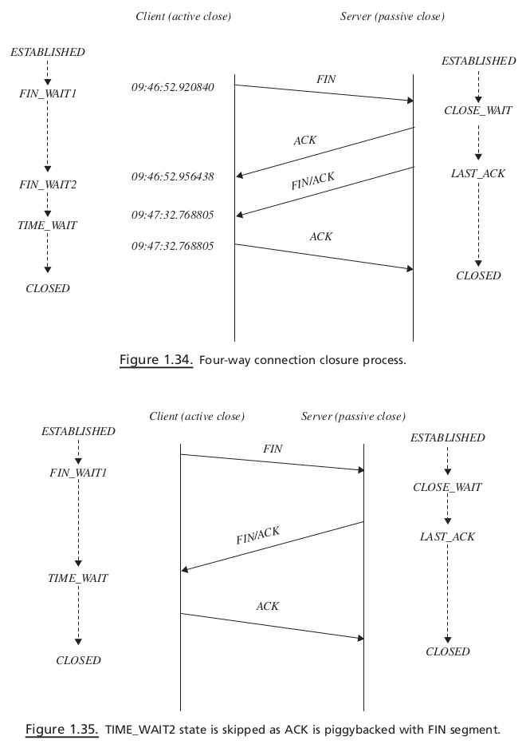
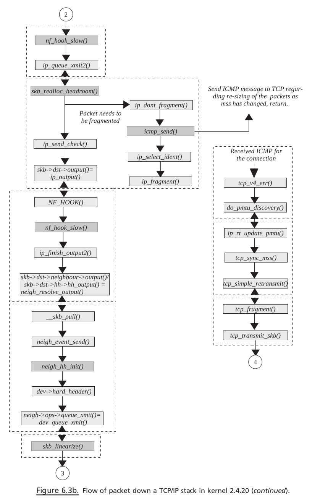

# TCP IP Architecture Design - Sameer Seth

> [TCP IP Architecture Design - Sameer Seth]

## OVERVIEW OF TCP / IP STACK

#### Moving Down the Stack

When an application wants to write data over the TCP socket, 

1. the kernel reaches
   the socket through VFS (see Fig. 1.2 ). `inode` for the file of the type socket contains
   a socket object, which is the starting point for the networking stack (see Section 3.2
   for more details). 
2. The `socket` object has a pointer to a set of operations specific to
   the socket type pointed to by field `ops`. 
3. Object `proto_ops` has a pointer to socket-specific operations. In our case, the socket is of type INET, so `send` system call ends
   up calling `inet_sendmsg()` inside kernel via VFS. 
4. The next step is to call a protocol-specific send routine because there may be different protocols registered under INET socket (see Section 3.1 ). 
5. In our case, transport later is TCP, so `inet_sendmsg()` calls a protocol - specifi c send operation. The protocol-specific socket is represented by a sock object pointed to by the `sk` field of the `socket` object. A protocol - specific set of operation is maintained by a `proto` object pointed to
   by `prot` fi eld of `sock` object. `inet_sendmsg()` calls a protocol - specific send routine,
   which is `tcp_sendmsg()`.
6. In `tcp_sendmsg()` , user data are given to a `TCP segmentation unit`. The segmen-
tation unit breaks big chunks of user data into small blocks and copies each small
block to `sk_buff` . These `sk_buffs` are copied to the socket’ s send buffer, and then
the TCP state machine is consulted to transmit data from socket send buffer. If the
TCP state machine does not allow sending new data because of any reasons, we
return. In such a case, data will be transmitted later by a TCP machine on some
event which is discussed in Section 11.3.11 .
7. If the TCP state machine is able to transmit `sk_buff` , it sends a segment to the
IP layer for further processing. In the case of TCP, `sk -> tp -> af_specifi c -> queue_xmit`
is called, which points to `ip_queue_xmit()` .
8. This routine builds an IP header and takes an IP datagram through the firewall policy.
9. If the policy allows, an IP layer checks if NAT/Masquerading needs to be applied to the outgoing packet.
10. If so, a packet is processed and is finally given to the device for fi nal transmission by a call to `dev_queue_xmit()` .
11. Device refers to a network interface, which is represented by net_device object. At this point, the Linux stack implements QOS. Queuing disciplines are implemented at the device level.
12. Packet ( `sk_buff` ) is queued to the device according to their priority levels and queuing discipline.
13. Next is to dequeue the packet from the device queue, which is done just after queuing `sk_buff` . The queued packet may be transmitted here, depending on the bandwidth for the packet ’ s priority.
14. If so, the link layer header is prepended to the packet, and the device - specifi c hard transmit routine is called to transmit the frame.
15. If we are unable to transmit the frame, the packet is requeued on the device queue and Tx softIRQ is raised on the CPU adding device to the CPU ’ s transmit queue.
    1.  Later on when the TX interrupt is processed, frames are
    dequeued from the device queue and transmitted.

#### Moving Up the Stack

1. We start with the reception of packets at the network interface. Interrupt is generated once the packet is completely DMAed on driver ’ s Rx ring buffer (for details see Section 18.5 ) 
2. In the `interrupt handler`, we just remove the frame from the ring buffer and queue it on CPU’ s input queue(the CPU that is interrupted)
3. Rx NET softIRQ is raised for the CPU by call to `netif_rx()`(Old kernel)
4. Later when Rx `softIRQ` is processed, packets are de - queued from CPU ’ s receive queue and processed one - by - one
5. The packet is processed completely until its destination here, which means that the TCP data packet is processed until the TCP data segment is queued on the socket ’ s receive queue
   1. `netif_receive_skb()` is called to process each packet in Rx softIRQ. The fi rst step is to determine the Internet protocol family to which a packet belongs. This is also known as packet protocol switching.
   2. We send the packet to the `raw socket` in case any `raw socket` is opened for the device.
   3. Once the protocol family is identified, which in our case is IP, we call the protocol handler routine. For IP, this is the `ip_rcv()` routine
   4. `ip_rcv()` tries to de-NAT or de-masquerade the packet at this point, if required.
   5. The routing decisions are made on the packet. If it needs to be delivered locally, the packet is passed through firewall policies configured for the locally acceptable IP packets
   6. If everything is OK, `ip_local_deliver_finish()` is called to find the next protocol layer for the packet.
   7. `ip_local_deliver_finish()` implements INET protocol switching code. Once we identify the INET protocol, its handler is called to further process the IP datagram. The IP datagram may belong to ICMP, UDP, and TCP.
   8. Since our discussion is limited to TCP, the protocol handler is `tcp_v4_rcv()` . The very first job of the TCP handler is to find out socket for the TCP packet. This may be `a new open request` for the `listening socket` or may be another packet for the `established socket`. So here, various `hash tables` are looked into.So here, various hash tables are looked into.
      1. If the packet belongs to the established socket, the TCP engine processes the TCP segment.
         1. If the TCP segment contains in-sequence data, it is queued on the socket’s receive queue
         2. If there are any data to be sent, they is sent along with the the `ACK` for the data arrived here
         3. Finally, when application issues read over the TCP socket, the kernel processes the request by providing data from the socket’ s receive queue.

##### Linux stack maps to the OSI networking model

## SOURCE CODE ORGANIZATION FOR L INUX 2.4.20

##### Kernel source tree

## TCP / IP STACK AND KERNEL CONTROL PATHS

### Packet transmission

 In this section we will see how TCP data are being processed by the Linux kernel. In totality, we will see different `kernel control paths` and `processor context` that are involved in packet processing through the kernel. When the process writes data over the TCP socket, it issues write/send system calls (see Fig. 1.7 ). The system call takes the process from the user land to the kernel, and now the kernel executes on behalf of the process as shown by the solid gray line. Let ’ s determine the different points in the kernel where the kernel thread sending TCP data on behalf of the process preempts itself.

Figure 1.7 Packet transmission via different kernel control paths.:

Kernel Control Path:
1. In this kernel control path, the kernel thread processes TCP data through the complete TCP/IP stack and returns only after transmittingdata from the physical interface.
2. This kernel control path processes data through TCP/IP stack but fails to transmit data because <mark>the device lock could not be obtained.</mark> In this case, the kernel thread returns after raising `Tx softIRQ`. `SoftIRQ` processing is deferred to some later point of time which will transmit data queued up on the device. See Section 17.1 for details on `softIRQ` processing.
   5\. This kernel control path may execute in `interrupt context` or `kernel context`. `Kernel context` may come from softIRQ daemon, which runs as `kernel thread` and has no user context. Kernel context may also come from kernel thread corresponding to user process which enables softIRQ on the CPU by call to `spin_unlock_bh()` . See Section 17.6 for more detail. This kernel control path processes all the data queued by `control path 2`
3. This kernel control path processes data through the TCP layer but is not able to take it further because the QOS policy is not allowing further transmission of data. <mark>It may happen that either someone else is processing the queue on which packet is queued or the quota for queue is over.</mark> In the later case, a timer is installed which will process the queue later.
   6\. This kernel control path executes as a high-priority `tasklet` that is part of `softIRQ`. This may also be executed in `interrupt context` or `kernel context` as discussed above. This processes data queued by `control path 3`.
4. This kernel control path processes data through the TCP layer but cannot proceed any further and returns from here. <mark>The reason may be that the `TCP state machine` or `congestion algorithm` does not allow further transmission of data.</mark> These data will be processed later by the TCP state machine on generation of some TCP event.
   7\. This kernel control path executes as `softIRQ` when incoming TCP packet is being processed. When a packet is received, it is processed by Rx softIRQ. When a TCP packet is processed in softIRQ, it may generate an event causing transmission of pending data in the send queue. This kernel control path transmits data that are queued by `control path 4`.

### Packet reception

Figure 1.8. Packet reception and different kernel control paths.

1. An interrupt handler plucks received a packet from the DMA ring buffer and queues it on the CPU - specifi c input queue and raises Rx softIRQ. 
2. Rx softIRQ is processed at some later point of time in interrupt context or by softIRQ daemon. The TCP data packet is processed completely by Rx softIRQ until it is queued on the socket’s receive queue or is eaten up by the application. 
    - The TCP ACK packet is processed by a TCP state machine, and softIRQ returns only after action is taken on the events generated by the incoming ACK.

## APPLICATION INTERFACES FOR TCP / IP PROGRAMMING

### Socket Options

#### SO_REUSEADDR

Whenever any server application wants to bind to a port  which is already in use by some other application on the same machine, this option  may allow us to use the same port number under certain conditions. This option  sets the reuse fi eld of the sock object.  `tcp_v4_get_port()` is called inside the kernel through a bind path when  application wants to bind to a specifi c port. We traverse through the bind hash list;  and if we fi nd port already occupied and sk → reuse is set more than 1 (line 250, cs  1.9 ), we can directly use the port. Otherwise, if the value of sk → reuse is set to 1  (line 252, cs 1.9 ), it has to go through some additional checks before getting the  port.

#### SO_KEEPALIVE

This option enables a heartbeat mechanism for TCP connec-  tion. An application like telnet may be active for months, where one end never  knows about the other end when connections are ideal. It may happen that the one  end has gone down, in which case the other end will never know. Half - connection  will unnecessarily be open, thereby occupying resources. This option keeps sending  messages to the other end once connection is idle for some time. In return, the  sending end expects acknowledgment. If acknowledgments are not received, the  connection is closed after a certain number of retries.  
When the option is enabled, `tcp_set_keepalive()` is called to set the keepalive  timer for TCP, and sk → keepopen is set to 1. `tcp_set_keepalive()` resets the keepalive  timer in case it is not already set; this is done by calling tcp_reset_keepalive_timer()  (see cs 1.10 , line 568)

#### SO_LINGER
#### SO_SNDBUF
#### SO_RCVBUF
#### SO_RCVTIMEO
#### SO_SNDTIMEO

## TCP STATE

### Connect

### Close

## PROTOCOL FUNDAMENTALS

##### Window Size

 This is a 16 - bit fi eld in the TCP header. TCP detects resource
crunch of its peer with the help of this fi eld and acts accordingly. The fi eld indicates
the receive buffer size available at any point of time. The receive buffer is consumed
when data are received and is vacated as these data are processed and are consumed
by the application. <mark>If the application is not able to consume the data from the receive
buffer as fast as it is received, the receive buffer gets full and eventually the window
size also reduces to 0. When the sender gets this information, it stops sending any
more data until further notice of window size is advertised by the receiving end.</mark>
Each TCP peer declares its window size at the time of synchronisation (connection
initiation). We take this up in Section 2.6 (sliding window).

## TCP DATA FLOW

## TCP TIMERS

### Retransmission Timer

Whenever a TCP sends out data, it needs to make sure that the data have reached
the receiver properly. For that it has to set a timer for the fi rst data segment that is
transmitted. Once the ACK is received for the data, this timer is reset for the next
data segment that was transmitted. The timer would expire after an interval that is
decided by the round - trip time RTT for the route. RTT is the time taken by a data
segment to be acknowledged, which is calculated using the TCP timestamp option.

If the timer expires, we can expect loss of all the segments in the last window trans-
mitted and we start transmitting segments one - by - one from the last window. In this
case we enter the loss state and slowdown rate of data transmission as we can sense
network congestion.

Sometimes the RTT changes due to change in route or change
in transmission medium; in this case, packets may get delayed and timeout may
occur spuriously (check RFC 3522). RFC 2988 specifi es how effective RTO calcula-
tion can be done.

### Persistent Timer

The TCP has its own fl ow control mechanism which is controlled by the buffer size
at the receiving end. The sender TCP gets an idea of the amount of data to be
transmitted from the window size advertised by the receiver. At the receiving end
the data gets queued on the receive buffer, until it is consumed by the application.
If the sender is sending data at a much faster rate than it can be read by the applica-
tion, data will keep on queuing on the receiving TCP ’ s receive socket buffer. It may
also happen that there is no space left out in the receiving TCP ’ s socket buffer. At
this point in time, the receiving TCP advertises a zero window. When the sender
gets zero window indication, it applies fl ow control on data and stops sending any
more data until the receiver opens a window.
In this situation, whenever the application reads data from the receiving TCP ’ s
socket buffer, it generates space in the receive buffer for more data. In this process,
the receiving TCP sends an ACK with a nonzero window. There is a probability that
this ACK gets lost and the sender never gets the window open indication. In this
case there would be a deadlock between the two TCP ends because the receiver
thinks that it has already sent a window open segment and the receiver will send
data whenever it has something, whereas the sender is waiting for a window open
advertisement from the receiver, which it never gets.

<mark>To tackle this situation, the sender TCP sends out a zero - window probe that is
exponentially backed off by way of the persistent timer.</mark> This timer sends out the
next sequence number with no data. Linux sends out one sequence number smaller
than what it has transmitted last.

### Keepalive Timer

### TIME _ WAIT Timer

# KERNEL IMPLEMENTATION OF SOCKETS

## VFS AND SOCKET

Let ’ s examine the kernel data structures and functions related to the socket layer.
`sys_socket()` is the function called in the kernel when user application makes a call
to `socket()` systemcall. The arguments to the socket() systemcall (to sys_socket() ) is
`protocol`, `family`, and `type`. These arguments passed to socket() systemcall is used
by the socket framework to decide the protocol stack to setup. `sys_socket() `does
nothing more than calling `sock_create() `to initialize the socket and sock structure
for the protocol family and links the socket with the VFS by calling `sock_map_fd()`.

For association of VFS and socket, refer to Fig. 3.2 . Each process has a `file table`
that can be accessed from an `fd` field of object `files_struct`. `fd` is a double pointer of
type `file` . Each open file for the process has an associated `file` object linked with `file
descriptor`. `file` objects are indexed into a `file table` with an associated `file descriptor`.

## SOCKET ORGANIZATION IN THE KERNEL

# KERNEL IMPLEMENTATION OF TCP CONNECTION SETUP

## BIND

### Data Structures Related to Socket BIND

- tcp_hashinfo

- tcp_bind_hashbucket

- tcp_bind_bucket

  

### Hash Buckets for tcp Bind

- tcp_ehash = tcp_hashinfo.__tcp_ehash (Fig. 4.4 )__
- __tcp_bhash = tcp_hashinfo.__tcp_bhash (Fig. 4.5 )
- tcp_listening_hash = tcp_hashinfo.__tcp_listening_hash (Fig. 4.6 )

### tcp_ehash

Figure 4.4 illustrates snapshot of hash table for sockets in established state. 

- First half of the hash table is reserved for established sockets and 
- Rest for sockets in `TIME_WAIT` State. 

This hash table is discussed later in the chapter.

### tcp_listening_hash

Figure 4.5 illustrates snapshot of hash table hashing all the sockets in TCP_LISTEN
STATE in the system. Listen hash table is discussed later in the chapter.

### tcp_bhash

Figure 4.6 illustrates snapshot of hash table hashing sockets based on the post to
which they are bound bind hash table is discussed later in the chapter.

### tcp_hashinfo

This structure manages the tcp bind hash bucket. The members of tcp_hashinfo are
as follows:

### tcp _ bind _ hashbucket

This describes the hash bucket and consists of two members:
spinlock _ t lock : This is a lock to protect the collision hash chain chain .
tcp _ bind _ bucket * chain : This is the element of the collision hash chain for the
bind hash bucket.

### tcp_bind_bucket

This structure keeps information about the port number usage by sockets and the
way the port number is being used. The information is useful enough to tell the new
binding socket whether it can bind itself to a particular port number that is already
in use. The data structure also keeps track of all the socket ’ s that are associated with
this port number.
unsigned short port : This is the port number associated with tcp_bind_bucket .
Whenever a socket wants to bind itself to some port which is not in use, we
allocate a new tcp_bind_bucket structure, assign the port number in question
to port , and hash it in the tcp_bind_hashbucket .
signed short fastreuse : This is the fl ag that indicates whether the port number
that is already in use can be reused by a new socket. Whenever a new socket
requests to allocate a port number to it, we check if the port number is
already in use by some other socket. So, we check tcp_bind_hashbucket for
the entry associated with a port number. Now if we have requested to bind
the socket with the port number for which hash entry exists, we check for
the fastreuse fl ag. If this fl ag is set, we are sure that we can bind the socket
with the associated port number and add the socket to the owner ’ s list. In
short, if the fastreuse fl ag is set, we have all the sockets in the owners list,
which are as follows:
1. These sockets are bound to the same TCP port but on different network
interfaces. We can have server applications listening on the same post but
different IP address confi gured on different interfaces.
2. Or all the sockets have a reuse fl ag set and are not listening sockets, which
means that for all the sockets in the owners list the following conditions
should be met:
sk → reuse & & sk → state != TCP_LISTEN
3. Or all the sockets are bound to the same port using same interface, but
the recv_saddr for all the sockets is different

### sys_bind ()

sys_bind() is the function called inside the kernel with three arguments (Fig. 4.7 ).

- fd : This is the socket file descriptor returned by socket call.
- umyaddr : This is the socket address to which we want to bind the socket.
- addrlen : This is the socket address length.

First, we do a lookup for the socket associated with the socket descriptor. This socket
descriptor is nothing but the file descriptor, and it links a socket with the VFS as
shown in Fig. 4.2 . So, we call `sockfd_lookup()` with the socket descriptor.

### sockfd_lookup ()

First the kernel needs to get the `file` structure from the current process ’ s `file table`.
We call `fget() `to do this.

### inet_bind()

### tcp_v4_ get_port ()

Arguments passed to this function is sock structure associated with the socket and
the port number to which a socket needs to be bound. If the port number specifi ed
is 0 in the socket address, we are asking the kernel to fi nd a free port number and
allocate it to the socket. Here we need to select a free local port within the range
specifi ed by sysctl_local_port_range[2] (1024 – 4999). This range can be changed by
using sysctl. tcp_portalloc_lock is a <mark>global lock</mark> that serializes the port allocation. So,
we need to hold the lock here before accessing any of these global variables associ-
ated with port allocation. These are

## LISTEN

Here we need to tell the kernel that we are willing to accept the connections. At
the same time we need to confi gure the socket as to how many socket connections
the kernel should keep in the backlog queue before it starts rejecting the new con-
nection request. The backlog queue for listening sockets may fi ll up for two
reasons:
•
•
In case the kernel is not able to process the request.
In case the application has not invoked accept() systemcall.
Once the backlog queue is full for the socket, the kernel rejects/drops the request.
In the latter case, it sends a message to the client with error code ECONNREFUSED .
listen() systemcall accepts two arguments:

1. Socket descriptor (ret urned by socket() systemcall).
2. Number and length of the backlog queue.
Let ’ s see what happens inside tke kernel when we invoke listen() systemcall.

### sys_listen()

sys_listen() is called inside the kernel with the following arguments (Fig. 4.9 ):

- fd : This is the socket fi le descriptor on which listen operates.
- backlog : This is the length of the backlog queue to handle accepted connection
  requests for the listening socket.

First we try to get the sock entry corresponding to the socket descriptor, `sockfd_lookup()` . This function was explained earlier. Do some sanity check for length of
the backlog queue (should not be more than `SOMAXCONN` ).

### inet_listen()

### tcp_listen_start ()

### Listen Flow

## ACCEPT

## CLIENT SIDE SETUP

### Connect

# MOVEMENT OF sk_buff  ACROSS PROTOCOL LAYERS

## PACKET TRAVERSING DOWN THE TCP / IP STACK

## PACKET TRAVERSING UP THE TCP / IP STACK

### Kernel Path for TCP Packet Traversing Up the Stack

Soft IRQ . SoftIRQ is processed in various places:
1. Just after we returned from the interrupt in interrupt context.
2. SoftIRQ daemon running per CPU.
3. Whenever softIRQ on the CPU is enabled.

In the case where net Rx softIRQ is enabled, `net_rx_action()` is called just after we
return from the interrupt. This will start processing the packet received in the CPU ’ s
input queue. <mark>The packet is processed completely in softIRQ. Even though we are
in interrupt context, the interrupt for the controller is enabled so that NIC can
continue to receive packets and queue them on CPU ’ s input queue.</mark>

# TCP SEND

# TCP RECEIVE

# TCP MEMORY MANAGEMENT

# TCP TIMERS

- Retransmit timer
- Delayed ACK timer
- Zero window probe timer (persistent timer)
- Keep - alive timer

- TIME_WAIT timer
- SYN - ACK timer (timer for listening sockets)

## TIMERS IN LINUX

### When Are Timer Routines Executed?

Timer interrupt fires every 10 ms — that is, one tick. This interrupt raises soft Inter-
rupt to process timers by calling `mark_bh()` from `do_timer()`. To `mark_bh()` we pass
offset in the bh_task_vec[]. mark_bh() calls tasklet_hi_schedule() to schedule the
tasklet pointed to by bh_task_vec [TIMER_BH]. Here we first check if the tasklet
is not already scheduled. In the case where it is not already scheduled, we schedule
it by `calling __tasklet_hi_schedule()` (cs 10.5 ). This ensures that one tasklet is sched-
uled on only one CPU and that also the same tasklet cannot be scheduled on the
same CPU twice. This will schedule the timer tasklet on the CPU currently being
executed on. The tasklet is added to per CPU list tasklet_hi_vec[cpu].list and sub-
sequently HI_SOFTIRQ softirq is raised. On returning from timer interrupt,
do_softirq() is executed, which will check for softirq ’ s to be processed. Here, HI_
SOFTIRQ is processed, which will also process tasklet_hi_vec list for that CPU. This
list includes TIMER_BH tasklet, which gets executed as timer_bh(). run_timer_list()
is called from timer_bh() to execute all the timers from the global list which have
expired.

## TCP RETRANSMIT TIMER

### When Do We Set Retransmit Timer?

### When Do We Reset or Cancel Retransmit Timers?

# TCP CORE PROCESSING

Figure 11.37. Core TCP processing.

# TCP STATE PROCESSING

# NET SOFT IRQ

## HOW ARE SOFT IRQS PROCESSED, AND WHEN?

do_softirq() is called when we:

- Return from interrupt in do_IRQ() (cs 17.10 ). We have just returned from an
  interrupt routine, and there is a chance that some softIRQ is raised as most
  of the interrupt work is done in bottom half now implemented as softIRQ.
  That is the reason why we check here. There may be a chance that softIRQ 

  on the local CPU is disabled because of any valid reason. In this case, any
  softIRQ will not be processed even if raised.

- Enable local bottom halves locally by calling `local_bh_enable()` .
