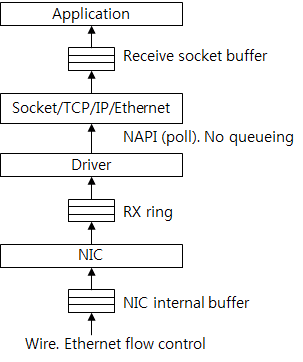

# Understanding TCP/IP Network Stack & Writing Network Apps

> [https://www.cubrid.org/blog/3826497](https://www.cubrid.org/blog/3826497)


## Data Receiving

Now, let's take a look at how data is received. Data receiving is a procedure for how the network stack handles a packet coming in. **Figure 3** shows how the network stack handles a packet received.


**Figure 3: Operation Process by Each Layer of TCP/IP Network Stack for Handling Data Received.**

First, the NIC writes the packet onto its memory. It checks whether the packet is valid by performing the CRC check and then sends the packet to the memory buffer of the host. This buffer is a memory that has already been requested by the driver to the kernel and allocated for receiving packets. After the buffer has been allocated, the driver tells the memory address and size to the NIC. When there is no host memory buffer allocated by the driver even though the NIC receives a packet, the NIC may drop the packet.

After sending the packet to the host memory buffer, the NIC sends an interrupt to the host OS.

Then, the driver checks whether it can handle the new packet or not. So far, the driver-NIC communication protocol defined by the manufacturer is used.

When the driver should send a packet to the upper layer, the packet must be wrapped in a packet structure that the OS uses for the OS to understand the packet. For example, **sk\_buff** of Linux, **mbuf** of BSD-series kernel, and **NET\_BUFFER\_LIST** of Microsoft Windows are the packet structures of the corresponding OS. The driver sends the wrapped packets to the upper layer.

The Ethernet layer checks whether the packet is valid and then de-multiplexes the upper protocol (network protocol). At this time, it uses the ethertype value of the Ethernet header. The IPv4 ethertype value is **0x0800**. It removes the Ethernet header and then sends the packet to the IP layer.

The IP layer also checks whether the packet is valid. In other words, it checks the IP header checksum. It logically determines whether it should perform IP routing and make the local system handle the packet, or send the packet to the other system. If the packet must be handled by the local system, the IP layer de-multiplexes the upper protocol (transport protocol) by referring to the proto value of the IP header. The TCP proto value is 6. It removes the IP header and then sends the packet to the TCP layer.

Like the lower layer, the TCP layer checks whether the packet is valid. It also checks the TCP checksum. As mentioned before, since the current network stack uses the checksum offload, the TCP checksum is computed by NIC, not by the kernel.

Then it searches the `TCP control block` where the packet is connected. At this time, `<source IP, source port, target IP, target port>` of the packet is used as an identifier. After searching the connection, it performs the protocol to handle the packet. If it has received new data, it adds the data to the receive socket buffer. According to the TCP state, it can send a new TCP packet (for example, an ACK packet). Now TCP/IP receiving packet handling has completed.

The size of the receive socket buffer is the TCP receive window. To a certain point, the TCP throughput increases when the receive window is large. In the past, the socket buffer size had been adjusted on the application or the OS configuration. The latest network stack has a function to adjust the receive socket buffer size, i.e., the receive window, automatically.

When the application calls the read system call, the area is changed to the kernel area and the data in the socket buffer is copied to the memory in the user area. The copied data is removed from the socket buffer. And then the TCP is called. The TCP increases the receive window because there is new space in the socket buffer. And it sends a packet according to the protocol status. If no packet is transferred, the system call is terminated.


## Control Flow in the Stack

Now, we will take a more detailed look at the internal flow of the Linux network stack. Like a subsystem which is not a network stack, a network stack basically runs as the event-driven way that reacts when the event occurs. Therefore, there is no separated thread to execute the stack. **Figure 1** and **Figure 3** showed the simplified diagrams of control flow. **Figure 4** below illustrates more exact control flow.


**Figure 4: Control Flow in the Stack.**

- At `Flow (1)` in Figure 4, an application calls a system call to execute (use) the TCP. For example, calls the read system call and the write system call and then executes TCP. However, there is no packet transmission.

- `Flow (2)` is same as `Flow (1)` if it requires packet transmission after executing TCP. It creates a packet and sends down the packet to the driver. A queue is in front of the driver. The packet comes into the queue first, and then the queue implementation structure decides the time to send the packet to the driver. This is queue discipline (**qdisc**) of Linux. The function of Linux traffic control is to manipulate the `qdisc`. The default qdisc is a simple First-In-First-Out (FIFO) queue. By using another qdisc, operators can achieve various effects such as artificial packet loss, packet delay, transmission rate limit, etc. At `Flow (1)` and `Flow (2)`, the process thread of the application also executes the driver.

- `Flow (3)` shows the case in which the timer used by the TCP has expired. For example, when the **TIME\_WAIT** timer has expired, the TCP is called to delete the connection.

- Like `Flow (3)`, `Flow (4)` is the case in which the timer used by the TCP has expired and the TCP execution result packet should be transmitted. For example, when the retransmit timer has expired, the packet of which ACK has not been received is transmitted.

`Flow (3)` and `Flow (4)` show the procedure of executing the timer softirq that has processed the `timer interrupt`.

When the NIC driver receives an interrupt, it frees the transmitted packet. In most cases, execution of the driver is terminated here. `Flow (5)` is the case of packet accumulation in the transmit queue. The driver requests softirq and the softirq handler executes the transmit queue to send the accumulated packet to the driver.

When the NIC driver receives an interrupt and finds a newly received packet, it requests softirq. The softirq that processes the received packet calls the driver and transmits the received packet to the upper layer. In Linux, processing the received packet as shown above is called New API (NAPI). It is similar to polling because the driver does not directly transmit the packet to the upper layer, but the upper layer directly gets the packet. The actual code is called NAPI poll or poll.

`Flow (6)` shows the case that completes execution of TCP, and `Flow (7)` shows the case that requires additional packet transmission. All of `Flow (5)`, `(6)`, and `(7)` are executed by the softirq which has processed the NIC interrupt.


## How to Process Interrupt and Received Packet

Interrupt processing is complex; however, you need to understand the performance issue related to processing of packets received. Figure 5 shows the procedure of processing an interrupt.


**Figure 5: Processing Interrupt, softirq, and Received Packet.**

Assume that the CPU 0 is executing an application program (user program). At this time, the NIC receives a packet and generates an interrupt for the CPU 0. Then the CPU executes the kernel interrupt (called irq) handler. This handler refers to the interrupt number and then calls the driver interrupt handler. The driver frees the packet transmitted and then calls the `napi_schedule()` function to process the received packet. This function requests the softirq (software interrupt).

After execution of the driver interrupt handler has been terminated, the control is passed to the kernel handler. The kernel handler executes the interrupt handler for the softirq.

After the interrupt context has been executed, the softirq context will be executed. The interrupt context and the softirq context are executed by an identical thread. However, they use different stacks. And, the interrupt context blocks hardware interrupts; however, the softirq context allows for hardware interrupts.

The softirq handler that processes the received packet is the `net_rx_action()` function. This function calls the `poll()` function of the driver. The `poll()` function calls the `netif_receive_skb()` function and then sends the received packets one by one to the upper layer. After processing the softirq, the application restarts execution from the stopped point in order to request a system call.

Therefore, the CPU that has received the interrupt processes the received packets from the first to the last. In Linux, BSD, and Microsoft Windows, the processing procedure is basically the same on this wise.

When you check the server CPU utilization, sometimes you can check that only one CPU executes the softirq hard among the server CPUs. The phenomenon occurs due to the way of processing received packets explained so far. To solve the problem, multi-queue NIC, RSS, and RPS have been developed.


## Data Structure

The followings are some key data structures. Take a look at them and review the code.

### sk\_buff structure

First, there is the **sk\_buff** structure or **skb** structure that means a packet. **Figure 6** shows some of the **sk\_buff** structure. As the functions have been advanced, they get more complicated. However, the basic functions are very common that anyone can think.


**Figure 6: Packet Structure sk\_buff.**

### Including Packet Data and _meta data_

The structure directly includes the packet data or refers to it by using a pointer. In **Figure 6**, some of the packets (from Ethernet to buffer) refer to using the data pointer and the additional data (frags) refer to the actual page.

The necessary information such as header and payload length is saved in the meta data area. For example, in **Figure 6**, the mac\_header, the network\_header, and the transport\_header have the corresponding pointer data that points the starting position of the Ethernet header, IP header and TCP header, respectively. This way makes TCP protocol processing easy.

### How to Add or Delete a Header

The header is added or deleted as up and down each layer of the network stack. Pointers are used for more efficient processing. For example, to remove the Ethernet header, just increase the head pointer.

### How to Combine and Divide Packet

The linked list is used for efficient execution of tasks such as adding or deleting packet payload data to the socket buffer, or packet chain. The next pointer and the prev pointer are used for this purpose.

### Quick Allocation and Free

As a structure is allocated whenever creating a packet, the quick allocator is used. For example, if data is transmitted at the speed of 10-Gigabit Ethernet, more than one million packets per second must be created and deleted.

## TCP Control Block

Second, there is a structure that represents the TCP connection. Previously, it was abstractly called a TCP control block. Linux uses tcp\_sock for the structure. In **Figure 7**, you can see the relationship among the file, the socket, and the **tcp\_sock**.


**Figure 7: TCP Connection Structure.**

When a system call has occurred, it searches the file in the file descriptor used by the application that has called the system call. For the Unix-series OS, the socket, the file and the device for general file system for storage are abstracted to a file. Therefore, the file structure includes the least information. For a socket, a separate socket structure saves the socket-related information and the file refers to the socket as a pointer. The socket refers to the **tcp\_sock** again. The **tcp\_sock** is classified into sock, inet\_sock, etc to support various protocols except TCP. It may be considered as a kind of polymorphism.

All status information used by the TCP protocol is saved in the tcp\_sock. For example, the sequence number, receive window, congestion control, and retransmit timer are saved in the **tcp\_sock**.

The send socket buffer and the receive socket buffer are the **sk\_buff** lists and they include the **tcp\_sock**. The dst\_entry, the IP routing result, is referred to in order to avoid too frequent routing. The dst\_entry allows for easy search of the ARP result, i.e., the destination MAC address. The dst\_entry is part of the routing table. The structure of the routing table is very complex that it will not be discussed in this document. The NIC to be used for packet transmission is searched by using the **dst\_entry**. The NIC is expressed as the net\_device structure.

Therefore, by searching just the file, it is very easy to find all structures (from the file to the driver) required to process the TCP connection with the pointer. The size of the structures is the memory size used by one TCP connection. The memory size is a few KBs (excluding the packet data). As more functions have been added, the memory usage has been gradually increased.

Finally, let's see the TCP connection lookup table. It is a hash table used to search the TCP connection where the received packet belongs. The hash value is calculated by using the input data of `<source IP, target IP, source port, target port>` of the packet and the Jenkins hash algorithm. It is told that the hash function has been selected by considering defense against attacks to the hash table.

## Following Code: How to Transmit Data

We will check the key tasks performed by the stack by following the actual Linux kernel source code. Here, we will observe two paths which are frequently used.

First, this is a path used to transmit data when an application calls the write system call.


```
SYSCALL_DEFINE3(write, unsigned` `int``, fd,` `const` `char` `__user *, buf, ...)`

`{`

`struct` `file *file;`

`[...]`

`file = fget_light(fd, &fput_needed);`

`[...] ===>`

`ret = filp->f_op->aio_write(&kiocb, &iov, 1, kiocb.ki_pos);`

`struct` `file_operations {`

`[...]`

`ssize_t (*aio_read) (``struct` `kiocb *,` `const` `struct` `iovec *, ...)`

`ssize_t (*aio_write) (``struct` `kiocb *,` `const` `struct` `iovec *, ...)`

`[...]`

`};`

`static` `const` `struct` `file_operations socket_file_ops = {`

`[...]`

`.aio_read = sock_aio_read,`

`.aio_write = sock_aio_write,`

`[...]`

`};
```

When the application calls the write system call, the kernel performs the `write()` function of the file layer. First, the actual file structure of the file descriptor fd is fetched. And then the **aio\_write** is called. This is the function pointer. In the file structure, you will see the **file\_operations** structure pointer. The structure is generally called function table and includes the function pointers such as aio\_read and **aio\_write**. The actual table for the socket is socket\_file\_ops. The aio\_write function used by the socket is sock\_aio\_write. The function table is used for the purpose that is similar to the Java interface. It is generally used for the kernel to perform code abstraction or refactoring.


```
static` `ssize_t sock_aio_write(``struct` `kiocb *iocb,` `const` `struct` `iovec *iov, ..)`

`{`

`[...]`

`struct` `socket *sock = file->private_data;`

`[...] ===>`

`return` `sock->ops->sendmsg(iocb, sock, msg, size);`

`struct` `socket {`

`[...]`

`struct` `file *file;`

`struct` `sock *sk;`

`const` `struct` `proto_ops *ops;`

`};`

`const` `struct` `proto_ops inet_stream_ops = {`

`.family = PF_INET,`

`[...]`

`.connect = inet_stream_connect,`

`.accept = inet_accept,`

`.listen = inet_listen, .sendmsg = tcp_sendmsg,`

`.recvmsg = inet_recvmsg,`

`[...]`

`};`

`struct` `proto_ops {`

`[...]`

`int` `(*connect) (``struct` `socket *sock, ...)`

`int` `(*accept) (``struct` `socket *sock, ...)`

`int` `(*listen) (``struct` `socket *sock,` `int` `len);`

`int` `(*sendmsg) (``struct` `kiocb *iocb,` `struct` `socket *sock, ...)`

`int` `(*recvmsg) (``struct` `kiocb *iocb,` `struct` `socket *sock, ...)`

`[...]`

`};
```

The `sock_aio_write()` function gets the socket structure from the file and then calls **sendmsg**. It is also the function pointer. The socket structure includes the **proto\_ops** function table. The proto\_ops implemented by the IPv4 TCP is inet\_stream\_ops and the sendmsg is implemented by **tcp\_sendmsg**.

```


`int` `tcp_sendmsg(``struct` `kiocb *iocb,` `struct` `socket *sock,`

`struct` `msghdr *msg,` `size_t` `size)`

`{`

`struct` `sock *sk = sock->sk;`

`struct` `iovec *iov;`

`struct` `tcp_sock *tp = tcp_sk(sk);`

`struct` `sk_buff *skb;`

`[...]`

`mss_now = tcp_send_mss(sk, &size_goal, flags);`

`/* Ok commence sending. */`

`iovlen = msg->msg_iovlen;`

`iov = msg->msg_iov;`

`copied = 0;`

`[...]`

`while` `(--iovlen >= 0) {`

`int` `seglen = iov->iov_len;`

`unsigned` `char` `__user *from = iov->iov_base;`

`iov++;`

`while` `(seglen > 0) {`

`int` `copy = 0;`

`int` `max = size_goal;`

`[...]`

`skb = sk_stream_alloc_skb(sk,`

`select_size(sk, sg),`

`sk->sk_allocation);`

`if` `(!skb)`

`goto` `wait_for_memory;`

`/*`

`* Check whether we can use HW checksum.`

`*/`

`if` `(sk->sk_route_caps & NETIF_F_ALL_CSUM)`

`skb->ip_summed = CHECKSUM_PARTIAL;`

`[...]`

`skb_entail(sk, skb);`

`[...]`

`/* Where to copy to? */`

`if` `(skb_tailroom(skb) > 0) {`

`/* We have some space in skb head. Superb! */`

`if` `(copy > skb_tailroom(skb))`

`copy = skb_tailroom(skb);`

`if` `((err = skb_add_data(skb, from, copy)) != 0)`

`goto` `do_fault;`

`[...]`

`if` `(copied)`

`tcp_push(sk, flags, mss_now, tp->nonagle);`

`[...]`

`}
```

**tcp\_sengmsg** gets tcp\_sock (i.e.,TCP control block) from the socket and copies the data that the application has requested to transmit to the send socket buffer. When copying data to sk\_buff, how many bytes will one sk\_buff include? One sk\_buff copies and includes MSS (tcp\_send\_mss) bytes to help the code that actually creates packets. Maximum Segment Size (MSS) stands for the maximum payload size that one TCP packet includes. By using TSO and GSO, one sk\_buff can save more data than MSS. This will be discussed later, not in this document.

The **sk\_stream\_alloc\_skb** function creates a new **sk\_buff**, and **skb\_entail** adds the new **sk\_buff** to the tail of the **send\_socket\_buffer**. The **skb\_add\_data** function copies the actual application data to the data buffer of the **sk\_buff**. All the data is copied by repeating the procedure (creating an **sk\_buff** and adding it to the send socket buffer) several times. Therefore, **sk\_buffs** at the size of the MSS are in the send socket buffer as a list. Finally, the **tcp\_push** is called to make the data which can be transmitted now as a packet, and the packet is sent.

```


`static` `inline` `void` `tcp_push(``struct` `sock *sk,` `int` `flags,` `int` `mss_now, ...)`

`[...] ===>`

`static` `int` `tcp_write_xmit(``struct` `sock *sk, unsigned` `int` `mss_now, ...)`

`int` `nonagle,`

`{`

`struct` `tcp_sock *tp = tcp_sk(sk);`

`struct` `sk_buff *skb;`

`[...]`

`while` `((skb = tcp_send_head(sk))) {`

`[...]`

`cwnd_quota = tcp_cwnd_test(tp, skb);`

`if` `(!cwnd_quota)`

`break``;`

`if` `(unlikely(!tcp_snd_wnd_test(tp, skb, mss_now)))`

`break``;`

`[...]`

`if` `(unlikely(tcp_transmit_skb(sk, skb, 1, gfp)))`

`break``;`

`/* Advance the send_head. This one is sent out.`

`* This call will increment packets_out.`

`*/`

`tcp_event_new_data_sent(sk, skb);`

`[...]
```

The **tcp\_push** function transmits as many of the **sk\_buffs** in the send socket buffer as the TCP allows in sequence. First, the **tcp\_send\_head** is called to get the first **sk\_buff** in the socket buffer and the **tcp\_cwnd\_test** and the **tcp\_snd\_wnd\_test** are performed to check whether the congestion window and the receive window of the receiving TCP allow new packets to be transmitted. Then, the **tcp\_transmit\_skb** function is called to create a packet.

```


`static` `int` `tcp_transmit_skb(``struct` `sock *sk,` `struct` `sk_buff *skb,`

`int` `clone_it, gfp_t gfp_mask)`

`{`

`const` `struct` `inet_connection_sock *icsk = inet_csk(sk);`

`struct` `inet_sock *inet;`

`struct` `tcp_sock *tp;`

`[...]`

`if` `(likely(clone_it)) {`

`if` `(unlikely(skb_cloned(skb)))`

`skb = pskb_copy(skb, gfp_mask);`

`else`

`skb = skb_clone(skb, gfp_mask);`

`if` `(unlikely(!skb))`

`return` `-ENOBUFS;`

`}`

`[...]`

`skb_push(skb, tcp_header_size);`

`skb_reset_transport_header(skb);`

`skb_set_owner_w(skb, sk);`

`/* Build TCP header and checksum it. */`

`th = tcp_hdr(skb);`

`th->source = inet->inet_sport;`

`th->dest = inet->inet_dport;`

`th->seq = htonl(tcb->seq);`

`th->ack_seq = htonl(tp->rcv_nxt);`

`[...]`

`icsk->icsk_af_ops->send_check(sk, skb);`

`[...]`

`err = icsk->icsk_af_ops->queue_xmit(skb);`

`if` `(likely(err <= 0))`

`return` `err;`

`tcp_enter_cwr(sk, 1);`

`return` `net_xmit_eval(err);`

`}
```

**tcp\_transmit\_skb** creates the copy of the given **sk\_buff** (pskb\_copy). At this time, it does not copy the entire data of the application but the metadata. And then it calls **skb\_push** to secure the header area and records the header field value. Send\_check computes the TCP checksum. With the checksum offload, the payload data is not computed. Finally, **queue\_xmit** is called to send the packet to the IP layer. Queue\_xmit for IPv4 is implemented by the **ip\_queue\_xmit** function.

```


`int` `ip_queue_xmit(``struct` `sk_buff *skb)`

`[...]`

`rt = (``struct` `rtable *)__sk_dst_check(sk, 0);`

`[...]`

`/* OK, we know where to send it, allocate and build IP header. */`

`skb_push(skb,` `sizeof``(``struct` `iphdr) + (opt ? opt->optlen : 0));`

`skb_reset_network_header(skb);`

`iph = ip_hdr(skb);`

`*((__be16 *)iph) = htons((4 << 12) | (5 << 8) | (inet->tos & 0xff));`

`if` `(ip_dont_fragment(sk, &rt->dst) && !skb->local_df)`

`iph->frag_off = htons(IP_DF);`

`else`

`iph->frag_off = 0;`

`iph->ttl = ip_select_ttl(inet, &rt->dst);`

`iph->protocol = sk->sk_protocol;`

`iph->saddr = rt->rt_src;`

`iph->daddr = rt->rt_dst;`

`[...]`

`res = ip_local_out(skb);`

`[...] ===>`

`int` `__ip_local_out(``struct` `sk_buff *skb)`

`[...]`

`ip_send_check(iph);`

`return` `nf_hook(NFPROTO_IPV4, NF_INET_LOCAL_OUT, skb, NULL,`

`skb_dst(skb)->dev, dst_output);`

`[...] ===>`

`int` `ip_output(``struct` `sk_buff *skb)`

`{`

`struct` `net_device *dev = skb_dst(skb)->dev;`

`[...]`

`skb->dev = dev;`

`skb->protocol = htons(ETH_P_IP);`

`return` `NF_HOOK_COND(NFPROTO_IPV4, NF_INET_POST_ROUTING, skb, NULL, dev,`

`ip_finish_output,`

`[...] ===>`

`static` `int` `ip_finish_output(``struct` `sk_buff *skb)`

`[...]`

`if` `(skb->len > ip_skb_dst_mtu(skb) && !skb_is_gso(skb))`

`return` `ip_fragment(skb, ip_finish_output2);`

`else`

`return` `ip_finish_output2(skb);
```

The **ip\_queue\_xmit** function executes tasks required by the IP layers. **\_\_sk\_dst\_check** checks whether the cached route is valid. If there is no cached route or the cached route is invalid, it performs IP routing. And then it calls skb\_push to secure the IP header area and records the IP header field value. After that, as following the function call, **ip\_send\_check** computes the IP header checksum and calls the netfilter function. IP fragment is created when **ip\_finish\_output** function needs IP fragmentation. No fragmentation is generated when TCP is used. Therefore, ip\_finish\_output2 is called and it adds the Ethernet header. Finally, a packet is completed.

```


`int` `dev_queue_xmit(``struct` `sk_buff *skb)`

`[...] ===>`

`static` `inline` `int` `__dev_xmit_skb(``struct` `sk_buff *skb,` `struct` `Qdisc *q, ...)`

`[...]`

`if` `(...) {`

`....`

`}` `else`

`if` `((q->flags & TCQ_F_CAN_BYPASS) && !qdisc_qlen(q) &&`

`qdisc_run_begin(q)) {`

`[...]`

`if` `(sch_direct_xmit(skb, q, dev, txq, root_lock)) {`

`[...] ===>`

`int` `sch_direct_xmit(``struct` `sk_buff *skb,` `struct` `Qdisc *q, ...)`

`[...]`

`HARD_TX_LOCK(dev, txq, smp_processor_id());`

`if` `(!netif_tx_queue_frozen_or_stopped(txq))`

`ret = dev_hard_start_xmit(skb, dev, txq);`

`HARD_TX_UNLOCK(dev, txq);`

`[...]`

`}`

`int` `dev_hard_start_xmit(``struct` `sk_buff *skb,` `struct` `net_device *dev, ...)`

`[...]`

`if` `(!list_empty(&ptype_all))`

`dev_queue_xmit_nit(skb, dev);`

`[...]`

`rc = ops->ndo_start_xmit(skb, dev);`

`[...]`

`}
```

The completed packet is transmitted through the **dev\_queue\_xmit** function. First, the packet passes via the qdisc. If the default qdisc is used and the queue is empty, the **sch\_direct\_xmit** function is called to directly send down the packet to the driver, skipping the queue. **Dev\_hard\_start\_xmit** function calls the actual driver. Before calling the driver, the device TX is locked first. This is to prevent several threads from accessing the device simultaneously. As the kernel locks the device TX, the driver transmission code does not need an additional lock. It is closely related to the parallel processing that will be discussed next time.

**Ndo\_start\_xmit** function calls the driver code. Just before, you will see **ptype\_all** and **dev\_queue\_xmit\_nit**. The ptype\_all is a list that includes the modules such as packet capture. If a capture program is running, the packet is copied by ptype\_all to the separate program. Therefore, the packet that tcpdump shows is the packet transmitted to the driver. When checksum offload or TSO is used, the NIC manipulates the packet. So the tcpdump packet is different from the packet transmitted to the network line. After completing packet transmission, the driver interrupt handler returns the **sk\_buff**.

## Following Code: How to Receive Data

The general executed path is to receive a packet and then to add the data to the receive socket buffer. After executing the driver interrupt handler, follow the napi poll handle first.

```


`static` `void` `net_rx_action(``struct` `softirq_action *h)`

`{`

`struct` `softnet_data *sd = &__get_cpu_var(softnet_data);`

`unsigned` `long` `time_limit = jiffies + 2;`

`int` `budget = netdev_budget;`

`void` `*have;`

`local_irq_disable();`

`while` `(!list_empty(&sd->poll_list)) {`

`struct` `napi_struct *n;`

`[...]`

`n = list_first_entry(&sd->poll_list,` `struct` `napi_struct,`

`poll_list);`

`if` `(test_bit(NAPI_STATE_SCHED, &n->state)) {`

`work = n->poll(n, weight);`

`trace_napi_poll(n);`

`}`

`[...]`

`}`

`int` `netif_receive_skb(``struct` `sk_buff *skb)`

`[...] ===>`

`static` `int` `__netif_receive_skb(``struct` `sk_buff *skb)`

`{`

`struct` `packet_type *ptype, *pt_prev;`

`[...]`

`__be16 type;`

`[...]`

`list_for_each_entry_rcu(ptype, &ptype_all, list) {`

`if` `(!ptype->dev || ptype->dev == skb->dev) {`

`if` `(pt_prev)`

`ret = deliver_skb(skb, pt_prev, orig_dev);`

`pt_prev = ptype;`

`}`

`}`

`[...]`

`type = skb->protocol;`

`list_for_each_entry_rcu(ptype,`

`&ptype_base[ntohs(type) & PTYPE_HASH_MASK], list) {`

`if` `(ptype->type == type &&`

`(ptype->dev == null_or_dev || ptype->dev == skb->dev ||`

`ptype->dev == orig_dev)) {`

`if` `(pt_prev)`

`ret = deliver_skb(skb, pt_prev, orig_dev);`

`pt_prev = ptype;`

`}`

`}`

`if` `(pt_prev) {`

`ret = pt_prev->func(skb, skb->dev, pt_prev, orig_dev);`

`static` `struct` `packet_type ip_packet_type __read_mostly = {`

`.type = cpu_to_be16(ETH_P_IP),`

`.func = ip_rcv,`

`[...]`

`};
```

As mentioned before, the net\_rx\_action function is the softirq handler that receives a packet. First, the driver that has requested the napi poll is retrieved from the **poll\_list** and the poll handler of the driver is called. The driver wraps the received packet with sk\_buff and then calls **netif\_receive\_skb**.

When there is a module that requests all packets, the **netif\_receive\_skb** sends packets to the module. Like packet transmission, the packets are transmitted to the module registered to the ptype\_all list. The packets are captured here.

Then, the packets are transmitted to the upper layer based on the packet type. The Ethernet packet includes 2-byte ethertype field in the header. The value indicates the packet type. The driver records the value in **sk\_buff** (skb->protocol). Each protocol has its own packet\_type structure and registers the pointer of the structure to the ptype\_base hash table. IPv4 uses **ip\_packet\_type**. The Type field value is the IPv4 ethertype (**ETH\_P\_IP**) value. Therefore, the IPv4 packet calls the **ip\_rcv** function.

```


`int` `ip_rcv(``struct` `sk_buff *skb,` `struct` `net_device *dev, ...)`

`{`

`struct` `iphdr *iph;`

`u32 len;`

`[...]`

`iph = ip_hdr(skb);`

`[...]`

`if` `(iph->ihl < 5 || iph->version != 4)`

`goto` `inhdr_error;`

`if` `(!pskb_may_pull(skb, iph->ihl*4))`

`goto` `inhdr_error;`

`iph = ip_hdr(skb);`

`if` `(unlikely(ip_fast_csum((u8 *)iph, iph->ihl)))`

`goto` `inhdr_error;`

`len = ntohs(iph->tot_len);`

`if` `(skb->len < len) {`

`IP_INC_STATS_BH(dev_net(dev), IPSTATS_MIB_INTRUNCATEDPKTS);`

`goto` `drop;`

`}` `else` `if` `(len < (iph->ihl*4))`

`goto` `inhdr_error;`

`[...]`

`return` `NF_HOOK(NFPROTO_IPV4, NF_INET_PRE_ROUTING, skb, dev, NULL,`

`ip_rcv_finish);`

`[...] ===>`

`int` `ip_local_deliver(``struct` `sk_buff *skb)`

`[...]`

`if` `(ip_hdr(skb)->frag_off & htons(IP_MF | IP_OFFSET)) {`

`if` `(ip_defrag(skb, IP_DEFRAG_LOCAL_DELIVER))`

`return` `0;`

`}`

`return` `NF_HOOK(NFPROTO_IPV4, NF_INET_LOCAL_IN, skb, skb->dev, NULL,`

`ip_local_deliver_finish);`

`[...] ===>`

`static` `int` `ip_local_deliver_finish(``struct` `sk_buff *skb)`

`[...]`

`__skb_pull(skb, ip_hdrlen(skb));`

`[...]`

`int` `protocol = ip_hdr(skb)->protocol;`

`int` `hash, raw;`

`const` `struct` `net_protocol *ipprot;`

`[...]`

`hash = protocol & (MAX_INET_PROTOS - 1);`

`ipprot = rcu_dereference(inet_protos[hash]);`

`if` `(ipprot != NULL) {`

`[...]`

`ret = ipprot->handler(skb);`

`[...] ===>`

`static` `const` `struct` `net_protocol tcp_protocol = {`

`.handler = tcp_v4_rcv,`

`[...]`

`};
```

The **ip\_rcv** function executes tasks required by the IP layers. It examines packets such as the length and header checksum. After passing through the netfilter code, it performs the **ip\_local\_deliver** function. If required, it assembles IP fragments. Then, it calls **ip\_local\_deliver\_finish** through the netfilter code. The **ip\_local\_deliver\_finish** function removes the IP header by using the \_\_skb\_pull and then searches the upper protocol whose value is identical to the IP header protocol value. Similar to the Ptype\_base, each transport protocol registers its own **net\_protocol** structure in **inet\_protos**. IPv4 TCP uses **tcp\_protocol** and calls **tcp\_v4\_rcv** that has been registered as a handler.

When packets come into the TCP layer, the packet processing flow varies depending on the TCP status and the packet type. Here, we will see the packet processing procedure when the expected next data packet has been received in the **ESTABLISHED** status of the TCP connection. This path is frequently executed by the server receiving data when there is no packet loss or out-of-order delivery.

```


`int` `tcp_v4_rcv(``struct` `sk_buff *skb)`

`{`

`const` `struct` `iphdr *iph;`

`struct` `tcphdr *th;`

`struct` `sock *sk;`

`[...]`

`th = tcp_hdr(skb);`

`if` `(th->doff <` `sizeof``(``struct` `tcphdr) / 4)`

`goto` `bad_packet;`

`if` `(!pskb_may_pull(skb, th->doff * 4))`

`goto` `discard_it;`

`[...]`

`th = tcp_hdr(skb);`

`iph = ip_hdr(skb);`

`TCP_SKB_CB(skb)->seq = ntohl(th->seq);`

`TCP_SKB_CB(skb)->end_seq = (TCP_SKB_CB(skb)->seq + th->syn + th->fin +`

`skb->len - th->doff * 4);`

`TCP_SKB_CB(skb)->ack_seq = ntohl(th->ack_seq);`

`TCP_SKB_CB(skb)->when = 0;`

`TCP_SKB_CB(skb)->flags = iph->tos;`

`TCP_SKB_CB(skb)->sacked = 0;`

`sk = __inet_lookup_skb(&tcp_hashinfo, skb, th->source, th->dest);`

`[...]`

`ret = tcp_v4_do_rcv(sk, skb);
```

First, the **tcp\_v4\_rcv** function validates the received packets. When the header size is larger than the data offset (`th->doff < sizeof(struct tcphdr) / 4`), it is the header error. And then **\_\_inet\_lookup\_skb** is called to look for the connection where the packet belongs from the TCP connection hash table. From the sock structure found, all required structures such as **tcp\_sock** and socket can be got.

```


`int` `tcp_v4_do_rcv(``struct` `sock *sk,` `struct` `sk_buff *skb)`

`[...]`

`if` `(sk->sk_state == TCP_ESTABLISHED) {` `/* Fast path */`

`sock_rps_save_rxhash(sk, skb->rxhash);`

`if` `(tcp_rcv_established(sk, skb, tcp_hdr(skb), skb->len)) {`

`[...] ===>`

`int` `tcp_rcv_established(``struct` `sock *sk,` `struct` `sk_buff *skb,`

`[...]`

`/*`

`* Header prediction.`

`*/`

`if` `((tcp_flag_word(th) & TCP_HP_BITS) == tp->pred_flags &&`

`TCP_SKB_CB(skb)->seq == tp->rcv_nxt &&`

`!after(TCP_SKB_CB(skb)->ack_seq, tp->snd_nxt))) {`

`[...]`

`if` `((``int``)skb->truesize > sk->sk_forward_alloc)`

`goto` `step5;`

`NET_INC_STATS_BH(sock_net(sk), LINUX_MIB_TCPHPHITS);`

`/* Bulk data transfer: receiver */`

`__skb_pull(skb, tcp_header_len);`

`__skb_queue_tail(&sk->sk_receive_queue, skb);`

`skb_set_owner_r(skb, sk);`

`tp->rcv_nxt = TCP_SKB_CB(skb)->end_seq;`

`[...]`

`if` `(!copied_early || tp->rcv_nxt != tp->rcv_wup)`

`__tcp_ack_snd_check(sk, 0);`

`[...]`

`step5:`

`if` `(th->ack && tcp_ack(sk, skb, FLAG_SLOWPATH) < 0)`

`goto` `discard;`

`tcp_rcv_rtt_measure_ts(sk, skb);`

`/* Process urgent data. */`

`tcp_urg(sk, skb, th);`

`/* step 7: process the segment text */`

`tcp_data_queue(sk, skb);`

`tcp_data_snd_check(sk);`

`tcp_ack_snd_check(sk);`

`return` `0;`

`[...]`

`}
```

The actual protocol is executed from the **tcp\_v4\_do\_rcv** function. If the TCP is in the ESTABLISHED status, **tcp\_rcv\_esablished** is called. Processing of the **ESTABLISHED** status is separately handled and optimized since it is the most common status. The **tcp\_rcv\_established** first executes the header prediction code. The header prediction is also quickly processed to detect in the common state. The common case here is that there is no data to transmit and the received data packet is the packet that must be received next time, i.e., the sequence number is the sequence number that the receiving TCP expects. In this case, the procedure is completed by adding the data to the socket buffer and then transmitting ACK.

Go forward and you will see the sentence comparing truesize with sk\_forward\_alloc. It is to check whether there is any free space in the receive socket buffer to add new packet data. If there is, header prediction is "hit" (prediction succeeded). Then **\_\_skb\_pull** is called to remove the TCP header. After that, **\_\_skb\_queue\_tail** is called to add the packet to the receive socket buffer. Finally, **\_\_tcp\_ack\_snd\_check** is called for transmitting ACK if necessary. In this way, packet processing is completed.

If there is not enough free space, a slow path is executed. The tcp\_data\_queue function newly allocates the buffer space and adds the data packet to the socket buffer. At this time, the receive socket buffer size is automatically increased if possible. Different from the quick path, **tcp\_data\_snd\_check** is called to transmit a new data packet if possible. Finally, **tcp\_ack\_snd\_check** is called to create and transmit the ACK packet if necessary.

The amount of code executed by the two paths is not much. This is accomplished by optimizing the common case. In other words, it means that the uncommon case will be processed significantly more slowly. The out-of-order delivery is one of the uncommon cases.

## How to Communicate between Driver and NIC

Communication between a driver and the NIC is the bottom of the stack and most people do not care about it. However, the NIC is executing more and more tasks to solve the performance issue. Understanding the basic operation scheme will help you understand the additional technology.

A driver and the NIC asynchronously communicate. First, a driver requests packet transmission (call) and the CPU performs another task without waiting for the response. And then the NIC sends packets and notifies the CPU of that, the driver returns the received packets (returns the result). Like packet transmission, packet receiving is asynchronous. First, a driver requests packet receiving and the CPU performs another task (call). Then, the NIC receives packets and notifies the CPU of that, and the driver processes the received packets received (returns the result).

Therefore, a space to save the request and the response is necessary. In most cases, the NIC uses the ring structure. The ring is similar to the common queue structure. With the fixed number of entries, one entry saves one request data or one response data. The entries are sequentially used in turn. The name "ring" is generally used since the fixed entries are reused in turn.

As following the packet transmission procedure shown in the following **Figure 8**, you will see how the ring is used.


**Figure 8: Driver-NIC Communication: How to Transmit Packet.**

The driver receives packets from the upper layer and creates the send descriptor that the NIC can understand. The send descriptor includes the packet size and the memory address by default. As the NIC needs the physical address to access the memory, the driver should change the virtual address of the packets to the physical address. Then, it adds the send descriptor to the TX ring (1). The TX ring is the send descriptor ring.

Next, it notifies the NIC of the new request (2). The driver directly writes the data to a specific NIC memory address. In this way, Programmed I/O (PIO) is the data transmission method in which the CPU directly sends data to the device.

The notified NIC gets the send descriptor of the TX ring from the host memory (3). Since the device directly accesses the memory without intervention of the CPU, the access is called Direct Memory Access (DMA).

After getting the send descriptor, the NIC determines the packet address and the size and then gets the actual packets from the host memory (4). With the checksum offload, the NIC computes the checksum when the NIC gets the packet data from the memory. Therefore, overhead rarely occurs.

The NIC sends packets (5) and then writes the number of packets that are sent to the host memory (6). Then, it sends an interrupt (7). The driver reads the number of packets that are sent and then returns the packets that have been sent so far.

In the following **Figure 9**, you will see the procedure of receiving packets.


**Figure 9: Driver-NIC Communication: How to Receive Packets.**

First, the driver allocates the host memory buffer for receiving packets and then creates the receive descriptor. The receive descriptor includes the buffer size and the memory address by default. Like the send descriptor, it saves the physical address that the DMA uses in the receive descriptor. Then, it adds the receive descriptor to the RX ring (1). It is the receive request and the RX ring is the receive request ring.

Through the PIO, the driver notifies that there is a new descriptor in the NIC (2). The NIC gets the new descriptor of the RX ring. And then it saves the size and location of the buffer included in the descriptor to the NIC memory (3).

After the packets have been received (4), the NIC sends the packets to the host memory buffer (5). If the checksum offload function is existing, the NIC computes the checksum at this time. The actual size of received packets, the checksum result, and any other information are saved in the separate ring (the receive return ring) (6). The receive return ring saves the result of processing the receive request, i.e., the response. And then the NIC sends an interrupt (7). The driver gets packet information from the receive return ring and processes the received packets. If necessary, it allocates new memory buffer and repeats Step (1) and Step (2).

To tune the stack, most people say that the ring and interrupt setting should be adjusted. When the TX ring is large, a lot of send requests can be made at once. When the RX ring is large, a lot of packet receives can be done at once. A large ring is useful for the workload that has a huge burst of packet transmission/receiving. In most cases, the NIC uses a timer to reduce the number of interrupts since the CPU may suffer from large overhead to process interrupts. To avoid flooding the host system with too many interrupts, interrupts are collected and sent regularly(interrupt coalescing) while sending and receiving the packets.

## Stack Buffer and Flow Control

Flow control is executed in several stages in the stack. **Figure 10** shows buffers used to transmit data. First, an application creates data and adds it to the send socket buffer. If there is no free space in the buffer, the system call is failed or the blocking occurs in the application thread. Therefore, the application data rate flowing into the kernel must be controlled by using the socket buffer size limit.


**Figure 10: Buffers Related to Packet Transmission.**

The TCP creates and sends packets to the driver through the transmit queue (qdisc). It is a typical FIFO queue type and the maximum length of the queue is the value of txqueuelen which can be checked by executing the ifconfig command. Generally, it is thousands of packets.

The TX ring is between the driver and the NIC. As mentioned before, it is considered as a transmission request queue. If there is no free space in the queue, no transmission request is made and the packets are accumulated in the transmit queue. If too many packets are accumulated, packets are dropped.

The NIC saves the packets to transmit in the internal buffer. The packet rate from this buffer is affected by the physical rate (ex: 1 Gb/s NIC cannot offer performance of 10 Gb/s). And with the Ethernet flow control, packet transmission is stopped if there is no free space in the receive NIC buffer.

When the packet rate from the kernel is faster than the packet rate from the NIC, packets are accumulated in the buffer of the NIC. If there is no free space in the buffer, processing of transmission request from the TX ring is stopped. More and more requests are accumulated in the TX ring and finally there is no free space in the queue. The driver cannot make any transmission request and the packets are accumulated in the transmit queue. Like this, backpressure is sent from the bottom to the top through many buffers.

**Figure 11** shows the buffers that the receive packets are passing. The packets are saved in the receive buffer of the NIC. From the view of flow control, the RX ring between the driver and the NIC is considered as a packet buffer. The driver gets packets coming into the RX ring and then sends them to the upper layer. There is no buffer between the driver and the upper layer since the NIC driver that is used by the server system uses NAPI by default. Therefore, it can be considered as the upper layer directly gets packets from the RX ring. The payload data of packets is saved in the receive socket buffer. The application gets the data from the socket buffer later.



**Figure 11: Buffers Related to Packet Receiving.**

The driver that does not support NAPI saves packets in the backlog queue. Later, the NAPI handler gets packets. Therefore, the backlog queue can be considered as a buffer between the upper layer and the driver.

If the packet processing rate of the kernel is slower than the packet flow rate into the NIC, the RX ring space is full. And the space of the buffer in the NIC is full, too. When the Ethernet flow control is used, the NIC sends a request to stop transmission to the transmission NIC or makes the packet drop.

There is no packet drop due to lack of space in the receive socket buffer because the TCP supports end-to-end flow control. However, packet drop occurs due to lack of space in the socket buffer when the application rate is slow because the UDP does not support flow control.

The sizes of the TX ring and the RX ring used by the driver in **Figure 10** and **Figure 11** are the sizes of the rings shown by the ethtool. For most workloads which regard throughput as important, it will be helpful to increase the ring size and the socket buffer size. Increasing the sizes reduces the possibility of failures caused by lack of space in the buffer while receiving and transmitting a lot of packets at a fast rate.

## Conclusion

Initially, I planned to explain only the things that would be helpful for you to develop network programs, execute performance tests, and perform troubleshooting. In spite of my initial plan, the amount of description included in this document is not small. I hope this document will help you to develop network applications and monitor their performance. The TCP/IP protocol itself is very complicated and has many exceptions. However, you don't need to understand every line of TCP/IP-related code of the OS to understand performance and analyze the phenomena. Just understanding its context will be very helpful for you.

With continuous advancement of system performance and implementation of the OS network stack, the latest server can offer 10-20 Gb/s TCP throughput without any problem. These days, there are too many technology types related to performance, such as TSO, LRO, RSS, GSO, GRO, UFO, XPS, IOAT, DDIO, and TOE, just like alphabet soup, to make us confused.

In the next article, I will explain about the network stack from the performance perspective and discuss the problems and effects of this technology.

By Hyeongyeop Kim, Senior Engineer at Performance Engineering Lab, NHN Corporation.


