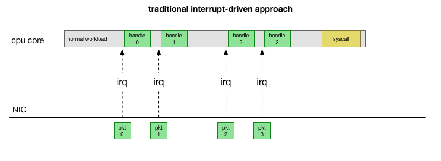
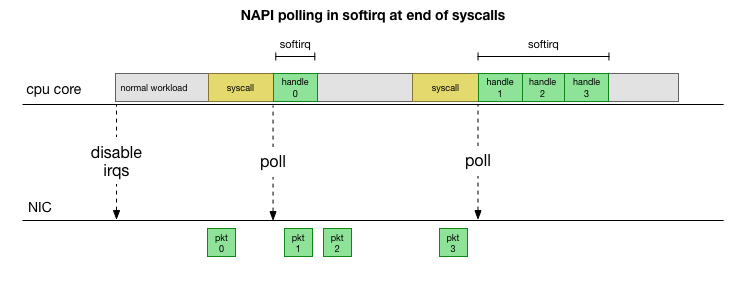
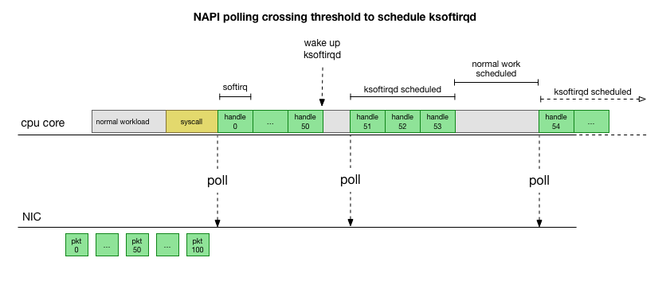
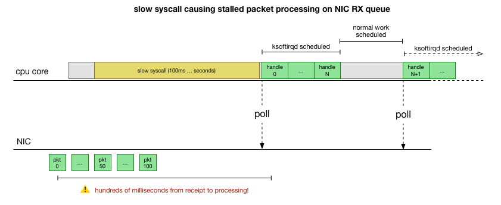
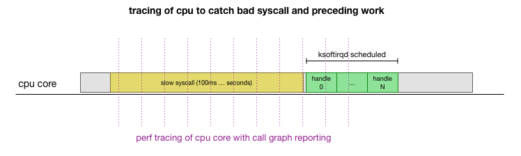

# Debugging network stalls on Kubernetes

> [https://github.blog/2019-11-21-debugging-network-stalls-on-kubernetes/](https://github.blog/2019-11-21-debugging-network-stalls-on-kubernetes/)


## Deep dive into Linux kernel packet processing

To understand why the problem could be on the receiving side on some kube-node servers, let’s take a look at how the Linux kernel processes packets.

Going back to the simplest traditional implementation, the network card receives a packet and sends an [interrupt](https://en.wikipedia.org/wiki/Interrupt) to the Linux kernel stating that there’s a packet that should be handled. The kernel stops other work, switches context to the interrupt handler, processes the packet, then switches back to what it was doing.




This context switching is slow, which may have been fine on a 10Mbit NIC in the 90s, but on modern servers where the NIC is 10G and at maximal line rate can bring in around 15 million packets per second, on a smaller server with eight cores that could mean the kernel is interrupted millions of times per second per core.

Instead of constantly handling interrupts, many years ago Linux added [NAPI](https://en.wikipedia.org/wiki/New_API), the networking API that modern drivers use for improved performance at high packet rates. At low rates, the kernel still accepts interrupts from the NIC in the method we mentioned. Once enough packets arrive and cross a threshold, it disables interrupts and instead begins polling the NIC and pulling off packets in batches. This processing is done in a “softirq”, or [software interrupt context](https://www.kernel.org/doc/htmldocs/kernel-hacking/basics-softirqs.html). This happens at the end of `syscalls` and `hardware interrupts`, which are times that the kernel (as opposed to userspace) is already running.




This is much faster, but brings up another problem. What happens if we have so many packets to process that we spend all our time processing packets from the NIC, but we never have time to let the userspace processes actually drain those queues (read from TCP connections, etc.)? Eventually the queues would fill up, and we’d start dropping packets. To try and make this fair, the kernel limits the amount of packets processed in a given softirq context to a certain `budget`. Once this budget is exceeded, it wakes up a separate thread called `ksoftirqd` (you’ll see one of these in ps for each core) which processes these softirqs outside of the normal `syscall`/`interrupt path`. This thread is scheduled using the standard process scheduler, which already tries to be fair.




With an overview of the way the kernel is processing packets, we can see there is definitely opportunity for this processing to become stalled. <mark>If the time between softirq processing calls grows, packets could sit in the NIC RX queue for a while before being processed. This could be something deadlocking the CPU core, or it could be something slow preventing the kernel from running softirqs.</mark>


## What is cadvisor doing to stall things?

With the understanding of how the stall can happen, the process causing it, and the CPU core it’s happening on, we now have a pretty good idea of what this looks like. For the kernel to hard block and not schedule `ksoftirqd` earlier, and given we see packets processed under `cadvisor`’s softirq context, it’s likely that `cadvisor` is running a slow syscall which ends with the rest of the packets being processed:




That’s a theory but how do we validate this is actually happening? One thing we can do is trace what’s running on the CPU core throughout this process, catch the point where the packets are overflowing budget and processed by ksoftirqd, then look back a bit to see what was running on the CPU core. Think of it like taking an x-ray of the CPU every few milliseconds. It would look something like this:



Conveniently, this is something that’s already mostly supported. The [`perf record`](https://perf.wiki.kernel.org/index.php/Tutorial#Sampling_with_perf_record) tool samples a given CPU core at a certain frequency and can generate a call graph of the live system, including both userspace and the kernel. Taking that recording and manipulating it using a quick fork of a tool from [Brendan Gregg’s FlameGraph](https://github.com/brendangregg/FlameGraph) that retained stack trace ordering, we can get a one-line stack trace for each 1ms sample, then get a sample of the 100ms before `ksoftirqd` is in the trace:

```bash
# record 999 times a second, or every 1ms with some offset so not to align exactly with timers
sudo perf record -C 11 -g -F 999
# take that recording and make a simpler stack trace.
sudo perf script 2>/dev/null | ./FlameGraph/stackcollapse-perf-ordered.pl | grep ksoftir -B 100
```


