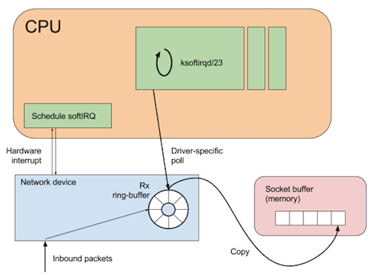
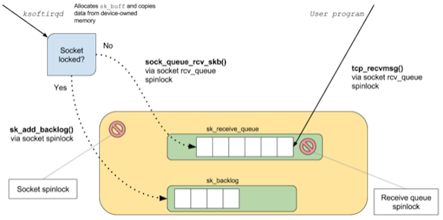
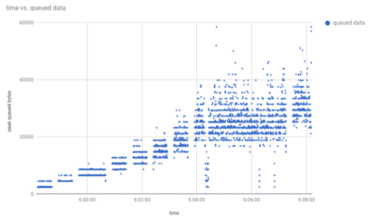
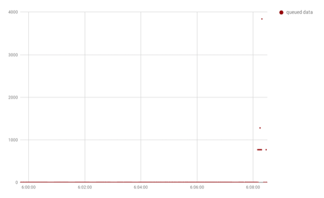

# The Linux networking stack - Testing Cassandra Throughput Performance Part 3

> [https://medium.com/linode-cube/testing-cassandra-throughput-performance-part-3-of-3-a5648e57f1fb](https://medium.com/linode-cube/testing-cassandra-throughput-performance-part-3-of-3-a5648e57f1fb)

Over the last two posts in this series, I’ve looked at performing simple load-tests against a Cassandra server, and using Linux monitoring tools to observe how the server process is utilising system CPU resources.

When pushing a client/server architecture towards its throughput limits, there is another possible bottleneck that is worth investigating: the network layer.

## The Linux networking stack

Before looking at whether there is a problem in this area, here’s a quick recap of how packet-receipt works in the Linux operating system.



When a network packet arrives, it is added to the network device’s receive (Rx) ring-buffer, and an interrupt is raised on the CPU associated with that ring-buffer. A network device may have many ring-buffers, and their interrupts can be spread across multiple CPUs.

Modern network devices take advantage of a feature called *interrupt coalescing* to reduce the number of hardware interrupts raised during high packet rates. This optimisation is important as a hardware interrupt will usurp any running code on a CPU.

Specifically, the code that should not be interrupted is the *softirq daemon*. This is the mechanism that deals with copying the network data from the device ring-buffer into a kernel socket-buffer. If the device were to continually interrupt the softirq process, then the kernel would fail to move packets to the socket buffer, increasing the possibility of dropped packets. When the softirq process attempts to dequeue a batch of packets the network driver will temporarily disable interrupts. (This is known as *NAPI polling* and is beyond the scope of this article.)



Whilst copying the network packets to the socket-buffer, the softirq process also performs filtering, processing and validation along the way. Once the packets are copied to the socket-buffer, they are available to the user-space program that is attempting to read from the socket. If there is a bottleneck somewhere in the network stack, then it will show up in the form of queueing or packet drops.

Queueing in kernel-space would show up as *time-squeeze* events in the softirq daemon (meaning that the softirq process was descheduled from the CPU while it still had packets to process); these can be observed in the file /proc/net/softnet_stats. (More on this later.)

If the receiving user-space application is not able to process packets from the socket-buffer fast enough, then the amount of data in the socket-buffer will spike and increase. One source of this information is the file /proc/net/tcp (for TCPv4 connections), maintained by the kernel, and containing a row for each active network connection on the system.

The data items of interest are the *tx_queue* and *rx_queue* columns, which display the currently queued bytes in the socket-buffer. In the case of a send-side connection, *tx_queue* reports the number of bytes that the user-space application has sent to the socket, but which have not yet been processed by the kernel for outbound delivery.

In the case of a receive-side connection, *rx_queue* reports the number of bytes that the kernel has copied into the socket-buffer (through the process described above), but have not yet been processed by the application.


## Measuring is better than sampling

Given the two data sources listed above, I could check the *time-squeeze* counters before and after a load-test to check for queueing on the kernel side, but I would have to poll the *tx_queue* and *rx_queue* values since they are gauges — they represent a snapshot of currently queued bytes.

Using a polling method to read gauges is not an ideal solution, as it is possible for spikes in the socket-buffer depth to rise and fall between polls. If possible, it is best to *measure* these gauges every time data is queued/de-queued and record some aggregate metric.

[eBPF](http://www.brendangregg.com/ebpf.html) is the perfect tool for this kind of task. I can write a program that will use a kernel-probe to record the amount of data queued in each socket, and report out a maximum queued amount per-second. Since this probe will run in the kernel context, and just perform a map lookup and integer addition, it will be very cheap and should not negatively affect application performance.

The [BCC](https://github.com/iovisor/bcc) project has a number of utilities for interacting with eBPF programs using Python. So in order to monitor queueing in the socket-buffer, I can write a small C program that will be inserted into the kernel, and deploy a user-space Python program to report out summary metrics.

Since I’ll need access to the socket-buffer, in order to determine the amount of queued bytes, I’ll insert the kernel-probe at a useful point in the TCP receive code-path. I’ve arbitrarily chosen the function [tcp_v4_do_rcv](http://elixir.free-electrons.com/linux/v4.4.84/source/net/ipv4/tcp_ipv4.c%23L1384) as it has both the socket and incoming packet available.

## Tracing packet receipt

In order to capture the required data, the [eBPF program](https://github.com/epickrram/grav/blob/master/src/network/socket_depth.py) first mirrors the signature of the tcp_v4_do_rcv method, and maintains a mapping of socket identifier to max buffered bytes. In this way, I can monitor how the reading application (here, the Cassandra server) is managing to process incoming packets.

The trace function (run in the kernel context):

```
int trace_socket_rcv(struct pt_regs *ctx, struct sock *sk, struct sk_buff *skb) {
u16 dport = 0, family = sk->__sk_common.skc_family;
if (family == AF_INET) {
struct ipv4_key_t ipv4_key = {};
ipv4_key.saddr = sk->__sk_common.skc_rcv_saddr;
ipv4_key.daddr = sk->__sk_common.skc_daddr;
ipv4_key.lport = sk->__sk_common.skc_num;
dport = sk->__sk_common.skc_dport;
ipv4_key.dport = ntohs(dport);
u64 zero = 0, *total, *max;
int rmem = sk->sk_rmem_alloc.counter;
total = total_rcv_mem.lookup_or_init(&ipv4_key, &zero);
(*total) += rmem + skb->data_len;
max = peak_rcv_mem.lookup_or_init(&ipv4_key, &zero);
if (rmem > (*max)) {
(*max) = rmem + skb->data_len;
}
}
return 0;
};
```

The reporting program (run in user-space)

First, define the attach point for the tracing function:

```
bpf = BPF(text=prog)bpf.attach_kprobe(event=”tcp_v4_do_rcv”, fn_name=”trace_socket_rcv”)
```

Then, loop forever reporting out the max depth per socket:

```
while True:
time.sleep(1)
current_time = datetime.datetime.now()
total_depth = bpf[“total_rcv_mem”]
max_depth = bpf[“peak_rcv_mem”]
if len(total_depth) == 0 and len(max_depth) == 0:
print “No data captured”
else:
for socket, total in total_depth.iteritems():
t.write(“{0},{1},{2},{3}\n”.
format(current_time.strftime(“%H:%M:%S”), current_time.strftime(“%s”), to_socket_key(socket), total.value))
for socket, peak in max_depth.iteritems():
p.write(“{0},{1},{2},{3}\n”.
format(current_time.strftime(“%H:%M:%S”), current_time.strftime(“%s”), to_socket_key(socket), peak.value))
total_depth.clear()
max_depth.clear()
```

This generates a CSV file reporting a timestamp, source socket address, target socket address, and socket-buffer depth:

07:24:32,1504333472,192.168.0.5:60852,163.172.101.56:80,290926

## Monitoring message flow

The client-server architecture of the load-test means that there could be queueing in both directions (i.e., client->server or server->client), either of which could affect the load-test results. I’m going to assume that there is no queueing on the outbound path (though it would be possible to write a similar tap for the TCP send path), and focus on packet receipt.

While running the same load-test as before, I’ll run the network probe on both the client and server, and see if there is any evidence of queuing.



The server trace shows that as load increases over time (in terms of requests/sec), so too does the peak amount of data queued in the socket-buffer. The unit of the y-axis is bytes, so as packets are delivered, the trace reports that there is a peak of ~60kB queued in the socket-buffer awaiting processing by the server. To find out how many queued requests this is, I can do some simple arithmetic on the numbers reported by sar for aggregate network bandwidth:

```
06:04:54 AM IFACE rxpck/s txpck/s rxkB/s txkB/s06:04:55 AM eth0 21816.00 21345.00 18427.29 2269.00
```

The server was processing ~18MB/sec of inbound data (rxkB/s), while the load-test client reported performing ~60,000 writes/sec, implying that the average request size is around 300 bytes. So the figure of 60kB queued represents about 200 queued requests.

Since this is a write-heavy workload, and any response to a write will be minimal (i.e., success/failure), there should be less inbound network processing to be done on the client machine. The chart of the queued inbound traffic reflects this lower workload, as the amount of queued data barely gets above zero:



Taking a quick look at /proc/net/softnet_stat reveals that there were some time-squeeze events, suggesting that using dedicated CPU resource for softirq processing could help with throughput.

## Wrapping up

In this post, I’ve demonstrated the use of lightweight in-kernel tracing to accurately measure the network processing capability of a program. From the results of these investigations, it is fair to say that the server was able to handle the load from the client, with only a few hundred requests awaiting processing in the kernel socket-buffer. Though on further investigation, it becomes clear that there is a reason for this.

A closer analysis of the load-test client log shows that the client limits the number of requests in-flight in order to stop from overwhelming the server:

```
Mode:
API: JAVA_DRIVER_NATIVE
Connection Style: CQL_PREPAREDCQL 
Version: CQL3Protocol 
Version: V4Max Pending Per Connection: 128
```

In this load-test mode, the goal is to push the server to the point where it can still just about deal with the incoming requests, but back off if the server has not responded to previous requests. This explains why the amount of queued data in the socket never spikes dramatically and catastrophically.

If the artificial limit were removed, it’s likely that server CPU usage would increase, and as the load became too great, the amount of queued data would keep increasing until TCP back-pressure made it back to the client process.

Over this series of posts, I’ve covered how to use the latest Linux tracing tools to understand and investigate application behaviour, without needing to introspect or modify the application itself. When investigating performance issues, or just trying to gain a better understanding about how a system performs under stress, these tools are immensely valuable and are worth becoming familiar with.

Linux tracing tools can be used to target almost any system resource, from instruction retirement rate and cache-misses, to disk and page-cache latencies; these posts have barely scratched the surface of what is available.

There is a wealth of information available to those interested in the interaction between software, the operating-system, and the hardware it runs on, hopefully this will serve as a useful introduction — happy investigating!