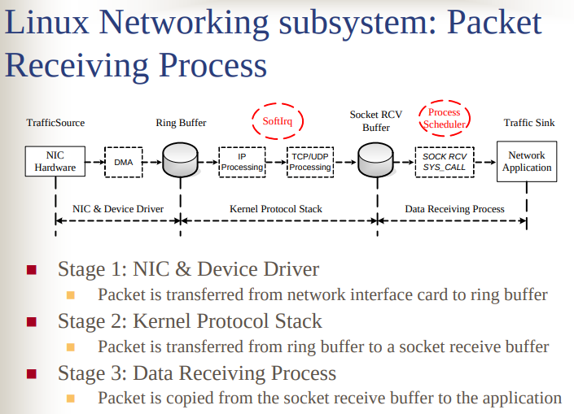
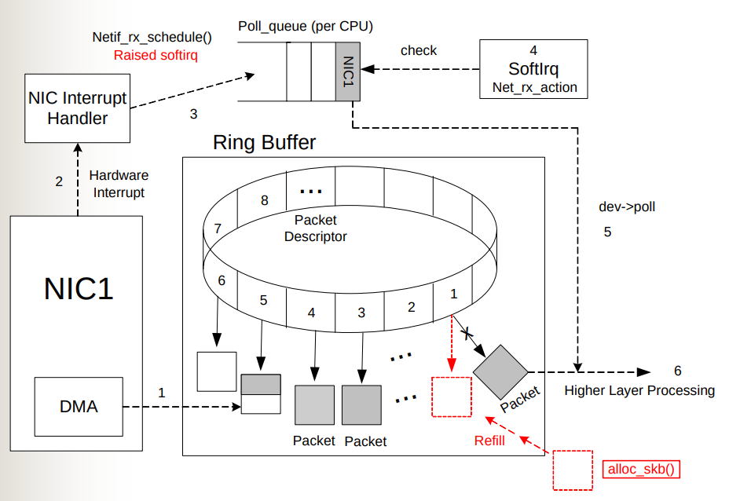
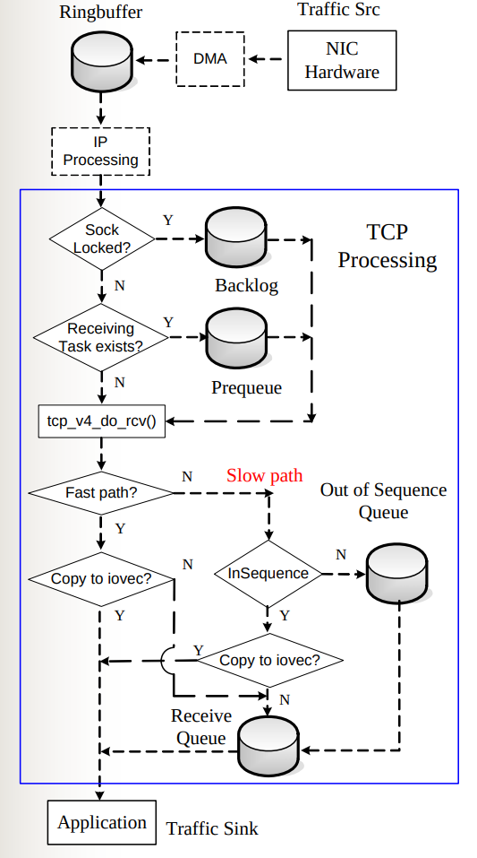
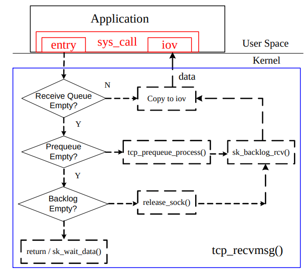
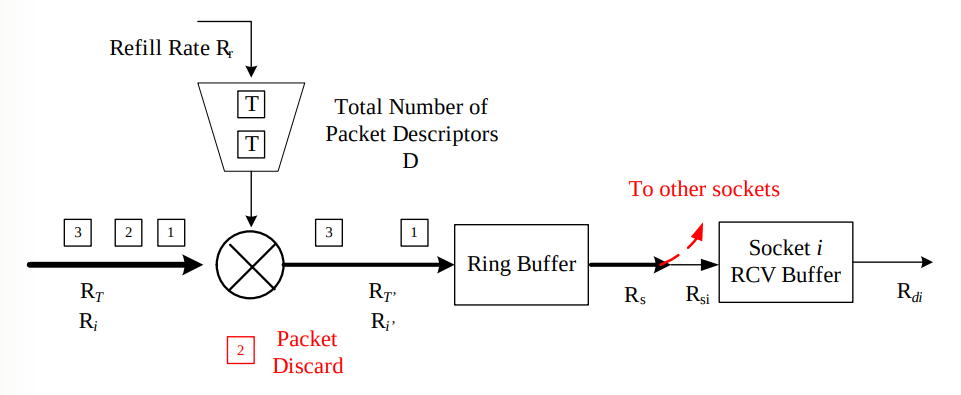
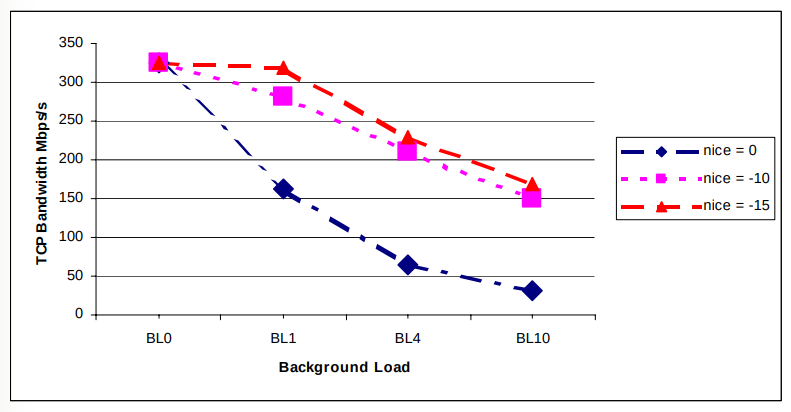

# The Performance Analysis of Linux Networking – Packet Receiving

> [https://indico.cern.ch/event/408139/contributions/979737/attachments/815628/1117588/CHEP06.pdf](https://indico.cern.ch/event/408139/contributions/979737/attachments/815628/1117588/CHEP06.pdf)
>
> [https://people.computing.clemson.edu/~westall/853/tcpperf2.pdf](https://people.computing.clemson.edu/~westall/853/tcpperf2.pdf)

## Linux Networking subsystem: Packet Receiving Process

- Stage 1: NIC & Device Driver 
  - Packet is transferred from network interface card to ring buffer 
- Stage 2: Kernel Protocol Stack 
  - Packet is transferred from ring buffer to a socket receive buffer 

- Stage 3: Data Receiving Process 
  - Packet is copied from the socket receive buffer to the application

## NIC & Device Driver Processing

NIC & Device Driver Processing Steps:

1. Packet is transferred from NIC to Ring Buffer through DMA
2. NIC raises hardware interrupt 
3. Hardware interrupt handler schedules packet receiving software interrupt (Softirq)
4. Softirq checks its corresponding CPU’s NIC device poll-queue
5. Softirq polls the corresponding NIC’s ring buffer
6. Packets are removed from its receiving ring buffer for higher layer processing; the corresponding slot in the ring buffer is reinitialized and refilled.

 - Layer 1 & 2 functions of the OSI 7-layer network Model
 - „Receive ring buffer consists of packet descriptors

   - When there are no packet descriptors in ready state, incoming packets will be discarded!(即 Ring Buffer 満就丢包)

## Kernel Protocol Stack – IP

IP processing：

- IP packet integrity verification
- Routing
- Fragment reassembly
- Preparing packets for higher layer processing.

## Kernel Protocol Stack – TCP

### Kernel Protocol Stack – TCP 1

- TCP processing
  - TCP Processing Contexts
    - `Interrupt Context`: Initiated by `Softirq`
    - `Process Context`: initiated by data receiving process;
      - more efficient, less context switch
  - TCP Functions
    Flow Control, Congestion Control, Acknowledgement, and Retransmission
- TCP Queues
  - Prequeue
    - Trying to process packets in `process context`, instead of the `interrupt context`.
  - Backlog Queue
    - Used when socket is locked.
  - Receive Queue
    - In order, acked, no holes, ready for delivery
  - Out-of-sequence Queue

### Kernel Protocol Stack – TCP 2

*Figure: TCP Processing- Interrupt context*

*Figure: TCP ProcessingProcess context*

Except in the case of `prequeue` overflow, `Prequeue` and `Backlog` queues are processed within the `process context`!

## Mathematical Model

- „ Token bucket algorithm models NIC & Device Driver receiving process „ 
- Queuing process models the receiving process’ stage 2 & 3

## Experiment

### Experiment 3: Data receive process

Sender transmits one TCP stream to receiver with the transmission duration of 25 seconds. In the receiver, both data receiving process’ `nice` value and the background load are varied. The `nice` values used in the experiments are: 0, -10, and -15.

## Conclusion

- The reception ring buffer in NIC and device driver can be the bottleneck for packet receiving. „ 
- The data receiving process’ CPU share is another limiting factor for packet receiving.

