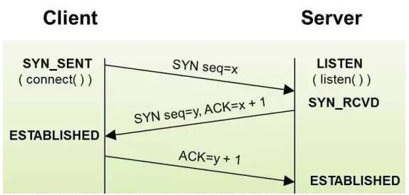
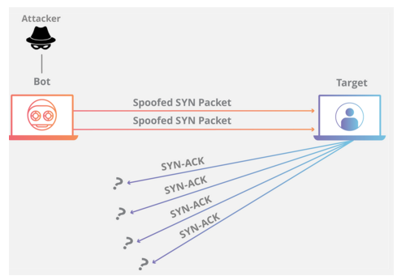
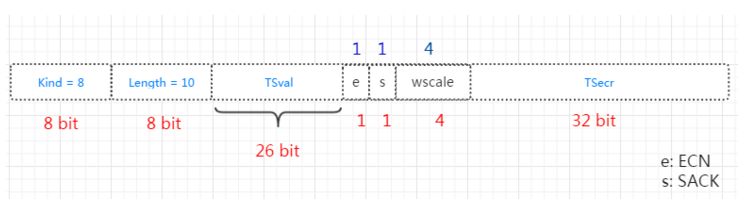
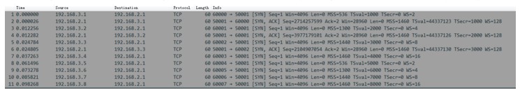
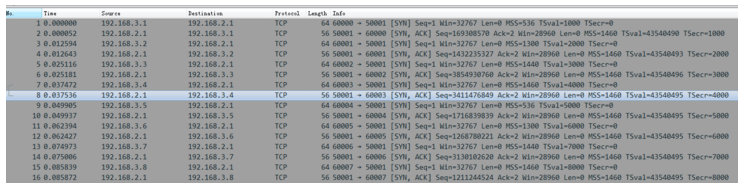

# 深入浅出TCP中的SYN-Cookies

> [https://segmentfault.com/a/1190000019292140?spm=a2c65.11461447.0.0.556649dfrnaZcc](深入浅出TCP中的SYN-Cookies)

> 本文渐进地介绍`TCP`中的`syn-cookie`技术，包括其由来、原理、实例测试。

### SYN Flood 攻击

`TCP`连接建立时，客户端通过发送`SYN`报文发起向处于监听状态的服务器发起连接，服务器为该连接分配一定的资源，并发送`SYN+ACK`报文。对服务器来说，此时该连接的状态称为`半连接`(`Half-Open`)，而当其之后收到客户端回复的`ACK`报文后，连接才算建立完成。在这个过程中，如果服务器一直没有收到`ACK`报文(比如在链路中丢失了)，服务器会在超时后重传`SYN+ACK`。



如果经过多次超时重传后，还没有收到, 那么服务器会回收资源并关闭`半连接`，仿佛之前最初的`SYN`报文从来没到过一样！



这看上一切正常，但是如果有坏人**故意**大量不断发送伪造的`SYN`报文，那么服务器就会分配大量注定无用的资源，并且从[backlog的意义](https://segmentfault.com/a/1190000019252960) 中可知，服务器能保存的半连接的数量是有限的！所以当服务器受到大量攻击报文时，它就不能再接收正常的连接了。换句话说，它的服务不再可用了！这就是`SYN Flood`攻击的原理，它是一种典型的`DDoS`攻击。

### 连接请求的关键信息

`Syn-Flood`攻击成立的关键在于服务器资源是有限的，而服务器收到请求会分配资源。通常来说，服务器用这些资源保存此次请求的关键信息，包括请求的来源和目(五元组)，以及`TCP`选项，如最大报文段长度`MSS`、时间戳`timestamp`、选择应答使能`Sack`、窗口缩放因子`Wscale`等等。当后续的`ACK`报文到达，三次握手完成，新的连接创建，这些信息可以会被复制到连接结构中，用来指导后续的报文收发。

那么现在的问题就是服务器如何在**不分配**资源的情况下

1. 验证之后可能到达的`ACK`的有效性，保证这是一次完整的握手
2. 获得`SYN`报文中携带的`TCP`选项信息

### SYN cookies 算法

`SYN Cookies`算法[wiki](https://link.segmentfault.com/?enc=sHWA3AqCObjsMYXDusJLzQ%3D%3D.%2BI84JXihfDKxgIQ0r%2BCDYVVyVvVnSaoyas5vpTaRDOOTT8dSzCdMdRhMAjl7kWUW)可以解决上面的第`1`个问题以及第`2`个问题的一部分

我们知道，`TCP`连接建立时，双方的起始报文序号是可以**任意**的。`SYN cookies`利用这一点，按照以下规则构造初始序列号：

- 设`t`为一个缓慢增长的时间戳(典型实现是每64s递增一次)
- 设`m`为客户端发送的`SYN`报文中的`MSS`选项值
- 设`s`是连接的元组信息(源IP,目的IP,源端口，目的端口)和`t`经过密码学运算后的`Hash`值，即`s = hash(sip,dip,sport,dport,t)`，`s`的结果取低 **24** 位

则初始序列号`n`为：

- 高 **5** 位为`t mod 32`
- 接下来**3**位为`m`的编码值
- 低 **24** 位为`s`

当客户端收到此`SYN+ACK`报文后，根据`TCP`标准，它会回复`ACK`报文，且报文中`ack = n + 1`，那么在服务器收到它时，将`ack - 1`就可以拿回当初发送的`SYN+ACK`报文中的序号了！服务器巧妙地通过这种方式间接保存了一部分`SYN`报文的信息。

接下来，服务器需要对`ack - 1`这个序号进行检查：

- 将高 **5** 位表示的`t`与当前之间比较，看其到达地时间是否能接受。
- 根据`t`和连接元组重新计算`s`，看是否和低 **24** 一致，若不一致，说明这个报文是被伪造的。
- 解码序号中隐藏的`mss`信息

到此，连接就可以顺利建立了。

#### SYN Cookies 缺点

既然`SYN Cookies`可以减小资源分配环节，那为什么没有被纳入`TCP`标准呢？原因是`SYN Cookies`也是有代价的：

1. `MSS`的编码只有**3**位，因此最多只能使用 **8** 种`MSS`值
2. 服务器必须拒绝客户端`SYN`报文中的其他只在`SYN`和`SYN+ACK`中协商的选项，原因是服务器没有地方可以保存这些选项，比如`Wscale`和`SACK`
3. 增加了密码学运算

#### Linux 中的 SYN Cookies

`Linux`上的`SYN Cookies`实现与`wiki`中描述的算法在序号生成上有一些区别，其`SYN+ACK`的序号通过下面的公式进行计算：

> 内核编译需要打开 **CONFIG_SYN_COOKIES**

```apache
seq = hash(saddr, daddr, sport, dport, 0, 0) + req.th.seq + t << 24 + (hash(saddr, daddr, sport, dport, t, 1) + mss_ind) & 0x00FFFFFF
```

其中，`req.th.seq`表示客户端的`SYN`报文中的序号，`mss_ind`是客户端通告的`MSS`值得编码，它的取值在比较新的内核中有 **4** 种(老的内核有 **8** 种), 分别对应以下 **4** 种值

```autohotkey
static __u16 const msstab[] = {
    536,
    1300,
    1440,    /* 1440, 1452: PPPoE */
    1460,
};
```

感兴趣的可以顺着以下轨迹浏览调用顺序

```1c
tcp_conn_request
  |-- cookie_init_sequence
     |-- cookie_v4_init_sequence
        |-- __cookie_v4_init_sequence
           |-- secure_tcp_syn_cookie
```

#### SYN Cookies 与时间戳

如果服务器和客户端**都**打开了时间戳选项，那么服务器可以将客户端在`SYN`报文中携带了`TCP`选项的使能情况暂时保存在时间戳中。当前使用了低 **6** 位，分别保存`Wscale`、`SACK`和`ECN`。




客户端会在`ACK`的`TSecr`字段，把这些值带回来。

### 实验

> **Linux**中的`/proc/sys/net/ipv4/tcp_syncookies`是内核中的`SYN Cookies`开关,`0`表示关闭`SYN Cookies`；`1`表示在新连接压力比较大时启用`SYN Cookies`,`2`表示始终使用`SYN Cookies`。

本实验是在`4.4.0`内核运行的，服务端监听`50001`端口，`backlog`参数为`3`([该参数意义](https://segmentfault.com/a/1190000019252960))。同时，模拟不同的客户端注入`SYN`报文。

[测试代码](https://segmentfault.com/n/1330000019292093)

#### 不开启 SYN Cookies

```awk
echo 0 > /proc/sys/net/ipv4/tcp_syncookies
```

可以看到，在收到`3`个`SYN`报文后，服务器不再响应新的连接请求了，这也就是`SYN-Flood`的攻击方式。


#### 有条件使用 SYN Cookies

```awk
echo 1 > /proc/sys/net/ipv4/tcp_syncookies
```



由于服务器的`backlog`参数为`3`，因此图中的从第`4`个`SYN+ACK`(**#8**报文)开始使用`SYN Cookies`。

从时间戳可以看出，**#8**报文(44167748)比 **#6**号报文(44167796)还要小。

```bash
44167748 = 0x2A1F244 ,最后低6位是 0b000100 ,与SYN报文中 wscale = 4 是相符的
```

### 小结

`SYN Cookie`技术可以让服务器在收到客户端的`SYN`报文时，不分配资源保存客户端信息，而是将这些信息保存在`SYN+ACK`的初始序号和时间戳中。对正常的连接，这些信息会随着`ACK`报文被带回来。

### REF

[SYN Flood Attack](https://link.segmentfault.com/?enc=b3xmllwkqCqyFCZBI22yLA%3D%3D.LWjiRzeM5kjfVGO5dfh07m5t75AniEaip8pVnBA9tlWxegHr8v4l5h5K08MxIUcAX2VyyE1VhUQ74dPmj%2B7gdg%3D%3D)
[Improving syncookies](https://link.segmentfault.com/?enc=Mfajri3RVdN66QvoGSQZUA%3D%3D.kdhqe7yTCC8YGWnEZmLm5ygGfz0sAHz8AgcHCqO5wfggcdeB5qRKD8E9wbqY8oi0)
