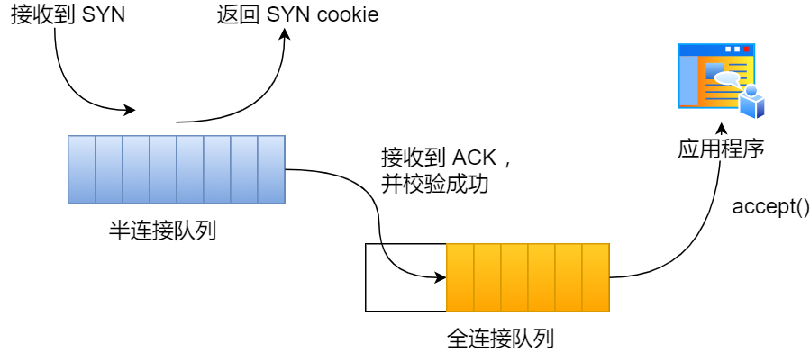

# SYN Cookies

## What is SYN Cookies

> [https://www.cnblogs.com/xiaolincoding/p/12995358.html?spm=a2c65.11461447.0.0.556649dfrnaZcc](https://www.cnblogs.com/xiaolincoding/p/12995358.html?spm=a2c65.11461447.0.0.556649dfrnaZcc)





```{toctree}
ref/syn-cookies.md
```


## Ref

 - [https://wpbolt.com/syn-cookies-ate-my-dog-breaking-tcp-on-linux/](https://wpbolt.com/syn-cookies-ate-my-dog-breaking-tcp-on-linux/)
 - [http://www.jauu.net/2010/06/24/tcp-window-scaling-and-syn-cookies/](http://www.jauu.net/2010/06/24/tcp-window-scaling-and-syn-cookies/)
 - [Improving syncookies](https://lwn.net/Articles/277146/)
 - [kernel: Possible SYN flooding on port #. Sending cookies.](https://access.redhat.com/solutions/30453)

