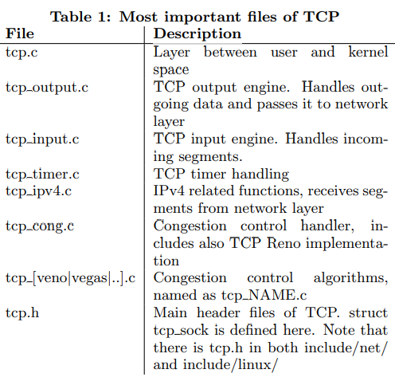
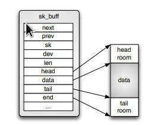
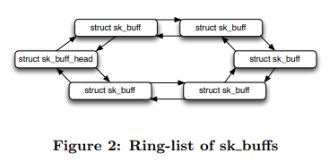
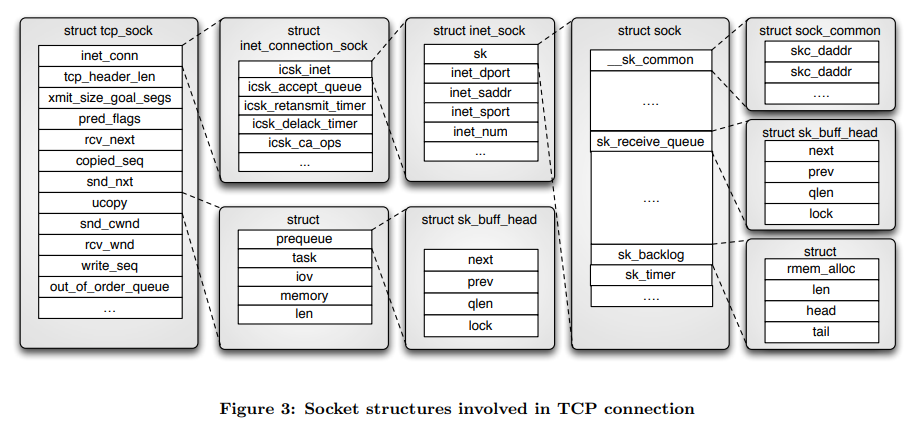
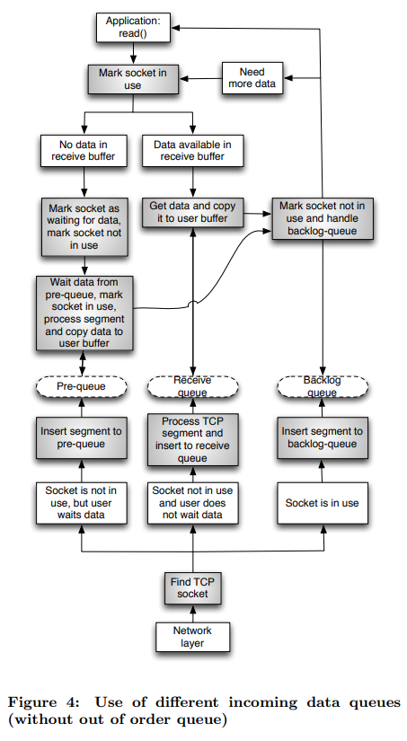
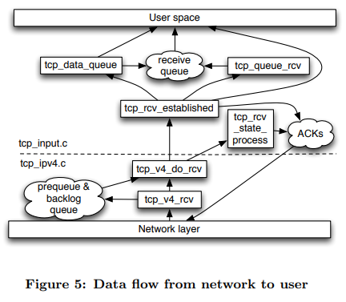
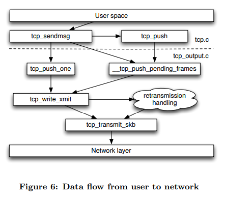
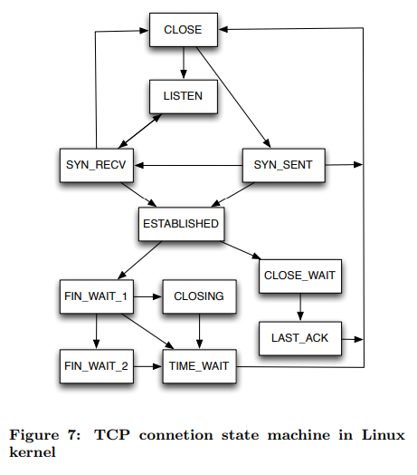

# Implementation of Transmission Control Protocol in Linux

> [https://wiki.aalto.fi/download/attachments/70789052/linux-tcp-review.pdf](https://wiki.aalto.fi/download/attachments/70789052/linux-tcp-review.pdf)

{download}`下载：linux-tcp-review.pdf <linux-tcp-review.assets/linux-tcp-review.pdf>`

## ABSTRACT
Transmission Control Protocol is the most used transmission layer protocol in the Internet. In addition to reliable
and good performance in transmission between two nodes, it provides congestion control mechanism that is a major reason why Internet has not collapsed. Because of its complicated nature, implementations of it can be challenging to understand. This paper describes fundamental details of Transmission Control Protocol implementation in Linux kernel. Focus is on clarifying data structures and segments route through TCP stack.

## 1. INTRODUCTION

In May 1974 Vint Cerf and Bob Kahn published paper where
they described an inter-networked protocol, which central
control component was Transmission Control Program [3,
2].Later it was divided into modular architecture and in 1981
Transmission Control Protocol (TCP), as it is know today,
was specified in RFC 793 [7].
Today, TCP is the most used transmission layer protocol
in the Internet [4] providing reliable transmission between
two hosts through networks [7]. In order to gain good performance for communication, implementations of TCP must
be highly optimized. Therefore, TCP is one of the most complicated components in Linux networking stack. In kernel
3.5.4, it consists of over 21000 lines of code under net/ipv4/
-directory (all tcp*.c files together), while IPv4 consist of
less than 13000 lines of code (all ip*.c files in the same directory). This paper explains the most fundamental data
structures and operations used in Linux to implement TCP.
TCP provides reliable communication over unreliable network by using acknowledgment messages. In addition to
provide resending of the data, TCP also controls its sending
rate by using so-called ’windows’ to inform the other end
how much of data receiver is ready to accept.
As parts of the TCP code are dependent on network layer
implementation, the scope of this paper is limited to IPv4
implementation as it is currently supported and used more
widely than IPv6. However, most of the code is shared between IPv4 and IPv6, and tcp ipv6.c is the only file related
to TCP under net/ipv6/. In addition, TCP congestion control will be handled in a separate paper, so it will be handled
very briefly. If other assumptions is made it is mentioned in
the beginning of the related section.

Table 1: Most important files of TCP

Paper structure will be following: First section “Overview of implementation” will cover most important files and basic data structures used by TCP (sk buff, tcp sock), how data is stored inside these structures and how different queues are implemented, what timers TCP is using and how TCP sockets are kept in memory. Then socket initialization and data flows through TCP is discussed. Section “Algorithms, optimizations and options” will handle logic of TCP state machine, explain what is TCP fast path and discuss about socket options that can be used to modify behaviour of TCP.

## 2. OVERVIEW OF IMPLEMENTATION

In this section basic operation of TCP in Linux will be explained. It covers the most fundamental files and data structures used by TCP, as well as functions used when we are sending to or receiving from network. 

The most important files of implementation are listed in table 1. In addion to net/ipv4/ where most TCP files are located, there are also few headers located in include/net/ and include/linux/ -directories

Figure 1: Data storage inside structure sk buff

### 2.1 Data structures

Data structures are crucial sections of any software in order of performance and re-usability. As TCP is a highly optimized and remarkably complex entirety, robust understanding of data structures used is mandatory for mastering the implementation. 

#### 2.1.1 struct sk_buff

struct sk buff (located in include/linux/skbuff.h) is used widely in the network implementation in Linux kernel. It is a socket buffer containing one slice of the data we are sending or receiving. In Figure 1 we see how data is stored inside structure. Data is hold in the continuous memory area surrounded by empty spaces, head and tail rooms. By having these empty spaces more data can be added to before or after current data without needing to copy or move it, and minimize risk of need to allocate more memory. However, if the data does not fit to space allocated, it will be fragmented to smaller segments and saved inside struct skb shared info that lives at the end of data (at the end pointer). 

All the data cannot be held in one large segment in the memory, and therefore we must have several socket buffers to be able to handle major amounts of data and to resend data segment that was lost during transmission to receiver. Because of that need of network data queues is obvious. In Linux these queues are implemented as ring-lists of sk buff structures (Figure 2). Each socket buffer has a pointer to the previous and next buffers. There is also special data structure to represent the whole list, known as struct sk buff head. More detailed information about the data queues is in section 2.1.3. 

In addition data pointers, sk buff also has pointer to owning socket, device from where data is arriving from or leaving by and several other members. All the members are documented in skbuff.h.

Figure 2: Ring-list of sk buffs

#### 2.1.2 struct tcp_sock struct

 tcp sock (include/linux/tcp.h) is the core structure for TCP. It contains all the information and packet buffers for certain TCP connection. Figure 3 visualizes how this structure is implemented in Linux. Inside tcp sock there is a few other, more general type of sockets. As a next, more general type of socket is always first member of socket type, can a pointer to socket be type-casted to other type of socket. This allows us to make general functions that handles with, for example, struct sock, even in reality pointer would be also a valid pointer to struct tcp sock. Also depending on the type of the socket can different structure be as a first member of the certain socket. For example, as UDP is connection-less protocol, first member of struct udp sock is struct inet sock, but for struct tcp sock first member must be struct inet connection sock, as it provides us features needed with connection-oriented protocols. From Figure 3 it can be seen that TCP has many packet queues. There is receive queue, backlog queue and write queue (not in figure) under struct sock, and prequeue and out-of-order queue under tcp sock. These different queues and their functions are explained in detail in section 2.1.3. struct inet connection sock (include/net/ inet connection sock)is a socket type one level down from the tcp sock. It contains information about protocol congestion state, protocol timers and the accept queue. Next type of socket is struct inet sock (include/net/inet sock.h). It has information about connection ports and IPaddresses. Finally there is general socket type struct sock. It contains two of TCP’s three receive queues, sk receive queue and sk backlog, and also queue for sent data, used with retransmission.

#### 2.1.3 Data queues

There is four queues implemented for incoming data: receive queue, prequeue, backlog queue and out-of-order queue. In normal case when segment arrives and user is not waiting for the data, segment is processed immediately and the data is copied to the receive buffer. If socket is blocked as user is waiting for data, segment is copied to prequeue and user task is interrupted to handle the segment. If user is handling segments at the same time when we receive a new one, it will be put to the backlog queue, and user context will handle the segment after it has handled all earlier segments. If the segment handler detects out-of-order segment, it will be put to the out-of-order queue and copied to the receive buffer after the missing segments have been arrived. Figure 4 visualizes use of receive, pre- and backlog-queues.

#### 2.1.4 Hash tables

Sockets are located in kernel’s hash table from where them are fetched when a new segment arrives or socket is otherwise needed. Main hash structure is struct inet hashinfo (include/net/inet hashtables.h), and TCP uses it as a type of global variable tcp hashinfo located in net/ipv4/tcp ipv4.c. struct inet hashinfo has three main hash tables: One for sockets with full identity, one for bindings and one for listening sockets. In addition to that, full identity hash table is divided in to two parts: sockets in TIME WAIT state and others. As hash tables are more general and not only TCP specific part of kernel, this paper will not go into logic behind these more deeply.

#### 2.1.5 Other data structures

There is also other data structures that must be known in order to understand how TCP stack works. struct proto (include/net/sock.h) is a general structure presenting transmission layer to socket layer. It contains function pointers that are set to TCP specific functions in net/ipv4/tcp ipv4.c, and applications function calls are eventually, through other layers, mapped to these. 

struct `tcp_info` is used to pass information about socket state to user. Structure will be filled in function tcp get info(). It contains values for connection state (Listen, Established, etc), congestion control state (Open, Disorder, CWR, Recovery, Lost), receiver and sender MSS, rtt and various counters.

### 2.2 TCP timers

To provide reliable communication with good performance, TCP uses four timers: Retransmit timer, delayed ack timer, keep-alive timer and zero window prope timer. Retransmit, delayed ack and zero window probe timers are located in struct inet connection sock, and keep-alive timer can be found from struct sock (Figure 3). Although there is dedicated timer handling file net/ipv4/tcp timer.c, timers are set and reset in several locations in the code as a result of events that occur.

### 2.3 Socket initialization

TCP functions available to socket layer are set to previously explained (section 2.1.5) struct proto in tcp ipv4.c. This structure will be held in struct inet protosw in af inet.c, from where it will be fetched and set to sk->sk prot when user does socket() call. During socket creation in the function inet create() function sk->sk prot->init() will be called, which points to tcp v4 init sock(). From there the real initialization function tcp init sock() will be called. Address-family independent initialization of TCP socket occurs in tcp init sock() (net/ipv4/tcp.c). The function will be called when socket is created with socket() system call. In that function fields of structure tcp sock are initialized to default values. Also out of order queue will be initialized with skb queue head init(), prequeue with tcp prequeue init(), and TCP timers with tcp init xmit timers(). At this point, state of the socket is set to TCP CLOSE.

#### 2.3.1 Connection socket

Next step to do when user wants to create a new TCP connection to other host is to call connect(). In the case of TCP, it maps to function inet stream connect(), from where sk- >sk prot->connect() is called. It maps to TCP function tcp v4 connect(). tcp v4 connect() validates end host address by using ip route connect() function. After that inet hash connect() will be called. inet hash connect() selects source port for our socket, if not set, and adds the socket to hash tables. If everything is fine, initial sequence number will be fetched from secure tcp sequence number() and the socket is passed to tcp connect(). tcp connect() calls first tcp connect init(), that will initialize parameters used with TCP connection, such as maximum segment size (MSS) and TCP window size. After that tcpconnect() will reserve memory for socket buffer, add buffer to sockets write queue and passes buffer to function tcp transmit skb(), that builds TCP headers and passes data to network layer. Before returning tcp connect() will start retransmission timer for the SYN packet. When SYN-ACK packet is received, state of socket is modified to ESTABLISHED, ACK is sent and communication between nodes may begin.

#### 2.3.2 Listening socket

Creation of listening socket should be done in two phases. Firstly, bind() must be called to pick up port what will be listened to, and secondly, listen() must be called. bind() maps to inet bind(). Function validates port number and socket, and then tries to bind the wanted port. If everything goes fine function returns 0, otherwise error code indicating problem will be returned

Function call listen() will become to function inet listen(). inet listen() performs a few sanity checks, and then calls function inet csk listen start(), which allocates memory for socket accept queue, sets socket state to TCP LISTEN and adds socket to TCP hash table to wait incoming connections.

### 2.4 Data flow through TCP in kernel

Knowing the rough route of incoming and outgoing segments through the layer is on of the most important part of TCP implementation to understand. In this section a roughly picture of it in most common cases will be given. Handling of all the cases is not appropriate and possible under the limits of this paper. In this section it is assumed that DMA (CONFIG NET DMA) is not in use. It would be used to offload copying of data to dedicated hardware, thus saving CPU time. [1]

#### 2.4.1 From the network

Figure 5 shows us a simplified summary about incoming data flow through TCP in Linux kernel. In the case of IPv4, TCP receives incoming data from network layer in tcp v4 rcv() (net/ipv4/tcp ipv4.c). The function checks if packet is meant for us and finds the matching TCP socket from the hash table using IPs and ports as the keys. If the socket is not owned by user (user context is not handling the data), we first try to put the packet to prequeue. Prequeuing is possible only when user context is waiting for the data. If prequeuing was not possible, we pass the data to tcp v4 do rcv(). There socket state is checked. If state is TCP ESTABLISHED, data is passed to tcp rcv established(), and copied to receive queue. Otherwise buffer is passed to tcp rcv state process(), where all the other states will be handled. If the socket was not owned by user in function tcp v4 rcv(), data will be copied to the backlog queue of the socket. When user tries to read data from the socket (tcp recvmsg()), queues must be processed in order. First receive queue, then data from prequeue will be waited, and when the process ready to release socket, packets from backlog will be copied to the receive queue. Handling of the queues must be preserved in order to ensure that data will be copied to user buffer in the same order as it was sent. Figure 4 visualizes the overall queuing process.

#### 2.4.2 From the user

Figure 6 shows us a simplified summary about outgoing data flow through TCP in Linux kernel. When user-level application writes data to TCP socket, first function that will be called is tcp sendmsg(). It calculates size goal for segments and then creates sk buff buffers of calculated size from the data, pushes buffers to write queue and notifies TCP output engine of new segments. Segments will go through TCP output engine and end up to tcp transmit skb(). tcp write xmit takes care that segment is sent only when it is allowed to. If congestion control, sender window or Nagle’s algorithm prevent sending, the data will not go forward. Also retransmission timers will be set from tcp write xmit, and after data send, congestion window will be validated referring to RFC 2861 [5]. tcp transmit skb() builds up TCP headers and passes data to network layer by calling function queue xmit() found from struct inet connection sock from member icsk af ops.

## 3. ALGORITHMS, OPTIMIZATIONS AND OPTIONS

This section will go through a few crucial parts of implementation and clarify why these are important features to have and to work properly in a modern TCP implementation. 

### 3.1 TCP state machine

 There is several state machines implemented in Linux TCP. Probably most known TCP state machine is connection state machine, introduced in RFC 793 [7]. Figure 3.1 presents states and transitions implemented in kernel. In addition to

connection state machine TCP has own state machine for congestion control. The most important function in TCP state handling is tcp rcv state process(), as it handles all the states except ESTABLISHED and TIME WAIT. TIME WAIT is handled in tcp v4 rcv(), and state ESTABLISHED in tcp rcv established(). As stated, TIME WAIT is handled in tcp v4 rcv(). Depending on return value of tcp timewait state process, packet will be discarded, acked or processed again with a new socket (if the packet was SYN initializing a new connection). Implementation of function is very clean and easy to follow.

### 3.2 Congestion control

 At first TCP did not have specific congestion control algorithms, and due to misbehaving TCP implementations Internet had first ’congestion collapse’ in October 1988. Investigation on that leaded to first TCP congestion control algorithms described by Jacobson in 1988 [6]. However, it took almost 10 years before official RFC based on Jacobson’s research on congestion control algorithms came out [8]. Main file for TCP congestion control in Linux is tcp cong.c. It contains congestion control algorithm database, functions to register and to active algorithm and implementation of TCP Reno. Congestion algorithm is linked to rest of the TCP stack by using struct tcp congestion ops, that has function pointers to currently used congestion control algorithm implementation. Pointer to the structure is found in struct inet connection sock (member icsk ca ops), see it at Figure 3. Important fields for congestion control are located in struct tcp sock (see section 2.1.2). Being the most important variable, member snd cwnd presents sending congestion window and rcv wnd current receiver window. Congestion window is the estimated amount of data that can be in the network without data being lost. If too many bytes is sent to the network, TCP is not allowed to send more data before an acknowledgment from the other end is received. As congestion control is out of scoop of this paper, it will not be investigated more deeply. 

### 3.3 TCP fast path

 Normal, so-called slow path is a comprehensive processing route for segments. It handles special header flags and outof-order segments, but because of that, it is also requiring heavy processing that is not needed in normal cases during data transmission. Fast path is an TCP optimization used in tcp rcv established() to skip unnecessary packet handling in common cases when deep packet inspection is not needed. By default fast path is disabled, and before fast path can be enabled, four things must be verifed: The out-of-order queue must be empty, receive window can not be zero, memory must be available and urgent pointer has not been received. This four cases are checked in function tcp fast path check(), and if all cases pass, will fast path be enabled in certain cases. Even after fast path is enabled, segment must be verified to be accepted to fast path. TCP uses technique known as header prediction to verify segment to fast path. Header prediction allows TCP input machine to compare certain bits in the incoming segment’s header to check if the segment is valid for fast path. Header prediction ensures that there are no special conditions requiring additional processing. Because of this fast path is easily turned off by setting header prediction bits to zero, causing header prediction to fail always. In addition to pass header prediction, segment received must be next in order to be accepted to fast path. 

### 3.4 Socket options

 Behaving of TCP can be affected by modifying its parameters through socket options. System-wide settings can be accessed by files in the directory /proc/sys/net/ipv4. Options affecting to only certain TCP connection (socket) can be set by using getsockopt() / setsockopt() system calls. System-wide configurations related to TCP are mapped to kernel in net/ipv4/sysctl net ipv4.c. All implemented options are listed in include/net/tcp.h. In Linux 3.5.3, there are 44 of them. Setting and getting socket options is handled in kernel in do tcp setsockopt() and do tcp getsockopt() (net/ipv4/tcp.c). In Linux 3.5.3, there are 22 options, defined in include/linux/tcp.h. 

## 4. CONCLUSION 

Implementation of TCP in Linux is a complex and highly optimized to gain as high performance as possible. Because of that it is also time-consuming process to get into code level in kernel and understand TCP details. This paper described the most fundamental components of the TCP implementation in Linux 3.5.3 kernel. 

## 5. REFERENCES 

[1] Linux kernel options documentation. http://lxr. linux.no/#linux+v3.5.3/drivers/dma/Kconfig. [2] V. Cerf, Y. Dalal, and C. Sunshine. Specification of Internet Transmission Control Program. RFC 675, Dec. 1974. [3] V. G. Cerf and R. E. Khan. A protocol for packet network intercommunication. IEEE TRANSACTIONS ON COMMUNICATIONS, 22:637–648, 1974. [4] K. Cho, K. Fukuda, H. Esaki, and A. Kato. Observing slow crustal movement in residential user traffic. In Proceedings of the 2008 ACM CoNEXT Conference, CoNEXT ’08, pages 12:1–12:12, New York, NY, USA, 2008. ACM. [5] M. Handley, J. Padhye, and S. Floyd. TCP Congestion Window Validation. RFC 2861 (Experimental), June 2000. [6] V. Jacobson. Congestion avoidance and control. SIGCOMM Comput. Commun. Rev., 18(4):314–329, Aug. 1988. [7] J. Postel. RFC 793: Transmission control protocol, Sept. 1981. [8] W. Stevens. TCP Slow Start, Congestion Avoidance, Fast Retransmit, and Fast Recovery Algorithms. RFC 2001 (Proposed Standard), Jan. 1997. Obsoleted by RFC 2581.

