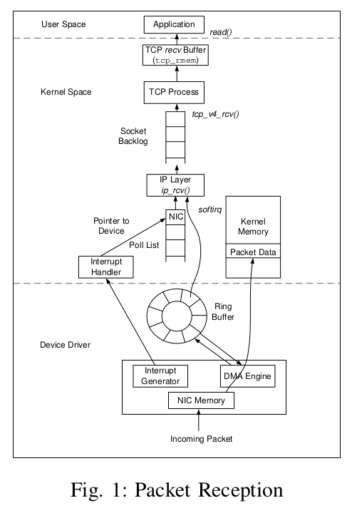
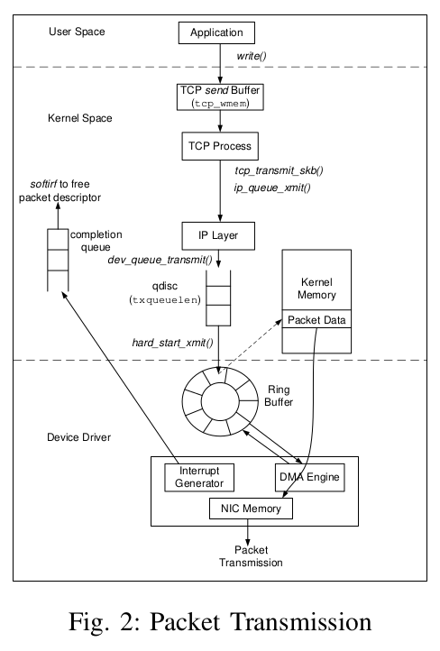

# TCP Implementation in Linux: A Brief Tutorial

> [https://sn0rt.github.io/media/paper/TCPlinux.pdf](https://sn0rt.github.io/media/paper/TCPlinux.pdf)

{download}`下载：TCPlinux.pdf <tcp-implementation-in-linux-a-brief-tutorial.assets/TCPlinux.pdf>`

A. Introduction
This document provides a brief overview of how TCP is
implemented in Linux. 1 It is not meant to be comprehensive,
nor do we assert that it is without inaccuracies.
B. TCP implementation in Linux
Figures 1 and 2 show the internals of the TCP implemen-
tation in Linux kernel. Fig. 1 shows the path taken by a new
packet from the the wire to a user application. The Linux
kernel uses an sk buff data structure to describe each packet.
When a packet arrives at the NIC, it invokes the DMA engine
to place the packet into the kernel memory via empty sk buffs
stored in a ring buffer called rx ring. An incoming packet is
dropped if the ring buffer is full. When a packet is processed at
higher layers, packet data remains in the same kernel memory,
avoiding any extra memory copies.
Once a packet is successfully received, the NIC raises an
interrupt to the CPU, which processes each incoming packet
and passes it to the IP layer. The IP layer performs its
processing on each packet, and passes it up to the TCP layer
if it is a TCP packet. The TCP process is then scheduled to
handle received packets. Each packet in TCP goes through a
series of complex processing steps. The TCP state machine is
updated, and finally the packet is stored inside the TCP recv
buffer.
A critical parameter for tuning TCP is the size of the
recv buffer at the receiver. The number of packets a TCP
sender is able to have outstanding (unacknowledged) is the
minimum of the congestion window (cwnd) and the receiver’s
advertised window (rwnd). The maximum size of the receiver’s
advertised window is the TCP recv buffer size. Hence, if the
size of the recv buffer is smaller than the the bandwidth-
delay product (BDP) of the end-to-end path, the achievable
throughput will be low. On the other hand, a large recv buffer
allows a correspondingly large number of packets to remain
outstanding, possibly exceeding the number of packets an end-
to-end path can sustain. The size of the recv buffer can be
set by modifying the /proc/sys/net/ipv4/tcp rmem variable. It
takes three different values, i.e, min, default, and max. The min
value defines the minimum receive buffer size even when the
operating system is under hard memory pressure. The default
is the default size of the receive buffer, which is used together
with the TCP window scaling factor to calculate the actual
advertised window. The max defines the maximum size of the
receive buffer.
Also at the receiver, the parameter netdev max backlog
dictates the maximum number of packets queued at a device,
which are waiting to be processed by the TCP receiving
process. If a newly received packet when added to the queue
would cause the queue to exceed netdev max backlog then it
is discarded.
On the sender, as shown in Fig 2, a user application writes
the data into the TCP send buffer by calling the write() system
call. Like the TCP recv buffer, the send buffer is a crucial
parameter to get maximum throughput. The maximum size
of the congestion window is related to the amount of send
buffer space allocated to the TCP socket. The send buffer
holds all outstanding packets (for potential retransmission)
as well as all data queued to be transmitted. Therefore, the
congestion window can never grow larger than send buffer can
accommodate. If the send buffer is too small, the congestion
window will not fully open, limiting the throughput. On the
other hand, a large send buffer allows the congestion window
to grow to a large value. If not constrained by the TCP recv
buffer, the number of outstanding packets will also grow as the
congestion window grows, causing packet loss if the end-to-
end path can not hold the large number of outstanding packets.
The size of the send buffer can be set by modifying the
/proc/sys/net/ipv4/tcp wmem variable, which also takes three
different values, i.e., min, default, and max.

The analogue to the receiver’s netdev max backlog is the
sender’s txqueuelen. The TCP layer builds packets when data
is available in the send buffer or ACK packets in response to
data packets received. Each packet is pushed down to the IP
layer for transmission. The IP layer enqueues each packet in an
output queue (qdisc) associated with the NIC. The size of the
qdisc can be modified by assigning a value to the txqueuelen
variable associated with each NIC device. If the output queue
is full, the attempt to enqueue a packet generates a local-
congestion event, which is propagated upward to the TCP
layer. The TCP congestion-control algorithm then enters into
the Congestion Window Reduced (CWR) state, and reduces
the congestion window by one every other ACK (known as
rate halving). After a packet is successfully queued inside the
output queue, the packet descriptor (sk buff ) is then placed
in the output ring buffer tx ring. When packets are available
inside the ring buffer, the device driver invokes the NIC DMA
engine to transmit packets onto the wire.
While the above parameters dictate the flow-control profile
of a connection, the congestion-control behavior can also have
a large impact on the throughput. TCP uses one of several
congestion control algorithms to match its sending rate with
the bottleneck-link rate. Over a connectionless network, a large
number of TCP flows and other types of traffic share the same
bottleneck link. As the number of flows sharing the bottleneck
link changes, the available bandwidth for a certain TCP flow
varies. Packets get lost when the sending rate of a TCP flow
is higher than the available bandwidth. On the other hand,
packets are not lost due to competition with other flows in a
circuit as bandwidth is reserved. However, when a fast sender
is connected to a circuit with lower rate, packets can get lost
due to buffer overflow at the switch.
When a TCP connection is set up, a TCP sender uses ACK
packets as a ’clock, known as ACK-clocking, to inject new

packets into the network [1]. Since TCP receivers cannot
send ACK packets faster than the bottleneck-link rate, a
TCP senders transmission rate while under ACK-clocking is
matched with the bottleneck link rate. In order to start the
ACK-clock, a TCP sender uses the slow-start mechanism.
During the slow-start phase, for each ACK packet received,
a TCP sender transmits two data packets back-to-back. Since
ACK packets are coming at the bottleneck-link rate, the sender
is essentially transmitting data twice as fast as the bottleneck
link can sustain. The slow-start phase ends when the size
of the congestion window grows beyond ssthresh. In many
congestion control algorithms, such as BIC [2], the initial
slow start threshold (ssthresh) can be adjusted, as can other
factors such as the maximum increment, to make BIC more
or less aggressive. However, like changing the buffers via
the sysctl function, these are system-wide changes which
could adversely affect other ongoing and future connections.
A TCP sender is allowed to send the minimum of the con-
gestion window and the receivers advertised window number
of packets. Therefore, the number of outstanding packets
is doubled in each roundtrip time, unless bounded by the
receivers advertised window. As packets are being forwarded
by the bottleneck-link rate, doubling the number of outstanding
packets in each roundtrip time will also double the buffer
occupancy inside the bottleneck switch. Eventually, there will
be packet losses inside the bottleneck switch once the buffer
overflows.
After packet loss occurs, a TCP sender enters into the
congestion avoidance phase. During congestion avoidance,
the congestion window is increased by one packet in each
roundtrip time. As ACK packets are coming at the bottleneck
link rate, the congestion window keeps growing, as does the
the number of outstanding packets. Therefore, packets will get
lost again once the number of outstanding packets grows larger
than the buffer size in the bottleneck switch plus the number
of packets on the wire.
There are many other parameters that are relevant to the
operation of TCP in Linux, and each is at least briefly
explained in the documentation included in the distribution
(Documentation/networking/ip-sysctl.txt). An example of a
configurable parameter in the TCP implementation is the
RFC2861 congestion window restart function. RFC2861 pro-
poses restarting the congestion window if the sender is idle for
a period of time (one RTO). The purpose is to ensure that the
congestion window reflects the current state of the network.
If the connection has been idle, the congestion window may
reflect an obsolete view of the network and so is reset. This be-
havior can be disabled using the sysctl tcp slow start after idle
but, again, this change affects all connections system-wide.

R EFERENCES
[1] V. Jacobson, “Congestion avoidance and control,” in Proceedings of
SIGCOMM, Stanford, CA, Aug. 1988.
[2] L. Xu, K. Harfoush, and I. Rhee, “Binary increase congestion control for
fast long-distance networks.” in Proceedings of IEEE INFOCOM, Mar.
2003.

