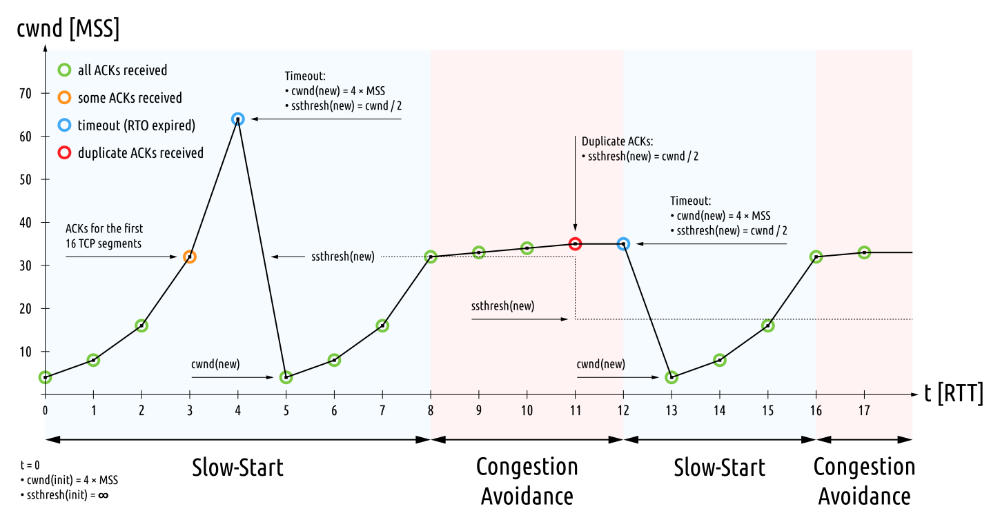

# TCP 连接查看标工具 ss 的说明


- [TCP 连接查看标工具 ss 的说明](#tcp-连接查看标工具-ss-的说明)
  - [写在前面](#写在前面)
  - [TCP 连接健康的重要性](#tcp-连接健康的重要性)
  - [如何查看 TCP 连接健康](#如何查看-tcp-连接健康)
    - [容器化时代](#容器化时代)
    - [曾神秘的 `ss`](#曾神秘的-ss)
    - [更神秘的无文档指标](#更神秘的无文档指标)
  - [`ss` 简介](#ss-简介)
  - [字段说明](#字段说明)
    - [Recv-Q与Send-Q](#recv-q与send-q)
    - [基本信息](#基本信息)
    - [内存/TCP Window/TCP Buffer 相关](#内存tcp-windowtcp-buffer-相关)
      - [skmem](#skmem)
      - [rcv\_space](#rcv_space)
      - [rcv\_ssthresh](#rcv_ssthresh)
    - [MTU/MSS 相关](#mtumss-相关)
      - [mss](#mss)
      - [advmss](#advmss)
      - [pmtu](#pmtu)
      - [rcvmss](#rcvmss)
    - [Flow control 流控](#flow-control-流控)
      - [cwnd](#cwnd)
      - [ssthresh](#ssthresh)
    - [retrans 重传相关](#retrans-重传相关)
      - [retrans](#retrans)
      - [bytes\_retrans](#bytes_retrans)
    - [timer 定时器](#timer-定时器)
    - [Other](#other)
      - [app\_limited](#app_limited)
  - [特别操作](#特别操作)
    - [specified network namespace](#specified-network-namespace)
    - [kill socket](#kill-socket)
    - [监听连接关闭事件](#监听连接关闭事件)
    - [过滤器](#过滤器)
  - [监控使用例子](#监控使用例子)
  - [原理](#原理)
    - [Netlink](#netlink)
    - [NETLINK\_INET\_DIAG](#netlink_inet_diag)
      - [idiag\_ext](#idiag_ext)
      - [Netlink in deep](#netlink-in-deep)
  - [参考](#参考)

## 写在前面

我不是网格专家，只是在经历了多年的生产和测试环境网络问题排查后，不想再得过且过，于是记录下所学到的知识。由于对 TCP 栈的实现了解有限，所以内容仅作参考。

## TCP 连接健康的重要性

TCP 连接健康最少包括：

- TCP 重传统计，这是网络质量的风向标
- MTU/MSS 大小，拥挤窗口的大小，这是带宽与吞吐的重要指标
- 各层收发队列与缓存的统计

这个问题在《[从性能问题定位，扯到性能模型，再到 TCP - 都微服务云原生了，还学 TCP 干嘛系列 Part 1](https://blog.mygraphql.com/zh/posts/low-tec/network/tcp-flow-control-part1/)》中我聊过，不再重复。

## 如何查看 TCP 连接健康

Linux 的 TCP 连接健康指标有两种：

- 整机的统计

  聚合了整机（严格来说，是整个 network namespace 或 整个 container) 的网络健康指标。可用 `nstat` 查看。

- 每个 TCP 连接的统计

  每个 TCP 连接均在内核中保存了统计数据。可用 `ss` 查看。

本文只关注 `每个 TCP 连接的统计` ，`整机的统计` 请到 [这篇](https://blog.mygraphql.com/zh/posts/low-tec/network/tcp-flow-control-part1/#%E6%8C%87%E6%A0%87%E7%AE%80%E4%BB%8B) 查看。


### 容器化时代

了解过 Linux 下容器化原理的同学应该知道，在内核层都是 namespace + cgroup。而上面说的 TCP 连接健康指标，也是 `namespace aware `的。即每个 network namespace 独立统计。在容器化时，什么是 `namespace aware`，什么不是，一定要分清楚。


### 曾神秘的 `ss`

相信很多人用过 `netstat`。但`netstat`由于在连接量大时性能不佳的问题，已经慢慢由 ss 代替。如果你好奇 ss 的实现原理，那么转到本文的 “原理” 一节。

参考：https://www.net7.be/blog/article/network_activity_analysis_1_netstat.html

### 更神秘的无文档指标


## `ss` 简介

`ss` 是个查看连接明细统计的工具。示例：

```bash
$ ss -taoipnm
State        Recv-Q   Send-Q      Local Address:Port         Peer Address:Port  Process                                                                         
ESTAB 0      0               159.164.167.179:55124           149.139.16.235:9042  users:(("envoy",pid=81281,fd=50))
        skmem:(r0,rb131072,t0,tb87040,f0,w0,o0,bl0,d13) ts sack cubic wscale:9,7 rto:204 rtt:0.689/0.065 ato:40 mss:1448 pmtu:9000 rcvmss:610 advmss:8948 cwnd:10 bytes_sent:3639 bytes_retrans:229974096 bytes_acked:3640 bytes_received:18364 segs_out:319 segs_in:163 data_segs_out:159 data_segs_in:159 send 168.1Mbps lastsnd:16960 las
trcv:16960 lastack:16960 pacing_rate 336.2Mbps delivery_rate 72.4Mbps delivered:160 app_limited busy:84ms retrans:0/25813 rcv_rtt:1 rcv_space:62720 rcv_ssthresh:56588 minrtt:0.16
```

详细见手册：https://man7.org/linux/man-pages/man8/ss.8.html

## 字段说明

> ⚠️ 我不是网络专家，以下说明是我最近的一些学习结果，不排除有错。请谨慎使用。

### Recv-Q与Send-Q

- 当socket是listen 状态(eg: ss -lnt)
    Recv-Q: 全连接队列的大小，也就是当前已完成三次握手并等待服务端 accept() 的 TCP 连接
    Send-Q: 全连接最大队列长度
- 当socket 是非listen 状态(eg: ss -nt)
    Recv-Q: 未被应用进程读取的字节数；
    Send-Q: 已发送但未收到确认的字节数；

> Recv-Q
>
> Established: The count of bytes not copied by the user program connected to this socket.
>
> Listening: Since Kernel 2.6.18 this column contains the current syn backlog.
>
> Send-Q
>
> Established: The count of bytes not acknowledged by the remote host.
>
> Listening: Since Kernel 2.6.18 this column contains the maximum size of the syn backlog.


### 基本信息

- `ts`     连接是否包含时间截。

  show string "ts" if the timestamp option is set

- `sack`   连接时否打开 sack

  show string "sack" if the sack option is set

- `cubic`  拥挤窗口算法名。

  congestion algorithm name

- `wscale:<snd_wscale>:<rcv_wscale>`  发送与接收窗口大小的`放大系数`。因 19xx 年代时，网络和计算机资源有限，当时制订的 TCP 协议留给窗口大小的字段取值范围很小。到现在高带宽时代，需要一个`放大系数`才可能有大窗口。

  if window scale option is used, this field shows the `send scale factor` and `receive scale factor`.

- `rto`  动态计算出的 TCP 重传用的超时参数，单位毫秒。

  tcp re-transmission timeout value, the unit is millisecond.

- `rtt:<rtt>/<rttvar>` RTT，测量与估算出的一个IP包发送对端和反射回来的用时。`rtt` 是平均值，`rttvar` 是中位数。

  rtt is the average round trip time, `rttvar` is the mean deviation of rtt, their units are millisecond.

- `ato:<ato>` delay ack 超时时间。

  ack timeout, unit is millisecond, used for delay ack mode.

其它：

```
              bytes_acked:<bytes_acked>
                     bytes acked

              bytes_received:<bytes_received>
                     bytes received

              segs_out:<segs_out>
                     segments sent out

              segs_in:<segs_in>
                     segments received

              send <send_bps>bps
                     egress bps

              lastsnd:<lastsnd>
                     how long time since the last packet sent, the unit
                     is millisecond

              lastrcv:<lastrcv>
                     how long time since the last packet received, the
                     unit is millisecond

              lastack:<lastack>
                     how long time since the last ack received, the unit
                     is millisecond

              pacing_rate <pacing_rate>bps/<max_pacing_rate>bps
                     the pacing rate and max pacing rate


```

### 内存/TCP Window/TCP Buffer 相关

```
ESTAB                         0                         0                                             192.168.1.14:43674                                           192.168.1.17:1080                     users:(("chrome",pid=3387,fd=66)) timer:(keepalive,27sec,0)
	 skmem:(r0,rb131072,t0,tb87040,f0,w0,o0,bl0,d13) ts sack cubic wscale:7,7 rto:204 rtt:3.482/6.013 ato:40 mss:1448 pmtu:1500 rcvmss:1448 advmss:1448 cwnd:10 bytes_sent:2317 bytes_acked:2318 bytes_received:2960 segs_out:36 segs_in:34 data_segs_out:8 data_segs_in:9 send 33268237bps lastsnd:200048 lastrcv:199596 lastack:17596 pacing_rate 66522144bps delivery_rate 31911840bps delivered:9 app_limited busy:48ms rcv_space:14480 rcv_ssthresh:64088 minrtt:0.408
```

#### skmem

> https://man7.org/linux/man-pages/man8/ss.8.html

              skmem:(r<rmem_alloc>,rb<rcv_buf>,t<wmem_alloc>,tb<snd_buf>,
                            f<fwd_alloc>,w<wmem_queued>,o<opt_mem>,
                            bl<back_log>,d<sock_drop>)
    
              <rmem_alloc>
                     the memory allocated for receiving packet
    
              <rcv_buf>
                     the total memory can be allocated for receiving
                     packet
    
              <wmem_alloc>
                     the memory used for sending packet (which has been
                     sent to layer 3)
    
              <snd_buf>
                     the total memory can be allocated for sending
                     packet
    
              <fwd_alloc>
                     the memory allocated by the socket as cache, but
                     not used for receiving/sending packet yet. If need
                     memory to send/receive packet, the memory in this
                     cache will be used before allocate additional
                     memory.
    
              <wmem_queued>
                     The memory allocated for sending packet (which has
                     not been sent to layer 3)
    
              <ropt_mem>
                     The memory used for storing socket option, e.g.,
                     the key for TCP MD5 signature
    
              <back_log>
                     The memory used for the sk backlog queue. On a
                     process context, if the process is receiving
                     packet, and a new packet is received, it will be
                     put into the sk backlog queue, so it can be
                     received by the process immediately
    
              <sock_drop>
                     the number of packets dropped before they are de-
                     multiplexed into the socket

> https://blog.cloudflare.com/optimizing-tcp-for-high-throughput-and-low-latency/#:~:text=is%20Linux%20autotuning.-,Linux%20autotuning,-Linux%20autotuning%20is

- `skmem_r`

   is the <mark>actual amount of memory that is allocated</mark>, which includes not only user payload (`Recv-Q`) but also additional memory needed by Linux to process the packet (`packet metadata`). This is known within the kernel as `sk_rmem_alloc`.

  如果应用层能及时消费 TCP 内核层接收到的数据，这个数字基本为 0。

  *Note that there are other buffers associated with a socket, so `skmem_r` does not represent the total memory that a socket might have allocated.* 

- `skmem_rb` 

  is the <mark>maximum amount of memory</mark> that could be allocated by the socket for the receive buffer. This is higher than `rcv_ssthresh` to account for memory needed for packet processing that is not packet data. Autotuning can increase this value (up to `tcp_rmem` max) based on how fast the L7 application is able to read data from the socket and the RTT of the session. This is known within the kernel as `sk_rcvbuf`.


#### rcv_space

              rcv_space:<rcv_space>
                     a helper variable for TCP internal auto tuning
                     socket receive buffer

> https://blog.cloudflare.com/optimizing-tcp-for-high-throughput-and-low-latency/#:~:text=is%20Linux%20autotuning.-,Linux%20autotuning,-Linux%20autotuning%20is

`rcv_space` is the high water mark of the rate of the local application reading from the receive buffer during any RTT. This is used internally within the kernel to adjust `sk_rcvbuf`.

> http://darenmatthews.com/blog/?p=2106#:~:text=%E2%80%9D-,rcv_space,-is%20used%20in

 `rcv_space` is used in TCP’s internal auto-tuning to grow socket buffers based on how much data the kernel estimates the sender can send. It will change over the life of any connection. It’s measured in bytes. You can see where the value is populated by reading the tcp_get_info() function in the kernel.

The value is not measuring the actual socket buffer size, which is what `net.ipv4.tcp_rmem` controls. You’d need to call `getsockopt()` within the application to check the buffer size. You can see current buffer *usage* with the `Recv-Q` and `Send-Q` fields of `ss`.
*Note that if the buffer size is set with `setsockopt()`, the value returned with `getsockopt()` is always <mark>double</mark> the size requested to allow for overhead. This is described in man 7 socket.*

#### rcv_ssthresh

> https://blog.cloudflare.com/optimizing-tcp-for-high-throughput-and-low-latency/#:~:text=is%20Linux%20autotuning.-,Linux%20autotuning,-Linux%20autotuning%20is

`rcv_ssthresh` is the window clamp, a.k.a. the `maximum receive window size`. This value is not known to the sender. The sender receives only the `current window size`, via the TCP header field. A closely-related field in the kernel, `tp->window_clamp`, is the maximum window size allowable based on the amount of available memory. `rcv_ssthresh` is the receiver-side slow-start threshold value.

以下用一个例子，说明缓存大小与配置关系：

```bash
$ sudo sysctl -a | grep tcp
net.ipv4.tcp_base_mss = 1024
net.ipv4.tcp_keepalive_intvl = 75
net.ipv4.tcp_keepalive_probes = 9
net.ipv4.tcp_keepalive_time = 7200
net.ipv4.tcp_max_syn_backlog = 4096
net.ipv4.tcp_max_tw_buckets = 262144
net.ipv4.tcp_mem = 766944	1022593	1533888 （page)
net.ipv4.tcp_moderate_rcvbuf = 1
net.ipv4.tcp_retries1 = 3
net.ipv4.tcp_retries2 = 15
net.ipv4.tcp_rfc1337 = 0
net.ipv4.tcp_rmem = 4096	131072	6291456
net.ipv4.tcp_adv_win_scale = 1 (½ memory in receive buffer as TCP window size)
net.ipv4.tcp_syn_retries = 6
net.ipv4.tcp_synack_retries = 5
net.ipv4.tcp_timestamps = 1
net.ipv4.tcp_window_scaling = 1
net.ipv4.tcp_wmem = 4096	16384	4194304

net.core.rmem_default = 212992
net.core.rmem_max = 212992
net.core.wmem_default = 212992
net.core.wmem_max = 212992


$ ss -taoipnm 'dst 100.225.237.27'

ESTAB                                0                                     0                                                                     192.168.1.14:57174                                                                100.225.237.27:28101                                 users:(("ssh",pid=49183,fd=3)) timer:(keepalive,119min,0)
	 skmem:(r0,rb131072,t0,tb87040,f0,w0,o0,bl0,d0) ts sack cubic wscale:7,7 rto:376 rtt:165.268/11.95 ato:40 mss:1440 pmtu:1500 rcvmss:1080 advmss:1448 cwnd:10 bytes_sent:5384 bytes_retrans:1440 bytes_acked:3945 bytes_received:3913 segs_out:24 segs_in:23 data_segs_out:12 data_segs_in:16 send 697050bps lastsnd:53864 lastrcv:53628 lastack:53704 pacing_rate 1394088bps delivery_rate 73144bps delivered:13 busy:1864ms retrans:0/1 dsack_dups:1 rcv_rtt:163 rcv_space:14480 rcv_ssthresh:64088 minrtt:157.486
#可见： rb131072 = net.ipv4.tcp_rmem[1] = 131072

###############停止接收端应用进程，让接收端内核层 Buffer 満####################
$ export PID=49183
$ kill -STOP $PID
$ ss -taoipnm 'dst 100.225.237.27'
State                                Recv-Q                                Send-Q                                                               Local Address:Port                                                                   Peer Address:Port                                 Process                                
ESTAB                                0                                     0                                                                     192.168.1.14:57174                                                                100.225.237.27:28101                                 users:(("ssh",pid=49183,fd=3)) timer:(keepalive,115min,0)
	 skmem:(r24448,rb131072,t0,tb87040,f4224,w0,o0,bl0,d4) ts sack cubic wscale:7,7 rto:376 rtt:174.381/20.448 ato:40 mss:1440 pmtu:1500 rcvmss:1440 advmss:1448 cwnd:10 bytes_sent:6456 bytes_retrans:1440 bytes_acked:5017 bytes_received:971285 segs_out:1152 segs_in:2519 data_segs_out:38 data_segs_in:2496 send 660622bps lastsnd:1456 lastrcv:296 lastack:24 pacing_rate 1321240bps delivery_rate 111296bps delivered:39 app_limited busy:6092ms retrans:0/1 dsack_dups:1 rcv_rtt:171.255 rcv_space:14876 rcv_ssthresh:64088 minrtt:157.126
#可见： 首次出现 app_limited

###################################
$ ss -taoipnm 'dst 100.225.237.27'
State                                Recv-Q                                Send-Q                                                               Local Address:Port                                                                   Peer Address:Port                                 Process                                
ESTAB                                67788                                 0                                                                     192.168.1.14:57174                                                                100.225.237.27:28101                                 users:(("ssh",pid=49183,fd=3)) timer:(keepalive,115min,0)
	 skmem:(r252544,rb250624,t0,tb87040,f1408,w0,o0,bl0,d6) ts sack cubic wscale:7,7 rto:376 rtt:173.666/18.175 ato:160 mss:1440 pmtu:1500 rcvmss:1440 advmss:1448 cwnd:10 bytes_sent:6600 bytes_retrans:1440 bytes_acked:5161 bytes_received:1292017 segs_out:1507 segs_in:3368 data_segs_out:42 data_segs_in:3340 send 663342bps lastsnd:9372 lastrcv:1636 lastack:1636 pacing_rate 1326680bps delivery_rate 111296bps delivered:43 app_limited busy:6784ms retrans:0/1 dsack_dups:1 rcv_rtt:169.162 rcv_space:14876 rcv_ssthresh:64088 minrtt:157.126
#可见：r252544 rb250624 在增长。Recv-Q = 67788 表示 TCP窗口大小是 67788(bytes)。因 net.ipv4.tcp_adv_win_scale = 1，即 ½ 接收缓存用于 TCP window，即 接收缓存 = 67788 * 2 = 135576(bytes)

###################################
$ kill -CONT $PID
$ ss -taoipnm 'dst 100.225.237.27'
State                                Recv-Q                                Send-Q                                                               Local Address:Port                                                                   Peer Address:Port                                 Process                                
ESTAB                                0                                     0                                                                     192.168.1.14:57174                                                                100.225.237.27:28101                                 users:(("ssh",pid=49183,fd=3)) timer:(keepalive,105min,0)
	 skmem:(r14720,rb6291456,t0,tb87040,f1664,w0,o0,bl0,d15) ts sack cubic wscale:7,7 rto:368 rtt:165.199/7.636 ato:40 mss:1440 pmtu:1500 rcvmss:1440 advmss:1448 cwnd:10 bytes_sent:7356 bytes_retrans:1440 bytes_acked:5917 bytes_received:2981085 segs_out:2571 segs_in:5573 data_segs_out:62 data_segs_in:5524 send 697341bps lastsnd:2024 lastrcv:280 lastack:68 pacing_rate 1394672bps delivery_rate 175992bps delivered:63 app_limited busy:9372ms retrans:0/1 dsack_dups:1 rcv_rtt:164.449 rcv_space:531360 rcv_ssthresh:1663344 minrtt:157.464
#可见： rb6291456 = net.ipv4.tcp_rmem[2] = 6291456
```


### MTU/MSS 相关

#### mss

连接当前使用的，用于限制发送报文大小的 MSS。current effective sending MSS.

>https://github.com/CumulusNetworks/iproute2/blob/6335c5ff67202cf5b39eb929e2a0a5bb133627ba/misc/ss.c#L2206
>
>```c
>s.mss		 = info->tcpi_snd_mss
>```
>
>https://elixir.bootlin.com/linux/v5.4/source/net/ipv4/tcp.c#L3258
>
>```c
>	info->tcpi_snd_mss = tp->mss_cache;
>```
>
>https://elixir.bootlin.com/linux/v5.4/source/net/ipv4/tcp_output.c#L1576
>
>```c
>/*
>tp->mss_cache is current effective sending mss, including
>all tcp options except for SACKs. It is evaluated,
>taking into account current pmtu, but never exceeds
>tp->rx_opt.mss_clamp.
>...
>*/
>unsigned int tcp_sync_mss(struct sock *sk, u32 pmtu)
>{
>...
>	tp->mss_cache = mss_now;
>
>	return mss_now;
>}
>```
>


#### advmss

连接建立时，由本机发送出的 SYN 报文中，包含的  MSS Option。其目标是在建立连接时，就告诉对端本机可以接收的最大报文大小。Advertised MSS by the host when conection started(in SYN packet).

> https://elixir.bootlin.com/linux/v5.4/source/include/linux/tcp.h#L217
>

#### pmtu

通过 [Path MTU Discovery](https://en.wikipedia.org/wiki/Path_MTU_Discovery) 发现到的对端 MTU 。Path MTU value.  

这里有几点注意的：

- Linux 会把每个测量过的对端 IP 的 MTU 值缓存到 Route Cache，这可以避免相同对端重复走 Path MTU Discovery 流程
- Path MTU Discovery 在 Linux 中有两种不同的实现方法
  - 传统基于 ICMP 的 **RFC1191**
    - 但现在很多路由和 NAT 不能正确处理 ICMP
  - **Packetization Layer Path MTU Discovery (PLPMTUD, RFC 4821 and RFC 8899)**

> https://github.com/shemminger/iproute2/blob/f8decf82af07591833f89004e9b72cc39c1b5c52/misc/ss.c#L3075
>
> ```c
> 		s.pmtu		 = info->tcpi_pmtu;
> ```
>
> https://elixir.bootlin.com/linux/v5.4/source/net/ipv4/tcp.c#L3272
>
> ```c
> 	info->tcpi_pmtu = icsk->icsk_pmtu_cookie;
> ```
>
> 
>
> https://elixir.bootlin.com/linux/v5.4/source/include/net/inet_connection_sock.h#L96
>
> ```c
> //@icsk_pmtu_cookie	   Last pmtu seen by socket
> struct inet_connection_sock {
> 	...
> 	__u32			  icsk_pmtu_cookie;
> ```
>
> https://elixir.bootlin.com/linux/v5.4/source/net/ipv4/tcp_output.c#L1573
>
> ```c
> unsigned int tcp_sync_mss(struct sock *sk, u32 pmtu)
> {
>  /* And store cached results */
> 	icsk->icsk_pmtu_cookie = pmtu;
> ```
>
> https://elixir.bootlin.com/linux/v5.4/source/net/ipv4/tcp_input.c#L2587
>
> https://elixir.bootlin.com/linux/v5.4/source/net/ipv4/tcp_ipv4.c#L362
>
> https://elixir.bootlin.com/linux/v5.4/source/net/ipv4/tcp_timer.c#L161

#### rcvmss

老实说，这个我没看明白。一些参考：

MSS used for delayed ACK decisions.

> https://elixir.bootlin.com/linux/v5.4/source/include/net/inet_connection_sock.h#L122
>
> ```c
> 		__u16		  rcv_mss;	 /* MSS used for delayed ACK decisions	   */
> ```
>
> https://elixir.bootlin.com/linux/v5.4/source/net/ipv4/tcp_input.c#L502
>
> ```c
> /* Initialize RCV_MSS value.
>  * RCV_MSS is an our guess about MSS used by the peer.
>  * We haven't any direct information about the MSS.
>  * It's better to underestimate the RCV_MSS rather than overestimate.
>  * Overestimations make us ACKing less frequently than needed.
>  * Underestimations are more easy to detect and fix by tcp_measure_rcv_mss().
>  */
> void tcp_initialize_rcv_mss(struct sock *sk)
> {
> 	const struct tcp_sock *tp = tcp_sk(sk);
> 	unsigned int hint = min_t(unsigned int, tp->advmss, tp->mss_cache);
> 
> 	hint = min(hint, tp->rcv_wnd / 2);
> 	hint = min(hint, TCP_MSS_DEFAULT);
> 	hint = max(hint, TCP_MIN_MSS);
> 
> 	inet_csk(sk)->icsk_ack.rcv_mss = hint;
> }
> ```


### Flow control 流控

#### cwnd

`cwnd`:  拥塞窗口大小。congestion window size

> https://en.wikipedia.org/wiki/TCP_congestion_control#:~:text=set%20to%20a-,small%20multiple,-of%20the%20maximum

拥塞窗口字节大小 =  `cwnd` * `mss`.


#### ssthresh

在本机TCP层检测到网络拥塞发生后，会缩小拥塞窗口到最少値，然后尝试快速增加，回到 ssthresh * mss 个字节。

```log
              ssthresh:<ssthresh>
                     tcp congestion window slow start threshold
```

ssthresh 的计算逻辑见：

https://witestlab.poly.edu/blog/tcp-congestion-control-basics/#:~:text=Overview%20of%20TCP%20phases



### retrans 重传相关

#### retrans

TCP 重传统计。格式为：

> 重传且未收到 ack 的 segment 数 /  整个连接的总重传 segment 次数。


> https://unix.stackexchange.com/questions/542712/detailed-output-of-ss-command

(Retransmitted packets out) / (Total retransmits for entire connection)

> [add more TCP_INFO components](https://patchwork.ozlabs.org/project/netdev/patch/1372192157.3301.118.camel@edumazet-glaptop/)
>
> retrans:X/Y
>
>  		X: number of outstanding retransmit packets
>
> ​         Y: total number of retransmits for the session

- s.retrans_total

> https://github.com/shemminger/iproute2/blob/f8decf82af07591833f89004e9b72cc39c1b5c52/misc/ss.c#L3068
>
> ```c
> 		s.retrans_total  = info->tcpi_total_retrans;
> ```
>
> https://elixir.bootlin.com/linux/v5.19/source/include/uapi/linux/tcp.h#L232
>
> ```c
> struct tcp_info {
>     	__u32	tcpi_retrans;
> 	__u32	tcpi_total_retrans;
> ```
>
> https://elixir.bootlin.com/linux/v5.19/source/net/ipv4/tcp.c#L3791
>
> ```c
> 	info->tcpi_total_retrans = tp->total_retrans;
> ```
>
> https://elixir.bootlin.com/linux/v5.19/source/include/linux/tcp.h#L347
>
> ```c
> struct tcp_sock {
> 	u32	total_retrans;	/* Total retransmits for entire connection */
> ```

- s.retrans

[重传且未收到 ack 的 segment 数](https://blog.csdn.net/zgy666/article/details/108206248)

> https://github.com/shemminger/iproute2/blob/f8decf82af07591833f89004e9b72cc39c1b5c52/misc/ss.c#L3068
>
> ```c
> 		s.retrans	 = info->tcpi_retrans;
> ```
>
> https://elixir.bootlin.com/linux/v5.19/source/net/ipv4/tcp.c#L3774
>
> ```c
> 	info->tcpi_retrans = tp->retrans_out;
> ```
>
> https://elixir.bootlin.com/linux/v5.19/source/include/linux/tcp.h#L266
>
> ```c
> struct tcp_sock {
> 	u32	retrans_out;	/* Retransmitted packets out		*/
> ```


#### bytes_retrans

重传输的总数据字节数。Total data bytes retransmitted


### timer 定时器

初入門 TCP 实现的同学，很难想像， TCP 除了输入与输出事件驱动外，其实还由很多定时器去驱动的。ss 可以查看这些定时器。

```
              Show timer information. For TCP protocol, the output
              format is:

              timer:(<timer_name>,<expire_time>,<retrans>)

              <timer_name>
                     the name of the timer, there are five kind of timer
                     names:

                     on : means one of these timers: TCP retrans timer,
                     TCP early retrans timer and tail loss probe timer

                     keepalive: tcp keep alive timer

                     timewait: timewait stage timer

                     persist: zero window probe timer

                     unknown: none of the above timers

              <expire_time>
                     how long time the timer will expire
```


### Other

#### app_limited

 > https://unix.stackexchange.com/questions/542712/detailed-output-of-ss-command


 limit TCP flows with application-limiting in request or responses. 我理解是，这是个 boolean，如果 ss 显示了 `app_limited` 这个标记，表示应用未完全使用所有 TCP 发送带宽，即，连接还有余力发送更多。

      tcpi_delivery_rate: The most recent goodput, as measured by
        tcp_rate_gen(). If the socket is limited by the sending
        application (e.g., no data to send), it reports the highest
        measurement instead of the most recent. The unit is bytes per
        second (like other rate fields in tcp_info).
    
      tcpi_delivery_rate_app_limited: A boolean indicating if the goodput
        was measured when the socket's throughput was limited by the
        sending application.

> https://github.com/shemminger/iproute2/blob/f8decf82af07591833f89004e9b72cc39c1b5c52/misc/ss.c#L3138
>
> ```c
> 		s.app_limited = info->tcpi_delivery_rate_app_limited;
> ```

> https://elixir.bootlin.com/linux/v5.4/source/net/ipv4/tcp_rate.c#L182
>
> ```c
> /* If a gap is detected between sends, mark the socket application-limited. */
> void tcp_rate_check_app_limited(struct sock *sk)
> {
> 	struct tcp_sock *tp = tcp_sk(sk);
> 
> 	if (/* We have less than one packet to send. */
> 	    tp->write_seq - tp->snd_nxt < tp->mss_cache &&
> 	    /* Nothing in sending host's qdisc queues or NIC tx queue. */
> 	    sk_wmem_alloc_get(sk) < SKB_TRUESIZE(1) &&
> 	    /* We are not limited by CWND. */
> 	    tcp_packets_in_flight(tp) < tp->snd_cwnd &&
> 	    /* All lost packets have been retransmitted. */
> 	    tp->lost_out <= tp->retrans_out)
> 		tp->app_limited =
> 			(tp->delivered + tcp_packets_in_flight(tp)) ? : 1;
> }
> ```


## 特别操作

### specified network namespace

指定 ss 用的 network namespace 文件，如 `ss -N /proc/322/ns/net`

````
       -N NSNAME, --net=NSNAME
              Switch to the specified network namespace name.
````


### kill socket

强制关闭 TCP 连接。

```
       -K, --kill
              Attempts to forcibly close sockets. This option displays
              sockets that are successfully closed and silently skips
              sockets that the kernel does not support closing. It
              supports IPv4 and IPv6 sockets only.
```

```bash
sudo ss -K  'dport 22'
```

### 监听连接关闭事件

```
ss -ta -E
State                  Recv-Q                 Send-Q                                   Local Address:Port                                     Peer Address:Port                     Process                 

UNCONN                0                     0                                        10.0.2.15:40612                                            172.67.141.218:http               
```

### 过滤器

如：

```bash
ss -apu state unconnected 'sport = :1812'
```

## 监控使用例子

非容器化的例子：

```bash
#non-container version
export JMETER_PID=38991 # PLEASE UPDATE
export SS_FILTER="dst 1.1.1.1" # PLEASE UPDATE, e.g IP of the gateway to k8s

export CAPTURE_SECONDS=60000 #capture for 1000 minutes
sudo bash -c "
end=\$((SECONDS+$CAPTURE_SECONDS))
while [ \$SECONDS -lt \$end ]; do
    echo \$SECONDS/\$end
    ss -taoipnm \"${SS_FILTER}\" | grep -A1 $JMETER_PID
    sleep 2
    date
done
" | tee /tmp/tcp_conn_info_${JMETER_PID}
```

容器化例子：

```bash
export ENVOY_PID=$(sudo pgrep --ns $SVC_PID --nslist net envoy)

export SS_FILTER="dst 1.1.1.1 or dst 2.2.2.2" # PLEASE UPDATE, e.g IP of the O
racle/Cassandra/Kafka/Redis
export POD_NAME=$(sudo nsenter -t $ENVOY_PID -n -u -- hostname)

## capture connection info for 10 minutes
export CAPTURE_SECONDS=600 #capture for 10 min
sudo nsenter -t $ENVOY_PID -n -u -- bash -c "
end=\$((SECONDS+$CAPTURE_SECONDS))
while [ \$SECONDS -lt \$end ]; do
    echo \$SECONDS/\$end
    ss -taoipnm \"${SS_FILTER}\" | grep -A1 $ENVOY_PID
    sleep 1
    date
done
" | tee /tmp/tcp_conn_info_${POD_NAME}
```

## 原理

### Netlink

> https://events.static.linuxfound.org/sites/events/files/slides/Exploration%20of%20Linux%20Container%20Network%20Monitoring%20and%20Visualization.pdf
>
> https://man7.org/linux/man-pages/man7/netlink.7.html

```c
socket(AF_NETLINK, SOCK_RAW, NETLINK_INET_DIAG);
/**
       NETLINK_SOCK_DIAG (since Linux 3.3)
              Query information about sockets of various protocol
              families from the kernel (see sock_diag(7)).
**/
```

- Fetch information about sockets - Used by ss (“another utility to investigate sockets”)

### NETLINK_INET_DIAG

> https://man7.org/linux/man-pages/man7/sock_diag.7.ht

#### idiag_ext

这里可以看看 ss 的数据源。就是另一个侧面的文档了。

> https://man7.org/linux/man-pages/man7/sock_diag.7.html#:~:text=or%0A%20%20%20%20%20%20%20%20%20%20%20%20%20%20IPPROTO_UDPLITE.-,idiag_ext,-This%20is%20a


        The fields of struct inet_diag_req_v2 are as follows:
    
           idiag_ext
              This is a set of flags defining what kind of extended
              information to report.  Each requested kind of information
              is reported back as a netlink attribute as described
              below:
    
              INET_DIAG_TOS
                     The payload associated with this attribute is a
                     __u8 value which is the TOS of the socket.
    
              INET_DIAG_TCLASS
                     The payload associated with this attribute is a
                     __u8 value which is the TClass of the socket.  IPv6
                     sockets only.  For LISTEN and CLOSE sockets, this
                     is followed by INET_DIAG_SKV6ONLY attribute with
                     associated __u8 payload value meaning whether the
                     socket is IPv6-only or not.
    
              INET_DIAG_MEMINFO
                     The payload associated with this attribute is
                     represented in the following structure:
    
                         struct inet_diag_meminfo {
                             __u32 idiag_rmem;
                             __u32 idiag_wmem;
                             __u32 idiag_fmem;
                             __u32 idiag_tmem;
                         };
    
                     The fields of this structure are as follows:
    
                     idiag_rmem
                            The amount of data in the receive queue.
    
                     idiag_wmem
                            The amount of data that is queued by TCP but
                            not yet sent.
    
                     idiag_fmem
                            The amount of memory scheduled for future
                            use (TCP only).
    
                     idiag_tmem
                            The amount of data in send queue.
    
              INET_DIAG_SKMEMINFO
                     The payload associated with this attribute is an
                     array of __u32 values described below in the
                     subsection "Socket memory information".
    
              INET_DIAG_INFO
                     The payload associated with this attribute is
                     specific to the address family.  For TCP sockets,
                     it is an object of type struct tcp_info.
    
              INET_DIAG_CONG
                     The payload associated with this attribute is a
                     string that describes the congestion control
                     algorithm used.  For TCP sockets only.


​                     
​           idiag_timer
​                  For TCP sockets, this field describes the type of timer
​                  that is currently active for the socket.  It is set to one
​                  of the following constants:
​    
​                       0      no timer is active
​                       1      a retransmit timer
​                       2      a keep-alive timer
​                       3      a TIME_WAIT timer
​                       4      a zero window probe timer
​    
​                  For non-TCP sockets, this field is set to 0.
​    
           idiag_retrans
                  For idiag_timer values 1, 2, and 4, this field contains
                  the number of retransmits.  For other idiag_timer values,
                  this field is set to 0.
    
           idiag_expires
                  For TCP sockets that have an active timer, this field
                  describes its expiration time in milliseconds.  For other
                  sockets, this field is set to 0.
    
           idiag_rqueue
                  For listening sockets: the number of pending connections.
    
                  For other sockets: the amount of data in the incoming
                  queue.
    
           idiag_wqueue
                  For listening sockets: the backlog length.
    
                  For other sockets: the amount of memory available for
                  sending.
           idiag_uid
                  This is the socket owner UID.
    
           idiag_inode
                  This is the socket inode number.
                  
       Socket memory information
           The payload associated with UNIX_DIAG_MEMINFO and
           INET_DIAG_SKMEMINFO netlink attributes is an array of the
           following __u32 values:
    
           SK_MEMINFO_RMEM_ALLOC
                  The amount of data in receive queue.
    
           SK_MEMINFO_RCVBUF
                  The receive socket buffer as set by SO_RCVBUF.
    
           SK_MEMINFO_WMEM_ALLOC
                  The amount of data in send queue.
    
           SK_MEMINFO_SNDBUF
                  The send socket buffer as set by SO_SNDBUF.
    
           SK_MEMINFO_FWD_ALLOC
                  The amount of memory scheduled for future use (TCP only).
    
           SK_MEMINFO_WMEM_QUEUED
                  The amount of data queued by TCP, but not yet sent.
    
           SK_MEMINFO_OPTMEM
                  The amount of memory allocated for the socket's service
                  needs (e.g., socket filter).
    
           SK_MEMINFO_BACKLOG
                  The amount of packets in the backlog (not yet processed).


注意上面的：`INET_DIAG_INFO` 与 

> For TCP sockets,  it is an object of type `struct tcp_info`

#### Netlink in deep

> https://wiki.linuxfoundation.org/networking/generic_netlink_howto
>
> https://medium.com/thg-tech-blog/on-linux-netlink-d7af1987f89d

## 参考

> https://djangocas.dev/blog/huge-improve-network-performance-by-change-tcp-congestion-control-to-bbr/
>
> https://man7.org/linux/man-pages/man8/ss.8.html