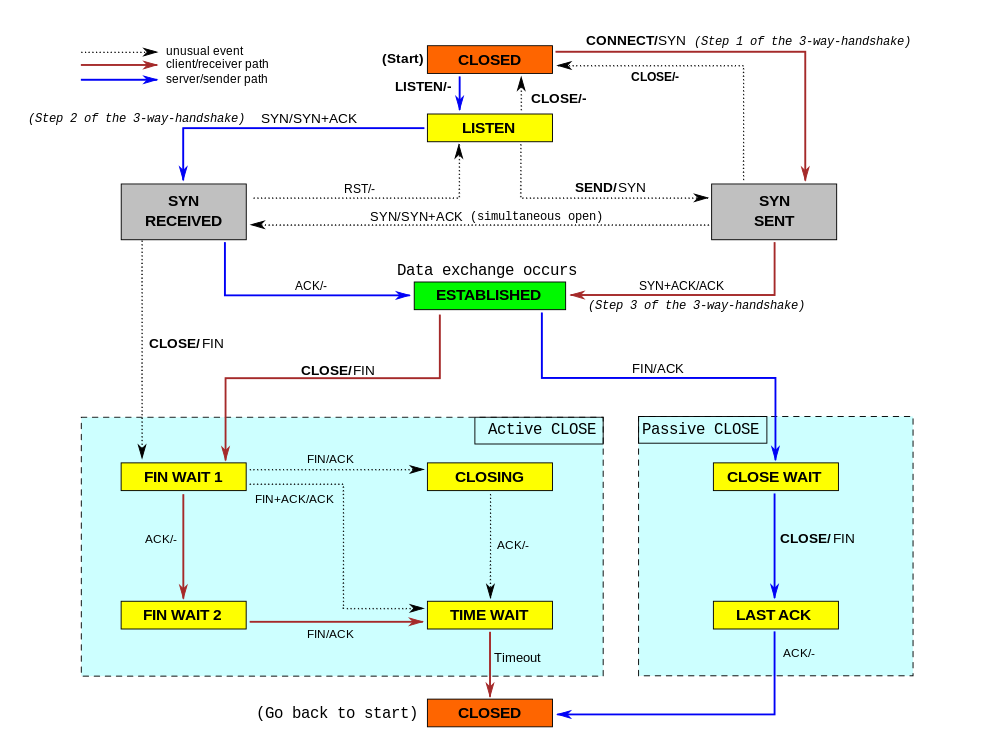

# When TCP sockets refuse to die

> [https://blog.cloudflare.com/when-tcp-sockets-refuse-to-die/](https://blog.cloudflare.com/when-tcp-sockets-refuse-to-die/)

While working on our [Spectrum server](https://www.cloudflare.com/products/cloudflare-spectrum/), we noticed something weird: the TCP sockets which we thought should have been closed were lingering around. We realized we don't really understand when TCP sockets are supposed to time out!



[Image](https://commons.wikimedia.org/wiki/File:Tcp_state_diagram_fixed_new.svg) by Sergiodc2 CC BY SA 3.0

In our code, we wanted to make sure we don't hold connections to dead hosts. In our early code we naively thought enabling TCP keepalives would be enough... but it isn't. It turns out a fairly modern [TCP_USER_TIMEOUT](https://tools.ietf.org/html/rfc5482) socket option is equally as important. Furthermore it interacts with TCP keepalives in subtle ways. [Many people](http://codearcana.com/posts/2015/08/28/tcp-keepalive-is-a-lie.html) are confused by this.

In this blog post, we'll try to show how these options work. We'll show how a TCP socket can timeout during various stages of its lifetime, and how TCP keepalives and user timeout influence that. To better illustrate the internals of TCP connections, we'll mix the outputs of the `tcpdump` and the `ss -o` commands. This nicely shows the transmitted packets and the changing parameters of the TCP connections.

## SYN-SENT

Let's start from the simplest case - what happens when one attempts to establish a connection to a server which discards inbound SYN packets?

The scripts used here [are available on our Github](https://github.com/cloudflare/cloudflare-blog/tree/master/2019-09-tcp-keepalives).

```
$ sudo ./test-syn-sent.py
# all packets dropped
00:00.000 IP host.2 > host.1: Flags [S] # initial SYN

State    Recv-Q Send-Q Local:Port Peer:Port
SYN-SENT 0      1      host:2     host:1    timer:(on,940ms,0)

00:01.028 IP host.2 > host.1: Flags [S] # first retry
00:03.044 IP host.2 > host.1: Flags [S] # second retry
00:07.236 IP host.2 > host.1: Flags [S] # third retry
00:15.427 IP host.2 > host.1: Flags [S] # fourth retry
00:31.560 IP host.2 > host.1: Flags [S] # fifth retry
01:04.324 IP host.2 > host.1: Flags [S] # sixth retry
02:10.000 connect ETIMEDOUT
```

Ok, this was easy. After the `connect()` syscall, the operating system sends a SYN packet. Since it didn't get any response the OS will by default retry sending it 6 times. This can be tweaked by the sysctl:

```
$ sysctl net.ipv4.tcp_syn_retries
net.ipv4.tcp_syn_retries = 6
```

It's possible to overwrite this setting per-socket with the TCP_SYNCNT setsockopt:

```
setsockopt(sd, IPPROTO_TCP, TCP_SYNCNT, 6);
```

The retries are staggered at 1s, 3s, 7s, 15s, 31s, 63s marks (the inter-retry time starts at 2s and then doubles each time). By default the whole process takes 130 seconds, until the kernel gives up with the ETIMEDOUT errno. At this moment in the lifetime of a connection, SO_KEEPALIVE settings are ignored, but TCP_USER_TIMEOUT is not. For example, setting it to 5000ms, will cause the following interaction:

```
$ sudo ./test-syn-sent.py 5000
# all packets dropped
00:00.000 IP host.2 > host.1: Flags [S] # initial SYN

State    Recv-Q Send-Q Local:Port Peer:Port
SYN-SENT 0      1      host:2     host:1    timer:(on,996ms,0)

00:01.016 IP host.2 > host.1: Flags [S] # first retry
00:03.032 IP host.2 > host.1: Flags [S] # second retry
00:05.016 IP host.2 > host.1: Flags [S] # what is this?
00:05.024 IP host.2 > host.1: Flags [S] # what is this?
00:05.036 IP host.2 > host.1: Flags [S] # what is this?
00:05.044 IP host.2 > host.1: Flags [S] # what is this?
00:05.050 connect ETIMEDOUT
```

Even though we set user-timeout to 5s, we still saw the six SYN retries on the wire. This behaviour is probably a bug (as tested on 5.2 kernel): we would expect only two retries to be sent - at 1s and 3s marks and the socket to expire at 5s mark. Instead we saw this, but also we saw further 4 retransmitted SYN packets aligned to 5s mark - which makes no sense. Anyhow, we learned a thing - the **TCP_USER_TIMEOUT does affect the behaviour of `connect()`.**

## SYN-RECV

SYN-RECV sockets are usually hidden from the application. They live as mini-sockets on the SYN queue. We wrote about [the SYN and Accept queues in the past](https://blog.cloudflare.com/syn-packet-handling-in-the-wild/). Sometimes, when SYN cookies are enabled, the sockets may skip the SYN-RECV state altogether.

In SYN-RECV state, the socket will retry sending SYN+ACK 5 times as controlled by:

```
$ sysctl net.ipv4.tcp_synack_retries
net.ipv4.tcp_synack_retries = 5
```

Here is how it looks on the wire:

```
$ sudo ./test-syn-recv.py
00:00.000 IP host.2 > host.1: Flags [S]
# all subsequent packets dropped
00:00.000 IP host.1 > host.2: Flags [S.] # initial SYN+ACK

State    Recv-Q Send-Q Local:Port Peer:Port
SYN-RECV 0      0      host:1     host:2    timer:(on,996ms,0)

00:01.033 IP host.1 > host.2: Flags [S.] # first retry
00:03.045 IP host.1 > host.2: Flags [S.] # second retry
00:07.301 IP host.1 > host.2: Flags [S.] # third retry
00:15.493 IP host.1 > host.2: Flags [S.] # fourth retry
00:31.621 IP host.1 > host.2: Flags [S.] # fifth retry
01:04:610 SYN-RECV disappears
```

With default settings, the SYN+ACK is re-transmitted at 1s, 3s, 7s, 15s, 31s marks, and the SYN-RECV socket disappears at the 64s mark.

Neither SO_KEEPALIVE nor TCP_USER_TIMEOUT affect the lifetime of SYN-RECV sockets.

## Final handshake ACK

After receiving the second packet in the TCP handshake - the SYN+ACK - the client socket moves to an ESTABLISHED state. The server socket remains in SYN-RECV until it receives the final ACK packet.

Losing this ACK doesn't change anything - the server socket will just take a bit longer to move from SYN-RECV to ESTAB. Here is how it looks:

```
00:00.000 IP host.2 > host.1: Flags [S]
00:00.000 IP host.1 > host.2: Flags [S.]
00:00.000 IP host.2 > host.1: Flags [.] # initial ACK, dropped

State    Recv-Q Send-Q Local:Port  Peer:Port
SYN-RECV 0      0      host:1      host:2 timer:(on,1sec,0)
ESTAB    0      0      host:2      host:1

00:01.014 IP host.1 > host.2: Flags [S.]
00:01.014 IP host.2 > host.1: Flags [.]  # retried ACK, dropped

State    Recv-Q Send-Q Local:Port Peer:Port
SYN-RECV 0      0      host:1     host:2    timer:(on,1.012ms,1)
ESTAB    0      0      host:2     host:1
```

As you can see SYN-RECV, has the "on" timer, the same as in example before. We might argue this final ACK doesn't really carry much weight. **This thinking lead to the development of TCP_DEFER_ACCEPT feature - it basically causes the third ACK to be silently dropped. With this flag set the socket remains in SYN-RECV state until it receives the first packet with actual data**:

```
$ sudo ./test-syn-ack.py
00:00.000 IP host.2 > host.1: Flags [S]
00:00.000 IP host.1 > host.2: Flags [S.]
00:00.000 IP host.2 > host.1: Flags [.] # delivered, but the socket stays as SYN-RECV

State    Recv-Q Send-Q Local:Port Peer:Port
SYN-RECV 0      0      host:1     host:2    timer:(on,7.192ms,0)
ESTAB    0      0      host:2     host:1

00:08.020 IP host.2 > host.1: Flags [P.], length 11  # payload moves the socket to ESTAB

State Recv-Q Send-Q Local:Port Peer:Port
ESTAB 11     0      host:1     host:2
ESTAB 0      0      host:2     host:1
```

The server socket remained in the SYN-RECV state even after receiving the final TCP-handshake ACK. It has a funny "on" timer, with the counter stuck at 0 retries. It is converted to ESTAB - and moved from the SYN to the accept queue - after the client sends a data packet or after the TCP_DEFER_ACCEPT timer expires. Basically, with DEFER ACCEPT the SYN-RECV mini-socket [discards the data-less inbound ACK](https://marc.info/?l=linux-netdev&m=118793048828251&w=2).

## Idle ESTAB is forever

Let's move on and discuss a fully-established socket connected to an unhealthy (dead) peer. After completion of the handshake, the sockets on both sides move to the ESTABLISHED state, like:

```
State Recv-Q Send-Q Local:Port Peer:Port
ESTAB 0      0      host:2     host:1
ESTAB 0      0      host:1     host:2
```

These sockets have no running timer by default - they will remain in that state forever, even if the communication is broken. The TCP stack will notice problems only when one side attempts to send something. This raises a question - what to do if you don't plan on sending any data over a connection? How do you make sure an idle connection is healthy, without sending any data over it?

This is where TCP keepalives come in. Let's see it in action - in this example we used the following toggles:

- SO_KEEPALIVE = 1 - Let's enable keepalives.
- TCP_KEEPIDLE = 5 - Send first keepalive probe after 5 seconds of idleness.
- TCP_KEEPINTVL = 3 - Send subsequent keepalive probes after 3 seconds.
- TCP_KEEPCNT = 3 - Time out after three failed probes.

```
$ sudo ./test-idle.py
00:00.000 IP host.2 > host.1: Flags [S]
00:00.000 IP host.1 > host.2: Flags [S.]
00:00.000 IP host.2 > host.1: Flags [.]

State Recv-Q Send-Q Local:Port Peer:Port
ESTAB 0      0      host:1     host:2
ESTAB 0      0      host:2     host:1  timer:(keepalive,2.992ms,0)

# all subsequent packets dropped
00:05.083 IP host.2 > host.1: Flags [.], ack 1 # first keepalive probe
00:08.155 IP host.2 > host.1: Flags [.], ack 1 # second keepalive probe
00:11.231 IP host.2 > host.1: Flags [.], ack 1 # third keepalive probe
00:14.299 IP host.2 > host.1: Flags [R.], seq 1, ack 1
```

Indeed! We can clearly see the first probe sent at the 5s mark, two remaining probes 3s apart - exactly as we specified. After a total of three sent probes, and a further three seconds of delay, the connection dies with ETIMEDOUT, and final the RST is transmitted.

For keepalives to work, the send buffer must be empty. You can notice the keepalive timer active in the "timer:(keepalive)" line.

## Keepalives with TCP_USER_TIMEOUT are confusing

We mentioned the TCP_USER_TIMEOUT option before. It sets the maximum amount of time that transmitted data may remain unacknowledged before the kernel forcefully closes the connection. On its own, it doesn't do much in the case of idle connections. The sockets will remain ESTABLISHED even if the connectivity is dropped. However, this socket option does change the semantics of TCP keepalives. [The tcp(7) manpage](https://linux.die.net/man/7/tcp) is somewhat confusing:

*Moreover, when used with the TCP keepalive (SO_KEEPALIVE) option, TCP_USER_TIMEOUT will override keepalive to determine when to close a connection due to keepalive failure.*

The original commit message has slightly more detail:

- [tcp: Add TCP_USER_TIMEOUT socket option](https://git.kernel.org/pub/scm/linux/kernel/git/torvalds/linux.git/commit/?id=dca43c75e7e545694a9dd6288553f55c53e2a3a3)

To understand the semantics, we need to look at the [kernel code in linux/net/ipv4/tcp_timer.c:693](https://github.com/torvalds/linux/blob/b41dae061bbd722b9d7fa828f35d22035b218e18/net/ipv4/tcp_timer.c#L693-L697):

```
if ((icsk->icsk_user_timeout != 0 &&
    elapsed >= msecs_to_jiffies(icsk->icsk_user_timeout) &&
    icsk->icsk_probes_out > 0) ||
```

For the user timeout to have any effect, the `icsk_probes_out` must not be zero. The check for user timeout is done only *after* the first probe went out. Let's check it out. Our connection settings:

- TCP_USER_TIMEOUT = 5*1000 - 5 seconds
- SO_KEEPALIVE = 1 - enable keepalives
- TCP_KEEPIDLE = 1 - send first probe quickly - 1 second idle
- TCP_KEEPINTVL = 11 - subsequent probes every 11 seconds
- TCP_KEEPCNT = 3 - send three probes before timing out

```
00:00.000 IP host.2 > host.1: Flags [S]
00:00.000 IP host.1 > host.2: Flags [S.]
00:00.000 IP host.2 > host.1: Flags [.]

# all subsequent packets dropped
00:01.001 IP host.2 > host.1: Flags [.], ack 1 # first probe
00:12.233 IP host.2 > host.1: Flags [R.] # timer for second probe fired, socket aborted due to TCP_USER_TIMEOUT
```

So what happened? The connection sent the first keepalive probe at the 1s mark. Seeing no response the TCP stack then woke up 11 seconds later to send a second probe. This time though, it executed the USER_TIMEOUT code path, which decided to terminate the connection immediately.

What if we bump TCP_USER_TIMEOUT to larger values, say between the second and third probe? Then, the connection will be closed on the third probe timer. With TCP_USER_TIMEOUT set to 12.5s:

```
00:01.022 IP host.2 > host.1: Flags [.] # first probe
00:12.094 IP host.2 > host.1: Flags [.] # second probe
00:23.102 IP host.2 > host.1: Flags [R.] # timer for third probe fired, socket aborted due to TCP_USER_TIMEOUT
```

We’ve shown how TCP_USER_TIMEOUT interacts with keepalives for small and medium values. The last case is when TCP_USER_TIMEOUT is extraordinarily large. Say we set it to 30s:

```
00:01.027 IP host.2 > host.1: Flags [.], ack 1 # first probe
00:12.195 IP host.2 > host.1: Flags [.], ack 1 # second probe
00:23.207 IP host.2 > host.1: Flags [.], ack 1 # third probe
00:34.211 IP host.2 > host.1: Flags [.], ack 1 # fourth probe! But TCP_KEEPCNT was only 3!
00:45.219 IP host.2 > host.1: Flags [.], ack 1 # fifth probe!
00:56.227 IP host.2 > host.1: Flags [.], ack 1 # sixth probe!
01:07.235 IP host.2 > host.1: Flags [R.], seq 1 # TCP_USER_TIMEOUT aborts conn on 7th probe timer
```

We saw six keepalive probes on the wire! With TCP_USER_TIMEOUT set, the TCP_KEEPCNT is totally ignored. If you want TCP_KEEPCNT to make sense, the only sensible USER_TIMEOUT value is slightly smaller than:

```
TCP_KEEPIDLE + TCP_KEEPINTVL * TCP_KEEPCNT
```

## Busy ESTAB socket is not forever

Thus far we have discussed the case where the connection is idle. Different rules apply when the connection has unacknowledged data in a send buffer.

Let's prepare another experiment - after the three-way handshake, let's set up a firewall to drop all packets. Then, let's do a `send` on one end to have some dropped packets in-flight. An experiment shows the sending socket dies after ~16 minutes:

```
00:00.000 IP host.2 > host.1: Flags [S]
00:00.000 IP host.1 > host.2: Flags [S.]
00:00.000 IP host.2 > host.1: Flags [.]

# All subsequent packets dropped
00:00.206 IP host.2 > host.1: Flags [P.], length 11 # first data packet
00:00.412 IP host.2 > host.1: Flags [P.], length 11 # early retransmit, doesn't count
00:00.620 IP host.2 > host.1: Flags [P.], length 11 # 1st retry
00:01.048 IP host.2 > host.1: Flags [P.], length 11 # 2nd retry
00:01.880 IP host.2 > host.1: Flags [P.], length 11 # 3rd retry

State Recv-Q Send-Q Local:Port Peer:Port
ESTAB 0      0      host:1     host:2
ESTAB 0      11     host:2     host:1    timer:(on,1.304ms,3)

00:03.543 IP host.2 > host.1: Flags [P.], length 11 # 4th
00:07.000 IP host.2 > host.1: Flags [P.], length 11 # 5th
00:13.656 IP host.2 > host.1: Flags [P.], length 11 # 6th
00:26.968 IP host.2 > host.1: Flags [P.], length 11 # 7th
00:54.616 IP host.2 > host.1: Flags [P.], length 11 # 8th
01:47.868 IP host.2 > host.1: Flags [P.], length 11 # 9th
03:34.360 IP host.2 > host.1: Flags [P.], length 11 # 10th
05:35.192 IP host.2 > host.1: Flags [P.], length 11 # 11th
07:36.024 IP host.2 > host.1: Flags [P.], length 11 # 12th
09:36.855 IP host.2 > host.1: Flags [P.], length 11 # 13th
11:37.692 IP host.2 > host.1: Flags [P.], length 11 # 14th
13:38.524 IP host.2 > host.1: Flags [P.], length 11 # 15th
15:39.500 connection ETIMEDOUT
```

The data packet is retransmitted 15 times, as controlled by:

```
$ sysctl net.ipv4.tcp_retries2
net.ipv4.tcp_retries2 = 15
```

From the [`ip-sysctl.txt`](https://www.kernel.org/doc/Documentation/networking/ip-sysctl.txt) documentation:

*The default value of 15 yields a hypothetical timeout of 924.6 seconds and is a lower bound for the effective timeout. TCP will effectively time out at the first RTO which exceeds the hypothetical timeout.*

The connection indeed died at ~940 seconds. Notice the socket has the "on" timer running. It doesn't matter at all if we set SO_KEEPALIVE - when the "on" timer is running, keepalives are not engaged.

TCP_USER_TIMEOUT keeps on working though. The connection will be aborted *exactly* after user-timeout specified time since the last received packet. With the user timeout set the `tcp_retries2` value is ignored.

## Zero window ESTAB is... forever?

There is one final case worth mentioning. If the sender has plenty of data, and the receiver is slow, then TCP flow control kicks in. At some point the receiver will ask the sender to stop transmitting new data. This is a slightly different condition than the one described above.

In this case, with flow control engaged, there is no in-flight or unacknowledged data. Instead the receiver throttles the sender with a "zero window" notification. Then the sender periodically checks if the condition is still valid with "window probes". In this experiment we reduced the receive buffer size for simplicity. Here's how it looks on the wire:

```
00:00.000 IP host.2 > host.1: Flags [S]
00:00.000 IP host.1 > host.2: Flags [S.], win 1152
00:00.000 IP host.2 > host.1: Flags [.]

00:00.202 IP host.2 > host.1: Flags [.], length 576 # first data packet
00:00.202 IP host.1 > host.2: Flags [.], ack 577, win 576
00:00.202 IP host.2 > host.1: Flags [P.], length 576 # second data packet
00:00.244 IP host.1 > host.2: Flags [.], ack 1153, win 0 # throttle it! zero-window

00:00.456 IP host.2 > host.1: Flags [.], ack 1 # zero-window probe
00:00.456 IP host.1 > host.2: Flags [.], ack 1153, win 0 # nope, still zero-window

State Recv-Q Send-Q Local:Port Peer:Port
ESTAB 1152   0      host:1     host:2
ESTAB 0      129920 host:2     host:1  timer:(persist,048ms,0)
```

The packet capture shows a couple of things. First, we can see two packets with data, each 576 bytes long. They both were immediately acknowledged. The second ACK had "win 0" notification: the sender was told to stop sending data.

But the sender is eager to send more! The last two packets show a first "window probe": the sender will periodically send payload-less "ack" packets to check if the window size had changed. As long as the receiver keeps on answering, the sender will keep on sending such probes forever.

The socket information shows three important things:

- The read buffer of the reader is filled - thus the "zero window" throttling is expected.
- The write buffer of the sender is filled - we have more data to send.
- The sender has a "persist" timer running, counting the time until the next "window probe".

In this blog post we are interested in timeouts - what will happen if the window probes are lost? Will the sender notice?

By default the window probe is retried 15 times - adhering to the usual `tcp_retries2` setting.

The tcp timer is in `persist` state, so the TCP keepalives will *not* be running. The SO_KEEPALIVE settings don't make any difference when window probing is engaged.

As expected, the TCP_USER_TIMEOUT toggle keeps on working. A slight difference is that similarly to user-timeout on keepalives, it's engaged only when the retransmission timer fires. During such an event, if more than user-timeout seconds since the last good packet passed, the connection will be aborted.

## Note about using application timeouts

In the past we have shared an interesting war story:

- [The curious case of slow downloads](https://blog.cloudflare.com/the-curious-case-of-slow-downloads/)

Our HTTP server gave up on the connection after an application-managed timeout fired. This was a bug - a slow connection might have correctly slowly drained the send buffer, but the application server didn't notice that.

We abruptly dropped slow downloads, even though this wasn't our intention. We just wanted to make sure the client connection was still healthy. It would be better to use TCP_USER_TIMEOUT than rely on application-managed timeouts.

But this is not sufficient. We also wanted to guard against a situation where a client stream is valid, but is stuck and doesn't drain the connection. The only way to achieve this is to periodically check the amount of unsent data in the send buffer, and see if it shrinks at a desired pace.

For typical applications sending data to the Internet, I would recommend:

1. Enable TCP keepalives. This is needed to keep some data flowing in the idle-connection case.
2. Set TCP_USER_TIMEOUT to `TCP_KEEPIDLE + TCP_KEEPINTVL * TCP_KEEPCNT`.
3. Be careful when using application-managed timeouts. To detect TCP failures use TCP keepalives and user-timeout. If you want to spare resources and make sure sockets don't stay alive for too long, consider periodically checking if the socket is draining at the desired pace. You can use `ioctl(TIOCOUTQ)` for that, but it counts both data buffered (notsent) on the socket and in-flight (unacknowledged) bytes. A better way is to use TCP_INFO tcpi_notsent_bytes parameter, which reports only the former counter.

An example of checking the draining pace:

```
while True:
    notsent1 = get_tcp_info(c).tcpi_notsent_bytes
    notsent1_ts = time.time()
    ...
    poll.poll(POLL_PERIOD)
    ...
    notsent2 = get_tcp_info(c).tcpi_notsent_bytes
    notsent2_ts = time.time()
    pace_in_bytes_per_second = (notsent1 - notsent2) / (notsent2_ts - notsent1_ts)
    if pace_in_bytes_per_second > 12000:
        # pace is above effective rate of 96Kbps, ok!
    else:
        # socket is too slow...
```

There are ways to further improve this logic. We could use [`TCP_NOTSENT_LOWAT`](https://lwn.net/Articles/560082/), although it's generally only useful for situations where the send buffer is relatively empty. Then we could use the [`SO_TIMESTAMPING`](https://www.kernel.org/doc/Documentation/networking/timestamping.txt) interface for notifications about when data gets delivered. Finally, if we are done sending the data to the socket, it's possible to just call `close()` and defer handling of the socket to the operating system. Such a socket will be stuck in FIN-WAIT-1 or LAST-ACK state until it correctly drains.

## Summary

In this post we discussed five cases where the TCP connection may notice the other party going away:

- SYN-SENT: The duration of this state can be controlled by `TCP_SYNCNT` or `tcp_syn_retries`.
- SYN-RECV: It's usually hidden from application. It is tuned by `tcp_synack_retries`.
- Idling ESTABLISHED connection, will never notice any issues. A solution is to use TCP keepalives.
- Busy ESTABLISHED connection, adheres to `tcp_retries2` setting, and ignores TCP keepalives.
- Zero-window ESTABLISHED connection, adheres to `tcp_retries2` setting, and ignores TCP keepalives.

Especially the last two ESTABLISHED cases can be customized with TCP_USER_TIMEOUT, but this setting also affects other situations. Generally speaking, it can be thought of as a hint to the kernel to abort the connection after so-many seconds since the last good packet. This is a dangerous setting though, and if used in conjunction with TCP keepalives should be set to a value slightly lower than `TCP_KEEPIDLE + TCP_KEEPINTVL * TCP_KEEPCNT`. Otherwise it will affect, and potentially cancel out, the TCP_KEEPCNT value.

In this post we presented scripts showing the effects of timeout-related socket options under various network conditions. Interleaving the `tcpdump` packet capture with the output of `ss -o` is a great way of understanding the networking stack. We were able to create reproducible test cases showing the "on", "keepalive" and "persist" timers in action. This is a very useful framework for further experimentation.

Finally, it's surprisingly hard to tune a TCP connection to be confident that the remote host is actually up. During our debugging we found that looking at the send buffer size and currently active TCP timer can be very helpful in understanding whether the socket is actually healthy. The bug in our Spectrum application turned out to be a wrong TCP_USER_TIMEOUT setting - without it sockets with large send buffers were lingering around for way longer than we intended.

The scripts used in this article [can be found on our Github](https://github.com/cloudflare/cloudflare-blog/tree/master/2019-09-tcp-keepalives).