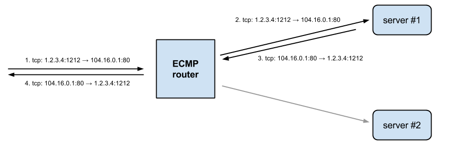
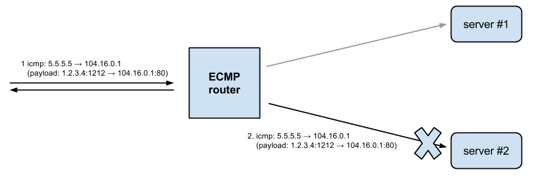

# Path MTU discovery in practice

> https://blog.cloudflare.com/path-mtu-discovery-in-practice/

Last week, a very small number of our users who are using IP tunnels (primarily tunneling IPv6 over IPv4) were unable to access our services because a networking change broke "path MTU discovery" on our servers. In this article, I'll explain what path MTU discovery is, how we broke it, how we fixed it, and the open source code we used.


via [Flickr](https://www.flickr.com/photos/balintfoeldesi/)

### First There Was the Fragmentation

When a host on the Internet wants to send some data, it must know how to divide the data into packets. And in particular, it needs to know the maximum size of packet. The maximum size of a packet a host can send is called [Maximum Transmission Unit: MTU](https://en.wikipedia.org/wiki/Maximum_transmission_unit).

The longer the MTU the better for performance, but the worse for reliability. This is because a lost packet means more data to be retransmitted and because many routers on the Internet can't deliver very long packets.

The fathers of the Internet assumed that this problem would be solved at the IP layer with IP fragmentation. Unfortunately IP [fragmentation has serious disadvantages](http://www.hpl.hp.com/techreports/Compaq-DEC/WRL-87-3.pdf), and it's avoided in practice.

### Do-not-fragment bit

To work around fragmentation problems the IP layer contains a "Don't Fragment" bit on every IP packet. It forbids any router on the path from performing fragmentation.

So what does the router do if it can't deliver a packet and can't fragment it either?

That's when the fun begins.

According to [RFC1191](https://tools.ietf.org/html/rfc1191):

> When a router is unable to forward a datagram because it exceeds the
> MTU of the next-hop network and its Don't Fragment bit is set, the
> router is required to return an ICMP Destination Unreachable message
> to the source of the datagram, with the Code indicating
> "fragmentation needed and DF set".

So a router must send [ICMP type 3 code 4 message](http://www.networksorcery.com/enp/protocol/icmp/msg3.htm). If you want to see one type:

```
tcpdump -s0 -p -ni eth0 'icmp and icmp[0] == 3 and icmp[1] == 4'
```

This ICMP message is supposed to be delivered to the originating host, which in turn should adjust the MTU setting for that particular connection. This mechanism is called [Path MTU Discovery](https://en.wikipedia.org/wiki/Path_MTU_Discovery).

In theory, it's great but unfortunately many things can go wrong when delivering ICMP packets. The most common problems are caused by misconfigured firewalls that drop ICMP packets.


via [Flickr](https://www.flickr.com/photos/gsfc/)

### Another Black Hole

A situation when a router drops packets but for some reason can't deliver relevant ICMP messages is called [an ICMP black hole](https://en.wikipedia.org/wiki/Black_hole_(networking)).

When that happens the whole connection gets stuck. The sending side constantly tries to resend lost packets, while the receiving side acknowledges only the small packets that get delivered.

There are generally three solutions to this problem.

*1) Reduce the MTU on the client side.*

The network stack hints its MTU in SYN packets when it opens a TCP/IP connection. This is called the MSS TCP option. You can see it in tcpdump, for example on my host (notice "mss 1460"):

```
$ sudo tcpdump -s0 -p -ni eth0 '(ip and ip[20+13] & tcp-syn != 0)'
10:24:13.920656 IP 192.168.97.138.55991 > 212.77.100.83.23: Flags [S], seq 711738977, win 29200, options [mss 1460,sackOK,TS val 6279040 ecr 0,nop,wscale 7], length 0
```

If you know you are behind a tunnel you might consider advising your operating system to reduce the advertised MTUs. In Linux it's as simple as (notice the `advmss 1400`):

```
$ ip route change default via <> advmss 1400
$ sudo tcpdump -s0 -p -ni eth0 '(ip and ip[20+13] & tcp-syn != 0)'
10:25:48.791956 IP 192.168.97.138.55992 > 212.77.100.83.23: Flags [S], seq 389206299, win 28000, options [mss 1400,sackOK,TS val 6302758 ecr 0,nop,wscale 7], length 0
```

*2) Reduce the MTU of all connections to the minimal value on the server side.*

It's a much harder problem to solve on the server side. A server can encounter clients with many different MTUs, and if you can't rely on Path MTU Discovery, you have a real problem. One commonly used workaround is to reduce the MTU for all of the outgoing packets. The minimal required [MTU for all IPv6 hosts is 1,280](https://www.ietf.org/rfc/rfc2460.txt), which is fair. Unfortunately for IPv4 the [value is 576 bytes](https://www.ietf.org/rfc/rfc791.txt). On the other hand [RFC4821](https://www.ietf.org/rfc/rfc4821.txt) suggests that it's "probably safe enough" to assume minimal MTU of 1,024. To change the MTU setting you can type:

```
ip -f inet6 route replace <> mtu 1280
```

(As a side note you could use `advmss` instead. The `mtu` setting is stronger, applying to all the packets, not only TCP. While `advmss` affects only the Path MTU hints given on TCP layer.)

Forcing a reduced packet size is not an optimal solution though.

*3) Enable smart MTU black hole detection.*

[RFC4821](https://www.ietf.org/rfc/rfc4821.txt) proposes a mechanism to detect ICMP black holes and tries to adjust the path MTU in a smart way. To enable this on Linux type:

```
echo 1 > /proc/sys/net/ipv4/tcp_mtu_probing
echo 1024 > /proc/sys/net/ipv4/tcp_base_mss
```

The second setting bumps the starting MSS used in discovery from a miserable default of 512 bytes to an RFC4821 suggested 1,024.

### CloudFlare Architecture

To understand what happened last week, first we need to make a detour and discuss our architecture. At CloudFlare [we use BGP in two ways](https://blog.cloudflare.com/cloudflares-architecture-eliminating-single-p/). We use it externally, the BGP that organizes the Internet, and internally between servers.

The internal use of BGP allows us to get high availability across servers. If a machine goes down the BGP router will notice and will push the traffic to another server automatically.

We've used this for a long time but last week increased its use in our network as we increased internal BGP load balancing. The load balancing mechanism is known as [ECMP: Equal Cost Multi Path routing](https://en.wikipedia.org/wiki/Equal-cost_multi-path_routing). From the configuration point of view the change was minimal, it only required adjusting the BGP metrics to equal values, the ECMP-enabled router does the rest of the work.

But with ECMP the router must be somewhat smart. It can't do true load balancing, as packets from one TCP connections could end up on a wrong server. Instead in ECMP the router [counts a hash from the usual tuple](http://www.slideshare.net/SkillFactory/02-34638420) extracted from every packet:

- For TCP it hashes a tuple (src ip, src port, dst ip, dst port)



And uses this hash to chose destination server. This guarantees that packets from one "flow" will always hit the same server.

### ECMP dislikes ICMP

ECMP will indeed forward TCP packets in a session to the appropriate server. Unfortunately, it has no special knowledge of ICMP and it hashes only (src ip, dst ip).



Where the the source IP is most likely an IP of a router on the Internet. In practice, this may sometimes end up delivering the ICMP packets to a different server than the one handling the TCP connection.

This is exactly what happened in our case.

### Temporary Fix

A couple of users who were accessing CloudFlare via IPv6 tunnels reported this problem. They were affected as almost every tunneling IPv6 has a reduced MTU.

As a temporary fix we reduced the MTU for all IPv6 paths to 1,280 (solution mentioned as #2). Many other providers have the same problem and use this trick on IPv6, and never send IPv6 packets greater than 1,280 bytes.

For better or worse this problem is not so prevalent on IPv4. Fewer people use IPv4 tunneling and the Path MTU problems were well understood for much longer. As temporary fix for IPv4, we deployed RFC4821 path MTU discovery (the solution mentioned in #3 above).

### Our solution: PMTUD

In the meantime we were working on a comprehensive and reliable solution the restores the real MTUs. The idea is to broadcast ICMP MTU messages to all servers. That way we can guarantee that ICMP messages will hit the relevant server that handles a particular flow, no matter where the ECMP router decides to forward it.

We're happy to open source our small "Path MTU Daemon" that does the work:

- https://github.com/cloudflare/pmtud

### Summary

Delivering Path MTU ICMP messages correctly in a network that uses ECMP for internal routing is a surprisingly hard problem. While there is still plenty to improve we're happy to report:

- Like many other companies we've reduced the MTU on IPv6 to safe
  value of 1,280. We'll consider bumping it to improve performance
  once we get more confident that our other fixes are working as
  intended.
- We're rolling out PMTUD to ensure "proper" routing of ICMP's path MTU messages within our datacenters.
- We're enabling the Linux RFC4821 Path MTU Discovery for IPv4, which
  should help with true ICMP black holes.

Found this article interesting? [Join our team](https://www.cloudflare.com/join-our-team), including to our [elite office in London](https://blog.cloudflare.com/cloudflare-london-were-hiring). We're constantly looking for talented developers and network engineers!

#### Appendix

To simulate a black hole we used this iptables rule:

```
iptables -I INPUT -s <src_ip> -m length --length 1400:1500 -j DROP
```

And this [Scapy](http://www.secdev.org/projects/scapy/) snippet to simulate MTU ICMP messages:

```python
#!/usr/bin/python
from scapy.all import *

def callback(pkt):
    pkt2 = IP(dst=pkt[IP].src) /
           ICMP(type=3,code=4,unused=1280) /
           str(pkt[IP])[:28]
    pkt2.show()
    send(pkt2)

if __name__ == '__main__':
    sniff(prn=callback,
          store=0,
          filter="ip and src <src_ip> and greater 1400")
```
