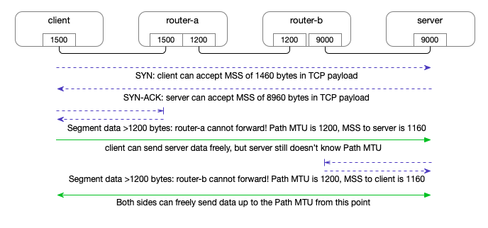

# PMTU

> http://packetbomb.com/troubleshooting-mtu-problems-with-wireshark/

## Path MTU Discovery by ICMP

> https://packetlife.net/blog/2008/aug/18/path-mtu-discovery/


> https://wiki.geant.org/display/public/EK/Path+MTU

### Traditional (RFC1191) Path MTU Discovery

RFC 1191 describes a method for a sender to detect the Path MTU to a given receiver. (RFC 1981 describes the equivalent for IPv6.) The method works as follows:

- The sending host will send packets to off-subnet destinations with the "Don't Fragment" bit set in the IP header.
- The sending host keeps a cache containing Path MTU estimates per destination host address. This cache is often implemented as an extension of the routing table.
- The Path MTU estimate for a new destination address is initialized to the MTU of the outgoing interface over which the destination is reached according to the local routing table.
- When the sending host receives an ICMP "Too Big" (or "Fragmentation Needed and Don't Fragment Bit Set") destination-unreachable message, it learns that the Path MTU to that destination is smaller than previously assumed, and updates the estimate accordingly.
- Normally, an ICMP "Too Big" message contains the next-hop MTU, and the sending host will use that as the new Path MTU estimate. The estimate can still be wrong because a subsequent link on the path may have an even smaller MTU.
- For destination addresses with a Path MTU estimate lower than the outgoing interface MTU, the sending host will occasionally attempt to raise the estimate, in case the path has changed to support a larger MTU.
- When trying ("probing") a larger Path MTU, the sending host can use a list of "common" MTUs, such as the MTUs associated with popular link layers, perhaps combined with popular tunneling overheads. This list can also be used to guess a smaller MTU in case an ICMP "Too Big" message is received that doesn't include any information about the next-hop MTU (maybe from a very very old router).

This method is widely implemented, but is not robust in todatcp_retries1y's Internet because it relies on ICMP packets sent by routers along the path. Such packets are often suppressed either at the router that should generate them (to protect its resources) or on the way back to the source, because of firewalls and other packet filters or rate limitations. These problems are described in `RFC 2923`. When packets are lost due to MTU issues without any ICMP "Too Big" message, this is sometimes called a (MTU) black hole. Some operating systems have added heuristics to detect such black holes and work around them. Workarounds can include lowering the MTU estimate or disabling PMTUD for certain destinations.


## Packetization Layer Path MTU Discovery

MTU black hole detection

### 规范

[RFC4821](https://www.ietf.org/rfc/rfc4821.txt) proposes a mechanism to detect ICMP black holes and tries to adjust the path MTU in a smart way.

> https://wiki.geant.org/display/public/EK/Path+MTU

### Packetization Layer Path MTU Discovery (PLPMTUD, RFC 4821 and RFC 8899)

An IETF Working Group (`pmtud`) was chartered to define a new mechanism for Path MTU Discovery to solve these issues. This process resulted in `RFC 4821`, *Packetization Layer Path MTU Discovery* ("PLPMTUD"), which was published in March 2007. This scheme requires cooperation from a network layer above IP, namely the layer that performs "packetization". This could be TCP, but could also be a layer above UDP, let's say an RPC or file transfer protocol. PLPMTUD does not require ICMP messages. The sending packetization layer starts with small packets, and probes progressively larger sizes. When there's an indication that a larger packet was successfully transmitted to the destination (presumably because some sort of ACK was received), the Path MTU estimate is raised accordingly.

When a large packet was lost, this might have been due to an MTU limitation, but it might also be due to other causes, such as congestion or a transmission error - or maybe it's just the ACK that was lost! **PLPMTUD recommends that the first time this happens, the sending packetization layer should assume an MTU issue, and try smaller packets.** An isolated incident need not be interpreted as an indication of congestion.

An implementation of the new scheme for the Linux kernel was integrated into version 2.6.17. It is controlled by a "sysctl" value that can be observed and set through `/proc/sys/net/ipv4/tcp_mtu_probing` . Possible values are:

- `0` : Don't perform PLPMTUD
- `1` : Perform PLPMTUD only after detecting a "blackhole" in old-style PMTUD
- `2` : Always perform PLPMTUD, and use the value of `tcp_base_mss` as the initial MSS.

A user-space implementation over [UDP](https://wiki.geant.org/pages/viewpage.action?pageId=121340506) is included in the [VFER](https://wiki.geant.org/display/EK/VferTool) bulk transfer tool.

RFC 8899, published in September 2020, updates `RFC 4821` by extending its use to datagram-oriented transports.

> http://ehealth-aussie.blogspot.com/2011/11/in-depth-look-into-path-mtu-discovery.html

Hopefully, IETF Working Group has worked out another way to detect MTU without the need of ICMP packet. Packetization Layer Path MTU Discovery (PLPMTUD, RFC 4821) can work over the network layer above IP, i.e., TCP or UDP. This makes PLPMTUD can work independent of ICMP messages. It starts probing from a small packet size set as inital MSS, then increase progressively to a larger size until a packet loss happens. The optimum size will be used as MTU for that particular connection.

On Linux, there are several network parameters for tweaking:

/proc/sys/net/ipv4/tcp_mtu_probing
/proc/sys/net/ipv4/tcp_base_mss
/proc/sys/net/ipv4/ip_no_pmtu_disc

Possible values of tcp_mtu_probing are:
0: Don't perform PLPMTUD
1: Perform PLPMTUD only after detecting a "blackhole" in old-style PMTUD
2: Always perform PLPMTUD, and use the value of tcp_base_mss as the initial MSS.

Setting tcp_mtu_probing to 1 makes sure that PLPMTUD will start only when black hole router is detected along the way to the destination IP.

Default value of tcp_base_mss is 512 and is supposed to remain the same.

ip_no_pmtu_disc is default to 0 whereas traditional PMTUD can be used at all time. Setting this to 1 seems to make it totally skip the old fashioned way to detect MTU size by using ICMP message.

ip_no_pmtu_disc 默认为 0，而传统的 PMTUD 可以一直使用。将此设置为 1 似乎使其完全跳过使用 ICMP 消息检测 MTU 大小的老式方法。

MTU Probing works by sending small packets initially and if they are acknowledged successfully, gradually increasing the packet size until the correct Path MTU can be found.

In Linux, we can modify the value of `/proc/sys/net/ipv4/tcp_mtu_probing` as follows:

- 0 - Disabled (default)
- 1 - Enabled only when PMTU black hole detected
- 2 - Always enabled, using the initial MSS value of `tcp_base_mss`

A value of 1 will use the normal PMTUD process, **however if packets are not being acknowledged, MTU Probing will kick in and begin retransmitting packets with the MSS set to the value of `tcp_base_mss` (default 512 Bytes)**. Assuming those packets are received by the end host and acknowledged successfully, the packet size will be increased further and the process repeated. The advantage of this method of probing is that it only comes into play when you start sending retransmissions, so all other traffic leading up to that point is sent using the default MTU. The main drawbacks are the increased amount of retransmitted traffic and the fact that it can take a little while to wait for the retransmissions with the higher MTU to occur.

A value of 2 simply forces MTU Probing at all times, so all packets will initially be sent with an MSS equal to `tcp_base_mss` and gradually increased in size if they are acknowledged. With this method, you won't have to wait for retransmissions before MTU Probing kicks in, however ALL outbound packets will initially be very small making this method of probing much less efficient than option 1.


### MTU/MSS Path MTU discovery retransmits

> Some case like this: https://theojulienne.io/2020/08/21/mtu-mss-why-connections-stall.html#:~:text=for%20it%20arises.-,Path%20MTU%20Discovery,-Path%20MTU%20Discovery





## Ref


- [TCP的MTU Probe、MSS、Retransmit 的关系 - cloud.tencent.com](https://cloud.tencent.com/developer/beta/article/1411873)

```{toctree}
tcp-mtu-probe.md
path-mtu-discovery-in-practice@cloudflare.md
```