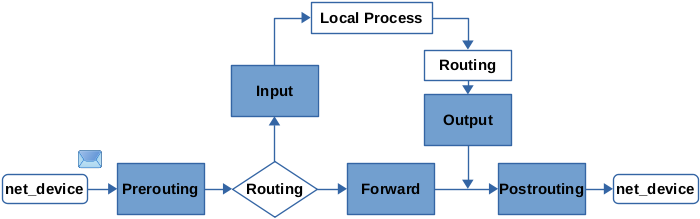
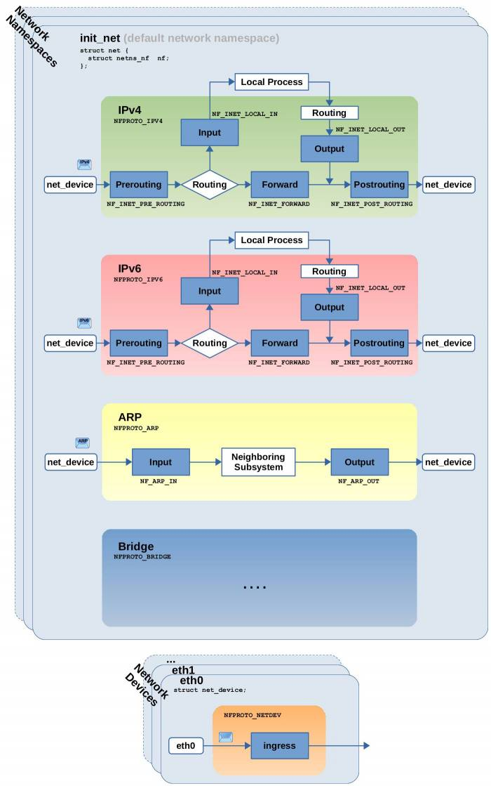
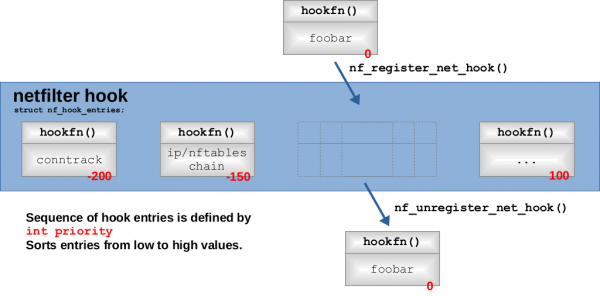
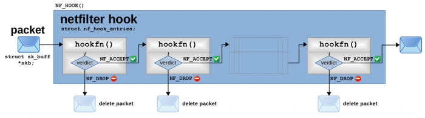
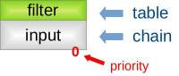
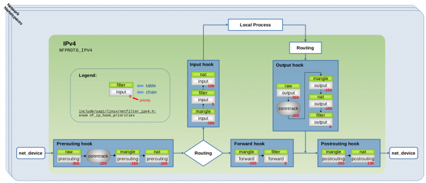
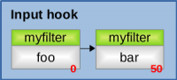
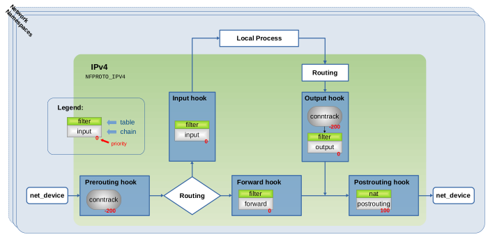

# Nftables - Packet flow and Netfilter hooks in detail

> from: [https://thermalcircle.de/doku.php?id=blog:linux:nftables_packet_flow_netfilter_hooks_detail](https://thermalcircle.de/doku.php?id=blog:linux:nftables_packet_flow_netfilter_hooks_detail)


If you are using *Iptables* or the newer *Nftables* and you are merely doing some simple packet filtering with IPv4, then you'll probably get enough info out of the official documentation and by a quick look through websites which provide example configurations. However, if you are working on a little bit more complex stuff like writing *Nftables* rules while caring for both IPv4 and IPv6, while using IPsec and doing NAT, or other of the “more interesting” stuff… then things tend to get a little more tricky. If you want to be sure to know what you are doing and to create and place your *tables*, *chains* and *rules* correctly to make them do the right thing… then it is beneficial to understand the flow of network packets and the internal workings of *Nftables* and the underlying *Netfilter* framework in a little more detail.

## Rationale

I for myself always like to know how things work and to dig a little deeper than just gaining the very minimum knowledge required to solve the issue at hand. Available documentation on this topic isn't bad, but like most other documentation it tends to leave some gaps and questions in your head unanswered and a lot of the available documentation is outdated. Many of the more interesting details are often only covered by older articles focused on the *Nftables* predecessor *Iptables*. After digging through a lot of websites, some kernel source code and doing some practical experimenting involving the *trace* and *log* features of *Nftables*, I like to share some things I've learned. With this article I'll try to explain *Nftables* concepts like *base chains*, *priority* and *address families* and put them in relation to the actual network packet flow through the *Netfilter* *hooks*.

## Worth a thousand words

Over the years several images have been created which intend to visualize the network packet flow through the *Netfilter* *hooks* in the Linux kernel, and thereby the packet flow through the *tables*, *chains* and *rules* of *Iptables* or *Nftables*. Probably the most famous, detailed and best maintained image is shown in Figure [1](https://thermalcircle.de/doku.php?id=blog:linux:nftables_packet_flow_netfilter_hooks_detail#nfpackflowofficial).

[](https://thermalcircle.de/lib/exe/fetch.php?media=linux:netfilter-packet-flow.png)

**Figure 1:** Netfilter Packet Flow image, published on [Wikipedia](https://commons.wikimedia.org/wiki/File:Netfilter-packet-flow.svg), [CC BY-SA 3.0](https://creativecommons.org/licenses/by-sa/3.0/deed.en)[1)](https://thermalcircle.de/doku.php?id=blog:linux:nftables_packet_flow_netfilter_hooks_detail#fn__1)

However, what this image shows you is the packet flow though the *Netfilter hooks* and thereby the packet flow through the *tables* and *chains* like they existed in old *Iptables*. In *Nftables* however you are free to create and name *tables* and *chains* to your liking, so things will probably look a little different then. The image still remains very useful, especially because it contains a lot of further details like *bridging*, *ingress* hook and *IPsec*/*Xfrm*[2)](https://thermalcircle.de/doku.php?id=blog:linux:nftables_packet_flow_netfilter_hooks_detail#fn__2), however when interpreting it you are required to “read a little bit between the lines”.

## Netfilter

The [Netfilter](https://en.wikipedia.org/wiki/Netfilter) framework within the Linux kernel is the basic building block on which packet selection systems like *Iptables* or the newer *Nftables* are built upon. It provides a bunch of *hooks* inside the Linux kernel, which are being traversed by network packets as those flow through the kernel. Other kernel components can register callback functions with those hooks, which enables them to examine the packets and to make decisions on whether packets shall be *dropped* (=deleted) or be *accepted* (=keep going on their way through the kernel). Figure [2](https://thermalcircle.de/doku.php?id=blog:linux:nftables_packet_flow_netfilter_hooks_detail#nfhookssimple) is a simplified version of the Netfilter packet flow image which shows these hooks.



> **Figure 2:** Netfilter hooks - simple block diagram

A network packet received on a network device first traverses the *Prerouting* hook. Then the routing decision happens and thereby the kernel determines whether this packet is destined at a local process (e.g. socket of a server listening on the system) or whether the packet shall be forwarded (in that case the system works as a router). In the first case the packet then traverses the *Input* hook and is then given to the local process. In the second case the packet traverses the *Forward* hook and finally the *Postrouting* hook, before being sent out on a network device. A packet which has been generated by a local process (e.g. a client or server software which likes to send something out on the network), first traverses the *Output* hook and then also the *Postrouting* hook, before it is sent out on a network device.

Those five hooks have been present in the Linux kernel for a very long time. You can e.g. already find an equivalent of Figure [2](https://thermalcircle.de/doku.php?id=blog:linux:nftables_packet_flow_netfilter_hooks_detail#nfhookssimple) in the [Linux netfilter Hacking HOWTO](https://netfilter.org/documentation/HOWTO//netfilter-hacking-HOWTO-3.html) from 2002. The good news is that at least from a bird's eye view all this is still accurate today. Of course, if you look into details, things are more complex now. I try to show that in Figure [3](https://thermalcircle.de/doku.php?id=blog:linux:nftables_packet_flow_netfilter_hooks_detail#nfhooksdetail). The *courier* font within the image indicates how things are named within the Linux kernel source code.

[](https://thermalcircle.de/lib/exe/fetch.php?media=linux:nf-hooks-detail1.jpg)

> **Figure 3:** Netfilter hooks in more detail: IPv4, IPv6, ARP, Bridging, network namespaces and Ingress

As you can see, those five hooks exist independently for the IPv4 and for the IPv6 protocol (meaning IPv4 and IPv6 packets each traverse their own hooks). Further hooks exist to be traversed by ARP packets or when you do *bridging* (I do not go into details about those here). An additional *ingress* hook exists, which exists independently for each network device. The list goes on… no guarantee for completeness[3)](https://thermalcircle.de/doku.php?id=blog:linux:nftables_packet_flow_netfilter_hooks_detail#fn__3). *Nftables* abstracts these things with what it calls *Address Families* (`ip`, `ip6`, `inet`, `arp`, `bridge`, `netdev`), but more about that later.

### Network Namespaces

If you do not work with or care about *network namespaces* or if you do not know what they are, then you can ignore this section. Just be aware: Even if you do not explicitly make use of network namespaces (e.g. by creating additional ones), still one instance, the default network namespace *“init_net”*, always exists and then all the networking happens inside this namespace.

All the mentioned hooks exist independently (=are being re-created) within each network namespace[4)](https://thermalcircle.de/doku.php?id=blog:linux:nftables_packet_flow_netfilter_hooks_detail#fn__4), as shown in Figure [3](https://thermalcircle.de/doku.php?id=blog:linux:nftables_packet_flow_netfilter_hooks_detail#nfhooksdetail). That means the data structures in the Linux kernel which hold the list of callback functions which are registered with the hooks, are re-created (initially empty) for each new network namespace. Thus, who is registered with those hooks is different and individual to each network namespace. Of course the actual concept of network namespaces and its impact goes far beyond just that, but that's not the topic of this article.

### Register hook functions

As already mentioned, the idea of the hooks is to give other kernel components the opportunity to register *callback* functions with a Netfilter hook which are then being called for each network packet which traverses this hook. *Netfilter* provides an API to do that and both *Iptables* and *Nftables* and further systems like *Connection Tracking* make use of it. This API provides the functions `nf_register_net_hook()` and `nf_unregister_net_hook()`[5)](https://thermalcircle.de/doku.php?id=blog:linux:nftables_packet_flow_netfilter_hooks_detail#fn__5) to register/unregister a callback function with a specific hook. Figure [4](https://thermalcircle.de/doku.php?id=blog:linux:nftables_packet_flow_netfilter_hooks_detail#nfhookregister) visualizes this.

[](https://thermalcircle.de/lib/exe/fetch.php?media=linux:nf-hook-entries-register1.png)

> **Figure 4:** Netfilter API to register/unregister callbacks (“hook functions”) with a hook

Several callback functions can be registered with the same hook. *Netfilter* holds the function pointers of those functions (together with some meta data) in an array, which is dynamically being grown or shrunk each time when some component registers/unregisters a function. Each Netfilter hook has its own array, implemented as an instance of `struct nf_hook_entries` in the kernel. In most other documentation on the Internet as well as in discussions among the Netfilter developer community, those registered callback functions are usually referred to as “hook functions”[6)](https://thermalcircle.de/doku.php?id=blog:linux:nftables_packet_flow_netfilter_hooks_detail#fn__6). Thus, I will also refer to them as “hook functions” from now on.

### Priority

The sequence of hook functions in this array is important, because network packets which traverse the hook, will traverse the hook functions in the sequence in which those are present within the array. When registering a hook function, the caller needs to specify a *priority* value (shown in red color in Figure [4](https://thermalcircle.de/doku.php?id=blog:linux:nftables_packet_flow_netfilter_hooks_detail#nfhookregister)), which is then used by *Netfilter* to determine WHERE to insert the new hook function into the array. The *priority* is a signed integer value (`int`) and the whole value range of that data type can be used. 

As you see in Figure [4](https://thermalcircle.de/doku.php?id=blog:linux:nftables_packet_flow_netfilter_hooks_detail#nfhookregister), *Netfilter* sorts the hook functions in **ascending order** from lower to higher *priority* values. Thus, a hook function with lower value like `-200` comes BEFORE a hook function with a higher value like `100`. However in practice not the full range of values of the *priority* integer seems to be used. The kernel contains several *enums* which define some common discrete *priority* values. Things seem a little messy(杂乱) here, because those enums are (a little) different for each protocol (= for each *Address Family* how *Nftables* would call it). Figure [5](https://thermalcircle.de/doku.php?id=blog:linux:nftables_packet_flow_netfilter_hooks_detail#nfipv4hookpriorities) shows as an example the enum for the IPv4 protocol.

```c
enum nf_ip_hook_priorities {
	NF_IP_PRI_FIRST = INT_MIN,
	NF_IP_PRI_RAW_BEFORE_DEFRAG = -450,
	NF_IP_PRI_CONNTRACK_DEFRAG = -400,
	NF_IP_PRI_RAW = -300,
	NF_IP_PRI_SELINUX_FIRST = -225,
	NF_IP_PRI_CONNTRACK = -200,
	NF_IP_PRI_MANGLE = -150,
	NF_IP_PRI_NAT_DST = -100,
	NF_IP_PRI_FILTER = 0,
	NF_IP_PRI_SECURITY = 50,
	NF_IP_PRI_NAT_SRC = 100,
	NF_IP_PRI_SELINUX_LAST = 225,
	NF_IP_PRI_CONNTRACK_HELPER = 300,
	NF_IP_PRI_CONNTRACK_CONFIRM = INT_MAX,
	NF_IP_PRI_LAST = INT_MAX,
};
```


> **Figure 5:** IPv4 hook priorities *enum*
> Source code extract from `include/uapi/linux/netfilter_ipv4.h`


I go into such detail here, because this enum shows you the discrete(离散的) *priority* values which are being used by kernel components like *connection tracking* when registering their own hook functions with a Netfilter hook. This is relevant for *Iptables* and *Nftabless* as you will see below.

### Hard-coded vs. Flexibility

The Netfilter hooks themselves are hard-coded into the Linux kernel network stack. You'll find them in the source code if you search for function calls named `NF_HOOK()`[7)](https://thermalcircle.de/doku.php?id=blog:linux:nftables_packet_flow_netfilter_hooks_detail#fn__7). In case you are wondering, why other kernel components are required to register hook functions with these Netfilter hooks at runtime and why those hook functions are not also hard coded… well I did not write this code, so your guess is as good as mine. There are many potential reasons which might have led to these design decisions, but common sense (and comments on some websites) made at least these two reasons obvious to me:

1. For once this kind of flexibility during runtime is an essential basic requirement in a kernel where many components (also *Nftables*, *Iptables* and *connection tracking*) can potentially be loaded or unloaded during runtime as *kernel modules* and which employs powerful concepts of further abstraction like *network namespaces*.
2. Performance is a crucial issue. Every network packet needs to traverse all hook functions registered with a Netfilter hook. Thus, those hook functions should be registered in an economical way. This is probably one of the driving reasons why *base chains* in *Nftables* need to be explicitly created by the user in contrast to the pre-defined chains of *Iptables* (more details below).

### Hook traversal and verdict

Now let's take a more detailed look on how the hook functions which are registered with the same Netfilter hook are being traversed by network packets. For each network packet which traverses this hook, the hook functions are being called one by one in the sequence/order in which they are present within the array of the hook (the sequence defined by the *priority* value).

[](https://thermalcircle.de/lib/exe/fetch.php?media=linux:nf-hook-entries-flow1.png)

> **Figure 6:** Packet flow through hook functions registered with a Netfilter hook (click to enlarge)

Network packets are represented within the Linux kernel as instances of `struct sk_buff` (often referred to as “socket buffer” and abbreviated as *“skb”*). A pointer to such an *skb* instance is given as function argument to all these hook functions , so each one can examine the packet. Each hook function is required to give a “verdict” back to *Netfilter* as *return-value*. There are several possible values for the “verdict”, but for understanding these concepts only these two are relevant: `NF_ACCEPT` and `NF_DROP`. `NF_ACCEPT` tells *Netfilter*, that the hook function “accepts” the network packet. This means the packet now traverses the next hook function registered with this hook (if existing). If all hook functions of this hook return `NF_ACCEPT`, then the packet finally continues its traversal of the kernel network stack. However, if a hook function returns `NF_DROP`, then the packet is being “dropped” (=deleted) and no further hook functions or parts of the network stack are being traversed.

## Iptables

To put things into context, let's take a short look at *Iptables* as the predecessor of *Nftables*. *Iptables* organizes its *rules* into *tables* and *chains*, whereas *tables* for the most part merely are a means (a container) to group *chains* together, which have something in common. E.g. *chains* which are used for *nat* belong to the `nat`[8)](https://thermalcircle.de/doku.php?id=blog:linux:nftables_packet_flow_netfilter_hooks_detail#fn__8) *table*. The actual *rules* reside inside the *chains*. *Iptables* registers its *chains* with the Netfilter hooks by registering its own hook functions as described above. This means when a network packet traverses a hook (e.g. *Prerouting*), then this packet traverses the *chains* which are registered with this hook and thereby traverses their *rules*.

In case of *Iptables* all that is already pre-defined. A fixed set of *tables* exists, each *table* containing a fixed set of *chains*[9)](https://thermalcircle.de/doku.php?id=blog:linux:nftables_packet_flow_netfilter_hooks_detail#fn__9). The *chains* are named like the Netfilter hooks with which they are registered.

| table    | contains chains                                              | command to show that      |
| :------- | :----------------------------------------------------------- | :------------------------ |
| `filter` | `INPUT`, `FORWARD`, `OUTPUT`                                 | `iptables [-t filter] -L` |
| `nat`    | `PREROUTING`, (`INPUT`)[10)](https://thermalcircle.de/doku.php?id=blog:linux:nftables_packet_flow_netfilter_hooks_detail#fn__10), `OUTPUT`, `POSTROUTING` | `iptables -t nat -L`      |
| `mangle` | `PREROUTING`, `INPUT`, `FORWARD`, `OUTPUT`, `POSTROUTING`    | `iptables -t mangle -L`   |
| `raw`    | `PREROUTING`, `OUTPUT`                                       | `iptables -t raw -L`      |

The sequence in which the *chains* are being traversed when a packet traverses the hook (their *priority*) is also already fixed. The Netfilter packet flow image (Figure [1](https://thermalcircle.de/doku.php?id=blog:linux:nftables_packet_flow_netfilter_hooks_detail#nfpackflowofficial)) shows this sequence in detail. In the image, each *chain* registered with a hook is represented by a block like the following in Figure [7](https://thermalcircle.de/doku.php?id=blog:linux:nftables_packet_flow_netfilter_hooks_detail#nfhookentrylegend), containing the name of the *chain* and the *table* it belongs to.

[](https://thermalcircle.de/lib/exe/fetch.php?media=linux:nf-hook-entry-legend1.jpg)

> **Figure 7:** Understanding how tables/chains are visualized in the Netfilter packet flow image ([1](https://thermalcircle.de/doku.php?id=blog:linux:nftables_packet_flow_netfilter_hooks_detail#nfpackflowofficial)).

I additionally show the *priority* here (in red color) because I like to further elaborate(精心制作的) on it. However, the *priority* value is not shown in the original Netfilter packet flow image. The `iptables` cmdline tool itself is only responsible for configuring *tables*, *chains* and *rules* for handling IPv4 packets. Thus, its corresponding kernel component only registers its *chains* with the five *Netfilter* hooks of the IPv4 protocol. To cover all the protocol families, the complete *Iptables* suite is split up into several distinct cmdline tools and corresponding kernel components:

- `iptables` for IPv4 / `NFPROTO_IPV4`
- `ip6tables` for IPv6 / `NFPROTO_IPV6`
- `arptables` for ARP / `NFPROTO_ARP`
- `ebtables` for Bridging / `NFPROTO_BRIDGE`

Let's take a look at `iptables` for IPv4. Because the *Iptables* *chains* are named after the hooks they are registered with, interpreting the Netfilter packet flow image is straightforward, as shown in Figure [8](https://thermalcircle.de/doku.php?id=blog:linux:nftables_packet_flow_netfilter_hooks_detail#nfthooksiptables).

[](https://thermalcircle.de/lib/exe/fetch.php?media=linux:nf-hooks-iptables1.png)

> **Figure 8:** *Iptables* chains registered with IPv4 Netfilter hooks (+conntrack) (click to enlarge) (compare to [1](https://thermalcircle.de/doku.php?id=blog:linux:nftables_packet_flow_netfilter_hooks_detail#nfpackflowofficial))

## Connection tracking

As you can see in Figure [8](https://thermalcircle.de/doku.php?id=blog:linux:nftables_packet_flow_netfilter_hooks_detail#nfthooksiptables), **the *connection tracking* system also registers itself with the Netfilter hooks and based on the *priority* value (`-200`)** you can clearly see which *Iptables* *chain* is called BEFORE and which AFTER the *connection tracking* hook function. There is much more to tell about *connection tracking*. If you further look into details, then you'll see that the *connection tracking* system actually even registers more hook functions with the Netfilter hooks, than shown here. However, the two hook functions shown represent a sufficient model to understand the behavior of *connection tracking* when creating *Iptables* or *Nftables* rules. I elaborate on the topic *connection tracking* in detail in a separate series of blog articles, starting with [Connection tracking - Part 1: Modules and Hooks](https://thermalcircle.de/doku.php?id=blog:linux:connection_tracking_1_modules_and_hooks).

## Nftables

In general *Nftables* organizes its *rules* into *tables* and *chains* in the same way *Iptables* does. *Tables* are again containers for *chains* and *chains* are carrying the *rules*. However, **in contrast to *`Iptables`*, no pre-defined *tables* or *chains* exist. All *tables* and *chains* have to be explicitly created by the user**. The user can give arbitrary names to the *tables* and *chains* when creating them. *Nftables* distinguishes between so-called *base chains* and *regular chains*. 

- A *`base chain`* is a *chain* which is being registered with a Netfilter hook (by means of hook functions as described above) and you must specify that hook when you create the *chain*. 

- A *`regular chain`* is not registered with any hook (*regular chains* are not covered in this article)[11)](https://thermalcircle.de/doku.php?id=blog:linux:nftables_packet_flow_netfilter_hooks_detail#fn__11). 

Thus, the user is not forced to name the *base chains* like the Netfilter hooks they will be registered with. This obviously offers more freedom and flexibility, but thereby also has more potential to create confusion.

### Address Families

In contrast to *Iptables*, *Nftables* is not split up into several userspace tools and corresponding kernel components to address the different groups of hooks which *Netfilter* provides. It solves this issue by introducing the concept of the so-called *Address Families*. When you create a *table* you need to specify to which *Address Family* it belongs to. The following *Address Families* exist and map to the following groups of *Netfilter* hooks:

- `ip`: maps to IPv4 protocol hooks / `NFPROTO_IPV4` (default)
- `ip6`: maps to IPv6 protocol hooks / `NFPROTO_IPV6`
- `inet`: maps to both IPv4 and IPv6 protocol hooks
- `arp`: maps to ARP protocol hooks / `NFPROTO_ARP`
- `bridge`: maps to bridging hooks / `NFPROTO_BRIDGE`
- `netdev`: maps to ingress hook / `NFPROTO_NETDEV`

As a result, all *base chains* which you create within a *table* will be registered with the specified *Netfilter* hook of that *Address Family* which you selected for the *table*. The `ip` *Address Family* (IPv4) is the default one. So, if you do not specify any *Address Family* when creating a *table*, then this *table* will belong to `ip`.

The following example creates a new table named `foo`, belonging to address family `ip`, then creates a new base chain named `bar` in table `foo`, registering it with *Netfilter* hook `input` of the `ip` address family (=IPv4 protocol) and specifying priority `0` (I explicitly specify `ip` *Address Family* here just to emphasize what is happening; it can be omitted.)

```
nft create table ip foo
nft create chain ip foo bar {type filter hook input priority 0\;}
```

The `inet` *Address Family* is special. When you create a *table* belonging to that family and then create a *base chain* within that *table*, then this *base chain* will get registered with two *Netfilter* hooks: The equivalent *hooks* of IPv4 and IPv6. This means both IPv4 and IPv6 packets will traverse the *rules* of this *chain*. The following example creates a table `foo` and a base chain `bar` in address family `inet`. Base chain `bar` will get registered with Netfilter `input` hook of IPv4 and also with Netfilter `input` hook of IPv6.

```
nft create table inet foo
nft create chain inet foo bar {type filter hook input priority 0\;}
```

### Nftables Priority

In the examples above you already saw that *Nftables* requires you to specify a *priority* value when creating a *base chain*. This is the very same *priority* as I described already in detail when covering *Netfilter* above. You can specify integer values, but the newer versions of *Nftables* also define placeholder names for several discrete *priority* values analog to the mentioned *enums* in *Netfilter*. The following table lists those placeholder names[12)](https://thermalcircle.de/doku.php?id=blog:linux:nftables_packet_flow_netfilter_hooks_detail#fn__12).

| Name                                                         | Priority Value |
| :----------------------------------------------------------- | :------------- |
| `raw`                                                        | `-300`         |
| `mangle`                                                     | `-150`         |
| conntrack[13)](https://thermalcircle.de/doku.php?id=blog:linux:nftables_packet_flow_netfilter_hooks_detail#fn__13) | `-200`         |
| `dstnat`                                                     | `-100`         |
| `filter`                                                     | `0`            |
| `security`                                                   | `50`           |
| `srcnat`                                                     | `100`          |

When creating a *base chain*, you can e.g. specify `priority filter` which translates into `priority 0`. The following example creates a *table* named `myfilter` in the `ip` *address family* (IPv4). It then creates two *base chains* named `foo` and `bar`, registering them with the *Netfilter* IPv4 hook *input*, but each with different *priority*. Figure [9](https://thermalcircle.de/doku.php?id=blog:linux:nftables_packet_flow_netfilter_hooks_detail#nftex3) shows the result. IPv4 network packets traversing the *Netfilter* hook *input* will first traverse the `foo` *chain* and then the `bar` *chain*.

```
nft create table ip myfilter
nft create chain ip myfilter foo {type filter hook input priority 0\;}
nft create chain ip myfilter bar {type filter hook input priority 50\;}
 
# alternatively you could create the same chains using named priority values:
nft create chain ip myfilter foo {type filter hook input priority filter\;}
nft create chain ip myfilter bar {type filter hook input priority security\;}
```



> **Figure 9:** Base chains `foo` and `bar` registered with the *Netfilter* Ipv4 *input* hook

*Nftables* currently has a limitation (see [bug ticket](https://bugzilla.netfilter.org/show_bug.cgi?id=1083)) which makes it difficult (or at least uncomfortable) to enter negative integer values for the *priority* on the `nft` command line. Using the placeholder names is probably the most comfortable workaround. Adding `--` after `nft` the another way to do it:

```
nft -- add chain foo bar {type nat hook input priority -100\;}
```

But what actually happens when you register two *base chains* with the same hook which both have the same *priority*? The source code of *Netfilter* answers this question. It actually allows to register hook functions with the same hook which have the same *priority* value. In case of the following example, function `nf_register_net_hook()` is first called for *chain1* and then for *chain2*.

```
nft create chain ip table1 chain1 {type filter hook input priority 0\;}
nft create chain ip table1 chain2 {type filter hook input priority 0\;}
```

I checked the kernel source code[14)](https://thermalcircle.de/doku.php?id=blog:linux:nftables_packet_flow_netfilter_hooks_detail#fn__14) and was able to confirm the behavior with the *Nftables* `nftrace` feature: The kernel code places *chain2* BEFORE (in front of) *chain1* in the array of hook functions for this hook. As a result, network packets then traverse *chain2* BEFORE *chain1*. This means here the sequence/order in which you issue the commands to register both chains becomes relevant! However, I guess it is best practice to consider the sequence in which two chains with equal *priority* on the same hook are traversed to be “undefined”, and thus to either avoid this case or to design the *rules* added to those *chains* in a way in which they do not depend on the the sequence of *chain* traversal. After all, the behavior I describe here is an internal kernel behavior which is undocumented and implementation could change with any newer kernel version. Thus, you should not rely on it!

### Best practices

Seems it has become common practice among most users to actually use the same naming concepts for *tables* and *chains* in *Nftables*, like they were used in *Iptables* (mainly naming the *base chains* like the hooks they get registered with). Further, it is good practice to only create the *tables* and *chains* you require for your use case. This not only makes your *ruleset* smaller and potentially easier to read and maintain, it is also relevant regarding performance. Be aware that each *chain* you create and register with one of the *Netfilter hooks* (= each *“base chain”*) will actually be traversed by network packets and thereby poses a performance penalty.

### Example: NAT edge router

The example in Figure [10](https://thermalcircle.de/doku.php?id=blog:linux:nftables_packet_flow_netfilter_hooks_detail#nftedgerouter) demonstrates an edge router, doing some simple IPv4 packet filtering and *SNAT* (masquerading). I merely gave a minimalist example here. One could even remove the *output* *chain* again, because I did not add any rules to it. In reality you for sure will add a more complex set of rules.


```bash
nft create table ip nat
nft create chain ip nat postrouting {type nat hook postrouting priority srcnat\;}
nft add rule ip nat postrouting oif eth1 masquerade
 
nft create table ip filter
nft create chain ip filter input {type filter hook input priority filter\;}
nft create chain ip filter forward {type filter hook forward priority filter\;}
nft create chain ip filter output {type filter hook output priority filter\;}
nft add rule ip filter forward iif eth1 oif eth0 ct state new,invalid drop
nft add rule ip filter input iif eth1 ip protocol != icmp ct state new,invalid drop
```

[](https://thermalcircle.de/lib/exe/fetch.php?media=linux:nf-hooks-nftables-ex2.png)

> **Figure 10:** Example of minimalistic *Nftables* *ruleset* for edge router doing *SNAT* and the *base chains* getting registered with the *Netfilter* IPv4 hooks resulting from that (+conntrack).


### List hook functions (coming soon)

Nftables developers in July 2021 announced a new feature, which will likely be included in the next version of Nftables to be released; see [this recent git commit](http://git.netfilter.org/nftables/commit/?id=4694f7230195bfcff179ed418ddcdd5ff7d5a8e1). This feature lets Nftables list all the hook functions which are currently registered with a specified Netfilter hook together with their assigned priorities. If you e.g. like to list all hook functions currently registered with the Netfilter IPv4 Prerouting hook, the syntax to do that will probably be something like `nft list hook ip prerouting`.

## Context

The described behavior and implementation has been observed on a Debian 10 (buster) system with using Debian *backports* on *amd64* architecture.

- kernel: `5.4.19-1~bpo10+1`
- nftables: `0.9.3-2~bpo10+1`
- libnftnl: `1.1.5-1~bpo10+1`


