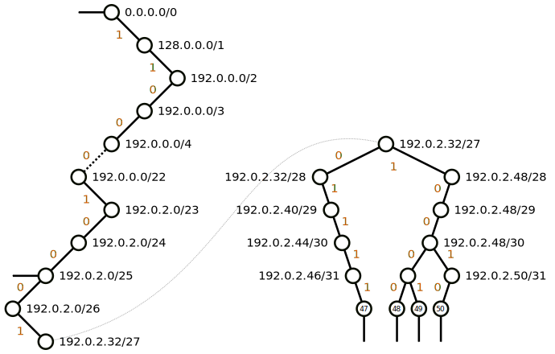

# Kernel Routing

- [Routing Decisions in the Linux Kernel - Part 1: Lookup and packet flow](https://thermalcircle.de/doku.php?id=blog:linux:routing_decisions_in_the_linux_kernel_1_lookup_packet_flow)
- [Routing Decisions in the Linux Kernel - Part 2: Caching](https://thermalcircle.de/doku.php?id=blog:linux:routing_decisions_in_the_linux_kernel_2_caching)

## IPv4 route lookup on Linux

> [IPv4 route lookup on Linux](https://vincent.bernat.ch/en/blog/2017-ipv4-route-lookup-linux)
>
> 
>
> Simple routing trie for a small routing table. For readibility, the trie has been cut in two parts. The nodes with an arrow contain an actual route entry.

