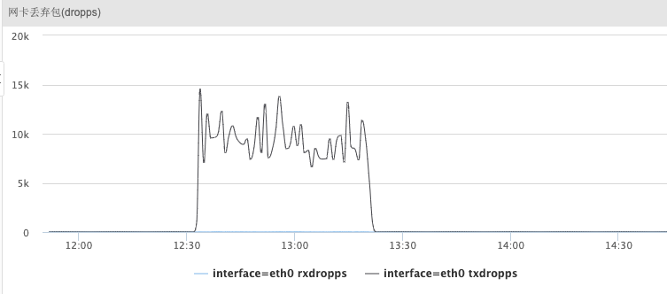
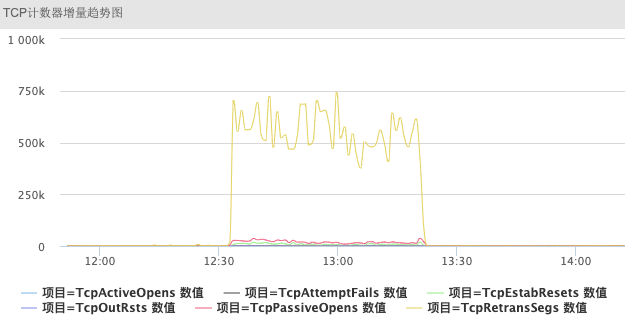
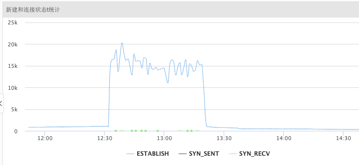
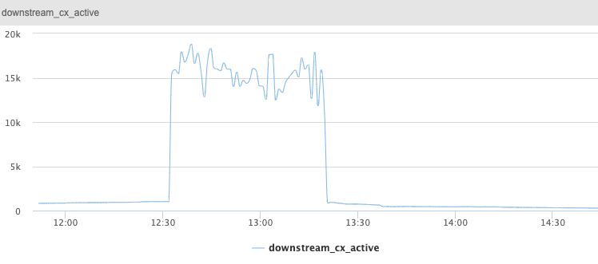
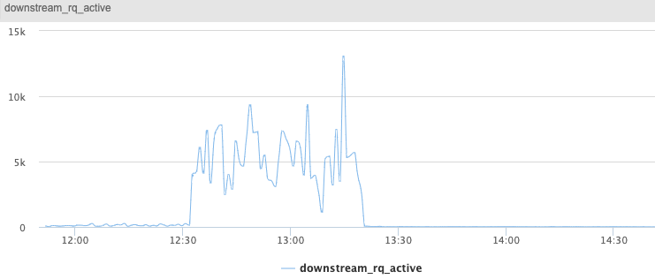
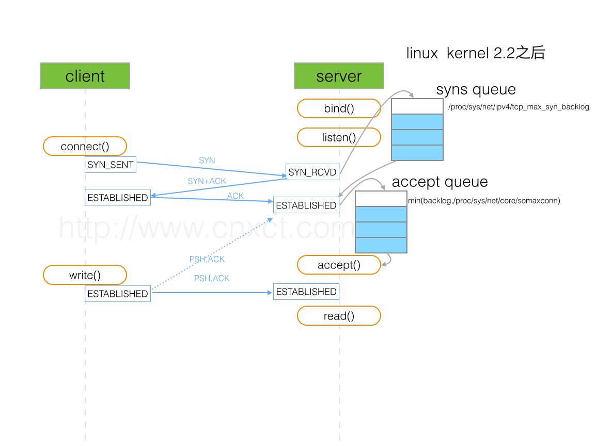

# Envoy TCP backlog 问题分析

> [https://xiking.win/2020/05/18/2-linux-kernel-net-packet-dropped/](https://xiking.win/2020/05/18/2-linux-kernel-net-packet-dropped/)


#### 1. 问题现象

线上环境业务反馈业务访问服务存在大量超时，通过查看监控，发现集群内3个envoy进程pod网卡tx队列丢包严重。




tcp监控统计到存在大量的tcp重传。



查看对应的tcp连接的监控发现对应的时间段存在大量的新建连接。



对应时间段，envoy本身的监控`downstream_cx_active`也能够看到envoy维持了大量连接。



并且下游的请求`downstream_rq_active`产生了阻塞。



#### 2. 问题分析

通过线下最先怀疑的是是不是流量达到了pod网卡的pps或者qos限制，线上环境pod的网卡并没有做相关限制，并且通过监控看，网卡的流量的确没有达到物理机网卡处理瓶颈。

通过和业务同步使用方式，业务的连接采用的是短连接，并且在有超时后会强制断开并新建连接，在网络异常时连接数可能比平时大几倍甚至十几倍。

说到短连接：

1. 首先怀疑是否是内核中nf_conntrack_table满了导致的连接失败，通过机器`dmesg`并未发现相关内核日志。
2. envoy是否设置了listen socket的tcp backlog长度，通过分析源码

https://github.com/envoyproxy/envoy/blob/7ff7cb4c6a1dd62e43ad9aeaee98bb103971ba6a/source/common/network/listener_impl.cc#L52

envoy中使用了libevent库，调用evconnlistener_new来创建监听。

```
evconnlistener_new(&dispatcher.base(), listenCallback, this, 0, -1, socket.ioHandle().fd()));
```

代码中直接传入`-1`作为backlog长度，并没有对backlog进行限制。

关于listen函数backlog的参数定义如下：

```
Now it specifies the queue length for completely established sockets waiting to be accepted,
instead of the number of incomplete connection requests. 
The maximum length of the queue for incomplete sockets can be set using the tcp_max_syn_backlog sysctl. 
When syncookies are enabled there is no logical maximum length and this sysctl setting is ignored.
If the socket is of type AF_INET, and the backlog argument is greater than the constant SOMAXCONN(128 default), 
it is silently truncated to SOMAXCONN.
```



现在的内核中，采用上图中两个队列分别来控制半连接`SYN_RCVD`状态的连接和`ESTABLISHED`状态连接。listen函数中的backlog参数就是指的`ESTABLISHED`状态连接队列的长度。如果在listen函数中不进行配置，内核就会采用somaxconn作为默认值。当两个参数都进行设置的话，就按较小的参数来进行设置。


3. somaxconn内核参数

envoy的pod镜像采用的社区镜像，并未对内核参数进行优化，somaxconn参数保持了操作系统默认值`128`。

对于高并发的短连接应用来说，在没有及时调用accept进行处理时，会导致accept queue队列满。

在队列满的情况下，内核参数`/proc/sys/net/ipv4/tcp_abort_on_overflow`默认是0，操作系统不会给连接回复`RST`，而是默默的将`ACK`丢弃。会导致server对第二个包`SYN+ACK`进行重传，连接也无法建立。

```shell
netstat -s | egrep "listen|LISTEN"
200961 times the listen queue of a socket overflowed
200961 SYNs to LISTEN sockets dropped
```

通过上述命令可以看到的确存在大量的队列满。

后续调整对应内核参数。


