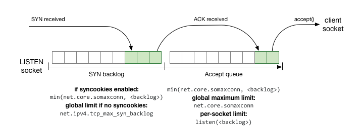
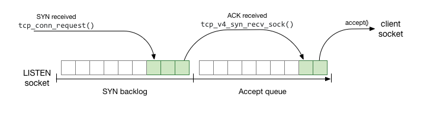

# Scaling Linux Services: Before accepting connections

> [https://theojulienne.io/2020/07/03/scaling-linux-services-before-accepting-connections.html](https://theojulienne.io/2020/07/03/scaling-linux-services-before-accepting-connections.html)


When writing services that accept TCP connections, we tend to think of our work as starting from the point where our service accepts a new client connection and finishing when we complete the request and close the socket. For services at scale, operations can happen at such a high rate that some of the default resource limits of the Linux kernel can break this abstraction and start causing impact to incoming connections outside of that connection lifecycle. This post focuses on some standard resource limitations that exist before the client socket is handed to the application - all of which came up during the course of investigating errors on production systems as part of my role at GitHub (in some cases, multiple times across different applications).

In its most basic form (ignoring non-blocking variants), listening for TCP connections requires a call to `listen()` to actually start allowing incoming connections, followed by repeated calls to `accept()` to take the next pending connection and return a file descriptor that is for that particular client. In C this pattern looks something like:

```
int server_fd = socket(AF_INET, SOCK_STREAM, 0);
bind(server_fd, /* ... */);

// start listening for connections
listen(server_fd, 512);

while (running) {
    // block until a connection arrives and then accept it
    int client_fd = accept(server_fd, NULL, NULL);

    // ... handle client_fd ...
}

close(server_fd);
```

This is often hidden behind further layers of abstraction, and we tend to hide away all the implementation details of accepting connections and view it as a stream of new connections that we pick up and then process in parallel. However, when building a system that runs at scale, this abstraction tends to break down because there are resource limitations introduced in the period where connections are being established but are not yet returned by `accept()`. Before that point, those client connections are considered as being part of the server/listen socket and not as independent resources exposed to the application.

The examples mentioned in this blog post will be reproducible in the lab from [theojulienne/blog-lab-scaling-accept](https://github.com/theojulienne/blog-lab-scaling-accept) - clone this repository and [bring up the lab](https://www.vagrantup.com/), then poke around at these examples in a real system:

```
$ git clone https://github.com/theojulienne/blog-lab-scaling-accept.git
$ cd blog-lab-scaling-accept
$ vagrant up
$ vagrant ssh
```

## From SYN to accept()

The Linux kernel maintains 2 queues of connections that maintain the backlog of connections that are not yet `accept()`ed by the application:



When a SYN packet is received to initiate a new connection to a listen socket, a SYN-ACK is sent to the client and the half-completed connection state is stored in the “SYN backlog” or “Request Socket Queue”. This represents connections that have not yet been fully validated as having two-way communication between the hosts, where the server hasn’t yet validated that the remote end has successfully received a packet from the server (the SYN could have come from another host spoofing the source IP).

Once the client responds to the server’s SYN-ACK with an ACK, the connection has then completed the full [TCP 3-way handshake](https://en.wikipedia.org/wiki/Handshaking#TCP_three-way_handshake), and the server knows that two-way communication has been established. At this point, the client connection is ready to be provided to the application at a future call to `accept()`, and is added to the appropriately named “accept queue”.

## SYN backlog

Connections in the SYN backlog remain there for a period of time relative to the Round Trip Time between the server and the client. If there are N slots in the backlog then you can have at most N connections in this backlog per average RTT, after which the backlog overflows.

This won’t actually cause the connections to fail by default on Linux, but instead it will cause [SYN cookies](https://en.wikipedia.org/wiki/SYN_cookies) to be sent. This is due to the server being unable to validate that the client is who they say they at the point where only a SYN has been received. Before receiving an ACK that contains the [sequence number](https://en.wikipedia.org/wiki/Transmission_Control_Protocol#Connection_establishment) that the server sent to the client in the SYN-ACK, the client could be spoofing packets as coming from a different IP. This is a common Denial of Service attack called a [SYN Flood](https://en.wikipedia.org/wiki/SYN_flood) which is so common that the Linux kernel has built in mitigation by sending a SYN cookie when there is no room in the SYN backlog for the new connection.

This means that if the SYN backlog overflows under normal circumstances with no DoS attack, the kernel allows the connection to move further along in the handshake, and will not store any resources for the connection until an ACK completes the handshake – sending SYN cookies during normal circumstances does however indicate that the rate of connections is probably too high for the default limits as SYN cookies are really only meant for mitigating SYN floods.

The circumstances in which the kernel will send SYN cookies is configured via the sysctl `net.ipv4.tcp_syncookies`, by default this is set to `1` which indicates that SYN cookies should be sent when the SYN backlog overflows, but can also be set to `0` to disable entirely or `2` to force SYN cookies to be sent 100% of the time.

When SYN cookies are enabled as needed (the default), they are triggered when the number of pending connections in the SYN backlog is more than the configured accept queue backlog size for the socket - the logic for this is [here](https://github.com/torvalds/linux/blob/cb8e59cc87201af93dfbb6c3dccc8fcad72a09c2/net/ipv4/tcp_input.c#L6612-L6613). When SYN cookies are fully disabled, `net.ipv4.tcp_max_syn_backlog` configures the number of connections allowed in the SYN backlog separately - the logic for this case is [here](https://github.com/torvalds/linux/blob/cb8e59cc87201af93dfbb6c3dccc8fcad72a09c2/net/ipv4/tcp_input.c#L6670-L6672).

In the default configuration where the backlog overflows and SYN cookies are sent, the kernel increments the `TCPReqQFullDoCookies` counter and logs this line to the kernel log, which is often confused for an indicator of a real SYN flood even when it’s just due to legitimate connections coming in too fast:

```
TCP: request_sock_TCP: Possible SYN flooding on port 8080. Sending cookies.  Check SNMP counters.
```

If SYN cookies are explicitly disabled, the kernel increments the `TCPReqQFullDrop` counter and the following would be logged instead:

```
TCP: request_sock_TCP: Possible SYN flooding on port 8080. Dropping request.  Check SNMP counters.
```

If you see this message for internal service-to-service connections, chances are you’re dealing with a scaling problem or a [thundering herd problem](https://en.wikipedia.org/wiki/Thundering_herd_problem), and not an actual SYN flood or intentional bad actor.

Those “SNMP Counters” that the kernel mentions are available in `nstat` in the network namespace:

```
$ nstat -a | grep TCPReqQFull
TcpExtTCPReqQFullDoCookies      706                0.0
```

### SYN backlog in the lab

To see how the SYN backlog behaves in the lab, we can simulate latency on local connections with the following:

```
vagrant@blog-lab-scaling-accept:~$ sudo /vagrant/reset-lab.sh
vagrant@blog-lab-scaling-accept:~$ sudo tc qdisc add dev lo root netem delay 200ms
vagrant@blog-lab-scaling-accept:~$ ping 127.0.0.1
PING 127.0.0.1 (127.0.0.1) 56(84) bytes of data.
64 bytes from 127.0.0.1: icmp_seq=1 ttl=64 time=401 ms
64 bytes from 127.0.0.1: icmp_seq=2 ttl=64 time=400 ms
```

This means we can now simulate overflowing the SYN backlog. To make it a bit easier to reproduce, reduce the size of the SYN backlog from the default of `128` by reducing `net.core.somaxconn` (because SYN cookies are enabled):

```
vagrant@blog-lab-scaling-accept:~$ sudo sysctl net.core.somaxconn
net.core.somaxconn = 128
vagrant@blog-lab-scaling-accept:~$ sudo sysctl -w net.core.somaxconn=10
net.core.somaxconn = 10
vagrant@blog-lab-scaling-accept:~$ sudo systemctl restart nginx
vagrant@blog-lab-scaling-accept:~$ 
```

At this point, if more than 10 connections arrive within 400ms (before the SYN-ACK and ACK handshake complete), then 10 connections will be in the SYN backlog, which is the maximum configured. This will trigger SYN cookies to be sent, triggering the message and counters above. Let’s test out if this works, run a simulation that opens N concurrent connections:

```
vagrant@blog-lab-scaling-accept:~$ python /vagrant/test_send_concurrent_connections.py 127.0.0.1:80 20
Waiting, Ctrl+C to exit.
```

And verify that SYN cookies were sent as expected:

```
vagrant@blog-lab-scaling-accept:~$ sudo dmesg -c
[ 2571.784749] TCP: request_sock_TCP: Possible SYN flooding on port 80. Sending cookies.  Check SNMP counters.
vagrant@blog-lab-scaling-accept:~$ sudo nstat | grep ReqQ
TcpExtTCPReqQFullDoCookies      10                 0.0
vagrant@blog-lab-scaling-accept:~$
```

Try disabling the simulated latency with `sudo tc qdisc del dev lo root` and re-run the same test, now connections move through fast enough that SYN cookies are not sent.

This also demonstrates the way the Round Trip Time effects the amount of connections that can burst into a LISTEN socket - `test_send_concurrent_connections.py` does actually attempt to initiate complete connections and `nginx` on the other end is readily calling `accept()` as fast as it can, but because 20 connections are initiated at once, 20 SYN packets arrive before any handshake can continue, and the SYN backlog overflows. You can imagine that in the real world, with some of these values often defaulting to `128`, and users often being far away from servers (on the other side of the world), it’s pretty easy to accidentally trigger this scenario without a true SYN flood.

## Accept queue

Once an ACK packet is received and validated, a new client connection is ready for the application to process. This connection is moved into the accept queue, waiting for the application to call `accept()` and receive it.

Unlike the SYN backlog, the accept queue has no backup plan for when it overflows. Back in the original call to `listen()`, a `backlog` argument was provided, which indicates how many connections can have completed the 3-way handshake and be waiting in the kernel for the application to accept.

This is the first common issue: If the `backlog` number provided to `listen()` is not large enough to contain any number of connections that could reasonably complete their handshake between 2 calls to `accept()`, then a connection will be dropped on the floor, and the application generally won’t even notice - the next call to `accept()` will succeed without any indication of a dropped connection! This is particularly likely to happen when some reasonable amount of work can happen between calls to `accept()` or when the incoming connections tend to arrive at the same time (such as jobs running on many servers with cron, or a thundering herd of reconnection attempts).

However, even when you specify a high enough `backlog` value to `listen()`, there’s another location that silently limits this value. The `net.core.somaxconn` sysctl specifies a network-system-wide maximum for the `backlog` of any socket. When a larger `backlog` value is provided, the kernel silently caps it at the value of `net.core.somaxconn`. This is the next most common issue: Both `net.core.somaxconn` and the `backlog` argument to `listen()` need to be adjusted appropriately so that the backlog is actually adjusted as expected.

As an added complexity, the `net.core.somaxconn` sysctl is not system global, but is global to a Linux network namespace. For new network namespaces, such as used by most Docker containers launched, the values from the default network namespace are not inherited, but instead set to the built-in kernel default:

```
vagrant@blog-lab-scaling-accept:~$ sudo /vagrant/reset-lab.sh
vagrant@blog-lab-scaling-accept:~$ sudo sysctl net.core.somaxconn
net.core.somaxconn = 128
vagrant@blog-lab-scaling-accept:~$ sudo docker run -it ubuntu sysctl net.core.somaxconn
net.core.somaxconn = 128
vagrant@blog-lab-scaling-accept:~$ sudo sysctl -w net.core.somaxconn=1024
net.core.somaxconn = 1024
vagrant@blog-lab-scaling-accept:~$ sudo docker run -it ubuntu sysctl net.core.somaxconn
net.core.somaxconn = 128
vagrant@blog-lab-scaling-accept:~$ 
```

Therein lies the third common issue: Running in containers that have their own network namespace (which is most of them launched by Kubernetes/Docker), even if the system has `net.core.somaxconn` correctly tweaked, that value will be ignored, and so the container must also have `net.core.somaxconn` tweaked to match the application running inside of it.

If any of these situations occurs and causes impact, they are visible in the `ListenOverflows` counter:

```
$ nstat -a | grep ListenOverflows
TcpExtListenOverflows           6811               0.0
```

### Accept queue in the lab

To see how the accept queue behaves in the lab, we can run a server that is bad at accepting connections (it sleeps a lot) with a backlog of 10:

```
vagrant@blog-lab-scaling-accept:~$ sudo /vagrant/reset-lab.sh
vagrant@blog-lab-scaling-accept:~$ sudo sysctl -w net.core.somaxconn=1024
net.core.somaxconn = 1024
vagrant@blog-lab-scaling-accept:~$ python /vagrant/laggy_server.py 10
Listening with backlog 10
```

In another window, send a bunch of connections to the laggy server, then exit after a few seconds:

```
vagrant@blog-lab-scaling-accept:~$ python /vagrant/test_send_concurrent_connections.py 127.0.0.1:8080 20
Waiting, Ctrl+C to exit.
(wait a few seconds)
^C
vagrant@blog-lab-scaling-accept:~$ sudo nstat | grep ListenOverflows
TcpExtListenOverflows           44                 0.0
vagrant@blog-lab-scaling-accept:~$ 
```

At this point, we can see how important the backlog argument to `listen()` is. Next, let’s review how `somaxconn` caps this by setting up a server with a longer backlog, that we expect to be capped:

```
vagrant@blog-lab-scaling-accept:~$ sudo /vagrant/reset-lab.sh
vagrant@blog-lab-scaling-accept:~$ sudo sysctl -w net.core.somaxconn=10
net.core.somaxconn = 10
vagrant@blog-lab-scaling-accept:~$ python /vagrant/laggy_server.py 1024
Listening with backlog 1024
```

All looks good - notice how we effectively called `listen(1024)` and nothing went wrong. Running the same commands as we did when we provided the small `backlog` value, we can observe the same problem when the backlog is silently truncated by the kernel:

```
vagrant@blog-lab-scaling-accept:~$ python /vagrant/test_send_concurrent_connections.py 127.0.0.1:8080 20
Waiting, Ctrl+C to exit.
(wait a few seconds)
^C
vagrant@blog-lab-scaling-accept:~$ sudo nstat | grep ListenO
TcpExtListenOverflows           77                 0.0
vagrant@blog-lab-scaling-accept:~$ 
```

## Monitoring counters

A few counters were mentioned above that can be read with `nstat`:

- `TcpExtTCPReqQFullDoCookies` - detecting where SYN cookies were used to mitigate a lack of SYN backlog space
- `TcpExtTCPReqQFullDrop` - detecting where SYNs were dropped because SYN cookies were disabled and the SYN backlog was full
- `TcpExtListenOverflows` - detecting when a TCP connection completed the 3-way handshake but the accept queue was full or when a SYN was received while the accept queue was full

Because these counters are all part of the network namespace and are global within a namespace, no information about which socket or application caused the issue will be visible, and if the process is in a container, it will not be visible in the base system counters (in the default network namespace). Because of this, every network namespace will need to be inspected/monitored for these counters, and then additional work needs to be done to trace this back to the application, potentially using the kernel log lines as a hint in the case of the SYN backlog variant.

## Detecting backlog overflows with tracing

The metrics available from the counters above provide a minimal picture of backlog overflows and dropped connections, but ideally we would be able to inspect this situation system-wide, seeing through any network namespaces, and be able to link it back to an application and even socket/port.

This is possible using kprobes and eBPF tracing using [bcc](https://github.com/iovisor/bcc), by hooking kernel functions that handle these failure cases and inspecting the context at that point in time. This allows us to extract realtime data from systems in production, unlike the counters which are at best vague indicators of an underlying issue existing somewhere on the system.

We know that the `ListenOverflows` counter is incremented any time the accept backlog overflows - we can start there and work back to building a tracing program.

Searching the Linux source code for [ListenOverflows](https://github.com/torvalds/linux/search?q=ListenOverflows&unscoped_q=ListenOverflows) shows what this counter is called internally - `LINUX_MIB_LISTENOVERFLOWS`. Searching the [kernel source tree](https://elixir.bootlin.com/linux/latest/ident/LINUX_MIB_LISTENOVERFLOWS) shows all the places in the kernel that increment that counter - in this case, the best candidates are `tcp_conn_request` in `net/ipv4/tcp_input.c` and `tcp_v4_syn_recv_sock` in `net/ipv4/tcp_ipv4.c`. They handle slightly different points in the connection lifecycle:

- `tcp_conn_request` handles a SYN packet that initiates a new connection against a LISTEN socket and places it in the SYN backlog
- `tcp_v4_syn_recv_sock` handles an ACK packet that completes a connection and adds it to the accept queue

These map to the earlier diagram:



`tcp_conn_request` drops connections if the accept queue is full as a safety mechanism, even though it wouldn’t be adding to it yet. `tcp_v4_syn_recv_sock` also drops connections if the accept queue is full, and rightly so, since it would be adding to it. If a SYN packet has already been accepted and added to the SYN backlog while the accept queue had available space, but was full by the point the ACK arrived, drops will occur in `tcp_v4_syn_recv_sock` when the ACK is received. If a new SYN arrives while the accept queue is full, then `tcp_conn_request` will drop instead. For local testing in a VM, `tcp_conn_request` is the easier one to test since it doesn’t require careful timing between SYN and ACK to reproduce.

The code path that increments the `ListenOverflows` counter in each of those functions looks like the following:

```
int tcp_conn_request(struct request_sock_ops *rsk_ops,
             const struct tcp_request_sock_ops *af_ops,
             struct sock *sk, struct sk_buff *skb)
{
    /* ... */

    if (sk_acceptq_is_full(sk)) {
        NET_INC_STATS(sock_net(sk), LINUX_MIB_LISTENOVERFLOWS);
        goto drop;
    }

    /* ... */

drop:
    tcp_listendrop(sk);
    return 0;
}

struct sock *tcp_v4_syn_recv_sock(const struct sock *sk, struct sk_buff *skb,
                  struct request_sock *req,
                  struct dst_entry *dst,
                  struct request_sock *req_unhash,
                  bool *own_req)
{
    /* ... */

    if (sk_acceptq_is_full(sk))
        goto exit_overflow;
    
    /* ... */

exit_overflow:
    NET_INC_STATS(sock_net(sk), LINUX_MIB_LISTENOVERFLOWS);
    /* ... */
}
```

The [function called to check for overflow](https://github.com/torvalds/linux/blob/4a21185cda0fbb860580eeeb4f1a70a9cda332a4/include/net/sock.h#L917-L920) is a simple inlined check:

```
static inline bool sk_acceptq_is_full(const struct sock *sk)
{
    return READ_ONCE(sk->sk_ack_backlog) > READ_ONCE(sk->sk_max_ack_backlog);
}
```

When looking to trace functions that are inlined like this, the easiest way to hook the condition is to attach to the start of the calling function (in this case `tcp_conn_request` and `tcp_v4_syn_recv_sock`) which is not inlined, and perform the same conditional check in our eBPF code. We can do this with kprobes:

```
/* generic handler */
static inline void handle_sk_potential_overflow(struct pt_regs *ctx, int syn_recv, const struct sock *sk)
{
    /* we need to read these using bpf_probe_read to ensure the read is safe */
    u32 sk_ack_backlog = 0;
    u32 sk_max_ack_backlog = 0;
    bpf_probe_read(&sk_ack_backlog, sizeof(sk_ack_backlog), (void *)&sk->sk_ack_backlog);
    bpf_probe_read(&sk_max_ack_backlog, sizeof(sk_max_ack_backlog), (void *)&sk->sk_max_ack_backlog);

    if (sk_ack_backlog > sk_max_ack_backlog) {
        /* handle the condition */
    }
}

/* when a SYN arrives */
struct tcp_request_sock_ops;
void kprobe__tcp_conn_request(struct pt_regs *ctx, struct request_sock_ops *rsk_ops,
             const struct tcp_request_sock_ops *af_ops,
             const struct sock *sk, struct sk_buff *skb)
{
    handle_sk_potential_overflow(ctx, 0, sk);
}

/* when an ACK arrives for a SYN_RECV socket */
void kprobe__tcp_v4_syn_recv_sock(struct pt_regs *ctx, const struct sock *sk) /* no need for the remaining unused args */
{
    handle_sk_potential_overflow(ctx, 1, sk);
}
```

At this point, we have a hook on the same condition that would trigger incrementing the `ListenOverflows` counter in TCP over IPv4. This can be fleshed out to read detailed information about the socket and return it to the userspace tracing program.

### Tracing backlog overflows in the lab

One such program is included in the lab, let’s start up our laggy server again:

```
vagrant@blog-lab-scaling-accept:~$ sudo /vagrant/reset-lab.sh
vagrant@blog-lab-scaling-accept:~$ python /vagrant/laggy_server.py 10
Listening with backlog 10
```

In another session, start up the tracing program:

```
vagrant@blog-lab-scaling-accept:~$ sudo python /vagrant/trace_backlog_overflow.py 
CONTAINER/HOST          PID PROCESS              NETNSID    BIND                 PKT     BL    MAX
```

And finally, run our client:

```
vagrant@blog-lab-scaling-accept:~$ python /vagrant/test_send_concurrent_connections.py 127.0.0.1:8080 20
Waiting, Ctrl+C to exit.
```

The result will be traces showing where the backlog overflowed the configured maximum, along with details of the process and whether it occured during SYN or ACK:

```
vagrant@blog-lab-scaling-accept:~$ sudo python /vagrant/trace_backlog_overflow.py
CONTAINER/HOST          PID PROCESS              NETNSID    BIND                 PKT     BL    MAX
blog-lab-scaling-acc  14742 python /vagrant/lagg 4026531992 127.0.0.1:8080       SYN     11     10
blog-lab-scaling-acc  14742 python /vagrant/lagg 4026531992 127.0.0.1:8080       SYN     11     10
blog-lab-scaling-acc  14742 python /vagrant/lagg 4026531992 127.0.0.1:8080       SYN     11     10
blog-lab-scaling-acc  14742 python /vagrant/lagg 4026531992 127.0.0.1:8080       SYN     11     10
blog-lab-scaling-acc  14742 python /vagrant/lagg 4026531992 127.0.0.1:8080       SYN     11     10
blog-lab-scaling-acc  14742 python /vagrant/lagg 4026531992 127.0.0.1:8080       SYN     11     10
blog-lab-scaling-acc  14742 python /vagrant/lagg 4026531992 127.0.0.1:8080       SYN     11     10
blog-lab-scaling-acc  14742 python /vagrant/lagg 4026531992 127.0.0.1:8080       SYN     11     10
blog-lab-scaling-acc  14742 python /vagrant/lagg 4026531992 127.0.0.1:8080       SYN     11     10
blog-lab-scaling-acc  14742 python /vagrant/lagg 4026531992 127.0.0.1:8080       SYN     11     10
blog-lab-scaling-acc  14742 python /vagrant/lagg 4026531992 127.0.0.1:8080       SYN     11     10
blog-lab-scaling-acc  14742 python /vagrant/lagg 4026531992 127.0.0.1:8080       SYN     11     10
blog-lab-scaling-acc  14742 python /vagrant/lagg 4026531992 127.0.0.1:8080       SYN     11     10
blog-lab-scaling-acc  14742 python /vagrant/lagg 4026531992 127.0.0.1:8080       SYN     11     10
blog-lab-scaling-acc  14742 python /vagrant/lagg 4026531992 127.0.0.1:8080       SYN     11     10
blog-lab-scaling-acc  14742 python /vagrant/lagg 4026531992 127.0.0.1:8080       SYN     11     10
```

As discussed earlier, if many SYN packets are queued while there is room in the accept queue, but then the queue overflows anyway, the ACK packets trigger it instead (run the client again in another window to see this output):

```
vagrant@blog-lab-scaling-accept:~$ sudo tc qdisc add dev lo root netem delay 200ms
vagrant@blog-lab-scaling-accept:~$ sudo python /vagrant/trace_backlog_overflow.py
CONTAINER/HOST          PID PROCESS              NETNSID    BIND                 PKT     BL    MAX
blog-lab-scaling-acc  14742 python /vagrant/lagg 4026531992 127.0.0.1:8080       ACK     11     10
blog-lab-scaling-acc  14742 python /vagrant/lagg 4026531992 127.0.0.1:8080       ACK     11     10
blog-lab-scaling-acc  14742 python /vagrant/lagg 4026531992 127.0.0.1:8080       ACK     11     10
blog-lab-scaling-acc  14742 python /vagrant/lagg 4026531992 127.0.0.1:8080       ACK     11     10
blog-lab-scaling-acc  14742 python /vagrant/lagg 4026531992 127.0.0.1:8080       ACK     11     10
blog-lab-scaling-acc  14742 python /vagrant/lagg 4026531992 127.0.0.1:8080       ACK     11     10
blog-lab-scaling-acc  14742 python /vagrant/lagg 4026531992 127.0.0.1:8080       ACK     11     10
blog-lab-scaling-acc  14742 python /vagrant/lagg 4026531992 127.0.0.1:8080       ACK     11     10
blog-lab-scaling-acc  14742 python /vagrant/lagg 4026531992 127.0.0.1:8080       ACK     11     10
```

## Detecting misconfigured listen sockets with tracing

We can also trace calls to `listen()` to observe when the system places caps on the backlog size, to see a leading indicator for applications launching on the machine that have misconfigured values for the backlog or `somaxconn`. This will only work at the time that applications start up, since we’ll be hooking `listen()` as it is actually called, which is typically just when the application first launches.

The easiest way to find the kernel source responsible for this is to start from the `listen()` syscall, which is `__sys_listen()` [in the kernel](https://github.com/torvalds/linux/blob/cb8e59cc87201af93dfbb6c3dccc8fcad72a09c2/net/socket.c#L1677-L1696):

```
int __sys_listen(int fd, int backlog)
{
    struct socket *sock;
    int err, fput_needed;
    int somaxconn;

    sock = sockfd_lookup_light(fd, &err, &fput_needed);
    if (sock) {
        somaxconn = sock_net(sock->sk)->core.sysctl_somaxconn;
        if ((unsigned int)backlog > somaxconn)
            backlog = somaxconn;

        err = security_socket_listen(sock, backlog);
        if (!err)
            err = sock->ops->listen(sock, backlog);

        fput_light(sock->file, fput_needed);
    }
    return err;
}
```

From this snippet alone, it’s easy to observe the way that somaxconn (`sysctl_somaxconn`) from the current network namespace (`sock_net(sock->sk)`) silently limits the backlog. By tracing the `listen` syscall itself, we’ll get the originally requested `backlog`, but to see what the limit was eventually set to we need to hook a point in time after that limit (we could also read the sysctl ourselves and repeat the logic).

Conveniently, `sock->ops->listen(...)` calls the underlying listen operation in the address family, in this case [`inet_listen`](https://github.com/torvalds/linux/blob/cb8e59cc87201af93dfbb6c3dccc8fcad72a09c2/net/ipv4/af_inet.c#L196):

```
int inet_listen(struct socket *sock, int backlog)
{
    struct sock *sk = sock->sk;

    /* ... */
}
```

At this point, `inet_listen` is called with the capped backlog. By combining a trace on the `listen()` syscall itself with a trace on `inet_listen`, we can map the original requested value to the actual value used:

```
BPF_HASH(requested_backlogs, u32, u64);

TRACEPOINT_PROBE(syscalls, sys_enter_listen) {
    u32 pid = bpf_get_current_pid_tgid();

    u64 backlog = args->backlog;
    requested_backlogs.update(&pid, &backlog);

    return 0;
}

void kprobe__inet_listen(struct pt_regs *ctx, struct socket *sock, int backlog)
{
    struct sock *sk = sock->sk;
    u32 pid = bpf_get_current_pid_tgid();

    u64 *requested_backlog;
    requested_backlog = requested_backlogs.lookup(&pid);
    if (requested_backlog == NULL) {
        return;
    }

    requested_backlogs.delete(&pid);

    /*
        `*requested_backlogs` contains the argument to listen()
        `backlog` contains the capped backlog
    */
}
```

With some extra work we can also peek inside the network namespace to see the value of `somaxconn` at the time of the call. From above, we can use `sock_net(sock->sk)->core.sysctl_somaxconn` if we have a `struct socket *sock` - or since we now have the internal `struct sock *sk`, we’ll want `sock_net(sk)->core.sysctl_somaxconn`. The `sock_net` function is [pretty simple](https://github.com/torvalds/linux/blob/cb8e59cc87201af93dfbb6c3dccc8fcad72a09c2/include/net/sock.h#L2520-L2524):

```
static inline
struct net *sock_net(const struct sock *sk)
{
    return read_pnet(&sk->sk_net);
}

/* ... elsewhere */
static inline struct net *read_pnet(const possible_net_t *pnet)
{
#ifdef CONFIG_NET_NS
    return pnet->net;
#else
    return &init_net;
#endif
}
```

We’ll need to simulate that function chain with a call to `bpf_probe_read` to ensure it’s safe to read that member, otherwise the eBPF validator will complain because the dereferencing is a bit too complex for `bcc` to automatically safeguard with a `bpf_probe_read` call. That gives us the following:

```
static inline
struct net *safe_sock_net(const struct sock *sk)
{
#ifdef CONFIG_NET_NS
    struct net *ret;
    // was: read_pnet(&sk->sk_net)->net
    bpf_probe_read(&ret, sizeof(ret), (void *)&(sk->sk_net.net));
    return ret;
#else
    return &init_net;
#endif
}

void kprobe__inet_listen(struct pt_regs *ctx, struct socket *sock, int backlog)
{
    struct sock *sk = sock->sk;
    /* ... */

    u32 netns_somaxconn = 0;
    bpf_probe_read(&netns_somaxconn, sizeof(netns_somaxconn), (void *)&(safe_sock_net(sk)->core.sysctl_somaxconn));

    /* ... */
}
```

At this point we have the requested backlog (the argument to `listen()`), the actual backlog calculated (after any somaxconn capping) and the value for `somaxconn` as well. We can fill this out with further information about the pid and namespace and provide it to the userspace side of the tracing app.

### Tracing accept queue overflows in the lab

A fleshed out tracing app for the above is also included in the lab, this time we need to start the tracing app before our `listen()`ing server:

```
vagrant@blog-lab-scaling-accept:~$ sudo /vagrant/reset-lab.sh
vagrant@blog-lab-scaling-accept:~$ sudo python /vagrant/trace_listen_backlog_capped.py 
CONTAINER/HOST          PID PROCESS              NETNSID    BIND                    REQ    MAX ACTUAL
```

Now we can start up our server with a small backlog, then with a larger backlog, and then with a backlog limited by `somaxconn`:

```
vagrant@blog-lab-scaling-accept:~$ python /vagrant/laggy_server.py 10
Listening with backlog 10
^C
vagrant@blog-lab-scaling-accept:~$ python /vagrant/laggy_server.py 128
Listening with backlog 128
^C
vagrant@blog-lab-scaling-accept:~$ python /vagrant/laggy_server.py 1024
Listening with backlog 1024
^C
```

The tracing app will show all these cases, along with where it was silently limited:

```
vagrant@blog-lab-scaling-accept:~$ sudo python /vagrant/trace_listen_backlog_capped.py 
CONTAINER/HOST          PID PROCESS              NETNSID    BIND                    REQ    MAX ACTUAL
blog-lab-scaling-acc  14849 python /vagrant/lagg 4026531992 127.0.0.1:8080           10    128     10 
blog-lab-scaling-acc  14851 python /vagrant/lagg 4026531992 127.0.0.1:8080          128    128    128 
blog-lab-scaling-acc  14853 python /vagrant/lagg 4026531992 127.0.0.1:8080         1024    128    128 LIMITED
```

This also works through container network namespaces:

```
vagrant@blog-lab-scaling-accept:~$ sudo docker run -v /vagrant:/vagrant -it python:2.7 python /vagrant/laggy_server.py 1024
Listening with backlog 1024
^C
vagrant@blog-lab-scaling-accept:~$ sudo sysctl -w net.core.somaxconn=1024
net.core.somaxconn = 1024
vagrant@blog-lab-scaling-accept:~$ sudo docker run -v /vagrant:/vagrant -it python:2.7 python /vagrant/laggy_server.py 1024
Listening with backlog 1024
^C
vagrant@blog-lab-scaling-accept:~$ sudo docker run --sysctl net.core.somaxconn=1024 -v /vagrant:/vagrant -it python:2.7 python /vagrant/laggy_server.py 1024
Listening with backlog 1024
^C
vagrant@blog-lab-scaling-accept:~$ 
```

Note that setting the `somaxconn` value on the base system had no effect, but setting the value in the container with `docker run --sysctl` did change it:

```
vagrant@blog-lab-scaling-accept:~$ sudo python /vagrant/trace_listen_backlog_capped.py 
CONTAINER/HOST          PID PROCESS              NETNSID    BIND                    REQ    MAX ACTUAL
380944436fe3          15274 python /vagrant/lagg 4026532171 127.0.0.1:8080         1024    128    128 LIMITED
9e82132ad3d6          15387 python /vagrant/lagg 4026532171 127.0.0.1:8080         1024    128    128 LIMITED
af3b584488ea          15495 python /vagrant/lagg 4026532171 127.0.0.1:8080         1024   1024   1024 
```

## Wrapping up

We’ve seen how scaling something as simple as a TCP service can run into unexpected resource limitations, even before the program accepts a connection. Key takeaways are:

- The `backlog` argument to `listen` should always be set high enough so that any valid burst of connections that could arrive between calls to `accept()` will be queued up
- `net.core.somaxconn` must be set high enough that any `backlog` value is not restricted - if not, it will be silently capped
- `net.core.somaxconn` is namespaced, so must be set in the namespace/container that the socket is created in
- SYN flood warnings are often logged due to the SYN backlog being too small, and it should be treated as a potential scaling issue unless a real SYN flood is suspected
- The number of connections in the SYN backlog are relative to the RTT between the client and server, not just the rate of connections

The tracing tools provided here are fairly lightweight in kernel space and are mostly gated to failure cases and hook relatively low rate system calls, making them reasonably safe to use on production systems, unless CPU resource usage is an active bottleneck at the time. These tracing tools may help track down which application or socket the `ListenOverflow` or `TCPReqQFull*` counters are being triggered by, as well as monitoring applications launching for any misconfigurations without needing to audit the configuration of each one individually.