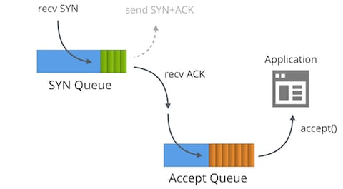
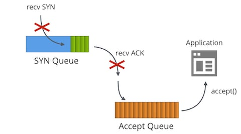
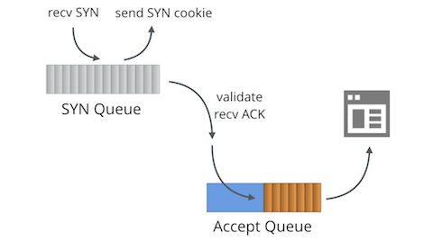
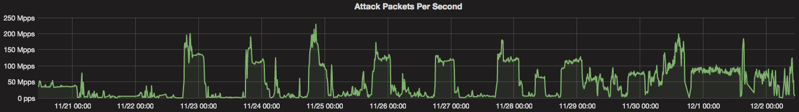

# SYN packet handling in the wild

> [https://blog.cloudflare.com/syn-packet-handling-in-the-wild/](https://blog.cloudflare.com/syn-packet-handling-in-the-wild/)

Here at Cloudflare, we have a lot of experience of operating servers on the wild Internet. But we are always improving our mastery of this black art. On this very blog we have touched on multiple dark corners of the Internet protocols: like [understanding FIN-WAIT-2](https://blog.cloudflare.com/this-is-strictly-a-violation-of-the-tcp-specification/) or [receive buffer tuning](https://blog.cloudflare.com/the-story-of-one-latency-spike/).


[CC BY 2.0](https://creativecommons.org/licenses/by/2.0/) [image](https://www.flickr.com/photos/isaimoreno/1471936772/in/photolist-3f54wd-6mweJG-maUn5T-2tgqad-6YuCuM-pZ7r8T-Sa3LQ9-adTFS2-qSLQzk-sJ66Lq-71cJPS-oFU9rf-mbom12-23fVpJW-71ciCN-718DHR-j4VCQQ-71chKo-5DMBr4-5DLQFK-71cG4s-qQFjhZ-2RMBP6-718KWR-71cAFA-fAr8Ri-pe5zev-8TtDbQ-b6p5gk-qAdMqQ-qSBvUZ-qyg7oz-o5yof6-adTGvc-718xp4-5XQgJZ-bgGiwk-kf7aMc-qAjY14-718uti-smXfxF-8Kdnpx-nVVy8a-cmMJGb-puizaG-qP18i9-71cu1E-nYNfjq-718CjH-qyQM72) by [Isaí Moreno](https://www.flickr.com/photos/isaimoreno/)

One subject hasn't had enough attention though - SYN floods. We use Linux and it turns out that SYN packet handling in Linux is truly complex. In this post we'll shine some light on this subject.

### The tale of two queues



First we must understand that each bound socket, in the "LISTENING" TCP state has two separate queues:

- The SYN Queue
- The Accept Queue

In the literature these queues are often given other names such as "reqsk_queue", "ACK backlog", "listen backlog" or even "TCP backlog", but I'll stick to the names above to avoid confusion.

### SYN Queue

The SYN Queue stores inbound SYN packets[[1\]](https://blog.cloudflare.com/syn-packet-handling-in-the-wild/#fn1) (specifically: [`struct inet_request_sock`](https://elixir.free-electrons.com/linux/v4.14.12/source/include/net/inet_sock.h#L73)). It's responsible for sending out SYN+ACK packets and retrying them on timeout. On Linux the number of retries is configured with:

```
$ sysctl net.ipv4.tcp_synack_retries
net.ipv4.tcp_synack_retries = 5
```

The [docs describe this toggle](https://www.kernel.org/doc/Documentation/networking/ip-sysctl.txt):

```
tcp_synack_retries - INTEGER

	Number of times SYNACKs for a passive TCP connection attempt
	will be retransmitted. Should not be higher than 255. Default
	value is 5, which corresponds to 31 seconds till the last
	retransmission with the current initial RTO of 1second. With
	this the final timeout for a passive TCP connection will
	happen after 63 seconds.
```

After transmitting the SYN+ACK, the SYN Queue waits for an ACK packet from the client - the last packet in the three-way-handshake. All received ACK packets must first be matched against the fully established connection table, and only then against data in the relevant SYN Queue. On SYN Queue match, the kernel removes the item from the SYN Queue, happily creates a fully fledged connection (specifically: [`struct inet_sock`](https://elixir.free-electrons.com/linux/v4.14.12/source/include/net/inet_sock.h#L183)), and adds it to the Accept Queue.

### Accept Queue

The Accept Queue contains fully established connections: ready to be picked up by the application. When a process calls `accept()`, the sockets are de-queued and passed to the application.

This is a rather simplified view of SYN packet handling on Linux. With socket toggles like `TCP_DEFER_ACCEPT`[[2\]](https://blog.cloudflare.com/syn-packet-handling-in-the-wild/#fn2) and `TCP_FASTOPEN` things work slightly differently.

### Queue size limits

The maximum allowed length of both the Accept and SYN Queues is taken from the `backlog` parameter passed to the `listen(2)` syscall by the application. For example, this sets the Accept and SYN Queue sizes to 1,024:

```
listen(sfd, 1024)
```

Note: In kernels before 4.3 the [SYN Queue length was counted differently](https://github.com/torvalds/linux/commit/ef547f2ac16bd9d77a780a0e7c70857e69e8f23f#diff-56ecfd3cd70d57cde321f395f0d8d743L43).

This SYN Queue cap used to be configured by the `net.ipv4.tcp_max_syn_backlog` toggle, but this isn't the case anymore. Nowadays `net.core.somaxconn` caps both queue sizes. On our servers we set it to 16k:

```
$ sysctl net.core.somaxconn
net.core.somaxconn = 16384
```

### Perfect backlog value

Knowing all that, we might ask the question - what is the ideal `backlog` parameter value?

The answer is: it depends. For the majority of trivial TCP Servers it doesn't really matter. For example, before version 1.11 [Golang famously didn't support customizing backlog value](https://github.com/golang/go/issues/6079). There are valid reasons to increase this value though:

- When the rate of incoming connections is really large, even with a performant application, the inbound SYN Queue may need a larger number of slots.
- The `backlog` value controls the SYN Queue size. This effectively can be read as "ACK packets in flight". The larger the average round trip time to the client, the more slots are going to be used. In the case of many clients far away from the server, hundreds of milliseconds away, it makes sense to increase the backlog value.
- The `TCP_DEFER_ACCEPT` option causes sockets to remain in the SYN-RECV state longer and contribute to the queue limits.

Overshooting the `backlog` is bad as well:

- Each slot in SYN Queue uses some memory. During a SYN Flood it makes no sense to waste resources on storing attack packets. Each `struct inet_request_sock` entry in SYN Queue takes 256 bytes of memory on kernel 4.14.

To peek into the SYN Queue on Linux we can use the `ss` command and look for `SYN-RECV` sockets. For example, on one of Cloudflare's servers we can see 119 slots used in tcp/80 SYN Queue and 78 on tcp/443.

```
$ ss -n state syn-recv sport = :80 | wc -l
119
$ ss -n state syn-recv sport = :443 | wc -l
78
```

Similar data can be shown with our [overenginered SystemTap script: `resq.stp`](https://github.com/cloudflare/cloudflare-blog/blob/master/2018-01-syn-floods/resq.stp).

### Slow application



What happens if the application can't keep up with calling `accept()` fast enough?

This is when the magic happens! When the Accept Queue gets full (is of a size of `backlog`+1) then:

- Inbound SYN packets to the SYN Queue are dropped.
- Inbound ACK packets to the SYN Queue are dropped.
- The TcpExtListenOverflows / `LINUX_MIB_LISTENOVERFLOWS` counter is incremented.
- The TcpExtListenDrops / `LINUX_MIB_LISTENDROPS` counter is incremented.

There is a strong rationale for dropping *inbound* packets: it's a push-back mechanism. The other party will sooner or later resend the SYN or ACK packets by which point, the hope is, the slow application will have recovered.

This is a desirable behavior for almost all servers. For completeness: it can be adjusted with the global `net.ipv4.tcp_abort_on_overflow` toggle, but better not touch it.

If your server needs to handle a large number of inbound connections and is struggling with `accept()` throughput, consider reading our [Nginx tuning / Epoll work distribution](https://blog.cloudflare.com/the-sad-state-of-linux-socket-balancing/) post and a [follow up showing useful SystemTap scripts](https://blog.cloudflare.com/perfect-locality-and-three-epic-systemtap-scripts/).

You can trace the Accept Queue overflow stats by looking at `nstat` counters:

```
$ nstat -az TcpExtListenDrops
TcpExtListenDrops     49199     0.0
```

This is a global counter. It's not ideal - sometimes we saw it increasing, while all applications looked healthy! The first step should always be to print the Accept Queue sizes with `ss`:

```
$ ss -plnt sport = :6443|cat
State   Recv-Q Send-Q  Local Address:Port  Peer Address:Port
LISTEN  0      1024                *:6443             *:*
```

The column `Recv-Q` shows the number of sockets in the Accept Queue, and `Send-Q` shows the backlog parameter. In this case we see there are no outstanding sockets to be `accept()`ed, but we still saw the ListenDrops counter increasing.

It turns out our application was stuck for fraction of a second. This was sufficient to let the Accept Queue overflow for a very brief period of time. Moments later it would recover. Cases like this are hard to debug with `ss`, so we wrote [an `acceptq.stp` SystemTap script](https://github.com/cloudflare/cloudflare-blog/blob/master/2018-01-syn-floods/acceptq.stp) to help us. It hooks into kernel and prints the SYN packets which are being dropped:

```
$ sudo stap -v acceptq.stp
time (us)        acceptq qmax  local addr    remote_addr
1495634198449075  1025   1024  0.0.0.0:6443  10.0.1.92:28585
1495634198449253  1025   1024  0.0.0.0:6443  10.0.1.92:50500
1495634198450062  1025   1024  0.0.0.0:6443  10.0.1.92:65434
...
```

Here you can see precisely which SYN packets were affected by the ListenDrops. With this script it's trivial to understand which application is dropping connections.


[CC BY 2.0](https://creativecommons.org/licenses/by/2.0/) [image](https://www.flickr.com/photos/16339684@N00/3713965419/in/photolist-6Ec3wx-5jhnwn-bfyTRX-5jhnCa-phYcey-dxZ95n-egkTN-kwT1YH-k22LWZ-5jBUiy-bzvDWx-5jBV31-5jhnr8-5jBTkq-5jxzHk-4K3cbP-9EePyg-4e5XNt-4e5XNn-dxZ8Tn-dy5A89-dxZ6GH-cztXcJ-gF7oY-dxZ9jv-dxZ7qM-ZvSPCv-dxZ6YV-5jBTqs-5jxzaP-MvuyK-nmVwP1-5jBRhY-dxZ7YF-5jxAc2-5jBU9U-5jBTEy-ejbWe6-5jxBc6-99ENZW-99KUsi-9bWScw-5jBRow-5jxzmx-5jBTfw-r6HcW-dy5zXE-5jxzg4-5jxBYR-5jxA2B) by [internets_dairy](https://www.flickr.com/photos/16339684@N00/)

### SYN Flood



If it's possible to overflow the Accept Queue, it must be possible to overflow the SYN Queue as well. What happens in that case?

This is what [SYN Flood attacks](https://en.wikipedia.org/wiki/SYN_flood) are all about. In the past flooding the SYN Queue with bogus spoofed SYN packets was a real problem. Before 1996 it was possible to successfully deny the service of almost any TCP server with very little bandwidth, just by filling the SYN Queues. 

The solution is [SYN Cookies](https://lwn.net/Articles/277146/). SYN Cookies are a construct that allows the SYN+ACK to be generated statelessly, without actually saving the inbound SYN and wasting system memory. SYN Cookies don't break legitimate traffic. When the other party is real, it will respond with a valid ACK packet including the reflected sequence number, which can be cryptographically verified.

By default SYN Cookies are enabled when needed - for sockets with a filled up SYN Queue. Linux updates a couple of counters on SYN Cookies. When a SYN cookie is being sent out:

- TcpExtTCPReqQFullDoCookies / `LINUX_MIB_TCPREQQFULLDOCOOKIES` is incremented.
- TcpExtSyncookiesSent / `LINUX_MIB_SYNCOOKIESSENT` is incremented.
- Linux used to increment `TcpExtListenDrops` but [doesn't from kernel 4.7](https://github.com/torvalds/linux/commit/9caad864151e525929d323de96cad382da49c3b2).

When an inbound ACK is heading into the SYN Queue with SYN cookies engaged:

- TcpExtSyncookiesRecv / `LINUX_MIB_SYNCOOKIESRECV` is incremented when crypto validation succeeds.
- TcpExtSyncookiesFailed / `LINUX_MIB_SYNCOOKIESFAILED` is incremented when crypto fails.

A sysctl `net.ipv4.tcp_syncookies` can disable SYN Cookies or force-enable them. Default is good, don't change it.

### SYN Cookies and TCP Timestamps

The SYN Cookies magic works, but isn't without disadvantages. The main problem is that there is very little data that can be saved in a SYN Cookie. Specifically, only 32 bits of the sequence number are returned in the ACK. These bits are used as follows:

```
+----------+--------+-------------------+
|  6 bits  | 2 bits |     24 bits       |
| t mod 32 |  MSS   | hash(ip, port, t) |
+----------+--------+-------------------+
```

With the MSS setting [truncated to only 4 distinct values](https://github.com/torvalds/linux/blob/5bbcc0f595fadb4cac0eddc4401035ec0bd95b09/net/ipv4/syncookies.c#L142), Linux doesn't know any optional TCP parameters of the other party. Information about Timestamps, ECN, Selective ACK, or Window Scaling is lost, and can lead to degraded TCP session performance.

Fortunately Linux has a work around. If TCP Timestamps are enabled, the kernel can reuse another slot of 32 bits in the Timestamp field. It contains:

```
+-----------+-------+-------+--------+
|  26 bits  | 1 bit | 1 bit | 4 bits |
| Timestamp |  ECN  | SACK  | WScale |
+-----------+-------+-------+--------+
```

TCP Timestamps should be enabled by default, to verify see the sysctl:

```
$ sysctl net.ipv4.tcp_timestamps
net.ipv4.tcp_timestamps = 1
```

Historically there was plenty of discussion about the usefulness of TCP Timestamps.

- In the past timestamps leaked server uptime (whether that matters is another discussion). This [was fixed 8 months ago](https://github.com/torvalds/linux/commit/95a22caee396cef0bb2ca8fafdd82966a49367bb).
- TCP Timestamps use [non-trivial amount of of bandwidth](http://highscalability.com/blog/2015/10/14/save-some-bandwidth-by-turning-off-tcp-timestamps.html) - 12 bytes on each packet.
- They can add additional randomness to packet checksums which [can help with certain broken hardware](https://www.snellman.net/blog/archive/2017-07-20-s3-mystery/).
- As mentioned above TCP Timestamps can boost the performance of TCP connections if SYN Cookies are engaged.

Currently at Cloudflare, we have TCP Timestamps disabled.

Finally, with SYN Cookies engaged some cool features won't work - things like [`TCP_SAVED_SYN`](https://lwn.net/Articles/645128/), `TCP_DEFER_ACCEPT` or `TCP_FAST_OPEN`.

### SYN Floods at Cloudflare scale



SYN Cookies are a great invention and solve the problem of smaller SYN Floods. At Cloudflare though, we try to avoid them if possible. While sending out a couple of thousand of cryptographically verifiable SYN+ACK packets per second is okay, we see [attacks of more than 200 Million packets per second](https://blog.cloudflare.com/the-daily-ddos-ten-days-of-massive-attacks/). At this scale, our SYN+ACK responses would just litter the internet, bringing absolutely no benefit.

Instead, we attempt to drop the malicious SYN packets on the firewall layer. We use the `p0f` SYN fingerprints compiled to BPF. Read more in this blog post [Introducing the p0f BPF compiler](https://blog.cloudflare.com/introducing-the-p0f-bpf-compiler/). To detect and deploy the mitigations we developed an automation system we call "Gatebot". We described that here [Meet Gatebot - the bot that allows us to sleep](https://blog.cloudflare.com/meet-gatebot-a-bot-that-allows-us-to-sleep/)

### Evolving landscape

For more - slightly outdated - data on the subject read on [an excellent explanation by Andreas Veithen from 2015](https://veithen.github.io/2014/01/01/how-tcp-backlog-works-in-linux.html) and [a comprehensive paper by Gerald W. Gordon from 2013](https://www.giac.org/paper/gsec/2013/syn-cookies-exploration/103486).

The Linux SYN packet handling landscape is constantly evolving. Until recently SYN Cookies were slow, due to an old fashioned lock in the kernel. This was fixed in 4.4 and now you can rely on the kernel to be able to send millions of SYN Cookies per second, practically solving the SYN Flood problem for most users. With proper tuning it's possible to mitigate even the most annoying SYN Floods without affecting the performance of legitimate connections.

Application performance is also getting significant attention. Recent ideas like `SO_ATTACH_REUSEPORT_EBPF` introduce a whole new layer of programmability into the network stack.

It's great to see innovations and fresh thinking funneled into the networking stack, in the otherwise stagnant world of operating systems.

*Thanks to Binh Le for helping with this post.*
