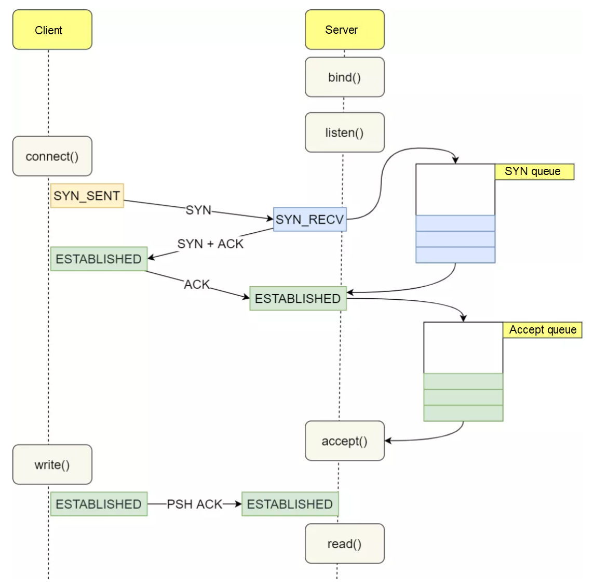
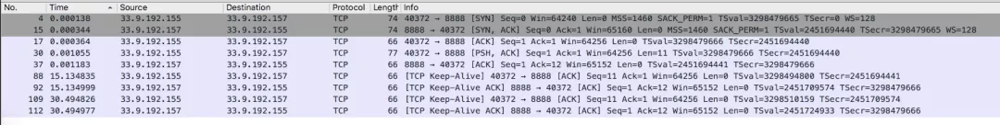
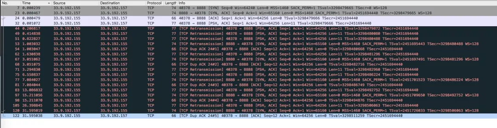
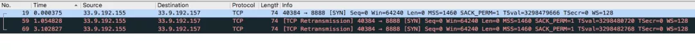
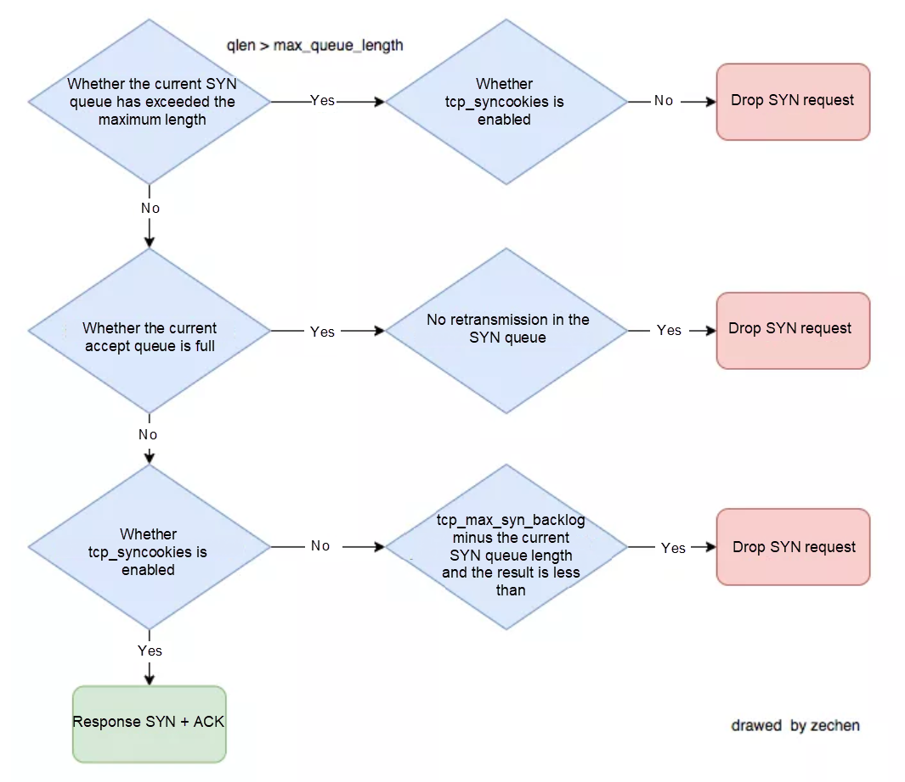

# TCP SYN Queue and Accept Queue Overflow Explained

> [https://www.alibabacloud.com/blog/tcp-syn-queue-and-accept-queue-overflow-explained_599203](https://www.alibabacloud.com/blog/tcp-syn-queue-and-accept-queue-overflow-explained_599203)


## Preface

When I was on duty during a big sales promotion a while ago, I had full confidence in the stability of the system I was running. But suddenly I received feedback from upstream that there was a chance that our **endpoint** would be facing a **Connection timeout**. At that time, the water level of the **apiserver** cluster on the system side was **40%**, which was far below the limit. The error rate dropped to **0** after the apiserver cluster was expanded in an emergency. After the event, a detailed problem investigation was carried out, and the location analysis showed that the cause of the problem was that the system connection queue was full. Back then, I did not know much about TCP SYN queue and Accept queue, and I only vaguely remembered that the "Detailed Explanation of TCP/IP " seemed to mention these two nouns.

At present, there are many relevant information on the Internet but many are outdated or inaccurate. I have been confused many times when investigating the problem by myself. Therefore, I consulted a large amount of data and did many experiments to verify it. I wrote this article on TCP SYN queue and accept queue to help you better understand this topic.

This article will combine theoretical knowledge, kernel code, and operational experiments to present the following content for you:

- Introduction to SYN queue and accept queue
- Introduction to common commands
- Accept queue practice — maximum length control, accept queue overflow experiment, experimental result analysis
- SYN queue practice — maximum length control, SYN queue overflow experiment, experimental result analysis

## SYN Queue and Accept Queue



During the TCP three-way handshake process, the Linux kernel maintains two queues, namely:

- SYN Queue
- Accept Queue

Normal TCP three-way handshake process:

1. The Client side sends SYN to the Server side to initiate a connection. The Client side enters the `SYN_SENT` state.
2. After the Server side receives the SYN request from the Client side, the Server side enters the `SYN_RECV` state. At this time, the kernel will store the connection in the SYN queue and reply to the Client side with SYN+ACK.
3. After the Client side receives the SYN + ACK from the server side, the Client replies and enters the `ESTABLISHED` state.
4. After the Server side receives the ACK from the Client side, the kernel removes the connection from the SYN queue and adds it to the accept queue. The Server side enters the `ESTABLISHED` state.
5. When the Server side application calls the `accept` function, the connection is taken out of the accept queue.

Both the SYN queue and the Accept queue have length and size limits. If the limit is exceeded, the kernel discards the connection Drop or returns the RST packet.


## Check of the Relevant Indicators

### ss

You can view the information of a fully connected queue by `ss`.

```
# -n Does not resolve the service name
# -t only show tcp sockets
# -l Displays LISTEN-state sockets

$ ss -lnt
State      Recv-Q Send-Q    Local Address:Port         Peer Address:Port
LISTEN     0      128       [::]:2380                  [::]:*
LISTEN     0      128       [::]:80                    [::]:*
LISTEN     0      128       [::]:8080                  [::]:*
LISTEN     0      128       [::]:8090                  [::]:*

$ ss -nt
State      Recv-Q Send-Q    Local Address:Port         Peer Address:Port
ESTAB      0      0         [::ffff:33.9.95.134]:80                   [::ffff:33.51.103.59]:47452
ESTAB      0      536       [::ffff:33.9.95.134]:80                  [::ffff:33.43.108.144]:37656
ESTAB      0      0         [::ffff:33.9.95.134]:80                   [::ffff:33.51.103.59]:38130
ESTAB      0      536       [::ffff:33.9.95.134]:80                   [::ffff:33.51.103.59]:38280
ESTAB      0      0         [::ffff:33.9.95.134]:80                   [::ffff:33.51.103.59]:38204
```

**For sockets in LISTEN states**

- **Recv-Q**: The size of the current accept queue, which means the three connections have been completed and are waiting for the application accept() TCP connections.
- **Send-Q**: the maximum length of the accept queue, which is the size of the accept queue.

**For sockets in non-LISTEN state**

- **Recv-Q**: the number of bytes received but not read by the application.
- **Send-Q**: the number of bytes sent but not acknowledged.

Related kernel code:

```
// https://github.com/torvalds/linux/blob/master/net/ipv4/tcp_diag.c
static void tcp_diag_get_info(struct sock *sk, struct inet_diag_msg *r,
            void *_info)
{
  struct tcp_info *info = _info;

  if (inet_sk_state_load(sk) == TCP_LISTEN) { // When the socket state is LISTEN
    r->idiag_rqueue = READ_ONCE(sk->sk_ack_backlog);  // The current accept queue size
    r->idiag_wqueue = READ_ONCE(sk->sk_max_ack_backlog); // The maximum length of the accept queue
  } else if (sk->sk_type == SOCK_STREAM) {    // When the socket state    is not LISTEN
    const struct tcp_sock *tp = tcp_sk(sk);

    r->idiag_rqueue = max_t(int, READ_ONCE(tp->rcv_nxt) -
               READ_ONCE(tp->copied_seq), 0);    // The number of bytes received but not read by the application
    r->idiag_wqueue = READ_ONCE(tp->write_seq) - tp->snd_una;   // The number of bytes sent but not acknowledged
  }
  if (info)
    tcp_get_info(sk, info);
}
```

### netstat

Run the `netstat –s` command to view the overflow status of TCP SYN queue and accept queue.

```
$ netstat -s | grep -i "listen"
    189088 times the listen queue of a socket overflowed
30140232 SYNs to LISTEN sockets dropped
```

The values output are cumulative values, indicating how many TCP socket links are discarded because the accept and SYN queues are full:

- "189088 times the listen queue of a socket overflowing" means there are 189,088 accept queues overflow.
- 30140232 SYNs to LISTEN sockets dropped represents 30,140,232 SYN queues overflow.

When troubleshooting online issues, **if the relevant value has been rising for a while, this means that the SYN queue and the accept queue are overflowing.**

## Practice — Accept Queue

### Maximum Length Control of Accept Queue

The maximum length of a TCP accept queue is controlled by min(somaxconn, backlog), where:

- somaxconn is kernel parameter for Linux and is specified by `/proc/sys/net/core/somaxconn`
- A backlog is one of the TCP protocol's listen function parameters, which is the size of the int listen(int sockfd, int backlog) function's backlog. **In the Golang, backlog parameters of listen function use the values from the `/proc/sys/net/core/somaxconn file`.**

Related kernel code:

```
// https://github.com/torvalds/linux/blob/master/net/socket.c

/*
 *  Perform a listen. Basically, we allow the protocol to do anything
 *  necessary for a listen, and if that works, we mark the socket as
 *  ready for listening.
 */
int __sys_listen(int fd, int backlog)
{
  struct socket *sock;
  int err, fput_needed;
  int somaxconn;

  sock = sockfd_lookup_light(fd, &err, &fput_needed);
  if (sock) {
    somaxconn = sock_net(sock->sk)->core.sysctl_somaxconn;  // /proc/sys/net/core/somaxconn
    if ((unsigned int)backlog > somaxconn)
      backlog = somaxconn;   // The maximum length of the TCP accept queue

    err = security_socket_listen(sock, backlog);
    if (!err)
      err = sock->ops->listen(sock, backlog);

    fput_light(sock->file, fput_needed);
  }
  return err;
}
```

**Verification**

Server code

```
package main

import (
  "log"
  "net"
  "time"
)

func main() {
  l, err := net.Listen("tcp", ":8888")
  if err != nil {
    log.Printf("failed to listen due to %v", err)
  }
  defer l.Close()
  log.Println("listen :8888 success")

  for {
    time.Sleep(time.Second * 100)
  }
}
```

View `somaxconn` in the test environment with a value of `128`

```
$ cat /proc/sys/net/core/somaxconn
128
```

Start the server and use the `ss -lnt | grep :8888` to confirm the size of the accept queue.

```
LISTEN     0      128       [::]:8888                  [::]:*
```

The maximum length of the accept queue is `128`

Now update the `somaxconn` value to `1024`, and restart the server.

\1. Update the configurations from the `/etc/sysctl.conf` file, which is a kernel parameter configuration file a. add a row `net.core.somaxconn=1024`
\2. Execute `sysctl –p` for the configure to take effect

```
$ sudo sysctl -p
net.core.somaxconn = 1024
```

\3. Check the `/proc/sys/net/core/somaxconn` file and confirm that `somaxconn` is the updated `1024`

```
$ cat /proc/sys/net/core/somaxconn
1024
```

Restart the server and confirm the accept queue size through `ss -lnt | grep :8888`

```
$ ss -lnt | grep 8888
LISTEN     0      1024      [::]:8888                  [::]:*
```

It can be seen that the accept queue now has a maximum length of `1024` and was updated.

**1. Accept Queue Overflow**

The following is to verify what happens when the accept queue overflows. The TCP accept queue can be overflowed by having the server application only responsible for the corresponding port and not perform accept() TCP connections.

**Experimental Material**

Server code

```
// server listens on the 8888 TCP port

package main

import (
  "log"
  "net"
  "time"
)

func main() {
  l, err := net.Listen("tcp", ":8888")
  if err != nil {
    log.Printf("failed to listen due to %v", err)
  }
  defer l.Close()
  log.Println("listen :8888 success")

  for {
    time.Sleep(time.Second * 100)
  }
}
```

Client code

```
// The client concurrently requests the server 10 times and sends data to the server after the TCP connection is established.
package main

import (
  "context"
  "log"
  "net"
  "os"
  "os/signal"
  "sync"
  "syscall"
  "time"
)

var wg sync.WaitGroup

func establishConn(ctx context.Context, i int) {
  defer wg.Done()
  conn, err := net.DialTimeout("tcp", ":8888", time.Second*5)
  if err != nil {
    log.Printf("%d, dial error: %v", i, err)
    return
  }
  log.Printf("%d, dial success", i)
  _, err = conn.Write([]byte("hello world"))
  if err != nil {
    log.Printf("%d, send error: %v", i, err)
    return
  }
  select {
  case <-ctx.Done():
    log.Printf("%d, dail close", i)
  }
}

func main() {
  ctx, cancel := context.WithCancel(context.Background())
  for i := 0; i < 10; i++ {
    wg.Add(1)
    go establishConn(ctx, i)
  }

  go func() {
    sc := make(chan os.Signal, 1)
    signal.Notify(sc, syscall.SIGINT)
    select {
    case <-sc:
      cancel()
    }
  }()

  wg.Wait()
  log.Printf("client exit")
}
```

To facilitate the experiment, update the maximum length of the `somaxconn` accept queue to 5:1 and the `net.core.somaxconn` to 5, and also update the `/etc/sysctl.conf` file.

**2. Execute sysctl -p to Make the Configuration Effective**

```
$ sudo sysctl -p
net.core.somaxconn = 5
```

**Experimental Results**

**Client Log Output**

```
2021/10/11 17:24:48 8, dial success
2021/10/11 17:24:48 3, dial success
2021/10/11 17:24:48 4, dial success
2021/10/11 17:24:48 6, dial success
2021/10/11 17:24:48 5, dial success
2021/10/11 17:24:48 2, dial success
2021/10/11 17:24:48 1, dial success
2021/10/11 17:24:48 0, dial success
2021/10/11 17:24:48 7, dial success
2021/10/11 17:24:53 9, dial error: dial tcp 33.9.192.157:8888: i/o timeout
```

**Client Socket**

```
tcp        0      0 33.9.192.155:40372      33.9.192.157:8888       ESTABLISHED
tcp        0      0 33.9.192.155:40376      33.9.192.157:8888       ESTABLISHED
tcp        0      0 33.9.192.155:40370      33.9.192.157:8888       ESTABLISHED
tcp        0      0 33.9.192.155:40366      33.9.192.157:8888       ESTABLISHED
tcp        0      0 33.9.192.155:40374      33.9.192.157:8888       ESTABLISHED
tcp        0      0 33.9.192.155:40368      33.9.192.157:8888       ESTABLISHED
```

**Server Socket**

```
tcp6      11      0 33.9.192.157:8888       33.9.192.155:40376      ESTABLISHED
tcp6      11      0 33.9.192.157:8888       33.9.192.155:40370      ESTABLISHED
tcp6      11      0 33.9.192.157:8888       33.9.192.155:40368      ESTABLISHED
tcp6      11      0 33.9.192.157:8888       33.9.192.155:40372      ESTABLISHED
tcp6      11      0 33.9.192.157:8888       33.9.192.155:40374      ESTABLISHED
tcp6      11      0 33.9.192.157:8888       33.9.192.155:40366      ESTABLISHED

tcp    LISTEN     6      5      [::]:8888               [::]:*                   users:(("main",pid=84244,fd=3))
```

**Packet Capture Result**

After capturing packets from the client and server, **there come three situations**:

- The client establishes a TCP socket connection with the server and sends data successfully.
- The client believes that the TCP socket connection has been established with the server, but the subsequent data transmission fails and has been in RETRY. The server believes that the TCP connection has not been established and has been sending SYN + ACK.
- The client sends SYN to the server that does not get a response and has been in RETRY.

**Experimental Results Analysis of Accept Queue**

The above experiments have three situations, and we analyze the contents of the packet captured respectively.

**Scenario one: The Client establishes a TCP socket connection with the Server and sends data successfully.**



In the preceding figure, you can see the following request:

- The Client side sends SYN to the Server side to initiate connections
- After receiving SYN from the Client side, the Server side sends SYN+ACK to the client. **The socket connection is stored in the SYN Queue.**
- After the Client side receives the SYN+ACK, it replies to the Server. The client enters the ESTABLISHED state.
- After the Server side receives ACK from the Client side, it enters the ESTABLISHED state. **The socket connection is stored in the Accept Queue.**
- **The Client side sends data [PSH, ACK] to the Server side, and the Server side confirms that the data is received [ACK].**

This is a normal request, which means the accept queue and the SYQ queue are not full. The Client establishes a tcp link with the server, and sends data.

**Scenario Two: The Client believes that the TCP socket connection has been established with the Server, but the subsequent data transmission fails and continues to be RETRIED. The server believes that the TCP connection has not been established and keeps sending SYN+ACK.**



The preceding figure shows the following request:

- The Client side sends an SYN to the server side to initiate a connection.
- After the Server side receives the SYN from the Client side, it replies to the SYN+ACK to the Client side. The Socket connection is stored in the SYN queue
- After the Client side receives the SYN+ACK from the Server side, it replies ACK to the Server side, and the Client side enters the ESTABLISHED state (Note: At this time, only the Client side thinks the TCP connection is established).
- Since the Client side thinks that the TCP connection has been established, it sends data [PSH, ACK] to the Server side. But it has not received the confirmation ACK from the Server side, so it has been RETRY.
- The Server has been RETRY and keeps sending SYN+ACK.

Why does this happen? Why does the Server side keep RETRY and sending SYN+ACK? Didn't the Server side have received the ACK confirmation from the Client side?

This is because the Server-side socket connection entered the SYN queue. After receiving the ACK from the Client side, the socket connection should have been stored in the accept queue, but the accept queue was full, so the Server side DROP the ACK request.

The reason why the Server side has been sending SYN+ACK and RETRY is that the Client side ACK request is DROP, so the socket connection is still in the SYN queue, waiting for the Client side to reply to the ACK. Parameter control of tcp_abort_on_overflow.

The accept queue DROP request is the default behavior, and you can set /proc/sys/net/ipv4/tcp_abort_on_overflow to make Server side send an RST message to the Client side when the accept queue is full.

There are two optional values of tcp_abort_on_overflow:

- 0: If the accept queue is full, the Server side DROP ACK from the Client side.
- 1: If the accept queue is full, the Server side sends an RST message to the Client side to terminate the TCP socket link (TODO: This experiment will be added later.)

**Why is the size of the current accept queue larger than the maximum length of the accept queue in the experimental results?**

In the preceding results, you can see the socket link of the Listen state:

- Recv-Q: The current accept queue size is 6
- Send-Q: The maximum length of the accept queue is 5

```
State      Recv-Q Send-Q    Local Address:Port         Peer Address:Port
LISTEN     6      5         [::]:8888                  [::]:*
```

Why is the size of a accept queue larger than the maximum length of an accept queue?

After many experiments, it is found that the maximum number of Sockets that can enter the full connection queue is always one more than the configured full connection queue maximum length.

Combined with other articles and kernel code, it is found that when the kernel determines whether the accept queue is full, it uses > instead of >= (the relevant resource for the reasons is not found).

Related kernel code:

```
/* Note: If you think the test should be:
 *  return READ_ONCE(sk->sk_ack_backlog) >= READ_ONCE(sk->sk_max_ack_backlog);
 * Then please take a look at commit 64a146513f8f ("[NET]: Revert incorrect accept queue backlog changes.")
 */
static inline bool sk_acceptq_is_full(const struct sock *sk)
{
  return READ_ONCE(sk->sk_ack_backlog) > READ_ONCE(sk->sk_max_ack_backlog);
}
```

**Scenario Three: The client is not responded after sending the SYN to the Server and keeps RETRY.**



The preceding figure shows the following request:

- The Client side sends an SYN to the Server side to initiate a connection, but it does not get a Server response and has been RETRY.

(This situation involves the SYN queue. Here, the reason for the preceding situation is given. The specific content will be expanded in the SYN queue below.)

**The preceding situation is caused by the following two aspects:**

1. The /proc/sys/net/ipv4/tcp_syncookies function is enabled.
2. The accept queue is full.

## Practice—SYN queue

### Maximum Length Control of SYN Queue

After reading many blogs about the maximum length control of SYN queues, I found that most of them were vague or inaccurate. After unremitting efforts, I finally found the exact content (The related blog link is in the appendix).

Many blogs say that the maximum length of the SYN queue is specified by the /proc/sys/net/ipv4/tcp_max_syn_backlog parameter. **In fact, only when the linux kernel version is earlier than 2.6.20, the SYN queue is equal to the size of the backlog.**

The source code is complicated. Here is a general calculation method. For details, please refer to the relevant blogs in the appendix. The calculation process of the SYN queue length:

```
backlog = min(somaxconn, backlog)
nr_table_entries = backlog
nr_table_entries = min(backlog, sysctl_max_syn_backlog)
nr_table_entries = max(nr_table_entries, 8)
// roundup_pow_of_two: 将参数向上取整到最小的 2^n，注意这里存在一个 +1
nr_table_entries = roundup_pow_of_two(nr_table_entries + 1)
max_qlen_log = max(3, log2(nr_table_entries))
max_queue_length = 2^max_qlen_log
```

It can be seen that the length of the **SYN queue is specified by three parameters:**

- When you call the listen, the incoming backlog
- The default value of the /proc/sys/net/core/somaxconn is 128
- The default value of /proc/sys/net/ipv4/tcp_max_syn_backlog is 1024

Assume that the backlog value passed by listen is 128 (The backlog parameter passed when calling listen in Golang is /proc/sys/net/core/somaxconn), and other configurations use default values to calculate the maximum length of the SYN queue.

```
backlog = min(somaxconn, backlog) = min(128, 128) = 128
nr_table_entries = backlog = 128
nr_table_entries = min(backlog, sysctl_max_syn_backlog) = min(128, 1024) = 128
nr_table_entries = max(nr_table_entries, 8) = max(128, 8) = 128
nr_table_entries = roundup_pow_of_two(nr_table_entries + 1) = 256
max_qlen_log = max(3, log2(nr_table_entries)) = max(3, 8) = 8
max_queue_length = 2^max_qlen_log = 2^8 = 256
```

### To determine whether to DROP SYN.

After the Client sends an SYN packet to the server, the server stores the socket connection to the SYN queue. If the Server determines that the queue is full, it will DROP the connection.

So how does the Server side determine whether the SYN queue is full? In addition to the maximum length control of the SYN queue mentioned in the previous section, it is also related to the /proc/sys/net/ipv4/tcp_syncookies parameter. (tcp_syncookies is used to prevent the SYN Flood attack. The related links are described below.)

### Flowchart

A flowchart that determines whether to DROP SYN request:



The preceding figure is a flowchart for judging whether Drop SYN is requested after sorting out multiple data.

*Note: The first judgment condition "Whether the current SYN queue has exceeded the maximum length of the semi-connection queue" varies with kernel versions. The Linux 4.19.91 kernel determines whether the current SYN queue exceeds or is equal to the maximum length of the SYN queue.*

Related kernel code:

```
static inline int inet_csk_reqsk_queue_is_full(const struct sock *sk)
{
  return inet_csk_reqsk_queue_len(sk) >= sk->sk_max_ack_backlog;
}
```

Assuming the following are the parameters, calculate when the Client side sends only SYN packets and theoretically when the Server side drops SYN requests:

- Backlog = 1024
- The /proc/sys/net/core/somaxconn value is 1024
- The /proc/sys/net/ipv4/tcp_max_syn_backlog value is 128

**When the /proc/sys/net/ipv4/tcp_syncookies value is 0**

- The calculated maximum length of the SYN queue is 256.
- When the length of the SYN queue increases to 96, adding a new SYN request will trigger the Drop SYN request.

When the /proc/sys/net/ipv4/tcp_syncookies value is 1,

1. the calculated maximum length of the SYN queue is 256
2. because tcp_syncookies is enabled.

- When the accept queue is not full, the Drop request will never be made (note: this theory is found to be wrong through experiments. It is found that the Drop SYN request will be triggered as long as the size of the SYN queue> the maximum length of the accept queue.)
- When the accept queue is full (the accept queue size reaches 1024), the Drop SYN request will be triggered.

PS: The value of /proc/sys/net/ipv4/tcp_syncookies can also be 2. However, the author has no detailed experiment on it.

**Review the results of the accept queue experiment results**

In the preceding accept queue experiment, there is a class of experimental results: the Client sends an SYN to the Server without receiving a response, and has been in RETRY state.

**The situation is caused by the following two aspects:**

1. The /proc/sys/net/ipv4/tcp_syncookies function is enabled.
2. The accept queue is full.

**SYN Queue Overflow Experiments**

We know how to calculate when the SYN queue will overflow theoretically. Let's take a specific experiment (the backlog value passed when Golang calls listen is somaxconn)

**Experiment One: syncookies=0,somaxconn=1024,tcp_max_syn_backlog=128**

In theory:

- The calculated maximum length of the SYN queue is 256.
- When the length of the SYN queue increases to 96, subsequent SYN requests trigger Drop.

Update the configuration of related parameters

```
$ sudo sysctl -p
net.core.somaxconn = 1024
net.ipv4.tcp_max_syn_backlog = 128
net.ipv4.tcp_syncookies = 0
```

Start the Server to listen on port 8888 (for code information, refer to accept queue experimental material). The Client side launches an SYN Flood attack:

```
$ sudo hping3 -S 33.9.192.157 -p 8888 --flood
HPING 33.9.192.157 (eth0 33.9.192.157): S set, 40 headers + 0 data bytes
hping in flood mode, no replies will be shown
```

View the maximum number of sockets that are in the SYN_RECV state for the server 8888 port:

```
[zechen.hg@function-compute033009192157.na63 /home/zechen.hg]
$ sudo netstat -nat | grep :8888 | grep SYN_RECV  | wc -l
96

[zechen.hg@function-compute033009192157.na63 /home/zechen.hg]
$ sudo netstat -nat | grep :8888 | grep SYN_RECV  | wc -l
96
```

The experimental results are as expected. When the SYN queue length increases to 96, subsequent SYN requests trigger Drop.

**Experiment Two: syncookies = 0,somaxconn=128,tcp_max_syn_backlog=512**

In theory:

- The calculated maximum length of the SYN queue is 256. Since the **kernel version on the author's experimental machine is 4.19.91, when the SYN queue length is longer or equal to the accept queue maximum length**, the kernel would think that the SYN queue has overflowed.
- Therefore, when the SYN queue length increases to 128, subsequent SYN requests trigger DROP.

Update the configuration of related parameters.

```
$ sudo sysctl -p
net.core.somaxconn = 128
net.ipv4.tcp_max_syn_backlog = 512
net.ipv4.tcp_syncookies = 0
```

Start the Server to listen on port 8888 (for code information, refer to accept Queue Experimental Material). Client launches an SYN Flood attack:

```
$ sudo hping3 -S 33.9.192.157 -p 8888 --flood
HPING 33.9.192.157 (eth0 33.9.192.157): S set, 40 headers + 0 data bytes
hping in flood mode, no replies will be shown
```

View the maximum number of sockets that are in the SYN_RECV state for the Server 8888 port:

```
[zechen.hg@function-compute033009192157.na63 /home/zechen.hg]
$ sudo netstat -nat | grep :8888 | grep SYN_RECV  | wc -l
128

[zechen.hg@function-compute033009192157.na63 /home/zechen.hg]
$ sudo netstat -nat | grep :8888 | grep SYN_RECV  | wc -l
128
```

The experimental results are as expected. When the SYN queue length increases to 128, subsequent SYN requests trigger Drop.

**Experiment Three: syncookies = 1,somaxconn=128,tcp_max_syn_backlog=512**

**In theory:**

- If the accept queue is not full and syncookies = 1, theoretically SYN requests will never be dropped.

Update the configuration of related parameters.

```
$ sudo sysctl -p
net.core.somaxconn = 128
net.ipv4.tcp_max_syn_backlog = 512
net.ipv4.tcp_syncookies = 1
```

Start the Server to listen on port 8888 (for code information, refer to accept Queue Experimental Material). Client launches an SYN Flood attack:

```
$ sudo hping3 -S 33.9.192.157 -p 8888 --flood
HPING 33.9.192.157 (eth0 33.9.192.157): S set, 40 headers + 0 data bytes
hping in flood mode, no replies will be shown
```

View the maximum number of sockets that are in the SYN_RECV state for the server 8888 port:

```
[zechen.hg@function-compute033009192157.na63 /home/zechen.hg]
$ sudo netstat -nat | grep :8888 | grep SYN_RECV  | wc -l
128

[zechen.hg@function-compute033009192157.na63 /home/zechen.hg]
$ sudo netstat -nat | grep :8888 | grep SYN_RECV  | wc -l
128
```

The experiment found that even if syncookies=1, when the SYN queue length is longer than accept queue maximum length, the DROP SYN request is triggered.

Continue the experiment and update somaxconn to 5.

```
$ sudo sysctl -p
net.core.somaxconn = 5
net.ipv4.tcp_max_syn_backlog = 512
net.ipv4.tcp_syncookies = 1
```

After an SYN Flood attack is launched, check the maximum number of sockets that are in the SYN_RECV state for the Server 8888 port:

```
[zechen.hg@function-compute033009192157.na63 /home/zechen.hg]
$ sudo netstat -nat | grep :8888 | grep SYN_RECV  | wc -l
5

[zechen.hg@function-compute033009192157.na63 /home/zechen.hg]
$ sudo netstat -nat | grep :8888 | grep SYN_RECV  | wc -l
5
```

Even if syncookies=1, a DROP SYN request is triggered when the SYN queue length is longer than the maximum length of the accept queue.

**Experiment Four: syncookies = 1, somaxconn=256, tcp_max_syn_backlog=128**

In theory:

- When the SYN queue size reaches 256, the DROP SYN request is triggered.

Update the configuration of related parameters

```
$ sudo sysctl -p
net.core.somaxconn = 256
net.ipv4.tcp_max_syn_backlog = 128
net.ipv4.tcp_syncookies = 1
```

Start the Server to listen on port 8888 (for code information, refer to the accept queue experimental material). The Client initiates an SYN Flood attack:

```
$ sudo hping3 -S 33.9.192.157 -p 8888 --flood
HPING 33.9.192.157 (eth0 33.9.192.157): S set, 40 headers + 0 data bytes
hping in flood mode, no replies will be shown

View the maximum number of sockets that are in the SYN_RECV state for the Server 8888 port:

[zechen.hg@function-compute033009192157.na63 /home/zechen.hg]
$ sudo netstat -nat | grep :8888 | grep SYN_RECV  | wc -l
256

[zechen.hg@function-compute033009192157.na63 /home/zechen.hg]
$ sudo netstat -nat | grep :8888 | grep SYN_RECV  | wc -l
256
```

The experimental results are as expected. When the SYN queue length increases to 256, subsequent SYN requests trigger Drop.

## Online Issue Review

Review the connection timeout problem when I was on duty. The relevant system parameters are configured as:

- net.core.somaxconn = 128
- net.ipv4.tcp_max_syn_backlog = 512
- net.ipv4.tcp_syncookies = 1
- net.ipv4.tcp_abort_on_overflow = 0

Therefore, there are two possible scenarios when connection timeout occurs:

1. The SYN queue is not full, but the accept queue is full. The Client side initiates SYN to the Server side but DROPED (refer to the third analysis of the experimental results of the accept queue and the third experiment of SYN queue)
2. The accept queue is not full. The size of the SYN queue exceeds the maximum length of the accept queue (refer to the SYN queue overflow experiment practices three and four). The fastest way to fix the problem is to increase the net.core.somaxconn and set the net.ipv4.tcp_abort_on_overflow to 1. The net.ipv4.tcp_abort_on_overflow is set to 1 to make the client fail fast.

## Summary

Problems such as SYN queue overflow and Accept queue overflow are easily ignored but fatal for systems. When the queues overflow, on the Server side, from the monitoring point of view, the system CPU water level, memory water level, and network connections are all normal. But it will continue to affect the business requests of the Client side. For cases where short connections are used upstream of high loads, this type of problem is more likely to occur.

This article provides a detailed overview of the theoretical knowledge of TCP SYN queue and accept queue. At the same time, combined with Linux related kernel code and detailed experiments, it explains the principles, overflow judgment, and problem analysis of TCP SYN queue and accept queue. Hopefully, everyone can have a better understanding of TCP SYN queue and accept queue.

## About the Author

The authors are the core developers of [Alibaba Cloud Function Compute](https://www.alibabacloud.com/product/function-compute), who are experts in the Serverless.

### Appendix

Here is a list of related reference blogs:

- Linux source code: [https://github.com/torvalds/linux](https://github.com/torvalds/linux?spm=a2c65.11461447.0.0.556649dfrnaZcc)
- The Weird SYN Queue Length of Linux: [https://www.cnblogs.com/zengkefu/p/5606696.html](https://www.cnblogs.com/zengkefu/p/5606696.html?spm=a2c65.11461447.0.0.556649dfrnaZcc)
- What Happens when TCP SYN queue and Accept Queue are Full: [https://www.cnblogs.com/xiaolincoding/p/12995358.html](https://www.cnblogs.com/xiaolincoding/p/12995358.html?spm=a2c65.11461447.0.0.556649dfrnaZcc)
- One HTTP Connect-timeout Check: [https://www.jianshu.com/p/3b9c4216b822](https://www.jianshu.com/p/3b9c4216b822?spm=a2c65.11461447.0.0.556649dfrnaZcc)
- Connection Reset Check: [https://cjting.me/2019/08/28/tcp-queue/](https://cjting.me/2019/08/28/tcp-queue/?spm=a2c65.11461447.0.0.556649dfrnaZcc)
- SYN-Cookies in TCP: [https://segmentfault.com/a/1190000019292140](https://segmentfault.com/a/1190000019292140?spm=a2c65.11461447.0.0.556649dfrnaZcc)

