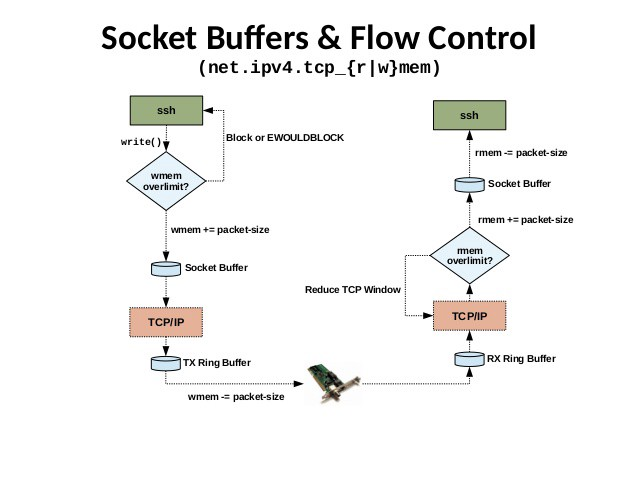

# Case study: Network bottlenecks on a Linux server

> [https://medium.com/@oscar.eriks/case-study-network-bottlenecks-on-a-linux-server-part-2-the-kernel-88cf614aae70](https://medium.com/@oscar.eriks/case-study-network-bottlenecks-on-a-linux-server-part-2-the-kernel-88cf614aae70)


# The Kernel Socket Buffer

The next place that the packets get stored at, is in the kernel’s socket buffer. This is basically performed in the following way:

1. The NIC puts a new packet it received in its own ring buffer,
2. Then the kernel does something called an “interrupt” (the topic of the next part in this series), which is sort of the kernel asking the NIC if there are any unhandled packets in the NIC ring buffer, and if there are:
3. The kernel copies the packet data from the NIC ring buffer to the part of the machine’s RAM allocated for the kernel, in something called the “socket receive buffer,”
4. The NIC finally removed the packet from its own ring buffer to free up space for future packets.

Likely the above depends on which system you’re using, but basically that is what happens.

There’s actually two socket buffers; one receive buffer and one write buffer. A simple visualization of two different machines talking to each other can be seen here:




The size of these two buffers can be modified, but we can’t just set the buffer size to a huge number, since it could make the “garbage collection” take long enough time to cause other issues, such as random latency spikes.

If the buffer is totally full when new data comes in, and no more GC can be performed, new data will be dropped.

## Collapsing

When the kernel socket buffer is nearing its max size, a procedure called “collapsing” is performed, which is sort of like garbage collection. The kernel tries to identify [segments](https://en.wikipedia.org/wiki/Transmission_Control_Protocol#TCP_segment_structure) in the buffer that has identical metadata, and tries to combine them, so as to not have identical metadata filling up the buffer. The size of the buffer should be large enough to avoid collapsing to happen too often, but small enough so that when it does happen it won’t block other operations for too long.


## Pruning

When no more collapsing can happen, the “pruning” process starts. Pruning is the act of dropping new packets, since they can’t fit in the buffer.

Red Hat’s [Performance Tuning Guide](https://access.redhat.com/sites/default/files/attachments/20150325_network_performance_tuning.pdf) describes it like this:

> This is a kind of house-keeping where the kernel will try the free space in the receive queue by reducing overhead. However, this operation comes at a CPU cost. If collapsing fails to free sufficient space for additional traffic, then data is “pruned”, meaning the data is dropped from memory and the packet is lost. Therefore, it best to tune around this condition and avoid the buffer collapsing and pruning altogether. The first step is to identify whether buffer collapsing and pruning is occurring.


## Monitoring collapsing and pruning

There’s a great deal of information to be gleamed from the _/proc/_ file system when troubleshooting Linux machines. When investigating the network, two nice tools to use is _netstat_ and _ethtool_. To check if we actually are experiencing collapsing/pruning:

```
[root@host ~]# netstat -s | egrep "(collapse|prune)"
 10051 packets pruned from receive queue because of socket buffer overrun
 343734 packets collapsed in receive queue due to low socket buffer
```

These number tells you how many packets where collapsed and pruned since the system was restarted or the driver was re-loaded. Wait for a while and run the command again. If the values are increasing, something might not work as intended (collapsing is sort of okay; pruning we don’t like).

A tip is to setup monitoring of these numbers and send it to a dashboard.

## Tweaking how collapsing and pruning happens

One thing that can in some cases be a bottleneck is the *size* of the socket buffer. Normally the size might be enough for your application, but a sudden surge in traffic might make it overflow briefly. On the other hand, setting it too high might cause the collapsing procedure to take too long time to finish, and cause other pieces of the machinery to time out.

Check the current sizes of the read/write buffers:

```
[root@host ~]# sysctl -a | egrep "tcp_(r|w)mem"
net.ipv4.tcp_rmem = 4096 1048576 4194304
net.ipv4.tcp_wmem = 4096 1048576 4194304
```

These numbers tell the kernel to allocate between 4 KiB and 4 MiB for the receive buffer, with the default starting size of 1 MiB. A great [in-depth report from the guys at Cloudflare](https://blog.cloudflare.com/the-story-of-one-latency-spike/) shows how they used tools such as _stap_ to analytically show how changes like these made a difference. They concluded their discussion on this specific setting with:

> Since the receive buffer sizes are fairly large, garbage collection could take a long time. To test this we reduced the max rmem size to 2MiB and repeated the latency measurements. \[…\] Now, these numbers are so much better. With the changed settings the tcp\_collapse never took more than 3ms!

The takeaway here is to _not blindly copy numbers_ that worked for someone else, but instead first measure your current situation to have a baseline, and validate any changes you make against that.


